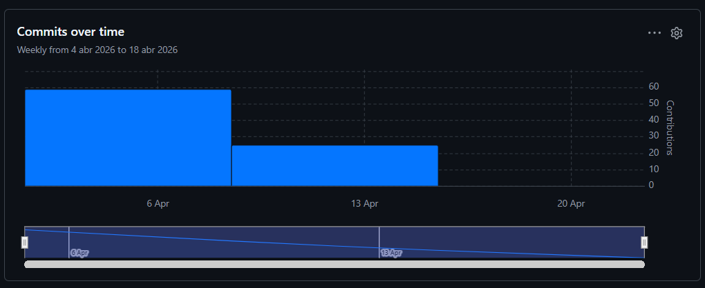
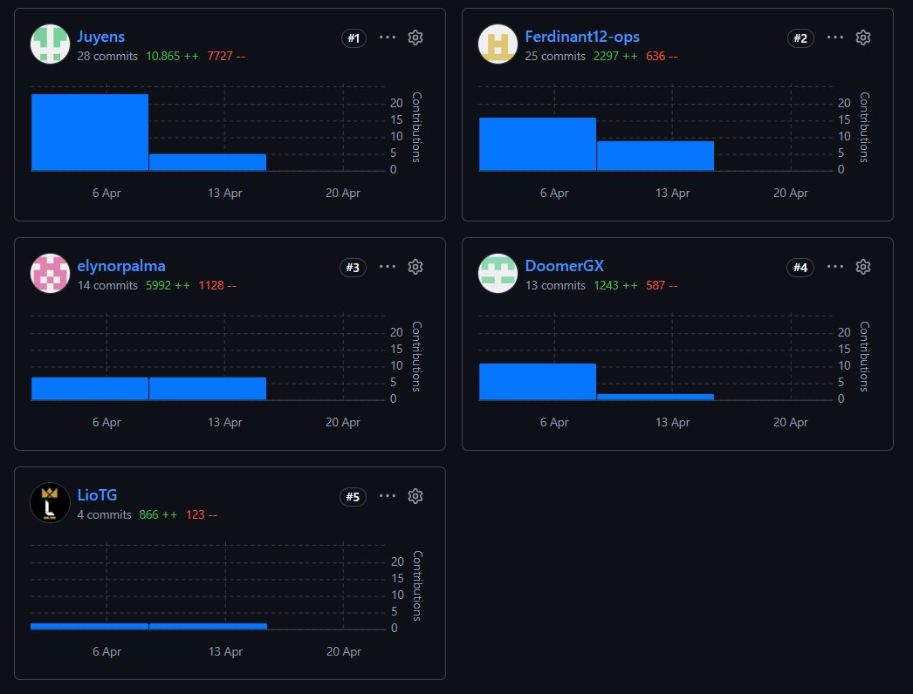

---

### Universidad Peruana de Ciencias Aplicadas

<small>Facultad de Ingeniería &nbsp;·&nbsp; Ingeniería de Software &nbsp;·&nbsp; 5to Ciclo</small>

Desarrollo de Aplicaciones Open Source

<small>NRC: 11990 &nbsp;·&nbsp; Profesor: Juan Antonio Flores Moroco</small>

### Informe del Trabajo Final

<small>Startup &nbsp;·&nbsp; Kauflink</small>

<small>Producto &nbsp;·&nbsp; Entreprenly</small>

### Integrantes

| Código     | Alumno                             |
| :--------: | :--------------------------------: |
| u20241d992 | Camargo Briceño, Joseph Julius     |
| u202414715 | Peirano Brun, Jose Antonio         |
| u20241a972 | Palma De Los Santos, Elynor Mikela |  
| u20241a290 | Flores Pinchi, Jose Fernando       |
| u202416151 | Chavez Carrasco, Lionel Abraham    |

<small>Abril &nbsp;·&nbsp; 2026</small>

---

# Registro de Versiones del Informe

| Versión  | Fecha          | Autor                 | Descripción de modificación |
| :------: | :------------: | :-------------------: | :-------------------------: |
| AV1      | 02 / 04 / 2026 | Todos los integrantes | Primera versión             |

# Project Report Collaboration Insights

En esta sección se presenta la evidencia de colaboración del equipo Kauflink durante el desarrollo de la entrega AV1 del Trabajo Final. La colaboración se llevó a cabo de forma distribuida a través de dos repositorios principales en GitHub: el repositorio del informe del proyecto (`daop-entreprenly`) y el repositorio del Landing Page (`landing-entreprenly`), ambos bajo la organización [Kauflink](https://github.com/Kauflink).

---

## Repositorio del Informe — `daop-entreprenly`

**URL:** https://github.com/Kauflink/daop-entreprenly

Durante la elaboración de la AV1, los cinco integrantes del equipo contribuyeron en la redacción y revisión del informe, distribuyendo la carga de trabajo por capítulos. El trabajo se organizó en ramas por capítulo siguiendo el flujo GitFlow, con integraciones periódicas a la rama `main` mediante Pull Requests.

### Distribución de contribuciones por integrante

<table border="1" cellpadding="8" cellspacing="0" style="border-collapse: collapse; width: 100%;">
  <thead>
    <tr>
      <th>Integrante</th>
      <th>Secciones principales del informe</th>
    </tr>
  </thead>
  <tbody>
    <tr>
      <td>Camargo Briceño, Joseph Julius</td>
      <td>1.1 Startup Profile · 1.1.1 Descripción de la Startup · 5.1 Software Configuration Management · 5.2.1 Sprint 1 (Sprint Planning, Sprint Backlog, Development Evidence, Deployment Evidence, Team Collaboration Insights)</td>
    </tr>
    <tr>
      <td>Chavez Carrasco, Lionel Abraham</td>
      <td>4.1 Style Guidelines · 4.3 Landing Page UI Design (Wireframes y Mock-ups) · 4.4 Web Applications UX/UI Design · 5.2.1.5 Execution Evidence for Sprint Review</td>
    </tr>
    <tr>
      <td>Palma De Los Santos, Elynor Mikela</td>
      <td>2.2 Entrevistas · 2.3 Needfinding (User Personas, Empathy Mapping, User Journey Mapping) · 3.1 User Stories (criterios de aceptación) · Student Outcome</td>
    </tr>
    <tr>
      <td>Peirano Brun, José Antonio</td>
      <td>2.1 Competidores · 2.4 Big Picture Event Storming · 4.6 Domain-Driven Software Architecture · 4.7 Software Object-Oriented Design</td>
    </tr>
    <tr>
      <td>Flores Pinchi, José Fernando</td>
      <td>1.2 Solution Profile · 1.3 Segmentos objetivo · 3.2 Impact Mapping · 3.3 Product Backlog · 4.8 Database Design</td>
    </tr>
  </tbody>
</table>

---

## Repositorio del Landing Page — `landing-entreprenly`

**URL:** https://github.com/Kauflink/landing-entreprenly

Durante el Sprint 1 (18–20 de abril de 2026), el equipo realizó un total de **20 commits** en el repositorio del Landing Page. El trabajo se distribuyó en 5 Pull Requests desde la rama `develop` hacia `main`, siguiendo la estrategia GitFlow acordada. A continuación se detalla la participación por integrante:

### Contribuciones por integrante

<table border="1" cellpadding="8" cellspacing="0" style="border-collapse: collapse; width: 100%;">
  <thead>
    <tr>
      <th>Integrante</th>
      <th>GitHub Username</th>
      <th>Commits (aprox.)</th>
      <th>Área de contribución</th>
    </tr>
  </thead>
  <tbody>
    <tr>
      <td>Camargo Briceño, Joseph Julius</td>
      <td>Juyens</td>
      <td>9</td>
      <td>Configuración inicial del repositorio · .gitignore · README · CNAME · Workflow de GitHub Actions (4 iteraciones) · Merge PR #1</td>
    </tr>
    <tr>
      <td>Chavez Carrasco, Lionel Abraham</td>
      <td>LioTG</td>
      <td>4</td>
      <td>feat: controles de tema e idioma + CTAs · feat: animaciones hero y fade de tema · Merge PRs #2 y #3</td>
    </tr>
    <tr>
      <td>Palma De Los Santos, Elynor Mikela</td>
      <td>elynorpalma</td>
      <td>2</td>
      <td>fix: corrección de tildes · fix: ortografía arreglada</td>
    </tr>
    <tr>
      <td>Peirano Brun, José Antonio</td>
      <td>DoomerGX</td>
      <td>2</td>
      <td>app:Correccion · app:CorreccionPalabras</td>
    </tr>
    <tr>
      <td>Flores Pinchi, José Fernando</td>
      <td>Ferdinant12-ops</td>
      <td>3</td>
      <td>Estructura base del Landing Page (secciones hero, funcionalidades, planes, footer) · app:CorreccionTilde · Merge PR #5</td>
    </tr>
  </tbody>
</table>

### Resumen de Pull Requests — Sprint 1

<table border="1" cellpadding="8" cellspacing="0" style="border-collapse: collapse; width: 100%;">
  <thead>
    <tr>
      <th>PR #</th>
      <th>Commit de merge</th>
      <th>Descripción</th>
      <th>Fecha</th>
    </tr>
  </thead>
  <tbody>
    <tr>
      <td>PR #1</td>
      <td>5088424</td>
      <td>Primera integración: estructura base, .gitignore y README</td>
      <td>2026-04-18</td>
    </tr>
    <tr>
      <td>PR #2</td>
      <td>32ab091</td>
      <td>Controles de tema e idioma + mejoras de CTAs</td>
      <td>2026-04-19</td>
    </tr>
    <tr>
      <td>PR #3</td>
      <td>9136aed</td>
      <td>Animaciones de transición en hero y fade de tema</td>
      <td>2026-04-19</td>
    </tr>
    <tr>
      <td>PR #4</td>
      <td>846f934</td>
      <td>Correcciones ortográficas y de tildes</td>
      <td>2026-04-19</td>
    </tr>
    <tr>
      <td>PR #5</td>
      <td>7b8ccfc</td>
      <td>Correcciones finales de contenido</td>
      <td>2026-04-20</td>
    </tr>
  </tbody>
</table>

---

# Contenido

### Capítulo I: Introducción
- [1.1. Startup Profile](docs/capitulo-1.md#11-startup-profile)
  - [1.1.1. Descripción de la Startup](docs/capitulo-1.md#111-descripción-de-la-startup)
  - [1.1.2. Perfiles de integrantes del equipo](docs/capitulo-1.md#112-perfiles-de-integrantes-del-equipo)
- [1.2. Solution Profile](docs/capitulo-1.md#12-solution-profile)
  - [1.2.1. Antecedentes y problemática](docs/capitulo-1.md#121-antecedentes-y-problemática)
  - [1.2.2. Lean UX Process](docs/capitulo-1.md#122-lean-ux-process)
    - [1.2.2.1. Lean UX Problem Statements](docs/capitulo-1.md#1221-lean-ux-problem-statements)
    - [1.2.2.2. Lean UX Assumptions](docs/capitulo-1.md#1222-lean-ux-assumptions)
    - [1.2.2.3. Lean UX Hypothesis Statements](docs/capitulo-1.md#1223-lean-ux-hypothesis-statements)
    - [1.2.2.4. Lean UX Canvas](docs/capitulo-1.md#1224-lean-ux-canvas)
- [1.3. Segmentos objetivo](docs/capitulo-1.md#13-segmentos-objetivo)

### Capítulo II: Requirements Elicitation & Analysis
- [2.1. Competidores](docs/capitulo-2.md#21-competidores)
  - [2.1.1. Análisis competitivo](docs/capitulo-2.md#211-análisis-competitivo)
  - [2.1.2. Estrategias y tácticas frente a competidores](docs/capitulo-2.md#212-estrategias-y-tácticas-frente-a-competidores)
- [2.2. Entrevistas](docs/capitulo-2.md#22-entrevistas)
  - [2.2.1. Diseño de entrevistas](docs/capitulo-2.md#221-diseño-de-entrevistas)
  - [2.2.2. Registro de entrevistas](docs/capitulo-2.md#222-registro-de-entrevistas)
  - [2.2.3. Análisis de entrevistas](docs/capitulo-2.md#223-análisis-de-entrevistas)
- [2.3. Needfinding](docs/capitulo-2.md#23-needfinding)
  - [2.3.1. User Personas](docs/capitulo-2.md#231-user-personas)
  - [2.3.2. User Task Matrix](docs/capitulo-2.md#232-user-task-matrix)
  - [2.3.3. User Journey Mapping](docs/capitulo-2.md#233-user-journey-mapping)
  - [2.3.4. Empathy Mapping](docs/capitulo-2.md#234-empathy-mapping)
- [2.4. Big Picture Event Storming](docs/capitulo-2.md#24-big-picture-event-storming)
- [2.5. Ubiquitous Language](docs/capitulo-2.md#25-ubiquitous-language)

### Capítulo III: Requirements Specification
- [3.1. User Stories](docs/capitulo-3.md#31-user-stories)
- [3.2. Impact Mapping](docs/capitulo-3.md#32-impact-mapping)
- [3.3. Product Backlog](docs/capitulo-3.md#33-product-backlog)

### Capítulo IV: Product Design
- [4.1. Style Guidelines](docs/capitulo-4.md#41-style-guidelines)
  - [4.1.1. General Style Guidelines](docs/capitulo-4.md#411-general-style-guidelines)
  - [4.1.2. Web Style Guidelines](docs/capitulo-4.md#412-web-style-guidelines)
- [4.2. Information Architecture](docs/capitulo-4.md#42-information-architecture)
  - [4.2.1. Organization Systems](docs/capitulo-4.md#421-organization-systems)
  - [4.2.2. Labeling Systems](docs/capitulo-4.md#422-labeling-systems)
  - [4.2.3. SEO Tags and Meta Tags](docs/capitulo-4.md#423-seo-tags-and-meta-tags)
  - [4.2.4. Searching Systems](docs/capitulo-4.md#424-searching-systems)
  - [4.2.5. Navigation Systems](docs/capitulo-4.md#425-navigation-systems)
- [4.3. Landing Page UI Design](docs/capitulo-4.md#43-landing-page-ui-design)
  - [4.3.1. Landing Page Wireframe](docs/capitulo-4.md#431-landing-page-wireframe)
  - [4.3.2. Landing Page Mock-up](docs/capitulo-4.md#432-landing-page-mock-up)
- [4.4. Web Applications UX/UI Design](docs/capitulo-4.md#44-web-applications-uxui-design)
  - [4.4.1. Web Applications Wireframes](docs/capitulo-4.md#441-web-applications-wireframes)
  - [4.4.2. Web Applications Wireflow Diagrams](docs/capitulo-4.md#442-web-applications-wireflow-diagrams)
  - [4.4.3. Web Applications Mock-ups](docs/capitulo-4.md#443-web-applications-mock-ups)
  - [4.4.4. Web Applications User Flow Diagrams](docs/capitulo-4.md#444-web-applications-user-flow-diagrams)
- [4.5. Web Applications Prototyping](docs/capitulo-4.md#45-web-applications-prototyping)
- [4.6. Domain-Driven Software Architecture](docs/capitulo-4.md#46-domain-driven-software-architecture)
  - [4.6.1. Design-Level Event Storming](docs/capitulo-4.md#461-design-level-event-storming)
  - [4.6.2. Software Architecture Context Diagram](docs/capitulo-4.md#462-software-architecture-context-diagram)
  - [4.6.3. Software Architecture Container Diagrams](docs/capitulo-4.md#463-software-architecture-container-diagrams)
  - [4.6.4. Software Architecture Components Diagrams](docs/capitulo-4.md#464-software-architecture-components-diagrams)
- [4.7. Software Object-Oriented Design](docs/capitulo-4.md#47-software-object-oriented-design)
  - [4.7.1. Class Diagrams](docs/capitulo-4.md#471-class-diagrams)
- [4.8. Database Design](docs/capitulo-4.md#48-database-design)
  - [4.8.1. Database Diagrams](docs/capitulo-4.md#481-database-diagrams)

### Capítulo V: Product Implementation, Validation & Deployment
- [5.1. Software Configuration Management](docs/capitulo-5.md#51-software-configuration-management)
  - [5.1.1. Software Development Environment Configuration](docs/capitulo-5.md#511-software-development-environment-configuration)
  - [5.1.2. Source Code Management](docs/capitulo-5.md#512-source-code-management)
  - [5.1.3. Source Code Style Guide & Conventions](docs/capitulo-5.md#513-source-code-style-guide--conventions)
  - [5.1.4. Software Deployment Configuration](docs/capitulo-5.md#514-software-deployment-configuration)
- [5.2. Landing Page, Services & Applications Implementation](docs/capitulo-5.md#52-landing-page-services--applications-implementation)
  - [5.2.1. Sprint 1](docs/capitulo-5.md#521-sprint-1)
    - [5.2.1.1. Sprint Planning 1](docs/capitulo-5.md#5211-sprint-planning-1)
    - [5.2.1.2. Aspect Leaders and Collaborators](docs/capitulo-5.md#5212-aspect-leaders-and-collaborators)
    - [5.2.1.3. Sprint Backlog 1](docs/capitulo-5.md#5213-sprint-backlog-1)
    - [5.2.1.4. Development Evidence for Sprint Review](docs/capitulo-5.md#5214-development-evidence-for-sprint-review)
    - [5.2.1.5. Execution Evidence for Sprint Review](docs/capitulo-5.md#5215-execution-evidence-for-sprint-review)
    - [5.2.1.6. Services Documentation Evidence for Sprint Review](docs/capitulo-5.md#5216-services-documentation-evidence-for-sprint-review)
    - [5.2.1.7. Software Deployment Evidence for Sprint Review](docs/capitulo-5.md#5217-software-deployment-evidence-for-sprint-review)
    - [5.2.1.8. Team Collaboration Insights during Sprint](docs/capitulo-5.md#5218-team-collaboration-insights-during-sprint)
- [5.3. Validation Interviews](docs/capitulo-5.md#53-validation-interviews)
  - [5.3.1. Diseño de Entrevistas](docs/capitulo-5.md#531-diseño-de-entrevistas)
  - [5.3.2. Registro de Entrevistas](docs/capitulo-5.md#532-registro-de-entrevistas)
  - [5.3.3. Evaluaciones según heurísticas](docs/capitulo-5.md#533-evaluaciones-según-heurísticas)
- [5.4. Video About-the-Product](docs/capitulo-5.md#54-video-about-the-product)

---

- [Conclusiones y recomendaciones](docs/conclusiones.md)
- [Video About-the-Team](docs/video-about-the-team.md)
- [Bibliografía](docs/bibliografia.md)
- [Anexos](docs/anexos.md)

---

# Student Outcome

En esta sección se detallan las actividades realizadas en el trabajo final y el sustento de cómo estas han ayudado a desarrollar las dimensiones del Student Outcome 3 (ABET – EAC), el cual se define como la capacidad de comunicarse efectivamente con un rango de audiencias. La información se presenta a través del siguiente cuadro, donde se especifican las dimensiones de la competencia, las acciones realizadas por cada integrante y las conclusiones generales del equipo.

<table>
  <thead>
    <tr>
      <th>Criterio específico</th>
      <th>Acciones realizadas</th>
      <th>Conclusiones</th>
    </tr>
  </thead>
  <tbody>
    <tr>
      <td>Comunica oralmente con efectividad a diferentes rangos de audiencia.</td>
      <td>
        <strong>Camargo Briceño, Joseph Julius</strong> 
        <em>AV1:</em> Lideró la reunión de Sprint Planning 1 vía Discord, comunicando el sprint goal, el alcance del entregable y la distribución de tareas al equipo de forma clara y estructurada. Participó en las entrevistas con usuarios del segmento objetivo (comerciantes de retail), adaptando el lenguaje técnico a una audiencia no especializada para validar la problemática identificada en la startup Kauflink.  
        <strong>Peirano Brun, José Antonio</strong> 
        <em>AV1:</em> Participó activamente en las sesiones de needfinding y en las reuniones de coordinación del equipo, comunicando sus observaciones y propuestas de mejora de forma oral ante sus compañeros. Colaboró en la exposición de hallazgos derivados del análisis competitivo y del proceso de Lean UX, dirigiendo sus argumentos tanto a una audiencia técnica (el equipo) como a la audiencia representada por los User Personas definidos.  
        <strong>Palma De Los Santos, Elynor Mikela</strong> 
        <em>AV1:</em> Participó en las sesiones de entrevistas con usuarios del segmento objetivo, formulando preguntas con claridad y adaptando el registro comunicativo según el perfil del entrevistado (comerciante o consumidor). Expuso sus hallazgos ante el equipo durante las reuniones de análisis, contribuyendo a la construcción colectiva de los User Personas y el Empathy Map.  
        <strong>Flores Pinchi, José Fernando</strong> 
        <em>AV1:</em> Participó en la reunión de Sprint Planning 1 y en las sesiones de coordinación del equipo, comunicando sus aportes al desarrollo del Landing Page de forma comprensible ante sus compañeros. Colaboró en la discusión oral de decisiones de diseño y estructura de contenido, justificando sus elecciones con argumentos orientados al usuario final.  
        <strong>Chavez Carrasco, Lionel Abraham</strong> 
        <em>AV1:</em> Propuso y sustentó oralmente ante el equipo las decisiones de diseño interactivo del Landing Page, incluyendo la implementación del switch de tema claro/oscuro, el selector de idioma y las animaciones del hero. Comunicó con precisión técnica las soluciones adoptadas durante el Sprint, siendo capaz de explicar decisiones de implementación tanto a compañeros técnicos como a miembros del equipo con perfiles distintos.
      </td>
      <td>
        En la entrega AV1, el equipo desarrolló la capacidad de comunicación oral efectiva en dos contextos diferenciados: con audiencias externas no técnicas (comerciantes y consumidores entrevistados durante el needfinding) y con audiencias técnicas internas (reuniones de Sprint Planning y sesiones de coordinación por Discord). La realización de entrevistas permitió a cada integrante practicar la adaptación del lenguaje según el perfil del interlocutor, evitando tecnicismos innecesarios al comunicarse con usuarios finales. Las reuniones de equipo, por su parte, fortalecieron la capacidad de argumentar decisiones de diseño y desarrollo de manera estructurada ante pares de ingeniería. Este proceso evidencia el inicio del desarrollo de la competencia de comunicación oral efectiva con distintos rangos de audiencia.
      </td>
    </tr>
    <tr>
      <td>Comunica por escrito con efectividad a diferentes rangos de audiencia.</td>
      <td>
        <strong>Camargo Briceño, Joseph Julius</strong> 
        <em>AV1:</em> Redactó la descripción de la startup, misión, visión y valores en el Capítulo I, adaptando el tono a una audiencia académica y de negocio. Documentó las convenciones de GitFlow, Semantic Versioning y Conventional Commits en el informe técnico (Capítulo V), comunicando con precisión las reglas de contribución al repositorio para una audiencia desarrolladora. Elaboró la documentación del pipeline de CI/CD y el proceso de despliegue en GitHub Pages, redactando instrucciones técnicas paso a paso comprensibles para el equipo.  
        <strong>Peirano Brun, José Antonio</strong> 
        <em>AV1:</em> Contribuyó en la redacción de secciones del informe técnico (Capítulos I–III), manteniendo un registro formal apropiado para una audiencia académica. Colaboró en la corrección del contenido textual del Landing Page, asegurando que los mensajes dirigidos a comerciantes y consumidores fueran coherentes, sin errores y comprensibles para una audiencia general sin formación técnica.  
        <strong>Palma De Los Santos, Elynor Mikela</strong> 
        <em>AV1:</em> Lideró la revisión y corrección ortográfica y de redacción del contenido textual del Landing Page de Entreprenly, garantizando que la comunicación escrita dirigida a los visitantes (comerciantes y clientes finales) fuera profesional y libre de errores. Participó en la redacción de User Stories y criterios de aceptación en el Capítulo III, usando un formato estructurado (Given-When-Then) orientado a comunicar requerimientos de forma clara a audiencias técnicas y no técnicas.  
        <strong>Flores Pinchi, José Fernando</strong> 
        <em>AV1:</em> Colaboró en el desarrollo de la estructura base del Landing Page, produciendo contenido escrito (textos del hero, sección de funcionalidades, planes y footer) dirigido a una audiencia de usuarios finales. Participó en la corrección de redacción y ortografía del Landing Page y aportó a la documentación del informe técnico, contribuyendo a mantener la coherencia del tono escrito a lo largo del documento.  
        <strong>Chavez Carrasco, Lionel Abraham</strong> 
        <em>AV1:</em> Desarrolló el contenido escrito del Landing Page de Entreprenly —incluyendo headlines, descripciones de funcionalidades, CTAs diferenciados por segmento y textos de la sección de planes— comunicando la propuesta de valor del producto a una audiencia de comerciantes y consumidores finales en registro no técnico. Documentó las guías de estilo CSS, las convenciones de TypeScript y las decisiones de arquitectura frontend en el Capítulo IV, produciendo documentación técnica estructurada para audiencias de desarrollo.
      </td>
      <td>
        A lo largo de la entrega AV1, el equipo produjo comunicación escrita dirigida a tres audiencias diferenciadas: una audiencia académica (el informe técnico con los Capítulos I al V, redactado con registro formal y estructurado), una audiencia de usuarios finales (el Landing Page de Entreprenly, con textos publicitarios, propuesta de valor y CTAs adaptados al segmento de comerciantes y consumidores peruanos), y una audiencia técnica de desarrollo (documentación de convenciones de código, GitFlow, configuración de CI/CD y diagramas de arquitectura). La coexistencia de estos tres registros escritos en un mismo entregable evidencia que el equipo ha iniciado el desarrollo de la capacidad de comunicación escrita efectiva con distintos rangos de audiencia, ajustando vocabulario, nivel de formalidad y estructura según el destinatario en cada contexto.
      </td>
    </tr>
  </tbody>
</table>