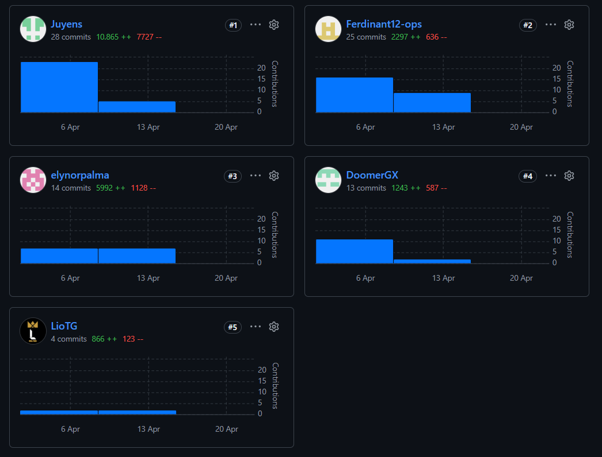
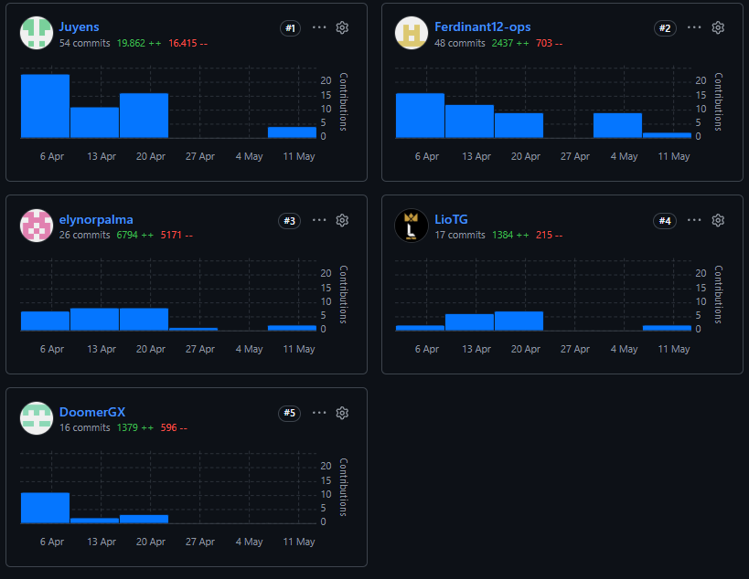

---

### Universidad Peruana de Ciencias Aplicadas

<small>Facultad de Ingeniería &nbsp;·&nbsp; Ingeniería de Software &nbsp;·&nbsp; 5to Ciclo</small>

Desarrollo de Aplicaciones Open Source

<small>NRC: 11990 &nbsp;·&nbsp; Profesor: Juan Antonio Flores Moroco</small>

### Informe del Trabajo Final

<small>Startup &nbsp;·&nbsp; Kauflink</small>

<small>Producto &nbsp;·&nbsp; Entreprenly</small>

### Integrantes

| Código     | Alumno                             |
| :--------: | :--------------------------------: |
| u20241d992 | Camargo Briceño, Joseph Julius     |
| u202414715 | Peirano Brun, Jose Antonio         |
| u20241a972 | Palma De Los Santos, Elynor Mikela |  
| u20241a290 | Flores Pinchi, Jose Fernando       |
| u202416151 | Chavez Carrasco, Lionel Abraham    |

<small>Abril &nbsp;·&nbsp; 2026</small>

---

# Registro de Versiones del Informe

| Versión  | Fecha          | Autor                 | Descripción de modificación |
| :------: | :------------: | :-------------------: | :-------------------------: |
| AV1      | 02 / 04 / 2026 | Todos los integrantes | Primera versión             |
| TB1      | 12 / 05 / 2026 | Todos los integrantes | Segunda versión             |
| AV2      | 12 / 06 / 2026 | Todos los integrantes | Tercera versión             |

# Project Report Collaboration Insights

En esta sección se presenta la evidencia de colaboración del equipo Kauflink durante el desarrollo del AV1, TB1 y AV2 del Trabajo Final. La elaboración del informe se llevó a cabo de forma distribuida a través del repositorio (`daop-entreprenly`) bajo la organización [Kauflink](https://github.com/Kauflink), donde todos los miembros del equipo participaron activamente mediante commits y revisiones a lo largo del desarrollo de cada entrega.

## Repositorio del Informe — `daop-entreprenly`

**URL:** https://github.com/Kauflink/daop-entreprenly

---

### **AV1: Entregable Inicial**

Durante la elaboración de la AV1, los cinco integrantes del equipo contribuyeron en la redacción y revisión del informe, distribuyendo la carga de trabajo por capítulos. El trabajo se organizó en ramas por capítulo siguiendo el flujo GitFlow, con integraciones periódicas a la rama `main` mediante Pull Requests.

#### Distribución de contribuciones por integrante (AV1)

| Integrante | Secciones principales del informe |
| :--- | :--- |
| Camargo Briceño, Joseph Julius | 1.1 Startup Profile · 1.1.1 Descripción de la Startup · 5.1 Software Configuration Management · 5.2.1 Sprint 1 (Sprint Planning, Sprint Backlog, Development Evidence, Deployment Evidence, Team Collaboration Insights) |
| Chavez Carrasco, Lionel Abraham | 4.1 Style Guidelines · 4.3 Landing Page UI Design (Wireframes y Mock-ups) · 4.4 Web Applications UX/UI Design · 5.2.1.5 Execution Evidence for Sprint Review |
| Palma De Los Santos, Elynor Mikela | 2.2 Entrevistas · 2.3 Needfinding (User Personas, Empathy Mapping, User Journey Mapping) · 3.1 User Stories (criterios de aceptación) · Student Outcome |
| Peirano Brun, José Antonio | 2.1 Competidores · 2.4 Big Picture Event Storming · 4.6 Domain-Driven Software Architecture · 4.7 Software Object-Oriented Design |
| Flores Pinchi, José Fernando | 1.2 Solution Profile · 1.3 Segmentos objetivo · 3.2 Impact Mapping · 3.3 Product Backlog · 4.8 Database Design |

---

### **TB1: Consolidación de Arquitectura y Sprint 2**

Para la entrega TB1, el equipo se enfocó en la definición técnica de los Bounded Contexts y la ejecución del segundo Sprint, aplicando las correcciones indicadas por el docente y finalizando la documentación base del proyecto.

#### Distribución de contribuciones por integrante (TB1)

| Integrante | Secciones principales del informe |
| :--- | :--- |
| Camargo Briceño, Joseph Julius | 5.2.2.8 Team Collaboration Insights during Sprint · Bounded Context: Perfil y Configuración · Documentación de Performance del Sistema · Consolidación y Revisión de Redacción Académica TB1 |
| Chavez Carrasco, Lionel Abraham | 5.2.2.3 Sprint Backlog 2 · Bounded Context: Gestión y Proceso de Suscripción · User Stories de la Landing Page · 5.2.2.5 Execution Evidence for Sprint Review |
| Palma De Los Santos, Elynor Mikela | 5.2.2.6 Services Documentation Evidence for Sprint Review · Bounded Context: ChatBot · Actualización de Diagramas de Clases, Structurizer y Diagrama de Base de Datos · Student Outcome TB1 |
| Peirano Brun, José Antonio | 5.2.2.2 Aspect Leaders and Collaborators · Bounded Context: Gestión de Inventario · 5.2.2.7 Software Deployment Evidence for Sprint Review · Revisión y Mantenimiento del Repositorio |
| Flores Pinchi, José Fernando | 5.2.2.1 Sprint Planning 2 · 5.2.2.4 Development Evidence for Sprint Review · Bounded Context: Ventas · Elaboración de la Presentación (PPT) · Avance de Conclusiones, Bibliografía y Anexos |

---

### **AV2: Implementación de Backend, Validación y Cierre del Proyecto**

Para la entrega AV2, el equipo se enfocó en la implementación del backend de los Bounded Contexts mediante servicios RESTful, la mejora visual y el diseño responsive de las aplicaciones, la ejecución de las entrevistas de validación con usuarios del segmento objetivo y la incorporación de las correcciones finales sobre el informe. El trabajo se desarrolló bajo el flujo GitFlow, con integraciones a la rama `main` mediante Pull Requests.

#### Distribución de contribuciones por integrante (AV2)

| Integrante | Secciones principales del informe |
| :--- | :--- |
| Camargo Briceño, Joseph Julius | Backend del Bounded Context: Perfil y Configuración · Mejora visual y diseño responsive del Bounded Context · Redacción del Sprint 3 · Actualización del Landing Page |
| Chavez Carrasco, Lionel Abraham | Backend del Bounded Context: Gestión y Proceso de Suscripción · Mejora visual y diseño responsive del Bounded Context · Redacción de la Evaluación Heurística (5.3.3) · Actualización del Landing Page |
| Palma De Los Santos, Elynor Mikela | Backend del Bounded Context: ChatBot · Mejora visual y diseño responsive del Bounded Context · Actualización del Class Diagram y del Diagrama de Base de Datos (Capítulo IV) · Entrevistas de Validación y entrevistas About the Product |
| Peirano Brun, José Antonio | Backend del Bounded Context: Gestión de Inventario · Mejora visual y diseño responsive del Bounded Context · Revisión de errores de las User Stories (Capítulo III) · Actualización de los diagramas Structurizr y de la Evaluación Heurística |
| Flores Pinchi, José Fernando | Backend del Bounded Context: Ventas · Mejora visual y diseño responsive del Bounded Context · Revisión de errores del Capítulo III · Entrevistas de Validación y entrevistas About the Product |

# Contenido

### Capítulo I: Introducción
- [1.1. Startup Profile](docs/capitulo-1.md#11-startup-profile)
  - [1.1.1. Descripción de la Startup](docs/capitulo-1.md#111-descripción-de-la-startup)
  - [1.1.2. Perfiles de integrantes del equipo](docs/capitulo-1.md#112-perfiles-de-integrantes-del-equipo)
- [1.2. Solution Profile](docs/capitulo-1.md#12-solution-profile)
  - [1.2.1. Antecedentes y problemática](docs/capitulo-1.md#121-antecedentes-y-problemática)
  - [1.2.2. Lean UX Process](docs/capitulo-1.md#122-lean-ux-process)
    - [1.2.2.1. Lean UX Problem Statements](docs/capitulo-1.md#1221-lean-ux-problem-statements)
    - [1.2.2.2. Lean UX Assumptions](docs/capitulo-1.md#1222-lean-ux-assumptions)
    - [1.2.2.3. Lean UX Hypothesis Statements](docs/capitulo-1.md#1223-lean-ux-hypothesis-statements)
    - [1.2.2.4. Lean UX Canvas](docs/capitulo-1.md#1224-lean-ux-canvas)
- [1.3. Segmentos objetivo](docs/capitulo-1.md#13-segmentos-objetivo)

### Capítulo II: Requirements Elicitation & Analysis
- [2.1. Competidores](docs/capitulo-2.md#21-competidores)
  - [2.1.1. Análisis competitivo](docs/capitulo-2.md#211-análisis-competitivo)
  - [2.1.2. Estrategias y tácticas frente a competidores](docs/capitulo-2.md#212-estrategias-y-tácticas-frente-a-competidores)
- [2.2. Entrevistas](docs/capitulo-2.md#22-entrevistas)
  - [2.2.1. Diseño de entrevistas](docs/capitulo-2.md#221-diseño-de-entrevistas)
  - [2.2.2. Registro de entrevistas](docs/capitulo-2.md#222-registro-de-entrevistas)
  - [2.2.3. Análisis de entrevistas](docs/capitulo-2.md#223-análisis-de-entrevistas)
- [2.3. Needfinding](docs/capitulo-2.md#23-needfinding)
  - [2.3.1. User Personas](docs/capitulo-2.md#231-user-personas)
  - [2.3.2. User Task Matrix](docs/capitulo-2.md#232-user-task-matrix)
  - [2.3.3. User Journey Mapping](docs/capitulo-2.md#233-user-journey-mapping)
  - [2.3.4. Empathy Mapping](docs/capitulo-2.md#234-empathy-mapping)
- [2.4. Big Picture Event Storming](docs/capitulo-2.md#24-big-picture-event-storming)
- [2.5. Ubiquitous Language](docs/capitulo-2.md#25-ubiquitous-language)

### Capítulo III: Requirements Specification
- [3.1. User Stories](docs/capitulo-3.md#31-user-stories)
- [3.2. Impact Mapping](docs/capitulo-3.md#32-impact-mapping)
- [3.3. Product Backlog](docs/capitulo-3.md#33-product-backlog)

### Capítulo IV: Product Design
- [4.1. Style Guidelines](docs/capitulo-4.md#41-style-guidelines)
  - [4.1.1. General Style Guidelines](docs/capitulo-4.md#411-general-style-guidelines)
  - [4.1.2. Web Style Guidelines](docs/capitulo-4.md#412-web-style-guidelines)
- [4.2. Information Architecture](docs/capitulo-4.md#42-information-architecture)
  - [4.2.1. Organization Systems](docs/capitulo-4.md#421-organization-systems)
  - [4.2.2. Labeling Systems](docs/capitulo-4.md#422-labeling-systems)
  - [4.2.3. SEO Tags and Meta Tags](docs/capitulo-4.md#423-seo-tags-and-meta-tags)
  - [4.2.4. Searching Systems](docs/capitulo-4.md#424-searching-systems)
  - [4.2.5. Navigation Systems](docs/capitulo-4.md#425-navigation-systems)
- [4.3. Landing Page UI Design](docs/capitulo-4.md#43-landing-page-ui-design)
  - [4.3.1. Landing Page Wireframe](docs/capitulo-4.md#431-landing-page-wireframe)
  - [4.3.2. Landing Page Mock-up](docs/capitulo-4.md#432-landing-page-mock-up)
- [4.4. Web Applications UX/UI Design](docs/capitulo-4.md#44-web-applications-uxui-design)
  - [4.4.1. Web Applications Wireframes](docs/capitulo-4.md#441-web-applications-wireframes)
  - [4.4.2. Web Applications Wireflow Diagrams](docs/capitulo-4.md#442-web-applications-wireflow-diagrams)
  - [4.4.3. Web Applications Mock-ups](docs/capitulo-4.md#443-web-applications-mock-ups)
  - [4.4.4. Web Applications User Flow Diagrams](docs/capitulo-4.md#444-web-applications-user-flow-diagrams)
- [4.5. Web Applications Prototyping](docs/capitulo-4.md#45-web-applications-prototyping)
- [4.6. Domain-Driven Software Architecture](docs/capitulo-4.md#46-domain-driven-software-architecture)
  - [4.6.1. Design-Level Event Storming](docs/capitulo-4.md#461-design-level-event-storming)
  - [4.6.2. Software Architecture Context Diagram](docs/capitulo-4.md#462-software-architecture-context-diagram)
  - [4.6.3. Software Architecture Container Diagrams](docs/capitulo-4.md#463-software-architecture-container-diagrams)
  - [4.6.4. Software Architecture Components Diagrams](docs/capitulo-4.md#464-software-architecture-components-diagrams)
- [4.7. Software Object-Oriented Design](docs/capitulo-4.md#47-software-object-oriented-design)
  - [4.7.1. Class Diagrams](docs/capitulo-4.md#471-class-diagrams)
- [4.8. Database Design](docs/capitulo-4.md#48-database-design)
  - [4.8.1. Database Diagrams](docs/capitulo-4.md#481-database-diagrams)
  - [4.8.2. Organización del esquema de base de datos](docs/capitulo-4.md#482-organización-del-esquema-de-base-de-datos)
  - [4.8.3. Relaciones entre tablas](docs/capitulo-4.md#483-relaciones-entre-tablas)
  - [4.8.4. Normalización aplicada](docs/capitulo-4.md#484-normalización-aplicada)

### Capítulo V: Product Implementation, Validation & Deployment
- [5.1. Software Configuration Management](docs/capitulo-5.md#51-software-configuration-management)
  - [5.1.1. Software Development Environment Configuration](docs/capitulo-5.md#511-software-development-environment-configuration)
  - [5.1.2. Source Code Management](docs/capitulo-5.md#512-source-code-management)
  - [5.1.3. Source Code Style Guide & Conventions](docs/capitulo-5.md#513-source-code-style-guide--conventions)
  - [5.1.4. Software Deployment Configuration](docs/capitulo-5.md#514-software-deployment-configuration)
- [5.2. Landing Page, Services & Applications Implementation](docs/capitulo-5.md#52-landing-page-services--applications-implementation)
  - [5.2.1. Sprint 1](docs/capitulo-5.md#521-sprint-1)
    - [5.2.1.1. Sprint Planning 1](docs/capitulo-5.md#5211-sprint-planning-1)
    - [5.2.1.2. Aspect Leaders and Collaborators](docs/capitulo-5.md#5212-aspect-leaders-and-collaborators)
    - [5.2.1.3. Sprint Backlog 1](docs/capitulo-5.md#5213-sprint-backlog-1)
    - [5.2.1.4. Development Evidence for Sprint Review](docs/capitulo-5.md#5214-development-evidence-for-sprint-review)
    - [5.2.1.5. Execution Evidence for Sprint Review](docs/capitulo-5.md#5215-execution-evidence-for-sprint-review)
    - [5.2.1.6. Services Documentation Evidence for Sprint Review](docs/capitulo-5.md#5216-services-documentation-evidence-for-sprint-review)
    - [5.2.1.7. Software Deployment Evidence for Sprint Review](docs/capitulo-5.md#5217-software-deployment-evidence-for-sprint-review)
    - [5.2.1.8. Team Collaboration Insights during Sprint](docs/capitulo-5.md#5218-team-collaboration-insights-during-sprint)
  - [5.2.2. Sprint 2](docs/capitulo-5.md#522-sprint-2)
    - [5.2.2.1. Sprint Planning 2](docs/capitulo-5.md#5221-sprint-planning-2)
    - [5.2.2.2. Aspect Leaders and Collaborators](docs/capitulo-5.md#5222-aspect-leaders-and-collaborators)
    - [5.2.2.3. Sprint Backlog 2](docs/capitulo-5.md#5223-sprint-backlog-2)
    - [5.2.2.4. Development Evidence for Sprint Review](docs/capitulo-5.md#5224-development-evidence-for-sprint-review)
    - [5.2.2.5. Execution Evidence for Sprint Review](docs/capitulo-5.md#5225-execution-evidence-for-sprint-review)
    - [5.2.2.6. Services Documentation Evidence for Sprint Review](docs/capitulo-5.md#5226-services-documentation-evidence-for-sprint-review)
    - [5.2.2.7. Software Deployment Evidence for Sprint Review](docs/capitulo-5.md#5227-software-deployment-evidence-for-sprint-review)
    - [5.2.2.8. Team Collaboration Insights during Sprint](docs/capitulo-5.md#5228-team-collaboration-insights-during-sprint)
  - [5.2.3. Sprint 3](docs/capitulo-5.md#523-sprint-3)
    - [5.2.3.1. Sprint Planning 3](docs/capitulo-5.md#5231-sprint-planning-3)
    - [5.2.3.2. Aspect Leaders and Collaborators](docs/capitulo-5.md#5232-aspect-leaders-and-collaborators)
    - [5.2.3.3. Sprint Backlog 3](docs/capitulo-5.md#5233-sprint-backlog-3)
    - [5.2.3.4. Development Evidence for Sprint Review](docs/capitulo-5.md#5234-development-evidence-for-sprint-review)
    - [5.2.3.5. Execution Evidence for Sprint Review](docs/capitulo-5.md#5235-execution-evidence-for-sprint-review)
    - [5.2.3.6. Services Documentation Evidence for Sprint Review](docs/capitulo-5.md#5236-services-documentation-evidence-for-sprint-review)
    - [5.2.3.7. Software Deployment Evidence for Sprint Review](docs/capitulo-5.md#5237-software-deployment-evidence-for-sprint-review)
    - [5.2.3.8. Team Collaboration Insights during Sprint](docs/capitulo-5.md#5238-team-collaboration-insights-during-sprint)
- [5.3. Validation Interviews](docs/capitulo-5.md#53-validation-interviews)
  - [5.3.1. Diseño de Entrevistas](docs/capitulo-5.md#531-diseño-de-entrevistas)
  - [5.3.2. Registro de Entrevistas](docs/capitulo-5.md#532-registro-de-entrevistas)
- [5.4. Evaluaciones según heurísticas](docs/capitulo-5.md#54-evaluaciones-según-heurísticas)
  - [5.4.1. Heurísticas de usabilidad](docs/capitulo-5.md#541-heurísticas-de-usabilidad)
  - [5.4.2. Arquitectura de información](docs/capitulo-5.md#542-arquitectura-de-información)
  - [5.4.3. Inclusive design](docs/capitulo-5.md#543-inclusive-design)

---

- [Conclusiones y recomendaciones](docs/conclusiones.md)
- [Video About-the-Team](docs/video-about-the-team.md)
- [Bibliografía](docs/bibliografia.md)
- [Anexos](docs/anexos.md)

---

# Student Outcome

En esta sección se detallan las actividades realizadas en el trabajo final y el sustento de cómo estas han ayudado a desarrollar las dimensiones del Student Outcome 3 (ABET – EAC), el cual se define como la capacidad de comunicarse efectivamente con un rango de audiencias. La información se presenta a través del siguiente cuadro, donde se especifican las dimensiones de la competencia, las acciones realizadas por cada integrante y las conclusiones generales del equipo.

<table>
  <thead>
    <tr>
      <th align="left">CRITERIO ESPECÍFICO</th>
      <th align="left">ACCIONES REALIZADAS</th>
      <th align="left">CONCLUSIONES</th>
    </tr>
  </thead>
  <tbody>
    <tr>
      <td valign="top" width="15%">Comunica oralmente con efectividad a diferentes rangos de audiencia.</td>
      <td valign="top" width="50%">
        <strong>Camargo Briceño, Joseph Julius</strong> 
        <em>AV1:</em> Lideró la reunión de Sprint Planning 1 vía Discord, comunicando el sprint goal, el alcance del entregable y la distribución de tareas al equipo de forma clara y estructurada. Participó en las entrevistas con usuarios del segmento objetivo, adaptando el lenguaje técnico a una audiencia no especializada. 
        <em>TB1:</em> Sustentó la lógica técnica del <strong>Bounded Context de Perfil y Configuración</strong> ante el equipo. Lideró la sesión de revisión de correcciones, comunicando los ajustes necesarios en el modelo de dominio para alinearlos con el feedback del profesor de forma directa. 
        <em>AV2:</em> Sustentó ante el equipo la implementación del backend del <strong>Bounded Context de Perfil y Configuración</strong> mediante servicios RESTful y presentó los avances del Sprint 3. Comunicó oralmente las mejoras de interfaz y el diseño responsive aplicados, coordinando con el equipo los ajustes del Landing Page.  
        <strong>Peirano Brun, José Antonio</strong> 
        <em>AV1:</em> Participó activamente en las sesiones de needfinding y en las reuniones de coordinación del equipo, comunicando sus observaciones y propuestas de mejora de forma oral ante sus compañeros. Colaboró en la exposición de hallazgos derivados del análisis competitivo. 
        <em>TB1:</em> Expuso la arquitectura del <strong>Bounded Context de Gestión de Inventario</strong>. Sustentó las soluciones técnicas aplicadas para resolver las observaciones del profesor respecto al manejo de stock y lotes ante el equipo de desarrollo. 
        <em>AV2:</em> Expuso ante el equipo la implementación del backend del <strong>Bounded Context de Gestión de Inventario</strong> y sustentó oralmente las actualizaciones de los diagramas Structurizr y la evaluación heurística aplicada sobre el producto.  
        <strong>Palma De Los Santos, Elynor Mikela</strong> 
        <em>AV1:</em> Participó en las sesiones de entrevistas con usuarios del segmento objetivo, formulando preguntas con claridad y adaptando el registro comunicativo según el perfil del entrevistado. Expuso sus hallazgos ante el equipo durante las reuniones de análisis. 
        <em>TB1:</em> Presentó el diseño conversacional del <strong>Bounded Context de ChatBot</strong> y los cambios en el esquema de base de datos. Colaboró en la sustentación oral de las correcciones del entregable, comunicando mejoras en la experiencia de usuario basadas en el feedback docente. 
        <em>AV2:</em> Presentó la implementación del backend del <strong>Bounded Context de ChatBot</strong> y condujo las entrevistas de validación con usuarios del segmento objetivo, adaptando el lenguaje técnico a una audiencia no especializada. Participó oralmente en las entrevistas About the Product.  
        <strong>Flores Pinchi, José Fernando</strong> 
        <em>AV1:</em> Participó en la reunión de Sprint Planning 1 y en las sesiones de coordinación del equipo, comunicando sus aportes al desarrollo del Landing Page de forma comprensible ante sus compañeros. Colaboró en la discusión oral de decisiones de diseño. 
        <em>TB1:</em> Sustentó la lógica de transacciones del <strong>Bounded Context de Ventas</strong> y la estructura de la presentación final del proyecto (PPT). Participó en la defensa técnica de las decisiones de diseño del equipo frente a las correcciones indicadas por el docente. 
        <em>AV2:</em> Sustentó la implementación del backend del <strong>Bounded Context de Ventas</strong> y lideró las entrevistas de validación con usuarios, formulando preguntas con claridad. Participó en las entrevistas About the Product comunicando la propuesta de valor del producto.  
        <strong>Chavez Carrasco, Lionel Abraham</strong> 
        <em>AV1:</em> Propuso y sustentó oralmente ante el equipo las decisiones de diseño interactivo del Landing Page, incluyendo la implementación del switch de tema claro/oscuro y el selector de idioma. Comunicó con precisión técnica las soluciones adoptadas durante el Sprint. 
        <em>TB1:</em> Explicó la lógica de pagos y estados en el <strong>Bounded Context de Gestión y Proceso de Suscripción</strong>. Sustentó las nuevas User Stories de la Landing Page ante el equipo, asegurando la comprensión técnica de los flujos de navegación actualizados. 
        <em>AV2:</em> Explicó ante el equipo la implementación del backend del <strong>Bounded Context de Gestión y Proceso de Suscripción</strong> y sustentó oralmente la evaluación heurística y las actualizaciones aplicadas al Landing Page.  
      </td>
      <td valign="top" width="35%">
        A través de las entregas AV1, TB1 y AV2, el equipo fortaleció la comunicación técnica en entornos de alta exigencia. En la AV1 se priorizó la comunicación con usuarios finales, mientras que en la TB1 se consolidó la capacidad de sustentar decisiones arquitectónicas complejas y aplicar correcciones técnicas críticas de forma estructurada ante una audiencia experta. En la AV2, la comunicación oral se centró en la sustentación de la implementación del backend de cada Bounded Context y en la conducción de las entrevistas de validación con usuarios reales del segmento objetivo.
      </td>
    </tr>
    <tr>
      <td valign="top">Comunica por escrito con efectividad a diferentes rangos de audiencia.</td>
      <td valign="top">
        <strong>Camargo Briceño, Joseph Julius</strong> 
        <em>AV1:</em> Redactó la descripción de la startup, misión, visión y valores. Documentó las convenciones de GitFlow, Semantic Versioning y Conventional Commits. Elaboró la documentación del pipeline de CI/CD y el proceso de despliegue. 
        <em>TB1:</em> Documentó las especificaciones técnicas del <strong>Bounded Context de Perfil y Configuración</strong> y redactó la sección de performance del sistema. Consolidó la redacción final de la TB1, integrando todas las correcciones solicitadas por el docente con registro formal. 
        <em>AV2:</em> Redactó la documentación del Sprint 3 y documentó la implementación del backend del <strong>Bounded Context de Perfil y Configuración</strong>. Actualizó con registro formal el contenido escrito del Landing Page.  
        <strong>Peirano Brun, José Antonio</strong> 
        <em>AV1:</em> Contribuyó en la redacción de secciones del informe técnico (Capítulos I-III), manteniendo un registro formal académico. Colaboró en la corrección del contenido textual del Landing Page para asegurar coherencia y claridad para el usuario general. 
        <em>TB1:</em> Redactó técnicamente el <strong>Bounded Context de Gestión de Inventario</strong> y documentó las revisiones y actualizaciones del repositorio. Actualizó los requerimientos funcionales en el informe basándose en las observaciones técnicas recibidas para mejorar la precisión documental. 
        <em>AV2:</em> Documentó el backend del <strong>Bounded Context de Gestión de Inventario</strong>, realizó la revisión y corrección de las User Stories del Capítulo III y documentó la actualización de los diagramas Structurizr y de la evaluación heurística.  
        <strong>Palma De Los Santos, Elynor Mikela</strong> 
        <em>AV1:</em> Lideró la revisión y corrección ortográfica del contenido textual del Landing Page. Participó en la redacción de User Stories y criterios de aceptación estructurados (Given-When-Then) para audiencias técnicas y no técnicas. 
        <em>TB1:</em> Documentó el <strong>Bounded Context de ChatBot</strong> y actualizó los diagramas de clases, structuraizer y esquema de base de datos. Lideró la revisión editorial de las correcciones finales para asegurar el cumplimiento de los estándares académicos. 
        <em>AV2:</em> Documentó el backend del <strong>Bounded Context de ChatBot</strong> y actualizó por escrito el Class Diagram y el Diagrama de Base de Datos del Capítulo IV, asegurando la precisión técnica de la documentación. Registró los hallazgos de las entrevistas de validación.  
        <strong>Flores Pinchi, José Fernando</strong> 
        <em>AV1:</em> Colaboró en la estructura base del Landing Page, produciendo textos dirigidos a usuarios finales. Participó en la corrección de redacción y ortografía del informe técnico, contribuyendo a la coherencia del tono escrito. 
        <em>TB1:</em> Redactó la documentación técnica del <strong>Bounded Context de Ventas</strong> y elaboró el contenido de la presentación (PPT) del proyecto. Participó en la redacción de las correcciones del informe técnico, traduciendo los ajustes del profesor a especificaciones escritas precisas. 
        <em>AV2:</em> Documentó el backend del <strong>Bounded Context de Ventas</strong> y realizó la revisión y corrección de errores del Capítulo III, mejorando la precisión documental del informe. Registró por escrito las entrevistas de validación.  
        <strong>Chavez Carrasco, Lionel Abraham</strong> 
        <em>AV1:</em> Desarrolló el contenido escrito del Landing Page, incluyendo headlines y descripciones de funcionalidades. Documentó las guías de estilo CSS, convenciones de TypeScript y decisiones de arquitectura frontend en el Capítulo IV. 
        <em>TB1:</em> Redactó el <strong>Bounded Context de Gestión y Proceso de Suscripción</strong> y las nuevas User Stories de la Landing Page. Documentó la revisión del repositorio y las correcciones de diagramación, asegurando que la arquitectura técnica quedara explicada con rigor técnico. 
        <em>AV2:</em> Redactó la sección de Evaluación Heurística (5.3.3) y documentó el backend del <strong>Bounded Context de Gestión y Proceso de Suscripción</strong>. Actualizó el contenido escrito del Landing Page.
      </td>
      <td valign="top">
        La comunicación escrita evolucionó hacia la documentación técnica profunda en la TB1. La redacción de los Bounded Contexts y la integración de diagramas estructurales evidencian capacidad para organizar información compleja, adaptando el lenguaje para desarrolladores y revisores académicos con precisión y coherencia. En la AV2, la comunicación escrita se concentró en documentar la implementación del backend de cada Bounded Context y en integrar las correcciones finales del informe —User Stories, diagramas de clase y de base de datos, y la evaluación heurística— con rigor técnico.
      </td>
    </tr>
  </tbody>
</table>