# Capítulo II: Requirements Elicitation & Analysis

## 2.1. Competidores

### 2.1.1. Análisis competitivo

##### ¿Por qué llevar a cabo este análisis? 
El presente análisis comparativo examina el desempeño de nuestra propuesta Entreprenly (plataforma de gestión digital para retail de productos perecederos),frente a soluciones actuales del mercado como Odoo y Lightspeed Retail.

El objetivo es diseñar una solución que resuelva el "caos multicanal" en pequeños comercios minoristas de alimentos frescos: pedidos por WhatsApp mezclados con ventas presenciales, inventario gestionado a mano y merma por desconocimiento del stock real. Entreprenly centraliza todos los canales en una única plataforma web, automatizando el control de inventario y dejando la base técnica lista para incorporar sensores físicos en una etapa posterior de escalamiento.
_________________________________
##### Competidores

|             |Entreprenly | Odoo | Lightspeed Retail |
|-------|------|----------|-------|
| | |  |  |
_________________________________
##### Perfil

##### Overview 
|             Entreprenly | Odoo | Lightspeed Retail |
|-------------|----------|-------|
|Plataforma web que centraliza pedidos de distintos canales de venta (WhatsApp + presencial) y automatiza el inventario en tiempo real.|Sistema ERP integral que permite gestionar operaciones empresariales como ventas, inventario, contabilidad y CRM en múltiples sectores.|Sistema de punto de venta basado en la nube que permite gestionar ventas físicas, inventario y reportes en tiempo real para comercios minoristas.                         
_________________________________
##### ¿Qué valor ofrece a los clientes? 
|             Entreprenly | Odoo | Lightspeed Retail |
|-----|------------------|-------|
| Elimina el caos multicanal unificando pedidos de WhatsApp y ventas presenciales, reduce pérdidas por desconocimiento de stock y mejora la eficiencia operativa en negocios de alta rotación de perecederos. | Ofrece control total del negocio mediante integración de múltiples módulos empresariales, mejorando la planificación y gestión a escala.|Permite agilizar ventas en tienda física, mejorar el control de inventario y generar reportes comerciales de forma rápida.
_________________________________
##### Perfil de marketing 
|             |Entreprenly | Odoo | Lightspeed Retail |
|-------------|------------|----------|-------|
|Mercado objetivo | Pequeños negocios de alimentos frescos: fruterías, minimarkets, dark stores y verdulerías con alta rotación de perecederos.|Empresas de todos los tamaños que buscan digitalizar su gestión integral de operaciones.|Comercios minoristas de cualquier rubro que requieren optimizar ventas en tienda física.
|Estrategias de marketing/Ventaja competitiva/¿Qué valor ofrece a los clientes?  |Simplicidad de adopción, centralización multicanal y gestión automatizada de stock, con un modelo de costos accesible para microempresas.|Modularidad y escalabilidad empresarial con amplio ecosistema de integraciones.|Facilidad de uso y rapidez en procesos de venta en punto de venta físico.
_________________________________
##### Perfil de producto 
|             |Entreprenly | Odoo | Lightspeed Retail |
|-------------|------------|----------|-------|
|Productos & servicios| Dashboard tipo POS con módulo de inventario inteligente: centraliza pedidos de WhatsApp y ventas presenciales, controla stock en tiempo real y genera alertas de merma. |Suite de aplicaciones empresariales: ventas, inventario, contabilidad, CRM, recursos humanos y más, integrables por módulos.|Sistema POS con gestión de ventas, control de inventario, reportes comerciales y soporte para múltiples tiendas físicas.
|Canales de distribución |Plataforma web accesible desde cualquier dispositivo con actualización de datos en tiempo real.|Plataforma web modular, aplicaciones móviles y herramientas empresariales integradas.|Aplicación web y dispositivos POS físicos conectados a la nube.
_________________________________
##### Análisis SWOT
|             |Entreprenly | Odoo | Lightspeed Retail |
|-------------|------------|----------|-------|
|Fortalezas|Centralización multicanal (WhatsApp + presencial),enfoque exclusivo en perecederos, modelo de costos accesible.|Sistema robusto, completo y altamente escalable con gran ecosistema de módulos y comunidad activa.|Facilidad de uso, agilidad en procesos de venta y control de inventario en punto de venta físico.|
|Debilidades| Menor posicionamiento de marca frente a soluciones consolidadas.|Elevada complejidad de implementación y costos altos para pequeños negocios; requiere consultoría especializada.|Limitado a ventas presenciales; sin automatización avanzada de inventario ni integración nativa de canales digitales como WhatsApp.|
|Oportunidades|Creciente digitalización de mercados tradicionales en el Perú y necesidad urgente de reducir desperdicio de alimentos frescos.|Expansión en mercados emergentes y demanda de digitalización empresarial a gran escala.|Adopción creciente de sistemas POS en el sector retail y apertura de nuevos locales físicos.
|Amenazas|Competidores generalistas que incorporen funcionalidades de gestión de perecederos.|Nuevas soluciones más ligeras y accesibles dirigidas a pequeñas empresas.|Evolución hacia sistemas más integrados.|
_________________________________

### 2.1.2. Estrategias y tácticas frente a competidores

Tras evaluar el ecosistema actual, se definen los siguientes ejes estratégicos:
_________________________________
#### Estrategias: 

#### Diferenciación de Producto: 
➢ Resolución del caos multicanal: El problema central del segmento es la falta de sincronización entre los pedidos recibidos por WhatsApp y las ventas presenciales. Entreprenly lo resuelve unificando ambos flujos en un único panel de control, eliminando los errores de stock y la sobrecarga operativa que genera llevar registros paralelos.

➢ Gestión activa de perecederos: A diferencia de soluciones generalistas como Odoo o Lightspeed, Entreprenly está diseñado desde su base para productos de alta rotación y riesgo de merma. El sistema genera alertas automáticas cuando el stock de un producto cae por debajo del umbral crítico, permitiendo al comerciante actuar antes de que se produzca una pérdida.

#### Segmentación del Mercado: 
➢ Foco en microcomercio peruano de alimentos frescos: El segmento prioritario son fruterías, minimarkets de productos orgánicos y dark stores que operan en Lima Metropolitana y capitales de región, con ingresos bajos-medios y gestión actual enteramente manual o semi-digital (planillas, notas de WhatsApp, cuadernos).

#### Costos Competitivos: 
➢ Modelo de precios accesible para microempresas: Odoo requiere implementación costosa y Lightspeed está orientado a negocios con mayor infraestructura. Entreprenly apunta a una estructura de suscripción ligera, sin costos de hardware obligatorios en la etapa inicial, lo que reduce la barrera de entrada para comercios con márgenes ajustados.

➢ Retorno visible desde el primer mes: La reducción de merma y la eliminación de errores en pedidos son beneficios cuantificables a corto plazo, lo que facilita justificar la inversión frente a un dueño de negocio escéptico ante soluciones digitales.

#### Relaciones Estratégicas: 
➢ Alianzas con mercados locales y asociaciones de comerciantes.

➢ Uso de canales de comunicación comunes para adopción, sin dependencia tecnológica directa.

#### Tácticas: 
____
#### Lanzamiento de Productos Innovadores: 
➢ Desarrollo de dashboard POS + inventario inteligente.
➢ Implementación de simulación de sensores (peso y ambiente). 

#### Campañas de Marketing Dirigidas: 

➢ Demostraciones presenciales en mercados locales y ferias de comerciantes, mostrando el panel en funcionamiento con casos reales del segmento (frutería, minimarket).

➢ Comunicación enfocada en el beneficio tangible: reducción de pérdidas por merma y ahorro de tiempo en gestión de pedidos, evitando lenguaje técnico que genere rechazo.

#### Inversión en I+D (Investigación y Desarrollo): 
➢ Optimización continua del módulo de inventario en tiempo real, priorizando rendimiento y fiabilidad antes de escalar a integraciones de hardware.
#### Mejora de la Experiencia del Cliente: 

➢ Visualización del stock actualizado en tiempo real desde cualquier dispositivo, sin necesidad de instalar software adicional.

➢ Reducción de errores en pedidos y tiempos de espera al cliente, gracias a la sincronización automática entre canales de venta.

### 2.1.2. Estrategias y tácticas frente a competidores

*Contenido por agregar.*

## 2.2. Entrevistas
Esta sección presenta el estudio cualitativo basado en entrevistas semiestructuradas orientadas a validar una solución tecnológica que integra <b>Inteligencia Artificial (Chatbots), Internet de las Cosas (Sensores de peso) y automatización de pagos</b>. El estudio exploró las deficiencias actuales en el control de inventarios, la falta de transparencia en el pesaje de productos y la fricción en la atención al cliente vía WhatsApp. Participaron dueños de negocios con hasta 40 años de experiencia, expertos en procesos operativos y clientes finales, permitiendo identificar que la "inercia operativa" y el desorden financiero son las principales barreras para la digitalización de la microempresa local.

### 2.2.1. Diseño de entrevistas
"Antes de iniciar la entrevista, se brinda un saludo cordial y una breve presentación del entrevistador, explicando que el propósito de la conversación es conocer los desafíos y experiencias de los emprendedores en su gestión diaria. Se aclara que la información recopilada será utilizada únicamente con fines académicos para el desarrollo del proyecto y se mantendrá en estricta confidencialidad. Como primer paso, se solicita al entrevistado brindar su nombre completo, edad y lugar de residencia para fines de registro. Asimismo, se señala que la entrevista tendrá una duración aproximada de 5 a 10 minutos y se desarrollará de manera abierta, por lo que se le invita a responder con total libertad y basándose en ejemplos de su experiencia real, destacando que no existen respuestas correctas o incorrectas."

**Preguntas introductorias**
-   ¿Cuál es su nombre?
-   ¿Cuántos años tiene?
-   ¿Dónde vive?

**Segmento 1: Comerciantes (Dueños de Minimarkets/Mercados)**
1. Actualmente, ¿cómo lleva el control de los productos que tiene en estantes? (¿Usa cuaderno, Excel o solo memoria?).

2. ¿Con qué frecuencia nota que el stock que debería tener en el sistema o cuaderno no coincide con lo que físicamente hay en el estante?

3. ¿Ha tenido pérdidas económicas por productos mal pesados o errores humanos al registrar las ventas?

4. Al final del día, ¿qué tan difícil le resulta cuadrar el dinero en efectivo con los vouchers de tarjeta y los reportes de Yape o Plin?

5. ¿Qué problemas encuentra al tener que registrar manualmente en su sistema una venta que se pagó por el terminal POS o billetera digital?

6. Si tuviera una balanza que le dijera automáticamente cuántas unidades quedan de un producto solo por el peso, ¿cuánto tiempo y esfuerzo cree que ahorraría en inventarios?

7. ¿Actualmente atiende pedidos por WhatsApp? Si es así, ¿le resulta difícil estar pendiente del celular mientras atiende a los clientes en el local?

8. ¿Qué tan útil sería que, al confirmarse una venta por el chatbot, su POS físico imprima automáticamente el comprobante sin que usted tenga que intervenir?

9. ¿Le daría más tranquilidad tener un sistema que separe estrictamente lo que entra en efectivo de lo que entra por el POS para evitar errores de arqueo?

10. Si el sistema le permitiera vender 24/7 mediante un bot sin errores de stock, ¿cree que su volumen de ventas aumentaría significativamente?

**Segmento 2: Clientes Finales**
1. ¿Qué es lo que más le molesta cuando intenta comprar en un minimarket local por delivery o WhatsApp?

2. ¿Alguna vez ha pedido un producto por chat y, luego de pagar, le dijeron que ya se había agotado? ¿Cómo afectó eso su confianza en la tienda?

3. ¿Habitualmente prefiere pagar sus compras diarias con efectivo o utiliza más tarjetas, Yape y Plin?

4. Al comprar productos que se venden por peso o unidades, ¿qué tanta seguridad tiene de que le están entregando la cantidad exacta por la que pagó?

5. ¿Ha utilizado alguna vez un chatbot para realizar compras? ¿Le parece más cómodo que esperar a que una persona le responda el mensaje?

6. ¿Le daría más seguridad saber que el stock que ve en su celular está validado por un sensor de peso real en el estante de la tienda?

7. ¿Qué importancia le da a recibir el "papelito" o comprobante del POS inmediatamente después de realizar un pago virtual?

8. Si pudiera ver el catálogo real de un mercado cercano y comprar con 3 clics por WhatsApp, ¿dejaría de ir presencialmente para ahorrar tiempo?

9. ¿Le genera desconfianza pagar por adelantado en negocios locales si no recibe una confirmación automática del sistema?

10. ¿Preferiría comprar en un minimarket que use esta tecnología sobre uno tradicional que no garantiza el stock ni acepta todos los medios de pago?

### 2.2.2. Registro de entrevistas

**Segmento 1: Comerciantes (Dueños de Minimarkets/Mercados)**

-   Primera entrevista:

  <!-- Encabezado -->
  

  
  

  <!-- Imagen de la captura de pantalla -->
  

    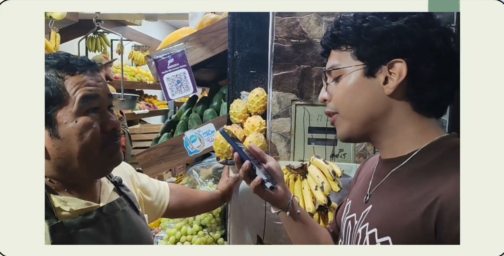
  

  <!-- Datos en dos columnas -->
  <table style="width: 100%; border-collapse: collapse; font-size: 0.88em;">
    <tr>
      <td style="padding: 7px 14px; border: 1px solid #cfd8dc; width: 50%;">
        <strong>Entrevistado:</strong> Hercilio Carrasco Herrera
      </td>
      <td style="padding: 7px 14px; border: 1px solid #cfd8dc; width: 50%;">
        <strong>Género:</strong> Masculino
      </td>
    </tr>
    <tr>
      <td style="padding: 7px 14px; border: 1px solid #cfd8dc;">
        <strong>Entrevistador(a):</strong> Fernando Flores
      </td>
      <td style="padding: 7px 14px; border: 1px solid #cfd8dc;">
        <strong>Edad:</strong> 62
      </td>
    </tr>
    <tr>
      <td style="padding: 7px 14px; border: 1px solid #cfd8dc;">
        <strong>Duración:</strong> 6:35
      </td>
      <td style="padding: 7px 14px; border: 1px solid #cfd8dc;">
        <strong>Lugar de Residencia:</strong> Magdalena del Mar, Lima
      </td>
    </tr>
  </table>

  <!-- Link -->
  <table style="width: 100%; border-collapse: collapse; font-size: 0.88em;">
    <tr>
      <td style="padding: 7px 14px; border: 1px solid #cfd8dc;">
        <strong>Link de la entrevista:</strong>
        <a href="https://youtu.be/J-kTxRbFjtU" style="color: #1a6b6b;">https://youtu.be/J-kTxRbFjtU</a>
      </td>
    </tr>
  </table>

  <!-- Descripción -->
  <table style="width: 100%; border-collapse: collapse; font-size: 0.88em;">
    <tr>
      <td style="padding: 10px 14px; border: 1px solid #cfd8dc; line-height: 1.6;">
        Herilio es un comerciante con cuatro décadas de trayectoria que actualmente utiliza Excel para su control de productos, aunque admite tener dificultades con el descuadre de stock (errores manuales al comprar o registrar). Su mayor "punto de dolor" es el desorden financiero: mezcla el dinero de las ventas con los pagos a proveedores y no logra cuadrar el efectivo con los vouchers de tarjetas y billeteras digitales como Yape o Plin.
        Valida con entusiasmo la implementación de balanzas inteligentes para inventario automático y un chatbot con IA que gestione los pedidos de WhatsApp, funciones que actualmente delega en su hijo. Considera que un sistema que automatice el arqueo de caja y permita ventas 24/7 sin errores de stock sería una solución "bacán" que le ahorraría tiempo, dinero y reduciría la carga operativa de su personal.
      </td>
    </tr>
  </table>

---

-   Segunda entrevista:

  <!-- Encabezado -->
  

  
  

  <!-- Imagen de la captura de pantalla -->
  

    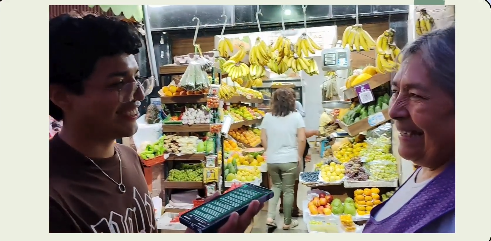
  

  <!-- Datos en dos columnas -->
  <table style="width: 100%; border-collapse: collapse; font-size: 0.88em;">
    <tr>
      <td style="padding: 7px 14px; border: 1px solid #cfd8dc; width: 50%;">
        <strong>Entrevistado:</strong> María Encarnación Velázquez
      </td>
      <td style="padding: 7px 14px; border: 1px solid #cfd8dc; width: 50%;">
        <strong>Género:</strong> Femenino
      </td>
    </tr>
    <tr>
      <td style="padding: 7px 14px; border: 1px solid #cfd8dc;">
        <strong>Entrevistador(a):</strong> Fernando Flores
      </td>
      <td style="padding: 7px 14px; border: 1px solid #cfd8dc;">
        <strong>Edad:</strong> 60
      </td>
    </tr>
    <tr>
      <td style="padding: 7px 14px; border: 1px solid #cfd8dc;">
        <strong>Duración:</strong> 6:35
      </td>
      <td style="padding: 7px 14px; border: 1px solid #cfd8dc;">
        <strong>Lugar de Residencia:</strong> Magdalena del Mar, Lima
      </td>
    </tr>
  </table>

  <!-- Link -->
  <table style="width: 100%; border-collapse: collapse; font-size: 0.88em;">
    <tr>
      <td style="padding: 7px 14px; border: 1px solid #cfd8dc;">
        <strong>Link de la entrevista:</strong>
        <a href="https://youtu.be/J-kTxRbFjtU" style="color: #1a6b6b;">https://youtu.be/J-kTxRbFjtU</a>
      </td>
    </tr>
  </table>

  <!-- Descripción -->
  <table style="width: 100%; border-collapse: collapse; font-size: 0.88em;">
    <tr>
      <td style="padding: 10px 14px; border: 1px solid #cfd8dc; line-height: 1.6;">
        María gestiona su negocio basándose principalmente en la memoria y la inspección visual diaria. Admite que este método genera errores, como enviar pedidos equivocados o duplicados a los clientes, lo que deriva en pérdidas económicas (ej. kilos de fruta regalados para no quedar mal con el cliente). Existe una falta de consenso administrativo con su esposo: mientras ella busca un cierre de caja formal, él prefiere la inmediatez de usar el dinero de Yape/Tarjeta directamente para nuevas compras sin registrar.
        Muestra una apertura total hacia la tecnología para "hacer descansar al cerebro". Valida que una balanza inteligente le permitiría cobrar hasta los céntimos exactos (evitando el redondeo a favor del cliente que merman su ganancia). Además, ve en el chatbot y la impresión automática de vouchers una solución para no "perder tiempo pensando" y evitar errores de despacho, asegurando que su volumen de ventas subiría al ofrecer una atención mucho más rápida.
      </td>
    </tr>
  </table>

---

-   Tercera entrevista:

  <!-- Encabezado -->
  

  
  

  <!-- Imagen de la captura de pantalla -->
  

    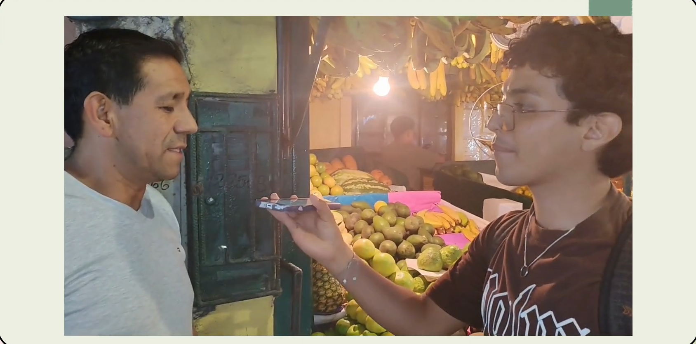
  

  <!-- Datos en dos columnas -->
  <table style="width: 100%; border-collapse: collapse; font-size: 0.88em;">
    <tr>
      <td style="padding: 7px 14px; border: 1px solid #cfd8dc; width: 50%;">
        <strong>Entrevistado:</strong> Luis Vargas
      </td>
      <td style="padding: 7px 14px; border: 1px solid #cfd8dc; width: 50%;">
        <strong>Género:</strong> Masculino
      </td>
    </tr>
    <tr>
      <td style="padding: 7px 14px; border: 1px solid #cfd8dc;">
        <strong>Entrevistador(a):</strong> Fernando Flores
      </td>
      <td style="padding: 7px 14px; border: 1px solid #cfd8dc;">
        <strong>Edad:</strong> 54
      </td>
    </tr>
    <tr>
      <td style="padding: 7px 14px; border: 1px solid #cfd8dc;">
        <strong>Duración:</strong> 6:35
      </td>
      <td style="padding: 7px 14px; border: 1px solid #cfd8dc;">
        <strong>Lugar de Residencia:</strong> Magdalena del Mar, Lima
      </td>
    </tr>
  </table>

  <!-- Link -->
  <table style="width: 100%; border-collapse: collapse; font-size: 0.88em;">
    <tr>
      <td style="padding: 7px 14px; border: 1px solid #cfd8dc;">
        <strong>Link de la entrevista:</strong>
        <a href="https://youtu.be/J-kTxRbFjtU" style="color: #1a6b6b;">https://youtu.be/J-kTxRbFjtU</a>
      </td>
    </tr>
  </table>

  <!-- Descripción -->
  <table style="width: 100%; border-collapse: collapse; font-size: 0.88em;">
    <tr>
      <td style="padding: 10px 14px; border: 1px solid #cfd8dc; line-height: 1.6;">
       Luis es un comerciante de 54 años que confía plenamente en su memoria para el control de inventarios. Al trabajar con fruta selecta, asegura que no tiene pérdidas económicas por calidad, aunque reconoce que actualmente no puede saber con exactitud si el stock físico coincide con lo que debería haber. Aunque no siente dificultad para revisar sus movimientos en Yape o Plin, admite que el proceso es manual.
        Valida que un sistema de inventario por peso le ahorraría mucho tiempo, evitando el conteo unidad por unidad. Además, ve con buenos ojos la automatización de pedidos por WhatsApp, señalando que una impresión automática de comprobantes haría el despacho "mucho más rápido". Finalmente, coincide en que un sistema que funcione 24/7 mediante un bot aumentaría significativamente su volumen de ventas al eliminar la fricción de la atención manual.
      </td>
    </tr>
  </table>

---

**Segmento 2: Clientes Finales**

-   Primera entrevista:

  <!-- Encabezado -->
  

  
  

  <!-- Imagen de la captura de pantalla -->
  

    
  

  <!-- Datos en dos columnas -->
  <table style="width: 100%; border-collapse: collapse; font-size: 0.88em;">
    <tr>
      <td style="padding: 7px 14px; border: 1px solid #cfd8dc; width: 50%;">
        <strong>Entrevistada:</strong> María López
      </td>
      <td style="padding: 7px 14px; border: 1px solid #cfd8dc; width: 50%;">
        <strong>Género:</strong> Femenino
      </td>
    </tr>
    <tr>
      <td style="padding: 7px 14px; border: 1px solid #cfd8dc;">
        <strong>Entrevistador(a):</strong> Fernando Flores
      </td>
      <td style="padding: 7px 14px; border: 1px solid #cfd8dc;">
        <strong>Edad:</strong> 23
      </td>
    </tr>
    <tr>
      <td style="padding: 7px 14px; border: 1px solid #cfd8dc;">
        <strong>Duración:</strong> 6:35
      </td>
      <td style="padding: 7px 14px; border: 1px solid #cfd8dc;">
        <strong>Lugar de Residencia:</strong> San Martín de Porres
      </td>
    </tr>
  </table>

  <!-- Link -->
  <table style="width: 100%; border-collapse: collapse; font-size: 0.88em;">
    <tr>
      <td style="padding: 7px 14px; border: 1px solid #cfd8dc;">
        <strong>Link de la entrevista:</strong>
        <a href="https://youtu.be/J-kTxRbFjtU" style="color: #1a6b6b;">https://youtu.be/J-kTxRbFjtU</a>
      </td>
    </tr>
  </table>

  <!-- Descripción -->
  <table style="width: 100%; border-collapse: collapse; font-size: 0.88em;">
    <tr>
      <td style="padding: 10px 14px; border: 1px solid #cfd8dc; line-height: 1.6;">
        María es una joven de 23 años que prefiere métodos de pago digitales como Yape y Plin. Su principal molestia al comprar en minimarkets locales es la lentitud en la respuesta y la incertidumbre sobre el stock real, habiendo tenido experiencias negativas donde pagó por productos agotados. Esta falta de transparencia ha quebrado su confianza en varios negocios locales.
        Muestra un alto interés en soluciones tecnológicas: validaría con entusiasmo un sistema que use sensores de peso reales para confirmar el stock desde su celular y valora críticamente la recepción inmediata de comprobantes de pago virtuales. Afirma que dejaría de ir presencialmente a los mercados si pudiera comprar de forma segura y rápida (en tres clics) vía WhatsApp, siempre que el sistema le brinde confirmaciones automáticas e inmediatas.
      </td>
    </tr>
  </table>

---

-   Segunda entrevista:

  <!-- Encabezado -->
  

  
  

  <!-- Imagen de la captura de pantalla -->
  

    
  

  <!-- Datos en dos columnas -->
  <table style="width: 100%; border-collapse: collapse; font-size: 0.88em;">
    <tr>
      <td style="padding: 7px 14px; border: 1px solid #cfd8dc; width: 50%;">
        <strong>Entrevistado:</strong> Sebastián Curay
      </td>
      <td style="padding: 7px 14px; border: 1px solid #cfd8dc; width: 50%;">
        <strong>Género:</strong> Masculino
      </td>
    </tr>
    <tr>
      <td style="padding: 7px 14px; border: 1px solid #cfd8dc;">
        <strong>Entrevistador(a):</strong> Fernando Flores
      </td>
      <td style="padding: 7px 14px; border: 1px solid #cfd8dc;">
        <strong>Edad:</strong> 19
      </td>
    </tr>
    <tr>
      <td style="padding: 7px 14px; border: 1px solid #cfd8dc;">
        <strong>Duración:</strong> 6:35
      </td>
      <td style="padding: 7px 14px; border: 1px solid #cfd8dc;">
        <strong>Lugar de Residencia:</strong> San Martín de Porres, Lima
      </td>
    </tr>
  </table>

  <!-- Link -->
  <table style="width: 100%; border-collapse: collapse; font-size: 0.88em;">
    <tr>
      <td style="padding: 7px 14px; border: 1px solid #cfd8dc;">
        <strong>Link de la entrevista:</strong>
        <a href="https://youtu.be/J-kTxRbFjtU" style="color: #1a6b6b;">https://youtu.be/J-kTxRbFjtU</a>
      </td>
    </tr>
  </table>

  <!-- Descripción -->
  <table style="width: 100%; border-collapse: collapse; font-size: 0.88em;">
    <tr>
      <td style="padding: 10px 14px; border: 1px solid #cfd8dc; line-height: 1.6;">
        Sebastián es un estudiante de 19 años que prioriza la rapidez y los pagos digitales (Tarjeta y Yape/Plin) por encima del efectivo. Su mayor frustración es la incertidumbre del stock y la demora en la atención vía WhatsApp, habiendo experimentado varias veces el pagar por productos que finalmente estaban agotados, lo que ha erosionado su confianza en los negocios locales.
        Debido a su carga académica, valora enormemente la posibilidad de realizar compras en "tres clics" para ahorrar tiempo. No cuenta con herramientas en casa para validar el peso de lo que recibe, por lo que un sistema con sensores de peso reales que valide el stock digitalmente le brindaría la seguridad que actualmente le falta. Además, considera indispensable recibir una confirmación automática e inmediata tras el pago para mitigar la sensación de riesgo al pagar por adelantado.
      </td>
    </tr>
  </table>

---

-   Tercera entrevista:

  <!-- Encabezado -->
  

  
  

  <!-- Imagen de la captura de pantalla -->
  

    
  

  <!-- Datos en dos columnas -->
  <table style="width: 100%; border-collapse: collapse; font-size: 0.88em;">
    <tr>
      <td style="padding: 7px 14px; border: 1px solid #cfd8dc; width: 50%;">
        <strong>Entrevistada:</strong> Rosmery Villa
      </td>
      <td style="padding: 7px 14px; border: 1px solid #cfd8dc; width: 50%;">
        <strong>Género:</strong> Femenino
      </td>
    </tr>
    <tr>
      <td style="padding: 7px 14px; border: 1px solid #cfd8dc;">
        <strong>Entrevistador(a):</strong> Fernando Flores
      </td>
      <td style="padding: 7px 14px; border: 1px solid #cfd8dc;">
        <strong>Edad:</strong> 21
      </td>
    </tr>
    <tr>
      <td style="padding: 7px 14px; border: 1px solid #cfd8dc;">
        <strong>Duración:</strong> 6:35
      </td>
      <td style="padding: 7px 14px; border: 1px solid #cfd8dc;">
        <strong>Lugar de Residencia:</strong> an Martín de Porres, Lima
      </td>
    </tr>
  </table>

  <!-- Link -->
  <table style="width: 100%; border-collapse: collapse; font-size: 0.88em;">
    <tr>
      <td style="padding: 7px 14px; border: 1px solid #cfd8dc;">
        <strong>Link de la entrevista:</strong>
        <a href="https://youtu.be/J-kTxRbFjtU" style="color: #1a6b6b;">https://youtu.be/J-kTxRbFjtU</a>
      </td>
    </tr>
  </table>

  <!-- Descripción -->
  <table style="width: 100%; border-collapse: collapse; font-size: 0.88em;">
    <tr>
      <td style="padding: 10px 14px; border: 1px solid #cfd8dc; line-height: 1.6;">
        Rosmery es una joven de 21 años que utiliza casi exclusivamente billeteras digitales (Yape) y tarjetas, evitando el uso de efectivo. Identifica la demora en la respuesta y la falta de stock actualizado como los principales motivos para abandonar una compra. Ha tenido experiencias negativas pagando por productos que luego resultan estar agotados, lo que genera una pérdida total de confianza en el negocio.
        Se define como alguien que no sabe "escoger productos" en el mercado físico, por lo que prefiere una solución digital de "tres clics" que pueda usar incluso mientras viaja en el bus. Valida con entusiasmo la implementación de sensores de peso reales en los estantes, ya que desconfía de las balanzas tradicionales de los mercados. Aunque no le da importancia al comprobante físico, exige una confirmación automática del sistema al pagar por adelantado para evitar la sensación de inseguridad e insatisfacción.
      </td>
    </tr>
  </table>

---

### 2.2.3. Análisis de entrevistas

Se realizaron 6 entrevistas semiestructuradas distribuidas en dos segmentos objetivos: 3 comerciantes dueños de minimarkets o puestos de mercado, y 3 clientes finales que realizan compras en negocios locales. El propósito fue identificar patrones comunes en sus experiencias, frustraciones y expectativas en torno a la gestión de inventario, medios de pago y atención digital. A partir de los resúmenes obtenidos, se extrajeron características objetivas y subjetivas de cada perfil, las cuales se presentan con respaldo estadístico expresado en porcentajes sobre el total de entrevistados por segmento.

#### Segmento objetivo #1: Comerciantes (Dueños de Minimarkets/Mercados)

**Hallazgos**
- El 100% de los comerciantes reportó enfrentar descuadres entre el stock físico y el registrado, ya sea por errores manuales al anotar entradas, por no contar con sistema alguno, o por no poder verificar con exactitud las unidades disponibles.
- El 100% identificó el desorden en el cierre de caja como un problema recurrente, manifestado principalmente en la dificultad de separar y conciliar los ingresos en efectivo con los pagos por Yape, Plin o terminal POS.
- El 67% mezcla el dinero de ventas con gastos operativos o compras a proveedores sin un registro formal, lo que genera pérdida de trazabilidad financiera al cierre del día.
- El 67% atiende pedidos por WhatsApp de forma manual, delegando esta tarea en familiares o atendiendo entre cliente y cliente, lo que genera errores y demoras.
- El 100% validó positivamente el uso de una balanza inteligente para automatizar el control de inventario, siendo el 67% entusiasta sin condiciones y el 33% restante favorable bajo la condición de que el sistema sea simple de configurar.
- El 33% utiliza Excel como herramienta de control; el 67% restante depende de la memoria o la inspección visual diaria, sin ningún registro sistemático.

**Problemas operativos identificados**

  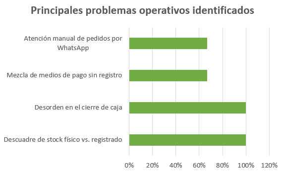

El descuadre de stock y el desorden en caja concentran el mayor porcentaje con un 100% cada uno, lo que los posiciona como los problemas más críticos y compartidos por la totalidad del segmento. La mezcla de medios de pago sin registro y la atención manual de WhatsApp, presentes en el 67% de los casos, complementan un panorama donde la falta de control operativo afecta tanto el inventario como la conciliación financiera y la atención al cliente.
**Método de control de inventario actual**

  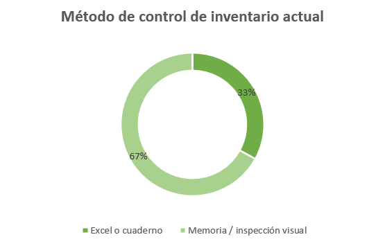

El 67% del segmento no cuenta con ninguna herramienta de registro estructurada y depende de la memoria o la revisión visual para controlar su inventario. Solo el 33% utiliza Excel, aunque con limitaciones reconocidas. Este dato indica que Entreprenly no compite con sistemas digitales existentes en estos perfiles, sino que se posiciona como la primera solución formal de gestión, lo que reduce la resistencia al cambio y facilita la adopción desde cero.

**Aceptación de balanza inteligente para inventario**

  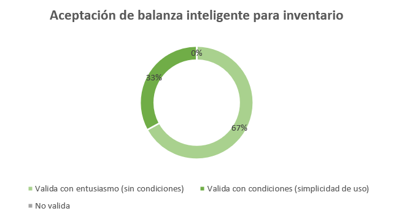

El 100% del segmento aceptó positivamente la propuesta de inventario automatizado por peso. El 67% lo hizo sin reservas, mientras que el 33% restante condicionó su aceptación a que el sistema sea sencillo de configurar y operar. La ausencia total de rechazo valida directamente una de las funcionalidades centrales de Entreprenly y confirma que el segmento percibe valor real en reemplazar el conteo manual por una solución basada en sensores.

**Interés en automatización de pedidos por WhatsApp**

  

La totalidad del segmento mostró interés en automatizar la atención de pedidos por WhatsApp. El 67% lo valoró como una prioridad que reduciría la carga operativa del personal, mientras que el 33% restante lo consideró una mejora útil para agilizar el despacho. La unanimidad en este punto confirma que el canal conversacional es percibido como una solución real a un problema cotidiano, y no como una funcionalidad opcional o de baja relevancia para el negocio.

**Conclusiones**
Los comerciantes entrevistados operan con herramientas insuficientes o inexistentes para el control de su negocio. La dependencia de la memoria, la mezcla de fondos y la gestión manual de WhatsApp generan pérdidas económicas y decisiones tardías. La totalidad del segmento validó positivamente las funcionalidades centrales de Entreprenly, lo que confirma que existe una necesidad real y una disposición clara hacia la digitalización, siempre que la solución sea práctica y fácil de adoptar desde el primer día.

#### Segmento objetivo #2: Clientes finales

**Hallazgos**
- El 100% ha tenido al menos una experiencia negativa en la que pagó por un producto agotado, lo que generó pérdida de confianza en el negocio.
- El 100% afirmó que un sistema con validación de stock por sensor de peso les brindaría mayor seguridad al comprar desde su celular.
- El 100% señaló la demora en la respuesta por WhatsApp como una de sus principales frustraciones.
- El 67% prefiere billeteras digitales como medio de pago principal; el 33% combina tarjeta con billetera digital. Ninguno prioriza el efectivo.
- El 67% dejaría de ir presencialmente al mercado si pudiera comprar de forma rápida y segura por WhatsApp.
- El 33% restante lo haría bajo la condición de recibir confirmaciones automáticas confiables.
- El 67% considera indispensable recibir confirmación automática del sistema al pagar por adelantado.

**Medio de pago preferido**

  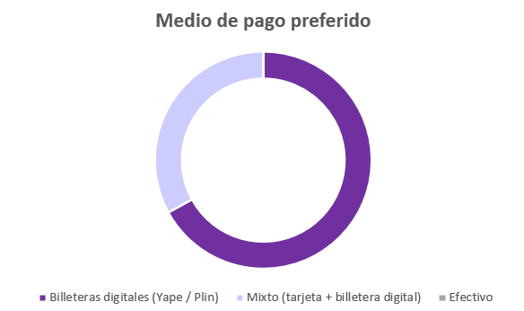

El gráfico evidencia un alto nivel de aceptación del modelo: el 75% de los capacitadores lo valida de forma total, mientras que el 25% restante lo apoya bajo condiciones específicas de diseño. Ningún entrevistado rechazó la propuesta, lo que representa un respaldo experto sólido para Entreprenly.

**Principales frustraciones al comprar en minimarkets locales**

  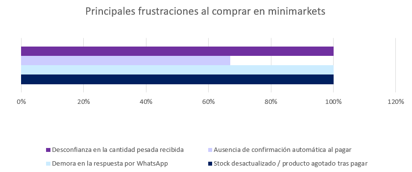

La sobrecarga cognitiva y la falta de seguimiento lideran los riesgos con un 50% cada uno, seguidos por la baja alfabetización digital y la inaplicabilidad en etapas de ideación con un 25%. Estos datos orientan directamente las decisiones de diseño: el contenido debe ser variado, progresivo y acompañado de un sistema de recordatorios que sostenga la continuidad del usuario.

**Confianza ante stock validado por sensor de peso**

  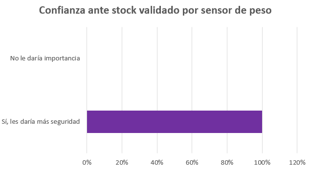

El aumento de ventas fue mencionado por el 100% de los capacitadores como la métrica más relevante para evaluar el impacto del programa. La organización financiera y la constancia de participación aparecen con un 50%, mientras que la generación de nuevos contactos o clientes fue señalada por el 25%. Esta jerarquía define el orden de prioridad para los indicadores de éxito de Entreprenly.

**Disposición a reemplazar la compra presencial por canal digital**

  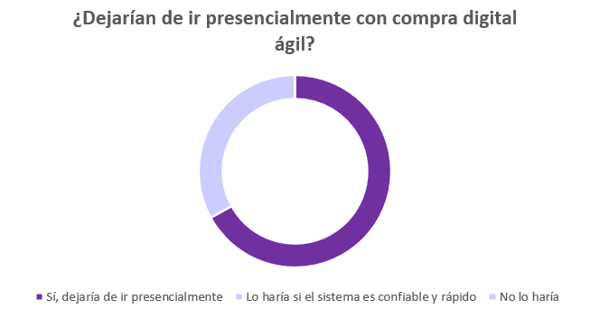

El 67% del segmento afirmó que dejaría de ir presencialmente al mercado si pudiera realizar compras de forma ágil y segura por WhatsApp. El 33% restante estaría dispuesto a hacerlo bajo la condición de recibir confirmaciones automáticas confiables, condición que Entreprenly está diseñada para cumplir. La ausencia total de rechazo evidencia que el canal conversacional tiene un potencial real de desplazar la visita presencial para compras de rutina en este perfil de consumidor.

**Conclusiones**
Los clientes finales entrevistados representan un perfil digital, exigente y con experiencias previas de frustración en el comercio local. Su principal barrera no es la tecnología, sino la falta de confianza en el stock disponible, en el proceso de pago y en la respuesta oportuna del negocio. Entreprenly responde directamente a estas tres barreras mediante la validación de stock por sensor, la confirmación automática de cobros y el chatbot de WhatsApp. Esto posiciona a la plataforma no solo como una herramienta de eficiencia operativa para el comerciante, sino también como un mecanismo de fidelización del consumidor final.

## 2.3. Needfinding

### 2.3.1. User Personas

**Segmento 1: Comerciantes (Dueños de Minimarkets/Mercados)**

  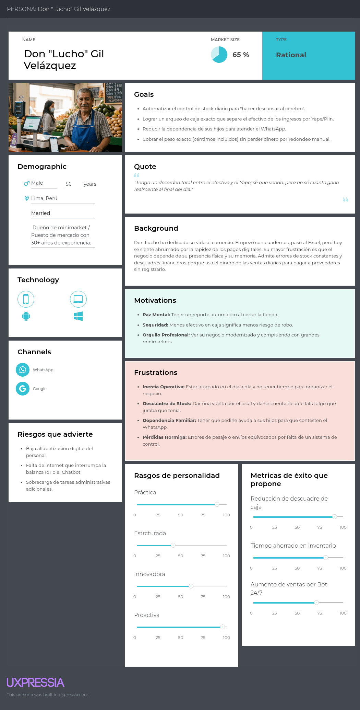

**Segmento 2: Clientes Finales**

  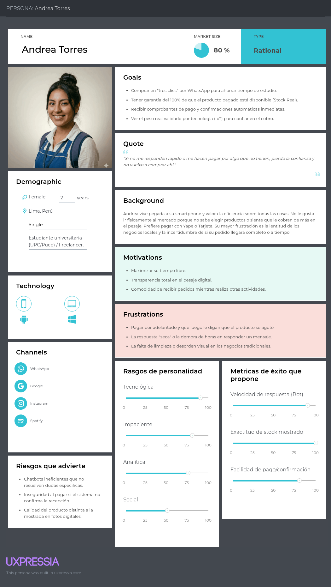

### 2.3.2. User Task Matrix

*Contenido por agregar.*

### 2.3.3. User Journey Mapping

**Segmento 1: Comerciantes (Dueños de Minimarkets/Mercados)**

  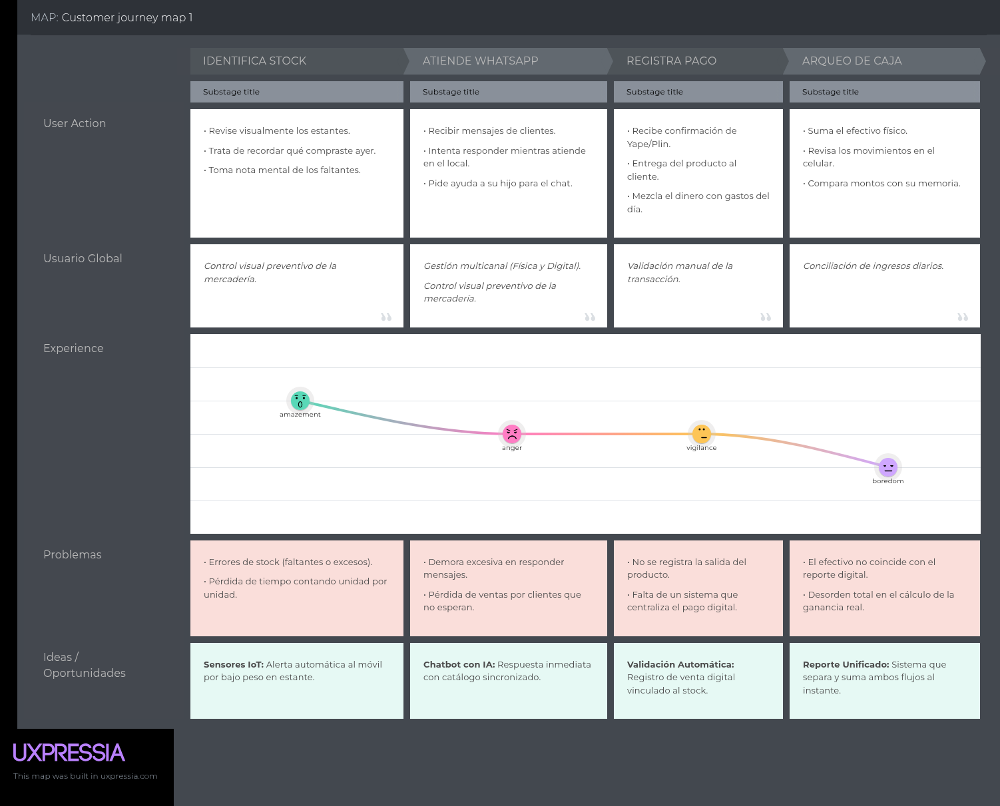

**Segmento 2: Clientes Finales**

  

### 2.3.4. Empathy Mapping

*Contenido por agregar.*

## 2.4. Big Picture Event Storming

*Contenido por agregar.*

## 2.5. Ubiquitous Language

*Contenido por agregar.*