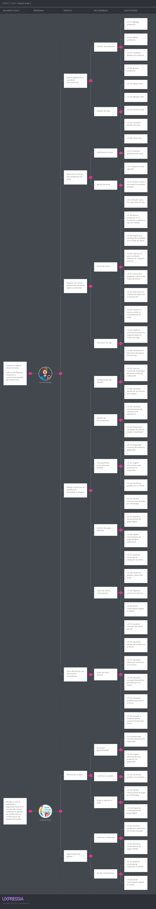

# Capítulo III: Requirements Specification

## 3.1. User Stories

En esta sección se especifican las épicas y las User Stories que definen el alcance funcional de Entreprenly. Primero se presentan las épicas con el conjunto de User Stories que agrupan, y luego el detalle de cada User Story con su descripción y criterios de aceptación.

### Épicas

<table>
  <tbody>
    <tr>
      <td><strong>EPIC - 01</strong></td>
      <td colspan="2"><strong>Gestión de inventario</strong></td>
    </tr>
    <tr>
      <td colspan="3"><strong>Descripción:</strong>  Como usuario quiero gestionar mi inventario (lotes y productos) para visualizar los datos con mayor claridad.</td>
    </tr>
    <tr>
      <td><strong>ID</strong></td>
      <td colspan="2"><strong>User Story</strong></td>
    </tr>
    <tr>
      <td>US-01</td>
      <td colspan="2">Agregar productos</td>
    </tr>
    <tr>
      <td>US-02</td>
      <td colspan="2">Editar lotes</td>
    </tr>
    <tr>
      <td>US-03</td>
      <td colspan="2">Agregar lotes</td>
    </tr>
    <tr>
      <td>US-04</td>
      <td colspan="2">Eliminar lotes</td>
    </tr>
    <tr>
      <td>US-05</td>
      <td colspan="2">Editar productos</td>
    </tr>
    <tr>
      <td>US-06</td>
      <td colspan="2">Visualizar detalles de lotes</td>
    </tr>
    <tr>
      <td>US-07</td>
      <td colspan="2">Visualizar detalles de producto</td>
    </tr>
    <tr>
      <td>US-08</td>
      <td colspan="2">Buscar productos</td>
    </tr>
    <tr>
      <td>US-09</td>
      <td colspan="2">Crear lotes</td>
    </tr>
    <tr>
      <td>US-10</td>
      <td colspan="2">Escanear código QR en inventario</td>
    </tr>
    <tr>
      <td>US-90</td>
      <td colspan="2">Eliminar productos</td>
    </tr>
    <tr>
      <td>US-95</td>
      <td colspan="2">Buscar lotes</td>
    </tr>
  </tbody>
</table>

<table>
  <tbody>
    <tr>
      <td><strong>EPIC - 02</strong></td>
      <td colspan="2"><strong>Notificaciones de inventario</strong></td>
    </tr>
    <tr>
      <td colspan="3"><strong>Descripción:</strong>  Como usuario quiero que el sistema me notifique el estado de mis lotes para organizarme mejor.</td>
    </tr>
    <tr>
      <td><strong>ID</strong></td>
      <td colspan="2"><strong>User Story</strong></td>
    </tr>
    <tr>
      <td>US-11</td>
      <td colspan="2">Detectar stock agotado</td>
    </tr>
    <tr>
      <td>US-12</td>
      <td colspan="2">Mostrar alertas de estado al visualizar detalles</td>
    </tr>
    <tr>
      <td>US-13</td>
      <td colspan="2">Visualizar dashboard de lotes</td>
    </tr>
    <tr>
      <td>US-14</td>
      <td colspan="2">Recibir alerta de caducidad de lote</td>
    </tr>
  </tbody>
</table>

<table>
  <tbody>
    <tr>
      <td><strong>EPIC - 03</strong></td>
      <td colspan="2"><strong>Proceso de suscripción</strong></td>
    </tr>
    <tr>
      <td colspan="3"><strong>Descripción:</strong>  Como usuario con cuenta creada y Plan Free asignado por defecto, quiero iniciar la suscripción al Plan Control para habilitar las funcionalidades premium desde la landing o desde la sección "Suscripción" del dashboard.</td>
    </tr>
    <tr>
      <td><strong>ID</strong></td>
      <td colspan="2"><strong>User Story</strong></td>
    </tr>
    <tr>
      <td>US-15</td>
      <td colspan="2">Seleccionar plan de suscripción</td>
    </tr>
    <tr>
      <td>US-16</td>
      <td colspan="2">Iniciar proceso de suscripción</td>
    </tr>
    <tr>
      <td>US-17</td>
      <td colspan="2">Registrar datos de facturación</td>
    </tr>
    <tr>
      <td>US-18</td>
      <td colspan="2">Procesar cobro de suscripción</td>
    </tr>
    <tr>
      <td>US-19</td>
      <td colspan="2">Activar suscripción</td>
    </tr>
  </tbody>
</table>

<table>
  <tbody>
    <tr>
      <td><strong>EPIC - 04</strong></td>
      <td colspan="2"><strong>Configuración de suscripción</strong></td>
    </tr>
    <tr>
      <td colspan="3"><strong>Descripción:</strong>  Como usuario, quiero visualizar y gestionar mi plan actual desde la sección "Suscripción" del dashboard para consultar su estado, renovarlo o cancelarlo según mis necesidades.</td>
    </tr>
    <tr>
      <td><strong>ID</strong></td>
      <td colspan="2"><strong>User Story</strong></td>
    </tr>
    <tr>
      <td>US-20</td>
      <td colspan="2">Visualizar panel de suscripción</td>
    </tr>
    <tr>
      <td>US-21</td>
      <td colspan="2">Consultar estado de suscripción</td>
    </tr>
    <tr>
      <td>US-22</td>
      <td colspan="2">Renovar suscripción</td>
    </tr>
    <tr>
      <td>US-23</td>
      <td colspan="2">Solicitar cancelación de suscripción</td>
    </tr>
    <tr>
      <td>US-24</td>
      <td colspan="2">Cancelar suscripción</td>
    </tr>
    <tr>
      <td>US-25</td>
      <td colspan="2">Agregar método de pago de suscripción</td>
    </tr>
    <tr>
      <td>US-26</td>
      <td colspan="2">Completar datos fiscales de suscripción</td>
    </tr>
    <tr>
      <td>US-27</td>
      <td colspan="2">Descargar historial de suscripción</td>
    </tr>
  </tbody>
</table>

<table>
  <tbody>
    <tr>
      <td><strong>EPIC - 05</strong></td>
      <td colspan="2"><strong>Gestión de Transacciones y Operaciones de Venta</strong></td>
    </tr>
    <tr>
      <td colspan="3"><strong>Descripción:</strong>  Como comerciante, quiero gestionar el proceso completo de registro de ventas, desde la selección de productos hasta la emisión del comprobante, para asegurar una operación ágil y sin errores.</td>
    </tr>
    <tr>
      <td><strong>ID</strong></td>
      <td colspan="2"><strong>User Story</strong></td>
    </tr>
    <tr>
      <td>US-28</td>
      <td colspan="2">Buscar productos en el inventario y validar su tipo de medida</td>
    </tr>
    <tr>
      <td>US-29</td>
      <td colspan="2">Registrar la cantidad de unidades en el Ticket de Venta</td>
    </tr>
    <tr>
      <td>US-30</td>
      <td colspan="2">Capturar el peso mediante balanza IoT o ingreso manual</td>
    </tr>
    <tr>
      <td>US-31</td>
      <td colspan="2">Gestionar el desglose y cálculo del Ticket de Venta</td>
    </tr>
    <tr>
      <td>US-32</td>
      <td colspan="2">Seleccionar el método de pago para la transacción</td>
    </tr>
    <tr>
      <td>US-33</td>
      <td colspan="2">Finalizar la venta y emitir el comprobante de pago</td>
    </tr>
    <tr>
      <td>US-34</td>
      <td colspan="2">Cancelar venta en curso</td>
    </tr>
  </tbody>
</table>

<table>
  <tbody>
    <tr>
      <td><strong>EPIC - 06</strong></td>
      <td colspan="2"><strong>Control de Ingresos y Monitoreo de Caja</strong></td>
    </tr>
    <tr>
      <td colspan="3"><strong>Descripción:</strong>  Como dueño del negocio, quiero supervisar los flujos de dinero entrante en tiempo real, para tener visibilidad total sobre la liquidez y los métodos de pago utilizados durante el día.</td>
    </tr>
    <tr>
      <td><strong>ID</strong></td>
      <td colspan="2"><strong>User Story</strong></td>
    </tr>
    <tr>
      <td>US-35</td>
      <td colspan="2">Clasificar automáticamente los ingresos según el medio de pago</td>
    </tr>
    <tr>
      <td>US-36</td>
      <td colspan="2">Monitorear el Resumen de Caja en tiempo real dentro del panel de ventas</td>
    </tr>
  </tbody>
</table>

<table>
  <tbody>
    <tr>
      <td><strong>EPIC - 07</strong></td>
      <td colspan="2"><strong>Configurar Chatbot de WhatsApp Business</strong></td>
    </tr>
    <tr>
      <td colspan="3"><strong>Descripción:</strong>  Como comerciante, quiero configurar y vincular el chatbot de WhatsApp Business desde el dashboard para activar la atención automatizada de clientes.</td>
    </tr>
    <tr>
      <td><strong>ID</strong></td>
      <td colspan="2"><strong>User Story</strong></td>
    </tr>
    <tr>
      <td>US-37</td>
      <td colspan="2">Vincular cuenta de WhatsApp Business mediante código QR</td>
    </tr>
    <tr>
      <td>US-38</td>
      <td colspan="2">Consultar estado de vinculación del chatbot</td>
    </tr>
  </tbody>
</table>

<table>
  <tbody>
    <tr>
      <td><strong>EPIC - 08</strong></td>
      <td colspan="2"><strong>Gestionar Conversaciones desde el Dashboard</strong></td>
    </tr>
    <tr>
      <td colspan="3"><strong>Descripción:</strong>  Como comerciante, quiero visualizar y gestionar los chats de mis clientes directamente desde el dashboard para atenderlos sin salir de la plataforma.</td>
    </tr>
    <tr>
      <td><strong>ID</strong></td>
      <td colspan="2"><strong>User Story</strong></td>
    </tr>
    <tr>
      <td>US-39</td>
      <td colspan="2">Visualizar conversaciones de clientes en el dashboard</td>
    </tr>
    <tr>
      <td>US-40</td>
      <td colspan="2">Responder mensajes de clientes desde el dashboard</td>
    </tr>
  </tbody>
</table>

<table>
  <tbody>
    <tr>
      <td><strong>EPIC - 09</strong></td>
      <td colspan="2"><strong>Procesar Pedidos mediante Bot Automático</strong></td>
    </tr>
    <tr>
      <td colspan="3"><strong>Descripción:</strong>  Como sistema, quiero que el chatbot responda automáticamente a los clientes según el stock disponible del negocio para facilitar el proceso de pedido sin intervención manual del comerciante.</td>
    </tr>
    <tr>
      <td><strong>ID</strong></td>
      <td colspan="2"><strong>User Story</strong></td>
    </tr>
    <tr>
      <td>US-41</td>
      <td colspan="2">Responder consulta de producto disponible</td>
    </tr>
    <tr>
      <td>US-42</td>
      <td colspan="2">Sugerir alternativas ante producto no disponible</td>
    </tr>
    <tr>
      <td>US-43</td>
      <td colspan="2">Confirmar pedido con el cliente</td>
    </tr>
  </tbody>
</table>

<table>
  <tbody>
    <tr>
      <td><strong>EPIC - 10</strong></td>
      <td colspan="2"><strong>Gestionar Pago Digital P2P</strong></td>
    </tr>
    <tr>
      <td colspan="3"><strong>Descripción:</strong>  Como cliente y comerciante, queremos gestionar el envío y la validación de comprobantes de pago digitales (Yape/Plin) a través de WhatsApp y el dashboard, para garantizar una transacción segura y confirmada antes de finalizar la venta.</td>
    </tr>
    <tr>
      <td><strong>ID</strong></td>
      <td colspan="2"><strong>User Story</strong></td>
    </tr>
    <tr>
      <td>US-44</td>
      <td colspan="2">Recibir instrucciones de pago por WhatsApp</td>
    </tr>
    <tr>
      <td>US-45</td>
      <td colspan="2">Reportar comprobante de pago digital</td>
    </tr>
    <tr>
      <td>US-46</td>
      <td colspan="2">Validar comprobante de pago desde el dashboard</td>
    </tr>
    <tr>
      <td>US-47</td>
      <td colspan="2">Notificar resultado de validación al cliente</td>
    </tr>
  </tbody>
</table>

<table>
  <tbody>
    <tr>
      <td><strong>EPIC - 11</strong></td>
      <td colspan="2"><strong>Confirmar Venta y Emitir Comprobante</strong></td>
    </tr>
    <tr>
      <td colspan="3"><strong>Descripción:</strong>  Como dueño de negocio, quiero que el sistema confirme el pedido tras la validación del pago, descuente el stock y emita un comprobante digital, para mantener el control financiero y brindar un respaldo de la compra al cliente.</td>
    </tr>
    <tr>
      <td><strong>ID</strong></td>
      <td colspan="2"><strong>User Story</strong></td>
    </tr>
    <tr>
      <td>US-48</td>
      <td colspan="2">Confirmar pedido y descontar stock</td>
    </tr>
    <tr>
      <td>US-49</td>
      <td colspan="2">Registrar venta en el sistema</td>
    </tr>
  </tbody>
</table>

<table>
  <tbody>
    <tr>
      <td><strong>EPIC - 12</strong></td>
      <td colspan="2"><strong>Manejar Flujos Alternativos y Restricciones</strong></td>
    </tr>
    <tr>
      <td colspan="3"><strong>Descripción:</strong>  Como sistema de gestión, quiero manejar escenarios de excepción como falta de stock, tiempos de espera agotados y rechazos de pago, para proteger la integridad del inventario y evitar pérdidas económicas.</td>
    </tr>
    <tr>
      <td><strong>ID</strong></td>
      <td colspan="2"><strong>User Story</strong></td>
    </tr>
    <tr>
      <td>US-50</td>
      <td colspan="2">Manejar stock insuficiente en pedido</td>
    </tr>
    <tr>
      <td>US-51</td>
      <td colspan="2">Cancelar pedido por expiración de tiempo de pago</td>
    </tr>
    <tr>
      <td>US-52</td>
      <td colspan="2">Rechazar comprobante de pago inválido</td>
    </tr>
  </tbody>
</table>

<table>
  <tbody>
    <tr>
      <td><strong>EPIC - 13</strong></td>
      <td colspan="2"><strong>Technical Stories – Implementar RESTful API</strong></td>
    </tr>
    <tr>
      <td colspan="3"><strong>Descripción:</strong>  Como equipo de desarrollo, queremos implementar una arquitectura de servicios RESTful segura y escalable para que todos los componentes de la plataforma intercambien datos de manera consistente.</td>
    </tr>
    <tr>
      <td><strong>ID</strong></td>
      <td colspan="2"><strong>User Story</strong></td>
    </tr>
    <tr>
      <td>US-53</td>
      <td colspan="2">Conocer propuesta de valor en landing page</td>
    </tr>
    <tr>
      <td>US-54</td>
      <td colspan="2">Gestionar ciclo de vida de pedidos mediante API</td>
    </tr>
    <tr>
      <td>US-55</td>
      <td colspan="2">Validar y registrar pagos mediante API</td>
    </tr>
    <tr>
      <td>US-91</td>
      <td colspan="2">Autenticar y autorizar usuarios mediante JWT</td>
    </tr>
    <tr>
      <td>US-92</td>
      <td colspan="2">Containerizar y desplegar la API mediante Docker y CI/CD</td>
    </tr>
    <tr>
      <td>US-93</td>
      <td colspan="2">Persistir datos mediante JPA por bounded context</td>
    </tr>
    <tr>
      <td>US-94</td>
      <td colspan="2">Desplegar el frontend en Firebase Hosting</td>
    </tr>
  </tbody>
</table>

<table>
  <tbody>
    <tr>
      <td><strong>EPIC - 14</strong></td>
      <td colspan="2"><strong>Inicio de sesión y registro</strong></td>
    </tr>
    <tr>
      <td colspan="3"><strong>Descripción:</strong>  Como usuario quiero registrarme, verificar mi cuenta, iniciar sesión y recuperar mi contraseña para acceder de forma segura a la plataforma.</td>
    </tr>
    <tr>
      <td><strong>ID</strong></td>
      <td colspan="2"><strong>User Story</strong></td>
    </tr>
    <tr>
      <td>US-56</td>
      <td colspan="2">Registrar cuenta con email</td>
    </tr>
    <tr>
      <td>US-57</td>
      <td colspan="2">Verificar email</td>
    </tr>
    <tr>
      <td>US-58</td>
      <td colspan="2">Iniciar sesión con credenciales</td>
    </tr>
    <tr>
      <td>US-59</td>
      <td colspan="2">Iniciar sesión con Google OAuth</td>
    </tr>
    <tr>
      <td>US-60</td>
      <td colspan="2">Recuperar contraseña</td>
    </tr>
    <tr>
      <td>US-61</td>
      <td colspan="2">Cerrar sesión</td>
    </tr>
  </tbody>
</table>

<table>
  <tbody>
    <tr>
      <td><strong>EPIC - 15</strong></td>
      <td colspan="2"><strong>Perfil y configuración</strong></td>
    </tr>
    <tr>
      <td colspan="3"><strong>Descripción:</strong>  Como usuario quiero gestionar mi perfil y preferencias personales para personalizar mi experiencia dentro de la plataforma.</td>
    </tr>
    <tr>
      <td><strong>ID</strong></td>
      <td colspan="2"><strong>User Story</strong></td>
    </tr>
    <tr>
      <td>US-62</td>
      <td colspan="2">Visualizar perfil actual</td>
    </tr>
    <tr>
      <td>US-63</td>
      <td colspan="2">Actualizar nombre y biografía</td>
    </tr>
    <tr>
      <td>US-64</td>
      <td colspan="2">Subir foto de perfil</td>
    </tr>
    <tr>
      <td>US-65</td>
      <td colspan="2">Cambiar email con re-verificación</td>
    </tr>
    <tr>
      <td>US-66</td>
      <td colspan="2">Cambiar contraseña</td>
    </tr>
    <tr>
      <td>US-67</td>
      <td colspan="2">Configurar preferencias de idioma, zona horaria, tema y moneda</td>
    </tr>
    <tr>
      <td>US-68</td>
      <td colspan="2">Configurar notificaciones</td>
    </tr>
    <tr>
      <td>US-69</td>
      <td colspan="2">Registrar y verificar número de teléfono</td>
    </tr>
  </tbody>
</table>

<table>
  <tbody>
    <tr>
      <td><strong>EPIC - 16</strong></td>
      <td colspan="2"><strong>Panel de Inicio (Home)</strong></td>
    </tr>
    <tr>
      <td colspan="3"><strong>Descripción:</strong>  Como comerciante, quiero contar con un panel de inicio centralizado que me muestre un resumen visual del estado de mi negocio al ingresar a la plataforma, para tomar decisiones rápidas sin necesidad de navegar entre módulos.</td>
    </tr>
    <tr>
      <td><strong>ID</strong></td>
      <td colspan="2"><strong>User Story</strong></td>
    </tr>
    <tr>
      <td>US-70</td>
      <td colspan="2">Visualizar resumen de ventas del día</td>
    </tr>
    <tr>
      <td>US-71</td>
      <td colspan="2">Visualizar estado del chatbot en el home</td>
    </tr>
    <tr>
      <td>US-72</td>
      <td colspan="2">Visualizar alertas de inventario en el home</td>
    </tr>
    <tr>
      <td>US-73</td>
      <td colspan="2">Visualizar contador de pedidos pendientes en el home</td>
    </tr>
    <tr>
      <td>US-74</td>
      <td colspan="2">Visualizar pedidos recientes en el home</td>
    </tr>
    <tr>
      <td>US-75</td>
      <td colspan="2">Acceder a módulos desde accesos directos del home</td>
    </tr>
  </tbody>
</table>

<table>
  <tbody>
    <tr>
      <td><strong>EPIC - 17</strong></td>
      <td colspan="2"><strong>Centro de Soporte y Ayuda</strong></td>
    </tr>
    <tr>
      <td colspan="3"><strong>Descripción:</strong>  Como comerciante, quiero contar con un centro de soporte accesible desde el botón de Ayuda para resolver mis dudas, reportar problemas y consultar guías de uso de la plataforma sin necesidad de contactar a un agente externo.</td>
    </tr>
    <tr>
      <td><strong>ID</strong></td>
      <td colspan="2"><strong>User Story</strong></td>
    </tr>
    <tr>
      <td>US-76</td>
      <td colspan="2">Visualizar el centro de soporte</td>
    </tr>
    <tr>
      <td>US-77</td>
      <td colspan="2">Buscar artículo de ayuda</td>
    </tr>
    <tr>
      <td>US-78</td>
      <td colspan="2">Consultar artículo de ayuda</td>
    </tr>
    <tr>
      <td>US-79</td>
      <td colspan="2">Reportar un problema</td>
    </tr>
    <tr>
      <td>US-80</td>
      <td colspan="2">Confirmar envío del reporte</td>
    </tr>
  </tbody>
</table>

<table>
  <tbody>
    <tr>
      <td><strong>EPIC - 18</strong></td>
      <td colspan="2"><strong>Experiencia global del dashboard</strong></td>
    </tr>
    <tr>
      <td colspan="3"><strong>Descripción:</strong>  Como usuario autenticado, quiero contar con navegación global, cambio de idioma y manejo de estados generales para usar el dashboard de forma consistente entre módulos.</td>
    </tr>
    <tr>
      <td><strong>ID</strong></td>
      <td colspan="2"><strong>User Story</strong></td>
    </tr>
    <tr>
      <td>US-81</td>
      <td colspan="2">Navegar entre módulos desde el sidebar</td>
    </tr>
    <tr>
      <td>US-82</td>
      <td colspan="2">Cambiar idioma de la interfaz</td>
    </tr>
    <tr>
      <td>US-83</td>
      <td colspan="2">Gestionar rutas no encontradas</td>
    </tr>
  </tbody>
</table>

<table>
  <tbody>
    <tr>
      <td><strong>EPIC - 19</strong></td>
      <td colspan="2"><strong>Landing Page</strong></td>
    </tr>
    <tr>
      <td colspan="3"><strong>Descripción:</strong>  Como comerciante quiero acceder a la landing page para visualizar la propuesta de valor de Entreprenly, sus funciones, planes y cómo facilita la gestión de inventario, ventas y atención por WhatsApp de mi negocio.</td>
    </tr>
    <tr>
      <td><strong>ID</strong></td>
      <td colspan="2"><strong>User Story</strong></td>
    </tr>
    <tr>
      <td>US-84</td>
      <td colspan="2">Visualizar la propuesta de valor</td>
    </tr>
    <tr>
      <td>US-85</td>
      <td colspan="2">Explorar las funciones principales</td>
    </tr>
    <tr>
      <td>US-86</td>
      <td colspan="2">Revisar los planes de suscripción</td>
    </tr>
    <tr>
      <td>US-87</td>
      <td colspan="2">Consultar las preguntas frecuentes</td>
    </tr>
    <tr>
      <td>US-88</td>
      <td colspan="2">Iniciar sesión desde la landing page</td>
    </tr>
    <tr>
      <td>US-89</td>
      <td colspan="2">Acceder mediante el botón de acción principal</td>
    </tr>
  </tbody>
</table>

### User Stories

A continuación se detalla cada User Story con su épica relacionada, descripción y criterios de aceptación.

<table>
  <tbody>
    <tr>
      <td><strong>User Story</strong></td>
      <td>01</td>
      <td><strong>Epic ID</strong></td>
      <td>01</td>
    </tr>
    <tr>
      <td><strong>Title</strong></td>
      <td colspan="3">Agregar productos</td>
    </tr>
    <tr>
      <td><strong>Description</strong></td>
      <td colspan="3">Como comerciante quiero agregar productos para gestionar mi inventario de manera eficiente.</td>
    </tr>
    <tr>
      <td><strong>Acceptance Criteria</strong></td>
      <td colspan="3">
      <strong>Scenario 1: Agregar producto unitario correctamente</strong> 
      Dado que el comerciante está en el formulario de productos en "/dashboard/inventory/products", cuando ingresa nombre, descripción, precio por unidad, stock inicial, categoría y tipo "unitario" y presiona "Guardar", entonces el producto se registra en el inventario y aparece en el listado con tipo "Unit Product".  
      <strong>Scenario 2: Agregar producto por peso correctamente</strong> 
      Dado que el comerciante está en el formulario de productos, cuando selecciona tipo "por peso" e ingresa precio por kg y stock en kg, entonces el producto se registra y aparece en el listado con tipo "Weight Product" mostrando el stock en kilogramos.  
      <strong>Scenario 3: Validación de campos obligatorios</strong> 
      Dado que el comerciante está en el formulario de productos, cuando deje campos obligatorios vacíos y presione "Guardar", entonces el sistema resalta cada campo omitido con el mensaje "Este campo es obligatorio" y no registra el producto.
      </td>
    </tr>
  </tbody>
</table>

<table>
  <tbody>
    <tr>
      <td><strong>User Story</strong></td>
      <td>02</td>
      <td><strong>Epic ID</strong></td>
      <td>01</td>
    </tr>
    <tr>
      <td><strong>Title</strong></td>
      <td colspan="3">Editar lotes</td>
    </tr>
    <tr>
      <td><strong>Description</strong></td>
      <td colspan="3">Como comerciante quiero editar los lotes para actualizar los datos del inventario.</td>
    </tr>
    <tr>
      <td><strong>Acceptance Criteria</strong></td>
      <td colspan="3">
      <strong>Scenario 1: Editar lote correctamente</strong> 
      Dado que el usuario está en la sección de lotes y selecciona un lote existente, cuando modifique los datos correctamente y presione "Guardar", entonces los cambios del lote se actualizarán exitosamente.  
      <strong>Scenario 2: Validación al editar lote</strong> 
      Dado que el usuario está editando un lote, cuando ingrese datos inválidos o deje campos obligatorios vacíos y presione "Guardar", entonces el sistema mostrará mensajes de error y no guardará los cambios.
      </td>
    </tr>
  </tbody>
</table>

<table>
  <tbody>
    <tr>
      <td><strong>User Story</strong></td>
      <td>03</td>
      <td><strong>Epic ID</strong></td>
      <td>01</td>
    </tr>
    <tr>
      <td><strong>Title</strong></td>
      <td colspan="3">Agregar lotes</td>
    </tr>
    <tr>
      <td><strong>Description</strong></td>
      <td colspan="3">Como comerciante quiero agregar lotes para gestionar correctamente las cantidades y fechas de vencimiento.</td>
    </tr>
    <tr>
      <td><strong>Acceptance Criteria</strong></td>
      <td colspan="3">
      <strong>Scenario 1: Agregar lote correctamente</strong> 
      Dado que el usuario está en la sección de lotes y selecciona un lote existente, cuando ingrese una cantidad y fecha válida y presione "Agregar", entonces el nuevo lote se agregará exitosamente.  
      <strong>Scenario 2: Intento de registro de lote con información incompleta</strong> 
      Dado que el usuario se encuentra en el formulario de Agregación de Lotes, cuando intenta procesar la solicitud dejando uno o más campos obligatorios vacíos, entonces el sistema debe impedir el registro y resaltar cada campo omitido con el mensaje: "Este campo es obligatorio".
      </td>
    </tr>
  </tbody>
</table>

<table>
  <tbody>
    <tr>
      <td><strong>User Story</strong></td>
      <td>04</td>
      <td><strong>Epic ID</strong></td>
      <td>01</td>
    </tr>
    <tr>
      <td><strong>Title</strong></td>
      <td colspan="3">Eliminar lotes</td>
    </tr>
    <tr>
      <td><strong>Description</strong></td>
      <td colspan="3">Como comerciante quiero eliminar lotes para deshacerme de los lotes que no me sirvan.</td>
    </tr>
    <tr>
      <td><strong>Acceptance Criteria</strong></td>
      <td colspan="3">
      <strong>Scenario 1: Eliminar lote correctamente</strong> 
      Dado que el usuario está en la sección de lotes y selecciona un lote existente, cuando presione "Eliminar", entonces el lote se eliminará exitosamente.  
      <strong>Scenario 2: Validación al eliminar lote</strong> 
      Dado que el usuario está en la sección de lotes y no selecciona un lote existente, cuando presione "Eliminar", entonces saldrá un mensaje de error de no haber seleccionado un lote.
      </td>
    </tr>
  </tbody>
</table>

<table>
  <tbody>
    <tr>
      <td><strong>User Story</strong></td>
      <td>05</td>
      <td><strong>Epic ID</strong></td>
      <td>01</td>
    </tr>
    <tr>
      <td><strong>Title</strong></td>
      <td colspan="3">Editar productos</td>
    </tr>
    <tr>
      <td><strong>Description</strong></td>
      <td colspan="3">Como comerciante quiero editar productos para actualizar los datos en el inventario.</td>
    </tr>
    <tr>
      <td><strong>Acceptance Criteria</strong></td>
      <td colspan="3">
      <strong>Scenario 1: Producto editado correctamente</strong> 
      Dado que el usuario está en la sección de productos y selecciona un producto existente, cuando presione "Editar", entonces el producto se actualizará exitosamente.  
      <strong>Scenario 2: Validación al editar productos</strong> 
      Dado que el usuario se encuentra en la lista de inventario y ha seleccionado un producto existente, cuando el usuario intenta cambiar el "Tipo de Producto" y presiona el botón de guardar, entonces el sistema debe impedir la acción y mostrar un mensaje de error indicando: "Este campo no se puede modificar".
      </td>
    </tr>
  </tbody>
</table>

<table>
  <tbody>
    <tr>
      <td><strong>User Story</strong></td>
      <td>06</td>
      <td><strong>Epic ID</strong></td>
      <td>01</td>
    </tr>
    <tr>
      <td><strong>Title</strong></td>
      <td colspan="3">Visualizar detalles de lotes</td>
    </tr>
    <tr>
      <td><strong>Description</strong></td>
      <td colspan="3">Como comerciante quiero visualizar los detalles de los lotes para gestionar mejor el inventario.</td>
    </tr>
    <tr>
      <td><strong>Acceptance Criteria</strong></td>
      <td colspan="3">
      <strong>Scenario 1: Detalles de lote mostrados correctamente</strong> 
      Dado que el usuario está en la sección de lotes y selecciona un lote existente, cuando presione "Ver Detalles", entonces los detalles se mostrarán exitosamente.  
      <strong>Scenario 2: Error al recuperar los detalles del lote</strong> 
      Dado que el usuario visualiza la tarjeta de un producto con lotes existentes, cuando el usuario presiona "Ver Detalles" pero ocurre un error de comunicación con el servidor (timeout o error 500), entonces el sistema debe mostrar un mensaje de error indicando: "No se pudieron cargar los detalles en este momento. Inténtelo más tarde".
      </td>
    </tr>
  </tbody>
</table>

<table>
  <tbody>
    <tr>
      <td><strong>User Story</strong></td>
      <td>07</td>
      <td><strong>Epic ID</strong></td>
      <td>01</td>
    </tr>
    <tr>
      <td><strong>Title</strong></td>
      <td colspan="3">Visualizar detalles de producto</td>
    </tr>
    <tr>
      <td><strong>Description</strong></td>
      <td colspan="3">Como comerciante quiero visualizar la información detallada de cada producto en el listado para conocer rápidamente sus características, stock disponible y precio sin necesidad de ingresar a otra pantalla.</td>
    </tr>
    <tr>
      <td><strong>Acceptance Criteria</strong></td>
      <td colspan="3">
      <strong>Scenario 1: Visualización de información del producto</strong> 
      Dado que el usuario accede al listado de productos, cuando se carga la información, entonces cada producto debe mostrar: tipo, nombre, descripción, código QR, stock total y precio.  
      <strong>Scenario 2: Manejo de información incompleta del producto</strong> 
      Dado que un producto no cuenta con algún dato, cuando se carga la información, entonces el sistema muestra los datos disponibles y los campos faltantes aparecen como "-".
      </td>
    </tr>
  </tbody>
</table>

<table>
  <tbody>
    <tr>
      <td><strong>User Story</strong></td>
      <td>08</td>
      <td><strong>Epic ID</strong></td>
      <td>01</td>
    </tr>
    <tr>
      <td><strong>Title</strong></td>
      <td colspan="3">Buscar productos</td>
    </tr>
    <tr>
      <td><strong>Description</strong></td>
      <td colspan="3">Como comerciante quiero tener un buscador de productos para perder menos tiempo buscando en el inventario.</td>
    </tr>
    <tr>
      <td><strong>Acceptance Criteria</strong></td>
      <td colspan="3">
      <strong>Scenario 1: Búsqueda de productos por nombre</strong> 
      Dado que el usuario está en el listado de productos, cuando ingresa el nombre de un producto en el campo de búsqueda, entonces el sistema filtra y muestra los productos que coincidan.  
      <strong>Scenario 2: Búsqueda de productos por categoría</strong> 
      Dado que el usuario está en el listado de productos, cuando selecciona o ingresa una categoría, entonces el sistema filtra y muestra los productos de esa categoría.
      </td>
    </tr>
  </tbody>
</table>

<table>
  <tbody>
    <tr>
      <td><strong>User Story</strong></td>
      <td>95</td>
      <td><strong>Epic ID</strong></td>
      <td>01</td>
    </tr>
    <tr>
      <td><strong>Title</strong></td>
      <td colspan="3">Buscar lotes</td>
    </tr>
    <tr>
      <td><strong>Description</strong></td>
      <td colspan="3">Como comerciante quiero contar con un buscador en el módulo de Lotes para localizar rápidamente los lotes de un producto por su nombre o marca sin recorrer todas las tarjetas del dashboard.</td>
    </tr>
    <tr>
      <td><strong>Acceptance Criteria</strong></td>
      <td colspan="3">
      <strong>Scenario 1: Búsqueda de lotes por nombre de producto</strong> 
      Dado que el usuario está en el dashboard de lotes en "/dashboard/inventory/lots", cuando ingresa el nombre de un producto en el campo de búsqueda, entonces el sistema filtra en tiempo real y muestra únicamente las tarjetas de los productos cuyo nombre coincide con el texto ingresado.  
      <strong>Scenario 2: Búsqueda de lotes por marca</strong> 
      Dado que el usuario está en el dashboard de lotes, cuando ingresa la marca de un producto en el campo de búsqueda, entonces el sistema filtra y muestra las tarjetas cuyos productos coinciden con esa marca.  
      <strong>Scenario 3: Búsqueda sin coincidencias</strong> 
      Dado que el usuario ingresa un término en el campo de búsqueda, cuando ningún producto coincide con el texto, entonces el sistema no muestra tarjetas hasta que se ajuste o se limpie la búsqueda.
      </td>
    </tr>
  </tbody>
</table>

<table>
  <tbody>
    <tr>
      <td><strong>User Story</strong></td>
      <td>09</td>
      <td><strong>Epic ID</strong></td>
      <td>01</td>
    </tr>
    <tr>
      <td><strong>Title</strong></td>
      <td colspan="3">Crear lotes</td>
    </tr>
    <tr>
      <td><strong>Description</strong></td>
      <td colspan="3">Como comerciante quiero crear lotes de productos para controlar mejor el stock y la caducidad en el inventario.</td>
    </tr>
    <tr>
      <td><strong>Acceptance Criteria</strong></td>
      <td colspan="3">
      <strong>Scenario 1: Creación de lote exitosa</strong> 
      Dado que el usuario está en la sección de productos, cuando presiona "Crear Lote", selecciona un producto y completa los datos correctamente, entonces el sistema registra el nuevo lote y lo muestra en la lista.  
      <strong>Scenario 2: Validación al crear lote</strong> 
      Dado que el usuario no selecciona un producto o ingresa datos incompletos, entonces el sistema muestra mensajes de error y no permite la creación del lote.
      </td>
    </tr>
  </tbody>
</table>

<table>
  <tbody>
    <tr>
      <td><strong>User Story</strong></td>
      <td>10</td>
      <td><strong>Epic ID</strong></td>
      <td>01</td>
    </tr>
    <tr>
      <td><strong>Title</strong></td>
      <td colspan="3">Escanear código QR en inventario</td>
    </tr>
    <tr>
      <td><strong>Description</strong></td>
      <td colspan="3">Como usuario de inventario, quiero escanear códigos QR desde los formularios de productos y lotes para completar el código del registro sin ingresarlo manualmente.</td>
    </tr>
    <tr>
      <td><strong>Acceptance Criteria</strong></td>
      <td colspan="3">
      <strong>Scenario 1: Escaneo de QR exitoso</strong> 
      Dado que el usuario se encuentra en un formulario de producto o lote con el componente de escaneo disponible, cuando presiona el botón con ícono de cámara y escanea un código QR válido, entonces el sistema completa el campo de código QR con el valor detectado y cierra el panel de escaneo.  
      <strong>Scenario 2: Permiso de cámara denegado</strong> 
      Dado que el usuario presiona el botón de escaneo, cuando el navegador bloquea el acceso a la cámara, entonces el sistema muestra el mensaje de permiso denegado y no modifica el campo de código QR.  
      <strong>Scenario 3: Cámara no disponible</strong> 
      Dado que el usuario intenta abrir el escáner y el dispositivo no permite iniciar la cámara, cuando el sistema recibe el error, entonces muestra el mensaje "No se pudo acceder a la cámara" y permite cerrar el panel.
      </td>
    </tr>
  </tbody>
</table>

<table>
  <tbody>
    <tr>
      <td><strong>User Story</strong></td>
      <td>11</td>
      <td><strong>Epic ID</strong></td>
      <td>02</td>
    </tr>
    <tr>
      <td><strong>Title</strong></td>
      <td colspan="3">Detectar stock agotado</td>
    </tr>
    <tr>
      <td><strong>Description</strong></td>
      <td colspan="3">Como comerciante quiero ser notificado cuando tengo bajo/nada de stock.</td>
    </tr>
    <tr>
      <td><strong>Acceptance Criteria</strong></td>
      <td colspan="3">
      <strong>Scenario 1: Alerta de stock próximo a agotarse</strong> 
      Dado que uno o más productos tienen stock total mayor a cero pero igual o menor a 5 unidades o kilogramos, cuando el usuario presiona el botón de campana de alertas en el dashboard de lotes, entonces el desplegable de alertas muestra una alerta de stock bajo indicando el número de lotes a punto de quedarse sin stock, junto con el producto y el lote afectados.  
      <strong>Scenario 2: Alerta de stock agotado</strong> 
      Dado que uno o más lotes tienen cantidad igual a cero o un producto no tiene stock en ninguno de sus lotes, cuando el usuario accede al dashboard de lotes, entonces el indicador "Sin Stock" muestra el número de casos agotados y el desplegable de alertas lista cada lote sin stock indicando el producto afectado.
      </td>
    </tr>
  </tbody>
</table>

<table>
  <tbody>
    <tr>
      <td><strong>User Story</strong></td>
      <td>12</td>
      <td><strong>Epic ID</strong></td>
      <td>02</td>
    </tr>
    <tr>
      <td><strong>Title</strong></td>
      <td colspan="3">Mostrar alertas de estado al visualizar detalles</td>
    </tr>
    <tr>
      <td><strong>Description</strong></td>
      <td colspan="3">Como comerciante quiero visualizar alertas de estado al ver el detalle de un lote para identificar rápidamente si tiene stock bajo, está agotado o próximo a vencer.</td>
    </tr>
    <tr>
      <td><strong>Acceptance Criteria</strong></td>
      <td colspan="3">
      <strong>Scenario 1: Alertas de estado mostradas en el detalle</strong> 
      Dado que el producto consultado tiene lotes con stock bajo, agotados, vencidos o próximos a vencer, cuando el usuario presiona "Ver Detalles", entonces el sistema muestra sobre la tabla de lotes banners de alerta agrupados por tipo, con el conteo y el detalle correspondientes únicamente a ese producto, y las filas de los lotes vencidos se marcan con la etiqueta "Vencido" y la fecha de caducidad resaltada.  
      <strong>Scenario 2: Sin alertas si el estado es normal</strong> 
      Dado que los lotes del producto no presentan condiciones críticas, cuando el usuario presiona "Ver Detalles", entonces el sistema muestra la tabla de lotes sin banners de alerta ni etiquetas de estado.
      </td>
    </tr>
  </tbody>
</table>

<table>
  <tbody>
    <tr>
      <td><strong>User Story</strong></td>
      <td>13</td>
      <td><strong>Epic ID</strong></td>
      <td>02</td>
    </tr>
    <tr>
      <td><strong>Title</strong></td>
      <td colspan="3">Visualizar dashboard de lotes</td>
    </tr>
    <tr>
      <td><strong>Description</strong></td>
      <td colspan="3">Como comerciante quiero visualizar un dashboard de lotes con indicadores y alertas para conocer rápidamente el estado de mi inventario al ingresar al módulo de lotes.</td>
    </tr>
    <tr>
      <td><strong>Acceptance Criteria</strong></td>
      <td colspan="3">
      <strong>Scenario 1: Visualización de resumen de lotes</strong> 
      Dado que el usuario ingresa al módulo de lotes, cuando se carga la pantalla, entonces se muestran los indicadores "Total de Lotes" (contando solo lotes asociados a productos existentes), "Lotes Vencidos" y "Sin Stock", las tarjetas por producto con su stock total y número de lotes registrados, y el botón de campana con el contador de alertas activas.  
      <strong>Scenario 2: Sin alertas si no hay condiciones críticas</strong> 
      Dado que no existen lotes vencidos, agotados, con stock bajo ni próximos a vencer, cuando se carga el dashboard, entonces el contador de la campana no se muestra y, al abrir el desplegable de alertas, se indica el mensaje "No hay alertas pendientes.".
      </td>
    </tr>
  </tbody>
</table>

<table>
  <tbody>
    <tr>
      <td><strong>User Story</strong></td>
      <td>14</td>
      <td><strong>Epic ID</strong></td>
      <td>02</td>
    </tr>
    <tr>
      <td><strong>Title</strong></td>
      <td colspan="3">Recibir alerta de caducidad de lote</td>
    </tr>
    <tr>
      <td><strong>Description</strong></td>
      <td colspan="3">Como comerciante quiero ser notificado cuando un lote esté próximo a vencer o ya haya vencido para tomar acciones como priorizar su uso o descartarlo.</td>
    </tr>
    <tr>
      <td><strong>Acceptance Criteria</strong></td>
      <td colspan="3">
      <strong>Scenario 1: Alerta de lote próximo a vencer</strong> 
      Dado que uno o más lotes tienen fecha de caducidad dentro de los próximos 5 días, cuando el usuario abre el desplegable de alertas del dashboard de lotes, entonces se muestra una alerta de lotes próximos a vencer indicando el número de lotes afectados, el producto, los días restantes y la fecha de vencimiento.  
      <strong>Scenario 2: Alerta de lote vencido</strong> 
      Dado que uno o más lotes tienen fecha de caducidad menor a la fecha actual, cuando el usuario abre el desplegable de alertas, entonces se muestra una alerta de lotes vencidos con el número de lotes afectados, el producto y la fecha en que vencieron, listada con la mayor prioridad, y el indicador "Lotes Vencidos" del dashboard refleja el total.  
      <strong>Scenario 3: Navegación desde la alerta al lote afectado</strong> 
      Dado que el usuario visualiza una alerta de caducidad en el desplegable, cuando la presiona, entonces el sistema navega a la vista de lotes del producto afectado para que pueda revisar o gestionar el lote correspondiente.
      </td>
    </tr>
  </tbody>
</table>

<table>
  <tbody>
    <tr>
      <td><strong>User Story</strong></td>
      <td>15</td>
      <td><strong>Epic ID</strong></td>
      <td>03</td>
    </tr>
    <tr>
      <td><strong>Title</strong></td>
      <td colspan="3">Seleccionar plan de suscripción</td>
    </tr>
    <tr>
      <td><strong>Description</strong></td>
      <td colspan="3">Como usuario con Plan Free, quiero presionar el botón "Elegir plan" en la tarjeta del Plan Control para definir el plan que deseo contratar y continuar con el proceso de suscripción.</td>
    </tr>
    <tr>
      <td><strong>Acceptance Criteria</strong></td>
      <td colspan="3">
      <strong>Scenario 1: Selección de plan realizada correctamente</strong> 
      Dado que el usuario visualiza los planes disponibles en la landing o en la sección "Suscripción", cuando presiona el botón "Elegir plan" de la tarjeta "Plan Control", entonces el sistema registra el plan seleccionado, resalta visualmente la tarjeta y habilita el botón "Continuar con la suscripción".  
      <strong>Scenario 2: Intento de continuar sin seleccionar un plan</strong> 
      Dado que el usuario no ha presionado el botón "Elegir plan" en ninguna tarjeta, cuando intenta hacer clic en "Continuar con la suscripción", entonces el sistema no permite avanzar y muestra un mensaje indicando que debe seleccionar un plan primero.
      </td>
    </tr>
  </tbody>
</table>

<table>
  <tbody>
    <tr>
      <td><strong>User Story</strong></td>
      <td>16</td>
      <td><strong>Epic ID</strong></td>
      <td>03</td>
    </tr>
    <tr>
      <td><strong>Title</strong></td>
      <td colspan="3">Iniciar proceso de suscripción</td>
    </tr>
    <tr>
      <td><strong>Description</strong></td>
      <td colspan="3">Como usuario con un plan seleccionado, quiero presionar el botón "Continuar con la suscripción" para abrir el formulario de facturación y comenzar formalmente la contratación del plan elegido.</td>
    </tr>
    <tr>
      <td><strong>Acceptance Criteria</strong></td>
      <td colspan="3">
      <strong>Scenario 1: Proceso de suscripción iniciado correctamente</strong> 
      Dado que el usuario ya seleccionó el Plan Control, cuando presiona el botón "Continuar con la suscripción", entonces el sistema registra el inicio del proceso y lo redirige al formulario de facturación.  
      <strong>Scenario 2: Intento sin plan seleccionado</strong> 
      Dado que el usuario no ha seleccionado un plan, cuando presiona el botón "Continuar con la suscripción", entonces el sistema no permite iniciar el proceso y muestra un mensaje solicitando seleccionar un plan primero.
      </td>
    </tr>
  </tbody>
</table>

<table>
  <tbody>
    <tr>
      <td><strong>User Story</strong></td>
      <td>17</td>
      <td><strong>Epic ID</strong></td>
      <td>03</td>
    </tr>
    <tr>
      <td><strong>Title</strong></td>
      <td colspan="3">Registrar datos de facturación</td>
    </tr>
    <tr>
      <td><strong>Description</strong></td>
      <td colspan="3">Como usuario, quiero completar el formulario de facturación y presionar el botón "Continuar al pago" para que el sistema pueda preparar el cobro correspondiente a la suscripción.</td>
    </tr>
    <tr>
      <td><strong>Acceptance Criteria</strong></td>
      <td colspan="3">
      <strong>Scenario 1: Datos de facturación registrados correctamente</strong> 
      Dado que el usuario completa correctamente los campos obligatorios del formulario de facturación y presiona el botón "Continuar al pago", cuando el sistema valida la información, entonces registra los datos y habilita el resumen previo al cobro.  
      <strong>Scenario 2: Datos de facturación inválidos</strong> 
      Dado que el usuario ingresa datos incompletos o inválidos en el formulario, cuando presiona el botón "Continuar al pago", entonces el sistema no registra la información, resalta los campos con error y muestra un mensaje de validación.
      </td>
    </tr>
  </tbody>
</table>

<table>
  <tbody>
    <tr>
      <td><strong>User Story</strong></td>
      <td>18</td>
      <td><strong>Epic ID</strong></td>
      <td>03</td>
    </tr>
    <tr>
      <td><strong>Title</strong></td>
      <td colspan="3">Procesar cobro de suscripción</td>
    </tr>
    <tr>
      <td><strong>Description</strong></td>
      <td colspan="3">Como usuario, quiero revisar el resumen de cobro y presionar el botón "Pagar y activar suscripción" para validar el pago del Plan Control seleccionado.</td>
    </tr>
    <tr>
      <td><strong>Acceptance Criteria</strong></td>
      <td colspan="3">
      <strong>Scenario 1: Cobro procesado exitosamente</strong> 
      Dado que el usuario ya registró correctamente sus datos de facturación, cuando presiona el botón "Pagar y activar suscripción" y el cobro es aprobado, entonces el sistema registra el pago exitoso y habilita la activación de la suscripción.  
      <strong>Scenario 2: Error durante el procesamiento del cobro</strong> 
      Dado que el usuario presionó el botón "Pagar y activar suscripción", cuando ocurre un error durante el cobro (tarjeta rechazada o datos inválidos), entonces el sistema no activa la suscripción y muestra el motivo del error dentro de la misma vista.
      </td>
    </tr>
  </tbody>
</table>

<table>
  <tbody>
    <tr>
      <td><strong>User Story</strong></td>
      <td>19</td>
      <td><strong>Epic ID</strong></td>
      <td>03</td>
    </tr>
    <tr>
      <td><strong>Title</strong></td>
      <td colspan="3">Activar suscripción</td>
    </tr>
    <tr>
      <td><strong>Description</strong></td>
      <td colspan="3">Como usuario, quiero que al confirmarse el pago el sistema active automáticamente el Plan Control y me redirija al panel de suscripción para acceder a las funcionalidades premium.</td>
    </tr>
    <tr>
      <td><strong>Acceptance Criteria</strong></td>
      <td colspan="3">
      <strong>Scenario 1: Activación de suscripción exitosa</strong> 
      Dado que el cobro fue procesado correctamente, cuando el sistema confirma el pago, entonces activa el Plan Control, actualiza el estado de la suscripción a "Activa" y redirige al usuario al panel de suscripción con acceso a funcionalidades premium.  
      <strong>Scenario 2: Suscripción no activada por pago no confirmado</strong> 
      Dado que el cobro no fue confirmado, cuando el sistema intenta activar la suscripción, entonces el Plan Control no se activa, la cuenta permanece en Plan Free y el usuario no accede a funcionalidades premium.
      </td>
    </tr>
  </tbody>
</table>

<table>
  <tbody>
    <tr>
      <td><strong>User Story</strong></td>
      <td>20</td>
      <td><strong>Epic ID</strong></td>
      <td>04</td>
    </tr>
    <tr>
      <td><strong>Title</strong></td>
      <td colspan="3">Visualizar panel de suscripción</td>
    </tr>
    <tr>
      <td><strong>Description</strong></td>
      <td colspan="3">Como usuario, quiero hacer clic en la opción lateral "Suscripción" para ver un panel con el plan actual, estado, fecha de renovación, facturación y acciones disponibles.</td>
    </tr>
    <tr>
      <td><strong>Acceptance Criteria</strong></td>
      <td colspan="3">
      <strong>Scenario 1: Panel de suscripción mostrado correctamente</strong> 
      Dado que el usuario presiona la opción lateral "Suscripción" dentro del dashboard, cuando el sistema carga la vista, entonces se muestra el panel con los datos generales del plan actual y las acciones relacionadas.  
      <strong>Scenario 2: Usuario con Plan Free por defecto</strong> 
      Dado que el usuario solo tiene el Plan Free asignado por defecto, cuando carga la vista de "Suscripción", entonces el panel muestra el estado del Plan Free y la opción para actualizar al Plan Control.
      </td>
    </tr>
  </tbody>
</table>

<table>
  <tbody>
    <tr>
      <td><strong>User Story</strong></td>
      <td>21</td>
      <td><strong>Epic ID</strong></td>
      <td>04</td>
    </tr>
    <tr>
      <td><strong>Title</strong></td>
      <td colspan="3">Consultar estado de suscripción</td>
    </tr>
    <tr>
      <td><strong>Description</strong></td>
      <td colspan="3">Como usuario, quiero ver una etiqueta de estado en el panel de suscripción para saber si mi plan se encuentra en estado "Activa", "Cancelación programada", "Cancelada" o "Plan Free".</td>
    </tr>
    <tr>
      <td><strong>Acceptance Criteria</strong></td>
      <td colspan="3">
      <strong>Scenario 1: Estado activa mostrado correctamente</strong> 
      Dado que el usuario tiene una suscripción vigente de pago, cuando ingresa al panel de "Suscripción", entonces el sistema muestra una etiqueta visible con el estado "Activa".  
      <strong>Scenario 2: Estado no activa mostrado correctamente</strong> 
      Dado que el usuario tiene una suscripción cancelada, con cancelación programada o solo el Plan Free, cuando ingresa al panel de "Suscripción", entonces el sistema muestra la etiqueta correspondiente al estado real del plan.
      </td>
    </tr>
  </tbody>
</table>

<table>
  <tbody>
    <tr>
      <td><strong>User Story</strong></td>
      <td>22</td>
      <td><strong>Epic ID</strong></td>
      <td>04</td>
    </tr>
    <tr>
      <td><strong>Title</strong></td>
      <td colspan="3">Renovar suscripción</td>
    </tr>
    <tr>
      <td><strong>Description</strong></td>
      <td colspan="3">Como usuario con una suscripción de pago activa o próxima a vencer, quiero presionar el botón "Renovar suscripción" para extender la vigencia de mi acceso a la plataforma.</td>
    </tr>
    <tr>
      <td><strong>Acceptance Criteria</strong></td>
      <td colspan="3">
      <strong>Scenario 1: Renovación realizada correctamente</strong> 
      Dado que el usuario tiene una suscripción activa o próxima a vencer, cuando presiona el botón "Renovar suscripción" y confirma la acción, entonces el sistema registra la renovación y actualiza la nueva fecha de vencimiento en el panel.  
      <strong>Scenario 2: Renovación no permitida</strong> 
      Dado que el usuario se encuentra en Plan Free o no cuenta con una suscripción renovable, cuando presiona el botón "Renovar suscripción", entonces el sistema muestra un mensaje indicando que primero debe contratar o reactivar un plan de pago.
      </td>
    </tr>
  </tbody>
</table>

<table>
  <tbody>
    <tr>
      <td><strong>User Story</strong></td>
      <td>23</td>
      <td><strong>Epic ID</strong></td>
      <td>04</td>
    </tr>
    <tr>
      <td><strong>Title</strong></td>
      <td colspan="3">Solicitar cancelación de suscripción</td>
    </tr>
    <tr>
      <td><strong>Description</strong></td>
      <td colspan="3">Como usuario con una suscripción de pago activa, quiero presionar el botón "Solicitar cancelación" y luego "Confirmar cancelación" para detener la renovación automática al finalizar el periodo vigente.</td>
    </tr>
    <tr>
      <td><strong>Acceptance Criteria</strong></td>
      <td colspan="3">
      <strong>Scenario 1: Solicitud de cancelación registrada correctamente</strong> 
      Dado que el usuario tiene una suscripción activa, cuando presiona el botón "Solicitar cancelación" y confirma la acción, entonces el sistema registra la solicitud y mantiene el acceso hasta la fecha de vencimiento.  
      <strong>Scenario 2: Usuario cancela la operación antes de confirmar</strong> 
      Dado que el usuario inició el proceso de cancelación, cuando presiona el botón "Volver" o cierra el modal antes de confirmar, entonces el sistema no registra la cancelación y la suscripción continúa sin cambios.  
      <strong>Scenario 3: Mantener plan vigente</strong> 
      Dado que el usuario visualiza el modal de confirmación para cancelar su suscripción, cuando presiona el botón "Mantener plan", entonces el sistema cierra el modal, no registra ninguna solicitud de cancelación y conserva el Plan Control activo con su fecha de renovación original.
      </td>
    </tr>
  </tbody>
</table>

<table>
  <tbody>
    <tr>
      <td><strong>User Story</strong></td>
      <td>24</td>
      <td><strong>Epic ID</strong></td>
      <td>04</td>
    </tr>
    <tr>
      <td><strong>Title</strong></td>
      <td colspan="3">Cancelar suscripción</td>
    </tr>
    <tr>
      <td><strong>Description</strong></td>
      <td colspan="3">Como sistema, quiero cancelar la suscripción de pago al finalizar su periodo vigente para retirar el acceso premium y devolver la cuenta del usuario al Plan Free.</td>
    </tr>
    <tr>
      <td><strong>Acceptance Criteria</strong></td>
      <td colspan="3">
      <strong>Scenario 1: Cancelación ejecutada correctamente</strong> 
      Dado que existe una solicitud de cancelación registrada y la fecha de vencimiento ha sido alcanzada, cuando el sistema procesa el fin del periodo, entonces la suscripción de pago es cancelada, el acceso premium es retirado y la cuenta vuelve automáticamente al Plan Free.  
      <strong>Scenario 2: Suscripción aún dentro del periodo vigente</strong> 
      Dado que la fecha de vencimiento aún no ha llegado, cuando el sistema verifica el estado, entonces la suscripción continúa activa, mantiene acceso premium y conserva el estado "Cancelación programada" hasta el final del periodo.
      </td>
    </tr>
  </tbody>
</table>

<table>
  <tbody>
    <tr>
      <td><strong>User Story</strong></td>
      <td>25</td>
      <td><strong>Epic ID</strong></td>
      <td>04</td>
    </tr>
    <tr>
      <td><strong>Title</strong></td>
      <td colspan="3">Agregar método de pago de suscripción</td>
    </tr>
    <tr>
      <td><strong>Description</strong></td>
      <td colspan="3">Como usuario con acceso al panel "Suscripción", quiero presionar el botón "Agregar método de pago" dentro de la sección "Método de pago y datos fiscales" para registrar un medio de cobro que pueda usarse en pagos y renovaciones del Plan Control.</td>
    </tr>
    <tr>
      <td><strong>Acceptance Criteria</strong></td>
      <td colspan="3">
      <strong>Scenario 1: Formulario de método de pago abierto</strong> 
      Dado que el usuario se encuentra en la sección "Método de pago y datos fiscales", cuando presiona el botón "Agregar método de pago", entonces el sistema muestra un formulario o modal para registrar los datos del medio de pago.  
      <strong>Scenario 2: Método de pago registrado correctamente</strong> 
      Dado que el usuario completa los datos requeridos del método de pago y presiona "Guardar método de pago", cuando el sistema valida la información, entonces el método queda asociado a la suscripción y se muestra en el panel como método disponible para futuros cobros.  
      <strong>Scenario 3: Método de pago inválido o cancelado</strong> 
      Dado que el usuario ingresa datos incompletos, inválidos o cierra el formulario antes de guardar, cuando el sistema valida la acción, entonces no registra cambios y mantiene el estado anterior del método de pago.
      </td>
    </tr>
  </tbody>
</table>

<table>
  <tbody>
    <tr>
      <td><strong>User Story</strong></td>
      <td>26</td>
      <td><strong>Epic ID</strong></td>
      <td>04</td>
    </tr>
    <tr>
      <td><strong>Title</strong></td>
      <td colspan="3">Completar datos fiscales de suscripción</td>
    </tr>
    <tr>
      <td><strong>Description</strong></td>
      <td colspan="3">Como usuario con una cuenta registrada, quiero presionar el botón "Completar datos" dentro de "Método de pago y datos fiscales" para registrar mi RUC o DNI, razón social o nombre, dirección fiscal y correo de facturación.</td>
    </tr>
    <tr>
      <td><strong>Acceptance Criteria</strong></td>
      <td colspan="3">
      <strong>Scenario 1: Formulario de datos fiscales mostrado</strong> 
      Dado que el usuario se encuentra en la sección "Método de pago y datos fiscales", cuando presiona el botón "Completar datos", entonces el sistema muestra un formulario con los campos fiscales requeridos para la facturación de la suscripción.  
      <strong>Scenario 2: Datos fiscales guardados correctamente</strong> 
      Dado que el usuario completa los campos fiscales obligatorios y presiona "Guardar datos fiscales", cuando el sistema valida la información, entonces registra los datos y actualiza la sección mostrando que la información fiscal está completa.  
      <strong>Scenario 3: Datos fiscales incompletos o inválidos</strong> 
      Dado que el usuario deja campos obligatorios vacíos o ingresa un documento inválido, cuando presiona "Guardar datos fiscales", entonces el sistema no guarda la información, resalta los campos con error y muestra un mensaje de validación.
      </td>
    </tr>
  </tbody>
</table>

<table>
  <tbody>
    <tr>
      <td><strong>User Story</strong></td>
      <td>27</td>
      <td><strong>Epic ID</strong></td>
      <td>04</td>
    </tr>
    <tr>
      <td><strong>Title</strong></td>
      <td colspan="3">Descargar historial de suscripción</td>
    </tr>
    <tr>
      <td><strong>Description</strong></td>
      <td colspan="3">Como usuario, quiero presionar el botón "Descargar historial" dentro de "Actividad de la suscripción" para obtener un archivo con los eventos de mi plan, pagos, renovaciones, cambios y cancelaciones.</td>
    </tr>
    <tr>
      <td><strong>Acceptance Criteria</strong></td>
      <td colspan="3">
      <strong>Scenario 1: Historial descargado correctamente</strong> 
      Dado que existen eventos registrados en la actividad de la suscripción, cuando el usuario presiona el botón "Descargar historial", entonces el sistema genera y descarga un archivo con el historial de actividad visible para el usuario.  
      <strong>Scenario 2: Historial sin actividad suficiente</strong> 
      Dado que la suscripción aún no tiene eventos relevantes registrados, cuando el usuario presiona "Descargar historial", entonces el sistema muestra un mensaje indicando que no hay actividad suficiente para descargar.  
      <strong>Scenario 3: Error al generar descarga</strong> 
      Dado que ocurre un error al preparar el archivo, cuando el usuario intenta descargar el historial, entonces el sistema muestra un mensaje de error y mantiene disponible el botón para volver a intentarlo.
      </td>
    </tr>
  </tbody>
</table>

<table>
  <tbody>
    <tr>
      <td><strong>User Story</strong></td>
      <td>28</td>
      <td><strong>Epic ID</strong></td>
      <td>05</td>
    </tr>
    <tr>
      <td><strong>Title</strong></td>
      <td colspan="3">Buscar productos en el inventario y validar su tipo de medida</td>
    </tr>
    <tr>
      <td><strong>Description</strong></td>
      <td colspan="3">Como cajero, quiero buscar productos del inventario para que el sistema valide si son por cantidad o peso, para abrir la interfaz de ingreso correspondiente.</td>
    </tr>
    <tr>
      <td><strong>Acceptance Criteria</strong></td>
      <td colspan="3">
      <strong>Scenario 1: Búsqueda con autocompletado y validación por peso</strong> 
      Dado que el cajero está en "/dashboard/sales" y escribe en el campo de búsqueda, cuando el texto coincide con un producto del inventario, entonces el sistema muestra una lista desplegable de sugerencias en tiempo real; al seleccionar un producto con tipo "Weight Product", el sistema cierra el buscador y abre el modal "Registrar Peso".  
      <strong>Scenario 2: Búsqueda con autocompletado y validación por cantidad</strong> 
      Dado que el cajero escribe en el campo de búsqueda, cuando selecciona un producto con tipo "Unit Product" de la lista desplegable, entonces el sistema cierra el buscador y abre el modal "Registrar Cantidad".  
      <strong>Scenario 3: Producto no encontrado</strong> 
      Dado que el cajero ingresa un término que no coincide con ningún producto del inventario, cuando el sistema evalúa las coincidencias, entonces la lista desplegable muestra el mensaje "Producto no encontrado" y no permite seleccionar ningún ítem.
      </td>
    </tr>
  </tbody>
</table>

<table>
  <tbody>
    <tr>
      <td><strong>User Story</strong></td>
      <td>29</td>
      <td><strong>Epic ID</strong></td>
      <td>05</td>
    </tr>
    <tr>
      <td><strong>Title</strong></td>
      <td colspan="3">Registrar la cantidad de unidades en el Ticket de Venta</td>
    </tr>
    <tr>
      <td><strong>Description</strong></td>
      <td colspan="3">Como cajero, quiero ingresar el número de unidades de un producto seleccionado, para añadirlo al detalle de la venta.</td>
    </tr>
    <tr>
      <td><strong>Acceptance Criteria</strong></td>
      <td colspan="3">
      <strong>Scenario 1: Confirmación de cantidad unitaria</strong> 
      Dado que el modal "Registrar Cantidad" está abierto y muestra el nombre del producto y el stock disponible, cuando el cajero usa el teclado numérico del modal para ingresar un número entero (p. ej. "3") y presiona "Confirmar cantidad", entonces el sistema calcula el subtotal (precio × 3), cierra el modal y añade el ítem al ticket de venta con nombre, cantidad y subtotal visibles.  
      <strong>Scenario 2: Validación de stock insuficiente por cantidad</strong> 
      Dado que el modal "Registrar Cantidad" está abierto, cuando el cajero ingresa una cantidad mayor al stock disponible del producto y presiona "Confirmar cantidad", entonces el sistema muestra una alerta de "Stock insuficiente" dentro del modal y no añade el producto al ticket, manteniendo el modal abierto para que el cajero corrija la cantidad.
      </td>
    </tr>
  </tbody>
</table>

<table>
  <tbody>
    <tr>
      <td><strong>User Story</strong></td>
      <td>30</td>
      <td><strong>Epic ID</strong></td>
      <td>05</td>
    </tr>
    <tr>
      <td><strong>Title</strong></td>
      <td colspan="3">Capturar el peso mediante balanza IoT o ingreso manual</td>
    </tr>
    <tr>
      <td><strong>Description</strong></td>
      <td colspan="3">Como cajero, quiero obtener el peso del producto automáticamente o por teclado para procesar la venta de productos al granel.</td>
    </tr>
    <tr>
      <td><strong>Acceptance Criteria</strong></td>
      <td colspan="3">
      <strong>Scenario 1: Captura automática con balanza IoT</strong> 
      Dado que el modal "Registrar Peso" está abierto y el endpoint "/api/v1/iot-scale" retorna <code>connected: true</code>, cuando el sistema obtiene la lectura de la balanza, entonces muestra el peso en el campo del modal; después de 800 ms de mostrar el valor, el sistema confirma automáticamente y añade el producto al ticket de venta sin que el cajero deba pulsar ningún botón.  
      <strong>Scenario 2: Registro de peso manual (sin balanza)</strong> 
      Dado que el modal "Registrar Peso" está abierto y el endpoint "/api/v1/iot-scale" retorna <code>connected: false</code>, cuando el cajero usa el teclado decimal del modal para ingresar el peso observado físicamente y presiona "Confirmar Peso", entonces el sistema calcula el subtotal (precio/kg × peso), cierra el modal y añade el producto al ticket.  
      <strong>Scenario 3: Validación de stock insuficiente por peso</strong> 
      Dado que el modal "Registrar Peso" está abierto, cuando el peso ingresado o capturado es mayor al stock disponible en kg del producto, entonces el sistema muestra una alerta "Stock insuficiente" dentro del modal y no añade el producto al ticket.
      </td>
    </tr>
  </tbody>
</table>

<table>
  <tbody>
    <tr>
      <td><strong>User Story</strong></td>
      <td>31</td>
      <td><strong>Epic ID</strong></td>
      <td>05</td>
    </tr>
    <tr>
      <td><strong>Title</strong></td>
      <td colspan="3">Gestionar el desglose y cálculo del Ticket de Venta</td>
    </tr>
    <tr>
      <td><strong>Description</strong></td>
      <td colspan="3">Como cajero, quiero visualizar el desglose de productos (nombre, cantidad/peso, precio unitario y subtotal) para verificar que la información sea correcta antes de proceder al pago.</td>
    </tr>
    <tr>
      <td><strong>Acceptance Criteria</strong></td>
      <td colspan="3">
      <strong>Scenario 1: Actualización del detalle y monto total</strong> 
      Dado que se han añadido productos al ticket de venta, cuando el sistema procesa cada ítem de la lista y calcula automáticamente el subtotal multiplicando el precio por la cantidad o peso y suma todos los subtotales, entonces el sistema muestra el desglose detallado y el monto total acumulado de la venta en la interfaz.  
      <strong>Scenario 2: Eliminación de un ítem del detalle</strong> 
      Dado que un producto ya se encuentra registrado en el ticket de venta, cuando el cajero presiona el ícono de basurero (eliminar) que aparece junto al ítem, entonces el sistema elimina el producto del ticket de forma inmediata y recalcula el subtotal y el conteo de ítems sin requerir confirmación adicional.
      </td>
    </tr>
  </tbody>
</table>

<table>
  <tbody>
    <tr>
      <td><strong>User Story</strong></td>
      <td>32</td>
      <td><strong>Epic ID</strong></td>
      <td>05</td>
    </tr>
    <tr>
      <td><strong>Title</strong></td>
      <td colspan="3">Seleccionar el método de pago para la transacción</td>
    </tr>
    <tr>
      <td><strong>Description</strong></td>
      <td colspan="3">Como cajero, quiero elegir el medio por el cual está pagando el cliente (Efectivo o Tarjeta/Yape/Plin), para que el ingreso se registre en la categoría contable correcta.</td>
    </tr>
    <tr>
      <td><strong>Acceptance Criteria</strong></td>
      <td colspan="3">
      <strong>Scenario 1: Selección de método de pago exitosa</strong> 
      Dado que el ticket de venta tiene al menos un producto, cuando el cajero hace clic sobre "Efectivo" o "Tarjeta / Yape / Plin" (digital), entonces el sistema marca visualmente la opción seleccionada con borde activo; el método "digital" agrupa Tarjeta, Yape y Plin como un único canal y lo registra como ingreso digital en la caja.  
      <strong>Scenario 2: Intento de finalización sin método de pago</strong> 
      Dado que el cajero ha terminado de agregar productos al ticket pero no seleccionó método de pago, cuando presiona "Finalizar Venta", entonces el sistema muestra el mensaje "Por favor, seleccione un método de pago" que desaparece automáticamente después de 3 segundos, y no procesa la venta.
      </td>
    </tr>
  </tbody>
</table>

<table>
  <tbody>
    <tr>
      <td><strong>User Story</strong></td>
      <td>33</td>
      <td><strong>Epic ID</strong></td>
      <td>05</td>
    </tr>
    <tr>
      <td><strong>Title</strong></td>
      <td colspan="3">Finalizar la venta y emitir el comprobante de pago</td>
    </tr>
    <tr>
      <td><strong>Description</strong></td>
      <td colspan="3">Como cajero, quiero procesar el pago y finalizar la venta en un solo paso, para registrar la transacción en el sistema y entregar el comprobante al cliente de forma inmediata.</td>
    </tr>
    <tr>
      <td><strong>Acceptance Criteria</strong></td>
      <td colspan="3">
      <strong>Scenario 1: Procesamiento exitoso del cierre de venta</strong> 
      Dado que el ticket de venta tiene al menos un producto y el método de pago está seleccionado, cuando el cajero presiona "Finalizar Venta", entonces el sistema registra la venta en el endpoint "/api/v1/sales", actualiza el resumen de caja en "/api/v1/cash-registers" sumando el monto al canal correspondiente, y muestra el modal "Venta Exitosa"; el modal se cierra automáticamente después de 2 segundos o manualmente con el botón "X", y el ticket queda vacío listo para una nueva venta.  
      <strong>Scenario 2: Bloqueo por ticket vacío</strong> 
      Dado que el cajero se encuentra en la pantalla de ventas con el ticket sin productos, cuando presiona "Finalizar Venta", entonces el sistema muestra el mensaje "No hay productos en el ticket" que desaparece automáticamente después de 3 segundos, y no procesa la venta.
      </td>
    </tr>
  </tbody>
</table>

<table>
  <tbody>
    <tr>
      <td><strong>User Story</strong></td>
      <td>34</td>
      <td><strong>Epic ID</strong></td>
      <td>05</td>
    </tr>
    <tr>
      <td><strong>Title</strong></td>
      <td colspan="3">Cancelar venta en curso</td>
    </tr>
    <tr>
      <td><strong>Description</strong></td>
      <td colspan="3">Como cajero, quiero cancelar la venta en curso para limpiar el ticket y empezar una nueva transacción sin procesar el cobro.</td>
    </tr>
    <tr>
      <td><strong>Acceptance Criteria</strong></td>
      <td colspan="3">
      <strong>Scenario 1: Cancelación exitosa del ticket</strong> 
      Dado que el cajero tiene productos en el ticket de venta en "/dashboard/sales", cuando presiona el botón de cancelar venta, entonces el sistema elimina todos los ítems del ticket, limpia el método de pago seleccionado y deja la interfaz lista para una nueva venta sin registrar ninguna transacción.  
      <strong>Scenario 2: Cancelación con ticket vacío</strong> 
      Dado que el cajero no tiene productos en el ticket, cuando el sistema evalúa la acción de cancelar, entonces no realiza ninguna operación ya que el ticket ya está vacío.
      </td>
    </tr>
  </tbody>
</table>

<table>
  <tbody>
    <tr>
      <td><strong>User Story</strong></td>
      <td>35</td>
      <td><strong>Epic ID</strong></td>
      <td>06</td>
    </tr>
    <tr>
      <td><strong>Title</strong></td>
      <td colspan="3">Clasificar automáticamente los ingresos según el medio de pago</td>
    </tr>
    <tr>
      <td><strong>Description</strong></td>
      <td colspan="3">Como comerciante, quiero que cada venta finalizada sume su monto al acumulado del método correspondiente, para tener visibilidad inmediata de cuánto dinero hay en efectivo y cuánto en digital.</td>
    </tr>
    <tr>
      <td><strong>Acceptance Criteria</strong></td>
      <td colspan="3">
      <strong>Scenario 1: Actualización del acumulado por método de pago</strong> 
      Dado que se ha finalizado una venta exitosamente, cuando el sistema procesa el registro de la transacción con método "CASH" o "DIGITAL", entonces el sistema suma el monto al campo <code>totalCash</code> o <code>totalDigital</code> del registro de caja del día en el endpoint "/api/v1/cash-registers" y actualiza visualmente el panel "Resumen de Caja" de forma inmediata.  
      <strong>Scenario 2: Visualización del total general de ingresos</strong> 
      Dado que existen ingresos registrados en efectivo y/o digital, cuando el comerciante visualiza el panel "Resumen de Caja" en la página de ventas, entonces el sistema muestra "Efectivo", "Tarjeta / Yape / Plin" y "Total del Día" como la suma de ambos canales, expresados en la moneda configurada en las preferencias del perfil.
      </td>
    </tr>
  </tbody>
</table>

<table>
  <tbody>
    <tr>
      <td><strong>User Story</strong></td>
      <td>36</td>
      <td><strong>Epic ID</strong></td>
      <td>06</td>
    </tr>
    <tr>
      <td><strong>Title</strong></td>
      <td colspan="3">Monitorear el Resumen de Caja en tiempo real dentro del panel de ventas</td>
    </tr>
    <tr>
      <td><strong>Description</strong></td>
      <td colspan="3">Como cajero, quiero visualizar de forma centralizada los ingresos acumulados por método de pago, para tener un control inmediato de los saldos del día sin salir de la interfaz principal.</td>
    </tr>
    <tr>
      <td><strong>Acceptance Criteria</strong></td>
      <td colspan="3">
      <strong>Scenario 1: Visualización dinámica de ingresos operativos</strong> 
      Dado que el cajero se encuentra en "/dashboard/sales", cuando finaliza transacciones de forma sucesiva, entonces el sistema actualiza automáticamente los contadores de "Efectivo", "Tarjeta / Yape / Plin" y el "Total del Día" en el componente CashSummary sin requerir recarga de página.  
      <strong>Scenario 2: Carga de saldos persistidos al ingresar a ventas</strong> 
      Dado que el comerciante tiene ventas registradas en el día, cuando accede o regresa a "/dashboard/sales", entonces el sistema consulta el endpoint "/api/v1/cash-registers" y muestra los saldos acumulados del día correspondiente a la fecha actual, sin perder datos al navegar entre secciones o recargar la página.
      </td>
    </tr>
  </tbody>
</table>

<table>
  <tbody>
    <tr>
      <td><strong>User Story</strong></td>
      <td>37</td>
      <td><strong>Epic ID</strong></td>
      <td>07</td>
    </tr>
    <tr>
      <td><strong>Title</strong></td>
      <td colspan="3">Vincular cuenta de WhatsApp Business mediante código QR</td>
    </tr>
    <tr>
      <td><strong>Description</strong></td>
      <td colspan="3">Como comerciante, quiero conectar mi cuenta de WhatsApp Business escaneando un código QR para activar el chatbot de atención a clientes desde el dashboard.</td>
    </tr>
    <tr>
      <td><strong>Acceptance Criteria</strong></td>
      <td colspan="3">
      <strong>Scenario 1: Mostrar código QR en primer acceso</strong> 
      Dado que el comerciante no tiene ninguna cuenta vinculada, cuando accede a la sección de chatbot, entonces el sistema genera y muestra un código QR válido para iniciar la vinculación.  
      <strong>Scenario 2: Vinculación exitosa tras escaneo</strong> 
      Dado que el comerciante escanea el código QR desde su WhatsApp Business, cuando el sistema confirma la conexión, entonces registra la vinculación, activa el chatbot y habilita la visualización de conversaciones.  
      <strong>Scenario 3: Vinculación fallida por código QR expirado</strong> 
      Dado que el comerciante está en el proceso de vinculación de WhatsApp Business, cuando el código QR expira sin haber sido escaneado y el sistema detecta que la sesión no fue establecida en el tiempo límite, entonces el sistema descarta el código expirado, muestra un mensaje indicando que el código expiró y genera un nuevo código QR automáticamente.
      </td>
    </tr>
  </tbody>
</table>

<table>
  <tbody>
    <tr>
      <td><strong>User Story</strong></td>
      <td>38</td>
      <td><strong>Epic ID</strong></td>
      <td>07</td>
    </tr>
    <tr>
      <td><strong>Title</strong></td>
      <td colspan="3">Consultar estado de vinculación del chatbot</td>
    </tr>
    <tr>
      <td><strong>Description</strong></td>
      <td colspan="3">Como comerciante, quiero conocer el estado de conexión de mi WhatsApp Business para saber si el chatbot se encuentra activo o requiere reconexión.</td>
    </tr>
    <tr>
      <td><strong>Acceptance Criteria</strong></td>
      <td colspan="3">
      <strong>Scenario 1: Estado activo cuando la cuenta está vinculada</strong> 
      Dado que el comerciante tiene una cuenta vinculada, cuando accede a la sección de chatbot, entonces el sistema muestra el estado como activo junto al número vinculado.  
      <strong>Scenario 2: Estado desconectado cuando la sesión expiró</strong> 
      Dado que la sesión ha expirado o fue cerrada externamente, cuando el comerciante accede a la sección de chatbot, entonces el sistema muestra el estado como desconectado y habilita la opción de volver a vincular.
      </td>
    </tr>
  </tbody>
</table>

<table>
  <tbody>
    <tr>
      <td><strong>User Story</strong></td>
      <td>39</td>
      <td><strong>Epic ID</strong></td>
      <td>08</td>
    </tr>
    <tr>
      <td><strong>Title</strong></td>
      <td colspan="3">Visualizar conversaciones de clientes en el dashboard</td>
    </tr>
    <tr>
      <td><strong>Description</strong></td>
      <td colspan="3">Como comerciante, quiero ver los chats que el bot ha tenido con mis clientes dentro del dashboard para tener visibilidad de todas las conversaciones activas sin usar WhatsApp directamente.</td>
    </tr>
    <tr>
      <td><strong>Acceptance Criteria</strong></td>
      <td colspan="3">
      <strong>Scenario 1: Conversaciones cargadas cuando existe actividad</strong> 
      Dado que el comerciante tiene su WhatsApp Business vinculado, cuando accede a la sección de chatbot, entonces el sistema muestra la lista de conversaciones ordenada por la más reciente con el último mensaje visible.  
      <strong>Scenario 2: Mensaje informativo cuando no hay conversaciones</strong> 
      Dado que ningún cliente ha iniciado una conversación con el bot, cuando el comerciante accede a la sección, entonces el sistema indica que aún no existen conversaciones registradas.
      </td>
    </tr>
  </tbody>
</table>

<table>
  <tbody>
    <tr>
      <td><strong>User Story</strong></td>
      <td>40</td>
      <td><strong>Epic ID</strong></td>
      <td>08</td>
    </tr>
    <tr>
      <td><strong>Title</strong></td>
      <td colspan="3">Responder mensajes de clientes desde el dashboard</td>
    </tr>
    <tr>
      <td><strong>Description</strong></td>
      <td colspan="3">Como comerciante, quiero enviar mensajes a mis clientes directamente desde el dashboard para gestionar conversaciones sin necesitar abrir WhatsApp.</td>
    </tr>
    <tr>
      <td><strong>Acceptance Criteria</strong></td>
      <td colspan="3">
      <strong>Scenario 1: Mensaje enviado correctamente al cliente</strong> 
      Dado que el comerciante selecciona una conversación activa y redacta un mensaje, cuando confirma el envío, entonces el sistema envía el mensaje al cliente a través de WhatsApp y lo registra en el hilo de conversación.  
      <strong>Scenario 2: Envío bloqueado cuando el mensaje está vacío</strong> 
      Dado que el comerciante intenta confirmar el envío sin haber redactado ningún contenido, entonces el sistema no procesa el envío y mantiene el estado de la conversación sin cambios.
      </td>
    </tr>
  </tbody>
</table>

<table>
  <tbody>
    <tr>
      <td><strong>User Story</strong></td>
      <td>41</td>
      <td><strong>Epic ID</strong></td>
      <td>09</td>
    </tr>
    <tr>
      <td><strong>Title</strong></td>
      <td colspan="3">Responder consulta de producto disponible</td>
    </tr>
    <tr>
      <td><strong>Description</strong></td>
      <td colspan="3">Como sistema, quiero que el chatbot responda automáticamente al cliente con la información del producto solicitado cuando este existe en el inventario para iniciar el proceso de pedido sin intervención del comerciante.</td>
    </tr>
    <tr>
      <td><strong>Acceptance Criteria</strong></td>
      <td colspan="3">
      <strong>Scenario 1: Bot informa disponibilidad del producto solicitado</strong> 
      Dado que el cliente envía el nombre de un producto y el sistema lo encuentra con stock mayor a cero, entonces el bot responde con nombre, precio y stock disponible, y ofrece al cliente agregarlo al pedido.  
      <strong>Scenario 2: Bot registra selección confirmada por el cliente</strong> 
      Dado que el bot informó la disponibilidad y el cliente confirma la cantidad deseada, entonces el sistema registra la selección en el pedido en curso y consulta si desea agregar más productos.
      </td>
    </tr>
  </tbody>
</table>

<table>
  <tbody>
    <tr>
      <td><strong>User Story</strong></td>
      <td>42</td>
      <td><strong>Epic ID</strong></td>
      <td>09</td>
    </tr>
    <tr>
      <td><strong>Title</strong></td>
      <td colspan="3">Sugerir alternativas ante producto no disponible</td>
    </tr>
    <tr>
      <td><strong>Description</strong></td>
      <td colspan="3">Como sistema, quiero que el chatbot informe al cliente cuando un producto no está disponible y le sugiera otros productos del inventario para evitar que la conversación quede sin respuesta útil.</td>
    </tr>
    <tr>
      <td><strong>Acceptance Criteria</strong></td>
      <td colspan="3">
      <strong>Scenario 1: Bot sugiere alternativas cuando el producto no existe</strong> 
      Dado que el producto solicitado no se encuentra o tiene stock igual a cero, cuando el sistema verifica la disponibilidad, entonces el bot informa que no está disponible y presenta alternativas con stock.  
      <strong>Scenario 2: Bot notifica cuando el inventario completo está agotado</strong> 
      Dado que todos los productos tienen stock igual a cero, cuando el sistema verifica la disponibilidad general, entonces el bot informa que no hay productos disponibles e invita al cliente a intentarlo más tarde.
      </td>
    </tr>
  </tbody>
</table>

<table>
  <tbody>
    <tr>
      <td><strong>User Story</strong></td>
      <td>43</td>
      <td><strong>Epic ID</strong></td>
      <td>09</td>
    </tr>
    <tr>
      <td><strong>Title</strong></td>
      <td colspan="3">Confirmar pedido con el cliente</td>
    </tr>
    <tr>
      <td><strong>Description</strong></td>
      <td colspan="3">Como sistema, quiero que el chatbot presente un resumen del pedido al cliente y solicite confirmación antes de proceder al pago para asegurar que los productos y cantidades sean correctos.</td>
    </tr>
    <tr>
      <td><strong>Acceptance Criteria</strong></td>
      <td colspan="3">
      <strong>Scenario 1: Bot envía resumen y solicita confirmación</strong> 
      Dado que el cliente indicó todos los productos y su dirección de entrega, cuando indica que no desea agregar más, entonces el sistema genera un resumen con productos, cantidades, total y dirección, y solicita confirmación.  
      <strong>Scenario 2: Sistema registra pedido tras confirmación del cliente</strong> 
      Dado que el bot envió el resumen y el cliente confirma que el pedido es correcto, entonces el sistema registra el pedido con estado pendiente y envía las instrucciones de pago.  
      <strong>Scenario 3: Solicitar dirección de entrega al cliente</strong> 
      Dado que el cliente confirmó los productos de su pedido, cuando el chatbot verifica que aún no se registró una dirección de entrega, entonces solicita al cliente que indique su dirección antes de continuar y no genera el resumen del pedido hasta que el cliente la proporcione.
      </td>
    </tr>
  </tbody>
</table>

<table>
  <tbody>
    <tr>
      <td><strong>User Story</strong></td>
      <td>44</td>
      <td><strong>Epic ID</strong></td>
      <td>10</td>
    </tr>
    <tr>
      <td><strong>Title</strong></td>
      <td colspan="3">Recibir instrucciones de pago por WhatsApp</td>
    </tr>
    <tr>
      <td><strong>Description</strong></td>
      <td colspan="3">Como cliente, quiero recibir las instrucciones de pago a través del chatbot para saber cómo realizar la transferencia y completar mi pedido.</td>
    </tr>
    <tr>
      <td><strong>Acceptance Criteria</strong></td>
      <td colspan="3">
      <strong>Scenario 1: Bot envía instrucciones tras confirmación del pedido</strong> 
      Dado que el cliente confirmó su pedido y el stock fue validado, cuando el sistema procesa la confirmación, entonces el bot envía el número Yape/Plin del comerciante, el monto total y el número de pedido como referencia.  
      <strong>Scenario 2: Sistema registra el evento de instrucción enviada</strong> 
      Dado que el bot entrega las instrucciones de pago, cuando el sistema confirma la entrega del mensaje, entonces registra el evento con marca de tiempo para trazabilidad.
      </td>
    </tr>
  </tbody>
</table>

<table>
  <tbody>
    <tr>
      <td><strong>User Story</strong></td>
      <td>45</td>
      <td><strong>Epic ID</strong></td>
      <td>10</td>
    </tr>
    <tr>
      <td><strong>Title</strong></td>
      <td colspan="3">Reportar comprobante de pago digital</td>
    </tr>
    <tr>
      <td><strong>Description</strong></td>
      <td colspan="3">Como cliente, quiero enviar el comprobante de mi pago al chatbot para que el comerciante pueda verificarlo y confirmar mi pedido.</td>
    </tr>
    <tr>
      <td><strong>Acceptance Criteria</strong></td>
      <td colspan="3">
      <strong>Scenario 1: Sistema registra comprobante recibido y notifica al comerciante</strong> 
      Dado que el cliente realizó el pago por Yape o Plin, cuando envía el comprobante al chatbot, entonces el sistema lo registra, actualiza el estado del pedido a pendiente de validación y notifica al comerciante.  
      <strong>Scenario 2: Bot envía recordatorio ante ausencia de reporte</strong> 
      Dado que el cliente recibió las instrucciones de pago, cuando transcurren treinta minutos sin que reporte el comprobante, entonces el sistema envía un recordatorio y mantiene el pedido en estado esperando pago.
      </td>
    </tr>
  </tbody>
</table>

<table>
  <tbody>
    <tr>
      <td><strong>User Story</strong></td>
      <td>46</td>
      <td><strong>Epic ID</strong></td>
      <td>10</td>
    </tr>
    <tr>
      <td><strong>Title</strong></td>
      <td colspan="3">Validar comprobante de pago desde el dashboard</td>
    </tr>
    <tr>
      <td><strong>Description</strong></td>
      <td colspan="3">Como comerciante, quiero revisar el comprobante reportado por el cliente y aprobarlo o rechazarlo desde el dashboard para confirmar que el dinero fue recibido correctamente.</td>
    </tr>
    <tr>
      <td><strong>Acceptance Criteria</strong></td>
      <td colspan="3">
      <strong>Scenario 1: Comerciante visualiza comprobante y detalles del pedido</strong> 
      Dado que el cliente reportó su comprobante, cuando el comerciante revisa el pedido, entonces el sistema muestra el comprobante, el monto y los detalles del pedido asociado.  
      <strong>Scenario 2: Sistema registra validación manual al aprobar el pago</strong> 
      Dado que el comerciante verifica que el comprobante es correcto, cuando aprueba el pago, entonces el sistema registra la validación con marca de tiempo y continúa el flujo de confirmación.  
      <strong>Scenario 3: Sistema notifica al cliente al rechazar el pago</strong> 
      Dado que el comerciante detecta que el comprobante es incorrecto, cuando lo rechaza indicando el motivo, entonces el sistema registra el rechazo y el bot notifica al cliente con los pasos a seguir.
      </td>
    </tr>
  </tbody>
</table>

<table>
  <tbody>
    <tr>
      <td><strong>User Story</strong></td>
      <td>47</td>
      <td><strong>Epic ID</strong></td>
      <td>10</td>
    </tr>
    <tr>
      <td><strong>Title</strong></td>
      <td colspan="3">Notificar resultado de validación al cliente</td>
    </tr>
    <tr>
      <td><strong>Description</strong></td>
      <td colspan="3">Como cliente, quiero recibir una notificación sobre el resultado de la validación de mi pago para saber si mi pedido fue confirmado o si debo realizar alguna acción adicional.</td>
    </tr>
    <tr>
      <td><strong>Acceptance Criteria</strong></td>
      <td colspan="3">
      <strong>Scenario 1: Bot confirma al cliente que el pago fue aprobado</strong> 
      Dado que el comerciante aprueba el comprobante, cuando el sistema actualiza el estado del pedido, entonces el bot envía al cliente un mensaje confirmando que el pago fue recibido y el pedido está en proceso.  
      <strong>Scenario 2: Bot informa al cliente que el pago fue rechazado</strong> 
      Dado que el comerciante rechaza el comprobante, cuando el sistema actualiza el estado, entonces el bot informa al cliente que el pago no fue validado, indica el motivo y solicita que reintente.
      </td>
    </tr>
  </tbody>
</table>

<table>
  <tbody>
    <tr>
      <td><strong>User Story</strong></td>
      <td>48</td>
      <td><strong>Epic ID</strong></td>
      <td>11</td>
    </tr>
    <tr>
      <td><strong>Title</strong></td>
      <td colspan="3">Confirmar pedido y descontar stock</td>
    </tr>
    <tr>
      <td><strong>Description</strong></td>
      <td colspan="3">Como sistema, quiero confirmar el pedido automáticamente al aprobar el pago para actualizar el inventario en tiempo real y reflejar el consumo de stock.</td>
    </tr>
    <tr>
      <td><strong>Acceptance Criteria</strong></td>
      <td colspan="3">
      <strong>Scenario 1: Sistema actualiza inventario al confirmar el pedido</strong> 
      Dado que el comerciante aprueba el comprobante de pago, cuando el sistema confirma el pedido, entonces actualiza el estado a confirmado y descuenta la cantidad correspondiente del stock de cada producto.  
      <strong>Scenario 2: Sistema sincroniza peso con balanza IoT para productos por peso</strong> 
      Dado que el pedido incluye productos vendidos por peso, cuando el sistema descuenta el stock, entonces actualiza el peso disponible registrado en la balanza IoT.
      </td>
    </tr>
  </tbody>
</table>

<table>
  <tbody>
    <tr>
      <td><strong>User Story</strong></td>
      <td>49</td>
      <td><strong>Epic ID</strong></td>
      <td>11</td>
    </tr>
    <tr>
      <td><strong>Title</strong></td>
      <td colspan="3">Registrar venta en el sistema</td>
    </tr>
    <tr>
      <td><strong>Description</strong></td>
      <td colspan="3">Como comerciante, quiero que cada pedido confirmado quede registrado como venta en el sistema para mantener un control financiero preciso y trazable.</td>
    </tr>
    <tr>
      <td><strong>Acceptance Criteria</strong></td>
      <td colspan="3">
      <strong>Scenario 1: Sistema crea registro de venta al confirmar pedido</strong> 
      Dado que el pedido ha sido confirmado tras la validación del pago, cuando el sistema procesa el cierre de la transacción, entonces crea un registro de venta con monto total, método de pago, productos vendidos y marca de tiempo.  
      <strong>Scenario 2: Sistema separa ingresos digitales de los ingresos en efectivo</strong> 
      Dado que el método de pago fue Yape o Plin, cuando el sistema registra la venta, entonces asocia el monto al canal de pagos digitales, manteniéndolo separado del efectivo en caja.
      </td>
    </tr>
  </tbody>
</table>

<table>
  <tbody>
    <tr>
      <td><strong>User Story</strong></td>
      <td>50</td>
      <td><strong>Epic ID</strong></td>
      <td>12</td>
    </tr>
    <tr>
      <td><strong>Title</strong></td>
      <td colspan="3">Manejar stock insuficiente en pedido</td>
    </tr>
    <tr>
      <td><strong>Description</strong></td>
      <td colspan="3">Como cliente, quiero ser notificado cuando un producto no tiene stock suficiente para ajustar mi pedido antes de proceder al pago.</td>
    </tr>
    <tr>
      <td><strong>Acceptance Criteria</strong></td>
      <td colspan="3">
      <strong>Scenario 1: Bot notifica al cliente sobre stock insuficiente</strong> 
      Dado que el cliente solicita una cantidad mayor al stock disponible, cuando el sistema valida el inventario, entonces el bot informa qué producto no tiene stock suficiente y ofrece ajustar la cantidad o eliminarlo del pedido.  
      <strong>Scenario 2: Sistema actualiza el pedido con la nueva cantidad</strong> 
      Dado que el bot informó al cliente sobre el stock insuficiente, cuando el cliente confirma una nueva cantidad menor o igual al stock disponible, entonces el sistema actualiza el pedido y continúa el flujo de forma normal.
      </td>
    </tr>
  </tbody>
</table>

<table>
  <tbody>
    <tr>
      <td><strong>User Story</strong></td>
      <td>51</td>
      <td><strong>Epic ID</strong></td>
      <td>12</td>
    </tr>
    <tr>
      <td><strong>Title</strong></td>
      <td colspan="3">Cancelar pedido por expiración de tiempo de pago</td>
    </tr>
    <tr>
      <td><strong>Description</strong></td>
      <td colspan="3">Como sistema, quiero cancelar automáticamente un pedido cuando el cliente no reporta el comprobante de pago en el tiempo establecido para liberar el stock reservado.</td>
    </tr>
    <tr>
      <td><strong>Acceptance Criteria</strong></td>
      <td colspan="3">
      <strong>Scenario 1: Sistema cancela el pedido y libera el stock al expirar el tiempo</strong> 
      Dado que el cliente recibió las instrucciones de pago, cuando transcurren sesenta minutos sin que reporte el comprobante, entonces el sistema cancela el pedido, libera el stock reservado y notifica al cliente.  
      <strong>Scenario 2: Sistema registra el evento de cancelación para trazabilidad</strong> 
      Dado que el pedido es cancelado por expiración, cuando el sistema actualiza el estado, entonces registra el evento de cancelación con el motivo y marca de tiempo correspondientes.
      </td>
    </tr>
  </tbody>
</table>

<table>
  <tbody>
    <tr>
      <td><strong>User Story</strong></td>
      <td>52</td>
      <td><strong>Epic ID</strong></td>
      <td>12</td>
    </tr>
    <tr>
      <td><strong>Title</strong></td>
      <td colspan="3">Rechazar comprobante de pago inválido</td>
    </tr>
    <tr>
      <td><strong>Description</strong></td>
      <td colspan="3">Como comerciante, quiero rechazar un comprobante de pago cuando sea incorrecto o sospechoso para proteger el negocio de transacciones fraudulentas.</td>
    </tr>
    <tr>
      <td><strong>Acceptance Criteria</strong></td>
      <td colspan="3">
      <strong>Scenario 1: Sistema revierte el estado del pedido al rechazar el comprobante</strong> 
      Dado que el comerciante identifica un comprobante sospechoso o incorrecto, cuando lo rechaza indicando el motivo, entonces el sistema devuelve el pedido al estado "esperando pago" y el bot notifica al cliente.  
      <strong>Scenario 2: Sistema alerta al comerciante ante rechazos repetidos del mismo cliente</strong> 
      Dado que el mismo cliente presenta comprobantes rechazados en dos ocasiones consecutivas, cuando el sistema detecta el patrón, entonces alerta al comerciante y bloquea el pedido para revisión manual.
      </td>
    </tr>
  </tbody>
</table>

<table>
  <tbody>
    <tr>
      <td><strong>User Story</strong></td>
      <td>53</td>
      <td><strong>Epic ID</strong></td>
      <td>13</td>
    </tr>
    <tr>
      <td><strong>Title</strong></td>
      <td colspan="3">Conocer propuesta de valor en landing page</td>
    </tr>
    <tr>
      <td><strong>Description</strong></td>
      <td colspan="3">Como visitante, quiero entender qué hace Entreprenly y cómo puede beneficiar a mi negocio para decidir si me interesa adquirirlo.</td>
    </tr>
    <tr>
      <td><strong>Acceptance Criteria</strong></td>
      <td colspan="3">
      <strong>Scenario 1: Visitante visualiza la propuesta de valor al cargar la página</strong> 
      Dado que el visitante accede a la landing page, cuando la página termina de cargar, entonces el sistema muestra el headline principal, la propuesta de valor y los beneficios clave del producto.  
      <strong>Scenario 2: Visitante accede a la sección de funcionalidades</strong> 
      Dado que el visitante navega por la landing page, cuando llega a la sección de funcionalidades, entonces el sistema presenta las características principales: chatbot WhatsApp, inventario, balanza IoT y dashboard financiero.
      </td>
    </tr>
  </tbody>
</table>

<table>
  <tbody>
    <tr>
      <td><strong>User Story</strong></td>
      <td>54</td>
      <td><strong>Epic ID</strong></td>
      <td>13</td>
    </tr>
    <tr>
      <td><strong>Title</strong></td>
      <td colspan="3">Gestionar ciclo de vida de pedidos mediante API</td>
    </tr>
    <tr>
      <td><strong>Description</strong></td>
      <td colspan="3">Como developer, quiero endpoints para crear y actualizar pedidos para que el chatbot y el dashboard intercambien información del pedido de forma automática y consistente.</td>
    </tr>
    <tr>
      <td><strong>Acceptance Criteria</strong></td>
      <td colspan="3">
      <strong>Scenario 1: Creación exitosa de pedido</strong> 
      Dado que el developer envía una solicitud de creación con datos válidos, cuando el servidor valida el cuerpo, entonces el sistema responde con HTTP 201, retorna el ID del pedido, el estado pendiente y la marca de tiempo.  
      <strong>Scenario 2: Actualización de estado de pedido existente</strong> 
      Dado que el developer envía una solicitud de actualización con estado válido, cuando el servidor procesa la solicitud, entonces el sistema responde con HTTP 200 y retorna el objeto del pedido actualizado.  
      <strong>Scenario 3: Solicitud sobre pedido inexistente</strong> 
      Dado que el developer referencia un ID de pedido que no existe, cuando el servidor busca el recurso, entonces el sistema responde con HTTP 404 indicando que el pedido no fue encontrado.
      </td>
    </tr>
  </tbody>
</table>

<table>
  <tbody>
    <tr>
      <td><strong>User Story</strong></td>
      <td>55</td>
      <td><strong>Epic ID</strong></td>
      <td>13</td>
    </tr>
    <tr>
      <td><strong>Title</strong></td>
      <td colspan="3">Validar y registrar pagos mediante API</td>
    </tr>
    <tr>
      <td><strong>Description</strong></td>
      <td colspan="3">Como developer, quiero un endpoint para aprobar o rechazar pagos desde el dashboard para que el sistema actualice el inventario y notifique al cliente de forma automática.</td>
    </tr>
    <tr>
      <td><strong>Acceptance Criteria</strong></td>
      <td colspan="3">
      <strong>Scenario 1: Aprobación de pago con descuento de stock</strong> 
      Dado que el developer envía una solicitud de aprobación con estado aprobado, cuando el servidor procesa la validación, entonces el sistema responde con HTTP 200, actualiza el pedido a confirmado y descuenta el stock correspondiente.  
      <strong>Scenario 2: Rechazo de pago con registro de motivo</strong> 
      Dado que el developer envía una solicitud de rechazo con motivo especificado, cuando el servidor procesa el rechazo, entonces el sistema responde con HTTP 200 y registra el motivo en el historial del pago.  
      <strong>Scenario 3: Solicitud sobre pago inexistente</strong> 
      Dado que el developer referencia un ID de pago que no existe, cuando el servidor busca el recurso, entonces el sistema responde con HTTP 404 indicando que el pago no fue encontrado.
      </td>
    </tr>
  </tbody>
</table>

<table>
  <tbody>
    <tr>
      <td><strong>User Story</strong></td>
      <td>56</td>
      <td><strong>Epic ID</strong></td>
      <td>14</td>
    </tr>
    <tr>
      <td><strong>Title</strong></td>
      <td colspan="3">Registrar cuenta con email</td>
    </tr>
    <tr>
      <td><strong>Description</strong></td>
      <td colspan="3">Como usuario anónimo, quiero registrarme con mi email y contraseña para crear una cuenta en Entreprenly y obtener automáticamente el Plan Free.</td>
    </tr>
    <tr>
      <td><strong>Acceptance Criteria</strong></td>
      <td colspan="3">
      <strong>Scenario 1: Registro exitoso</strong> 
      Dado que el usuario ingresa un email no registrado y una contraseña válida, cuando envía el formulario, entonces el sistema crea la cuenta, asigna automáticamente el Plan Free, envía un email de verificación y muestra un mensaje de confirmación.  
      <strong>Scenario 2: Email ya registrado</strong> 
      Dado que el usuario ingresa un email que ya existe, cuando envía el formulario, entonces el sistema muestra un mensaje de error indicando que el email ya está en uso.  
      <strong>Scenario 3: Datos inválidos</strong> 
      Dado que la contraseña no cumple los requisitos mínimos, cuando envía el formulario, entonces el sistema muestra los errores de validación sin crear la cuenta.
      </td>
    </tr>
  </tbody>
</table>

<table>
  <tbody>
    <tr>
      <td><strong>User Story</strong></td>
      <td>57</td>
      <td><strong>Epic ID</strong></td>
      <td>14</td>
    </tr>
    <tr>
      <td><strong>Title</strong></td>
      <td colspan="3">Verificar email</td>
    </tr>
    <tr>
      <td><strong>Description</strong></td>
      <td colspan="3">Como usuario registrado, quiero verificar mi email mediante el enlace enviado a mi correo para activar mi cuenta.</td>
    </tr>
    <tr>
      <td><strong>Acceptance Criteria</strong></td>
      <td colspan="3">
      <strong>Scenario 1: Verificación exitosa</strong> 
      Dado que el usuario hace clic en el enlace de verificación válido, cuando el sistema valida el token, entonces la cuenta queda activa y el usuario es redirigido al dashboard principal.  
      <strong>Scenario 2: Token expirado</strong> 
      Dado que el token ha expirado, cuando el sistema intenta validarlo, entonces muestra un mensaje de error y ofrece la opción de reenviar el email de verificación.  
      <strong>Scenario 3: Token inválido</strong> 
      Dado que el token está malformado, cuando el sistema intenta procesarlo, entonces muestra un mensaje de error indicando que el enlace no es válido.
      </td>
    </tr>
  </tbody>
</table>

<table>
  <tbody>
    <tr>
      <td><strong>User Story</strong></td>
      <td>58</td>
      <td><strong>Epic ID</strong></td>
      <td>14</td>
    </tr>
    <tr>
      <td><strong>Title</strong></td>
      <td colspan="3">Iniciar sesión con credenciales</td>
    </tr>
    <tr>
      <td><strong>Description</strong></td>
      <td colspan="3">Como usuario registrado, quiero iniciar sesión con mi email y contraseña para acceder al dashboard de Entreprenly.</td>
    </tr>
    <tr>
      <td><strong>Acceptance Criteria</strong></td>
      <td colspan="3">
      <strong>Scenario 1: Inicio de sesión exitoso</strong> 
      Dado que el usuario ingresa credenciales válidas, cuando envía el formulario, entonces el sistema genera un JWT, inicia la sesión y redirige al dashboard principal.  
      <strong>Scenario 2: Credenciales inválidas</strong> 
      Dado que el usuario ingresa una contraseña incorrecta, cuando envía el formulario, entonces el sistema muestra un mensaje de error sin revelar cuál campo es incorrecto.  
      <strong>Scenario 3: Cuenta bloqueada por intentos fallidos</strong> 
      Dado que el usuario ha fallado 5 intentos consecutivos, cuando intenta iniciar sesión nuevamente, entonces el sistema bloquea la cuenta y notifica al usuario por email.
      </td>
    </tr>
  </tbody>
</table>

<table>
  <tbody>
    <tr>
      <td><strong>User Story</strong></td>
      <td>59</td>
      <td><strong>Epic ID</strong></td>
      <td>14</td>
    </tr>
    <tr>
      <td><strong>Title</strong></td>
      <td colspan="3">Iniciar sesión con Google OAuth</td>
    </tr>
    <tr>
      <td><strong>Description</strong></td>
      <td colspan="3">Como usuario anónimo, quiero iniciar sesión con mi cuenta de Google para acceder a Entreprenly sin necesidad de crear credenciales nuevas.</td>
    </tr>
    <tr>
      <td><strong>Acceptance Criteria</strong></td>
      <td colspan="3">
      <strong>Scenario 1: OAuth exitoso con cuenta nueva</strong> 
      Dado que el usuario inicia el flujo OAuth con una cuenta de Google no registrada previamente, cuando Google autoriza el acceso, entonces el sistema crea una nueva cuenta vinculada al proveedor e inicia la sesión.  
      <strong>Scenario 2: OAuth exitoso con cuenta existente</strong> 
      Dado que el usuario inicia el flujo OAuth con un email ya registrado, cuando Google devuelve el token, entonces el sistema vincula el proveedor a la cuenta existente e inicia la sesión.  
      <strong>Scenario 3: OAuth denegado por el usuario</strong> 
      Dado que el usuario cancela la autorización en la pantalla de Google, cuando el flujo es interrumpido, entonces el sistema redirige al usuario a la pantalla de login sin crear ninguna cuenta.
      </td>
    </tr>
  </tbody>
</table>

<table>
  <tbody>
    <tr>
      <td><strong>User Story</strong></td>
      <td>60</td>
      <td><strong>Epic ID</strong></td>
      <td>14</td>
    </tr>
    <tr>
      <td><strong>Title</strong></td>
      <td colspan="3">Recuperar contraseña</td>
    </tr>
    <tr>
      <td><strong>Description</strong></td>
      <td colspan="3">Como usuario registrado, quiero recuperar el acceso a mi cuenta mediante un enlace enviado a mi email para restablecer mi contraseña.</td>
    </tr>
    <tr>
      <td><strong>Acceptance Criteria</strong></td>
      <td colspan="3">
      <strong>Scenario 1: Reset exitoso</strong> 
      Dado que el usuario solicita el reset con un email registrado y confirma la nueva contraseña desde el enlace recibido, cuando el sistema procesa la solicitud, entonces actualiza la contraseña, invalida todas las sesiones anteriores y redirige al login.  
      <strong>Scenario 2: Token de reset expirado</strong> 
      Dado que el usuario accede al enlace después de que el token ha expirado, cuando el sistema intenta validarlo, entonces muestra un mensaje de error y solicita generar un nuevo enlace.  
      <strong>Scenario 3: Email no registrado</strong> 
      Dado que el usuario solicita el reset con un email que no existe, cuando envía el formulario, entonces el sistema responde con un mensaje genérico sin confirmar ni negar la existencia del email.
      </td>
    </tr>
  </tbody>
</table>

<table>
  <tbody>
    <tr>
      <td><strong>User Story</strong></td>
      <td>61</td>
      <td><strong>Epic ID</strong></td>
      <td>14</td>
    </tr>
    <tr>
      <td><strong>Title</strong></td>
      <td colspan="3">Cerrar sesión</td>
    </tr>
    <tr>
      <td><strong>Description</strong></td>
      <td colspan="3">Como usuario autenticado, quiero cerrar mi sesión para que el sistema revoque mi token y me redirija a la pantalla de login.</td>
    </tr>
    <tr>
      <td><strong>Acceptance Criteria</strong></td>
      <td colspan="3">
      <strong>Scenario 1: Cierre de sesión exitoso</strong> 
      Dado que el usuario hace clic en la opción de cerrar sesión, cuando el sistema procesa la solicitud, entonces revoca el JWT activo y redirige al usuario a la pantalla de login.  
      <strong>Scenario 2: Intento de acceso tras cerrar sesión</strong> 
      Dado que el usuario ha cerrado su sesión y el token ha sido revocado, cuando intenta acceder a una ruta protegida, entonces el sistema rechaza la solicitud y redirige al login.
      </td>
    </tr>
  </tbody>
</table>

<table>
  <tbody>
    <tr>
      <td><strong>User Story</strong></td>
      <td>62</td>
      <td><strong>Epic ID</strong></td>
      <td>15</td>
    </tr>
    <tr>
      <td><strong>Title</strong></td>
      <td colspan="3">Visualizar perfil actual</td>
    </tr>
    <tr>
      <td><strong>Description</strong></td>
      <td colspan="3">Como usuario autenticado, quiero visualizar mi perfil actual para revisar mis datos registrados en la plataforma.</td>
    </tr>
    <tr>
      <td><strong>Acceptance Criteria</strong></td>
      <td colspan="3">
      <strong>Scenario 1: Visualización exitosa</strong> 
      Dado que el usuario navega a la sección de perfil, cuando el sistema carga los datos, entonces muestra nombre, bio, foto de perfil, email y preferencias actuales del usuario.  
      <strong>Scenario 2: Sesión expirada</strong> 
      Dado que la sesión del usuario ha expirado, cuando intenta acceder a la sección de perfil, entonces el sistema redirige al login.
      </td>
    </tr>
  </tbody>
</table>

<table>
  <tbody>
    <tr>
      <td><strong>User Story</strong></td>
      <td>63</td>
      <td><strong>Epic ID</strong></td>
      <td>15</td>
    </tr>
    <tr>
      <td><strong>Title</strong></td>
      <td colspan="3">Actualizar nombre y biografía</td>
    </tr>
    <tr>
      <td><strong>Description</strong></td>
      <td colspan="3">Como usuario autenticado, quiero actualizar mi nombre y biografía para mantener mi perfil al día.</td>
    </tr>
    <tr>
      <td><strong>Acceptance Criteria</strong></td>
      <td colspan="3">
      <strong>Scenario 1: Actualización exitosa</strong> 
      Dado que el usuario edita su nombre y/o bio con datos válidos, cuando guarda los cambios, entonces el sistema actualiza los datos y muestra el perfil con la información nueva.  
      <strong>Scenario 2: Campo obligatorio vacío</strong> 
      Dado que el usuario deja el campo de nombre vacío, cuando intenta guardar, entonces el sistema muestra un error de validación sin guardar los cambios.
      </td>
    </tr>
  </tbody>
</table>

<table>
  <tbody>
    <tr>
      <td><strong>User Story</strong></td>
      <td>64</td>
      <td><strong>Epic ID</strong></td>
      <td>15</td>
    </tr>
    <tr>
      <td><strong>Title</strong></td>
      <td colspan="3">Subir foto de perfil</td>
    </tr>
    <tr>
      <td><strong>Description</strong></td>
      <td colspan="3">Como usuario autenticado, quiero subir una foto de perfil para personalizar mi cuenta en la plataforma.</td>
    </tr>
    <tr>
      <td><strong>Acceptance Criteria</strong></td>
      <td colspan="3">
      <strong>Scenario 1: Subida exitosa</strong> 
      Dado que el usuario selecciona una imagen con formato y tamaño permitidos, cuando la sube al sistema, entonces el servicio de almacenamiento guarda el archivo, actualiza la URL del avatar y muestra la nueva foto en el perfil.  
      <strong>Scenario 2: Formato de imagen no permitido</strong> 
      Dado que el usuario intenta subir un archivo con formato no soportado, cuando el sistema valida el archivo, entonces muestra un mensaje de error indicando los formatos aceptados sin guardar el archivo.  
      <strong>Scenario 3: Tamaño de archivo excedido</strong> 
      Dado que el usuario intenta subir una imagen que supera el tamaño máximo (5120 KB), cuando el sistema valida el archivo, entonces muestra un mensaje de error indicando el límite de tamaño.
      </td>
    </tr>
  </tbody>
</table>

<table>
  <tbody>
    <tr>
      <td><strong>User Story</strong></td>
      <td>65</td>
      <td><strong>Epic ID</strong></td>
      <td>15</td>
    </tr>
    <tr>
      <td><strong>Title</strong></td>
      <td colspan="3">Cambiar email con re-verificación</td>
    </tr>
    <tr>
      <td><strong>Description</strong></td>
      <td colspan="3">Como usuario autenticado, quiero cambiar mi email y verificarlo para mantener mis datos de contacto actualizados.</td>
    </tr>
    <tr>
      <td><strong>Acceptance Criteria</strong></td>
      <td colspan="3">
      <strong>Scenario 1: Cambio de email exitoso</strong> 
      Dado que el usuario solicita cambiar su email a uno no registrado previamente y confirma desde el enlace enviado, entonces el sistema actualiza el email y lo marca como verificado.  
      <strong>Scenario 2: Nuevo email ya en uso</strong> 
      Dado que el usuario ingresa un email que ya pertenece a otra cuenta, cuando intenta guardar el cambio, entonces el sistema muestra un mensaje de error sin actualizar el email.  
      <strong>Scenario 3: Confirmación desde enlace expirado</strong> 
      Dado que el usuario hace clic en el enlace de confirmación después de que ha expirado, cuando el sistema valida el token, entonces muestra un mensaje de error y ofrece reenviar el email de confirmación.
      </td>
    </tr>
  </tbody>
</table>

<table>
  <tbody>
    <tr>
      <td><strong>User Story</strong></td>
      <td>66</td>
      <td><strong>Epic ID</strong></td>
      <td>15</td>
    </tr>
    <tr>
      <td><strong>Title</strong></td>
      <td colspan="3">Cambiar contraseña</td>
    </tr>
    <tr>
      <td><strong>Description</strong></td>
      <td colspan="3">Como usuario autenticado, quiero cambiar mi contraseña para mantener la seguridad de mi cuenta.</td>
    </tr>
    <tr>
      <td><strong>Acceptance Criteria</strong></td>
      <td colspan="3">
      <strong>Scenario 1: Cambio exitoso</strong> 
      Dado que el usuario ingresa su contraseña actual correcta y una nueva contraseña válida, cuando guarda el cambio, entonces el sistema actualiza la contraseña e invalida todas las sesiones activas excepto la actual.  
      <strong>Scenario 2: Contraseña actual incorrecta</strong> 
      Dado que el usuario ingresa una contraseña actual incorrecta, cuando intenta guardar, entonces el sistema muestra un error de validación sin actualizar la contraseña.  
      <strong>Scenario 3: Nueva contraseña no cumple requisitos</strong> 
      Dado que el usuario ingresa una nueva contraseña que no cumple los requisitos mínimos, cuando intenta guardar, entonces el sistema muestra los requisitos incumplidos sin aplicar el cambio.
      </td>
    </tr>
  </tbody>
</table>

<table>
  <tbody>
    <tr>
      <td><strong>User Story</strong></td>
      <td>67</td>
      <td><strong>Epic ID</strong></td>
      <td>15</td>
    </tr>
    <tr>
      <td><strong>Title</strong></td>
      <td colspan="3">Configurar preferencias de idioma, zona horaria, tema y moneda</td>
    </tr>
    <tr>
      <td><strong>Description</strong></td>
      <td colspan="3">Como comerciante autenticado, quiero configurar mi idioma, zona horaria, tema visual y moneda para adaptar la plataforma a mis preferencias operativas.</td>
    </tr>
    <tr>
      <td><strong>Acceptance Criteria</strong></td>
      <td colspan="3">
      <strong>Scenario 1: Cambio de idioma exitoso</strong> 
      Dado que el comerciante está en la tarjeta "Preferencias" de "/dashboard/profile" y selecciona "Español" o "English", cuando el sistema aplica el cambio mediante el servicio de traducción, entonces todos los textos traducibles de la interfaz se actualizan de forma inmediata sin recargar la página.  
      <strong>Scenario 2: Cambio de zona horaria exitoso</strong> 
      Dado que el comerciante selecciona una zona horaria de la lista disponible (p. ej. "America/Lima (UTC-05:00)"), cuando el sistema persiste la preferencia, entonces las fechas y horas mostradas en la plataforma se ajustan a la zona horaria seleccionada.  
      <strong>Scenario 3: Cambio de tema exitoso</strong> 
      Dado que el comerciante selecciona el tema "light" u "dark", cuando el sistema aplica el cambio, entonces la interfaz cambia de tema de forma inmediata y persiste la preferencia para futuras sesiones.  
      <strong>Scenario 4: Cambio de moneda exitoso</strong> 
      Dado que el comerciante selecciona "S/ Sol (PEN)" o "$ Dollar (USD)" en el selector de moneda, cuando el sistema persiste la preferencia, entonces los montos en el Resumen de Caja y en el ticket de ventas se formatean con el símbolo de la moneda seleccionada.
      </td>
    </tr>
  </tbody>
</table>

<table>
  <tbody>
    <tr>
      <td><strong>User Story</strong></td>
      <td>68</td>
      <td><strong>Epic ID</strong></td>
      <td>15</td>
    </tr>
    <tr>
      <td><strong>Title</strong></td>
      <td colspan="3">Configurar notificaciones</td>
    </tr>
    <tr>
      <td><strong>Description</strong></td>
      <td colspan="3">Como usuario autenticado, quiero configurar mis preferencias de notificación para recibir solo los avisos que me sean relevantes.</td>
    </tr>
    <tr>
      <td><strong>Acceptance Criteria</strong></td>
      <td colspan="3">
      <strong>Scenario 1: Guardado exitoso de preferencias</strong> 
      Dado que el usuario activa o desactiva tipos de notificación disponibles, cuando guarda los cambios, entonces el sistema almacena las preferencias y las aplica en los envíos futuros.  
      <strong>Scenario 2: Sin cambios realizados</strong> 
      Dado que el usuario accede a la sección de notificaciones sin modificar nada, cuando sale de la sección, entonces el sistema mantiene las preferencias anteriores sin alteración.
      </td>
    </tr>
  </tbody>
</table>

<table>
  <tbody>
    <tr>
      <td><strong>User Story</strong></td>
      <td>69</td>
      <td><strong>Epic ID</strong></td>
      <td>15</td>
    </tr>
    <tr>
      <td><strong>Title</strong></td>
      <td colspan="3">Registrar y verificar número de teléfono</td>
    </tr>
    <tr>
      <td><strong>Description</strong></td>
      <td colspan="3">Como comerciante autenticado, quiero registrar y verificar mi número de teléfono en el perfil para tener un canal de contacto adicional vinculado a mi cuenta.</td>
    </tr>
    <tr>
      <td><strong>Acceptance Criteria</strong></td>
      <td colspan="3">
      <strong>Scenario 1: Número de teléfono registrado correctamente</strong> 
      Dado que el comerciante está en la tarjeta "Verificar Teléfono" de "/dashboard/profile" e ingresa un número con formato válido (entre 7 y 20 dígitos, opcionalmente con prefijo internacional "+"), cuando presiona "Verificar teléfono", entonces el sistema registra el número y muestra confirmación del envío del código de verificación.  
      <strong>Scenario 2: Formato de teléfono inválido</strong> 
      Dado que el comerciante ingresa un número con menos de 7 dígitos o caracteres no permitidos, cuando el sistema valida el campo, entonces muestra un mensaje de error de formato y no envía el código de verificación.
      </td>
    </tr>
  </tbody>
</table>

<table>
  <tbody>
    <tr>
      <td><strong>User Story</strong></td>
      <td>70</td>
      <td><strong>Epic ID</strong></td>
      <td>16</td>
    </tr>
    <tr>
      <td><strong>Title</strong></td>
      <td colspan="3">Visualizar resumen de ventas del día</td>
    </tr>
    <tr>
      <td><strong>Description</strong></td>
      <td colspan="3">Como comerciante, quiero visualizar un resumen de las ventas del día en el panel de inicio para conocer el rendimiento de mi negocio sin ingresar al módulo de ventas.</td>
    </tr>
    <tr>
      <td><strong>Acceptance Criteria</strong></td>
      <td colspan="3">
      <strong>Scenario 1: Resumen de ventas cargado correctamente</strong> 
      Dado que el comerciante accede al panel de inicio y existen ventas registradas en el día, cuando el sistema carga la información, entonces se muestra la tarjeta "Ingresos del día" con el total acumulado, el total en efectivo y el total digital correspondiente a Yape, Plin o tarjeta.  
      <strong>Scenario 2: Sin ventas registradas en el día</strong> 
      Dado que el comerciante accede al panel de inicio y no se ha registrado ninguna venta en el día actual, cuando el sistema carga la información, entonces la tarjeta muestra S/0.00 en el total del día, efectivo y digital.  
      <strong>Scenario 3: Acceso al módulo de ventas</strong> 
      Dado que el comerciante visualiza la tarjeta "Ingresos del día", cuando presiona el enlace "Ir a Ventas", entonces el sistema navega a la ruta "/dashboard/sales".
      </td>
    </tr>
  </tbody>
</table>

<table>
  <tbody>
    <tr>
      <td><strong>User Story</strong></td>
      <td>71</td>
      <td><strong>Epic ID</strong></td>
      <td>16</td>
    </tr>
    <tr>
      <td><strong>Title</strong></td>
      <td colspan="3">Visualizar estado del chatbot en el home</td>
    </tr>
    <tr>
      <td><strong>Description</strong></td>
      <td colspan="3">Como comerciante, quiero visualizar el estado de conexión del chatbot y los chats activos desde el panel de inicio para saber si mi canal de ventas por WhatsApp está operativo sin ingresar al módulo de chatbot.</td>
    </tr>
    <tr>
      <td><strong>Acceptance Criteria</strong></td>
      <td colspan="3">
      <strong>Scenario 1: Chatbot conectado con actividad reciente</strong> 
      Dado que el comerciante accede al panel de inicio y el chatbot se encuentra vinculado y activo, cuando el sistema carga la vista, entonces se muestra el estado "WhatsApp Conectado" y el texto que indica que el chatbot está activo y recibiendo mensajes.  
      <strong>Scenario 2: Chatbot desconectado</strong> 
      Dado que el comerciante accede al panel de inicio y el chatbot no está vinculado o su sesión expiró, cuando el sistema carga la vista, entonces se muestra el estado "WhatsApp Desconectado", una descripción del problema y el botón "Conectar ahora".  
      <strong>Scenario 3: Pedidos pendientes visibles desde el estado del chatbot</strong> 
      Dado que existen pedidos esperando validación de pago, cuando el sistema carga la tarjeta de estado del chatbot, entonces se muestra un aviso con el número de pedidos pendientes.
      </td>
    </tr>
  </tbody>
</table>

<table>
  <tbody>
    <tr>
      <td><strong>User Story</strong></td>
      <td>72</td>
      <td><strong>Epic ID</strong></td>
      <td>16</td>
    </tr>
    <tr>
      <td><strong>Title</strong></td>
      <td colspan="3">Visualizar alertas de inventario en el home</td>
    </tr>
    <tr>
      <td><strong>Description</strong></td>
      <td colspan="3">Como comerciante, quiero ver las alertas críticas de inventario directamente en el panel de inicio para identificar rápidamente productos agotados o lotes próximos a vencer sin ingresar al módulo de lotes.</td>
    </tr>
    <tr>
      <td><strong>Acceptance Criteria</strong></td>
      <td colspan="3">
      <strong>Scenario 1: Alertas de inventario mostradas en el home</strong> 
      Dado que el comerciante accede al panel de inicio y existen productos sin stock, con stock bajo, vencidos o próximos a vencer, cuando el sistema carga la vista, entonces se muestra un banner de alerta y una lista con el producto afectado y el tipo de alerta correspondiente.  
      <strong>Scenario 2: Sin alertas activas de inventario</strong> 
      Dado que el comerciante accede al panel de inicio y no existen condiciones críticas en el inventario, cuando el sistema carga la vista, entonces la sección de alertas muestra el mensaje "Todo en orden" e indica que no hay alertas de inventario.  
      <strong>Scenario 3: Acceso al inventario desde una alerta</strong> 
      Dado que el comerciante visualiza alertas en el home, cuando presiona "Ver inventario", entonces el sistema navega a la ruta "/dashboard/inventory/lots".
      </td>
    </tr>
  </tbody>
</table>

<table>
  <tbody>
    <tr>
      <td><strong>User Story</strong></td>
      <td>73</td>
      <td><strong>Epic ID</strong></td>
      <td>16</td>
    </tr>
    <tr>
      <td><strong>Title</strong></td>
      <td colspan="3">Visualizar contador de pedidos pendientes en el home</td>
    </tr>
    <tr>
      <td><strong>Description</strong></td>
      <td colspan="3">Como comerciante, quiero ver el número de pedidos que están pendientes de atención en el panel de inicio para priorizar mi respuesta sin necesidad de ingresar al módulo de chatbot.</td>
    </tr>
    <tr>
      <td><strong>Acceptance Criteria</strong></td>
      <td colspan="3">
      <strong>Scenario 1: Pedidos pendientes mostrados correctamente</strong> 
      Dado que el comerciante accede al panel de inicio y existen pedidos pendientes de validación de pago, cuando el sistema carga la vista, entonces se muestra un aviso dentro de la tarjeta de chatbot con el número de pedidos esperando validación.  
      <strong>Scenario 2: Sin pedidos pendientes</strong> 
      Dado que el comerciante accede al panel de inicio y todos los pedidos han sido atendidos o no existe ninguno, cuando el sistema carga la vista, entonces no se muestra el aviso de pedidos pendientes.
      </td>
    </tr>
  </tbody>
</table>

<table>
  <tbody>
    <tr>
      <td><strong>User Story</strong></td>
      <td>74</td>
      <td><strong>Epic ID</strong></td>
      <td>16</td>
    </tr>
    <tr>
      <td><strong>Title</strong></td>
      <td colspan="3">Visualizar pedidos recientes en el home</td>
    </tr>
    <tr>
      <td><strong>Description</strong></td>
      <td colspan="3">Como comerciante, quiero ver los pedidos más recientes con su estado actual en el panel de inicio para hacer seguimiento sin ingresar al módulo de pedidos.</td>
    </tr>
    <tr>
      <td><strong>Acceptance Criteria</strong></td>
      <td colspan="3">
      <strong>Scenario 1: Pedidos recientes mostrados correctamente</strong> 
      Dado que el comerciante accede al panel de inicio y existen pedidos registrados, cuando el sistema carga la vista, entonces se muestran los pedidos recientes con número de pedido, fecha, monto total y estado actual.  
      <strong>Scenario 2: Sin pedidos registrados en el día</strong> 
      Dado que el comerciante accede al panel de inicio y no se ha registrado ningún pedido, cuando el sistema carga la vista, entonces la sección de pedidos recientes muestra el mensaje "Sin pedidos todavía".  
      <strong>Scenario 3: Resumen por estado</strong> 
      Dado que existen pedidos recientes, cuando el sistema carga la sección, entonces muestra contadores de pedidos aprobados y pendientes.
      </td>
    </tr>
  </tbody>
</table>

<table>
  <tbody>
    <tr>
      <td><strong>User Story</strong></td>
      <td>75</td>
      <td><strong>Epic ID</strong></td>
      <td>16</td>
    </tr>
    <tr>
      <td><strong>Title</strong></td>
      <td colspan="3">Acceder a módulos desde accesos directos del home</td>
    </tr>
    <tr>
      <td><strong>Description</strong></td>
      <td colspan="3">Como comerciante, quiero contar con accesos directos a los módulos principales desde el panel de inicio para navegar rápidamente a cualquier sección sin recorrer el menú lateral.</td>
    </tr>
    <tr>
      <td><strong>Acceptance Criteria</strong></td>
      <td colspan="3">
      <strong>Scenario 1: Acceso directo navega al módulo correcto</strong> 
      Dado que el comerciante se encuentra en el panel de inicio, cuando presiona un acceso directo, entonces el sistema lo redirige al módulo correspondiente entre Ventas, Chatbot, Pedidos, Inventario o Ayuda.  
      <strong>Scenario 2: Accesibilidad de accesos directos</strong> 
      Dado que el comerciante navega con teclado o lector de pantalla, cuando enfoca un acceso directo, entonces el enlace expone una etiqueta accesible con el nombre del módulo de destino.
      </td>
    </tr>
  </tbody>
</table>

<table>
  <tbody>
    <tr>
      <td><strong>User Story</strong></td>
      <td>76</td>
      <td><strong>Epic ID</strong></td>
      <td>17</td>
    </tr>
    <tr>
      <td><strong>Title</strong></td>
      <td colspan="3">Visualizar el centro de soporte</td>
    </tr>
    <tr>
      <td><strong>Description</strong></td>
      <td colspan="3">Como comerciante, quiero visualizar el centro de soporte al presionar el botón de Ayuda para acceder de forma rápida a las opciones de asistencia disponibles.</td>
    </tr>
    <tr>
      <td><strong>Acceptance Criteria</strong></td>
      <td colspan="3">
      <strong>Scenario 1: Centro de soporte cargado correctamente</strong> 
      Dado que el comerciante presiona el botón de Ayuda en el sidebar, cuando el sistema carga la vista de soporte, entonces se muestran el buscador de ayuda, artículos más consultados, todos los artículos, categorías y acceso directo a reportar un problema.  
      <strong>Scenario 2: Centro de soporte sin artículos disponibles</strong> 
      Dado que el comerciante accede al centro de soporte y no existen artículos de ayuda configurados, cuando el sistema carga la vista, entonces se muestra un mensaje indicando que el contenido de ayuda no está disponible aún y se mantiene visible la opción de reportar un problema.
      </td>
    </tr>
  </tbody>
</table>

<table>
  <tbody>
    <tr>
      <td><strong>User Story</strong></td>
      <td>77</td>
      <td><strong>Epic ID</strong></td>
      <td>17</td>
    </tr>
    <tr>
      <td><strong>Title</strong></td>
      <td colspan="3">Buscar artículo de ayuda</td>
    </tr>
    <tr>
      <td><strong>Description</strong></td>
      <td colspan="3">Como comerciante, quiero buscar artículos de ayuda por palabras clave para encontrar rápidamente la información que necesito sin revisar todas las categorías.</td>
    </tr>
    <tr>
      <td><strong>Acceptance Criteria</strong></td>
      <td colspan="3">
      <strong>Scenario 1: Búsqueda con resultados encontrados</strong> 
      Dado que el comerciante está en el centro de soporte, cuando ingresa una palabra clave en el buscador y confirma la búsqueda, entonces el sistema muestra la cantidad de resultados encontrados, el término buscado, las categorías relacionadas y los artículos que coinciden con la consulta.  
      <strong>Scenario 2: Búsqueda sin resultados</strong> 
      Dado que el comerciante ingresa un término en el buscador y no existen artículos que coincidan con la búsqueda, cuando el sistema procesa la consulta, entonces se muestra un mensaje indicando que no se encontraron resultados y se sugiere reformular la búsqueda o reportar el problema directamente.
      </td>
    </tr>
  </tbody>
</table>

<table>
  <tbody>
    <tr>
      <td><strong>User Story</strong></td>
      <td>78</td>
      <td><strong>Epic ID</strong></td>
      <td>17</td>
    </tr>
    <tr>
      <td><strong>Title</strong></td>
      <td colspan="3">Consultar artículo de ayuda</td>
    </tr>
    <tr>
      <td><strong>Description</strong></td>
      <td colspan="3">Como comerciante, quiero abrir y leer un artículo de ayuda para entender cómo usar una funcionalidad de la plataforma o resolver un problema específico.</td>
    </tr>
    <tr>
      <td><strong>Acceptance Criteria</strong></td>
      <td colspan="3">
      <strong>Scenario 1: Artículo cargado correctamente</strong> 
      Dado que el comerciante selecciona un artículo desde el listado o los resultados de búsqueda, cuando el sistema carga el artículo, entonces se muestra el breadcrumb de ayuda, categoría, título, tiempo de lectura, pasos del artículo y artículos relacionados cuando existan.  
      <strong>Scenario 2: Artículo marcado como útil o no útil</strong> 
      Dado que el comerciante leyó el artículo de ayuda, cuando selecciona la opción "¿Te fue útil este artículo?" y elige "Sí" o "No", entonces el sistema registra la respuesta y si elige "No", muestra la opción de reportar el problema directamente.
      </td>
    </tr>
  </tbody>
</table>

<table>
  <tbody>
    <tr>
      <td><strong>User Story</strong></td>
      <td>79</td>
      <td><strong>Epic ID</strong></td>
      <td>17</td>
    </tr>
    <tr>
      <td><strong>Title</strong></td>
      <td colspan="3">Reportar un problema</td>
    </tr>
    <tr>
      <td><strong>Description</strong></td>
      <td colspan="3">Como comerciante, quiero reportar un problema o incidencia desde el centro de soporte para que el equipo de Entreprenly pueda revisarlo y darle seguimiento.</td>
    </tr>
    <tr>
      <td><strong>Acceptance Criteria</strong></td>
      <td colspan="3">
      <strong>Scenario 1: Reporte enviado correctamente</strong> 
      Dado que el comerciante está en el formulario de reporte de problema y completa los campos obligatorios: categoría, descripción y módulo afectado, cuando presiona el botón "Enviar reporte", entonces el sistema registra el reporte y muestra una confirmación indicando que fue recibido.  
      <strong>Scenario 2: Intento de envío con campos incompletos</strong> 
      Dado que el comerciante está en el formulario de reporte y deja campos obligatorios vacíos, cuando presiona el botón "Enviar reporte", entonces el sistema no registra el reporte y muestra mensajes de error indicando los campos que deben completarse.
      </td>
    </tr>
  </tbody>
</table>

<table>
  <tbody>
    <tr>
      <td><strong>User Story</strong></td>
      <td>80</td>
      <td><strong>Epic ID</strong></td>
      <td>17</td>
    </tr>
    <tr>
      <td><strong>Title</strong></td>
      <td colspan="3">Confirmar envío del reporte</td>
    </tr>
    <tr>
      <td><strong>Description</strong></td>
      <td colspan="3">Como comerciante, quiero recibir una confirmación visual tras enviar un reporte para tener la certeza de que mi solicitud fue registrada correctamente.</td>
    </tr>
    <tr>
      <td><strong>Acceptance Criteria</strong></td>
      <td colspan="3">
      <strong>Scenario 1: Confirmación mostrada correctamente</strong> 
      Dado que el comerciante envió un reporte de problema exitosamente, cuando el sistema procesa el envío, entonces se muestra una pantalla de confirmación con el número de ticket generado, fecha, resumen del reporte y la opción de volver al centro de soporte.  
      <strong>Scenario 2: Error en el envío del reporte</strong> 
      Dado que el comerciante intentó enviar un reporte y ocurre un error en el sistema durante el procesamiento, cuando el sistema detecta el fallo, entonces no se genera el ticket y se muestra un mensaje indicando que hubo un error e invita a intentarlo nuevamente.
      </td>
    </tr>
  </tbody>
</table>

<table>
  <tbody>
    <tr>
      <td><strong>User Story</strong></td>
      <td>81</td>
      <td><strong>Epic ID</strong></td>
      <td>18</td>
    </tr>
    <tr>
      <td><strong>Title</strong></td>
      <td colspan="3">Navegar entre módulos desde el sidebar</td>
    </tr>
    <tr>
      <td><strong>Description</strong></td>
      <td colspan="3">Como usuario autenticado, quiero usar el sidebar del dashboard para ingresar rápidamente a Home, Productos, Lotes, Ventas, Suscripción, Pedidos, Chatbot y Ayuda.</td>
    </tr>
    <tr>
      <td><strong>Acceptance Criteria</strong></td>
      <td colspan="3">
      <strong>Scenario 1: Navegación a módulo correcto</strong> 
      Dado que el usuario se encuentra dentro del dashboard, cuando presiona una opción del sidebar, entonces el sistema navega a la ruta correspondiente y marca la opción activa visualmente.  
      <strong>Scenario 2: Acceso al perfil desde el bloque de usuario</strong> 
      Dado que el usuario visualiza el bloque de perfil del sidebar, cuando presiona dicho bloque, entonces el sistema navega a la ruta "/dashboard/profile".
      </td>
    </tr>
  </tbody>
</table>

<table>
  <tbody>
    <tr>
      <td><strong>User Story</strong></td>
      <td>82</td>
      <td><strong>Epic ID</strong></td>
      <td>18</td>
    </tr>
    <tr>
      <td><strong>Title</strong></td>
      <td colspan="3">Cambiar idioma de la interfaz</td>
    </tr>
    <tr>
      <td><strong>Description</strong></td>
      <td colspan="3">Como usuario del dashboard, quiero alternar entre español e inglés para visualizar los textos de la interfaz en el idioma que prefiera.</td>
    </tr>
    <tr>
      <td><strong>Acceptance Criteria</strong></td>
      <td colspan="3">
      <strong>Scenario 1: Cambio de idioma a español</strong> 
      Dado que el usuario visualiza el selector de idioma, cuando presiona la opción "ES", entonces el sistema actualiza el idioma activo a español mediante el servicio de traducción y refresca los textos traducibles de la interfaz.  
      <strong>Scenario 2: Cambio de idioma a inglés</strong> 
      Dado que el usuario visualiza el selector de idioma, cuando presiona la opción "EN", entonces el sistema actualiza el idioma activo a inglés y mantiene resaltada la opción seleccionada.
      </td>
    </tr>
  </tbody>
</table>

<table>
  <tbody>
    <tr>
      <td><strong>User Story</strong></td>
      <td>83</td>
      <td><strong>Epic ID</strong></td>
      <td>18</td>
    </tr>
    <tr>
      <td><strong>Title</strong></td>
      <td colspan="3">Gestionar rutas no encontradas</td>
    </tr>
    <tr>
      <td><strong>Description</strong></td>
      <td colspan="3">Como usuario del dashboard, quiero recibir una vista de ruta no encontrada cuando ingreso a una URL inválida para entender que la página solicitada no existe.</td>
    </tr>
    <tr>
      <td><strong>Acceptance Criteria</strong></td>
      <td colspan="3">
      <strong>Scenario 1: Ruta inválida dentro de la aplicación</strong> 
      Dado que el usuario ingresa una URL que no coincide con las rutas configuradas del frontend, cuando Angular evalúa la navegación, entonces carga el componente de página no encontrada.  
      <strong>Scenario 2: Ruta vacía del dashboard</strong> 
      Dado que el usuario ingresa a la ruta base del dashboard, cuando el sistema resuelve la ruta sin segmento adicional, entonces redirige automáticamente a "/dashboard/home".
      </td>
    </tr>
  </tbody>
</table>

<table>
  <tbody>
    <tr>
      <td><strong>User Story</strong></td>
      <td>84</td>
      <td><strong>Epic ID</strong></td>
      <td>19</td>
    </tr>
    <tr>
      <td><strong>Title</strong></td>
      <td colspan="3">Visualizar la propuesta de valor</td>
    </tr>
    <tr>
      <td><strong>Description</strong></td>
      <td colspan="3">Como comerciante que visita la web, quiero ver el headline y la propuesta de valor en el Hero para entender rápidamente qué problemas resuelve Entreprenly.</td>
    </tr>
    <tr>
      <td><strong>Acceptance Criteria</strong></td>
      <td colspan="3">
      <strong>Scenario 1: Visualización del Hero completo</strong> 
      Dado que el comerciante carga la URL principal de la landing page, cuando la página termina de renderizar, entonces el sistema muestra el mensaje "Controla inventario, pedidos y cobros de tu negocio" y el botón de acción principal visible en pantalla.
      </td>
    </tr>
  </tbody>
</table>

<table>
  <tbody>
    <tr>
      <td><strong>User Story</strong></td>
      <td>85</td>
      <td><strong>Epic ID</strong></td>
      <td>19</td>
    </tr>
    <tr>
      <td><strong>Title</strong></td>
      <td colspan="3">Explorar las funciones principales</td>
    </tr>
    <tr>
      <td><strong>Description</strong></td>
      <td colspan="3">Como comerciante interesado, quiero conocer los pilares técnicos (Inventario, Finanzas, Chatbot, Balanza) para evaluar si las herramientas se ajustan a mis necesidades operativas.</td>
    </tr>
    <tr>
      <td><strong>Acceptance Criteria</strong></td>
      <td colspan="3">
      <strong>Scenario 1: Sección de funciones visible al hacer scroll</strong> 
      Dado que el comerciante hace scroll hacia abajo en la landing page, cuando llega a la sección de funciones, entonces el sistema muestra los iconos y las descripciones detalladas de cada uno de los 4 pilares clave: Inventario, Finanzas, Chatbot y Balanza IoT.
      </td>
    </tr>
  </tbody>
</table>

<table>
  <tbody>
    <tr>
      <td><strong>User Story</strong></td>
      <td>86</td>
      <td><strong>Epic ID</strong></td>
      <td>19</td>
    </tr>
    <tr>
      <td><strong>Title</strong></td>
      <td colspan="3">Revisar los planes de suscripción</td>
    </tr>
    <tr>
      <td><strong>Description</strong></td>
      <td colspan="3">Como comerciante potencial, quiero ver la tabla comparativa de precios y beneficios para seleccionar el plan que mejor se adapte a mi presupuesto (Free o Control).</td>
    </tr>
    <tr>
      <td><strong>Acceptance Criteria</strong></td>
      <td colspan="3">
      <strong>Scenario 1: Tarjetas de planes mostradas correctamente</strong> 
      Dado que el comerciante navega a la sección de precios en la landing page, cuando visualiza las tarjetas de planes, entonces el sistema muestra el costo mensual y la lista de funcionalidades incluidas en cada nivel: Plan Free y Plan Control.
      </td>
    </tr>
  </tbody>
</table>

<table>
  <tbody>
    <tr>
      <td><strong>User Story</strong></td>
      <td>87</td>
      <td><strong>Epic ID</strong></td>
      <td>19</td>
    </tr>
    <tr>
      <td><strong>Title</strong></td>
      <td colspan="3">Consultar las preguntas frecuentes</td>
    </tr>
    <tr>
      <td><strong>Description</strong></td>
      <td colspan="3">Como comerciante con dudas, quiero leer la sección de FAQ para resolver inquietudes comunes sobre la integración de la balanza IoT o el uso del chatbot sin contactar a soporte.</td>
    </tr>
    <tr>
      <td><strong>Acceptance Criteria</strong></td>
      <td colspan="3">
      <strong>Scenario 1: Acordeón de FAQ funciona correctamente</strong> 
      Dado que el comerciante se encuentra en la sección FAQ de la landing page, cuando hace clic en una pregunta, entonces el sistema expande la respuesta correspondiente de forma fluida y colapsa las demás preguntas abiertas.
      </td>
    </tr>
  </tbody>
</table>

<table>
  <tbody>
    <tr>
      <td><strong>User Story</strong></td>
      <td>88</td>
      <td><strong>Epic ID</strong></td>
      <td>19</td>
    </tr>
    <tr>
      <td><strong>Title</strong></td>
      <td colspan="3">Iniciar sesión desde la landing page</td>
    </tr>
    <tr>
      <td><strong>Description</strong></td>
      <td colspan="3">Como comerciante registrado, quiero encontrar el botón de ingreso en la landing para acceder rápidamente a mi panel de administración.</td>
    </tr>
    <tr>
      <td><strong>Acceptance Criteria</strong></td>
      <td colspan="3">
      <strong>Scenario 1: Redirección al formulario de inicio de sesión</strong> 
      Dado que el comerciante hace clic en el botón "Ingresar" del menú superior de la landing page, cuando el sistema procesa la redirección, entonces el navegador abre el formulario de inicio de sesión de la aplicación web.
      </td>
    </tr>
  </tbody>
</table>

<table>
  <tbody>
    <tr>
      <td><strong>User Story</strong></td>
      <td>89</td>
      <td><strong>Epic ID</strong></td>
      <td>19</td>
    </tr>
    <tr>
      <td><strong>Title</strong></td>
      <td colspan="3">Acceder mediante el botón de acción principal</td>
    </tr>
    <tr>
      <td><strong>Description</strong></td>
      <td colspan="3">Como comerciante nuevo, quiero usar el botón "Empezar gratis" en el Hero para iniciar el proceso de registro de inmediato.</td>
    </tr>
    <tr>
      <td><strong>Acceptance Criteria</strong></td>
      <td colspan="3">
      <strong>Scenario 1: Redirección al formulario de registro</strong> 
      Dado que el comerciante hace clic en el botón "Empezar gratis" en el Hero de la landing page, cuando el enlace es validado, entonces el sistema lo redirige a la pantalla de registro de cuenta nueva.
      </td>
    </tr>
  </tbody>
</table>

<table>
  <tbody>
    <tr>
      <td><strong>User Story</strong></td>
      <td>90</td>
      <td><strong>Epic ID</strong></td>
      <td>01</td>
    </tr>
    <tr>
      <td><strong>Title</strong></td>
      <td colspan="3">Eliminar productos</td>
    </tr>
    <tr>
      <td><strong>Description</strong></td>
      <td colspan="3">Como comerciante quiero eliminar productos para deshacerme de los productos que no me sirvan.</td>
    </tr>
    <tr>
      <td><strong>Acceptance Criteria</strong></td>
      <td colspan="3">
      <strong>Scenario 1: Eliminar producto correctamente</strong> 
      Dado que el usuario está en la sección de productos y selecciona un producto existente, cuando presione "Eliminar", entonces el producto se eliminará exitosamente.  
      <strong>Scenario 2: Validación al eliminar lote</strong> 
      Dado que el usuario está en la sección de productos y no selecciona un producto existente, cuando presione "Eliminar", entonces saldrá un mensaje de error de no haber seleccionado un producto.
      </td>
    </tr>
  </tbody>
</table>

<table>
  <tbody>
    <tr>
      <td><strong>User Story</strong></td>
      <td>91</td>
      <td><strong>Epic ID</strong></td>
      <td>13</td>
    </tr>
    <tr>
      <td><strong>Title</strong></td>
      <td colspan="3">Autenticar y autorizar usuarios mediante JWT</td>
    </tr>
    <tr>
      <td><strong>Description</strong></td>
      <td colspan="3">Como equipo de desarrollo, queremos proteger los endpoints de la API mediante autenticación basada en JWT para que solo los usuarios autenticados accedan a los recursos del comerciante.</td>
    </tr>
    <tr>
      <td><strong>Acceptance Criteria</strong></td>
      <td colspan="3">
      <strong>Scenario 1: Generación de token al iniciar sesión</strong> 
      Dado que un usuario envía credenciales válidas al endpoint de autenticación, cuando el servidor las valida, entonces responde con HTTP 200 y retorna un token JWT firmado con su tiempo de expiración.  
      <strong>Scenario 2: Acceso autorizado con token válido</strong> 
      Dado que el cliente incluye un token JWT válido en la cabecera Authorization, cuando solicita un recurso protegido, entonces el servidor valida el token y responde con HTTP 200 y los datos solicitados.  
      <strong>Scenario 3: Rechazo de token inválido o ausente</strong> 
      Dado que el cliente solicita un recurso protegido sin token o con un token inválido o expirado, cuando el servidor evalúa la solicitud, entonces responde con HTTP 401 indicando que la autenticación es requerida.
      </td>
    </tr>
  </tbody>
</table>
<table>
  <tbody>
    <tr>
      <td><strong>User Story</strong></td>
      <td>92</td>
      <td><strong>Epic ID</strong></td>
      <td>13</td>
    </tr>
    <tr>
      <td><strong>Title</strong></td>
      <td colspan="3">Containerizar y desplegar la API mediante Docker y CI/CD</td>
    </tr>
    <tr>
      <td><strong>Description</strong></td>
      <td colspan="3">Como equipo de desarrollo, queremos empaquetar el backend en una imagen Docker y automatizar su construcción y despliegue mediante un pipeline de CI/CD para garantizar entregas reproducibles y consistentes.</td>
    </tr>
    <tr>
      <td><strong>Acceptance Criteria</strong></td>
      <td colspan="3">
      <strong>Scenario 1: Construcción de imagen Docker</strong> 
      Dado que el código fuente está en la rama principal, cuando se ejecuta la construcción definida en el Dockerfile, entonces el sistema genera una imagen ejecutable del backend sin errores.  
      <strong>Scenario 2: Pipeline de integración continua exitoso</strong> 
      Dado que se realiza un push o merge a la rama integradora, cuando el pipeline de GitHub Actions se ejecuta, entonces compila el proyecto, ejecuta las pruebas y construye la imagen automáticamente.  
      <strong>Scenario 3: Fallo de build detiene el despliegue</strong> 
      Dado que la compilación o las pruebas fallan, cuando el pipeline se ejecuta, entonces el sistema detiene el proceso y no publica una imagen defectuosa.
      </td>
    </tr>
  </tbody>
</table>

<table>
  <tbody>
    <tr>
      <td><strong>User Story</strong></td>
      <td>93</td>
      <td><strong>Epic ID</strong></td>
      <td>13</td>
    </tr>
    <tr>
      <td><strong>Title</strong></td>
      <td colspan="3">Persistir datos mediante JPA por bounded context</td>
    </tr>
    <tr>
      <td><strong>Description</strong></td>
      <td colspan="3">Como equipo de desarrollo, queremos mapear las entidades de dominio a la base de datos mediante JPA respetando los límites de cada bounded context para mantener la integridad y separación de los datos.</td>
    </tr>
    <tr>
      <td><strong>Acceptance Criteria</strong></td>
      <td colspan="3">
      <strong>Scenario 1: Persistencia de entidad de dominio</strong> 
      Dado que se ejecuta una operación de creación sobre un agregado, cuando el repositorio JPA persiste la entidad, entonces los datos quedan almacenados y son recuperables por su identificador.  
      <strong>Scenario 2: Generación automática del esquema</strong> 
      Dado que la aplicación arranca con un nuevo bounded context, cuando se inicializa la capa de persistencia, entonces el sistema crea las tablas correspondientes según el mapeo definido.  
      <strong>Scenario 3: Aislamiento entre contextos</strong> 
      Dado que dos bounded contexts definen entidades distintas, cuando se persisten sus datos, entonces cada contexto gestiona sus tablas sin interferir con los demás.
      </td>
    </tr>
  </tbody>
</table>

<table>
  <tbody>
    <tr>
      <td><strong>User Story</strong></td>
      <td>94</td>
      <td><strong>Epic ID</strong></td>
      <td>13</td>
    </tr>
    <tr>
      <td><strong>Title</strong></td>
      <td colspan="3">Desplegar el frontend en Firebase Hosting</td>
    </tr>
    <tr>
      <td><strong>Description</strong></td>
      <td colspan="3">Como equipo de desarrollo, queremos desplegar la aplicación Angular en Firebase Hosting para entregar el frontend de forma escalable y accesible a los comerciantes.</td>
    </tr>
    <tr>
      <td><strong>Acceptance Criteria</strong></td>
      <td colspan="3">
      <strong>Scenario 1: Build de producción del frontend</strong> 
      Dado que el código del frontend está listo para release, cuando se ejecuta el build de producción, entonces el sistema genera los artefactos optimizados sin errores.  
      <strong>Scenario 2: Despliegue exitoso en Firebase</strong> 
      Dado que existe un build de producción válido, cuando se ejecuta el despliegue a Firebase Hosting, entonces la aplicación queda publicada y accesible mediante su URL.  
      <strong>Scenario 3: Reversión ante despliegue fallido</strong> 
      Dado que un despliegue presenta errores, cuando el equipo lo detecta, entonces Firebase Hosting permite revertir a la versión estable previamente publicada.
      </td>
    </tr>
  </tbody>
</table>

## 3.2. Impact Mapping

El Impact Mapping es una técnica de planificación estratégica que permite vincular los objetivos de negocio con las funcionalidades del producto, respondiendo las preguntas: ¿por qué construimos esto?, ¿quién nos ayuda a lograrlo?, ¿cómo cambia su comportamiento? y ¿qué entregamos para provocar ese cambio? Su elaboración permite asegurar que cada User Story tenga un propósito claro y directo sobre el objetivo del negocio.A continuación se presenta el Impact Map elaborado en UXPressia para Entreprenly:

El Impact Map parte de un único objetivo de negocio: permitir que el pequeño comerciante gestione su negocio de forma eficiente, reduzca pérdidas de inventario y automatice la atención de pedidos sin depender de procesos manuales. Se identificó al Comerciante como único actor, dado que es el usuario directo de la plataforma y el único cuyo comportamiento debe cambiar para que el objetivo se cumpla.
A partir de este actor se derivaron cinco impactos esperados: que deje de gestionar su inventario manualmente, que reaccione a tiempo ante problemas de stock, que registre sus ventas presenciales de forma rápida y ordenada, que delegue la atención de pedidos por WhatsApp al chatbot, y que tome decisiones con información centralizada desde el panel de inicio. Cada uno de estos impactos se traduce en entregables concretos que corresponden a las funcionalidades de la plataforma, las cuales están sustentadas por las User Stories especificadas en la sección 3.1.

## 3.3. Product Backlog

A continuación se presenta el Product Backlog de Entreprenly. Las User Stories se organizan en cuatro bloques según la capa del producto a la que pertenecen: primero las historias del Landing Page, luego las funcionalidades de frontend (dashboard), después las historias de backend (sistema, API e infraestructura) y, por último, las relacionadas con el inicio de sesión, el registro y el perfil de usuario.

<table>
  <thead>
    <tr>
      <th># Orden</th>
      <th>User Story Id</th>
      <th>Título</th>
      <th>Descripción</th>
      <th>Story Points</th>
    </tr>
  </thead>
  <tbody>
    <!-- BLOQUE 1: LANDING PAGE -->
    <tr><td>1</td><td>US-53</td><td>Conocer propuesta de valor en landing page</td><td>Como visitante, quiero entender qué hace Entreprenly y cómo puede beneficiar a mi negocio para decidir si me interesa adquirirlo.</td><td>3</td></tr>
    <tr><td>2</td><td>US-84</td><td>Visualizar la propuesta de valor</td><td>Como comerciante que visita la web, quiero ver el headline y la propuesta de valor en el Hero para entender rápidamente qué problemas resuelve Entreprenly.</td><td>2</td></tr>
    <tr><td>3</td><td>US-85</td><td>Explorar las funciones principales</td><td>Como comerciante interesado, quiero conocer los pilares técnicos (Inventario, Finanzas, Chatbot, Balanza) para evaluar si las herramientas se ajustan a mis necesidades operativas.</td><td>2</td></tr>
    <tr><td>4</td><td>US-86</td><td>Revisar los planes de suscripción</td><td>Como comerciante potencial, quiero ver la tabla comparativa de precios y beneficios para seleccionar el plan que mejor se adapte a mi presupuesto.</td><td>2</td></tr>
    <tr><td>5</td><td>US-87</td><td>Consultar las preguntas frecuentes</td><td>Como comerciante con dudas, quiero leer la sección de FAQ para resolver inquietudes comunes sobre la balanza IoT o el chatbot sin contactar a soporte.</td><td>1</td></tr>
    <tr><td>6</td><td>US-88</td><td>Iniciar sesión desde la landing page</td><td>Como comerciante registrado, quiero encontrar el botón de ingreso en la landing para acceder rápidamente a mi panel de administración.</td><td>1</td></tr>
    <tr><td>7</td><td>US-89</td><td>Acceder mediante el botón de acción principal</td><td>Como comerciante nuevo, quiero usar el botón "Empezar gratis" en el Hero para iniciar el proceso de registro de inmediato.</td><td>1</td></tr>
    <!-- BLOQUE 2: FRONTEND (DASHBOARD) -->
    <tr><td>8</td><td>US-01</td><td>Agregar productos</td><td>Como comerciante quiero agregar productos para gestionar mi inventario de manera eficiente.</td><td>3</td></tr>
    <tr><td>9</td><td>US-02</td><td>Editar lotes</td><td>Como comerciante quiero editar los lotes para actualizar los datos del inventario.</td><td>2</td></tr>
    <tr><td>10</td><td>US-03</td><td>Agregar lotes</td><td>Como comerciante quiero agregar lotes para gestionar correctamente las cantidades y fechas de vencimiento.</td><td>2</td></tr>
    <tr><td>11</td><td>US-04</td><td>Eliminar lotes</td><td>Como comerciante quiero eliminar lotes para deshacerme de los lotes que no me sirvan.</td><td>1</td></tr>
    <tr><td>12</td><td>US-05</td><td>Editar productos</td><td>Como comerciante quiero editar productos para actualizar los datos en el inventario.</td><td>2</td></tr>
    <tr><td>13</td><td>US-06</td><td>Visualizar detalles de lotes</td><td>Como comerciante quiero visualizar los detalles de los lotes para gestionar mejor el inventario.</td><td>2</td></tr>
    <tr><td>14</td><td>US-07</td><td>Visualizar detalles de producto</td><td>Como comerciante quiero visualizar la información detallada de cada producto en el listado para conocer rápidamente sus características, stock disponible y precio sin necesidad de ingresar a otra pantalla.</td><td>2</td></tr>
    <tr><td>15</td><td>US-08</td><td>Buscar productos</td><td>Como comerciante quiero tener un buscador de productos para perder menos tiempo buscando en el inventario.</td><td>3</td></tr>
    <tr><td>16</td><td>US-95</td><td>Buscar lotes</td><td>Como comerciante quiero contar con un buscador en el módulo de Lotes para localizar rápidamente los lotes de un producto por su nombre o marca sin recorrer todas las tarjetas del dashboard.</td><td>2</td></tr>
    <tr><td>17</td><td>US-09</td><td>Crear lotes</td><td>Como comerciante quiero crear lotes de productos para controlar mejor el stock y la caducidad en el inventario.</td><td>3</td></tr>
    <tr><td>18</td><td>US-10</td><td>Escanear código QR en inventario</td><td>Como comerciante, quiero escanear códigos QR desde los formularios de productos y lotes para completar el código del registro sin ingresarlo manualmente.</td><td>3</td></tr>
    <tr><td>19</td><td>US-90</td><td>Eliminar productos</td><td>Como comerciante quiero eliminar productos para deshacerme de los productos que no me sirvan.</td><td>1</td></tr>
    <tr><td>20</td><td>US-11</td><td>Detectar stock agotado</td><td>Como comerciante quiero ser notificado cuando tengo bajo/nada de stock.</td><td>3</td></tr>
    <tr><td>21</td><td>US-12</td><td>Mostrar alertas de estado al visualizar detalles</td><td>Como comerciante quiero visualizar alertas de estado al ver el detalle de un lote para identificar rápidamente si tiene stock bajo, está agotado o próximo a vencer.</td><td>2</td></tr>
    <tr><td>22</td><td>US-13</td><td>Visualizar dashboard de lotes</td><td>Como comerciante quiero visualizar un dashboard de lotes con indicadores y alertas para conocer rápidamente el estado de mi inventario al ingresar al módulo de lotes.</td><td>3</td></tr>
    <tr><td>23</td><td>US-14</td><td>Recibir alerta de caducidad de lote</td><td>Como comerciante quiero ser notificado cuando un lote esté próximo a vencer o ya haya vencido para tomar acciones como priorizar su uso o descartarlo.</td><td>3</td></tr>
    <tr><td>24</td><td>US-15</td><td>Seleccionar plan de suscripción</td><td>Como comerciante con Plan Free, quiero presionar el botón "Elegir plan" en la tarjeta del Plan Control para definir el plan que deseo contratar y continuar con el proceso de suscripción.</td><td>2</td></tr>
    <tr><td>25</td><td>US-16</td><td>Iniciar proceso de suscripción</td><td>Como comerciante con un plan seleccionado, quiero presionar el botón "Continuar con la suscripción" para abrir el formulario de facturación y comenzar formalmente la contratación del plan elegido.</td><td>2</td></tr>
    <tr><td>26</td><td>US-17</td><td>Registrar datos de facturación</td><td>Como comerciante, quiero completar el formulario de facturación y presionar el botón "Continuar al pago" para que el sistema pueda preparar el cobro correspondiente a la suscripción.</td><td>3</td></tr>
    <tr><td>27</td><td>US-18</td><td>Procesar cobro de suscripción</td><td>Como comerciante, quiero revisar el resumen de cobro y presionar el botón "Pagar y activar suscripción" para validar el pago del Plan Control seleccionado.</td><td>5</td></tr>
    <tr><td>28</td><td>US-19</td><td>Activar suscripción</td><td>Como comerciante, quiero que al confirmarse el pago el sistema active automáticamente el Plan Control y me redirija al panel de suscripción para acceder a las funcionalidades premium.</td><td>3</td></tr>
    <tr><td>29</td><td>US-20</td><td>Visualizar panel de suscripción</td><td>Como comerciante, quiero hacer clic en la opción lateral "Suscripción" para ver un panel con el plan actual, estado, fecha de renovación, facturación y acciones disponibles.</td><td>2</td></tr>
    <tr><td>30</td><td>US-21</td><td>Consultar estado de suscripción</td><td>Como comerciante, quiero ver una etiqueta de estado en el panel de suscripción para saber si mi plan se encuentra en estado "Activa", "Cancelación programada", "Cancelada" o "Plan Free".</td><td>1</td></tr>
    <tr><td>31</td><td>US-22</td><td>Renovar suscripción</td><td>Como comerciante con una suscripción de pago activa o próxima a vencer, quiero presionar el botón "Renovar suscripción" para extender la vigencia de mi acceso a la plataforma.</td><td>3</td></tr>
    <tr><td>32</td><td>US-23</td><td>Solicitar cancelación de suscripción</td><td>Como comerciante con una suscripción de pago activa, quiero presionar el botón "Solicitar cancelación" y luego "Confirmar cancelación" para detener la renovación automática al finalizar el periodo vigente.</td><td>2</td></tr>
    <tr><td>33</td><td>US-24</td><td>Cancelar suscripción</td><td>Como sistema, quiero cancelar la suscripción de pago al finalizar su periodo vigente para retirar el acceso premium y devolver la cuenta del comerciante al Plan Free.</td><td>3</td></tr>
    <tr><td>34</td><td>US-25</td><td>Agregar método de pago de suscripción</td><td>Como comerciante con acceso al panel "Suscripción", quiero presionar el botón "Agregar método de pago" para registrar un medio de cobro que pueda usarse en pagos y renovaciones del Plan Control.</td><td>3</td></tr>
    <tr><td>35</td><td>US-26</td><td>Completar datos fiscales de suscripción</td><td>Como comerciante con una cuenta registrada, quiero presionar el botón "Completar datos" para registrar mi RUC o DNI, razón social o nombre, dirección fiscal y correo de facturación.</td><td>2</td></tr>
    <tr><td>36</td><td>US-27</td><td>Descargar historial de suscripción</td><td>Como comerciante, quiero presionar el botón "Descargar historial" para obtener un archivo con los eventos de mi plan, pagos, renovaciones, cambios y cancelaciones.</td><td>2</td></tr>
    <tr><td>37</td><td>US-28</td><td>Buscar productos en el inventario y validar su tipo de medida</td><td>Como cajero, quiero buscar productos del inventario para que el sistema valide si son por cantidad o peso, para abrir la interfaz de ingreso correspondiente.</td><td>3</td></tr>
    <tr><td>38</td><td>US-29</td><td>Registrar la cantidad de unidades en el Ticket de Venta</td><td>Como cajero, quiero ingresar el número de unidades de un producto seleccionado, para añadirlo al detalle de la venta.</td><td>2</td></tr>
    <tr><td>39</td><td>US-30</td><td>Capturar el peso mediante balanza IoT o ingreso manual</td><td>Como cajero, quiero obtener el peso del producto automáticamente o por teclado para procesar la venta de productos al granel.</td><td>5</td></tr>
    <tr><td>40</td><td>US-31</td><td>Gestionar el desglose y cálculo del Ticket de Venta</td><td>Como cajero, quiero visualizar el desglose de productos para verificar que la información sea correcta antes de proceder al pago.</td><td>3</td></tr>
    <tr><td>41</td><td>US-32</td><td>Seleccionar el método de pago para la transacción</td><td>Como cajero, quiero elegir el medio por el cual está pagando el cliente para que el ingreso se registre en la categoría contable correcta.</td><td>2</td></tr>
    <tr><td>42</td><td>US-33</td><td>Finalizar la venta y emitir el comprobante de pago</td><td>Como cajero, quiero procesar el pago y finalizar la venta en un solo paso para registrar la transacción en el sistema y entregar el comprobante al cliente de forma inmediata.</td><td>3</td></tr>
    <tr><td>43</td><td>US-34</td><td>Cancelar venta en curso</td><td>Como cajero, quiero cancelar la venta en curso para limpiar el ticket y empezar una nueva transacción sin procesar el cobro.</td><td>1</td></tr>
    <tr><td>44</td><td>US-35</td><td>Clasificar automáticamente los ingresos según el medio de pago</td><td>Como comerciante, quiero que cada venta finalizada sume su monto al acumulado del método correspondiente para tener visibilidad inmediata del efectivo y digital.</td><td>3</td></tr>
    <tr><td>45</td><td>US-36</td><td>Monitorear el Resumen de Caja en tiempo real dentro del panel de ventas</td><td>Como cajero, quiero visualizar de forma centralizada los ingresos acumulados por método de pago para tener un control inmediato de los saldos del día sin salir de la interfaz principal.</td><td>2</td></tr>
    <tr><td>46</td><td>US-37</td><td>Vincular cuenta de WhatsApp Business mediante código QR</td><td>Como comerciante, quiero conectar mi cuenta de WhatsApp Business escaneando un código QR para activar el chatbot de atención a clientes desde el dashboard.</td><td>5</td></tr>
    <tr><td>47</td><td>US-38</td><td>Consultar estado de vinculación del chatbot</td><td>Como comerciante, quiero conocer el estado de conexión de mi WhatsApp Business para saber si el chatbot se encuentra activo o requiere reconexión.</td><td>2</td></tr>
    <tr><td>48</td><td>US-39</td><td>Visualizar conversaciones de clientes en el dashboard</td><td>Como comerciante, quiero ver los chats que el bot ha tenido con mis clientes dentro del dashboard para tener visibilidad de todas las conversaciones activas sin usar WhatsApp directamente.</td><td>3</td></tr>
    <tr><td>49</td><td>US-40</td><td>Responder mensajes de clientes desde el dashboard</td><td>Como comerciante, quiero enviar mensajes a mis clientes directamente desde el dashboard para gestionar conversaciones sin necesitar abrir WhatsApp.</td><td>3</td></tr>
    <tr><td>50</td><td>US-70</td><td>Visualizar resumen de ventas del día</td><td>Como comerciante, quiero visualizar un resumen de las ventas del día en el panel de inicio para conocer el rendimiento de mi negocio sin ingresar al módulo de ventas.</td><td>2</td></tr>
    <tr><td>51</td><td>US-71</td><td>Visualizar estado del chatbot en el home</td><td>Como comerciante, quiero visualizar el estado de conexión del chatbot y los chats activos desde el panel de inicio para saber si mi canal de ventas por WhatsApp está operativo.</td><td>2</td></tr>
    <tr><td>52</td><td>US-72</td><td>Visualizar alertas de inventario en el home</td><td>Como comerciante, quiero ver las alertas críticas de inventario directamente en el panel de inicio para identificar rápidamente productos agotados o lotes próximos a vencer.</td><td>2</td></tr>
    <tr><td>53</td><td>US-73</td><td>Visualizar contador de pedidos pendientes en el home</td><td>Como comerciante, quiero ver el número de pedidos que están pendientes de atención en el panel de inicio para priorizar mi respuesta sin necesidad de ingresar al módulo de chatbot.</td><td>1</td></tr>
    <tr><td>54</td><td>US-74</td><td>Visualizar pedidos recientes en el home</td><td>Como comerciante, quiero ver los pedidos más recientes con su estado actual en el panel de inicio para hacer seguimiento sin ingresar al módulo de pedidos.</td><td>2</td></tr>
    <tr><td>55</td><td>US-75</td><td>Acceder a módulos desde accesos directos del home</td><td>Como comerciante, quiero contar con accesos directos a los módulos principales desde el panel de inicio para navegar rápidamente a cualquier sección sin recorrer el menú lateral.</td><td>1</td></tr>
    <tr><td>56</td><td>US-76</td><td>Visualizar el centro de soporte</td><td>Como comerciante, quiero visualizar el centro de soporte al presionar el botón de Ayuda para acceder de forma rápida a las opciones de asistencia disponibles.</td><td>2</td></tr>
    <tr><td>57</td><td>US-77</td><td>Buscar artículo de ayuda</td><td>Como comerciante, quiero buscar artículos de ayuda por palabras clave para encontrar rápidamente la información que necesito sin revisar todas las categorías.</td><td>2</td></tr>
    <tr><td>58</td><td>US-78</td><td>Consultar artículo de ayuda</td><td>Como comerciante, quiero abrir y leer un artículo de ayuda para entender cómo usar una funcionalidad de la plataforma o resolver un problema específico.</td><td>2</td></tr>
    <tr><td>59</td><td>US-79</td><td>Reportar un problema</td><td>Como comerciante, quiero reportar un problema o incidencia desde el centro de soporte para que el equipo de Entreprenly pueda revisarlo y darle seguimiento.</td><td>3</td></tr>
    <tr><td>60</td><td>US-80</td><td>Confirmar envío del reporte</td><td>Como comerciante, quiero recibir una confirmación visual tras enviar un reporte para tener la certeza de que mi solicitud fue registrada correctamente.</td><td>1</td></tr>
    <tr><td>61</td><td>US-81</td><td>Navegar entre módulos desde el sidebar</td><td>Como comerciante autenticado, quiero usar el sidebar del dashboard para ingresar rápidamente a Home, Productos, Lotes, Ventas, Suscripción, Pedidos, Chatbot y Ayuda.</td><td>2</td></tr>
    <tr><td>62</td><td>US-82</td><td>Cambiar idioma de la interfaz</td><td>Como comerciante del dashboard, quiero alternar entre español e inglés para visualizar los textos de la interfaz en el idioma que prefiera.</td><td>2</td></tr>
    <tr><td>63</td><td>US-83</td><td>Gestionar rutas no encontradas</td><td>Como comerciante del dashboard, quiero recibir una vista de ruta no encontrada cuando ingreso a una URL inválida para entender que la página solicitada no existe.</td><td>1</td></tr>
    <!-- BLOQUE 3: BACKEND (SISTEMA, API E INFRAESTRUCTURA) -->
    <tr><td>64</td><td>US-41</td><td>Responder consulta de producto disponible</td><td>Como sistema, quiero que el chatbot responda automáticamente al cliente con la información del producto solicitado cuando este existe en el inventario.</td><td>3</td></tr>
    <tr><td>65</td><td>US-42</td><td>Sugerir alternativas ante producto no disponible</td><td>Como sistema, quiero que el chatbot informe al cliente cuando un producto no está disponible y le sugiera otros productos del inventario.</td><td>2</td></tr>
    <tr><td>66</td><td>US-43</td><td>Confirmar pedido con el cliente</td><td>Como sistema, quiero que el chatbot presente un resumen del pedido al cliente y solicite confirmación antes de proceder al pago.</td><td>3</td></tr>
    <tr><td>67</td><td>US-44</td><td>Recibir instrucciones de pago por WhatsApp</td><td>Como cliente final, quiero recibir las instrucciones de pago a través del chatbot para saber cómo realizar la transferencia y completar mi pedido.</td><td>2</td></tr>
    <tr><td>68</td><td>US-45</td><td>Reportar comprobante de pago digital</td><td>Como cliente final, quiero enviar el comprobante de mi pago al chatbot para que el comerciante pueda verificarlo y confirmar mi pedido.</td><td>3</td></tr>
    <tr><td>69</td><td>US-46</td><td>Validar comprobante de pago desde el dashboard</td><td>Como comerciante, quiero revisar el comprobante reportado por el cliente y aprobarlo o rechazarlo desde el dashboard.</td><td>3</td></tr>
    <tr><td>70</td><td>US-47</td><td>Notificar resultado de validación al cliente</td><td>Como cliente final, quiero recibir una notificación sobre el resultado de la validación de mi pago para saber si mi pedido fue confirmado.</td><td>2</td></tr>
    <tr><td>71</td><td>US-48</td><td>Confirmar pedido y descontar stock</td><td>Como sistema, quiero confirmar el pedido automáticamente al aprobar el pago para actualizar el inventario en tiempo real y reflejar el consumo de stock.</td><td>3</td></tr>
    <tr><td>72</td><td>US-49</td><td>Registrar venta en el sistema</td><td>Como comerciante, quiero que cada pedido confirmado quede registrado como venta en el sistema para mantener un control financiero preciso y trazable.</td><td>2</td></tr>
    <tr><td>73</td><td>US-50</td><td>Manejar stock insuficiente en pedido</td><td>Como cliente final, quiero ser notificado cuando un producto no tiene stock suficiente para ajustar mi pedido antes de proceder al pago.</td><td>3</td></tr>
    <tr><td>74</td><td>US-51</td><td>Cancelar pedido por expiración de tiempo de pago</td><td>Como sistema, quiero cancelar automáticamente un pedido cuando el cliente no reporta el comprobante de pago en el tiempo establecido para liberar el stock reservado.</td><td>3</td></tr>
    <tr><td>75</td><td>US-52</td><td>Rechazar comprobante de pago inválido</td><td>Como comerciante, quiero rechazar un comprobante de pago cuando sea incorrecto o sospechoso para proteger el negocio de transacciones fraudulentas.</td><td>3</td></tr>
    <tr><td>76</td><td>US-54</td><td>Gestionar ciclo de vida de pedidos mediante API</td><td>Como developer, quiero endpoints para crear y actualizar pedidos para que el chatbot y el dashboard intercambien información del pedido de forma automática y consistente.</td><td>5</td></tr>
    <tr><td>77</td><td>US-55</td><td>Validar y registrar pagos mediante API</td><td>Como developer, quiero un endpoint para aprobar o rechazar pagos desde el dashboard para que el sistema actualice el inventario y notifique al cliente de forma automática.</td><td>5</td></tr>
    <tr><td>78</td><td>US-91</td><td>Autenticar y autorizar usuarios mediante JWT</td><td>Como equipo de desarrollo, queremos proteger los endpoints de la API mediante autenticación basada en JWT para que solo los usuarios autenticados accedan a los recursos del comerciante.</td><td>5</td></tr>
    <tr><td>79</td><td>US-92</td><td>Containerizar y desplegar la API mediante Docker y CI/CD</td><td>Como equipo de desarrollo, queremos empaquetar el backend en una imagen Docker y automatizar su construcción y despliegue mediante un pipeline de CI/CD para garantizar entregas reproducibles y consistentes.</td><td>5</td></tr>
    <tr><td>80</td><td>US-93</td><td>Persistir datos mediante JPA por bounded context</td><td>Como equipo de desarrollo, queremos mapear las entidades de dominio a la base de datos mediante JPA respetando los límites de cada bounded context para mantener la integridad y separación de los datos.</td><td>3</td></tr>
    <tr><td>81</td><td>US-94</td><td>Desplegar el frontend en Firebase Hosting</td><td>Como equipo de desarrollo, queremos desplegar la aplicación Angular en Firebase Hosting para entregar el frontend de forma escalable y accesible a los comerciantes.</td><td>3</td></tr>
    <!-- BLOQUE 4: INICIO DE SESIÓN, REGISTRO Y PERFIL -->
    <tr><td>82</td><td>US-56</td><td>Registrar cuenta con email</td><td>Como comerciante anónimo, quiero registrarme con mi email y contraseña para crear una cuenta en Entreprenly y obtener automáticamente el Plan Free.</td><td>3</td></tr>
    <tr><td>83</td><td>US-57</td><td>Verificar email</td><td>Como comerciante registrado, quiero verificar mi email mediante el enlace enviado a mi correo para activar mi cuenta.</td><td>3</td></tr>
    <tr><td>84</td><td>US-58</td><td>Iniciar sesión con credenciales</td><td>Como comerciante registrado, quiero iniciar sesión con mi email y contraseña para acceder al dashboard de Entreprenly.</td><td>3</td></tr>
    <tr><td>85</td><td>US-59</td><td>Iniciar sesión con Google OAuth</td><td>Como comerciante anónimo, quiero iniciar sesión con mi cuenta de Google para acceder a Entreprenly sin necesidad de crear credenciales nuevas.</td><td>5</td></tr>
    <tr><td>86</td><td>US-60</td><td>Recuperar contraseña</td><td>Como comerciante registrado, quiero recuperar el acceso a mi cuenta mediante un enlace enviado a mi email para restablecer mi contraseña.</td><td>3</td></tr>
    <tr><td>87</td><td>US-61</td><td>Cerrar sesión</td><td>Como comerciante autenticado, quiero cerrar mi sesión para que el sistema revoque mi token y me redirija a la pantalla de login.</td><td>1</td></tr>
    <tr><td>88</td><td>US-62</td><td>Visualizar perfil actual</td><td>Como comerciante autenticado, quiero visualizar mi perfil actual para revisar mis datos registrados en la plataforma.</td><td>1</td></tr>
    <tr><td>89</td><td>US-63</td><td>Actualizar nombre y biografía</td><td>Como comerciante autenticado, quiero actualizar mi nombre y biografía para mantener mi perfil al día.</td><td>2</td></tr>
    <tr><td>90</td><td>US-64</td><td>Subir foto de perfil</td><td>Como comerciante autenticado, quiero subir una foto de perfil para personalizar mi cuenta en la plataforma.</td><td>3</td></tr>
    <tr><td>91</td><td>US-65</td><td>Cambiar email con re-verificación</td><td>Como comerciante autenticado, quiero cambiar mi email y verificarlo para mantener mis datos de contacto actualizados.</td><td>3</td></tr>
    <tr><td>92</td><td>US-66</td><td>Cambiar contraseña</td><td>Como comerciante autenticado, quiero cambiar mi contraseña para mantener la seguridad de mi cuenta.</td><td>3</td></tr>
    <tr><td>93</td><td>US-67</td><td>Configurar preferencias de idioma, zona horaria, tema y moneda</td><td>Como comerciante autenticado, quiero configurar mi idioma, zona horaria, tema visual y moneda para adaptar la plataforma a mis preferencias operativas.</td><td>3</td></tr>
    <tr><td>94</td><td>US-68</td><td>Configurar notificaciones</td><td>Como comerciante autenticado, quiero configurar mis preferencias de notificación para recibir solo los avisos que me sean relevantes.</td><td>2</td></tr>
    <tr><td>95</td><td>US-69</td><td>Registrar y verificar número de teléfono</td><td>Como comerciante autenticado, quiero registrar y verificar mi número de teléfono en el perfil para tener un canal de contacto adicional vinculado a mi cuenta.</td><td>2</td></tr>
  </tbody>
</table>