# Capítulo IV: Product Design

## 4.1. Style Guidelines

Esta sección define los lineamientos de estilo que aseguran una identidad visual consistente, accesible y escalable en todas las interfaces del proyecto (web y móvil). Aquí se establecen los criterios de marca (logo, tono), tipografía, paleta de colores, espaciado y grid, así como estados e interacción (focus, hover, error) con enfoque en WCAG. Además, se especifican tokens de diseño y reglas responsive para facilitar la implementación y el mantenimiento entre equipos de diseño y desarrollo. Estos lineamientos actúan como fuente única de verdad, garantizando coherencia y calidad a medida que el producto evoluciona.

---

### 4.1.1. General Style Guidelines.

**Paleta de Colores**

- **Colores Primarios**

<table>
  <thead>
    <tr>
      <th><strong>Código HEX</strong></th>
      <th><strong>Color</strong></th>
      <th><strong>Descripción</strong></th>
    </tr>
  </thead>
  <tbody>
    <tr>
      <td><strong>#F38313</strong></td>
      <td></td>
      <td>Es un tono vibrante y enérgico que comunica dinamismo y acción. <br>
      Se utiliza como color de acento principal para botones de llamada a la acción (CTA) y elementos críticos de la marca, asegurando una alta visibilidad.</td>
    </tr>
    <tr>
      <td><strong>#FCE0D4</strong></td>
      <td></td>
      <td>Tono melocotón claro que aporta calidez y cercanía.
      <br> Se emplea en fondos de tarjetas y estados de selección suave, proporcionando un contraste armonioso con el naranja principal sin saturar la interfaz.</td>
    </tr>
    <tr>
      <td><strong>#0C0F12</strong></td>
      <td></td>
      <td>Color sólido y profundo utilizado para la tipografía principal y encabezados.
      <br> Garantiza el cumplimiento de las normas de accesibilidad (WCAG) al ofrecer un contraste máximo sobre fondos claros.</td>
    </tr>
    <tr>
      <td><strong>#F6F4F4</strong></td>
      <td></td>
      <td>Un tono blanco con una mínima calidez que sirve como lienzo principal para la aplicación, evitando el deslumbramiento y proporcionando una sensación de orden y amplitud.</td>
    </tr>
  </tbody>
</table>

- **Colores Secundarios**

<table>
  <thead>
    <tr>
      <th><strong>Código HEX</strong></th>
      <th><strong>Color</strong></th>
      <th><strong>Descripción</strong></th>
    </tr>
  </thead>
  <tbody>
    <tr>
      <td><strong>#7679DE</strong></td>
      <td></td>
      <td>Representa la vertiente tecnológica del proyecto.
      <br> Es un tono azulado con matices lavanda que transmite confianza y modernidad, ideal para enlaces, iconos de navegación y elementos interactivos web.</td>
    </tr>
    <tr>
      <td><strong>#C2CDFC</strong></td>
      <td></td>
      <td>Variante clara y relajada del azul principal.
      <br> Se utiliza para resaltar componentes secundarios y áreas de información técnica, manteniendo una estética limpia y profesional.</td>
    </tr>
    <tr>
      <td><strong>#C9C9C9</strong></td>
      <td></td>
      <td>Tono neutro destinado a bordes, divisores y estados inactivos. 
      <br> Su función es estructurar la interfaz de manera sutil sin distraer al usuario de las tareas principales.</td>
    </tr>
    <tr>
      <td><strong>#666666</strong></td>
      <td></td>
      <td>Tono neutro destinado a bordes, divisores y estados inactivos.<br> 
      Su función es estructurar la interfaz de manera sutil sin distraer al usuario de las tareas principales.</td>
    </tr>
    <tr>
      <td><strong>#F1F1F1</strong></td>
      <td></td>
      <td>Gris muy claro utilizado en fondos de secciones y contenedores de datos (como tablas de productos) para separar visualmente diferentes bloques de contenido.</td>
    </tr>
    <tr>
      <td><strong>#FD4444</strong></td>
      <td></td>
      <td>Color de alta intensidad para estados de alerta. 
      <br>Comunica urgencia y se reserva exclusivamente para mensajes de error, eliminación de registros o indicadores de stock crítico.</td>
    </tr>
    <tr>
      <td><strong>#70D399</strong></td>
      <td></td>
      <td>Tono orgánico que representa éxito y crecimiento. <br>
      Se utiliza en notificaciones de confirmación, transacciones finalizadas y estados positivos del inventario.</td>
    </tr>
    <tr>
      <td><strong>#FFF7E1</strong></td>
      <td></td>
      <td>Tono suave y luminoso similar al <em>Lemon Chiffon</em>, que comunica amabilidad y optimismo. <br>
      Se recomienda como fondo para banners informativos o etiquetas de ayuda, cuidando el contraste con textos oscuros.</td>
    </tr>
    <tr>
      <td><strong>#C79D08</strong></td>
      <td></td>
      <td>Color mostaza oscuro utilizado para advertencias preventivas que requieren atención moderada sin llegar a ser una alerta de error.</td>
    </tr>
  </tbody>
</table>

---

**Fonts**

Hemos seleccionado cuidadosamente estas tipografías para Entreprenly, buscando un equilibrio armónico entre claridad, profesionalismo y modernidad que refuerce nuestros valores de eficiencia, gestión inteligente y apoyo al micro-emprendedor. La combinación de Reddit Sans para títulos y Roboto para textos técnicos potencia la legibilidad en web y móvil, proyecta una identidad tecnológica y accesible, y acompaña con coherencia los flujos clave de inventario, ventas y soporte, asegurando una experiencia consistente, robusta y fácil de usar en toda la plataforma.

<p align="center">
  
</p>

- Reddit Sans fue elegida para los títulos por su estilo contemporáneo y geométrico, aportando una presencia clara y profesional que resalta el carácter innovador y eficiente de Entreprenly.

- Reddit Sans (Semibold - 40 px) asegura jerarquías nítidas en los encabezados principales (H1), permitiendo que el usuario identifique rápidamente la sección en la que se encuentra sin sacrificar legibilidad en dispositivos de escritorio.

- Reddit Sans (Bold - 24 px / 20 px) se utiliza en títulos de botones, encabezados secundarios y textos de énfasis por su equilibrio entre personalidad y orden visual, facilitando una lectura rápida en tarjetas de productos, formularios de ventas y menús de navegación.

- Roboto se escogió para textos extensos y datos técnicos por su alta legibilidad y versatilidad en entornos de desarrollo, garantizando una lectura fluida y cómoda en párrafos, tablas de lotes y microcopy, ideal para mejorar la precisión operativa del usuario en la interfaz.

---

**Espaciado y márgenes**

**Márgenes generales y contenedores:** Se establece un margen estándar de **16 px** para las separaciones internas de los contenedores de productos y lotes, optimizando el aprovechamiento del espacio en la interfaz web.

**Márgenes alrededor de elementos interactivos:** Se mantienen entre **16 px y 20 px** (según el breakpoint) en botones y controles de formularios para asegurar un área de clic adecuada y evitar toques accidentales.

**Interlineado en textos:** Se aplica un valor de **1.5×** el tamaño de la fuente (mínimo **1.55** para párrafos extensos) para garantizar una lectura cómoda de las descripciones y reportes.

**Separación ícono–texto:** Se define un espaciado fijo de **8 px** para mantener la proximidad visual entre el símbolo gráfico y su etiqueta correspondiente en menús y botones.

**Ritmo 8-pt recomendado:** Se utiliza un sistema de espaciado basado en múltiplos de **8 (8/16/24/32 px)** entre bloques de contenido y secciones principales para mantener la coherencia visual y un orden matemático en todo el layout.

---

**Branding y logo**

El diseño visual de **Entreprenly** se ha desarrollado para proyectar una imagen sólida y profesional, alineada con los estándares del sector empresarial y tecnológico. Sus elementos se definen de la siguiente manera:

- **Símbolo de Crecimiento (Isotipo):** El icono situado a la derecha del nombre utiliza formas ascendentes y modulares que evocan conceptos de **crecimiento progresivo, constancia y seguridad**. Su estructura geométrica refuerza la identidad empresarial del proyecto, simbolizando la evolución y solidez que un emprendedor busca alcanzar mediante el uso de la plataforma.

- **Identidad Cromática:** La paleta se limita estrictamente a los tonos **Naranja (#F38313)**, **Negro (#0C0F12)** y **Blanco (#F6F4F4)**. Esta combinación ha sido elegida para representar un **nivel señorial y de prestigio**; el naranja aporta la energía de la innovación, mientras que el negro otorga la seriedad y autoridad necesaria en un entorno de gestión de negocios.

- **Naming y Tipografía:** El nombre **"Entreprenly"** establece una relación directa con el ámbito empresarial y el emprendimiento moderno. Se presenta en una tipografía clara y robusta que garantiza legibilidad, transmitiendo una imagen de software confiable y de alta gama.

<p align="center">
  
</p>

---

### 4.1.2. Web Style Guidelines.

Esta sección establece los estándares visuales y de interacción que rigen la experiencia de escritorio de Entreprenly. Partiendo del sistema de diseño definido en las General Style Guidelines, aquí se especifica cómo cada decisión de color, tipografía, iconografía y componente se traduce en patrones concretos y reproducibles para la interfaz web responsiva. El objetivo es garantizar coherencia entre los equipos de diseño y desarrollo, así como una experiencia profesional, accesible y alineada con la identidad de la plataforma en todos los puntos de contacto digitales.

---

**Estructura de la página**

La interfaz web de Entreprenly se articula en tres zonas funcionales: un encabezado fijo (Header), un área de contenido central (Body) y un pie de página informativo (Footer). Esta distribución garantiza orientación permanente del usuario, acceso inmediato a las acciones prioritarias y coherencia estructural entre el Landing Page y la Web Application.

<table>
  <thead>
    <tr>
      <th><strong>Ubicación</strong></th>
      <th><strong>Contenido</strong></th>
    </tr>
  </thead>
  <tbody>
    <tr>
      <td><strong>Parte superior fija (sticky)</strong></td>
      <td>
        <strong> Logotipo Entreprenly:</strong> posicionado a la izquierda; enlace directo al Dashboard principal.<br>
        <strong>Búsqueda global:</strong> campo centralizado con autocompletado por nombre de producto, categoría o módulo de microlearning.<br>
        <strong>Menú principal:</strong> enlaces a Inicio, Productos, Lotes, Ventas, Pedidos, Suscripción, Chatbot, Ayuda.
      </td>
    </tr>
  </tbody>
</table>

<table>
  <thead>
    <tr>
      <th><strong>Ubicación</strong></th>
      <th><strong>Contenido</strong></th>
    </tr>
  </thead>
  <tbody>
    <tr>
      <td><strong>Zona central de mayor ancho</strong></td>
      <td>
        <strong>Dashboard de indicadores:</strong> KPIs de ventas diarias, stock crítico y lotes próximos a vencer en tarjetas de resumen.<br>
        <strong>Catálogo de productos:</strong> grilla de tarjetas con imagen, nombre, stock, precio y acceso rápido a edición.<br>
        <strong>Panel lateral de filtros:</strong> categoría, estado de stock, tipo de medición, rango de fechas.<br>
        <strong>Espaciado entre bloques:</strong> separación de 16–32 px entre secciones para evitar saturación visual.
      </td>
    </tr>
  </tbody>
</table>

---

**Tipografía**

En la interfaz web de escritorio, la jerarquía tipográfica de Entreprenly se aplica con valores de tamaño fijos para resoluciones de escritorio (≥ 1025 px). Reddit Sans lidera las jerarquías de título por su carácter contemporáneo y profesional; Roboto asegura la máxima legibilidad en cuerpos de texto extensos, tablas de datos y microcopy operativo.

<table>
  <thead>
    <tr>
      <th><strong>Uso</strong></th>
      <th><strong>Fuente</strong></th>
      <th><strong>Tamaño / Peso</strong></th>
      <th><strong>Responsive (clamp)</strong></th>
    </tr>
  </thead>
  <tbody>
    <tr>
      <td><strong>Título H1</strong></td>
      <td>Reddit Sans</td>
      <td>40 px / Semibold</td>
      <td>clamp(28px, 2.5vw + 12px, 40px)</td>
    </tr>
    <tr>
      <td><strong>Título H2</strong></td>
      <td>Reddit Sans</td>
      <td>32 px / Semibold</td>
      <td>clamp(22px, 2vw + 10px, 32px)</td>
    </tr>
    <tr>
      <td><strong>Título H3 / Botón</strong></td>
      <td>Reddit Sans</td>
      <td>24 px / Bold</td>
      <td>clamp(18px, 1.5vw + 8px, 24px)</td>
    </tr>
    <tr>
      <td><strong>Subtítulo / Énfasis</strong></td>
      <td>Reddit Sans</td>
      <td>20 px / Bold</td>
      <td>clamp(17px, 1.2vw + 7px, 20px)</td>
    </tr>
    <tr>
      <td><strong>Cuerpo de texto</strong></td>
      <td>Roboto</td>
      <td>16 px / Regular · lh 1.55</td>
      <td>clamp(15px, 0.6vw + 12px, 16px)</td>
    </tr>
    <tr>
      <td><strong>Texto de apoyo</strong></td>
      <td>Roboto</td>
      <td>15 px / Regular · lh 1.50</td>
      <td>clamp(14px, 0.5vw + 11px, 15px)</td>
    </tr>
    <tr>
      <td><strong>Microcopy / Badge</strong></td>
      <td>Reddit Sans</td>
      <td>10 px / Bold · uppercase</td>
      <td>Fijo — no escala</td>
    </tr>
  </tbody>
</table>

---

**Colores (paleta y contraste)**

La aplicación cromática en la interfaz web de Entreprenly sigue una distribución semántica estricta que refuerza la identidad de marca, la accesibilidad WCAG 2.1 AA y la claridad operativa del micro-emprendedor. El Naranja (#F38313) concentra toda la energía de la acción, mientras que el Negro (#0C0F12) aporta la seriedad y el peso visual necesarios en una plataforma de gestión de negocios.

<table>
  <thead>
    <tr>
      <th><strong>Uso en interfaz web</strong></th>
      <th><strong>Color / HEX</strong></th>
      <th><strong>Descripción</strong></th>
    </tr>
  </thead>
  <tbody>
    <tr>
      <td><strong>Botón CTA principal, ícono activo, borde de enfoque</strong></td>
      <td><code>#F38313</code></td>
      <td><strong>Naranja principal de Entreprenly:</strong> concentra la llamada a la acción en botones 'Registrar venta', 'Agregar producto' y 'Guardar lote'. Garantiza contraste ≥ 4.5:1 sobre fondo blanco.</td>
    </tr>
    <tr>
      <td><strong>Fondo de tarjeta seleccionada, hover suave, chip de categoría</strong></td>
      <td><code>#FCE0D4</code></td>
      <td><strong>Naranja tenue:</strong> estado de selección activa en tarjetas de producto y microlearning. Comunica proximidad sin la intensidad del naranja primario.</td>
    </tr>
    <tr>
      <td><strong>Tipografía principal, fondo de sidebar, elementos de autoridad</strong></td>
      <td><code>#0C0F12</code></td>
      <td><strong>Negro profundo de Entreprenly:</strong> utilizado en la barra lateral de navegación, encabezados de módulo y texto principal. Máximo contraste sobre fondos claros; transmite seriedad y profesionalismo.</td>
    </tr>
    <tr>
      <td><strong>Fondo general de la aplicación, superficies de tarjeta</strong></td>
      <td><code>#F6F4F4</code></td>
      <td><strong>Blanco cálido:</strong> lienzo principal de la interfaz. Evita el deslumbramiento de un blanco puro y proporciona una sensación de amplitud y orden en el dashboard.</td>
    </tr>
  </tbody>
</table>

<table>
  <thead>
    <tr>
      <th><strong>Uso en interfaz web</strong></th>
      <th><strong>Color / HEX</strong></th>
      <th><strong>Descripción</strong></th>
    </tr>
  </thead>
  <tbody>
    <tr>
      <td><strong>Fondos de sección, contenedores de tabla</strong></td>
      <td><code>#F1F1F1</code></td>
      <td><strong>Gris claro:</strong> fondo alternado en tablas de lotes y ventas. Separa bloques de contenido sin introducir ruido visual.</td>
    </tr>
    <tr>
      <td><strong>Bordes de tarjeta, divisores, líneas de tabla</strong></td>
      <td><code>#C9C9C9</code></td>
      <td><strong>Gris de estructura:</strong> delimita tarjetas, campos de formulario y filas de tabla con sutileza. No compite con los elementos de acción.</td>
    </tr>
    <tr>
      <td><strong>Texto secundario, metadatos, placeholders</strong></td>
      <td><code>#666666</code></td>
      <td><strong>Gris medio:</strong> fechas de vencimiento, nombres de marca en catálogo, descripciones breves. Cumple el mínimo de contraste 4.5:1 sobre #F6F4F4.</td>
    </tr>
  </tbody>
</table>

<table>
  <thead>
    <tr>
      <th><strong>Estado / Uso</strong></th>
      <th><strong>Color / HEX</strong></th>
      <th><strong>Descripción</strong></th>
    </tr>
  </thead>
  <tbody>
    <tr>
      <td><strong>Error, stock crítico, alerta de eliminación</strong></td>
      <td><code>#FD4444</code></td>
      <td><strong>Rojo de alerta:</strong> exclusivo para mensajes de error en formularios, indicadores de stock en cero y confirmación de eliminación de registros.</td>
    </tr>
    <tr>
      <td><strong>Éxito, venta confirmada, stock saludable</strong></td>
      <td><code>#70D399</code></td>
      <td><strong>Verde de confirmación:</strong> notificaciones de venta registrada, lote creado y módulo de microlearning completado.</td>
    </tr>
    <tr>
      <td><strong>Advertencia, lote próximo a vencer</strong></td>
      <td><code>#C79D08</code></td>
      <td><strong>Amarillo-mostaza:</strong> alertas de vencimiento próximo y situaciones que requieren atención moderada sin llegar al nivel de error crítico.</td>
    </tr>
    <tr>
      <td><strong>Información, enlaces, estados focus</strong></td>
      <td><code>#7679DE</code></td>
      <td><strong>Azul-lavanda:</strong> hipervínculos, indicadores de focus en inputs y botones secundarios de naturaleza informativa.</td>
    </tr>
  </tbody>
</table>

---

**Iconografía**

La iconografía de Entreprenly en la interfaz web sigue un estilo de trazo lineal (outline) coherente con la tipografía Reddit Sans. Los íconos apoyan visualmente cada acción del micro-emprendedor: registrar ventas, gestionar lotes, acceder a módulos de aprendizaje y navegar entre secciones.

<table>
  <thead>
    <tr>
      <th><strong>Aspecto</strong></th>
      <th><strong>Especificación</strong></th>
    </tr>
  </thead>
  <tbody>
    <tr>
      <td><strong>Estilo</strong></td>
      <td>Trazo lineal (outline), esquinas levemente redondeadas, peso de trazo uniforme de 1.5 px. Familia recomendada: Material Symbols Outlined o equivalente de trazo abierto.</td>
    </tr>
    <tr>
      <td><strong>Tamaños</strong></td>
      <td>Base de 24 px en navegación y botones; 20 px en campos de formulario; 16 px en microcopy; 32 px en encabezados de módulo y KPIs del dashboard.</td>
    </tr>
    <tr>
      <td><strong>Color según estado</strong></td>
      <td>#F38313 en acciones primarias activas; #0C0F12 en navegación general; #666666 en estados inactivos; #FD4444 en alerta; #70D399 en confirmación; #C79D08 en advertencia.</td>
    </tr>
    <tr>
      <td><strong>Accesibilidad</strong></td>
      <td>Cada ícono interactivo debe incluir aria-label descriptivo o texto visible acompañante. Ningún estado o acción puede depender exclusivamente del ícono sin etiqueta.</td>
    </tr>
    <tr>
      <td><strong>Espaciado ícono–texto</strong></td>
      <td>Separación fija de 8 px entre el ícono y su etiqueta de texto en botones y ítems de menú, conforme al ritmo 8-pt del sistema general.</td>
    </tr>
  </tbody>
</table>

---

**Componentes clave (web)**

Los siguientes componentes conforman el vocabulario visual interactivo de la interfaz web de Entreprenly. Cada especificación define el estilo base, los estados de interacción y el uso semántico del Naranja (#F38313) y el Negro (#0C0F12) como ejes cromáticos de la plataforma.

<table>
  <thead>
    <tr>
      <th><strong>Componente</strong></th>
      <th><strong>Estilo base</strong></th>
      <th><strong>Variantes / Estados</strong></th>
    </tr>
  </thead>
  <tbody>
    <tr>
      <td colspan="3" style="background-color:#0C0F12;color:#ffffff;font-weight:bold;text-align:center;padding:8px 12px;letter-spacing:0.05em;">BOTONES</td>
    </tr>
    <tr>
      <td><strong>Botón primario (CTA)</strong></td>
      <td> Fondo #F38313<br>  texto #F6F4F4 <br> Reddit Sans 24 px Bold <br> border-radius 8 px <br> padding 12 px 24 px.</td>
      <td><strong>Hover:</strong> fondo oscurecido al 8% (#D97210). <br> <strong>Focus:</strong> outline 3 px #7679DE.<br> <strong>Disabled:</strong> fondo #C9C9C9 · texto #666666 · no interactivo.</td>
    </tr>
    <tr>
      <td><strong>Botón secundario</strong></td>
      <td>Borde 1.5 px #F38313 <br> fondo transparente <br> texto #F38313 <br> Reddit Sans 20 px Bold <br> border-radius 8 px.</td>
      <td><strong>Hover:</strong> fondo #FCE0D4 (naranja tenue). <br> <strong>Focus:</strong> outline 3 px #7679DE. <br> <strong>Disabled:</strong> borde y texto #C9C9C9.</td>
    </tr>
    <tr>
      <td><strong>Botón destructivo</strong></td>
      <td>Fondo #FD4444 <br> texto #F6F4F4 <br> Reddit Sans 20 px Bold <br> border-radius 8 px.</td>
      <td>Requiere confirmación modal antes de ejecutar.<br> <strong>Hover:</strong> #C73535. Solo visible en acciones de eliminación.</td>
    </tr>
    <tr>
      <td colspan="3" style="background-color:#0C0F12;color:#ffffff;font-weight:bold;text-align:center;padding:8px 12px;letter-spacing:0.05em;">FORMULARIOS E INPUTS</td>
    </tr>
    <tr>
      <td><strong>Campo de texto (Input)</strong></td>
      <td>Borde 1 px #C9C9C9 <br> fondo #F6F4F4 <br> Roboto 16 px Regular <br> border-radius 6 px <br> padding 10 px 16 px.</td>
      <td><strong>Focus:</strong> borde 2 px #F38313 + glow sutil rgba(243,131,19,0.15).<br> <strong>Error:</strong> borde #FD4444 + mensaje Roboto 13 px bajo el campo. <br> <strong>Éxito:</strong> borde #70D399.</td>
    </tr>
    <tr>
      <td><strong>Selector / Dropdown</strong></td>
      <td>Mismo estilo que Input<br> ícono chevron 16 px #666666 a la derecha.</td>
      <td><strong>Abierto:</strong> fondo #F6F4F4 · sombra 0 4px 12px rgba(12,15,18,0.12).<br><strong>Ítem hover:</strong> fondo #FCE0D4.</td>
    </tr>
    <tr>
      <td colspan="3" style="background-color:#0C0F12;color:#ffffff;font-weight:bold;text-align:center;padding:8px 12px;letter-spacing:0.05em;">TARJETAS</td>
    </tr>
    <tr>
      <td><strong>Tarjeta de producto / lote</strong></td>
      <td>Fondo #F6F4F4 <br> borde 1 px #C9C9C9 <br> border-radius 12 px <br> sombra 0 2px 8px rgba(12,15,18,0.06) <br> padding 16 px.</td><br>
      <td><strong>Hover:</strong> sombra 0 4px 16px rgba(12,15,18,0.12) + borde superior 3 px #F38313. Badge de estado en esquina superior derecha (verde/rojo/amarillo).</td>
    </tr>
    <tr>
      <td><strong>Tarjeta KPI (dashboard)</strong></td>
      <td>Fondo #F6F4F4 <br> cifra en Reddit Sans 32 px Bold #0C0F12 <br> etiqueta Roboto 14 px #666666 <br> ícono 32 px #F38313.</td>
      <td><strong>Estado crítico:</strong> borde izquierdo 4 px #FD4444. <br><strong>Estado advertencia:</strong> borde izquierdo 4 px #C79D08. <strong><br>Estado positivo:</strong> borde izquierdo 4 px #70D399.</td>
    </tr>
    <tr>
      <td colspan="3" style="background-color:#0C0F12;color:#ffffff;font-weight:bold;text-align:center;padding:8px 12px;letter-spacing:0.05em;">NAVEGACIÓN</td>
    </tr>
    <tr>
      <td><strong>Sidebar de navegación</strong></td>
      <td>Fondo #0C0F12 <br>ancho fijo 220 px <br> ítems Roboto 15 px Medium #F6F4F4 <br> ícono 20 px por ítem <br> padding ítem 12 px 16 px.</td>
      <td><strong>Ítem activo:</strong> fondo #F38313 · texto #0C0F12 Bold · borde-radius 8 px. <br><strong>Hover:</strong> fondo rgba(243,131,19,0.15).</td>
    </tr>
    <tr>
      <td><strong>Breadcrumb</strong></td>
      <td>Roboto 14 px Regular #666666 <br> último ítem #0C0F12 Bold.</td>
      <td>Máximo 4 niveles visibles. El nivel activo no es enlace. Separación 8 px entre ítems.</td>
    </tr>
    <tr>
      <td colspan="3" style="background-color:#0C0F12;color:#ffffff;font-weight:bold;text-align:center;padding:8px 12px;letter-spacing:0.05em;">NOTIFICACIONES Y ALERTAS</td>
    </tr>
    <tr>
      <td><strong>Toast / Snackbar</strong></td>
      <td>Fondo según estado: #70D399 (éxito), #FD4444 (error), #C79D08 (advertencia) <br> texto #F6F4F4 Roboto 15 px <br> border-radius 8 px <br> padding 12 px 20 px.</td>
      <td><strong>Posición:</strong> esquina inferior derecha. <br><strong>Duración:</strong> 3–5 s con opción de cierre manual. <br><strong>Ícono:</strong> 20 px a la izquierda del texto.</td>
    </tr>
    <tr>
      <td><strong>Banner de alerta inline</strong></td>
      <td>Fondo #FFF7E1 <br> borde izquierdo 4 px #C79D08 <br> texto Roboto 14 px #473723 <br> border-radius 4 px <br> padding 12 px 16 px.</td>
      <td>Usado en alertas de lote próximo a vencer. Ícono de advertencia 20 px #C79D08 a la izquierda.</td>
    </tr>
  </tbody>
</table>

---

**Diseño responsivo**

Entreprenly adopta un enfoque de diseño responsivo que asegura una experiencia óptima en escritorio, tableta y dispositivos móviles. El sistema de grilla y los breakpoints definidos a continuación permiten que el contenido de gestión —catálogos de productos, tablas de lotes, formularios de ventas y módulos de microlearning— se adapte de forma fluida y sin pérdida de funcionalidad a cualquier ancho de pantalla.

**Principio general:** La plataforma es completamente responsiva. Toda funcionalidad disponible en escritorio debe ser accesible y operable en tableta y móvil. Los objetivos táctiles mínimos son de 48 × 48 px, y la separación entre controles interactivos no será inferior a 16 px en ningún breakpoint.

<table>
  <thead>
    <tr>
      <th><strong>Dispositivo</strong></th>
      <th><strong>Ancho</strong></th>
      <th><strong>Columnas</strong></th>
      <th><strong>Gutter</strong></th>
      <th><strong>Especificaciones</strong></th>
    </tr>
  </thead>
  <tbody>
    <tr>
      <td><strong>Mobile</strong></td>
      <td>≤ 640 px</td>
      <td>4</td>
      <td>16 px</td>
      <td>Header compacto con menú hamburguesa. Sidebar colapsado. CTA de acción fijo en parte inferior. Tablas de datos con scroll horizontal.</td>
    </tr>
    <tr>
      <td><strong>Tablet</strong></td>
      <td>641–1024 px</td>
      <td>8</td>
      <td>20 px</td>
      <td>Sidebar colapsable en overlay. Grilla de productos en 2–3 columnas. Filtros en panel desplegable lateral.</td>
    </tr>
    <tr>
      <td><strong>Desktop</strong></td>
      <td>≥ 1025 px</td>
      <td>12</td>
      <td>24 px</td>
      <td>Max-width de contenedor: 1280 px, centrado. Sidebar visible y fijo. Grilla de productos en 3–4 columnas. Dashboard KPI en fila de 4 tarjetas.</td>
    </tr>
  </tbody>
</table>

<table>
  <thead>
    <tr>
      <th><strong>Requisito</strong></th>
      <th><strong>Valor recomendado / Especificación</strong></th>
    </tr>
  </thead>
  <tbody>
    <tr>
      <td><strong>Objetivos táctiles mínimos</strong></td>
      <td>48 × 48 px en todos los breakpoints inferiores a 1025 px.</td>
    </tr>
    <tr>
      <td><strong>Separación entre controles</strong></td>
      <td>Mínimo 16 px entre botones, campos y elementos interactivos adyacentes.</td>
    </tr>
    <tr>
      <td><strong>Indicador de focus visible</strong></td>
      <td>Outline de 2–3 px en #F38313 para elementos nativos; en #7679DE para campos de formulario.</td>
    </tr>
  </tbody>
</table>

Los estándares aquí establecidos constituyen la referencia normativa para la implementación del Landing Page y la Web Application de Entreprenly. Cualquier componente nuevo que se incorpore al sistema deberá respetar las especificaciones de color, tipografía, espaciado e interacción definidas en esta sección, asegurando la coherencia visual y funcional de la plataforma en cada entrega del ciclo de vida del proyecto.

## 4.2. Information Architecture

La arquitectura de información de Entreprenly organiza la Landing Page como un recorrido comercial claro para comerciantes de bodegas, minimarkets y puestos de mercado. El objetivo es que un usuario no técnico pueda entender rápidamente el problema que resuelve la solución, revisar sus funcionalidades principales, comparar el valor frente a alternativas manuales o genéricas, evaluar planes y avanzar hacia el registro o inicio de sesión.

### 4.2.1. Organization Systems

Para la Landing Page se emplea una organización **jerárquica y secuencial**. Es jerárquica porque el usuario puede acceder a secciones clave desde la barra de navegación principal, y es secuencial porque el contenido está ordenado como una narrativa de conversión: primero se presenta la propuesta de valor, luego el problema, después la solución, sus beneficios, la comparación, los planes y finalmente el llamado a la acción.

| Nivel       | Sección                   | Propósito dentro de la arquitectura                                                                             |
| ----------- | ------------------------- | --------------------------------------------------------------------------------------------------------------- |
| Global      | Header (Navbar)           | Permite acceso rápido a las secciones principales y a la pantalla de inicio de sesión.                          |
| Principal   | Hero section              | Presenta la propuesta de valor de Entreprenly y ofrece los primeros llamados a la acción.                       |
| Contextual  | Problem section           | Explica los problemas operativos del comercio pequeño: pedidos dispersos, inventario manual y caja desordenada. |
| Funcional   | Main features section     | Agrupa las funcionalidades principales: WhatsApp, inventario, balanza IoT y conciliación financiera.            |
| Explicativo | How it works section      | Ordena el proceso de adopción en pasos simples para reducir la percepción de complejidad.                       |
| Persuasivo  | Merchant benefits section | Resume los beneficios directos para el comerciante en términos de control, rapidez y reducción de errores.      |
| Confianza   | Client trust section      | Explica cómo la solución también mejora la experiencia del cliente final.                                       |
| Comparativo | Comparativa breve section | Contrasta la gestión manual, los sistemas genéricos y Entreprenly.                                              |
| Comercial   | Planes section            | Presenta los planes disponibles y dirige al usuario hacia el registro.                                          |
| Soporte     | FAQ section               | Resuelve dudas frecuentes antes de que el usuario tome una decisión.                                            |
| Conversión  | Next step section         | Refuerza el llamado final para registrarse o revisar los planes.                                                |
| Cierre      | Footer section            | Repite accesos clave, redes sociales, enlaces de exploración y datos de marca.                                  |

Además de esta estructura informativa, la landing contempla accesos transaccionales hacia **registro** e **inicio de sesión**. Estos flujos se mantienen separados de la narrativa principal para no interrumpir la lectura comercial, pero permanecen disponibles desde los CTAs y el header.

### 4.2.2. Labeling Systems

El sistema de etiquetado utiliza términos breves, directos y orientados a la acción. Las etiquetas evitan lenguaje técnico innecesario y priorizan conceptos familiares para el comerciante, como inventario, pedidos, caja, beneficios, planes y dudas frecuentes.

| Etiqueta                 | Tipo                  | Uso dentro de la landing                                                            |
| ------------------------ | --------------------- | ----------------------------------------------------------------------------------- |
| **Cómo funciona**        | Navegación principal  | Lleva al usuario a la explicación paso a paso de adopción del sistema.              |
| **Beneficios**           | Navegación principal  | Dirige a la sección donde se resumen los beneficios operativos para el comerciante. |
| **Planes**               | Navegación principal  | Permite revisar la propuesta comercial y elegir entre Plan Free y Plan Control.     |
| **FAQ**                  | Navegación principal  | Abre la sección de preguntas frecuentes para resolver dudas antes del registro.     |
| **Iniciar sesión**       | Acción de acceso      | Permite que un usuario existente entre a su cuenta.                                 |
| **Comenzar ahora**       | CTA principal         | Dirige al visitante hacia el flujo de registro.                                     |
| **Ver planes**           | CTA secundario        | Lleva directamente a la sección de planes para comparar opciones.                   |
| **Plan Free**            | Etiqueta comercial    | Identifica el plan gratuito para empezar con inventario básico.                     |
| **Plan Control**         | Etiqueta comercial    | Identifica el plan de pago con mayor control operativo.                             |
| **Comparativa breve**    | Encabezado de sección | Presenta la diferencia entre gestión manual, sistemas genéricos y Entreprenly.      |
| **Da el siguiente paso** | CTA final             | Refuerza la conversión al final del recorrido de la landing.                        |
| **Explorar**             | Footer                | Agrupa enlaces internos hacia secciones informativas.                               |
| **Siguiente paso**       | Footer                | Agrupa acciones de conversión como registrarse, comparar planes o resolver dudas.   |

También se emplean etiquetas de accesibilidad en elementos interactivos, como el botón de menú móvil, el logo de Entreprenly y los accesos a redes sociales. Esto permite que la navegación sea más clara tanto visualmente como para lectores de pantalla.

### 4.2.3. SEO Tags and Meta Tags

La Landing Page incluye metadatos orientados a indexación básica, compatibilidad móvil, carga de recursos visuales y reconocimiento de marca. Estos elementos ayudan a que la página sea interpretada correctamente por navegadores, buscadores y dispositivos móviles.

**Título de la página:**

```html
<title>Entreprenly | Smart Retail para pequeños comercios</title>
```

**Codificación de caracteres:**

```html
<meta charset="UTF-8" />
```

**Configuración responsive:**

```html
<meta name="viewport" content="width=device-width, initial-scale=1.0" />
```

**Descripción SEO:**

```html
<meta
  name="description"
  content="Entreprenly conecta WhatsApp, inventario validado y control financiero para pequenos comercios de alimentos frescos."
/>
```

**Ícono de marca:**

```html
<link rel="icon" type="image/png" href="./assets/brand-icon.png" />
```

**Optimización de carga tipográfica:**

```html
<link rel="preconnect" href="https://fonts.googleapis.com" />
<link rel="preconnect" href="https://fonts.gstatic.com" crossorigin />
```

Para una versión desplegada en producción, se recomienda complementar estos metadatos con etiquetas de autor, copyright y Open Graph para mejorar la presentación de la landing cuando sea compartida en redes sociales o aplicaciones de mensajería.

```html
<meta name="author" content="Kauflink" />
<meta name="copyright" content="Entreprenly by Kauflink" />
<meta
  property="og:title"
  content="Entreprenly | Smart Retail para pequeños comercios"
/>
<meta
  property="og:description"
  content="Controla inventario, pedidos por WhatsApp y caja diaria desde un solo ecosistema."
/>
<meta property="og:type" content="website" />
```

### 4.2.4. Searching Systems

La Landing Page no incorpora un buscador global porque su profundidad de contenido es baja y su objetivo principal es guiar al usuario hacia la conversión. En su lugar, utiliza un sistema de **descubrimiento dirigido**, donde la información se encuentra mediante navegación por secciones, CTAs y bloques comparativos.

| Mecanismo                   | Funcionamiento                                                                                                     | Sección relacionada                    |
| --------------------------- | ------------------------------------------------------------------------------------------------------------------ | -------------------------------------- |
| Navegación por anchors      | Permite saltar directamente a secciones clave mediante enlaces internos.                                           | Cómo funciona, Beneficios, Planes, FAQ |
| Comparación estructurada    | Ayuda al usuario a identificar rápidamente la diferencia entre métodos manuales, sistemas genéricos y Entreprenly. | Comparativa breve                      |
| Tarjetas de funcionalidades | Agrupan información por temas para que el usuario encuentre rápido el valor principal de la solución.              | Main features section                  |
| Acordeones de preguntas     | Permiten consultar dudas frecuentes sin abandonar la página ni cargar una vista adicional.                         | FAQ section                            |
| CTAs contextuales           | Dirigen al usuario hacia registro o planes según el momento del recorrido.                                         | Hero, Planes, Next step                |

Este enfoque es suficiente para la versión actual porque la página funciona como una landing de presentación y conversión, no como un repositorio de contenidos. Si en el futuro se agregan artículos, documentación, casos de uso o centro de ayuda, se podría incorporar un buscador específico para recursos y preguntas frecuentes.

### 4.2.5. Navigation Systems

El sistema de navegación se basa en una combinación de enlaces internos, CTAs de conversión y accesos transaccionales. La navegación principal está ubicada en el header y se mantiene enfocada en las secciones más importantes para la toma de decisión.

| Elemento de navegación | Destino           | Función                                              |
| ---------------------- | ----------------- | ---------------------------------------------------- |
| Logo de Entreprenly    | `#top`            | Retorna al inicio de la landing.                     |
| Cómo funciona          | `#como-funciona`  | Explica el proceso de adopción del sistema.          |
| Beneficios             | `#beneficios`     | Presenta beneficios operativos para el comerciante.  |
| Planes                 | `#planes`         | Muestra las opciones comerciales disponibles.        |
| FAQ                    | `#faq`            | Resuelve dudas frecuentes.                           |
| Iniciar sesión         | `./login.html`    | Lleva al acceso de usuarios registrados.             |
| Comenzar ahora         | `./register.html` | Lleva al registro de nueva cuenta.                   |
| Ver planes             | `#planes`         | Desplaza al usuario a la sección comercial.          |
| Da el siguiente paso   | `./register.html` | Refuerza el cierre de conversión desde el CTA final. |

La navegación responsive conserva los mismos destinos en dispositivos móviles mediante un menú desplegable. Esto permite mantener consistencia entre escritorio y móvil sin duplicar rutas ni cambiar el significado de las etiquetas.

Los flujos principales de navegación son los siguientes:

| Flujo                                           | Recorrido esperado                                                                               |
| ----------------------------------------------- | ------------------------------------------------------------------------------------------------ |
| Visitante nuevo que quiere entender la solución | Hero section → Problem section → Main features section → How it works section → Benefits section |
| Visitante que evalúa precio                     | Hero section → Ver planes → Planes section → Comenzar ahora                                      |
| Visitante con dudas                             | Header → FAQ → Resolver dudas → Planes o Registro                                                |
| Usuario que ya tiene cuenta                     | Header → Iniciar sesión                                                                          |
| Usuario listo para registrarse                  | Hero section o Next step section → Comenzar ahora → Registro                                     |

El footer complementa la navegación principal mediante dos grupos: **Explorar**, que repite enlaces informativos hacia secciones internas, y **Siguiente paso**, que agrupa acciones finales como registrarse, comparar planes, resolver dudas o volver al inicio.

## 4.3. Landing Page UI Design

La Landing Page de Entreprenly está diseñada como el primer punto de contacto para comerciantes interesados en digitalizar su operación diaria. Su estructura prioriza una comunicación clara del problema, la propuesta de valor, los beneficios operativos y la conversión hacia el registro o la consulta de planes. El diseño mantiene una navegación lineal, secciones de lectura rápida y llamados a la acción visibles para reducir fricción en usuarios no técnicos.

### 4.3.1. Landing Page Wireframe

Los wireframes de la Landing Page representan la distribución base de cada sección antes de aplicar el acabado visual final. Estos esquemas permiten validar la jerarquía de información, el orden del contenido, la ubicación de los llamados a la acción y la consistencia del recorrido desde la presentación del producto hasta el siguiente paso comercial.

- **Header (Navbar)**

  <p align="center">
    
  </p>

- **Hero section**

  <p align="center">
    
  </p>

- **Problem section**

  <p align="center">
    
  </p>

- **Main features section**

  <p align="center">
    
  </p>

- **How it works section**

  <p align="center">
    
  </p>

- **Merchant benefits section**

  <p align="center">
    
  </p>

- **Client trust section**

  <p align="center">
    
  </p>

- **Comparativa breve section**

  <p align="center">
    
  </p>

- **Planes section**

  <p align="center">
    
  </p>

- **FAQ section**

  <p align="center">
    
  </p>

- **Next step section**

  <p align="center">
    
  </p>

- **Footer section**

  <p align="center">
    
  </p>

### 4.3.2. Landing Page Mock-up

Los mockups de la Landing Page muestran la propuesta visual aplicada sobre la estructura validada en los wireframes. En esta versión se integran colores, tipografía, espaciado, jerarquía visual, componentes y estilo de marca para representar cómo se verá la página final antes de su implementación.

- **Header (Navbar)**

  <p align="center">
    
  </p>

- **Hero section**

  <p align="center">
    
  </p>

- **Problem section**

  <p align="center">
    
  </p>

- **Main features section**

  <p align="center">
    
  </p>

- **How it works section**

  <p align="center">
    
  </p>

- **Merchant benefits section**

  <p align="center">
    
  </p>

- **Client trust section**

  <p align="center">
    
  </p>

- **Comparativa breve section**

  <p align="center">
    
  </p>

- **Planes section**

  <p align="center">
    
  </p>

- **FAQ section**

  <p align="center">
    
  </p>

- **Next step section**

  <p align="center">
    
  </p>

- **Footer section**

  <p align="center">
    
  </p>

## 4.4. Web Applications UX/UI Design
El diseño UX/UI de la aplicación web de Entreprenly responde directamente a las necesidades identificadas durante las entrevistas con los dos segmentos objetivo: **comerciantes dueños de minimarkets, bodegas o puestos de mercado**, y **clientes finales** que realizan pedidos a través del chatbot de WhatsApp. Todo el trabajo visual fue desarrollado en Figma, disponible en el siguiente enlace: [https://www.figma.com/design/aZv1YLCkMN17TLsgGsDJdR/Entreprenly](https://www.figma.com/design/aZv1YLCkMN17TLsgGsDJdR/Entreprenly?node-id=0-1&p=f&t=YgI7T4z8sRoXDOdK-0)
 
El proceso de diseño se organizó en dos fases complementarias. En la primera fase se construyeron los **wireframes** en escala de grises, priorizando la estructura, la jerarquía de la información y la disposición espacial de los componentes sin la influencia del color. En la segunda fase se desarrollaron los **mock-ups en color**, aplicando íntegramente el Design System definido en las Style Guidelines del capítulo 4.1. Esta progresión garantiza que cada decisión visual esté fundamentada en la arquitectura de información y en los flujos de usuario validados previamente.
 
---
### 4.4.1. Web Applications Wireframes
Los wireframes de Entreprenly representan la estructura esquemática de cada pantalla de la aplicación web, elaborados en escala de grises para separar las decisiones estructurales de las decisiones estéticas. En cada pantalla se aplicaron los principios de **diseño inclusivo** (WCAG 2.1 AA), **jerarquía visual clara**, **proximidad semántica entre elementos relacionados** y **consistencia de patrones** para que el comerciante pueda operar la plataforma desde el primer día sin necesidad de capacitación técnica avanzada.
 
La paleta monocromática utilizada en esta fase emplea Blanco puro (#FFFFFF) como superficie base, Gris claro (#EEEEEE) para fondos de sección y tarjetas, Gris medio (#CCCCCC) para bordes, divisores y estados inactivos, y Gris carbón (#212121) para tipografía, íconos y elementos de mayor peso visual. Esta distribución cromática permite identificar con claridad la jerarquía de contenido y la diferenciación entre zonas interactivas y zonas informativas.
 
La estructura global de la aplicación se organiza en torno a tres zonas funcionales persistentes en todas las pantallas: el **Sidebar de navegación** fijo a la izquierda (220 px de ancho) con acceso a los módulos principales, el **encabezado sticky** en la parte superior con información del usuario activo, y el **área de contenido principal** que ocupa el espacio restante y se adapta a cada módulo.
 
#### Wireframes: Dashboard Principal
 
`[INSERTAR IMAGEN: Wireframe - Dashboard Principal]`
 
*Ilustración N – Web Application Wireframe: Dashboard Principal*
 
El Dashboard es el centro neurálgico de la operación diaria del comerciante. Su wireframe adopta la estructura de tres zonas funcionales descritas anteriormente y organiza el contenido en dos niveles de lectura. En el **nivel superior**, una fila de cuatro tarjetas KPI (US-09) muestra en tiempo real los indicadores más críticos del negocio: "Ventas del día", "Stock crítico", "Lotes próximos a vencer" y "Total en caja". Cada tarjeta presenta una cifra principal de gran tamaño, una etiqueta descriptiva y un ícono de referencia. En la esquina superior de cada tarjeta se ubica un indicador de estado de color (verde, amarillo o rojo) para facilitar la lectura rápida sin necesidad de interpretar los números.
 
En el **nivel secundario**, el wireframe muestra una tabla resumen de las últimas ventas registradas con columnas de Producto, Cantidad/Peso, Método de pago y Hora, y un módulo de "Alertas activas" que lista los lotes vencidos o próximos a vencer (US-07, US-11, US-12) con acceso directo al módulo de Lotes. La distribución sigue el ritmo 8-pt del sistema de espaciado: 24 px de separación entre el bloque de KPIs y la tabla, 16 px de padding interno en cada tarjeta.
 
#### Wireframes: Módulo de Productos
 
`[INSERTAR IMAGEN: Wireframe - Módulo de Productos]`
 
*Ilustración N – Web Application Wireframe: Módulo de Productos*
 
La pantalla de gestión de productos (US-01, US-05, US-10, US-13) presenta un layout de **lista con panel de filtros**. El panel lateral izquierdo contiene los filtros de búsqueda: campo de texto libre para búsqueda por nombre (US-13), selector de categoría y selector de tipo de medida (Unidad / Peso). El área principal de contenido muestra los productos en una grilla de tarjetas de 3 columnas.
 
Cada tarjeta de producto (US-10) expone el tipo de medida (badge en esquina superior izquierda: "UNIDAD" o "PESO"), el nombre del producto, la descripción corta, el stock total con su unidad (ej. "12 unidades" o "8.5 kg"), el precio unitario o por kg, y botones de acción: "Editar" y un ícono de menú para opciones adicionales.
 
En la parte superior derecha del área de contenido se ubica el botón primario "Agregar producto" (US-01), que despliega un **panel lateral deslizante (drawer)** con el formulario de registro. Este patrón de drawer evita que el usuario pierda el contexto de la lista al agregar un producto nuevo, lo cual fue identificado como una necesidad de continuidad operativa durante las entrevistas. El formulario contiene campos para: nombre, descripción, categoría, tipo de medida (unitario / por peso), precio y stock inicial. El wireframe especifica los estados de validación de cada campo y el comportamiento del botón "Guardar" en estado habilitado y deshabilitado.
 
#### Wireframes: Módulo de Lotes
 
`[INSERTAR IMAGEN: Wireframe - Módulo de Lotes]`
 
*Ilustración N – Web Application Wireframe: Módulo de Lotes*
 
El wireframe del módulo de lotes (US-02, US-03, US-04, US-06, US-09, US-11, US-24) está organizado en torno a una **tabla principal con panel de resumen en la parte superior**. El panel de resumen (US-09) muestra tres contadores estilizados: "Lotes activos", "Próximos a vencer (7 días)" y "Lotes vencidos". Este panel actúa como semáforo de estado: si no existen condiciones críticas, muestra únicamente los contadores sin ningún banner de alerta; si existen lotes en estado crítico, aparece un **banner de alerta inline** (US-11) con borde izquierdo de 4 px en el color de estado correspondiente (amarillo para próximos a vencer, rojo para vencidos) y un listado con los nombres de los lotes afectados.
 
La tabla de lotes presenta las columnas: Producto asociado, Número de lote, Fecha de ingreso, Fecha de vencimiento, Cantidad/Peso disponible, Estado (badge de color) y Acciones (Editar, Ver detalles, Eliminar). El wireframe especifica el orden cronológico ascendente por defecto —primero los que vencen antes— como mecanismo de priorización visual para el comerciante. El botón "Crear lote" (US-24) se ubica en la parte superior derecha del módulo y abre un modal de registro.
 
#### Wireframes: Módulo de Ventas
 
`[INSERTAR IMAGEN: Wireframe - Módulo de Ventas POS]`
 
*Ilustración N – Web Application Wireframe: Módulo de Ventas Presencial*
 
El wireframe del punto de venta (US-25 al US-30) adopta la distribución clásica de los sistemas POS: **panel izquierdo de búsqueda de productos** (aproximadamente el 55% del ancho) y **panel derecho del ticket de venta en construcción** (45% restante).
 
El panel izquierdo contiene en la parte superior un campo de búsqueda con autocompletado y, debajo, una cuadrícula de acceso rápido con los productos más vendidos. Al seleccionar un producto, el sistema valida automáticamente si es de tipo "Unidad" o "Peso" y despliega el modal correspondiente. El wireframe muestra los dos estados de modal: **"Registrar Cantidad"** (US-25), con un campo numérico entero y un indicador del stock disponible en tiempo real; y **"Registrar Peso"** (US-26), con un campo decimal, la opción de captura desde balanza IoT (representada con un ícono de balanza y el label "Captura automática") y la alternativa de ingreso manual.
 
El panel derecho representa el **Ticket de Venta** (US-27) con el listado de ítems confirmados (nombre, cantidad/peso, precio unitario y subtotal), el subtotal acumulado y el monto total en tipografía de gran tamaño para máxima visibilidad. Debajo del total se ubican los botones de método de pago (US-28): "Efectivo" y "Digital (Yape / Plin)", diseñados como toggles de selección exclusiva de 48 px de altura mínima. En la parte inferior del panel derecho se ubica el botón primario "Finalizar venta y emitir boleta" (US-30).
 
El **Resumen de Caja** (US-29, US-31) aparece como un bloque fijo en la parte inferior del panel izquierdo, mostrando los contadores "Efectivo", "Digital (Yape/Plin)" y "Total del día", actualizados sincrónicamente cada vez que se finaliza una venta.
 
#### Wireframes: Módulo de Chatbot WhatsApp
 
`[INSERTAR IMAGEN: Wireframe - Módulo de Chatbot]`
 
*Ilustración N – Web Application Wireframe: Módulo de Chatbot WhatsApp*
 
El wireframe del módulo de chatbot (US-32 al US-35) replica el patrón visual de las aplicaciones de mensajería, dividido en dos paneles. El **panel izquierdo** (35% del ancho) es la lista de conversaciones activas, ordenada cronológicamente con el último mensaje visible como preview. El **panel derecho** (65% del ancho) es la ventana de conversación activa con el historial de mensajes (burbujas diferenciadas para mensajes del bot y del cliente), el campo de redacción y el botón de envío.
 
En la parte superior del módulo, cuando la cuenta de WhatsApp Business no está vinculada, el wireframe muestra el **panel de vinculación por QR**: un área central con el código QR generado, instrucciones textuales de escaneo y un contador de tiempo de expiración. Una vez vinculada la cuenta, este panel es reemplazado por una etiqueta de estado con el número vinculado y un indicador de conexión activa.
 
#### Wireframes: Módulo de Pedidos del Chatbot
 
`[INSERTAR IMAGEN: Wireframe - Módulo de Pedidos]`
 
*Ilustración N – Web Application Wireframe: Panel de Pedidos del Chatbot*
 
El wireframe del módulo de pedidos presenta una **tabla de gestión de pedidos** recibidos a través del chatbot. Las columnas incluyen: número de pedido, cliente (nombre/número WhatsApp), productos solicitados (resumen), total, método de pago, estado (badge con colores de estado: amarillo para "Pendiente de pago", naranja para "Esperando validación", verde para "Confirmado", gris para "Cancelado") y acciones disponibles según el estado del pedido.
 
El detalle de cada pedido se abre en un **panel lateral deslizante** que muestra el historial completo del pedido, la dirección de entrega indicada por el cliente y el comprobante de pago adjunto (imagen). Los botones de acción "Aprobar pago" (US-42) y "Rechazar pago" (US-43) están ubicados en una zona fija en la parte inferior del panel, con el comprobante ocupando el área central para facilitar la revisión visual. Para el rechazo se incluye un campo de texto obligatorio de motivo. El wireframe refleja también el indicador de alerta por pagos repetidamente rechazados del mismo cliente (US-48), visible como un badge de advertencia junto al nombre del cliente en la tabla.
 
#### Wireframes: Módulo de Suscripción
 
`[INSERTAR IMAGEN: Wireframe - Módulo de Suscripción]`
 
*Ilustración N – Web Application Wireframe: Módulo de Suscripción*
 
El wireframe de suscripción (US-14 al US-23) está dividido en dos estados claramente diferenciados. Cuando el usuario tiene el **Plan Free**, la pantalla muestra dos tarjetas comparativas de planes: "Plan Free" (sin borde activo, con listado de funcionalidades limitadas) y "Plan Control" (con borde destacado y badge "Recomendado"), y el botón "Elegir plan" (US-14). Al presionar "Continuar con la suscripción" (US-15), el wireframe muestra un formulario de facturación en dos pasos: datos personales/empresa y datos de pago.
 
Cuando el usuario tiene el **Plan Control activo**, la pantalla muestra el panel de gestión de suscripción (US-19, US-20) con: etiqueta de estado, fecha de renovación, historial de facturación y los botones "Renovar suscripción" (US-21) y "Solicitar cancelación" (US-22). El botón de cancelación tiene un flujo de confirmación con modal que requiere una acción adicional para evitar cancelaciones accidentales.
 
---
### 4.4.2. Web Applications Wireflow Diagrams

Los Wireflow Diagrams presentan de forma integrada las pantallas de la aplicación web junto con las rutas de navegación que el usuario sigue para alcanzar un objetivo específico. Cada Wireflow define un **User Goal** concreto, detalla las pantallas involucradas, las decisiones del usuario y las respuestas del sistema, constituyendo así el mapa completo de la experiencia de uso. El equipo elaboró previamente los Task Flows correspondientes para cada User Goal, los cuales sirvieron como base para identificar las rutas típicas y los puntos de decisión críticos antes de diseñar los wireframes que los representan.
A continuación se describen los Wireflows principales del sistema, organizados por User Goal y considerando las User Personas definidas en el capítulo 2 (Don Lucho — comerciante, y Andrea Torres — cliente final).
 
---
 
**Wireflow 1 – User Goal: Registrarse e iniciar sesión en Entreprenly**
 
<p align="center">
    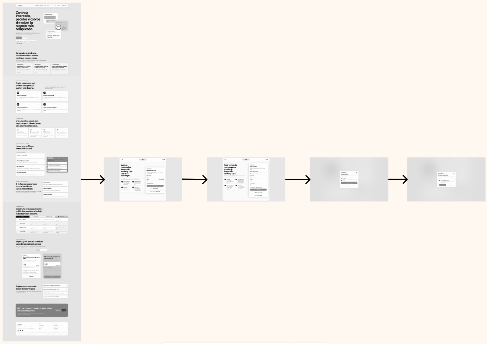
  </p>
 
**Descripción del flujo:** Don Lucho accede por primera vez a Entreprenly y necesita crear una cuenta para empezar a gestionar su negocio digitalmente.
 
**Pantalla de inicio (Login):** Don Lucho llega a la pantalla de Login. Presiona el enlace "¿No tienes cuenta? Regístrate". → El formulario cambia al modo Registro (transición sin cambio de URL, solo alternancia de componentes).
 
**Formulario de Registro:** Don Lucho ingresa su email y contraseña. Si los datos son válidos y el email no está registrado (US-52, Scenario 1): el sistema crea la cuenta, asigna el Plan Free automáticamente y muestra un mensaje de confirmación indicando que se envió un email de verificación. Si el email ya existe (US-52, Scenario 2): aparece un mensaje de error inline debajo del campo de email. Si la contraseña no cumple los requisitos (US-52, Scenario 3): se resaltan los requisitos no cumplidos debajo del campo de contraseña.
 
**Verificación de email (US-53):** Don Lucho revisa su correo y hace clic en el enlace de verificación. Si el token es válido: la cuenta queda activa y el sistema redirige directamente al Dashboard principal. Si el token expiró: la pantalla muestra un mensaje de error y el botón "Reenviar email de verificación".
 
**Pantalla de Login:** En visitas posteriores, Don Lucho ingresa email y contraseña. Si las credenciales son correctas (US-54, Scenario 1): el sistema genera un JWT y redirige al Dashboard. Si las credenciales son incorrectas (US-54, Scenario 2): aparece un mensaje de error genérico sin indicar qué campo falló. Si falló 5 veces (US-54, Scenario 3): la cuenta se bloquea y se envía notificación al email. Como alternativa, si Don Lucho prefiere usar Google (US-55): presiona "Continuar con Google" y completa el flujo OAuth.
 
---
 
**Wireflow 2 – User Goal: Registrar y gestionar el inventario de productos**
 
<p align="center">
    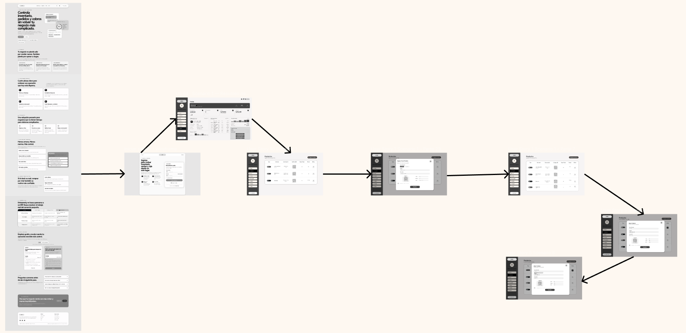
  </p>
 
**Descripción del flujo:** Don Lucho necesita agregar los productos de su minimarket al sistema para poder controlar el stock y registrar ventas.
 
**Desde el Sidebar → Módulo "Productos":** Don Lucho hace clic en la sección "Productos" del sidebar. El sistema carga la lista de productos existente (vacía en el primer acceso).
 
**Agregar producto (US-01):** Don Lucho presiona el botón primario "Agregar producto". El drawer lateral se despliega con el formulario de registro. Completa todos los campos obligatorios (nombre, tipo de medida, precio, stock inicial). Presiona "Guardar". Si todos los datos son válidos: el producto queda registrado y aparece en la grilla con su tarjeta correspondiente. Si hay campos obligatorios vacíos: los campos inválidos quedan resaltados en rojo y el botón "Guardar" permanece deshabilitado.
 
**Editar producto (US-05):** Don Lucho localiza el producto que desea editar mediante la búsqueda por nombre (US-12) o navegando en la grilla. Presiona el botón "Editar" en la tarjeta. El drawer lateral se abre con los datos actuales pre-cargados. Modifica los campos necesarios y presiona "Guardar". El sistema actualiza el producto y cierra el drawer mostrando la tarjeta actualizada en la grilla.
 
**Visualizar detalles (US-10):** Al hacer hover sobre cualquier tarjeta de producto, aparece el botón "Ver detalles". Al presionarlo, el sistema expande la tarjeta o despliega un panel con toda la información del producto incluyendo el historial de lotes asociados.
 
**Buscar productos (US-12):** Don Lucho escribe el nombre o categoría en el campo de búsqueda del panel izquierdo. El sistema filtra la grilla en tiempo real a medida que se ingresa cada carácter, sin requerir presionar Enter.
 
---
 
**Wireflow 3 – User Goal: Gestionar lotes y recibir alertas de vencimiento**
 
<p align="center">
    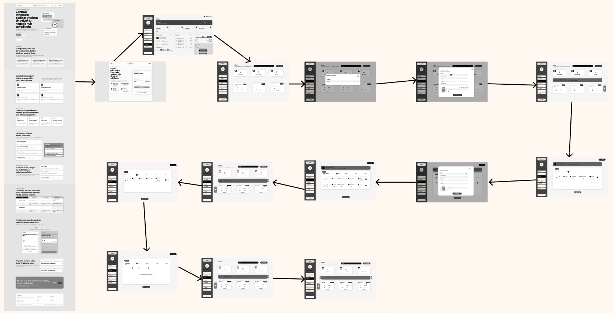
  </p>
 
**Descripción del flujo:** Don Lucho necesita crear lotes para controlar las fechas de vencimiento de sus productos perecederos y ser notificado cuando alguno esté próximo a vencer.
 
**Desde el Sidebar → Módulo "Lotes":** Al acceder al módulo, el sistema evalúa el estado de todos los lotes existentes. Si existen lotes próximos a vencer (US-11, Scenario 1): el panel de resumen superior muestra el banner de alerta amarillo con el listado de productos afectados. Si existen lotes vencidos (US-11, Scenario 2): el banner aparece en rojo. Si no hay condiciones críticas (US-09, Scenario 2): solo se muestran los contadores numéricos sin banner de alerta.
 
**Crear lote (US-23):** Don Lucho presiona "Crear lote". Se despliega un modal con los campos: selector de producto (búsqueda con autocompletado), número de lote, fecha de ingreso, fecha de vencimiento y cantidad/peso inicial. Al confirmar: el lote queda registrado y aparece en la tabla de lotes. Si intenta guardar sin haber seleccionado un producto: el campo del selector queda resaltado en rojo.
 
**Ver detalles de lote (US-06, US-08):** Don Lucho hace clic en "Ver detalles" de un lote específico. El sistema muestra el panel de detalle con todos los atributos del lote. Si el lote tiene stock bajo, está agotado o próximo a vencer: el panel muestra una alerta de estado con ícono y texto descriptivo del tipo de condición crítica detectada (US-08, Scenario 1). Si el estado del lote es normal: el panel muestra solo los datos sin alertas (US-08, Scenario 2).
 
**Editar lote (US-02) y Eliminar lote (US-04):** Desde la tabla de lotes, los botones de acción permiten editar los datos del lote (mismo flujo de drawer que para productos) o eliminarlo. Al presionar "Eliminar", el sistema muestra un modal de confirmación antes de ejecutar la acción para prevenir eliminaciones accidentales.
 
---
 
**Wireflow 4 – User Goal: Registrar una venta presencial**
 
<p align="center">
    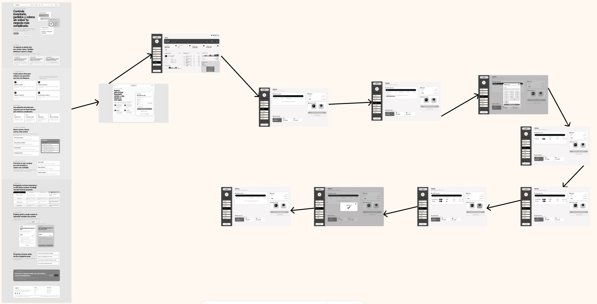
  </p>
 
**Descripción del flujo:** Don Lucho necesita atender a un cliente en el mostrador, registrar los productos comprados, seleccionar el método de pago y emitir el comprobante, todo sin interrumpir la atención al cliente.
 
**Desde el Sidebar → Módulo "Ventas":** La pantalla de POS carga con el ticket vacío y el Resumen de Caja en cero (o con los valores acumulados del día).
 
**Buscar y agregar producto (US-24):** Don Lucho escribe el nombre del producto en el buscador. El sistema muestra resultados en tiempo real. Al seleccionar un producto con tipo "Peso" (US-26): se despliega el modal "Registrar Peso". Si hay balanza IoT conectada: el peso se captura automáticamente (Scenario 1). Si no hay balanza: Don Lucho ingresa el peso manualmente (Scenario 2). Al seleccionar un producto con tipo "Unidad" (US-25): se despliega el modal "Registrar Cantidad" con un campo numérico entero. Si la cantidad o el peso solicitado supera el stock disponible: el sistema muestra el error "Stock insuficiente" y no permite agregar el ítem al ticket (US-25, Scenario 2 y US-26, Scenario 3).
 
**Gestionar el ticket (US-27):** El ítem confirmado aparece en el ticket del panel derecho con su subtotal calculado. Don Lucho puede eliminar cualquier ítem del ticket (Scenario 2): el sistema actualiza el total inmediatamente. Puede continuar agregando más productos.
 
**Seleccionar método de pago (US-28):** Don Lucho presiona "Efectivo" o "Tarjeta/Yape/Plin". El toggle seleccionado queda resaltado. Si intenta finalizar sin seleccionar ninguno: aparece el mensaje de validación "Por favor, seleccione un método de pago" (Scenario 2).
 
**Finalizar venta (US-29, US-30, US-31):** Don Lucho presiona "Finalizar venta y emitir boleta". El sistema registra la venta, genera el comprobante, actualiza el Resumen de Caja con el monto del método de pago utilizado (US-30) y limpia el ticket para la siguiente venta. Un Toast de confirmación verde aparece en la esquina inferior derecha durante 3 segundos.
 
---
 
**Wireflow 5 – User Goal: Configurar y vincular el chatbot de WhatsApp Business**
 
<p align="center">
    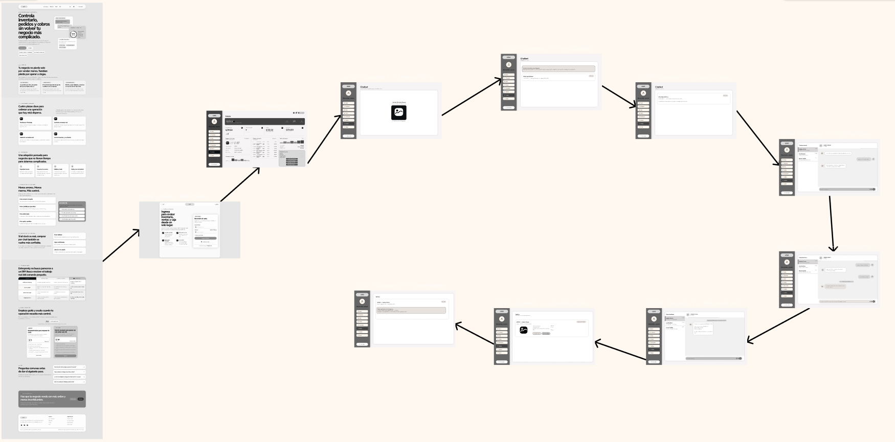
  </p>
 
**Descripción del flujo:** Don Lucho necesita conectar su número de WhatsApp Business al sistema para activar la atención automatizada de pedidos.
 
**Desde el Sidebar → Módulo "Chatbot":** Si no hay cuenta vinculada (US-32, Scenario 1): la pantalla muestra el panel de vinculación con el código QR generado, instrucciones y un temporizador de expiración (generalmente 60 segundos). Don Lucho abre WhatsApp Business en su teléfono y escanea el código. Si la vinculación es exitosa (US-32, Scenario 2): el sistema registra la sesión y la pantalla cambia automáticamente al estado "Conectado", mostrando el número vinculado y el listado de conversaciones (inicialmente vacío). Si el código QR expira antes de ser escaneado (US-32, Scenario 3): el sistema descarta el código expirado, muestra el mensaje "El código expiró" y genera uno nuevo automáticamente.
 
**Consultar estado de conexión (US-33):** En visitas posteriores al módulo, si la sesión sigue activa (Scenario 1): se muestra el estado "Activo" con el número vinculado. Si la sesión expiró o fue cerrada desde el teléfono (Scenario 2): se muestra el estado "Desconectado" y el botón "Volver a vincular" para reiniciar el proceso de QR.
 
**Gestionar conversaciones (US-34, US-35):** La lista de conversaciones del panel izquierdo muestra cada chat ordenado por el más reciente. Don Lucho hace clic en una conversación para ver el historial completo en el panel derecho. Si desea responder manualmente: escribe en el campo de texto y presiona "Enviar". Si el campo está vacío al presionar "Enviar": el sistema no procesa el envío (US-35, Scenario 2).
 
---
 
**Wireflow 6 – User Goal: Activar o gestionar la suscripción al Plan Control**
 
<p align="center">
    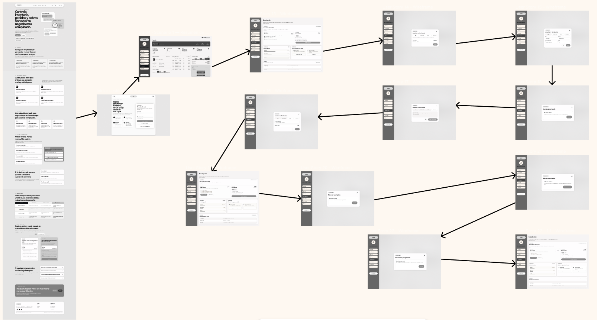
  </p>
 
**Descripción del flujo:** Don Lucho, con el Plan Free asignado por defecto, decide contratar el Plan Control para acceder a funcionalidades avanzadas como el módulo de chatbot y la integración con balanza IoT.
 
**Desde el Sidebar → Módulo "Suscripción":** La pantalla muestra el panel comparativo de planes con el estado actual "Plan Free". Don Lucho presiona "Elegir plan" en la tarjeta del Plan Control (US-13, Scenario 1). La tarjeta queda seleccionada visualmente (borde naranja activo) y el botón "Continuar con la suscripción" queda habilitado. Si intenta continuar sin seleccionar ningún plan (US-13, Scenario 2): el sistema muestra el mensaje "Selecciona un plan para continuar".
 
**Proceso de suscripción (US-14, US-15, US-16):** Al presionar "Continuar con la suscripción", el sistema navega al formulario de facturación. Don Lucho completa los datos personales y de pago. Presiona "Continuar al pago". Si los datos son válidos: el sistema muestra el resumen previo al cobro. Don Lucho presiona "Pagar y activar suscripción". Si el cobro es aprobado: el sistema activa el Plan Control y redirige al panel de suscripción con el estado "Activa" (US-17, Scenario 1). Si el cobro falla: aparece el mensaje de error con el motivo dentro de la misma vista sin perder los datos ingresados (US-16, Scenario 2).
 
**Gestión de suscripción activa (US-18 al US-22):** Don Lucho puede renovar su suscripción (US-20), lo que actualiza la fecha de vencimiento, o solicitar la cancelación (US-21), lo que muestra un modal de confirmación antes de ejecutar. Si decide cancelar y confirma: el sistema registra la solicitud, mantiene el acceso activo hasta la fecha de vencimiento y actualiza la etiqueta de estado a "Cancelación programada". Al llegar la fecha de vencimiento: el sistema cancela automáticamente el plan premium y devuelve la cuenta al Plan Free (US-22).


### 4.4.3. Web Applications Mock-ups

Esta sección presenta los mock-ups de alta fidelidad de la aplicación web de Entreprenly. Los mock-ups reflejan el diseño visual final de cada pantalla, aplicando el Design System del proyecto: paleta de colores, tipografía, componentes, espaciado e iconografía definidos en la sección 4.1. Cada pantalla evidencia los principios de diseño inclusivo, jerarquía visual y arquitectura de información establecidos para la plataforma.
 
#### Dashboard Principal
 
`[INSERTAR IMAGEN: Mock-up - Dashboard Principal]`
 
*Ilustración N – Web Application Mock-up: Dashboard Principal*
 
El dashboard aplica la paleta de colores primaria del proyecto sobre una superficie clara (#FFFFFF), con tarjetas de resumen financiero que distinguen visualmente el efectivo en caja de los pagos digitales mediante color de acento. Las alertas de inventario se presentan con indicadores de estado de color, advertencia en amarillo para lotes próximos a vencer, crítico en rojo para stock agotado, para garantizar una lectura inmediata del estado operativo sin necesidad de navegar a módulos secundarios. El sidebar muestra los módulos activos con el ícono correspondiente y destaca con color de fondo el módulo actualmente seleccionado.
 
#### Módulo de Productos
 
`[INSERTAR IMAGEN: Mock-up - Módulo de Productos]`
 
*Ilustración N – Web Application Mock-up: Módulo de Productos*
 
La vista de inventario presenta la grilla de tarjetas de producto con tipografía de alto contraste sobre fondo claro. Los botones de acción primaria (Agregar producto) siguen el color de acción definido en el Design System. Los badges de tipo de medida ("UNIDAD" o "PESO") se presentan con colores diferenciados para facilitar la identificación rápida. El estado del stock se codifica visualmente con colores de estado consistentes en todo el sistema: verde para disponible, amarillo para bajo y rojo para agotado. El drawer lateral aplica el mismo sistema de componentes que el resto de la plataforma, con inputs en estado neutro, focus y error, y el botón "Guardar" en el color de acción primario.
 
#### Módulo de Lotes
 
`[INSERTAR IMAGEN: Mock-up - Módulo de Lotes]`
 
*Ilustración N – Web Application Mock-up: Módulo de Lotes*
 
La vista de lotes presenta el panel de resumen en la parte superior con los tres contadores estilizados en tarjetas de fondo claro. Cuando existen condiciones críticas, el banner de alerta aparece con borde izquierdo de 4 px en el color de estado (amarillo para próximos a vencer, rojo para vencidos) y contrasta visualmente sobre el fondo blanco de la página. La tabla de lotes aplica filas con fondo alternado para facilitar la lectura horizontal y los badges de estado (Vigente, Por vencer, Vencido) utilizan los colores de estado del sistema. El modal de creación de lote aplica el mismo sistema de inputs y validación que el drawer de productos.
 
#### Módulo de Ventas Presencial
 
`[INSERTAR IMAGEN: Mock-up - Módulo de Ventas POS]`
 
*Ilustración N – Web Application Mock-up: Módulo de Ventas Presencial*
 
El punto de venta presenta la distribución de dos columnas con la división visual claramente definida mediante una línea divisoria o diferencia de fondo. El catálogo de productos en el panel izquierdo usa cards compactas con imagen de referencia, nombre y precio visible. El indicador de peso de la balanza IoT se muestra en tiempo real con un componente destacado, un recuadro con borde del color de acento y el valor en tipografía grande, cuando el producto activo es de tipo "por peso". El ticket de venta en el panel derecho muestra los ítems en una lista limpia con subtotales alineados a la derecha. La selección del método de pago usa botones de toggle de ancho completo con iconografía de las plataformas (efectivo, Yape, Plin). El resumen de caja en la parte inferior del panel izquierdo muestra los tres contadores con iconografía diferenciada para efectivo y digital.
 
#### Módulo de Chatbot WhatsApp
 
`[INSERTAR IMAGEN: Mock-up - Módulo de Chatbot]`
 
*Ilustración N – Web Application Mock-up: Módulo de Chatbot WhatsApp*
 
El módulo de chatbot aplica el patrón visual de las aplicaciones de mensajería modernas. El panel izquierdo de conversaciones usa avatares de color generado por el número de WhatsApp del cliente, con el nombre, el preview del último mensaje y el timestamp relativo. El panel derecho de conversación presenta las burbujas diferenciadas: los mensajes del bot en el color secundario del sistema y los mensajes del cliente en fondo blanco con borde sutil. El estado de vinculación de la cuenta WhatsApp Business se muestra de forma prominente en el encabezado del módulo, con indicador de punto verde para "Conectado" y rojo para "Desconectado".
 
#### Módulo de Pedidos del Chatbot
 
`[INSERTAR IMAGEN: Mock-up - Módulo de Pedidos]`
 
*Ilustración N – Web Application Mock-up: Panel de Pedidos del Chatbot*
 
El panel de pedidos presenta las filas de la tabla con los badges de estado usando el sistema de colores del proyecto. El panel lateral de detalle del pedido aplica una distribución visual clara: en la parte superior, los datos del cliente y los productos solicitados en formato de lista compacta; en el área central, el visor del comprobante de pago cargado por el cliente con posibilidad de ampliar la imagen; y en la parte inferior fija, los botones de acción "Aprobar" (en color de éxito) y "Rechazar" (en color de error) con el campo de motivo que aparece al seleccionar "Rechazar". La alerta por pagos rechazados repetidos se muestra como un badge de advertencia junto al nombre del cliente, consistente con el sistema de alertas del resto de la plataforma.
 
#### Módulo de Suscripción
 
`[INSERTAR IMAGEN: Mock-up - Módulo de Suscripción]`
 
*Ilustración N – Web Application Mock-up: Módulo de Suscripción*
 
La vista de selección de plan presenta las dos tarjetas comparativas con una diferenciación visual clara: la tarjeta del Plan Control usa el color de acento del sistema como borde y el badge "Recomendado" en el color primario. La lista de funcionalidades usa íconos de check para las incluidas y íconos de bloqueo para las no disponibles en el plan inferior. El formulario de facturación sigue el mismo sistema de inputs y validación que el resto de la plataforma. El panel de gestión del plan activo presenta el estado de la suscripción con una etiqueta de badge verde "Activa", la fecha de próxima renovación y el historial de pagos en formato de tabla compacta.

### 4.4.4. Web Applications User Flow Diagrams

Esta sección presenta los User Flow Diagrams de la aplicación web de Entreprenly. A diferencia de los Wireflows, los User Flows incluyen los mock-ups de las pantallas junto con los nodos de decisión, condiciones y rutas alternativas que conforman el flujo completo de cada objetivo de usuario. Cada diagrama está acompañado del User Goal al que responde y una explicación de los flujos y condiciones especificadas.
 
 ---
**User Flow 1 – Gestión de inventario (agregar, editar y buscar productos)**
 
*User Goal: El comerciante desea tener su catálogo de productos completo y actualizado en el sistema.*
 
`[INSERTAR IMAGEN: User Flow Diagram - Gestión de Inventario]`
 
*Ilustración N – Web Application User Flow Diagram: Gestión de Inventario*
 
**Happy Path:**
Dashboard → Clic "Productos" en Sidebar → Vista de productos → Clic "Agregar producto" → Drawer lateral se despliega → Completa todos los campos → Clic "Guardar" → Toast de éxito "Producto registrado correctamente" → Drawer se cierra → Nuevo producto aparece en la grilla.
 
**Unhappy Paths:**
- Campos obligatorios vacíos al guardar (US-01): → Campos resaltados con mensajes de validación → Botón "Guardar" permanece deshabilitado.
- Búsqueda sin resultados (US-13): → La grilla muestra el estado vacío con el mensaje "No se encontraron productos que coincidan con tu búsqueda".
---
 
**User Flow 2 – Creación de lotes y gestión de alertas de vencimiento**
 
*User Goal: El comerciante desea crear lotes para productos perecederos y ser notificado de su vencimiento.*
 
`[INSERTAR IMAGEN: User Flow Diagram - Gestión de Lotes]`
 
*Ilustración N – Web Application User Flow Diagram: Gestión de Lotes*
 
**Happy Path:**
Dashboard → Clic "Lotes" → Panel de resumen con contadores → Clic "Crear lote" → Modal de creación → Selecciona producto → Completa fecha de vencimiento y cantidad → Clic "Agregar" → Modal se cierra → Lote aparece en la tabla con badge "Activo".
 
**Unhappy Paths:**
- No selecciona producto al guardar (US-24): → Campo de producto resaltado → Modal permanece abierto.
- Fecha de vencimiento anterior a la fecha actual: → Mensaje de validación "La fecha de vencimiento no puede ser una fecha pasada".
- Acceso al módulo cuando existen lotes próximos a vencer (US-11): → Banner de alerta amarillo visible en panel superior → Lotes afectados aparecen primero en la tabla por ordenamiento automático.
---
 
**User Flow 3 – Registro de venta presencial**
 
*User Goal: El cajero desea registrar los productos comprados por un cliente, procesar el pago y emitir el comprobante.*
 
`[INSERTAR IMAGEN: User Flow Diagram - Venta Presencial]`
 
*Ilustración N – Web Application User Flow Diagram: Registro de Venta Presencial*
 
**Happy Path:**
Dashboard → Clic "Ventas" → Módulo POS carga → Cajero escribe nombre del producto en buscador → Sistema muestra resultados → Cajero selecciona producto → Modal de cantidad/peso aparece → Ingresa valor → Clic "Confirmar" → Ítem aparece en el ticket con subtotal → Repite para más productos si es necesario → Cajero selecciona método de pago → Clic "Finalizar venta y emitir boleta" → Toast verde de éxito → Ticket se limpia → Resumen de caja se actualiza.
 
**Unhappy Paths:**
- Stock insuficiente al confirmar cantidad (US-25, Scenario 2 / US-26, Scenario 3): → Modal muestra "Stock insuficiente. Disponible: X unidades/kg" → No se agrega el ítem → Cajero puede ajustar la cantidad.
- Balanza IoT sin respuesta (US-26): → Sistema muestra "Balanza no disponible" → Permite ingreso manual del peso.
- Intento de finalizar sin método de pago (US-28): → Mensaje inline "Por favor, seleccione un método de pago" → Botón finalizar permanece deshabilitado.
- Intento de finalizar con ticket vacío (US-30): → Mensaje inline "No hay productos en el ticket" → Botón finalizar permanece deshabilitado.
---
 
**User Flow 4 – Validación de pago de pedido del chatbot**
 
*User Goal: El comerciante desea revisar los pedidos recibidos por WhatsApp y validar los pagos para confirmar las entregas de manera segura.*
 
`[INSERTAR IMAGEN: User Flow Diagram - Validación de Pago]`
 
*Ilustración N – Web Application User Flow Diagram: Validación de Pago de Pedido del Chatbot*
 
**Happy Path:**
Dashboard → Clic "Pedidos" → Lista de pedidos → Selecciona pedido en estado "Esperando validación" → Panel lateral se despliega → Revisa detalle y comprobante de pago → Clic "Aprobar pago" → Modal de confirmación → Clic "Confirmar" → Pedido pasa a estado "Confirmado" → Stock se descuenta → Chatbot envía comprobante al cliente por WhatsApp → Toast de éxito.
 
**Unhappy Paths:**
- Rechazo de pago (US-43): → Comerciante presiona "Rechazar pago" → Se habilita campo de motivo → Ingresa motivo → Clic "Confirmar rechazo" → Pedido vuelve a estado "Esperando pago" → Chatbot notifica al cliente.
- Segundo rechazo del mismo cliente (US-48, Scenario 2): → Sistema genera alerta de advertencia al comerciante → Pedido queda bloqueado para revisión manual.
- Cancelación automática por timeout (US-47): → A los 60 minutos sin reporte de pago → Sistema cancela el pedido automáticamente → Libera el stock reservado → Chatbot notifica al cliente → Pedido aparece con estado "Cancelado (Timeout de pago)".
---
 
**User Flow 5 – Suscripción al Plan Control**
 
*User Goal: El comerciante con Plan Free desea contratar el Plan Control para acceder a funcionalidades premium.*
 
`[INSERTAR IMAGEN: User Flow Diagram - Suscripción]`
 
*Ilustración N – Web Application User Flow Diagram: Suscripción al Plan Control*
 
**Happy Path:**
Dashboard → Clic "Suscripción" → Pantalla muestra comparativa de planes → Clic "Elegir plan" en tarjeta Plan Control → Tarjeta queda seleccionada → Clic "Continuar con la suscripción" → Formulario de facturación → Completa datos → Clic "Continuar al pago" → Resumen de cobro → Clic "Pagar y activar suscripción" → Pago aprobado → Plan Control activado → Panel de suscripción muestra estado "Activa".
 
**Unhappy Paths:**
- Intento de continuar sin seleccionar plan (US-14, Scenario 2): → Mensaje "Selecciona un plan para continuar" → Botón deshabilitado.
- Datos de facturación incompletos (US-16, Scenario 2): → Campos inválidos resaltados → No avanza al paso de pago.
- Cobro rechazado (US-17, Scenario 2): → Mensaje de error con el motivo → El plan no se activa → Comerciante puede corregir datos y reintentar.


## 4.5. Web Applications Prototyping

### Introducción y criterios de diseño
 
El prototipo interactivo de Entreprenly simula la navegación y los principales flujos de interacción de la aplicación web, permitiendo evaluar la coherencia de la experiencia de usuario antes del desarrollo, identificar puntos de fricción y validar las decisiones de arquitectura de información tomadas a lo largo del capítulo 4. El prototipo fue construido en Figma utilizando conexiones de prototipado entre frames, transiciones y overlays para representar de forma fiel los comportamientos especificados en los User Flow Diagrams.
Los criterios de diseño que guiaron las decisiones de interacción y navegación del prototipo son los siguientes:
 
**Orientación al flujo operativo del comerciante:** La arquitectura de navegación prioriza el acceso inmediato a las tres tareas de mayor frecuencia e importancia definidas en el User Task Matrix del capítulo 2: verificar stock, registrar ventas y gestionar pedidos del chatbot. Por esta razón, el Sidebar de navegación mantiene los módulos de "Ventas", "Productos" y "Pedidos" como los primeros ítems de la lista, por encima de módulos de menor frecuencia de uso como "Suscripción".
 
**Consistencia en los patrones de interacción:** Se emplearon cuatro patrones de navegación a lo largo de toda la aplicación:
(1) **Navegación por Sidebar** para el cambio entre módulos principales;
(2) **Drawer lateral deslizante** para formularios de creación y edición que no requieren cambio de contexto (productos, lotes, detalle de pedido); 
(3) **Modal central** para acciones críticas que requieren confirmación del usuario (eliminar lote, confirmar cancelación de suscripción, aprobar/rechazar pago); y 
(4) **Toast / Snackbar** para retroalimentación inmediata de resultado (éxito, error, advertencia) sin interrumpir el flujo operativo. Esta consistencia reduce la carga cognitiva del usuario, ya que los patrones aprendidos en un módulo son directamente aplicables a los demás.
 
**Prevención de errores en acciones de alto impacto:** En operaciones destructivas o financieramente sensibles como eliminar un lote, cancelar una suscripción activa, aprobar o rechazar el pago de un pedido, finalizar una venta, el prototipo incluye siempre una capa adicional de confirmación mediante modal que describe el impacto de la acción antes de ejecutarla, conforme al principio heurístico de Nielsen de "Prevención de errores".
 
**Retroalimentación inmediata en tiempo real:** Todos los cambios en el estado del sistema que afectan al usuario se comunican de forma inmediata: los contadores del Resumen de Caja se actualizan al finalizar cada venta, los badges de estado de los lotes cambian al detectar condiciones de vencimiento, y los campos de formulario muestran validación inline sin necesidad de enviar el formulario completo.
 
**Accesibilidad y objetivos táctiles:** Todos los elementos interactivos del prototipo tienen dimensiones mínimas de 48 × 48 px para cumplir los requisitos de objetivo táctil tanto en uso con ratón como en tablets. Los contrastes de color en todos los estados (normal, hover, focus, disabled) cumplen el mínimo WCAG 2.1 AA (ratio 4.5:1 para texto normal y 3:1 para texto grande).
 
El prototipo interactivo completo está disponible en Figma, donde puede navegarse en modo presentación para simular la experiencia real de uso.

`[INSERTAR IMAGEN: Screenshot del video de prototipo - flujo principal]`
 
*Ilustración N – Web Application Prototyping: Vista general del flujo de navegación*
 
### Flujos de interacción cubiertos por el prototipo
 
El prototipo cubre los siguientes flujos principales de interacción, representando tanto las rutas exitosas (happy paths) como las principales rutas alternativas ante errores o condiciones de excepción:
 
**Flujo 1 – Gestión de inventario:** Comprende las pantallas del módulo de Productos (listado, búsqueda, drawer de creación y edición) y del módulo de Lotes (listado con alertas de estado, modal de creación, panel de detalles). Se simula el comportamiento del banner de alerta al existir lotes próximos a vencer y el bloqueo del formulario ante campos inválidos.
 
**Flujo 2 – Registro de venta:** Comprende la pantalla completa del módulo de Ventas con la simulación del flujo de búsqueda de producto, selección del modal según tipo (unidad/peso), captura de peso desde balanza IoT con fallback a ingreso manual, confirmación de cantidad, construcción del ticket, selección de método de pago y finalización con Toast de confirmación y actualización del Resumen de Caja.
 
**Flujo 3 – Gestión de pedidos del chatbot:** Comprende la pantalla del módulo de Pedidos con la visualización de la tabla de pedidos en sus distintos estados, el panel lateral de detalle con el visor del comprobante de pago y la simulación del flujo de aprobación y rechazo, incluyendo la alerta por rechazos repetidos y la cancelación automática por timeout.
 
**Flujo 4 – Chatbot WhatsApp:** Comprende el flujo de vinculación por QR, la transición al estado conectado y la gestión de conversaciones activas con el panel de mensajería.
 
**Flujo 5 – Suscripción:** Comprende el flujo completo de selección de plan, formulario de facturación, confirmación de pago y activación del Plan Control, incluyendo el estado del panel de suscripción con plan activo y las opciones de renovación y cancelación.
 
El video de demostración del prototipo, donde se explican en detalle los flujos principales y las decisiones de diseño más relevantes, está disponible en Microsoft Stream en el siguiente enlace:
 
**Enlace al video del prototipo:** *(Enlace pendiente de subida al repositorio del equipo)*


## 4.6. Domain-Driven Software Architecture

En esta sección se elaboró el diseño de los Bounded Contexts (BC) y sus conexiones dentro del sistema.

### 4.6.1. Design-Level Event Storming
A continuación, se presentan los distintos Bounded Contexts identificados a partir del Event Storming, junto con sus respectivos diagramas y BC Canvas.

Generación y Autenticación de Cuenta
<p align="center">   

</p>

En este Bounded Context se realiza la creación de cuentas y la gestión de inicios de sesión. El flujo inicia brindando la opción de registrarse como nuevo usuario o ingresar credenciales si ya posee una cuenta. Además, se ofrecen métodos alternativos de autenticación.

Perfil y Configuración
<p align="center">   </p>

En este Bounded Context se gestiona la configuración del perfil del usuario, incluyendo cambios de zona horaria, idioma, preferencias de interfaz (como modo oscuro), contraseña y otras configuraciones.

Gestión y Proceso de Suscripción
<p align="center">   </p>

Este Bounded Context se encarga de la renovación, cambio y cancelación de planes de suscripción. Además, realiza las validaciones necesarias durante todo el proceso de suscripción.

Gestión de Inventario
<p align="center">   </p>

En este Bounded Context se realiza la creación y modificación de productos. También incluye la gestión de lotes (creación, modificación y eliminación), así como funcionalidades adicionales como alertas de caducidad y control de stock.

Chatbot de WhatsApp
<p align="center">   </p>

Este Bounded Context permite la venta a través de un chatbot de WhatsApp. Para ello, consume información del inventario con el fin de conocer la disponibilidad de productos.

Pagos
<p align="center">   </p>

En este Bounded Context se gestionan los pagos tanto de ventas presenciales como de aquellas realizadas a través de WhatsApp.

Ventas
<p align="center">   </p>

En este Bounded Context se realiza la gestión de ventas presenciales. Este proceso incluye la verificación de stock y la asignación de datos dependiendo del tipo de producto (por unidad o por peso).

Unión de Bounded Contexts
<p align="center">  </p>

Este diagrama muestra la integración y comunicación entre los diferentes Bounded Contexts, evidenciando las relaciones y dependencias dentro del sistema.
 
A continuación, se presentan los principales flujos de interacción del sistema, los cuales permiten visualizar la secuencia de operaciones entre los distintos Bounded Contexts en escenarios clave del negocio.
<p align="center"> </p>

<p align="center"></p>

<p align="center"></p>

<p align="center"></p>

<p align="center"></p>

<p align="center"></p>

<p align="center"></p>

### 4.6.2. Software Architecture Context Diagram
<p align="center">A continuación, se presenta el System Context Diagram del sistema Entreprenly. En este diagrama se identifica al actor principal, denominado "Emprendedor", quien interactúa con la plataforma a través de la aplicación web. Asimismo, se muestran los sistemas externos que se integran con la solución, tales como servicios de autenticación, mensajería, almacenamiento y procesamiento de pagos.</p>
<p align="center">
<p align="center">
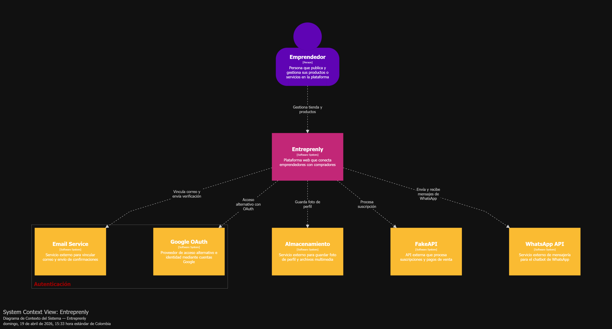
</p>

### 4.6.3. Software Architecture Container Diagrams
<p align="center">A continuación, se presenta el Container Diagram del sistema Entreprenly. Este diagrama describe la arquitectura interna a nivel de contenedores, mostrando los principales componentes desplegables, como la aplicación web, el API Gateway y los distintos Bounded Contexts implementados como servicios independientes. Además, se incluyen las bases de datos asociadas a cada contexto y los sistemas externos con los que interactúan, permitiendo visualizar la distribución de responsabilidades, la comunicación entre componentes y la estructura general del sistema</p>
<p align="center">
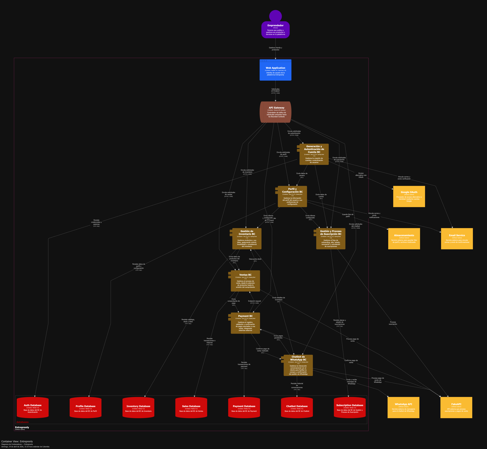
</p>

### 4.6.4. Software Architecture Components Diagrams
<p align="center">Generación y Autenticación de Cuenta BC</p> <p align="center">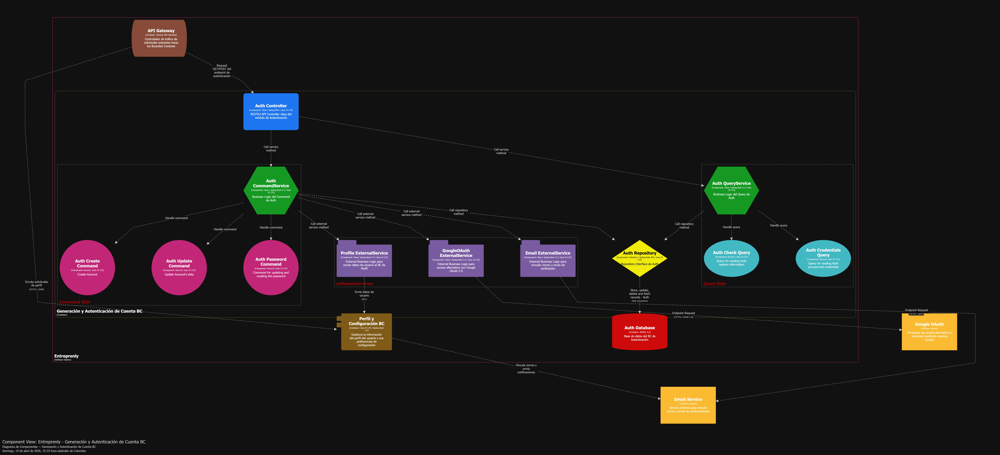</p>

Este Bounded Context es responsable de la gestión de identidad del usuario dentro del sistema, abarcando tanto el registro como la autenticación. Para ello, integra mecanismos de acceso alternativo mediante Google OAuth, así como un sistema externo de correo para la verificación y vinculación de cuentas.
A nivel funcional, incluye queries orientados a la lectura de datos de sesión y credenciales, y commands destinados a la creación de cuentas, actualización de información y cambio de contraseña.
Finalmente, toda la información relacionada con autenticación es persistida en una base de datos MySQL, garantizando la consistencia y seguridad de los datos.

<p align="center">Perfil y Configuración BC</p> <p align="center">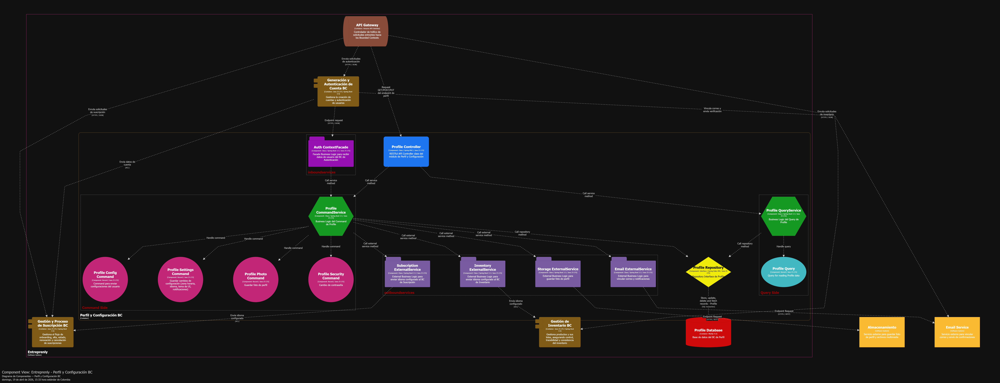</p>

Este Bounded Context se encarga de la gestión de la información del perfil del usuario y sus preferencias de configuración, tales como zona horaria, idioma, tema de interfaz (UI), notificaciones y foto de perfil.
Recibe información inicial del usuario desde el Bounded Context de Generación y Autenticación de Cuenta (inbound), lo que le permite construir y mantener el perfil completo.
Define queries para la lectura de datos del usuario y commands para la actualización de configuraciones y almacenamiento de cambios realizados. Además, puede enviar información configurada hacia otros contextos (outbound), como el idioma del usuario.
Toda esta información es almacenada en una base de datos MySQL.

<p align="center">Gestión y Proceso de Suscripción BC</p> <p align="center">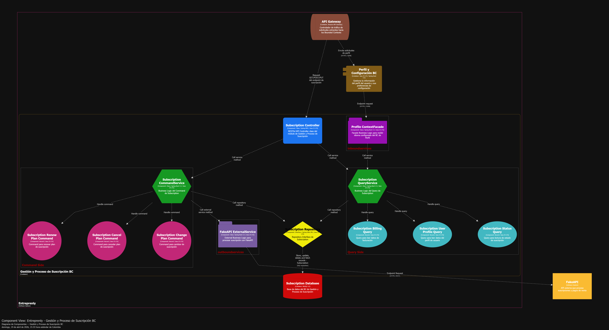</p>

Este Bounded Context es responsable de la gestión del ciclo de vida de las suscripciones, incluyendo la creación, renovación, cancelación y cambio de plan.
Recibe como entrada información del usuario y configuraciones provenientes del Bounded Context de Perfil y Configuración (inbound), lo que le permite adaptar el proceso de suscripción a las preferencias del usuario.
Cuenta con commands que gestionan las operaciones sobre la suscripción y queries que permiten consultar el estado, datos de facturación y detalles asociados al usuario.
La información de suscripciones es persistida en una base de datos MySQL, asegurando el control y seguimiento del estado de cada cuenta.

<p align="center">Gestión de Inventario BC</p> <p align="center">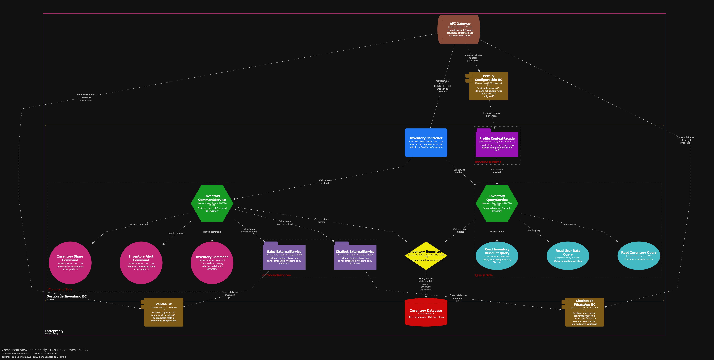</p>

Este Bounded Context se encarga de la administración del inventario, incluyendo la creación, actualización y eliminación de productos, así como la gestión de lotes asociados.
Además, incorpora funcionalidades de monitoreo como alertas de stock y caducidad de productos. Para ello, utiliza queries que permiten obtener configuraciones relevantes, como el idioma del usuario desde el Bounded Context de Perfil y Configuración (inbound).
Asimismo, expone información de productos hacia otros contextos (outbound), como Ventas y Chatbot.
Incluye commands para la gestión de productos y operaciones relacionadas, y persiste toda la información en una base de datos MySQL.

<p align="center">Pagos BC</p> <p align="center">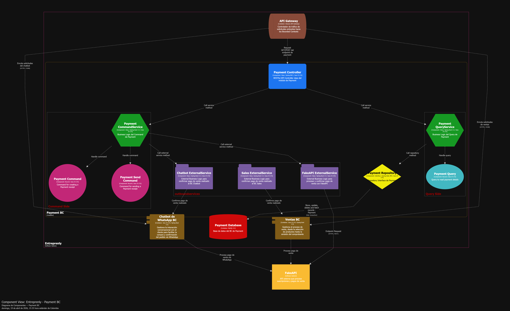</p>

Este Bounded Context es responsable de la gestión de los pagos asociados a las ventas, tanto presenciales como realizadas a través de otros canales como el chatbot.
Incluye queries para la consulta de información de pagos y commands para la generación y envío de comprobantes. Además, se encarga de validar y confirmar transacciones mediante la integración con servicios externos.
La información de pagos es almacenada en una base de datos MySQL, permitiendo el seguimiento y control de las transacciones realizadas.

<p align="center">Ventas BC</p> <p align="center">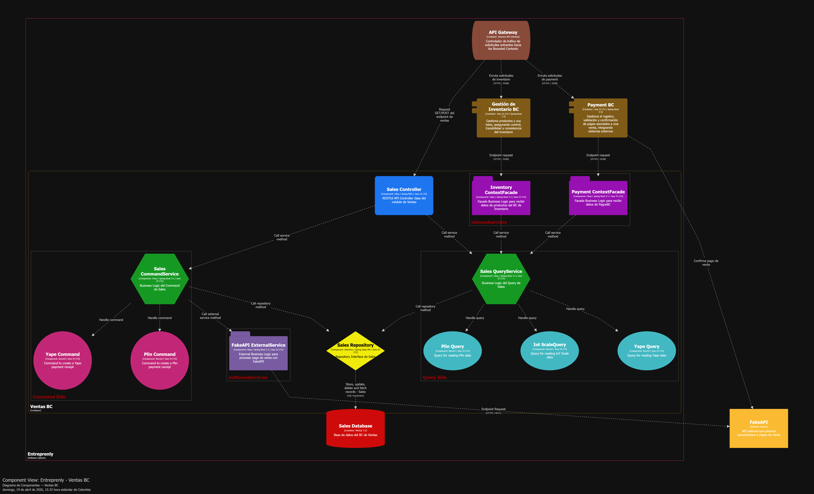</p>

Este Bounded Context gestiona el proceso de venta presencial, desde la selección de productos hasta la generación del comprobante.
Para ello, consume información del Bounded Context de Inventario (inbound) para validar disponibilidad de productos y stock, así como del Bounded Context de Pagos para verificar el estado de las transacciones.
Incluye queries para la consulta de información relevante y commands para registrar las ventas realizadas.
Toda la información generada es persistida en una base de datos MySQL.

<p align="center">ChatBot BC</p> <p align="center">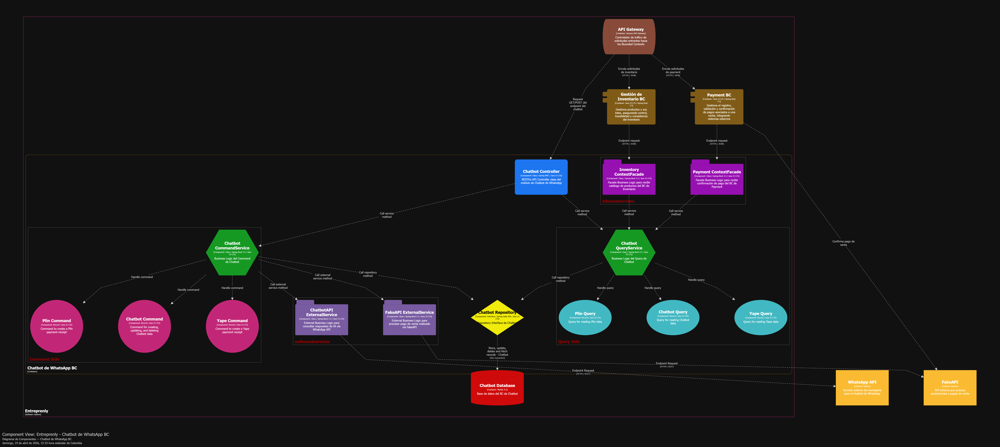</p>

Este Bounded Context permite la gestión de ventas a través de un canal conversacional basado en WhatsApp.
Para su funcionamiento, consume información del Bounded Context de Inventario (inbound) para consultar disponibilidad de productos, así como del Bounded Context de Pagos para verificar y confirmar transacciones.
Incluye queries para la obtención de información necesaria durante la interacción con el usuario y commands para la generación de pedidos y procesamiento de pagos.
Además, se integra con servicios externos de mensajería (WhatsApp API) y persiste la información en una base de datos MySQL, permitiendo el seguimiento de las conversaciones y transacciones realizadas.

## 4.7. Software Object-Oriented Design

### 4.7.1. Class Diagrams

<p align="center">Generación y Autenticación de Cuenta BC</p>
<p align="center">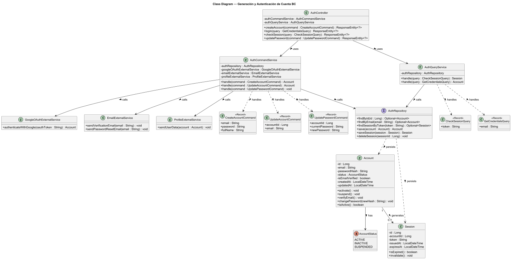</p>

<p align="center">Perfil y Configuración BC</p>
<p align="center">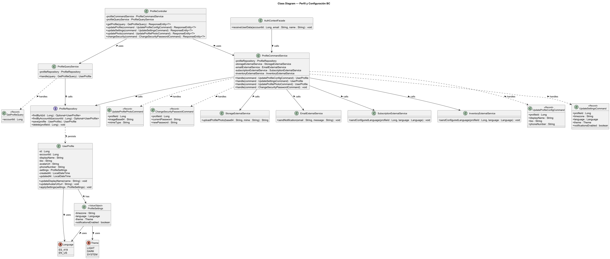</p>

<p align="center">Gestión y Proceso de Suscripción BC</p>
<p align="center">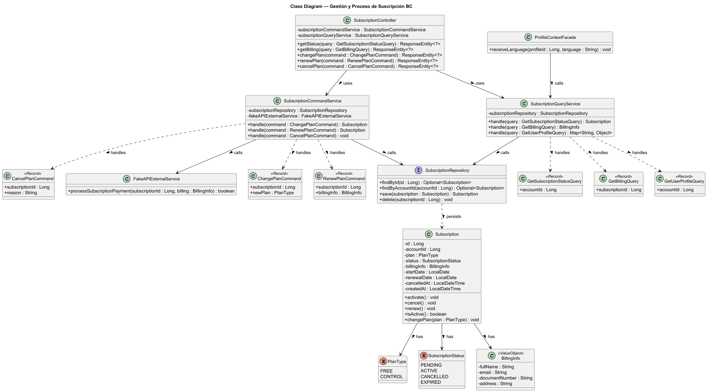</p>

<p align="center">Gestión de Inventario de Suscripción BC</p>
<p align="center">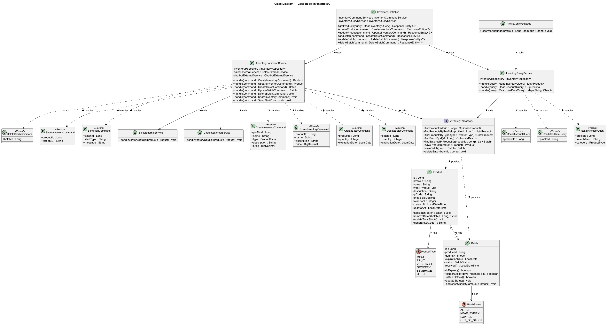</p>

<p align="center">Pagos BC</p>
<p align="center">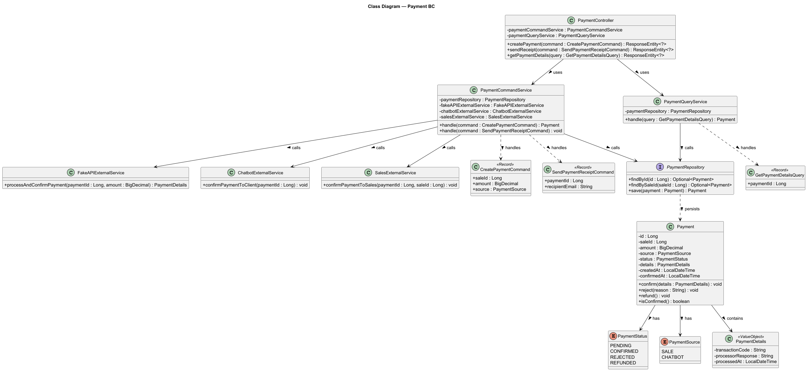</p>

<p align="center">Ventas BC</p>
<p align="center">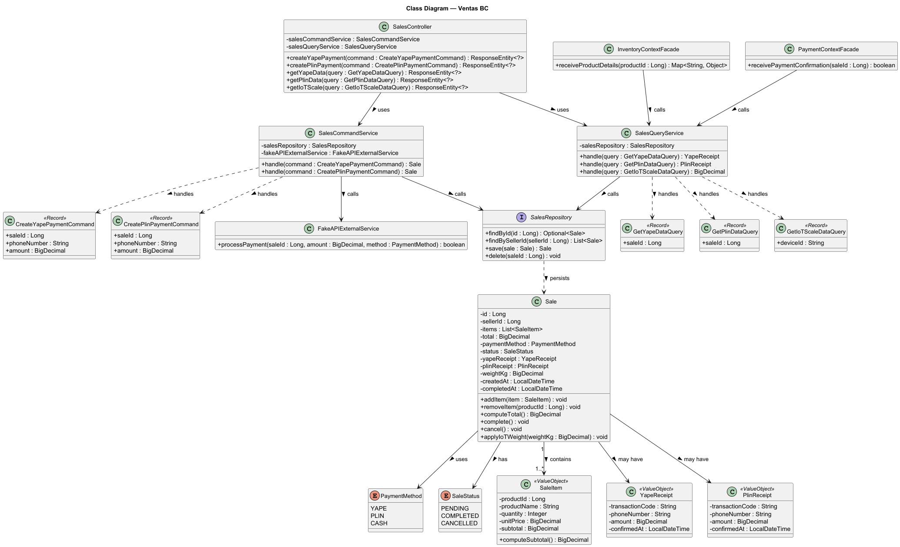</p>

<p align="center">Chatbot de WhatsApp BC</p>
<p align="center">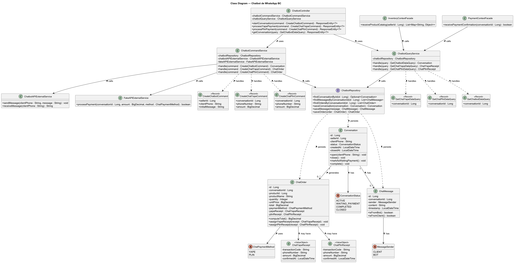</p>

## 4.8. Database Design

El diseño de base de datos de Entreprenly está implementado en MySQL 8.0 y organizado en seis categorías. El esquema aplica normalización hasta la Tercera Forma Normal (3FN), eliminando redundancias y garantizando la integridad referencial en toda la operación del negocio.

El sistema distingue dos actores con responsabilidades distintas: los **Comerciantes**, quienes administran el negocio y tienen suscripción activa, y los **Clientes**, cuyos datos se registran únicamente para boletas y pedidos por WhatsApp, sin acceso al sistema.

Los productos se clasifican en tipo `unidad` (precio por unidad) y tipo `peso`o (precio por kilogramo), lo que determina cómo se interpreta el `stock_total` en cada caso.

La balanza IoT se integra mediante `LecturasBalanza`, que registra cada pesaje y se vincula a una venta al confirmar la transacción, descontando el stock automáticamente.

El arqueo de caja diario se gestiona en `ResumenDiario`, cuyo campo `total_general` es una columna calculada con `GENERATED ALWAYS AS` para evitar inconsistencias.

Los pagos digitales (Yape y Plin) operan bajo un modelo P2P con validación manual del comerciante desde el dashboard.

El chatbot de WhatsApp se integra mediante `ConexionesWhatsApp`, que persiste la sesión del número vinculado por QR, y `Conversaciones`, que registra cada mensaje del chat.

### 4.8.1. Database Diagrams

<div align="center">


</div>

El esquema se organiza en las siguientes tablas por categoría:

**Identidad y Acceso:**

- `Comerciantes` (datos de acceso y rol).
- `PreferenciasComercio` (idioma, tema y notificaciones).
- `SesionesActivas` (JWTs activos para revocación de sesiones).
- `TokensVerificacion` (tokens de un solo uso para verificar email y recuperar contraseña).
- `Clientes` (datos para boletas).

**Suscripciones:**

- `Suscripciones` (plan y ciclo de vida: pendiente → activa → cancelada → vencida).
- `BoletoSuscripcion` (datos del cobro, guarda solo los últimos 4 dígitos de la tarjeta por seguridad).

**Inventario:**

- `Categorias` (tabla de referencia normalizada).
- `Productos` (catálogo con tipo unidad o peso, precio y stock).
- `Lotes` (trazabilidad por fecha de vencimiento para productos perecederos).

**Ventas e IoT:**

- `LecturasBalanza` (pesajes con snapshot histórico de precio).
- `Ventas` (encabezado de transacción presencial).
- `DetalleVenta` (líneas de cada venta).
- `ResumenDiario` (cierre de caja con total_general calculado automáticamente).

**Chatbot WhatsApp:**

- `ConexionesWhatsApp` (sesión delnúmero vinculado por QR, relación 1:1 con el comerciante).
- `Conversaciones` (historial de mensajes entre bot, cliente y comerciante).

**Pedidos y Pagos:**

- `Pedidos` (ciclo pendiente → esperando_pago → confirmado → completado).
- `DetallePedido` (líneas del pedido).
- `Pagos` (validación manual del comprobante Yape/Plin, relación 1:1 con el pedido).

La normalización aplicada se resume en tres puntos. La **1FN** se cumple con valores atómicos en todas las columnas usando ENUM para campos de valores controlados. La **2FN** se cumple con claves primarias simples en todas las tablas. La **3FN** se evidencia en la separación de `PreferenciasComercio`, `BoletoSuscripcion` y `Categorias` para eliminar dependencias transitivas, la eliminación del campo `subtotal` en los detalles por ser valor derivado, y la separación de `Clientes` y `Comerciantes` por pertenecer a entidades de negocio distintas.

