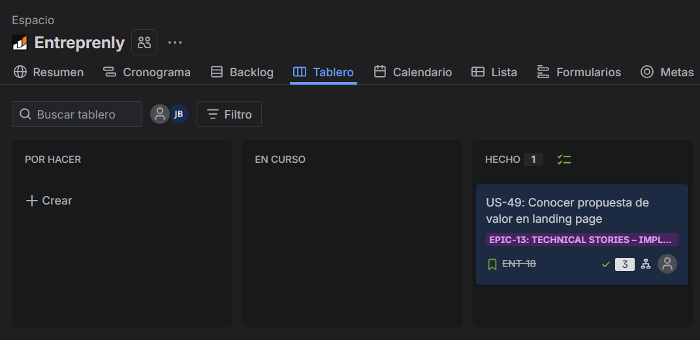
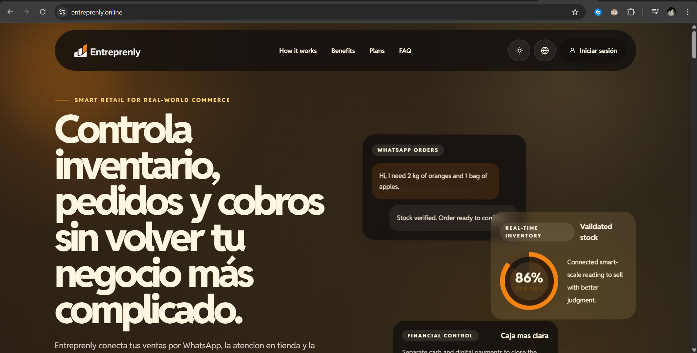
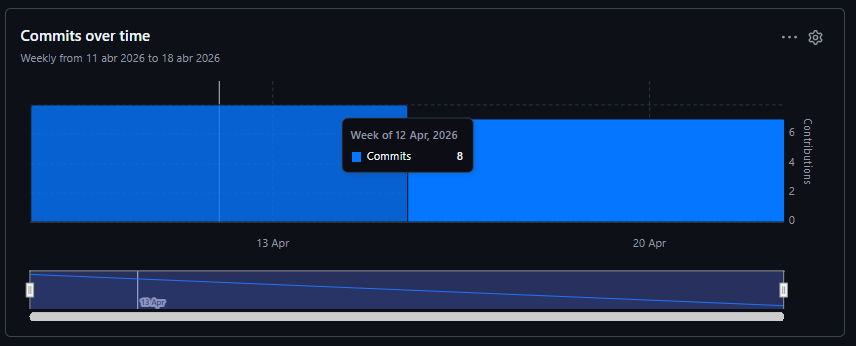
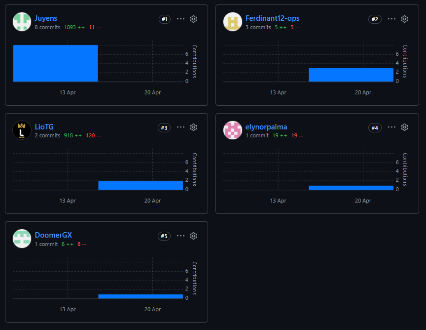
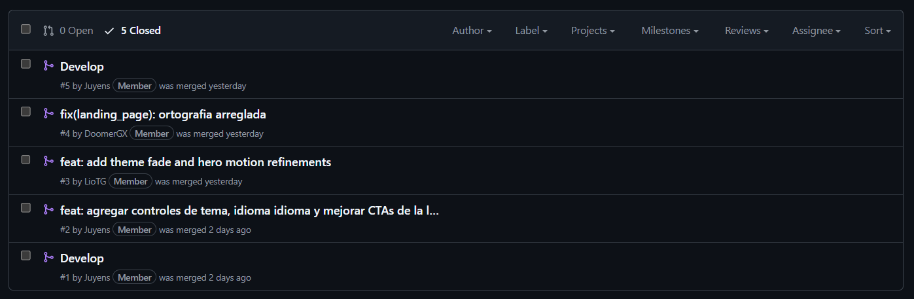

# Capítulo V: Product Implementation, Validation & Deployment

## 5.1. Software Configuration Management

### 5.1.1. Software Development Environment Configuration

En esta sección se detallan las herramientas, frameworks y plataformas utilizadas por el equipo para el desarrollo colaborativo durante todo el ciclo de vida del producto digital. Se han considerado actividades de Project Management, Requirements Management, UX/UI Design, Software Development, Documentation y Deployment.

**Project Management**

<table>
  <thead>
    <tr>
      <th>Producto</th>
      <th>Propósito de uso</th>
      <th>Ruta de Referencia / Descarga</th>
    </tr>
  </thead>
  <tbody>
    <tr>
      <td><strong>Jira</strong></td>
      <td>Herramienta principal para la gestión del proyecto, administración del Product Backlog y seguimiento de Sprints bajo metodología ágil.</td>
      <td><a href="https://www.atlassian.com/software/jira">https://www.atlassian.com/software/jira</a></td>
    </tr>
  </tbody>
</table>

**Requirements Management**

<table>
  <thead>
    <tr>
      <th>Producto</th>
      <th>Propósito de uso</th>
      <th>Ruta de Referencia / Descarga</th>
    </tr>
  </thead>
  <tbody>
    <tr>
      <td><strong>UXPressia</strong></td>
      <td>Utilizado para la gestión de requerimientos, específicamente para la creación de User Personas, Empathy Maps e Impact Maps.</td>
      <td><a href="https://uxpressia.com/">https://uxpressia.com/</a></td>
    </tr>
  </tbody>
</table>

**Product UX/UI Design**

<table>
  <thead>
    <tr>
      <th>Producto</th>
      <th>Propósito de uso</th>
      <th>Ruta de Referencia / Descarga</th>
    </tr>
  </thead>
  <tbody>
    <tr>
      <td><strong>Figma</strong></td>
      <td>Herramienta de diseño UX/UI para la elaboración de Wireframes, Mock-ups y Prototipos interactivos.</td>
      <td><a href="https://www.figma.com/">https://www.figma.com/</a></td>
    </tr>
    <tr>
      <td><strong>Miro</strong></td>
      <td>Plataforma de colaboración visual empleada en las sesiones de EventStorming (Big Picture y Design-Level) para el modelado del dominio.</td>
      <td><a href="https://miro.com/">https://miro.com/</a></td>
    </tr>
  </tbody>
</table>

**Software Development**

<table>
  <thead>
    <tr>
      <th>Producto</th>
      <th>Propósito de uso</th>
      <th>Ruta de Referencia / Descarga</th>
    </tr>
  </thead>
  <tbody>
    <tr>
      <td><strong>Structurizr</strong></td>
      <td>Herramienta para el diseño y documentación de la arquitectura de software siguiendo el modelo C4 (Context, Container, Component, Code).</td>
      <td><a href="https://structurizr.com/">https://structurizr.com/</a></td>
    </tr>
    <tr>
      <td><strong>MySQL Workbench</strong></td>
      <td>Utilizado para el diseño de base de datos, permitiendo la creación de diagramas entidad-relación y la gestión de la persistencia de datos.</td>
      <td><a href="https://www.mysql.com/products/workbench/">https://www.mysql.com/products/workbench/</a></td>
    </tr>
    <tr>
      <td><strong>Visual Studio Code</strong></td>
      <td>Entorno de desarrollo (IDE) principal para la implementación de la Landing Page y la aplicación Frontend.</td>
      <td><a href="https://code.visualstudio.com/">https://code.visualstudio.com/</a></td>
    </tr>
    <tr>
      <td><strong>GitHub Desktop</strong></td>
      <td>Cliente de Git utilizado para facilitar el Source Code Management y la implementación del flujo de trabajo GitFlow en el equipo.</td>
      <td><a href="https://desktop.github.com/">https://desktop.github.com/</a></td>
    </tr>
    <tr>
      <td><strong>Spring Boot / Java</strong></td>
      <td>Framework y lenguaje principal para el desarrollo de los RESTful Web Services que conforman el Backend de la aplicación.</td>
      <td><a href="https://spring.io/projects/spring-boot">https://spring.io/projects/spring-boot</a></td>
    </tr>
    <tr>
      <td><strong>Angular / TypeScript</strong></td>
      <td>Framework y lenguaje utilizados para la construcción de la Frontend Web Application de la plataforma.</td>
      <td><a href="https://angular.io/">https://angular.io/</a></td>
    </tr>
    <tr>
      <td><strong>Node.js</strong></td>
      <td>Entorno de ejecución JavaScript requerido para ejecutar Angular CLI y las herramientas de build y gestión de dependencias del Frontend.</td>
      <td><a href="https://nodejs.org/">https://nodejs.org/</a></td>
    </tr>
  </tbody>
</table>

**Software Documentation**

<table>
  <thead>
    <tr>
      <th>Producto</th>
      <th>Propósito de uso</th>
      <th>Ruta de Referencia / Descarga</th>
    </tr>
  </thead>
  <tbody>
    <tr>
      <td><strong>Swagger / OpenAPI</strong></td>
      <td>Empleado para la documentación técnica de los endpoints del RESTful API, permitiendo su exploración y prueba interactiva.</td>
      <td><a href="https://swagger.io/">https://swagger.io/</a></td>
    </tr>
    <tr>
      <td><strong>Markdown</strong></td>
      <td>Lenguaje de marcado utilizado para la elaboración y mantenimiento de la documentación general del proyecto alojada en GitHub.</td>
      <td><a href="https://www.markdownguide.org/">https://www.markdownguide.org/</a></td>
    </tr>
  </tbody>
</table>

**Software Deployment**

<table>
  <thead>
    <tr>
      <th>Producto</th>
      <th>Propósito de uso</th>
      <th>Ruta de Referencia / Descarga</th>
    </tr>
  </thead>
  <tbody>
    <tr>
      <td><strong>Google Cloud Platform</strong></td>
      <td>Proveedor de infraestructura cloud utilizado para el despliegue y hospedaje de los servicios Backend y aplicaciones en producción.</td>
      <td><a href="https://cloud.google.com/">https://cloud.google.com/</a></td>
    </tr>
    <tr>
      <td><strong>GitHub Pages</strong></td>
      <td>Servicio de hosting estático utilizado para el despliegue continuo de la Landing Page del producto.</td>
      <td><a href="https://pages.github.com/">https://pages.github.com/</a></td>
    </tr>
  </tbody>
</table>

### 5.1.2. Source Code Management

Para la gestión del código fuente y el seguimiento de modificaciones, el equipo utiliza GitHub como plataforma principal y Git como sistema de control de versiones distribuido. Se han establecido repositorios independientes para cada producto de la solución, asegurando que el repositorio de Web Services incluya tanto el proyecto como los archivos de pruebas unitarias, de integración y de aceptación.

**Repositorios del Proyecto**

| Producto | URL del Repositorio |
| :--- | :--- |
| **Landing Page** | https://github.com/Kauflink/landing-entreprenly |
| **Web Services** | https://github.com/Kauflink/daop-entreprenly-web-services | 
| **Frontend Web Application** | https://github.com/Kauflink/daop-entreprenly-web-applications |

**Estrategia de Flujo de Trabajo: GitFlow**

El equipo implementa el modelo GitFlow como workflow de control de versiones para organizar el desarrollo colaborativo de forma estructurada. Este flujo permite trabajar en múltiples funcionalidades en paralelo sin afectar la estabilidad de la rama principal.

Se han definido las siguientes ramas fundamentales:

- **main**: Es la rama principal que contiene el código fuente en estado de producción. Cada versión integrada aquí debe estar etiquetada con un número de versión.

- **develop**: Rama base para el desarrollo donde se integran todas las funcionalidades completadas para pruebas antes de un lanzamiento.

- **feature**: Ramas temporales creadas para desarrollar nuevas funcionalidades o historias de usuario específicas.

- **release**: Ramas utilizadas para preparar un nuevo lanzamiento oficial, permitiendo realizar ajustes menores y correcciones de errores finales.

- **hotfix**: Ramas de emergencia creadas directamente desde main para solucionar errores críticos detectados en el entorno de producción.

**Convenciones de Nombres para Ramas**

Para mantener la trazabilidad y el orden en los repositorios, se aplican las siguientes convenciones de nomenclatura:

- **Feature Branches**: feature/US-[ID-Historia]-[Nombre]
- **Release Branches**: release/v[Major.Minor.Patch]
- **Hotfix Branches**: hotfix/[Descripcion-Error]

**Versionamiento Semántico**

El equipo adopta el estándar Semantic Versioning 2.0.0 para el nombramiento de los lanzamientos. Las versiones se estructuran siguiendo el formato MAJOR.MINOR.PATCH:

1. MAJOR: Incrementado cuando se realizan cambios incompatibles en la API.
2. MINOR: Incrementado cuando se añade funcionalidad de manera retrocompatible.
3. PATCH: Incrementado cuando se realizan correcciones de errores retrocompatibles.

**Estándar de Mensajes de Commit**

Para asegurar un historial de cambios legible y facilitar la automatización, se utiliza la especificación de Conventional Commits para todos los mensajes de commit. La estructura utilizada es [tipo]:[descripción breve], empleando los siguientes prefijos:

- feat: Incorporación de una nueva funcionalidad.
- fix: Corrección de un error o bug.
- docs: Modificaciones exclusivamente en la documentación.
- style: Cambios de formato o estética que no afectan la lógica del código.
- refactor: Reestructuración de código que no añade funciones ni corrige errores.
- test: Adición o actualización de pruebas

### 5.1.3. Source Code Style Guide & Conventions

En esta sección se establecen las guías de estilo y convenciones de codificación adoptadas por el equipo de Kauflink para el desarrollo de los productos digitales que conforman la solución **Entreprenly**. El objetivo es garantizar que el código fuente sea legible, mantenible y coherente entre todos los miembros del equipo, independientemente del componente o capa de la arquitectura en la que se trabaje. Como regla general, **toda nomenclatura de elementos en el código fuente se redacta en inglés**, incluyendo nombres de variables, clases, métodos, componentes, atributos y comentarios técnicos.

Las referencias adoptadas para cada lenguaje y tecnología utilizada en la solución se detallan a continuación.

#### HTML

Para el desarrollo del Landing Page de Entreprenly, el equipo adopta como referencia principal la **HTML Style Guide and Coding Conventions** de W3Schools y la **Google HTML/CSS Style Guide**.

Las convenciones aplicadas son las siguientes:

- Se utiliza **HTML5** como estándar de marcado, declarando siempre el `DOCTYPE` al inicio del documento: `<!DOCTYPE html>`.
- Los nombres de los elementos y atributos se escriben en **minúsculas** (`<section>`, `<article>`, `class="hero-section"`).
- Los atributos se encierran siempre entre **comillas dobles**: ``.
- Se incluyen los atributos `lang` en la etiqueta `<html>` para indicar el idioma de la página: `<html lang="en">`.
- Todas las imágenes incluyen el atributo `alt` con una descripción significativa, como parte del enfoque de accesibilidad (a11y) del proyecto.
- Se utiliza **indentación de 2 espacios** para mantener la legibilidad del árbol de elementos.
- Los elementos de bloque se escriben en líneas separadas; los elementos en línea pueden mantenerse en una misma línea si el resultado es conciso.
- Se evita el uso de estilos en línea (`style=""`); todo el estilo visual se delega a las hojas de estilo CSS externas o a las clases de Angular Material.
- Los comentarios se utilizan para delimitar secciones principales del documento: `<!-- Hero Section -->`.

#### CSS

Para el estilo visual del Landing Page de Entreprenly, el equipo adopta la **Google HTML/CSS Style Guide** como guía de referencia, complementada con las convenciones del sistema de diseño basado en **Material Design**.

Las convenciones aplicadas son las siguientes:

- Los nombres de clases se escriben en **kebab-case**: `.hero-section`, `.cta-button`, `.nav-link`.
- Se evita el uso de selectores de ID para estilos; se prefieren selectores de clase por su reutilizabilidad.
- Las propiedades dentro de cada regla se ordenan de forma **alfabética** para facilitar la lectura y comparación entre reglas.
- Se utiliza **indentación de 2 espacios**.
- Se evita el uso de `!important`; en su lugar, se gestionan las especificidades de los selectores de forma explícita.
- Las unidades `rem` y `em` se prefieren sobre `px` para valores de tipografía y espaciado, garantizando escalabilidad y accesibilidad.
- Los colores se definen usando variables CSS (`--primary-color: #1A73E8;`) centralizadas en el bloque `:root` para mantener la consistencia con el Design System.
- Cada archivo CSS tiene un alcance definido y no acumula estilos globales innecesarios.

#### JavaScript

El Landing Page de Entreprenly utiliza JavaScript para comportamientos de interacción básicos. El equipo adopta las convenciones establecidas en la **Google HTML/CSS Style Guide** para los aspectos de scripting complementarios al marcado.

Las convenciones aplicadas son las siguientes:

- Se utiliza `const` para valores que no cambian y `let` para valores que pueden reasignarse; se evita el uso de `var`.
- Los nombres de variables y funciones se escriben en **camelCase**: `getUserData`, `handleButtonClick`.
- Las funciones se declaran como **arrow functions** cuando no requieren su propio contexto `this`: `const fetchData = () => { ... }`.
- Los strings se definen usando **template literals** cuando se requiere interpolación: `` `Hello, ${userName}` ``.
- El código se organiza en funciones con una única responsabilidad, evitando bloques de lógica demasiado extensos.
- Se incluyen comentarios descriptivos en funciones no triviales, explicando el propósito y no el mecanismo.

#### TypeScript

Para el desarrollo del Frontend Web Application de Entreprenly con Angular, el equipo adopta la **Google TypeScript Style Guide** como referencia principal.

Las convenciones aplicadas son las siguientes:

- Los nombres de **clases, interfaces y enumeraciones** se escriben en **PascalCase**: `UserProfile`, `AuthService`, `PaymentStatus`.
- Los nombres de **variables, funciones y métodos** se escriben en **camelCase**: `isLoggedIn`, `fetchUserData()`.
- Los nombres de **constantes globales** se escriben en **UPPER_SNAKE_CASE**: `MAX_RETRY_ATTEMPTS`.
- Los nombres de **archivos** de componentes, servicios y módulos de Angular siguen la convención **kebab-case** con sufijo descriptivo: `user-profile.component.ts`, `auth.service.ts`, `app-routing.module.ts`.
- Se declaran **tipos explícitos** para todos los parámetros de funciones y valores de retorno; se evita el uso de `any`.
- Se utilizan **interfaces** para describir la forma de los objetos del dominio: `interface Entrepreneur { id: number; name: string; }`.
- Se prefiere el uso de **Observables** de RxJS sobre Promises para el manejo de operaciones asíncronas, coherente con el modelo reactivo de Angular.
- Se habilita el modo estricto de TypeScript (`"strict": true`) en el `tsconfig.json` del proyecto.
- Las importaciones se organizan en bloques separados: primero módulos de Angular, luego librerías de terceros y finalmente módulos internos del proyecto.

#### Angular Framework

Además de las convenciones de TypeScript, el equipo adopta la **Angular Coding Style Guide** oficial para la organización y estructura de los componentes, servicios y módulos de la aplicación.

Las convenciones aplicadas son las siguientes:

- Cada componente, servicio o módulo reside en **su propio archivo**, siguiendo el principio de una clase por archivo.
- Los nombres de **componentes** siguen el patrón `[Feature]Component`: `DashboardComponent`, `ProjectCardComponent`.
- Los nombres de **servicios** siguen el patrón `[Feature]Service`: `AuthService`, `ProjectService`.
- Los **selectores** de los componentes se escriben en **kebab-case** con un prefijo único del proyecto (`ep-` por Entreprenly): `ep-project-card`, `ep-navbar`.
- Los **módulos** de funcionalidad se organizan por bounded context o feature, evitando un único módulo monolítico.
- Los métodos del ciclo de vida de Angular (`ngOnInit`, `ngOnDestroy`) se implementan a través de sus interfaces correspondientes (`OnInit`, `OnDestroy`).

#### Java y Spring Boot

Para el desarrollo de los RESTful Web Services de Entreprenly, el equipo adopta la **Google Java Style Guide** y las convenciones de **Spring Boot Features** como referencias principales.

Las convenciones aplicadas son las siguientes:

- Los nombres de **clases** se escriben en **PascalCase**: `ProjectController`, `UserRepository`, `AuthenticationService`.
- Los nombres de **métodos y variables** se escriben en **camelCase**: `findProjectById()`, `currentUser`.
- Los nombres de **constantes** se escriben en **UPPER_SNAKE_CASE**: `DEFAULT_PAGE_SIZE`.
- Los nombres de **paquetes** se escriben en **minúsculas** y se organizan por bounded context, siguiendo la estructura: `com.kauflink.entreprenly.[boundedcontext].[layer]`. Por ejemplo: `com.kauflink.entreprenly.projects.interfaces`, `com.kauflink.entreprenly.auth.domain`.
- La arquitectura interna de cada bounded context sigue el patrón de capas: `interfaces` (controllers), `application` (services, command handlers), `domain` (entities, value objects, repositories interfaces) e `infrastructure` (JPA repositories, external adapters).
- Los **endpoints** de los controladores REST se nombran en **kebab-case** y en plural para recursos: `/api/v1/projects`, `/api/v1/users`.
- Los **métodos HTTP** se emplean de acuerdo con su semántica RESTful: `GET` para consultas, `POST` para creación, `PUT` para actualización completa, `PATCH` para actualización parcial y `DELETE` para eliminación.
- Se utilizan **anotaciones estándar** de Spring Boot: `@RestController`, `@Service`, `@Repository`, `@Entity`, `@Value`, entre otras.
- Se aplica **indentación de 4 espacios** de acuerdo con la Google Java Style Guide.
- Los **comentarios Javadoc** se incluyen en todas las clases públicas y en los métodos cuya lógica no sea autoexplicativa.


#### Gherkin (Acceptance Criteria)

Para la redacción de los criterios de aceptación de las User Stories y los escenarios de prueba de aceptación de los RESTful Web Services, el equipo adopta las **Gherkin Conventions for Readable Specifications**.

Las convenciones aplicadas son las siguientes:

- Cada escenario se redacta en inglés, en **tiempo presente y tercera persona**.
- La estructura `Given – When – Then` se respeta estrictamente: `Given` define el contexto inicial, `When` describe la acción del usuario o del sistema y `Then` especifica el resultado esperado.
- Se utiliza `And` para añadir condiciones adicionales dentro de un mismo bloque, evitando repetir la palabra clave principal.
- Los nombres de los escenarios son descriptivos y comunican el comportamiento esperado sin referirse a detalles de implementación.
- Se evita la lógica condicional dentro de un mismo escenario; cada escenario cubre un único camino de ejecución (happy path o unhappy path).

**Ejemplo de escenario para un endpoint de la API:**

```gherkin
Scenario: Developer retrieves an existing project successfully
  Given a project with id 1 exists in the system
  When the developer sends a GET request to "/api/v1/projects/1"
  Then the response status code should be 200
  And the response body should contain the project details
```

### 5.1.4. Software Deployment Configuration

En esta sección se especifica la configuración de despliegue definida por el equipo de Kauflink para cada uno de los productos digitales que conforman la solución **Entreprenly**: Landing Page, Frontend Web Application y RESTful Web Services. El objetivo es establecer, desde el inicio del ciclo de vida, los pasos y herramientas necesarias para lograr el despliegue o publicación satisfactoria de cada producto a partir de los repositorios de código fuente.

#### Landing Page

El Landing Page de Entreprenly está desarrollado con HTML5, CSS3 y JavaScript, y se despliega mediante **GitHub Pages**, aprovechando el soporte nativo de esta plataforma para sitios web estáticos. La automatización del proceso de despliegue se realiza a través de **GitHub Actions**, de modo que cada integración a la rama `main` desencadena automáticamente la publicación de la nueva versión. El sitio se encuentra disponible en el dominio personalizado **[entreprenly.online](https://entreprenly.online)**.

Los pasos para configurar y ejecutar el despliegue son los siguientes:

1. Asegurarse de que el repositorio del Landing Page (`Kauflink/landing-entreprenly`) esté público en GitHub.
2. En la configuración del repositorio, ingresar a **Settings > Pages** y seleccionar la rama `main` y la carpeta raíz (`/`) como fuente de publicación.
3. Configurar el dominio personalizado ingresando `entreprenly.online` en el campo **Custom domain** y habilitando **Enforce HTTPS**.
4. En el proveedor de DNS del dominio, crear los registros `A` que apunten a las IPs de los servidores de GitHub Pages, de acuerdo con la documentación oficial de GitHub.
5. En el repositorio, crear el archivo `.github/workflows/deploy.yml` con el workflow de GitHub Actions encargado de ejecutar el despliegue automático al detectar un push sobre la rama `main`. El workflow realiza los pasos de checkout del repositorio y publicación en GitHub Pages usando la acción oficial `actions/deploy-pages`.
6. Verificar que el archivo `CNAME` con el valor `entreprenly.online` esté presente en la raíz del repositorio para que GitHub Pages respete el dominio personalizado entre despliegues.
7. Validar el despliegue accediendo a `https://entreprenly.online` y confirmando que la versión publicada corresponde con el último commit integrado en `main`.

#### Frontend Web Application

El Frontend Web Application de Entreprenly está desarrollado con **Angular** y se despliega mediante **Firebase Hosting**, disponible en el subdominio **[app.entreprenly.online](https://app.entreprenly.online)**. Firebase Hosting fue elegido sobre GitHub Pages por tres razones concretas: soporta el enrutamiento del lado del cliente (SPA routing) de Angular de forma nativa sin configuraciones adicionales, permite asociar subdominios personalizados sin conflictos con el dominio principal ya utilizado por el Landing Page en GitHub Pages, y se integra de forma directa con GitHub Actions para automatizar el ciclo de build y despliegue.

Los pasos para configurar y ejecutar el despliegue son los siguientes:

1. Crear un proyecto en **Firebase Console** ([console.firebase.google.com](https://console.firebase.google.com)) e ingresar a la sección **Hosting**. Activar el servicio y asociarlo al proyecto de Entreprenly.
2. En el entorno local, instalar Firebase CLI:
   ```bash
   npm install -g firebase-tools
   firebase login
   ```
3. Dentro del repositorio del Frontend (`Kauflink/daop-entreprenly-web-applications`), inicializar Firebase Hosting:
   ```bash
   firebase init hosting
   ```
   Durante la inicialización, seleccionar el proyecto Firebase creado, indicar `dist/entreprenly` como directorio público (output del build de Angular), confirmar que la aplicación es una SPA respondiendo `Yes` a la opción de reescritura de rutas al `index.html`, y no sobrescribir el `index.html` existente.
4. Verificar que el archivo `firebase.json` generado incluya la regla de reescritura para SPA routing:
   ```json
   {
     "hosting": {
       "public": "dist/entreprenly",
       "ignore": ["firebase.json", "**/.*", "**/node_modules/**"],
       "rewrites": [
         { "source": "**", "destination": "/index.html" }
       ]
     }
   }
   ```
5. En Firebase Console, ingresar a **Hosting > Add custom domain** y registrar el subdominio `app.entreprenly.online`. Firebase proporcionará los registros DNS necesarios (tipo `A` o `CNAME`) que deben configurarse en el proveedor del dominio.
6. En el repositorio, configurar el **GitHub Secret** `FIREBASE_SERVICE_ACCOUNT` con las credenciales de la cuenta de servicio de Firebase, necesarias para autenticar el despliegue desde GitHub Actions.
7. Crear el archivo `.github/workflows/deploy-frontend.yml` con el workflow de GitHub Actions. El workflow se ejecuta ante cada push en la rama `main` y realiza los siguientes pasos: checkout del repositorio, configuración de Node.js con la versión requerida, instalación de dependencias con `npm install`, generación del build de producción con `ng build --configuration production` y despliegue en Firebase Hosting usando la acción oficial `FirebaseExtended/action-hosting-deploy`.
8. Validar el despliegue accediendo a `https://app.entreprenly.online` y verificando que la navegación entre vistas de Angular funciona correctamente sin errores 404 al refrescar el navegador.

#### RESTful Web Services

El Backend de Entreprenly está desarrollado con **Spring Boot** y se despliega sobre una instancia de **Google Compute Engine (VM)** en **Google Cloud Platform (GCP)**, accesible a través del subdominio **[api.entreprenly.online](https://api.entreprenly.online)**. La automatización del despliegue se gestiona mediante **GitHub Actions**, que se conecta de forma segura a la VM mediante SSH para ejecutar el proceso de actualización del servicio.

Los pasos para configurar y ejecutar el despliegue son los siguientes:

1. En la consola de GCP, crear una instancia de **Compute Engine** con las siguientes características mínimas recomendadas: sistema operativo Ubuntu 24.04 LTS, tipo de máquina `e2-medium`, disco de arranque de 50 GB y dirección IP externa estática asignada.
2. En la instancia, instalar **Java 17 (JDK)**:
   ```bash
   sudo apt update
   sudo apt install -y openjdk-17-jdk
   ```
3. Configurar el servicio de Spring Boot como un servicio del sistema operativo con `systemd`, creando el archivo `/etc/systemd/system/entreprenly.service`, para garantizar su reinicio automático ante fallos o reinicios de la VM.
4. En el proveedor de DNS del dominio, crear un registro `A` que apunte `api.entreprenly.online` a la IP externa estática de la instancia de GCP.
5. Instalar **Nginx** y **Certbot** en la VM para habilitar HTTPS mediante un certificado SSL gratuito de Let's Encrypt, configurando Nginx como proxy inverso que redirige el tráfico del puerto 443 al puerto `8080` donde escucha Spring Boot:
   ```bash
   sudo apt install -y nginx certbot python3-certbot-nginx
   sudo certbot --nginx -d api.entreprenly.online
   ```
6. En el repositorio de Web Services (`Kauflink/daop-entreprenly-web-services`), configurar los siguientes **GitHub Secrets**:
   - `GCP_VM_HOST`: dirección IP externa estática de la instancia.
   - `GCP_VM_USER`: nombre de usuario de la instancia.
   - `GCP_VM_SSH_KEY`: clave SSH privada para autenticación sin contraseña.
7. Crear el archivo `.github/workflows/deploy-backend.yml` con el workflow de GitHub Actions. El workflow se ejecuta ante cada push en la rama `main` y realiza los siguientes pasos: checkout del repositorio, configuración de Java 17, generación del artefacto ejecutable con `./mvnw clean package -DskipTests`, transferencia del archivo `.jar` a la VM mediante `scp` y reinicio del servicio en la VM mediante `ssh` con los comandos `sudo systemctl stop entreprenly`, copia del nuevo `.jar` y `sudo systemctl start entreprenly`.
8. Configurar las **reglas de firewall** en GCP para exponer únicamente los puertos `80` y `443` al tráfico externo, manteniendo el puerto `8080` de Spring Boot restringido al acceso local de Nginx.
9. Documentar los endpoints del API desplegado mediante **Swagger UI**, accesible en la ruta `https://api.entreprenly.online/swagger-ui/index.html`, y registrar la URL base del API como variable de entorno en el proyecto del Frontend Web Application para su integración.
10. Validar el despliegue realizando una solicitud de prueba a un endpoint del API desde Swagger UI o desde Postman, confirmando que el servicio responde correctamente sobre HTTPS.

## 5.2. Landing Page, Services & Applications Implementation
 
### 5.2.1. Sprint 1
 
#### 5.2.1.1. Sprint Planning 1
 
Para este primer Sprint, el equipo estableció como objetivo principal la implementación y despliegue de la primera versión del Landing Page de Entreprenly. La reunión de planificación se llevó a cabo de manera virtual, donde se definieron las User Stories a abordar, el Sprint Goal y la distribución de responsabilidades entre los miembros del equipo.
 
<table border="1" cellpadding="8" cellspacing="0" style="border-collapse: collapse; width: 100%;">
  <tbody>
    <tr>
      <td colspan="2"><strong>Sprint 1</strong></td>
    </tr>
    <tr>
      <td colspan="2"><strong>Sprint Planning Background</strong></td>
    </tr>
    <tr>
      <td><strong>Date</strong></td>
      <td>2026-04-18</td>
    </tr>
    <tr>
      <td><strong>Time</strong></td>
      <td>09:00 AM</td>
    </tr>
    <tr>
      <td><strong>Location</strong></td>
      <td>Reunión virtual vía Discord</td>
    </tr>
    <tr>
      <td><strong>Prepared By</strong></td>
      <td>Camargo Briceño, Joseph Julius</td>
    </tr>
    <tr>
      <td><strong>Attendees (to planning meeting)</strong></td>
      <td>Camargo Briceño, Joseph Julius / Chavez Carrasco, Lionel Abraham / Palma De Los Santos, Elynor Mikela / Peirano Brun, José Antonio / Flores Pinchi, José Fernando</td>
    </tr>
    <tr>
      <td><strong>Sprint 1 – 1 Review Summary</strong></td>
      <td>Al ser el primer Sprint del proyecto, no existe un Sprint anterior que revisar. Se parte desde cero con el inicio del ciclo de vida del producto.</td>
    </tr>
    <tr>
      <td><strong>Sprint 1 – 1 Retrospective Summary</strong></td>
      <td>Al ser el primer Sprint del proyecto, no existe retrospectiva previa. El equipo acordó mantener comunicación constante vía Discord y respetar los plazos de entrega de cada tarea.</td>
    </tr>
    <tr>
      <td colspan="2"><strong>Sprint Goal &amp; User Stories</strong></td>
    </tr>
    <tr>
      <td><strong>Sprint 1 Goal</strong></td>
      <td>Our focus is on presenting Entreprenly's value proposition to potential users through a functional and deployed Landing Page. We believe it delivers a clear first impression of the product and motivates visitors from our target segments to explore the platform. This will be confirmed when the Landing Page is publicly accessible, includes all key sections (hero, features, pricing and call-to-action), and redirects visitors correctly toward the Web Application.</td>
    </tr>
    <tr>
      <td><strong>Sprint 1 Velocity</strong></td>
      <td>8</td>
    </tr>
    <tr>
      <td><strong>Sum of Story Points</strong></td>
      <td>8</td>
    </tr>
  </tbody>
</table>

---
 
#### 5.2.1.2. Aspect Leaders and Collaborators
 
En este primer Sprint, el equipo organizó su trabajo en torno a cuatro aspectos principales: la configuración inicial del repositorio y entorno de despliegue, el desarrollo de la estructura base del Landing Page, la implementación de funcionalidades interactivas (cambio de tema e idioma, animaciones y CTAs), y la revisión y corrección del contenido textual. A continuación, se presenta la matriz de liderazgo y colaboración (LACX):
 
<table border="1" cellpadding="8" cellspacing="0" style="border-collapse: collapse; width: 100%;">
  <thead>
    <tr>
      <th>Team Member (Last Name, First Name)</th>
      <th>GitHub Username</th>
      <th>Configuración del Repositorio y CI/CD<br>Leader (L) / Collaborator (C)</th>
      <th>Estructura Base del Landing Page<br>Leader (L) / Collaborator (C)</th>
      <th>Funcionalidades Interactivas (Tema, Idioma, CTAs)<br>Leader (L) / Collaborator (C)</th>
      <th>Corrección de Contenido<br>Leader (L) / Collaborator (C)</th>
    </tr>
  </thead>
  <tbody>
    <tr>
      <td>Camargo Briceño, Joseph Julius</td>
      <td>Juyens</td>
      <td>L</td>
      <td>C</td>
      <td>C</td>
      <td>C</td>
    </tr>
    <tr>
      <td>Chavez Carrasco, Lionel Abraham</td>
      <td>LioTG</td>
      <td>C</td>
      <td>L</td>
      <td>L</td>
      <td>C</td>
    </tr>
    <tr>
      <td>Palma De Los Santos, Elynor Mikela</td>
      <td>elynorpalma</td>
      <td>C</td>
      <td>C</td>
      <td>C</td>
      <td>L</td>
    </tr>
    <tr>
      <td>Peirano Brun, José Antonio</td>
      <td>DoomerGX</td>
      <td>C</td>
      <td>C</td>
      <td>C</td>
      <td>L</td>
    </tr>
    <tr>
      <td>Flores Pinchi, José Fernando</td>
      <td>Ferdinant12-ops</td>
      <td>C</td>
      <td>L</td>
      <td>C</td>
      <td>L</td>
    </tr>
  </tbody>
</table>

---
 
#### 5.2.1.3. Sprint Backlog 1
 
El objetivo principal de este Sprint fue implementar y desplegar la primera versión del Landing Page de Entreprenly, cubriendo la User Story US-49 del Product Backlog. A continuación se presenta el tablero del Sprint y el detalle de los Work-items asociados.
 
 

 
<table border="1" cellpadding="8" cellspacing="0" style="border-collapse: collapse; width: 100%;">
  <thead>
    <tr>
      <th colspan="8">Sprint # Sprint 1</th>
    </tr>
    <tr>
      <th colspan="2">User Story</th>
      <th colspan="6">Work-Item / Task</th>
    </tr>
    <tr>
      <th>Id</th>
      <th>Title</th>
      <th>Id</th>
      <th>Title</th>
      <th>Description</th>
      <th>Estimation (Hours)</th>
      <th>Assigned To</th>
      <th>Status</th>
    </tr>
  </thead>
  <tbody>
    <tr>
      <td>US-49</td>
      <td>Conocer propuesta de valor en landing page</td>
      <td>T-01</td>
      <td>Configuración inicial del repositorio</td>
      <td>Crear el repositorio, inicializar el proyecto con HTML/CSS/Tailwind y configurar el <code>.gitignore</code> y <code>package.json</code>.</td>
      <td>2</td>
      <td>Camargo Briceño, Joseph Julius</td>
      <td>Done</td>
    </tr>
    <tr>
      <td>US-49</td>
      <td>Conocer propuesta de valor en landing page</td>
      <td>T-02</td>
      <td>Configurar pipeline de despliegue (GitHub Actions)</td>
      <td>Crear y ajustar el workflow de GitHub Actions para despliegue automático en GitHub Pages con CNAME configurado.</td>
      <td>3</td>
      <td>Camargo Briceño, Joseph Julius</td>
      <td>Done</td>
    </tr>
    <tr>
      <td>US-49</td>
      <td>Conocer propuesta de valor en landing page</td>
      <td>T-03</td>
      <td>Desarrollar estructura base del Landing Page</td>
      <td>Implementar las secciones principales del Landing Page: hero, funcionalidades, planes y footer.</td>
      <td>4</td>
      <td>Chavez Carrasco, Lionel Abraham / Flores Pinchi, José Fernando</td>
      <td>Done</td>
    </tr>
    <tr>
      <td>US-49</td>
      <td>Conocer propuesta de valor en landing page</td>
      <td>T-04</td>
      <td>Implementar controles de tema e idioma y mejoras de CTAs</td>
      <td>Agregar switch de tema claro/oscuro, selector de idioma (ES/EN) y mejorar los call-to-action para cada segmento objetivo.</td>
      <td>3</td>
      <td>Chavez Carrasco, Lionel Abraham</td>
      <td>Done</td>
    </tr>
    <tr>
      <td>US-49</td>
      <td>Conocer propuesta de valor en landing page</td>
      <td>T-05</td>
      <td>Agregar animaciones de transición en hero</td>
      <td>Implementar efectos de fade para cambio de tema y animaciones de movimiento en la sección hero.</td>
      <td>2</td>
      <td>Chavez Carrasco, Lionel Abraham</td>
      <td>Done</td>
    </tr>
    <tr>
      <td>US-49</td>
      <td>Conocer propuesta de valor en landing page</td>
      <td>T-06</td>
      <td>Revisión y corrección de contenido textual</td>
      <td>Corregir ortografía, tildes y redacción en el contenido del Landing Page.</td>
      <td>2</td>
      <td>Palma De Los Santos, Elynor Mikela / Peirano Brun, José Antonio / Flores Pinchi, José Fernando</td>
      <td>Done</td>
    </tr>
  </tbody>
</table>

---
 
#### 5.2.1.4. Development Evidence for Sprint Review
 
Durante el Sprint 1, el equipo se centró exclusivamente en el repositorio del Landing Page. Se realizaron un total de 20 commits distribuidos entre el 18 y el 20 de abril de 2026, cubriendo desde la configuración inicial del proyecto hasta correcciones de contenido y el despliegue automatizado mediante GitHub Actions. A continuación se presenta el registro de commits:
 
<table border="1" cellpadding="8" cellspacing="0" style="border-collapse: collapse; width: 100%;">
  <thead>
    <tr>
      <th>Repository</th>
      <th>Branch</th>
      <th>Commit Id</th>
      <th>Commit Message</th>
      <th>Commit Message Body</th>
      <th>Committed on (Date)</th>
    </tr>
  </thead>
  <tbody>
    <tr>
      <td>Kauflink/landing-entreprenly</td>
      <td>main</td>
      <td>d57dee9</td>
      <td>Initial commit</td>
      <td>Creación inicial del repositorio con estructura base del proyecto.</td>
      <td>2026-04-18</td>
    </tr>
    <tr>
      <td>Kauflink/landing-entreprenly</td>
      <td>develop</td>
      <td>86c305f</td>
      <td>chore(config): initialize .gitignore for node and tailwind</td>
      <td>Se agrega <code>.gitignore</code> configurado para excluir dependencias de Node y archivos compilados de Tailwind.</td>
      <td>2026-04-18</td>
    </tr>
    <tr>
      <td>Kauflink/landing-entreprenly</td>
      <td>develop</td>
      <td>568c339</td>
      <td>docs: simplify README with essential information and update license to MIT</td>
      <td>Se simplifica el README con instrucciones esenciales y se actualiza la licencia a MIT.</td>
      <td>2026-04-18</td>
    </tr>
    <tr>
      <td>Kauflink/landing-entreprenly</td>
      <td>main</td>
      <td>5088424</td>
      <td>Merge pull request #1 from Kauflink/develop</td>
      <td>Primera integración de la rama develop a main con la estructura base del proyecto.</td>
      <td>2026-04-18</td>
    </tr>
    <tr>
      <td>Kauflink/landing-entreprenly</td>
      <td>main</td>
      <td>003eb4f</td>
      <td>Create CNAME</td>
      <td>Se crea el archivo CNAME para la configuración del dominio personalizado en GitHub Pages.</td>
      <td>2026-04-18</td>
    </tr>
    <tr>
      <td>Kauflink/landing-entreprenly</td>
      <td>main</td>
      <td>9e82e20</td>
      <td>Refactor GitHub Actions workflow for deployment</td>
      <td>Se refactoriza el workflow de CI/CD para optimizar el proceso de despliegue automático.</td>
      <td>2026-04-18</td>
    </tr>
    <tr>
      <td>Kauflink/landing-entreprenly</td>
      <td>main</td>
      <td>bcc3513</td>
      <td>Update Node.js version and clean install step</td>
      <td>Se actualiza la versión de Node.js y se mejora el paso de instalación limpia en el pipeline.</td>
      <td>2026-04-18</td>
    </tr>
    <tr>
      <td>Kauflink/landing-entreprenly</td>
      <td>main</td>
      <td>ff3e7e6</td>
      <td>Update GitHub Actions workflow for deployment</td>
      <td>Se actualiza la configuración del workflow de despliegue.</td>
      <td>2026-04-18</td>
    </tr>
    <tr>
      <td>Kauflink/landing-entreprenly</td>
      <td>main</td>
      <td>14b3ed7</td>
      <td>Upgrade GitHub Actions to version 4</td>
      <td>Se actualiza GitHub Actions a la versión 4 para compatibilidad y mejoras de rendimiento.</td>
      <td>2026-04-18</td>
    </tr>
    <tr>
      <td>Kauflink/landing-entreprenly</td>
      <td>develop</td>
      <td>54554c9</td>
      <td>feat: agregar controles de tema, idioma y mejorar CTAs de la landing</td>
      <td>Se implementa el selector de idioma (ES/EN), el switch de tema claro/oscuro y se mejoran los call-to-action dirigidos a cada segmento objetivo.</td>
      <td>2026-04-19</td>
    </tr>
    <tr>
      <td>Kauflink/landing-entreprenly</td>
      <td>main</td>
      <td>32ab091</td>
      <td>Merge pull request #2 from Kauflink/develop</td>
      <td>Segunda integración con los controles de tema, idioma y CTAs mejorados.</td>
      <td>2026-04-19</td>
    </tr>
    <tr>
      <td>Kauflink/landing-entreprenly</td>
      <td>develop</td>
      <td>f9a1e00</td>
      <td>feat: add theme fade and hero motion refinements</td>
      <td>Se agregan transiciones de fade al cambio de tema y animaciones de movimiento en la sección hero.</td>
      <td>2026-04-19</td>
    </tr>
    <tr>
      <td>Kauflink/landing-entreprenly</td>
      <td>main</td>
      <td>9136aed</td>
      <td>Merge pull request #3 from Kauflink/develop</td>
      <td>Tercera integración con animaciones y refinamientos del hero.</td>
      <td>2026-04-19</td>
    </tr>
    <tr>
      <td>Kauflink/landing-entreprenly</td>
      <td>develop</td>
      <td>e740b59</td>
      <td>fix: corrección de tildes</td>
      <td>Se corrigen errores de acentuación en el contenido textual del Landing Page.</td>
      <td>2026-04-19</td>
    </tr>
    <tr>
      <td>Kauflink/landing-entreprenly</td>
      <td>develop</td>
      <td>55ee2fb</td>
      <td>fix(landing_page): ortografia arreglada</td>
      <td>Se corrigen errores ortográficos en los textos del Landing Page.</td>
      <td>2026-04-19</td>
    </tr>
    <tr>
      <td>Kauflink/landing-entreprenly</td>
      <td>main</td>
      <td>846f934</td>
      <td>Merge pull request #4 from Kauflink/develop</td>
      <td>Cuarta integración con correcciones ortográficas y de contenido.</td>
      <td>2026-04-19</td>
    </tr>
    <tr>
      <td>Kauflink/landing-entreprenly</td>
      <td>develop</td>
      <td>7e09505</td>
      <td>app:Correccion</td>
      <td>Correcciones generales en el contenido del Landing Page.</td>
      <td>2026-04-19</td>
    </tr>
    <tr>
      <td>Kauflink/landing-entreprenly</td>
      <td>develop</td>
      <td>3cbf2e2</td>
      <td>app:CorreccionPalabras</td>
      <td>Corrección de palabras en el contenido del Landing Page.</td>
      <td>2026-04-19</td>
    </tr>
    <tr>
      <td>Kauflink/landing-entreprenly</td>
      <td>develop</td>
      <td>8c4165b</td>
      <td>app:CorreccionTilde</td>
      <td>Corrección de tildes adicionales en el Landing Page.</td>
      <td>2026-04-19</td>
    </tr>
    <tr>
      <td>Kauflink/landing-entreprenly</td>
      <td>main</td>
      <td>7b8ccfc</td>
      <td>Merge pull request #5 from Kauflink/develop</td>
      <td>Quinta integración con las correcciones finales de contenido.</td>
      <td>2026-04-20</td>
    </tr>
  </tbody>
</table>

---
 
#### 5.2.1.5. Execution Evidence for Sprint Review
 
Al término del Sprint 1, el equipo logró implementar y desplegar satisfactoriamente la primera versión del Landing Page de Entreprenly. La página se encuentra disponible públicamente a través de GitHub Pages con dominio personalizado configurado mediante el archivo CNAME. El Landing Page incluye las siguientes secciones:
 
- **Hero:** Presentación principal del producto con headline, propuesta de valor y llamados a la acción (CTAs) diferenciados por segmento objetivo (comerciantes y clientes finales).
- **Funcionalidades:** Descripción visual de las características principales de Entreprenly: gestión de inventario, chatbot de WhatsApp, balanza IoT y dashboard financiero.
- **Planes:** Sección con los planes disponibles (Plan Free y Plan Control) con sus beneficios y botones de acción.
- **Footer:** Información de contacto, términos y condiciones y enlaces relevantes.
- **Controles de experiencia:** Selector de idioma (Español / Inglés) y switch de tema claro/oscuro, accesibles desde la barra de navegación.



 
---
 
#### 5.2.1.6. Services Documentation Evidence for Sprint Review
 
Durante el Sprint 1, el alcance de implementación se limitó exclusivamente al Landing Page estático. No se desarrollaron ni desplegaron Web Services (RESTful API) en esta iteración, por lo que no aplica documentación de endpoints para este Sprint. La documentación de servicios web se incorporará a partir del Sprint 3, conforme a lo planificado en el Product Backlog.
 
---
 
#### 5.2.1.7. Software Deployment Evidence for Sprint Review
 
Durante el Sprint 1, el equipo configuró y ejecutó el proceso de despliegue del Landing Page mediante GitHub Pages y un pipeline de integración continua con GitHub Actions. A continuación se describe el proceso realizado:
 
1. **Creación del repositorio:** Se creó el repositorio público `landing-entreprenly` bajo la organización `Kauflink` en GitHub, aplicando GitFlow con las ramas `main` y `develop`.
2. **Configuración del dominio personalizado:** Se añadió el archivo `CNAME` al repositorio con el dominio personalizado asignado al Landing Page.
3. **Configuración del pipeline de CI/CD:** Se creó un workflow de GitHub Actions (`.github/workflows/`) que automatiza el proceso de build y despliegue. El workflow incluye los pasos de instalación de dependencias (`npm ci`), compilación de estilos con Tailwind CSS (`npm run build`) y despliegue automático a la rama `gh-pages` al fusionar cambios en `main`.
4. **Ajustes iterativos del pipeline:** Se realizaron cuatro refinamientos del workflow durante el Sprint para resolver compatibilidades con la versión de Node.js y actualizar GitHub Actions a la versión 4.
5. **Verificación del despliegue:** Se comprobó que el Landing Page quedó correctamente publicado y accesible desde la URL de GitHub Pages con el dominio configurado.
*(Insertar aquí screenshots del workflow de GitHub Actions ejecutado exitosamente, la configuración de GitHub Pages en el repositorio y el Landing Page accesible en su URL de producción)*
 
---
 
#### 5.2.1.8. Team Collaboration Insights during Sprint
 
Durante el Sprint 1, todos los miembros del equipo participaron activamente en la implementación del Landing Page, evidenciado a través de los commits registrados en el repositorio `landing-entreprenly`. El trabajo se distribuyó de manera colaborativa: Joseph Julius lideró la configuración del repositorio y el pipeline de despliegue; Lionel Abraham se encargó del desarrollo de funcionalidades interactivas y animaciones; Elynor Mikela, José Antonio y José Fernando contribuyeron con correcciones de contenido y en la estructura base de la página.
 
El equipo aplicó GitFlow como estrategia de control de versiones, trabajando en la rama `develop` y realizando la integración a `main` mediante Pull Requests revisados y aprobados por otros miembros. Se realizaron un total de 5 Pull Requests durante el Sprint.
 






 
**URL del repositorio del Landing Page:** https://github.com/Kauflink/landing-entreprenly

## 5.3. Validation Interviews

### 5.3.1. Diseño de Entrevistas

*Contenido por agregar.*

### 5.3.2. Registro de Entrevistas

*Contenido por agregar.*

### 5.3.3. Evaluaciones según heurísticas

*Contenido por agregar.*

## 5.4. Video About-the-Product

*Contenido por agregar.*