# Capítulo V: Product Implementation, Validation & Deployment

## 5.1. Software Configuration Management

### 5.1.1. Software Development Environment Configuration

En esta sección se detallan las herramientas, frameworks y plataformas utilizadas por el equipo para el desarrollo colaborativo durante todo el ciclo de vida del producto digital. Se han considerado actividades de Project Management, Requirements Management, UX/UI Design, Software Development, Documentation y Deployment.

**Project Management**

<table>
  <thead>
    <tr>
      <th>Producto</th>
      <th>Propósito de uso</th>
      <th>Ruta de Referencia / Descarga</th>
    </tr>
  </thead>
  <tbody>
    <tr>
      <td><strong>Trello</strong></td>
      <td>Herramienta de soporte a agile development utilizada para la gestión del Product Backlog y de los Sprint Backlogs. Cada Sprint se organiza en un tablero Kanban con las columnas <em>To Do</em>, <em>In Process</em>, <em>To Review</em> y <em>Done</em>, configurado como board público para su revisión.</td>
      <td>https://trello.com/</td>
    </tr>
  </tbody>
</table>

**Requirements Management**

<table>
  <thead>
    <tr>
      <th>Producto</th>
      <th>Propósito de uso</th>
      <th>Ruta de Referencia / Descarga</th>
    </tr>
  </thead>
  <tbody>
    <tr>
      <td><strong>UXPressia</strong></td>
      <td>Utilizado para la gestión de requerimientos, específicamente para la creación de User Personas, Empathy Maps e Impact Maps.</td>
      <td>https://uxpressia.com/</td>
    </tr>
  </tbody>
</table>

**Product UX/UI Design**

<table>
  <thead>
    <tr>
      <th>Producto</th>
      <th>Propósito de uso</th>
      <th>Ruta de Referencia / Descarga</th>
    </tr>
  </thead>
  <tbody>
    <tr>
      <td><strong>Figma</strong></td>
      <td>Herramienta de diseño UX/UI para la elaboración de Wireframes, Mock-ups y Prototipos interactivos.</td>
      <td>https://www.figma.com/</td>
    </tr>
    <tr>
      <td><strong>Miro</strong></td>
      <td>Plataforma de colaboración visual empleada en las sesiones de EventStorming (Big Picture y Design-Level) para el modelado del dominio.</td>
      <td>https://miro.com/</td>
    </tr>
  </tbody>
</table>

**Software Development**

<table>
  <thead>
    <tr>
      <th>Producto</th>
      <th>Propósito de uso</th>
      <th>Ruta de Referencia / Descarga</th>
    </tr>
  </thead>
  <tbody>
    <tr>
      <td><strong>Structurizr</strong></td>
      <td>Herramienta para el diseño y documentación de la arquitectura de software siguiendo el modelo C4 (Context, Container, Component, Code).</td>
      <td>https://structurizr.com/</td>
    </tr>
    <tr>
      <td><strong>MySQL Workbench</strong></td>
      <td>Utilizado para el diseño de base de datos, permitiendo la creación de diagramas entidad-relación y la gestión de la persistencia de datos.</td>
      <td>https://www.mysql.com/products/workbench/</td>
    </tr>
    <tr>
      <td><strong>Visual Studio Code</strong></td>
      <td>Entorno de desarrollo (IDE) principal para la implementación de la Landing Page y la aplicación Frontend.</td>
      <td>https://code.visualstudio.com/</td>
    </tr>
    <tr>
      <td><strong>GitHub Desktop</strong></td>
      <td>Cliente de Git utilizado para facilitar el Source Code Management y la implementación del flujo de trabajo GitFlow en el equipo.</td>
      <td>https://desktop.github.com/</td>
    </tr>
    <tr>
      <td><strong>Spring Boot / Java</strong></td>
      <td>Framework y lenguaje principal para el desarrollo de los RESTful Web Services que conforman el Backend de la aplicación.</td>
      <td>https://spring.io/projects/spring-boot</td>
    </tr>
    <tr>
      <td><strong>Angular / TypeScript</strong></td>
      <td>Framework y lenguaje utilizados para la construcción de la Frontend Web Application de la plataforma.</td>
      <td>https://angular.io/</td>
    </tr>
    <tr>
      <td><strong>Node.js</strong></td>
      <td>Entorno de ejecución JavaScript requerido para ejecutar Angular CLI y las herramientas de build y gestión de dependencias del Frontend.</td>
      <td>https://nodejs.org/</td>
    </tr>
  </tbody>
</table>

**Software Documentation**

<table>
  <thead>
    <tr>
      <th>Producto</th>
      <th>Propósito de uso</th>
      <th>Ruta de Referencia / Descarga</th>
    </tr>
  </thead>
  <tbody>
    <tr>
      <td><strong>Swagger / OpenAPI</strong></td>
      <td>Empleado para la documentación técnica de los endpoints del RESTful API, permitiendo su exploración y prueba interactiva.</td>
      <td>https://swagger.io/</td>
    </tr>
    <tr>
      <td><strong>Markdown</strong></td>
      <td>Lenguaje de marcado utilizado para la elaboración y mantenimiento de la documentación general del proyecto alojada en GitHub.</td>
      <td>https://www.markdownguide.org/</td>
    </tr>
  </tbody>
</table>

**Software Deployment**

<table>
  <thead>
    <tr>
      <th>Producto</th>
      <th>Propósito de uso</th>
      <th>Ruta de Referencia / Descarga</th>
    </tr>
  </thead>
  <tbody>
    <tr>
      <td><strong>Google Cloud Platform</strong></td>
      <td>Proveedor de infraestructura cloud utilizado para el despliegue y hospedaje de los servicios Backend y aplicaciones en producción.</td>
      <td>https://cloud.google.com/</td>
    </tr>
    <tr>
      <td><strong>GitHub Pages</strong></td>
      <td>Servicio de hosting estático utilizado para el despliegue continuo de la Landing Page del producto.</td>
      <td>https://pages.github.com/</td>
    </tr>
  </tbody>
</table>

### 5.1.2. Source Code Management

Para la gestión del código fuente y el seguimiento de modificaciones, el equipo utiliza GitHub como plataforma principal y Git como sistema de control de versiones distribuido. Se han establecido repositorios independientes para cada producto de la solución, asegurando que el repositorio de Web Services incluya tanto el proyecto como los archivos de pruebas unitarias, de integración y de aceptación.

**Repositorios del Proyecto**

| Producto                     | URL del Repositorio                                       |
| :--------------------------- | :-------------------------------------------------------- |
| **Landing Page**             | https://github.com/Kauflink/landing-entreprenly           |
| **Web Services**             | https://github.com/Kauflink/daop-entreprenly-web-services |
| **Frontend Web Application** | https://github.com/Kauflink/daop-entreprenly-frontend     |

**Estrategia de Flujo de Trabajo: GitFlow**

El equipo implementa el modelo GitFlow como workflow de control de versiones para organizar el desarrollo colaborativo de forma estructurada. Este flujo permite trabajar en múltiples funcionalidades en paralelo sin afectar la estabilidad de la rama principal.

Se han definido las siguientes ramas fundamentales:

- **main**: Es la rama principal que contiene el código fuente en estado de producción. Cada versión integrada aquí debe estar etiquetada con un número de versión.

- **develop**: Rama base para el desarrollo donde se integran todas las funcionalidades completadas para pruebas antes de un lanzamiento.

- **feature**: Ramas temporales creadas para desarrollar nuevas funcionalidades o historias de usuario específicas.

- **release**: Ramas utilizadas para preparar un nuevo lanzamiento oficial, permitiendo realizar ajustes menores y correcciones de errores finales.

- **hotfix**: Ramas de emergencia creadas directamente desde main para solucionar errores críticos detectados en el entorno de producción.

**Convenciones de Nombres para Ramas**

Para mantener la trazabilidad y el orden en los repositorios, se aplican las siguientes convenciones de nomenclatura:

- **Feature Branches**: feature/US-[ID-Historia]-[Nombre]
- **Release Branches**: release/v[Major.Minor.Patch]
- **Hotfix Branches**: hotfix/[Descripcion-Error]

**Versionamiento Semántico**

El equipo adopta el estándar Semantic Versioning 2.0.0 para el nombramiento de los lanzamientos. Las versiones se estructuran siguiendo el formato MAJOR.MINOR.PATCH:

1. MAJOR: Incrementado cuando se realizan cambios incompatibles en la API.
2. MINOR: Incrementado cuando se añade funcionalidad de manera retrocompatible.
3. PATCH: Incrementado cuando se realizan correcciones de errores retrocompatibles.

**Estándar de Mensajes de Commit**

Para asegurar un historial de cambios legible y facilitar la automatización, se utiliza la especificación de Conventional Commits para todos los mensajes de commit. La estructura utilizada es [tipo]:[descripción breve], empleando los siguientes prefijos:

- feat: Incorporación de una nueva funcionalidad.
- fix: Corrección de un error o bug.
- docs: Modificaciones exclusivamente en la documentación.
- style: Cambios de formato o estética que no afectan la lógica del código.
- refactor: Reestructuración de código que no añade funciones ni corrige errores.
- test: Adición o actualización de pruebas

### 5.1.3. Source Code Style Guide & Conventions

En esta sección se establecen las guías de estilo y convenciones de codificación adoptadas por el equipo de Kauflink para el desarrollo de los productos digitales que conforman la solución **Entreprenly**. El objetivo es garantizar que el código fuente sea legible, mantenible y coherente entre todos los miembros del equipo, independientemente del componente o capa de la arquitectura en la que se trabaje. Como regla general, **toda nomenclatura de elementos en el código fuente se redacta en inglés**, incluyendo nombres de variables, clases, métodos, componentes, atributos y comentarios técnicos.

Las referencias adoptadas para cada lenguaje y tecnología utilizada en la solución se detallan a continuación.

#### HTML

Para el desarrollo del Landing Page de Entreprenly, el equipo adopta como referencia principal la **HTML Style Guide and Coding Conventions** de W3Schools y la **Google HTML/CSS Style Guide**.

Las convenciones aplicadas son las siguientes:

- Se utiliza **HTML5** como estándar de marcado, declarando siempre el `DOCTYPE` al inicio del documento: `<!DOCTYPE html>`.
- Los nombres de los elementos y atributos se escriben en **minúsculas** (`<section>`, `<article>`, `class="hero-section"`).
- Los atributos se encierran siempre entre **comillas dobles**: ``.
- Se incluyen los atributos `lang` en la etiqueta `<html>` para indicar el idioma de la página: `<html lang="es">`.
- Todas las imágenes incluyen el atributo `alt` con una descripción significativa, como parte del enfoque de accesibilidad (a11y) del proyecto.
- Se utiliza **indentación de 2 espacios** para mantener la legibilidad del árbol de elementos.
- Los elementos de bloque se escriben en líneas separadas; los elementos en línea pueden mantenerse en una misma línea si el resultado es conciso.
- Se evita el uso de estilos en línea (`style=""`); todo el estilo visual se delega a las clases utilitarias de **Tailwind CSS** y a la hoja de estilos generada.
- Los comentarios se utilizan para delimitar secciones principales del documento: `<!-- Hero Section -->`.

#### CSS

Para el estilo visual del Landing Page de Entreprenly, el equipo utiliza **Tailwind CSS v4** bajo un enfoque _utility-first_. La hoja de estilos final `styles.css` se genera a partir de `src/input.css` mediante la CLI de Tailwind (`tailwindcss --minify`), por lo que no se escribe CSS a mano salvo casos puntuales.

Las convenciones aplicadas son las siguientes:

- El estilo se compone directamente en el marcado mediante **clases utilitarias** de Tailwind (`flex`, `px-4`, `text-center`, `md:grid-cols-3`), evitando hojas de estilo manuales extensas.
- Las **variantes responsive** (`sm:`, `md:`, `lg:`) se utilizan para aplicar los principios de Responsive Web Design bajo un enfoque mobile-first.
- Cuando se requiere una clase propia, su nombre se escribe en **kebab-case** y se evita el uso de selectores de ID para estilos.
- Los **tokens de diseño** (colores, tipografías y espaciados) se centralizan en la configuración de Tailwind y en variables CSS dentro de `src/input.css`, manteniendo la consistencia con el Design System.
- Las unidades relativas (`rem`, `em`) se prefieren sobre `px` para valores de tipografía y espaciado, garantizando escalabilidad y accesibilidad.
- Se evita el uso de `!important`; las especificidades se gestionan mediante el orden natural de las utilidades de Tailwind.

#### JavaScript

El Landing Page de Entreprenly utiliza JavaScript para comportamientos de interacción básicos. El equipo adopta las convenciones establecidas en la **Google HTML/CSS Style Guide** para los aspectos de scripting complementarios al marcado.

Las convenciones aplicadas son las siguientes:

- Se utiliza `const` para valores que no cambian y `let` para valores que pueden reasignarse; se evita el uso de `var`.
- Los nombres de variables y funciones se escriben en **camelCase**: `getUserData`, `handleButtonClick`.
- Las funciones se declaran como **arrow functions** cuando no requieren su propio contexto `this`: `const fetchData = () => { ... }`.
- Los strings se definen usando **template literals** cuando se requiere interpolación: `` `Hello, ${userName}` ``.
- El código se organiza en funciones con una única responsabilidad, evitando bloques de lógica demasiado extensos.
- Se incluyen comentarios descriptivos en funciones no triviales, explicando el propósito y no el mecanismo.

#### TypeScript

Para el desarrollo del Frontend Web Application de Entreprenly con Angular, el equipo adopta la **Google TypeScript Style Guide** como referencia principal.

Las convenciones aplicadas son las siguientes:

- Los nombres de **clases, interfaces y enumeraciones** se escriben en **PascalCase**: `UserProfile`, `AuthService`, `PaymentStatus`.
- Los nombres de **variables, funciones y métodos** se escriben en **camelCase**: `isLoggedIn`, `fetchUserData()`.
- Los nombres de **constantes globales** se escriben en **UPPER_SNAKE_CASE**: `MAX_RETRY_ATTEMPTS`.
- Los nombres de **archivos** de Angular siguen la convención **kebab-case** con sufijo descriptivo según su rol: `product-item.component.ts`, `inventory-api.service.ts`, `sale.entity.ts`, `payment-method.enum.ts` y `app.routes.ts`.
- Se declaran **tipos explícitos** para todos los parámetros de funciones y valores de retorno; se evita el uso de `any`.
- Se utilizan **interfaces** para describir la forma de los objetos del dominio: `interface Entrepreneur { id: number; name: string; }`.
- Se prefiere el uso de **Observables** de RxJS sobre Promises para el manejo de operaciones asíncronas, coherente con el modelo reactivo de Angular.
- Se habilita el modo estricto de TypeScript (`"strict": true`) en el `tsconfig.json` del proyecto.
- Las importaciones se organizan en bloques separados: primero módulos de Angular, luego librerías de terceros y finalmente módulos internos del proyecto.

#### Angular Framework

Además de las convenciones de TypeScript, el equipo adopta la **Angular Coding Style Guide** oficial para la organización y estructura de los componentes, servicios y módulos de la aplicación.

Las convenciones aplicadas son las siguientes:

- Cada componente, servicio o módulo reside en **su propio archivo**, siguiendo el principio de una clase por archivo.
- Los nombres de **componentes** siguen el patrón `[Feature]Component`: `DashboardComponent`, `ProjectCardComponent`.
- Los nombres de **servicios** siguen el patrón `[Feature]Service`: `AuthService`, `ProjectService`.
- Los **selectores** de los componentes se escriben en **kebab-case** con el prefijo único del proyecto (`app-`, configurado en `angular.json`): `app-conversation-list`, `app-message-bubble`, `app-qr-connection-card`.
- La aplicación utiliza **componentes standalone** (sin `NgModule`); el enrutamiento se organiza por bounded context mediante archivos de rutas lazy-loaded (`*.routes.ts`) registrados en `app.routes.ts` y `app.config.ts`.
- Los métodos del ciclo de vida de Angular (`ngOnInit`, `ngOnDestroy`) se implementan a través de sus interfaces correspondientes (`OnInit`, `OnDestroy`).

#### Java y Spring Boot

Para el desarrollo de los RESTful Web Services de Entreprenly, el equipo adopta la **Google Java Style Guide** y las convenciones de **Spring Boot Features** como referencias principales.

Las convenciones aplicadas son las siguientes:

- Los nombres de **clases** se escriben en **PascalCase**: `ProjectController`, `UserRepository`, `AuthenticationService`.
- Los nombres de **métodos y variables** se escriben en **camelCase**: `findProjectById()`, `currentUser`.
- Los nombres de **constantes** se escriben en **UPPER_SNAKE_CASE**: `DEFAULT_PAGE_SIZE`.
- Los nombres de **paquetes** se escriben en **minúsculas** y se organizan por bounded context, siguiendo la estructura: `online.entreprenly.platform.[boundedcontext].[layer]`. Los bounded contexts implementados son `iam`, `profile`, `inventory`, `sales`, `subscription`, `chatbot` y `shared`. Por ejemplo: `online.entreprenly.platform.iam.interfaces.rest`, `online.entreprenly.platform.chatbot.domain.model.aggregates`.
- La arquitectura interna de cada bounded context sigue el patrón de capas: `interfaces` (controllers), `application` (services, command handlers), `domain` (entities, value objects, repositories interfaces) e `infrastructure` (JPA repositories, external adapters).
- Los **endpoints** de los controladores REST se nombran en **kebab-case** y en plural para recursos: `/api/v1/projects`, `/api/v1/users`.
- Los **métodos HTTP** se emplean de acuerdo con su semántica RESTful: `GET` para consultas, `POST` para creación, `PUT` para actualización completa, `PATCH` para actualización parcial y `DELETE` para eliminación.
- Se utilizan **anotaciones estándar** de Spring Boot: `@RestController`, `@Service`, `@Repository`, `@Entity`, `@Value`, entre otras.
- Se aplica **indentación de 4 espacios** de acuerdo con la Google Java Style Guide.
- Los **comentarios Javadoc** se incluyen en todas las clases públicas y en los métodos cuya lógica no sea autoexplicativa.

#### Gherkin (Acceptance Criteria)

Para la redacción de los criterios de aceptación de las User Stories (detallados en el Capítulo III), el equipo adopta el estilo **Gherkin** en su variante en español (`Dado – Cuando – Entonces`). Las pruebas automatizadas del Backend se implementan con **JUnit** sobre los servicios y agregados de cada bounded context.

Las convenciones aplicadas son las siguientes:

- Cada escenario se redacta en **español**, en **tiempo presente y tercera persona**.
- La estructura `Dado – Cuando – Entonces` se respeta estrictamente: `Dado` define el contexto inicial, `Cuando` describe la acción del usuario o del sistema y `Entonces` especifica el resultado esperado.
- Se utiliza `y` para añadir condiciones adicionales dentro de un mismo bloque, evitando repetir la palabra clave principal.
- Los nombres de los escenarios son descriptivos y comunican el comportamiento esperado sin referirse a detalles de implementación.
- Se evita la lógica condicional dentro de un mismo escenario; cada escenario cubre un único camino de ejecución (happy path o unhappy path).

**Ejemplo de criterio de aceptación de una User Story:**

```gherkin
Dado que el comerciante está en el formulario de productos en "/dashboard/inventory/products"
Cuando ingresa nombre, descripción, precio por unidad, stock inicial, categoría y tipo "unitario" y presiona "Guardar"
Entonces el producto se registra en el inventario y aparece en el listado con tipo "Unit Product"
```

### 5.1.4. Software Deployment Configuration

En esta sección se especifica, paso a paso, la configuración de despliegue definida por el equipo para cada uno de los productos digitales que conforman la solución **Entreprenly**: **Landing Page**, **Frontend Web Application** y **RESTful Web Services**. Para cada producto se documenta el camino completo desde el repositorio de código fuente hasta la publicación satisfactoria, acompañado de la evidencia visual (capturas) de cada paso.

> **Nota sobre las capturas:** cada paso incluye un espacio de figura con el nombre de archivo de la captura correspondiente (`images/capitulo5/deploy-*.png`). Al final de la sección se incluye la **checklist de capturas** con la descripción exacta de lo que debe mostrar cada imagen.

**Productos desplegados y URLs públicas**

La siguiente tabla resume los tres productos digitales de la solución, con su plataforma de despliegue y la URL pública donde se encuentran disponibles.

<table border="1" cellpadding="8" cellspacing="0" style="border-collapse: collapse; width: 100%;">
  <thead>
    <tr>
      <th>Producto</th>
      <th>Tecnología / Plataforma de despliegue</th>
      <th>URL pública</th>
    </tr>
  </thead>
  <tbody>
    <tr>
      <td>Landing Page</td>
      <td>HTML5 + Tailwind CSS / GitHub Pages</td>
      <td>https://entreprenly.online/</td>
    </tr>
    <tr>
      <td>Frontend Web Application</td>
      <td>Angular / Firebase Hosting</td>
      <td>https://daop.entreprenly.online/</td>
    </tr>
    <tr>
      <td>RESTful Web Services (API)</td>
      <td>Spring Boot / Google Cloud Run</td>
      <td>https://daop-api.entreprenly.online/swagger-ui/index.html</td>
    </tr>
  </tbody>
</table>

#### Landing Page (GitHub Pages)

El Landing Page está desarrollado con **HTML5**, **Tailwind CSS** y **JavaScript**, y se publica mediante **GitHub Pages** con automatización por **GitHub Actions**: cada integración a la rama `main` dispara la publicación de una nueva versión. El sitio está disponible en el dominio personalizado **https://entreprenly.online**.

**Paso 1.** Asegurar que el repositorio `Kauflink/landing-entreprenly` esté **público** en GitHub y siga GitFlow (ramas `main` y `develop`).

<p align="center">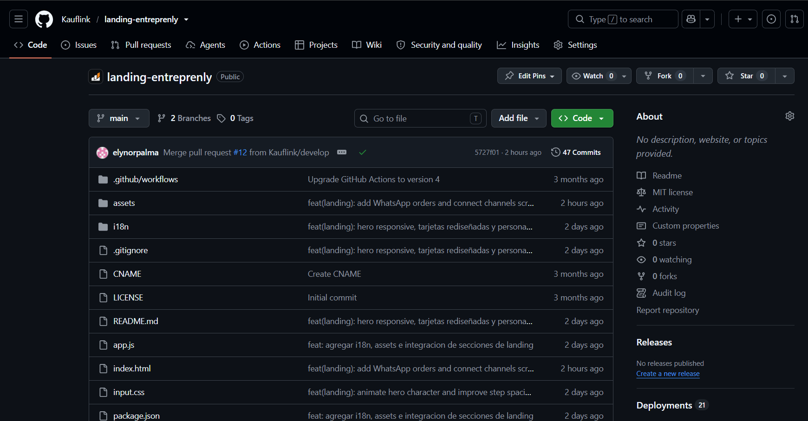</p>

**Paso 2.** En el repositorio ir a **Settings > Pages** y, en **Build and deployment > Source**, seleccionar **GitHub Actions**.

<p align="center">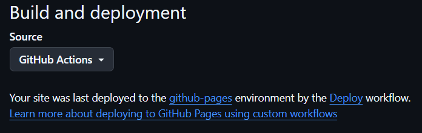 Pages con Source = GitHub Actions"></p>

**Paso 3.** Agregar el archivo `CNAME` con el valor `entreprenly.online` en la raíz del repositorio y, en **Settings > Pages > Custom domain**, registrar `entreprenly.online` habilitando **Enforce HTTPS**.

<p align="center">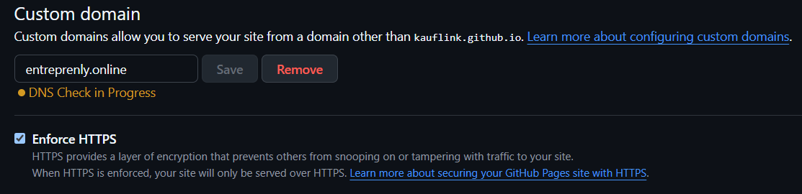</p>

**Paso 4.** En el proveedor de DNS del dominio, crear los registros `A` apuntando a las IPs de GitHub Pages (`185.199.108.153`, `185.199.109.153`, `185.199.110.153`, `185.199.111.153`).

<p align="center">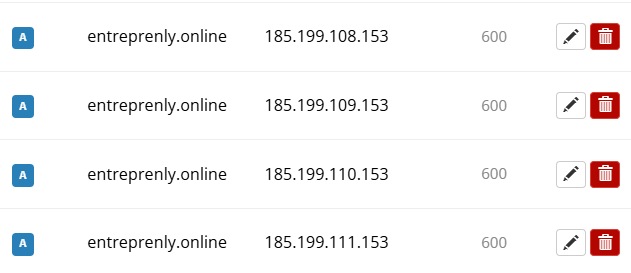</p>

**Paso 5.** Crear el workflow `.github/workflows/deploy.yml`, que ante cada push a `main` ejecuta: checkout, configuración de **Node.js 20**, `npm install`, compilación de estilos con Tailwind (`npm run build`), subida del artefacto con `actions/upload-pages-artifact` y publicación con `actions/deploy-pages`.

<p align="center">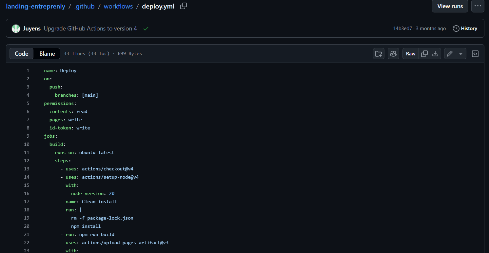</p>

**Paso 6.** Verificar en la pestaña **Actions** que la ejecución del workflow finalizó correctamente (estado verde).

<p align="center">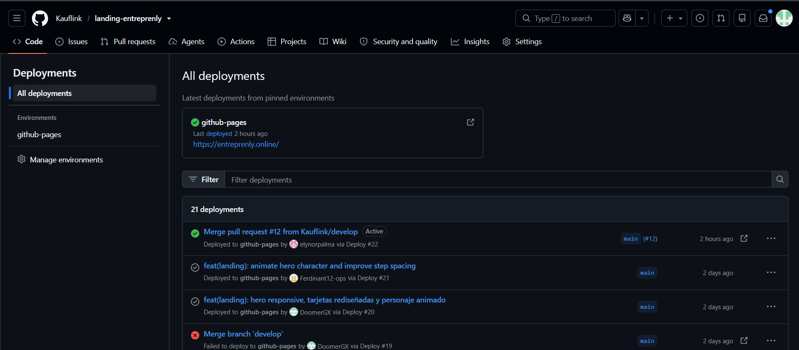</p>

**Paso 7.** Validar el despliegue accediendo a `https://entreprenly.online` y confirmando que la versión publicada corresponde al último commit de `main`.

<p align="center">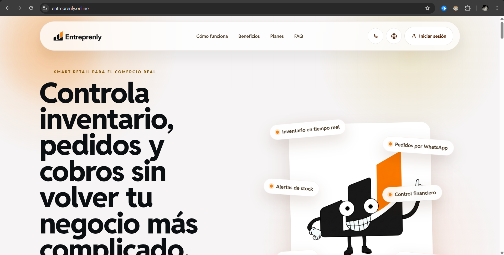</p>

#### Frontend Web Application (Firebase Hosting)

El Frontend está desarrollado con **Angular** y se despliega en **Firebase Hosting** bajo el proyecto `daop-entreprenly`, con automatización por **GitHub Actions**. Está disponible en **https://daop-entreprenly.web.app** y en el dominio personalizado **https://daop.entreprenly.online**. Firebase Hosting se eligió por su soporte nativo del enrutamiento SPA de Angular, la posibilidad de asociar subdominios personalizados sin conflicto con el dominio del Landing, y su integración directa con GitHub Actions.

**Paso 1.** Crear el proyecto **`daop-entreprenly`** en **Firebase Console** (https://console.firebase.google.com) y activar el servicio **Hosting**.

<p align="center">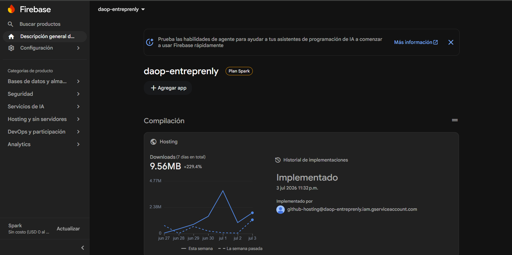</p>

**Paso 2.** En el entorno local, instalar Firebase CLI e iniciar sesión:
```bash
npm install -g firebase-tools
firebase login
```

<p align="center"></p>

<p align="center">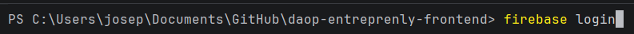</p>

**Paso 3.** En el repositorio `Kauflink/daop-entreprenly-frontend`, inicializar Hosting con `firebase init hosting`: seleccionar el proyecto `daop-entreprenly`, indicar `dist/entreprenly/browser` como directorio público (salida del build de producción de Angular), responder **Yes** a la reescritura de rutas al `index.html` (SPA) y **no** sobrescribir el `index.html`. Esto genera `.firebaserc` con el proyecto por defecto.

<p align="center">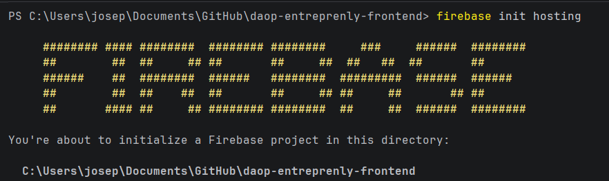</p>

**Paso 4.** Verificar que `firebase.json` incluya la regla de reescritura para el SPA routing:
```json
{
  "hosting": {
    "public": "dist/entreprenly/browser",
    "ignore": ["firebase.json", "**/.*", "**/node_modules/**"],
    "rewrites": [{ "source": "**", "destination": "/index.html" }]
  }
}
```

<p align="center">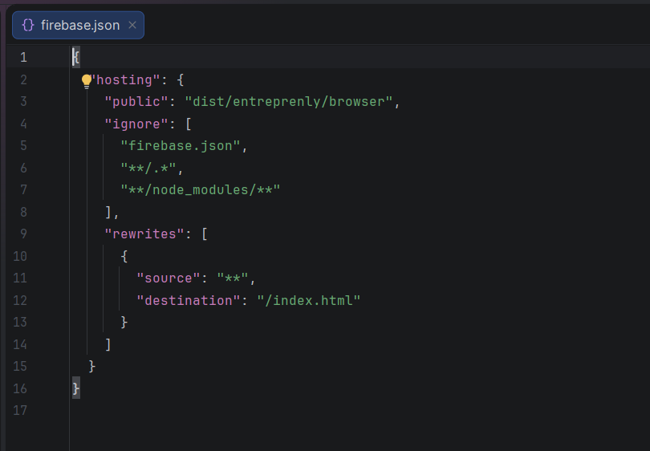</p>

**Paso 5.** En **Firebase Console > Hosting > Add custom domain**, registrar el subdominio `daop.entreprenly.online`, crear en el proveedor de DNS los registros que indica Firebase (tipo `A` o `TXT`) y esperar la emisión automática del certificado TLS.

<p align="center">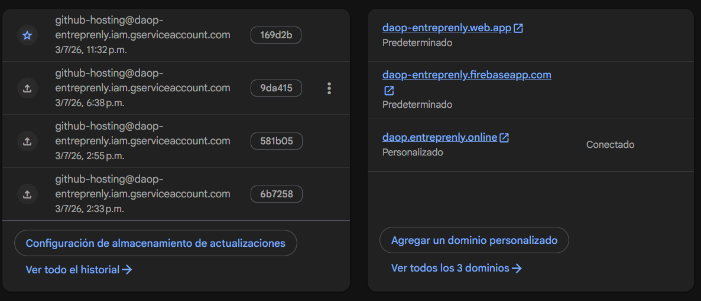</p>

**Paso 6.** En el repositorio, registrar el **GitHub Secret** `FIREBASE_SERVICE_ACCOUNT_DAOP_ENTREPRENLY` con las credenciales de la cuenta de servicio de Firebase para autenticar el despliegue desde GitHub Actions.

<p align="center">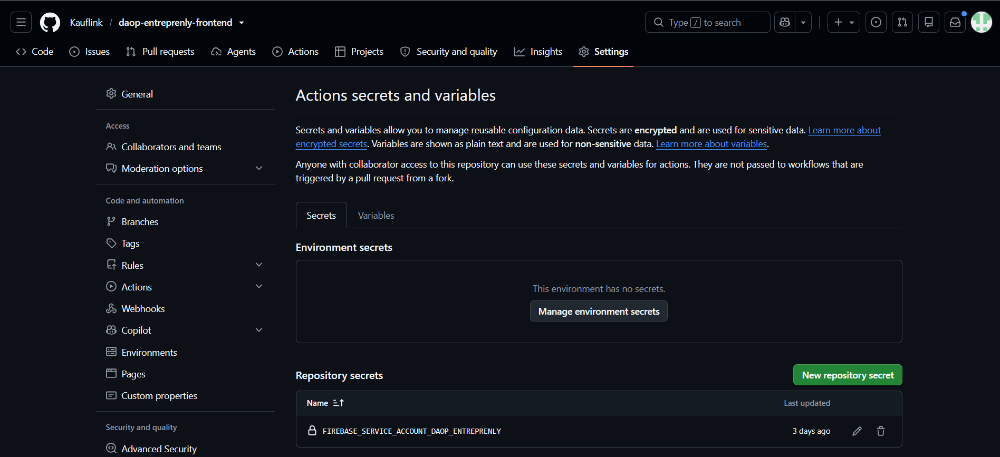</p>

**Paso 7.** Crear el workflow `.github/workflows/firebase-hosting.yml`, que ante cada push a `main` ejecuta: checkout, **Node.js 22** 

<p align="center">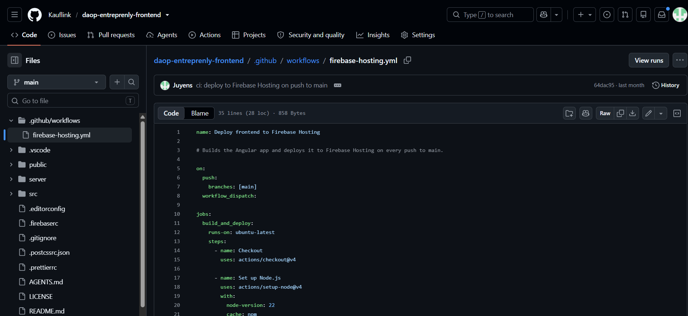</p>

**Paso 8.** Verificar la ejecución del workflow en **Actions** (estado verde) y validar accediendo a `https://daop.entreprenly.online`, comprobando que la navegación entre vistas de Angular funciona sin errores 404 al refrescar.

<p align="center">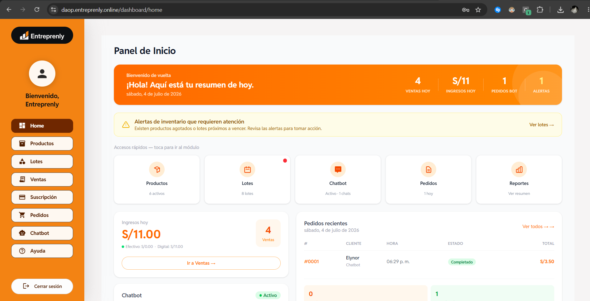</p>

#### RESTful Web Services (Google Cloud Run)

El Backend está desarrollado con **Spring Boot** y se empaqueta con un **`Dockerfile`** multi-stage. Se despliega en **Google Cloud Run** (servicio `daop-entreprenly-web-services`, región `us-east1`), donde el contenedor se construye a partir del código fuente mediante **Cloud Build** y la imagen queda publicada en **Artifact Registry**. La base de datos es **Cloud SQL para PostgreSQL** y el servicio se expone en el dominio personalizado **https://daop-api.entreprenly.online**. El despliegue se realiza de forma manual desde la **consola web de Cloud Run**.

**Paso 1.** En **Google Cloud Console**, seleccionar (o crear) el proyecto y habilitar las APIs necesarias: **Cloud Run Admin**, **Cloud Build**, **Artifact Registry** y **Cloud SQL Admin**.

<p align="center">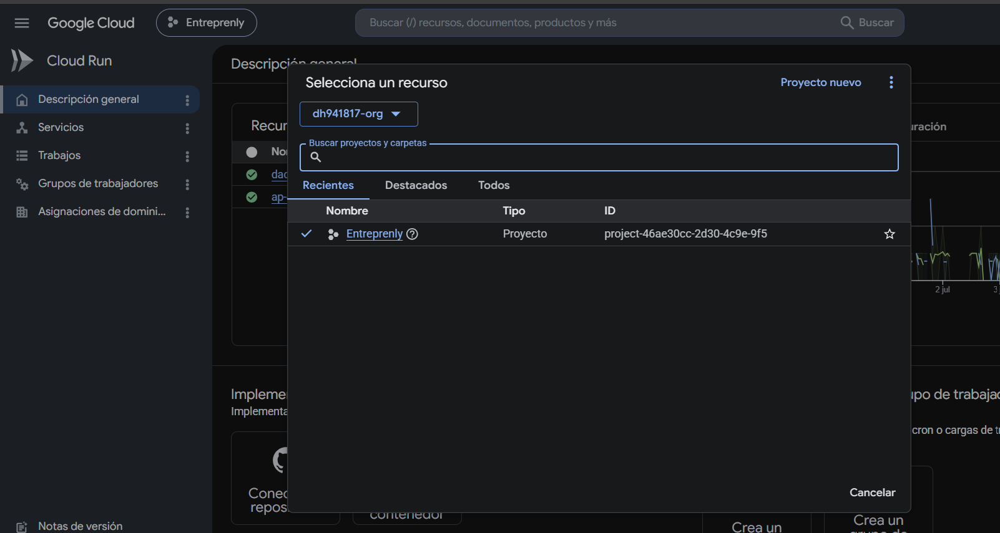</p>

**Paso 2.** Provisionar la instancia de **Cloud SQL (PostgreSQL)** que aloja la base de datos de producción y anotar su **connection name** (`proyecto:us-east1:instancia`), requerido más adelante por la variable `CLOUD_SQL_CONNECTION_NAME`.

<p align="center">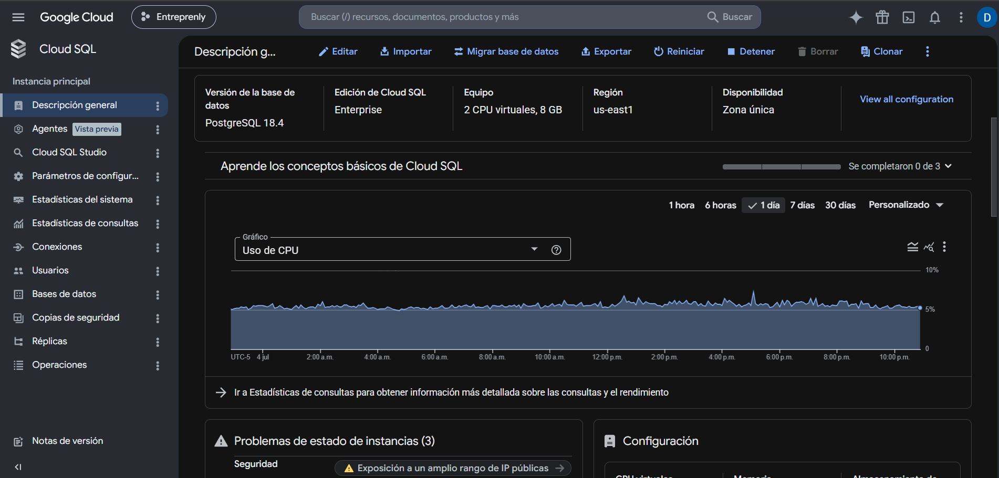</p>

**Paso 3.** Confirmar que el repositorio `Kauflink/daop-entreprenly-web-services` contiene el **`Dockerfile`** multi-stage: la primera etapa compila con **Maven** sobre **Eclipse Temurin 26** (JDK) y la segunda ejecuta el `.jar` sobre un JRE **Temurin 26**, con el perfil `prod` activo. La aplicación escucha en el puerto definido por la variable `PORT` (`server.port=${PORT:8092}`).

<p align="center">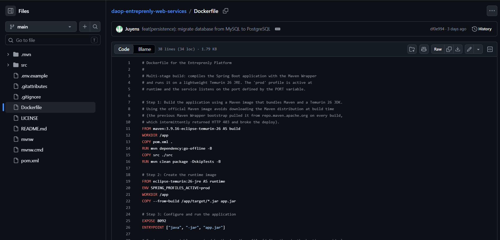</p>

**Paso 4.** En **Cloud Run > Deploy container > Service**, elegir la opción de desplegar **desde el código fuente / repositorio** (build con Cloud Build usando el `Dockerfile`). Conectar el repositorio de GitHub `daop-entreprenly-web-services` y seleccionar la rama `main`.

<p align="center">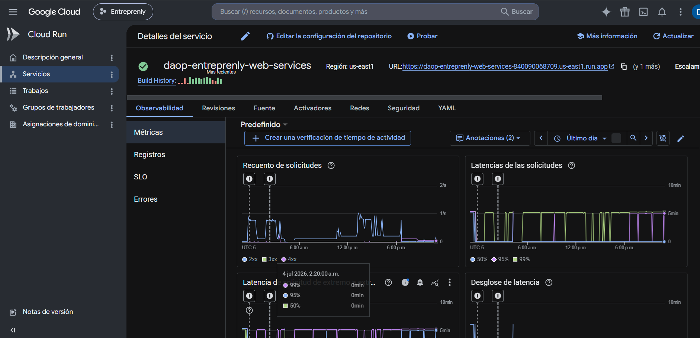</p>

**Paso 5.** Definir la configuración del servicio: nombre `daop-entreprenly-web-services`, región `us-east1`, **Authentication = Allow unauthenticated invocations**, **container port = 8080** (Cloud Run inyecta `PORT=8080`, por lo que la app escucha ahí), **CPU = 1**, **Memory = 1 GiB**, **Max instances = 3** y **Startup CPU boost** activado.

<p align="center">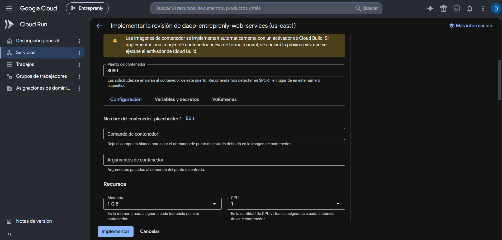</p>

**Paso 6.** En la pestaña **Containers > Cloud SQL connections** (o **Connections**), agregar la conexión a la instancia de Cloud SQL creada en el Paso 2.

<p align="center">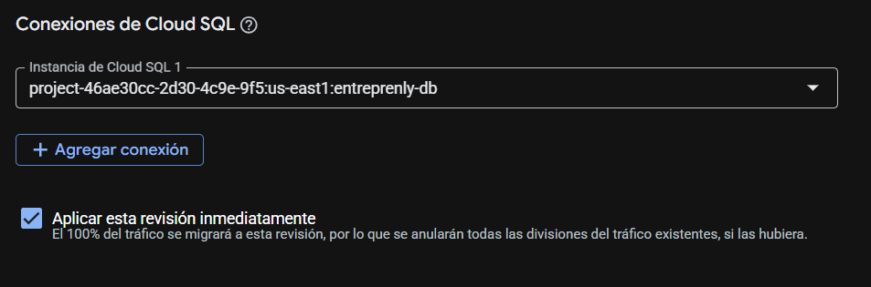</p>

**Paso 7.** En **Variables & Secrets**, definir las variables de entorno del perfil `prod`: `SPRING_PROFILES_ACTIVE=prod`, `DATABASE_USER`, `DATABASE_PASSWORD`, `JWT_SECRET`, `CLOUD_SQL_CONNECTION_NAME`, `WHATSAPP_ENABLED`, `WHATSAPP_BRIDGE_TOKEN`, `WHATSAPP_BRIDGE_BASE_URL` y `WHATSAPP_BRIDGE_SEND_URL`. *(Recomendado: gestionar los valores sensibles —contraseña, JWT y token del bridge— mediante **Secret Manager** en lugar de texto plano.)*

<p align="center">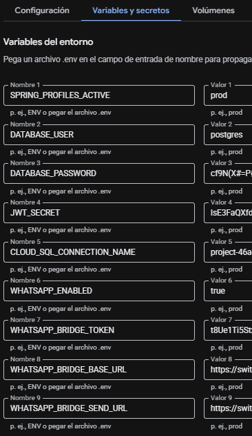</p>

**Paso 8.** Presionar **Deploy** y esperar a que Cloud Build construya la imagen (publicada en Artifact Registry) y la nueva revisión reciba el **100 % del tráfico**. Cloud Run asigna una URL `*.run.app`.

<p align="center">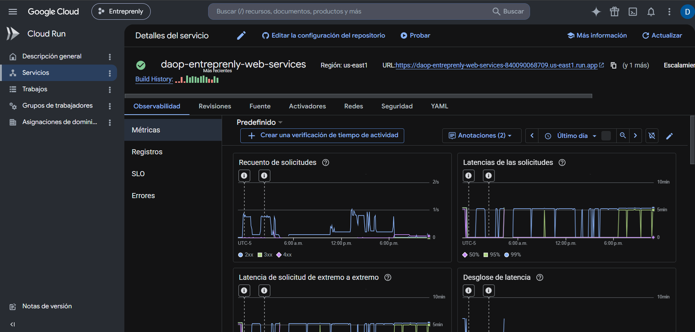</p>

**Paso 9.** En **Cloud Run > Manage Custom Domains > Add mapping**, mapear `daop-api.entreprenly.online` al servicio, crear en el DNS los registros indicados y esperar la emisión automática del certificado TLS. Registrar la URL base `https://daop-api.entreprenly.online/api/v1` en el `environment` de producción del frontend.

<p align="center">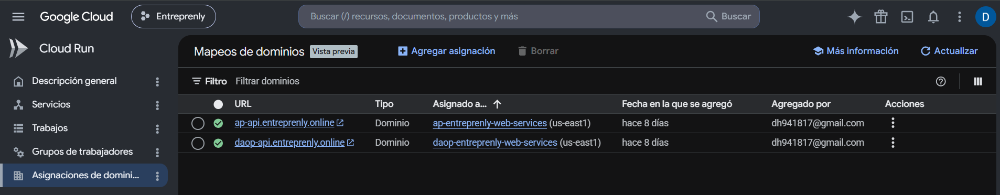</p>

**Paso 10.** Validar el despliegue accediendo a la documentación **Swagger UI** en `https://daop-api.entreprenly.online/swagger-ui/index.html` (OpenAPI en `/v3/api-docs`) y realizando una petición de prueba desde Swagger o Postman, confirmando la respuesta correcta sobre HTTPS.

<p align="center">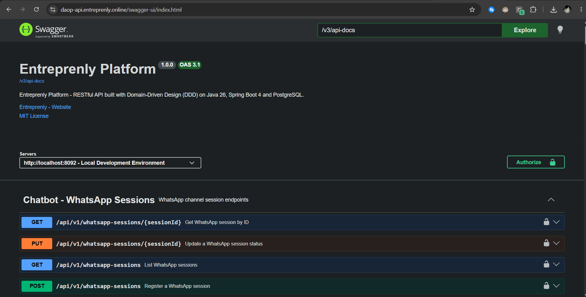</p>

## 5.2. Landing Page, Services & Applications Implementation

### 5.2.1. Sprint 1

#### 5.2.1.1. Sprint Planning 1

Para este primer Sprint, el equipo estableció como objetivo principal la implementación y despliegue de la primera versión del Landing Page de Entreprenly. La reunión de planificación se llevó a cabo de manera virtual, donde se definieron las User Stories a abordar, el Sprint Goal y la distribución de responsabilidades entre los miembros del equipo.

<table border="1" cellpadding="8" cellspacing="0" style="border-collapse: collapse; width: 100%;">
  <tbody>
    <tr>
      <td colspan="2"><strong>Sprint 1</strong></td>
    </tr>
    <tr>
      <td colspan="2"><strong>Sprint Planning Background</strong></td>
    </tr>
    <tr>
      <td><strong>Date</strong></td>
      <td>2026-04-18</td>
    </tr>
    <tr>
      <td><strong>Time</strong></td>
      <td>09:00 AM</td>
    </tr>
    <tr>
      <td><strong>Location</strong></td>
      <td>Reunión virtual vía Discord</td>
    </tr>
    <tr>
      <td><strong>Prepared By</strong></td>
      <td>Camargo Briceño, Joseph Julius</td>
    </tr>
    <tr>
      <td><strong>Attendees (to planning meeting)</strong></td>
      <td>Camargo Briceño, Joseph Julius / Chavez Carrasco, Lionel Abraham / Palma De Los Santos, Elynor Mikela / Peirano Brun, José Antonio / Flores Pinchi, José Fernando</td>
    </tr>
    <tr>
      <td><strong>Sprint 1 – 1 Review Summary</strong></td>
      <td>Al ser el primer Sprint del proyecto, no existe un Sprint anterior que revisar. Se parte desde cero con el inicio del ciclo de vida del producto.</td>
    </tr>
    <tr>
      <td><strong>Sprint 1 – 1 Retrospective Summary</strong></td>
      <td>Al ser el primer Sprint del proyecto, no existe retrospectiva previa. El equipo acordó mantener comunicación constante vía Discord y respetar los plazos de entrega de cada tarea.</td>
    </tr>
    <tr>
      <td colspan="2"><strong>Sprint Goal &amp; User Stories</strong></td>
    </tr>
    <tr>
      <td><strong>Sprint 1 Goal</strong></td>
      <td>Nuestro enfoque está en presentar la propuesta de valor de Entreprenly a los usuarios potenciales a través de un Landing Page funcional y desplegado. Creemos que genera una primera impresión clara del producto y motiva a los visitantes de nuestros segmentos objetivo a explorar la plataforma. Esto se confirmará cuando el Landing Page esté públicamente accesible, incluya todas las secciones clave (hero, funcionalidades, planes y llamados a la acción) y redirija correctamente a los visitantes hacia la Web Application.</td>
    </tr>
    <tr>
      <td><strong>Sprint 1 Velocity</strong></td>
      <td>12</td>
    </tr>
    <tr>
      <td><strong>Sum of Story Points</strong></td>
      <td>12</td>
    </tr>
  </tbody>
</table>

---

#### 5.2.1.2. Aspect Leaders and Collaborators

En este primer Sprint, el equipo organizó su trabajo en torno a cuatro aspectos principales: la configuración inicial del repositorio y entorno de despliegue, el desarrollo de la estructura base del Landing Page, la implementación de funcionalidades interactivas (cambio de tema e idioma, animaciones y CTAs), y la revisión y corrección del contenido textual. A continuación, se presenta la matriz de liderazgo y colaboración (LACX):

<table border="1" cellpadding="8" cellspacing="0" style="border-collapse: collapse; width: 100%;">
  <thead>
    <tr>
      <th>Team Member (Last Name, First Name)</th>
      <th>GitHub Username</th>
      <th>Configuración del Repositorio y CI/CD<br>Leader (L) / Collaborator (C)</th>
      <th>Estructura Base del Landing Page<br>Leader (L) / Collaborator (C)</th>
      <th>Funcionalidades Interactivas (Tema, Idioma, CTAs)<br>Leader (L) / Collaborator (C)</th>
      <th>Corrección de Contenido<br>Leader (L) / Collaborator (C)</th>
    </tr>
  </thead>
  <tbody>
    <tr>
      <td>Camargo Briceño, Joseph Julius</td>
      <td>Juyens</td>
      <td>L</td>
      <td>C</td>
      <td>C</td>
      <td>C</td>
    </tr>
    <tr>
      <td>Chavez Carrasco, Lionel Abraham</td>
      <td>LioTG</td>
      <td>C</td>
      <td>L</td>
      <td>L</td>
      <td>C</td>
    </tr>
    <tr>
      <td>Palma De Los Santos, Elynor Mikela</td>
      <td>elynorpalma</td>
      <td>C</td>
      <td>C</td>
      <td>C</td>
      <td>L</td>
    </tr>
    <tr>
      <td>Peirano Brun, José Antonio</td>
      <td>DoomerGX</td>
      <td>C</td>
      <td>C</td>
      <td>C</td>
      <td>L</td>
    </tr>
    <tr>
      <td>Flores Pinchi, José Fernando</td>
      <td>Ferdinant12-ops</td>
      <td>C</td>
      <td>L</td>
      <td>C</td>
      <td>L</td>
    </tr>
  </tbody>
</table>

---

#### 5.2.1.3. Sprint Backlog 1

El objetivo principal de este Sprint fue implementar y desplegar la primera versión del Landing Page de Entreprenly, cubriendo las User Stories **US-53, US-84, US-85, US-86, US-87, US-88 y US-89** del Product Backlog. Cada User Story se descompuso en Engineering Tasks con una estimación individual entre 4 y 8 horas, gestionadas en el tablero Kanban del Sprint con las columnas **To Do, In Process, To Review y Done**.

**Board público del Sprint 1 (Trello):** https://trello.com/b/w5cZrD9x/entreprenly-sprint-1

A continuación se presenta el tablero del Sprint y el detalle de los Work-items asociados.

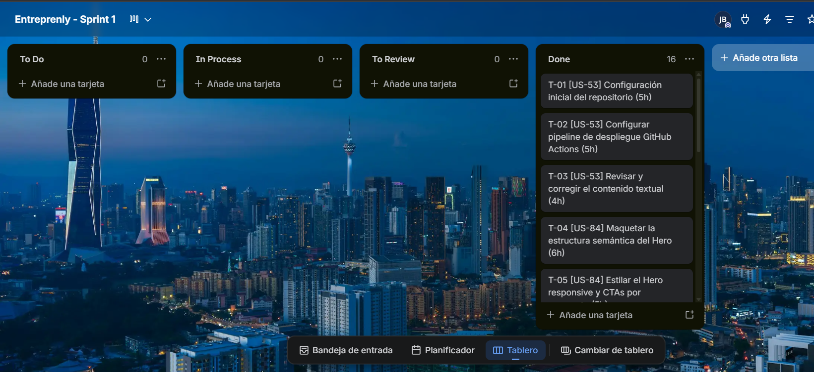
 
<table border="1" cellpadding="8" cellspacing="0" style="border-collapse: collapse; width: 100%;">
  <thead>
    <tr>
      <th colspan="8">Sprint # Sprint 1</th>
    </tr>
    <tr>
      <th colspan="2">User Story</th>
      <th colspan="6">Work-Item / Task</th>
    </tr>
    <tr>
      <th>Id</th>
      <th>Title</th>
      <th>Id</th>
      <th>Title</th>
      <th>Description</th>
      <th>Estimation (Hours)</th>
      <th>Assigned To</th>
      <th>Status</th>
    </tr>
  </thead>
  <tbody>
    <tr>
      <td>US-53</td>
      <td>Conocer propuesta de valor en landing page</td>
      <td>T-01</td>
      <td>Configuración inicial del repositorio</td>
      <td>Crear el repositorio, inicializar el proyecto con HTML/CSS/Tailwind y configurar el <code>.gitignore</code> y <code>package.json</code>.</td>
      <td>5</td>
      <td>Camargo Briceño, Joseph Julius</td>
      <td>Done</td>
    </tr>
    <tr>
      <td>US-53</td>
      <td>Conocer propuesta de valor en landing page</td>
      <td>T-02</td>
      <td>Configurar pipeline de despliegue (GitHub Actions)</td>
      <td>Crear y ajustar el workflow de GitHub Actions para despliegue automático en GitHub Pages con el archivo <code>CNAME</code>.</td>
      <td>5</td>
      <td>Camargo Briceño, Joseph Julius</td>
      <td>Done</td>
    </tr>
    <tr>
      <td>US-53</td>
      <td>Conocer propuesta de valor en landing page</td>
      <td>T-03</td>
      <td>Revisar y corregir el contenido textual</td>
      <td>Corregir errores ortográficos, de tildes y de redacción en todos los textos del Landing Page antes del despliegue a producción.</td>
      <td>4</td>
      <td>Palma De Los Santos, Elynor Mikela / Peirano Brun, José Antonio / Flores Pinchi, José Fernando</td>
      <td>Done</td>
    </tr>
    <tr>
      <td>US-84</td>
      <td>Visualizar la propuesta de valor</td>
      <td>T-04</td>
      <td>Maquetar la estructura semántica del Hero</td>
      <td>Desarrollar el HTML semántico de la sección Hero con headline, propuesta de valor e ilustración principal.</td>
      <td>6</td>
      <td>Chavez Carrasco, Lionel Abraham / Flores Pinchi, José Fernando</td>
      <td>Done</td>
    </tr>
    <tr>
      <td>US-84</td>
      <td>Visualizar la propuesta de valor</td>
      <td>T-05</td>
      <td>Estilar el Hero responsive y CTAs por segmento</td>
      <td>Estilar el Hero mobile-first con Tailwind e implementar los call-to-action diferenciados por segmento objetivo.</td>
      <td>5</td>
      <td>Chavez Carrasco, Lionel Abraham</td>
      <td>Done</td>
    </tr>
    <tr>
      <td>US-84</td>
      <td>Visualizar la propuesta de valor</td>
      <td>T-06</td>
      <td>Implementar animaciones de entrada del Hero</td>
      <td>Agregar animaciones de movimiento en el Hero y transiciones de fade al cambio de tema para mejorar la experiencia visual.</td>
      <td>4</td>
      <td>Chavez Carrasco, Lionel Abraham</td>
      <td>Done</td>
    </tr>
    <tr>
      <td>US-85</td>
      <td>Explorar las funciones principales</td>
      <td>T-07</td>
      <td>Implementar la sección Main Features</td>
      <td>Desarrollar la sección de funcionalidades con los 4 pilares: Inventario, Finanzas, Chatbot y Balanza IoT.</td>
      <td>6</td>
      <td>Chavez Carrasco, Lionel Abraham / Flores Pinchi, José Fernando</td>
      <td>Done</td>
    </tr>
    <tr>
      <td>US-85</td>
      <td>Explorar las funciones principales</td>
      <td>T-08</td>
      <td>Implementar las secciones How It Works y Merchant Benefits</td>
      <td>Desarrollar el flujo de adopción paso a paso y la sección de beneficios operativos para el comerciante.</td>
      <td>6</td>
      <td>Flores Pinchi, José Fernando</td>
      <td>Done</td>
    </tr>
    <tr>
      <td>US-85</td>
      <td>Explorar las funciones principales</td>
      <td>T-09</td>
      <td>Implementar las secciones Client Trust y Comparativa</td>
      <td>Desarrollar la sección de confianza del cliente final y la comparativa entre gestión manual, sistemas genéricos y Entreprenly.</td>
      <td>5</td>
      <td>Chavez Carrasco, Lionel Abraham</td>
      <td>Done</td>
    </tr>
    <tr>
      <td>US-86</td>
      <td>Revisar los planes de suscripción</td>
      <td>T-10</td>
      <td>Implementar la sección Planes</td>
      <td>Desarrollar las tarjetas del Plan Free y Plan Control con costo mensual, lista de funcionalidades y botones de acción hacia el registro.</td>
      <td>6</td>
      <td>Flores Pinchi, José Fernando</td>
      <td>Done</td>
    </tr>
    <tr>
      <td>US-87</td>
      <td>Consultar las preguntas frecuentes</td>
      <td>T-11</td>
      <td>Implementar la sección FAQ con acordeones</td>
      <td>Desarrollar la sección de preguntas frecuentes con acordeones interactivos que expanden y colapsan las respuestas.</td>
      <td>5</td>
      <td>Palma De Los Santos, Elynor Mikela / Peirano Brun, José Antonio</td>
      <td>Done</td>
    </tr>
    <tr>
      <td>US-88</td>
      <td>Iniciar sesión desde la landing page</td>
      <td>T-12</td>
      <td>Implementar el header y navbar responsive</td>
      <td>Desarrollar el header con la barra de navegación principal (Cómo funciona, Beneficios, Planes, FAQ) y el menú desplegable para móvil.</td>
      <td>5</td>
      <td>Chavez Carrasco, Lionel Abraham</td>
      <td>Done</td>
    </tr>
    <tr>
      <td>US-88</td>
      <td>Iniciar sesión desde la landing page</td>
      <td>T-13</td>
      <td>Implementar el botón "Iniciar sesión"</td>
      <td>Agregar el botón de ingreso en el header que redirige a <code>./login.html</code>.</td>
      <td>4</td>
      <td>Chavez Carrasco, Lionel Abraham</td>
      <td>Done</td>
    </tr>
    <tr>
      <td>US-88</td>
      <td>Iniciar sesión desde la landing page</td>
      <td>T-14</td>
      <td>Implementar los controles de tema e idioma</td>
      <td>Agregar el switch de tema claro/oscuro y el selector de idioma (Español/Inglés) accesibles desde la barra de navegación.</td>
      <td>6</td>
      <td>Chavez Carrasco, Lionel Abraham</td>
      <td>Done</td>
    </tr>
    <tr>
      <td>US-89</td>
      <td>Acceder mediante el botón de acción principal</td>
      <td>T-15</td>
      <td>Implementar los CTAs "Empezar gratis"</td>
      <td>Implementar los botones "Empezar gratis" en el Hero y en la sección Next Step que redirigen a <code>./register.html</code>.</td>
      <td>4</td>
      <td>Peirano Brun, José Antonio / Flores Pinchi, José Fernando</td>
      <td>Done</td>
    </tr>
    <tr>
      <td>US-89</td>
      <td>Acceder mediante el botón de acción principal</td>
      <td>T-16</td>
      <td>Implementar el Footer</td>
      <td>Desarrollar el footer con los grupos Explorar y Siguiente paso, datos de contacto y enlaces de la marca.</td>
      <td>5</td>
      <td>Peirano Brun, José Antonio / Flores Pinchi, José Fernando</td>
      <td>Done</td>
    </tr>
  </tbody>
</table>

---

#### 5.2.1.4. Development Evidence for Sprint Review

Durante el Sprint 1, el equipo se centró exclusivamente en el repositorio del Landing Page. Se realizaron un total de 20 commits distribuidos entre el 18 y el 20 de abril de 2026, cubriendo desde la configuración inicial del proyecto hasta correcciones de contenido y el despliegue automatizado mediante GitHub Actions. A continuación se presenta el registro de commits:

<table border="1" cellpadding="8" cellspacing="0" style="border-collapse: collapse; width: 100%;">
  <thead>
    <tr>
      <th>Repository</th>
      <th>Branch</th>
      <th>Commit Id</th>
      <th>Commit Message</th>
      <th>Commit Message Body</th>
      <th>Committed on (Date)</th>
    </tr>
  </thead>
  <tbody>
    <tr>
      <td>Kauflink/landing-entreprenly</td>
      <td>main</td>
      <td>d57dee9</td>
      <td>Initial commit</td>
      <td>Creación inicial del repositorio con estructura base del proyecto.</td>
      <td>2026-04-18</td>
    </tr>
    <tr>
      <td>Kauflink/landing-entreprenly</td>
      <td>develop</td>
      <td>86c305f</td>
      <td>chore(config): initialize .gitignore for node and tailwind</td>
      <td>Se agrega <code>.gitignore</code> configurado para excluir dependencias de Node y archivos compilados de Tailwind.</td>
      <td>2026-04-18</td>
    </tr>
    <tr>
      <td>Kauflink/landing-entreprenly</td>
      <td>develop</td>
      <td>568c339</td>
      <td>docs: simplify README with essential information and update license to MIT</td>
      <td>Se simplifica el README con instrucciones esenciales y se actualiza la licencia a MIT.</td>
      <td>2026-04-18</td>
    </tr>
    <tr>
      <td>Kauflink/landing-entreprenly</td>
      <td>main</td>
      <td>5088424</td>
      <td>Merge pull request #1 from Kauflink/develop</td>
      <td>Primera integración de la rama develop a main con la estructura base del proyecto.</td>
      <td>2026-04-18</td>
    </tr>
    <tr>
      <td>Kauflink/landing-entreprenly</td>
      <td>main</td>
      <td>003eb4f</td>
      <td>Create CNAME</td>
      <td>Se crea el archivo CNAME para la configuración del dominio personalizado en GitHub Pages.</td>
      <td>2026-04-18</td>
    </tr>
    <tr>
      <td>Kauflink/landing-entreprenly</td>
      <td>main</td>
      <td>9e82e20</td>
      <td>Refactor GitHub Actions workflow for deployment</td>
      <td>Se refactoriza el workflow de CI/CD para optimizar el proceso de despliegue automático.</td>
      <td>2026-04-18</td>
    </tr>
    <tr>
      <td>Kauflink/landing-entreprenly</td>
      <td>main</td>
      <td>bcc3513</td>
      <td>Update Node.js version and clean install step</td>
      <td>Se actualiza la versión de Node.js y se mejora el paso de instalación limpia en el pipeline.</td>
      <td>2026-04-18</td>
    </tr>
    <tr>
      <td>Kauflink/landing-entreprenly</td>
      <td>main</td>
      <td>ff3e7e6</td>
      <td>Update GitHub Actions workflow for deployment</td>
      <td>Se actualiza la configuración del workflow de despliegue.</td>
      <td>2026-04-18</td>
    </tr>
    <tr>
      <td>Kauflink/landing-entreprenly</td>
      <td>main</td>
      <td>14b3ed7</td>
      <td>Upgrade GitHub Actions to version 4</td>
      <td>Se actualiza GitHub Actions a la versión 4 para compatibilidad y mejoras de rendimiento.</td>
      <td>2026-04-18</td>
    </tr>
    <tr>
      <td>Kauflink/landing-entreprenly</td>
      <td>develop</td>
      <td>54554c9</td>
      <td>feat: agregar controles de tema, idioma y mejorar CTAs de la landing</td>
      <td>Se implementa el selector de idioma (ES/EN), el switch de tema claro/oscuro y se mejoran los call-to-action dirigidos a cada segmento objetivo.</td>
      <td>2026-04-19</td>
    </tr>
    <tr>
      <td>Kauflink/landing-entreprenly</td>
      <td>main</td>
      <td>32ab091</td>
      <td>Merge pull request #2 from Kauflink/develop</td>
      <td>Segunda integración con los controles de tema, idioma y CTAs mejorados.</td>
      <td>2026-04-19</td>
    </tr>
    <tr>
      <td>Kauflink/landing-entreprenly</td>
      <td>develop</td>
      <td>f9a1e00</td>
      <td>feat: add theme fade and hero motion refinements</td>
      <td>Se agregan transiciones de fade al cambio de tema y animaciones de movimiento en la sección hero.</td>
      <td>2026-04-19</td>
    </tr>
    <tr>
      <td>Kauflink/landing-entreprenly</td>
      <td>main</td>
      <td>9136aed</td>
      <td>Merge pull request #3 from Kauflink/develop</td>
      <td>Tercera integración con animaciones y refinamientos del hero.</td>
      <td>2026-04-19</td>
    </tr>
    <tr>
      <td>Kauflink/landing-entreprenly</td>
      <td>develop</td>
      <td>e740b59</td>
      <td>fix: corrección de tildes</td>
      <td>Se corrigen errores de acentuación en el contenido textual del Landing Page.</td>
      <td>2026-04-19</td>
    </tr>
    <tr>
      <td>Kauflink/landing-entreprenly</td>
      <td>develop</td>
      <td>55ee2fb</td>
      <td>fix(landing_page): ortografia arreglada</td>
      <td>Se corrigen errores ortográficos en los textos del Landing Page.</td>
      <td>2026-04-19</td>
    </tr>
    <tr>
      <td>Kauflink/landing-entreprenly</td>
      <td>main</td>
      <td>846f934</td>
      <td>Merge pull request #4 from Kauflink/develop</td>
      <td>Cuarta integración con correcciones ortográficas y de contenido.</td>
      <td>2026-04-19</td>
    </tr>
    <tr>
      <td>Kauflink/landing-entreprenly</td>
      <td>develop</td>
      <td>7e09505</td>
      <td>app:Correccion</td>
      <td>Correcciones generales en el contenido del Landing Page.</td>
      <td>2026-04-19</td>
    </tr>
    <tr>
      <td>Kauflink/landing-entreprenly</td>
      <td>develop</td>
      <td>3cbf2e2</td>
      <td>app:CorreccionPalabras</td>
      <td>Corrección de palabras en el contenido del Landing Page.</td>
      <td>2026-04-19</td>
    </tr>
    <tr>
      <td>Kauflink/landing-entreprenly</td>
      <td>develop</td>
      <td>8c4165b</td>
      <td>app:CorreccionTilde</td>
      <td>Corrección de tildes adicionales en el Landing Page.</td>
      <td>2026-04-19</td>
    </tr>
    <tr>
      <td>Kauflink/landing-entreprenly</td>
      <td>main</td>
      <td>7b8ccfc</td>
      <td>Merge pull request #5 from Kauflink/develop</td>
      <td>Quinta integración con las correcciones finales de contenido.</td>
      <td>2026-04-20</td>
    </tr>
  </tbody>
</table>

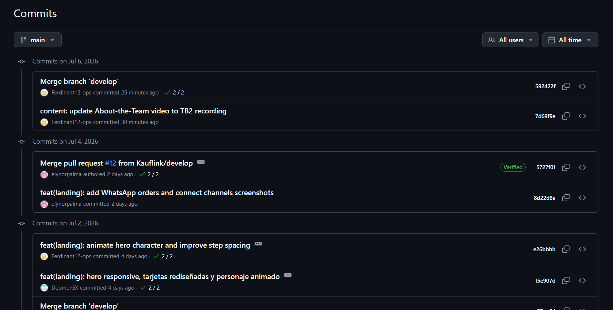

---

#### 5.2.1.5. Execution Evidence for Sprint Review

Al término del Sprint 1, el equipo logró implementar y desplegar satisfactoriamente la primera versión del Landing Page de Entreprenly. La página se encuentra disponible públicamente a través de GitHub Pages con dominio personalizado configurado mediante el archivo CNAME. El Landing Page incluye las siguientes secciones:

- **Hero:** Presentación principal del producto con headline, propuesta de valor y llamados a la acción (CTAs) diferenciados por segmento objetivo (comerciantes y clientes finales).
- **Funcionalidades:** Descripción visual de las características principales de Entreprenly: gestión de inventario, chatbot de WhatsApp, balanza IoT y dashboard financiero.
- **Planes:** Sección con los planes disponibles (Plan Free y Plan Control) con sus beneficios y botones de acción.
- **Footer:** Información de contacto, términos y condiciones y enlaces relevantes.
- **Controles de experiencia:** Selector de idioma (Español / Inglés) y switch de tema claro/oscuro, accesibles desde la barra de navegación.


 
---
 
#### 5.2.1.6. Services Documentation Evidence for Sprint Review
 
Durante el Sprint 1, el alcance de implementación se limitó exclusivamente al Landing Page estático. No se desarrollaron ni desplegaron Web Services (RESTful API) en esta iteración, por lo que no aplica documentación de endpoints para este Sprint. La documentación de servicios web se incorporará a partir del Sprint 3, conforme a lo planificado en el Product Backlog.
 
---
 
#### 5.2.1.7. Software Deployment Evidence for Sprint Review
 
Durante el Sprint 1, el equipo configuró y ejecutó el proceso de despliegue del Landing Page mediante GitHub Pages y un pipeline de integración continua con GitHub Actions. A continuación se describe el proceso realizado:
 
1. **Creación del repositorio:** Se creó el repositorio público `landing-entreprenly` bajo la organización `Kauflink` en GitHub, aplicando GitFlow con las ramas `main` y `develop`.


2. **Configuración del dominio personalizado:** Se añadió el archivo `CNAME` al repositorio con el dominio personalizado asignado al Landing Page.


3. **Configuración del pipeline de CI/CD:** Se creó un workflow de GitHub Actions (`.github/workflows/`) que automatiza el proceso de build y despliegue. El workflow incluye los pasos de instalación de dependencias (`npm install`), compilación de estilos con Tailwind CSS (`npm run build`) y publicación en GitHub Pages mediante las acciones `actions/upload-pages-artifact` y `actions/deploy-pages` al integrar cambios en `main`.


4. **Verificación del despliegue:** Se comprobó que el Landing Page quedó correctamente publicado y accesible desde la URL de GitHub Pages con el dominio configurado.


 
---
 
#### 5.2.1.8. Team Collaboration Insights during Sprint
 
Durante el Sprint 1, todos los miembros del equipo participaron activamente en la implementación del Landing Page, evidenciado a través de los commits registrados en el repositorio `landing-entreprenly`. El trabajo se distribuyó de manera colaborativa: Joseph Julius lideró la configuración del repositorio y el pipeline de despliegue; Lionel Abraham se encargó del desarrollo de funcionalidades interactivas y animaciones; Elynor Mikela, José Antonio y José Fernando contribuyeron con correcciones de contenido y en la estructura base de la página.
 
El equipo aplicó GitFlow como estrategia de control de versiones, trabajando en la rama `develop` y realizando la integración a `main` mediante Pull Requests revisados y aprobados por otros miembros. Se realizaron un total de 5 Pull Requests durante el Sprint.
 


**URL del repositorio del Landing Page:** https://github.com/Kauflink/landing-entreprenly

### 5.2.2. Sprint 2

#### 5.2.2.1. Sprint Planning 2

Para este segundo Sprint, el equipo estableció como objetivo principal la implementación de la Frontend Web Application de Entreprenly en Angular, cubriendo todos los Bounded Contexts planificados: Auth, Profile, Subscription, Inventory, Sales y Chatbot. La reunión de planificación se llevó a cabo de manera virtual, donde se definieron las User Stories a abordar, el Sprint Goal y la distribución de responsabilidades por Bounded Context.

<table border="1" cellpadding="8" cellspacing="0" style="border-collapse: collapse; width: 100%;">
  <tbody>
    <tr>
      <td colspan="2"><strong>Sprint 2</strong></td>
    </tr>
    <tr>
      <td colspan="2"><strong>Sprint Planning Background</strong></td>
    </tr>
    <tr>
      <td><strong>Date</strong></td>
      <td>2026-04-21</td>
    </tr>
    <tr>
      <td><strong>Time</strong></td>
      <td>09:00 AM</td>
    </tr>
    <tr>
      <td><strong>Location</strong></td>
      <td>Reunión virtual vía Discord</td>
    </tr>
    <tr>
      <td><strong>Prepared By</strong></td>
      <td>Camargo Briceño, Joseph Julius</td>
    </tr>
    <tr>
      <td><strong>Attendees (to planning meeting)</strong></td>
      <td>Camargo Briceño, Joseph Julius / Chavez Carrasco, Lionel Abraham / Palma De Los Santos, Elynor Mikela / Peirano Brun, José Antonio / Flores Pinchi, José Fernando</td>
    </tr>
    <tr>
      <td><strong>Sprint 1 Review Summary</strong></td>
      <td>En el Sprint 1 se implementó y desplegó exitosamente la primera versión del Landing Page de Entreprenly. La página se encuentra disponible en https://entreprenly.online con dominio personalizado y despliegue continuo mediante GitHub Actions. Se cubrieron todas las secciones planificadas: Hero, Funcionalidades, Planes, FAQ y Footer, con soporte de tema claro/oscuro e idioma Español/Inglés.</td>
    </tr>
    <tr>
      <td><strong>Sprint 1 Retrospective Summary</strong></td>
      <td>El equipo identificó que la coordinación entre ramas mejoró con GitFlow. Para el Sprint 2 se acordó asignar un Bounded Context por miembro del equipo para evitar conflictos de merge, mantener la rama <code>develop</code> como punto de integración central y aumentar la frecuencia de Pull Requests para revisión cruzada.</td>
    </tr>
    <tr>
      <td colspan="2"><strong>Sprint Goal &amp; User Stories</strong></td>
    </tr>
    <tr>
      <td><strong>Sprint 2 Goal</strong></td>
      <td>Nuestro enfoque está en desarrollar el Frontend Web Application completo de Entreprenly en Angular, cubriendo todos los Bounded Contexts principales: Sales (Punto de Venta), Chatbot (Pedidos WhatsApp), Subscription, Inventory y Profile. Creemos que entrega una aplicación web funcional y desplegable con la que los comerciantes peruanos pueden gestionar sus operaciones de venta y sus pedidos de WhatsApp. Esto se confirmará cuando la aplicación Angular esté desplegada exitosamente en Firebase Hosting y todos los flujos clave, como el registro de ventas en caja, la gestión de pedidos por chatbot y la configuración del perfil de usuario, sean funcionales y navegables.</td>
    </tr>
    <tr>
      <td><strong>Sprint 2 Velocity</strong></td>
      <td>74</td>
    </tr>
    <tr>
      <td><strong>Sum of Story Points</strong></td>
      <td>74</td>
    </tr>
  </tbody>
</table>

---

#### 5.2.2.2. Aspect Leaders and Collaborators

En el Sprint 2, el equipo organizó el trabajo asignando un Bounded Context principal por miembro para maximizar la autonomía y reducir conflictos de merge. Los aspectos cubiertos fueron: la infraestructura base y el DashboardLayout compartido, el BC de Sales (Punto de Venta), el BC de Chatbot (Pedidos WhatsApp), los BCs de Subscription e Inventory, y el BC de Profile junto con la internacionalización (i18n) y el sistema de temas. A continuación se presenta la matriz de liderazgo y colaboración (LACX):

<table border="1" cellpadding="8" cellspacing="0" style="border-collapse: collapse; width: 100%;">
  <thead>
    <tr>
      <th>Team Member (Last Name, First Name)</th>
      <th>GitHub Username</th>
      <th>Infraestructura Base y DashboardLayout<br>Leader (L) / Collaborator (C)</th>
      <th>Sales BC (Punto de Venta)<br>Leader (L) / Collaborator (C)</th>
      <th>Chatbot BC (Pedidos WhatsApp)<br>Leader (L) / Collaborator (C)</th>
      <th>Subscription & Inventory BC<br>Leader (L) / Collaborator (C)</th>
      <th>Profile BC, i18n y Tema<br>Leader (L) / Collaborator (C)</th>
    </tr>
  </thead>
  <tbody>
    <tr>
      <td>Camargo Briceño, Joseph Julius</td>
      <td>Juyens</td>
      <td>L</td>
      <td>C</td>
      <td>C</td>
      <td>C</td>
      <td>L</td>
    </tr>
    <tr>
      <td>Chavez Carrasco, Lionel Abraham</td>
      <td>LioTG</td>
      <td>C</td>
      <td>C</td>
      <td>C</td>
      <td>L</td>
      <td>C</td>
    </tr>
    <tr>
      <td>Palma De Los Santos, Elynor Mikela</td>
      <td>elynorpalma</td>
      <td>C</td>
      <td>C</td>
      <td>L</td>
      <td>C</td>
      <td>C</td>
    </tr>
    <tr>
      <td>Peirano Brun, José Antonio</td>
      <td>DoomerGX</td>
      <td>C</td>
      <td>C</td>
      <td>C</td>
      <td>L</td>
      <td>C</td>
    </tr>
    <tr>
      <td>Flores Pinchi, José Fernando</td>
      <td>Ferdinant12-ops</td>
      <td>C</td>
      <td>L</td>
      <td>C</td>
      <td>C</td>
      <td>C</td>
    </tr>
  </tbody>
</table>

---

#### 5.2.2.3. Sprint Backlog 2

El objetivo principal de este Sprint fue implementar la Frontend Web Application de Entreprenly en Angular, cubriendo los Bounded Contexts de Inventory, Sales, Chatbot, Subscription y Profile, junto con las vistas de Home, Help y la navegación. Cada User Story se descompuso en Engineering Tasks con una estimación individual entre 4 y 8 horas, gestionadas en el tablero Kanban del Sprint con las columnas **To Do, In Process, To Review y Done**.

**Board público del Sprint 2 (Trello):** https://trello.com/b/X5XRlVOZ/entreprenly-sprint-2

A continuación se presenta el tablero del Sprint y el detalle de los Work-items asociados.

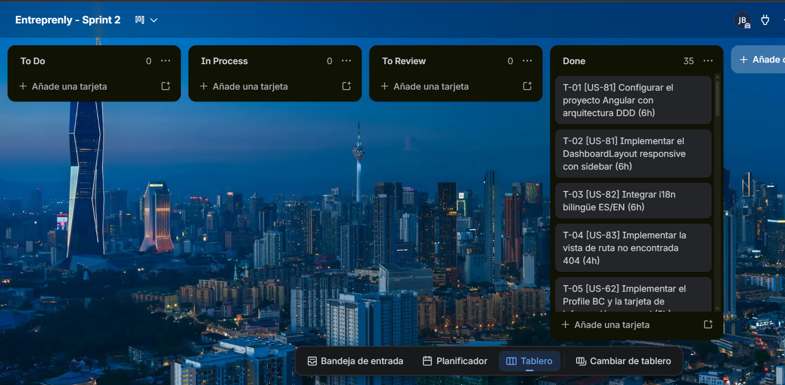

<table border="1" cellpadding="8" cellspacing="0" style="border-collapse: collapse; width: 100%;">
  <thead>
    <tr>
      <th colspan="8">Sprint # Sprint 2</th>
    </tr>
    <tr>
      <th colspan="2">User Story</th>
      <th colspan="6">Work-Item / Task</th>
    </tr>
    <tr>
      <th>Id</th>
      <th>Title</th>
      <th>Id</th>
      <th>Title</th>
      <th>Description</th>
      <th>Estimation (Hours)</th>
      <th>Assigned To</th>
      <th>Status</th>
    </tr>
  </thead>
  <tbody>
    <tr>
      <td>US-81</td>
      <td>Navegar entre módulos desde el sidebar</td>
      <td>T-01</td>
      <td>Configurar el proyecto Angular con arquitectura DDD</td>
      <td>Inicializar el proyecto Angular con arquitectura DDD por Bounded Context, rutas lazy-loading y la estructura base de carpetas.</td>
      <td>6</td>
      <td>Camargo Briceño, Joseph Julius</td>
      <td>Done</td>
    </tr>
    <tr>
      <td>US-81</td>
      <td>Navegar entre módulos desde el sidebar</td>
      <td>T-02</td>
      <td>Implementar el DashboardLayout responsive con sidebar</td>
      <td>Desarrollar el <code>DashboardLayoutComponent</code> con sidebar naranja, logotipo, íconos de navegación por BC, botón de logout y <code>router-outlet</code>.</td>
      <td>6</td>
      <td>Camargo Briceño, Joseph Julius</td>
      <td>Done</td>
    </tr>
    <tr>
      <td>US-82</td>
      <td>Cambiar idioma de la interfaz</td>
      <td>T-03</td>
      <td>Integrar i18n bilingüe ES/EN</td>
      <td>Integrar el sistema de internacionalización ES/EN en todos los BCs y traducir dinámicamente el título de la pestaña del navegador.</td>
      <td>6</td>
      <td>Camargo Briceño, Joseph Julius</td>
      <td>Done</td>
    </tr>
    <tr>
      <td>US-83</td>
      <td>Gestionar rutas no encontradas</td>
      <td>T-04</td>
      <td>Implementar la vista de ruta no encontrada (404)</td>
      <td>Desarrollar la vista que se muestra cuando el usuario ingresa a una URL inválida dentro del dashboard.</td>
      <td>4</td>
      <td>Camargo Briceño, Joseph Julius</td>
      <td>Done</td>
    </tr>
    <tr>
      <td>US-62</td>
      <td>Visualizar perfil actual</td>
      <td>T-05</td>
      <td>Implementar el Profile BC y la tarjeta de información personal</td>
      <td>Crear la estructura DDD del Profile BC y la tarjeta que muestra los datos registrados del comerciante.</td>
      <td>5</td>
      <td>Camargo Briceño, Joseph Julius</td>
      <td>Done</td>
    </tr>
    <tr>
      <td>US-63</td>
      <td>Actualizar nombre y biografía</td>
      <td>T-06</td>
      <td>Implementar la edición de nombre y biografía</td>
      <td>Desarrollar el formulario de edición de nombre y biografía dentro del perfil.</td>
      <td>4</td>
      <td>Camargo Briceño, Joseph Julius</td>
      <td>Done</td>
    </tr>
    <tr>
      <td>US-64</td>
      <td>Subir foto de perfil</td>
      <td>T-07</td>
      <td>Implementar la carga de avatar</td>
      <td>Desarrollar la carga de foto de perfil con previsualización y codificación base64.</td>
      <td>5</td>
      <td>Camargo Briceño, Joseph Julius</td>
      <td>Done</td>
    </tr>
    <tr>
      <td>US-67</td>
      <td>Configurar preferencias de idioma, zona horaria, tema y moneda</td>
      <td>T-08</td>
      <td>Implementar la tarjeta de preferencias</td>
      <td>Desarrollar la tarjeta de preferencias con idioma, tema claro/oscuro y selector de moneda (PEN/USD) sincronizado con el Subscription BC.</td>
      <td>6</td>
      <td>Camargo Briceño, Joseph Julius</td>
      <td>Done</td>
    </tr>
    <tr>
      <td>US-67</td>
      <td>Configurar preferencias de idioma, zona horaria, tema y moneda</td>
      <td>T-09</td>
      <td>Persistir las preferencias en localStorage</td>
      <td>Persistir las preferencias de idioma, tema y moneda en <code>localStorage</code> para que sobrevivan a recargas y evitar el flash inicial.</td>
      <td>4</td>
      <td>Camargo Briceño, Joseph Julius</td>
      <td>Done</td>
    </tr>
    <tr>
      <td>US-68</td>
      <td>Configurar notificaciones</td>
      <td>T-10</td>
      <td>Implementar la tarjeta de configuración de notificaciones</td>
      <td>Desarrollar la tarjeta que permite activar o desactivar los avisos de stock, vencimientos y pedidos.</td>
      <td>4</td>
      <td>Camargo Briceño, Joseph Julius</td>
      <td>Done</td>
    </tr>
    <tr>
      <td>US-28</td>
      <td>Buscar productos en el inventario y validar su tipo de medida</td>
      <td>T-11</td>
      <td>Implementar el Sales BC base y el buscador</td>
      <td>Crear la estructura DDD del Sales BC, configurar el <code>db.json</code> con productos peruanos e implementar el buscador con autocompletado.</td>
      <td>6</td>
      <td>Flores Pinchi, José Fernando</td>
      <td>Done</td>
    </tr>
    <tr>
      <td>US-28</td>
      <td>Buscar productos en el inventario y validar su tipo de medida</td>
      <td>T-12</td>
      <td>Validar el tipo de medida del producto</td>
      <td>Validar si el producto es por unidad o por peso para abrir la interfaz de ingreso correspondiente, con mensaje "Producto no encontrado".</td>
      <td>4</td>
      <td>Flores Pinchi, José Fernando</td>
      <td>Done</td>
    </tr>
    <tr>
      <td>US-29</td>
      <td>Registrar la cantidad de unidades en el Ticket de Venta</td>
      <td>T-13</td>
      <td>Implementar el modal "Registrar Cantidad"</td>
      <td>Desarrollar el modal con teclado numérico y validación de stock disponible para productos vendidos por unidad.</td>
      <td>5</td>
      <td>Flores Pinchi, José Fernando</td>
      <td>Done</td>
    </tr>
    <tr>
      <td>US-30</td>
      <td>Capturar el peso mediante balanza IoT o ingreso manual</td>
      <td>T-14</td>
      <td>Implementar el modal de peso en modo IoT</td>
      <td>Desarrollar el modo automático que lee el peso de <code>db.json</code> y auto-confirma cuando la balanza está conectada.</td>
      <td>5</td>
      <td>Flores Pinchi, José Fernando</td>
      <td>Done</td>
    </tr>
    <tr>
      <td>US-30</td>
      <td>Capturar el peso mediante balanza IoT o ingreso manual</td>
      <td>T-15</td>
      <td>Implementar el modal de peso en modo manual</td>
      <td>Desarrollar el modo manual con teclado decimal cuando la balanza reporta <code>connected: false</code>.</td>
      <td>5</td>
      <td>Flores Pinchi, José Fernando</td>
      <td>Done</td>
    </tr>
    <tr>
      <td>US-31</td>
      <td>Gestionar el desglose y cálculo del Ticket de Venta</td>
      <td>T-16</td>
      <td>Implementar el ticket y el resumen lateral</td>
      <td>Desarrollar el desglose de ítems, la eliminación individual por ítem y el panel de resumen con subtotal y total en tiempo real usando signals.</td>
      <td>6</td>
      <td>Flores Pinchi, José Fernando</td>
      <td>Done</td>
    </tr>
    <tr>
      <td>US-32</td>
      <td>Seleccionar el método de pago para la transacción</td>
      <td>T-17</td>
      <td>Implementar la selección de método de pago</td>
      <td>Desarrollar la selección de método de pago (Efectivo / Digital) con validación que se auto-oculta a los 3 segundos.</td>
      <td>4</td>
      <td>Flores Pinchi, José Fernando</td>
      <td>Done</td>
    </tr>
    <tr>
      <td>US-33</td>
      <td>Finalizar la venta y emitir el comprobante de pago</td>
      <td>T-18</td>
      <td>Implementar la finalización de venta</td>
      <td>Desarrollar el flujo de finalización con validaciones, modal "Venta Exitosa" con auto-cierre y reset del ticket.</td>
      <td>5</td>
      <td>Flores Pinchi, José Fernando</td>
      <td>Done</td>
    </tr>
    <tr>
      <td>US-34</td>
      <td>Cancelar venta en curso</td>
      <td>T-19</td>
      <td>Implementar la cancelación de venta</td>
      <td>Desarrollar la acción que limpia el ticket y permite iniciar una nueva transacción sin procesar el cobro.</td>
      <td>4</td>
      <td>Flores Pinchi, José Fernando</td>
      <td>Done</td>
    </tr>
    <tr>
      <td>US-35</td>
      <td>Clasificar automáticamente los ingresos según el medio de pago</td>
      <td>T-20</td>
      <td>Acumular ingresos por método de pago</td>
      <td>Sumar el monto de cada venta finalizada al acumulado del método correspondiente (efectivo / digital).</td>
      <td>4</td>
      <td>Flores Pinchi, José Fernando</td>
      <td>Done</td>
    </tr>
    <tr>
      <td>US-36</td>
      <td>Monitorear el Resumen de Caja en tiempo real dentro del panel de ventas</td>
      <td>T-21</td>
      <td>Implementar el panel Resumen de Caja</td>
      <td>Desarrollar el panel con totales por día y su persistencia en <code>cash-registers</code> del <code>db.json</code> mediante PUT tras cada venta.</td>
      <td>5</td>
      <td>Flores Pinchi, José Fernando</td>
      <td>Done</td>
    </tr>
    <tr>
      <td>US-37</td>
      <td>Vincular cuenta de WhatsApp Business mediante código QR</td>
      <td>T-22</td>
      <td>Implementar el Chatbot BC base y la conexión QR</td>
      <td>Crear la estructura DDD del Chatbot BC y la vista de conexión con generación de QR escaneable (deep link de WhatsApp).</td>
      <td>6</td>
      <td>Palma De Los Santos, Elynor Mikela</td>
      <td>Done</td>
    </tr>
    <tr>
      <td>US-37</td>
      <td>Vincular cuenta de WhatsApp Business mediante código QR</td>
      <td>T-23</td>
      <td>Implementar el countdown y reinicio del QR</td>
      <td>Agregar el contador de expiración del código QR y su reinicio automático al vencer.</td>
      <td>4</td>
      <td>Palma De Los Santos, Elynor Mikela</td>
      <td>Done</td>
    </tr>
    <tr>
      <td>US-38</td>
      <td>Consultar estado de vinculación del chatbot</td>
      <td>T-24</td>
      <td>Implementar el indicador de estado y session guard</td>
      <td>Desarrollar el indicador de estado de conexión y el guard que bloquea el acceso a las conversaciones si WhatsApp no está conectado.</td>
      <td>5</td>
      <td>Palma De Los Santos, Elynor Mikela</td>
      <td>Done</td>
    </tr>
    <tr>
      <td>US-39</td>
      <td>Visualizar conversaciones de clientes en el dashboard</td>
      <td>T-25</td>
      <td>Implementar la lista de conversaciones</td>
      <td>Desarrollar la lista de conversaciones activas con la burbuja de escritura del cliente y el efecto typewriter del bot.</td>
      <td>6</td>
      <td>Palma De Los Santos, Elynor Mikela</td>
      <td>Done</td>
    </tr>
    <tr>
      <td>US-40</td>
      <td>Responder mensajes de clientes desde el dashboard</td>
      <td>T-26</td>
      <td>Implementar la vista de órdenes del chatbot</td>
      <td>Desarrollar la vista de órdenes con productos reales del Inventory BC, validación de pago y chips de rechazo traducidos.</td>
      <td>6</td>
      <td>Palma De Los Santos, Elynor Mikela</td>
      <td>Done</td>
    </tr>
    <tr>
      <td>US-07</td>
      <td>Visualizar detalles de producto</td>
      <td>T-27</td>
      <td>Implementar el Inventory BC y la vista de productos</td>
      <td>Crear la estructura del Inventory BC con la vista de productos y sus detalles (stock, precio, características).</td>
      <td>5</td>
      <td>Chavez Carrasco, Lionel Abraham / Peirano Brun, José Antonio</td>
      <td>Done</td>
    </tr>
    <tr>
      <td>US-08</td>
      <td>Buscar productos</td>
      <td>T-28</td>
      <td>Integrar el inventario con el Sales BC</td>
      <td>Integrar los datos reales del Inventory BC con el buscador del Sales BC y el decremento de stock tras cada venta.</td>
      <td>5</td>
      <td>Chavez Carrasco, Lionel Abraham</td>
      <td>Done</td>
    </tr>
    <tr>
      <td>US-13</td>
      <td>Visualizar dashboard de lotes</td>
      <td>T-29</td>
      <td>Implementar la vista de lotes con alertas</td>
      <td>Desarrollar la vista de lotes con indicadores y alertas de lotes próximos a vencer, consumida también por la vista de Home.</td>
      <td>5</td>
      <td>Peirano Brun, José Antonio</td>
      <td>Done</td>
    </tr>
    <tr>
      <td>US-15</td>
      <td>Seleccionar plan de suscripción</td>
      <td>T-30</td>
      <td>Implementar el Subscription BC con la vista de planes</td>
      <td>Desarrollar el Subscription BC con la vista de planes disponibles (Plan Free y Plan Control) y traducciones bilingües.</td>
      <td>5</td>
      <td>Chavez Carrasco, Lionel Abraham</td>
      <td>Done</td>
    </tr>
    <tr>
      <td>US-20</td>
      <td>Visualizar panel de suscripción</td>
      <td>T-31</td>
      <td>Implementar el panel de suscripción</td>
      <td>Desarrollar el panel con el plan actual y precios sincronizados con el selector de moneda del Profile BC.</td>
      <td>4</td>
      <td>Chavez Carrasco, Lionel Abraham / Peirano Brun, José Antonio</td>
      <td>Done</td>
    </tr>
    <tr>
      <td>US-70</td>
      <td>Visualizar resumen de ventas del día</td>
      <td>T-32</td>
      <td>Implementar la vista de Home</td>
      <td>Desarrollar el panel de inicio con el resumen del negocio, accesos rápidos y locale reactivo al idioma activo.</td>
      <td>6</td>
      <td>Palma De Los Santos, Elynor Mikela</td>
      <td>Done</td>
    </tr>
    <tr>
      <td>US-72</td>
      <td>Visualizar alertas de inventario en el home</td>
      <td>T-33</td>
      <td>Integrar las alertas de inventario en Home</td>
      <td>Mostrar en el panel de inicio las alertas críticas de lotes próximos a vencer y productos agotados.</td>
      <td>4</td>
      <td>Palma De Los Santos, Elynor Mikela</td>
      <td>Done</td>
    </tr>
    <tr>
      <td>US-76</td>
      <td>Visualizar el centro de soporte</td>
      <td>T-34</td>
      <td>Implementar la vista de Help</td>
      <td>Desarrollar el centro de ayuda con artículos bilingües agrupados por categoría y conteo real por categoría.</td>
      <td>5</td>
      <td>Palma De Los Santos, Elynor Mikela</td>
      <td>Done</td>
    </tr>
    <tr>
      <td>US-94</td>
      <td>Desplegar el frontend en Firebase Hosting</td>
      <td>T-35</td>
      <td>Configurar el despliegue en Firebase Hosting</td>
      <td>Configurar Firebase Hosting, crear el workflow de GitHub Actions para despliegue continuo y validar el despliegue en <code>https://daop.entreprenly.online</code>.</td>
      <td>5</td>
      <td>Camargo Briceño, Joseph Julius</td>
      <td>Done</td>
    </tr>
  </tbody>
</table>

---

#### 5.2.2.4. Development Evidence for Sprint Review

Durante el Sprint 2, el equipo trabajó exclusivamente sobre el repositorio del Frontend Web Application (`daop-entreprenly-frontend`). Se realizaron más de 100 commits entre el 9 y el 12 de mayo de 2026, cubriendo desde la configuración inicial del proyecto Angular hasta la integración completa de todos los Bounded Contexts. A continuación se presenta el registro de los commits más representativos:

<table border="1" cellpadding="8" cellspacing="0" style="border-collapse: collapse; width: 100%;">
  <thead>
    <tr>
      <th>Repository</th>
      <th>Branch</th>
      <th>Commit Id</th>
      <th>Commit Message</th>
      <th>Commit Message Body</th>
      <th>Committed on (Date)</th>
    </tr>
  </thead>
  <tbody>
    <tr>
      <td>Kauflink/daop-entreprenly-frontend</td>
      <td>main</td>
      <td>10fa91e</td>
      <td>Initial commit</td>
      <td>Creación inicial del repositorio del Frontend Web Application.</td>
      <td>2026-05-09</td>
    </tr>
    <tr>
      <td>Kauflink/daop-entreprenly-frontend</td>
      <td>main</td>
      <td>4306255</td>
      <td>chore: initial Angular project setup</td>
      <td>Configuración inicial del proyecto Angular con estructura base, dependencias y configuración de rutas.</td>
      <td>2026-05-09</td>
    </tr>
    <tr>
      <td>Kauflink/daop-entreprenly-frontend</td>
      <td>main</td>
      <td>2a97fc6</td>
      <td>feat(core): implement base interfaces, shared components and main views</td>
      <td>Se implementan las interfaces base, componentes compartidos y las vistas principales de la aplicación.</td>
      <td>2026-05-09</td>
    </tr>
    <tr>
      <td>Kauflink/daop-entreprenly-frontend</td>
      <td>develop</td>
      <td>ccd0a90</td>
      <td>dbJsonSales</td>
      <td>Se agrega la estructura inicial del <code>db.json</code> con productos peruanos para el BC de Sales.</td>
      <td>2026-05-09</td>
    </tr>
    <tr>
      <td>Kauflink/daop-entreprenly-frontend</td>
      <td>main</td>
      <td>982fc2a</td>
      <td>feat(layout): add DashboardLayout shell component</td>
      <td>Se crea el componente DashboardLayout como shell de la aplicación con sidebar y área de contenido.</td>
      <td>2026-05-10</td>
    </tr>
    <tr>
      <td>Kauflink/daop-entreprenly-frontend</td>
      <td>main</td>
      <td>4ce1265</td>
      <td>feat(layout): integrate DashboardLayout as app shell with nested routing</td>
      <td>Se integra el DashboardLayout como shell principal con rutas anidadas y <code>router-outlet</code> funcional.</td>
      <td>2026-05-10</td>
    </tr>
    <tr>
      <td>Kauflink/daop-entreprenly-frontend</td>
      <td>main</td>
      <td>c8eb0bb</td>
      <td>feat(dashboard-layout): responsive sidebar with logo and scaled proportions</td>
      <td>Se implementa el sidebar naranja responsive con logotipo de Entreprenly y proporciones ajustadas al diseño.</td>
      <td>2026-05-10</td>
    </tr>
    <tr>
      <td>Kauflink/daop-entreprenly-frontend</td>
      <td>feature/chatbot</td>
      <td>33b1cf6</td>
      <td>feat(chatbot): implement chatbot bounded context base structure</td>
      <td>Se crea la estructura DDD base del Chatbot BC con sus 4 capas (domain, application, infrastructure, presentation).</td>
      <td>2026-05-10</td>
    </tr>
    <tr>
      <td>Kauflink/daop-entreprenly-frontend</td>
      <td>main</td>
      <td>41fb81e</td>
      <td>feat(profile): add profile bounded context with 8 configuration cards</td>
      <td>Se implementa el BC de Profile con las 8 tarjetas de configuración siguiendo la arquitectura DDD.</td>
      <td>2026-05-10</td>
    </tr>
    <tr>
      <td>Kauflink/daop-entreprenly-frontend</td>
      <td>feature/chatbot</td>
      <td>49dc628</td>
      <td>feat(chatbot): add navigation flow, QR countdown and bot auto-response</td>
      <td>Se agrega el flujo de navegación del chatbot, el countdown de expiración del QR y la respuesta automática del bot.</td>
      <td>2026-05-10</td>
    </tr>
    <tr>
      <td>Kauflink/daop-entreprenly-frontend</td>
      <td>feature/chatbot</td>
      <td>b5c8f40</td>
      <td>style(chatbot): match components to Figma design</td>
      <td>Se ajustan los componentes del Chatbot BC al diseño especificado en Figma.</td>
      <td>2026-05-10</td>
    </tr>
    <tr>
      <td>Kauflink/daop-entreprenly-frontend</td>
      <td>feature/chatbot</td>
      <td>5bb4851</td>
      <td>feat(chatbot): add real scannable QR code with WhatsApp deep link</td>
      <td>Se implementa un QR real y escaneable que codifica el deep link de WhatsApp para la conexión de la cuenta del comerciante.</td>
      <td>2026-05-10</td>
    </tr>
    <tr>
      <td>Kauflink/daop-entreprenly-frontend</td>
      <td>feature/chatbot</td>
      <td>b9835d2</td>
      <td>feat(chatbot): add session guard to block conversations without connected WhatsApp</td>
      <td>Se agrega un guard de sesión que bloquea el acceso a la vista de conversaciones si WhatsApp no está conectado.</td>
      <td>2026-05-10</td>
    </tr>
    <tr>
      <td>Kauflink/daop-entreprenly-frontend</td>
      <td>develop</td>
      <td>b4d933d</td>
      <td>salesActualizacionFuncionalidadCompleta</td>
      <td>Se completa la funcionalidad del Sales BC con el ticket de venta, validaciones y resumen lateral.</td>
      <td>2026-05-10</td>
    </tr>
    <tr>
      <td>Kauflink/daop-entreprenly-frontend</td>
      <td>feature/chatbot</td>
      <td>9d96203</td>
      <td>feat(chatbot): implement complete chatbot flow with conversations, orders and payment validation</td>
      <td>Se implementa el flujo completo del chatbot: lista de conversaciones, gestión de órdenes y validación de pago.</td>
      <td>2026-05-10</td>
    </tr>
    <tr>
      <td>Kauflink/daop-entreprenly-frontend</td>
      <td>main</td>
      <td>4536170</td>
      <td>fix(dashboard-layout): enable child route rendering and profile navigation</td>
      <td>Se corrige el renderizado de rutas hijas en el DashboardLayout y la navegación al BC de Profile.</td>
      <td>2026-05-10</td>
    </tr>
    <tr>
      <td>Kauflink/daop-entreprenly-frontend</td>
      <td>feature/sales</td>
      <td>3c57947</td>
      <td>feat(sales): adjust sales cart, payment methods and cash summary</td>
      <td>Se ajusta el carrito de ventas, los métodos de pago (Efectivo / Digital) y el panel de Resumen de Caja.</td>
      <td>2026-05-11</td>
    </tr>
    <tr>
      <td>Kauflink/daop-entreprenly-frontend</td>
      <td>main</td>
      <td>d115523</td>
      <td>feat(shared): implement Help and Home dashboard pages</td>
      <td>Se implementan las vistas de Home (panel resumen del negocio con alertas) y Help (centro de ayuda con artículos por categoría).</td>
      <td>2026-05-11</td>
    </tr>
    <tr>
      <td>Kauflink/daop-entreprenly-frontend</td>
      <td>feature/sales</td>
      <td>970d6fe</td>
      <td>feat(sales): decrement inventory stock on sale completion</td>
      <td>Se agrega el decremento automático del stock en el Inventory BC al completar una venta en el Sales BC.</td>
      <td>2026-05-11</td>
    </tr>
    <tr>
      <td>Kauflink/daop-entreprenly-frontend</td>
      <td>main</td>
      <td>10c612d</td>
      <td>feat(chatbot): add bilingual i18n support and real inventory product data</td>
      <td>Se agrega soporte i18n bilingüe completo al Chatbot BC y se conectan los productos reales del Inventory BC.</td>
      <td>2026-05-11</td>
    </tr>
    <tr>
      <td>Kauflink/daop-entreprenly-frontend</td>
      <td>main</td>
      <td>78d93ae</td>
      <td>feat(chatbot,help): client typing bubble, bot typewriter in input bar, real category counts</td>
      <td>Se agrega la burbuja de escritura del cliente, el efecto typewriter del bot y los conteos reales por categoría en Help.</td>
      <td>2026-05-11</td>
    </tr>
    <tr>
      <td>Kauflink/daop-entreprenly-frontend</td>
      <td>main</td>
      <td>e356dda</td>
      <td>fix(preferences): persist theme and language across reloads</td>
      <td>Se corrige la persistencia de las preferencias de tema e idioma en <code>localStorage</code> para que sobrevivan a recargas de página.</td>
      <td>2026-05-11</td>
    </tr>
    <tr>
      <td>Kauflink/daop-entreprenly-frontend</td>
      <td>main</td>
      <td>c18c8f2</td>
      <td>feat(i18n): translate browser tab titles based on active language</td>
      <td>Se implementa la traducción dinámica del título de la pestaña del navegador según el idioma activo del usuario.</td>
      <td>2026-05-11</td>
    </tr>
    <tr>
      <td>Kauflink/daop-entreprenly-frontend</td>
      <td>main</td>
      <td>c39716c</td>
      <td>fix(subscription): agregar traduccion de idiomas de bc</td>
      <td>Se agregan las traducciones ES/EN faltantes al Bounded Context de Subscription.</td>
      <td>2026-05-11</td>
    </tr>
    <tr>
      <td>Kauflink/daop-entreprenly-frontend</td>
      <td>main</td>
      <td>54e9f01</td>
      <td>feat(subscription): restore subscription BC from feature/inventory</td>
      <td>Se restaura el Bounded Context de Subscription que había sido excluido accidentalmente durante la integración del BC de Inventory.</td>
      <td>2026-05-11</td>
    </tr>
    <tr>
      <td>Kauflink/daop-entreprenly-frontend</td>
      <td>main</td>
      <td>475913a</td>
      <td>feat(profile): add currency selector to preferences card</td>
      <td>Se agrega el selector de moneda (PEN / USD) en la tarjeta de preferencias del Profile BC, sincronizado con los precios del Subscription BC.</td>
      <td>2026-05-12</td>
    </tr>
    <tr>
      <td>Kauflink/daop-entreprenly-frontend</td>
      <td>main</td>
      <td>8f946c1</td>
      <td>fix: refactor currency handling and sync subscription pricing</td>
      <td>Se refactoriza el manejo de moneda y se sincroniza el precio de los planes de Subscription con la moneda seleccionada en Profile.</td>
      <td>2026-05-12</td>
    </tr>
    <tr>
      <td>Kauflink/daop-entreprenly-frontend</td>
      <td>main</td>
      <td>e460790</td>
      <td>feat(home): redesign dashboard panel to match Figma designs</td>
      <td>Se rediseña el panel de Home para que coincida exactamente con el diseño especificado en Figma.</td>
      <td>2026-05-12</td>
    </tr>
    <tr>
      <td>Kauflink/daop-entreprenly-frontend</td>
      <td>main</td>
      <td>157d4a1</td>
      <td>feat(help): redesign help module to match Figma designs</td>
      <td>Se rediseña el módulo de Help para que coincida con el diseño de Figma.</td>
      <td>2026-05-12</td>
    </tr>
    <tr>
      <td>Kauflink/daop-entreprenly-frontend</td>
      <td>main</td>
      <td>382f19b</td>
      <td>fix(chatbot): replace hardcoded localhost URLs with environment config</td>
      <td>Se reemplazan las URLs hardcodeadas de <code>localhost</code> en el Chatbot BC con la configuración del entorno (<code>environment.ts</code>).</td>
      <td>2026-05-12</td>
    </tr>
  </tbody>
</table>

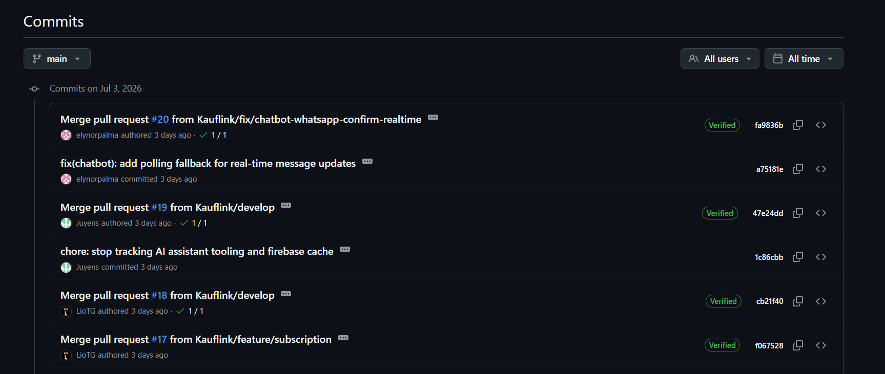

---

#### 5.2.2.5. Execution Evidence for Sprint Review

Al término del Sprint 2, el equipo implementó y desplegó el Frontend Web Application de Entreprenly en Angular. La aplicación se encuentra disponible públicamente en Firebase Hosting en la URL `https://daop.entreprenly.online`. Los Bounded Contexts implementados y sus funcionalidades clave son los siguientes:

- **DashboardLayout:** Sidebar naranja responsive con logo de Entreprenly, íconos de navegación por BC y botón de logout. Funciona como shell de la aplicación con rutas lazy-loading anidadas.

- **Sales BC (Punto de Venta):** Buscador de productos con autocompletado, modales de registro por cantidad (teclado numérico) y por peso (modo balanza IoT automático / modo manual), eliminación de ítems del ticket, selección de método de pago (Efectivo / Tarjeta-Yape-Plin), finalización de venta con modal "Venta Exitosa", y Resumen de Caja con persistencia en `db.json`.

- **Chatbot BC (Pedidos WhatsApp):** Vista de conexión de cuenta WhatsApp mediante QR escaneable con countdown de expiración, guard de sesión, lista de conversaciones activas con burbuja de escritura del cliente, gestión de órdenes con productos reales del inventario, y validación de pago con chips de rechazo.

- **Subscription BC:** Vista de planes disponibles (Plan Free y Plan Control) con precios sincronizados al selector de moneda del usuario.

- **Inventory BC:** Vista de productos y lotes con datos reales consumidos por el Sales BC (decremento de stock) y por el Home BC (alertas de lotes próximos a vencer).

- **Profile BC:** 8 tarjetas de configuración incluyendo selector de moneda (PEN/USD) y preferencias de idioma/tema que persisten en `localStorage`.

- **Home y Help:** Panel resumen del negocio con alertas reactivas al idioma activo, y centro de ayuda con artículos bilingües agrupados por categoría con conteos reales.

- **i18n:** Soporte bilingüe ES/EN en todos los BCs con traducción dinámica del título de la pestaña del navegador.


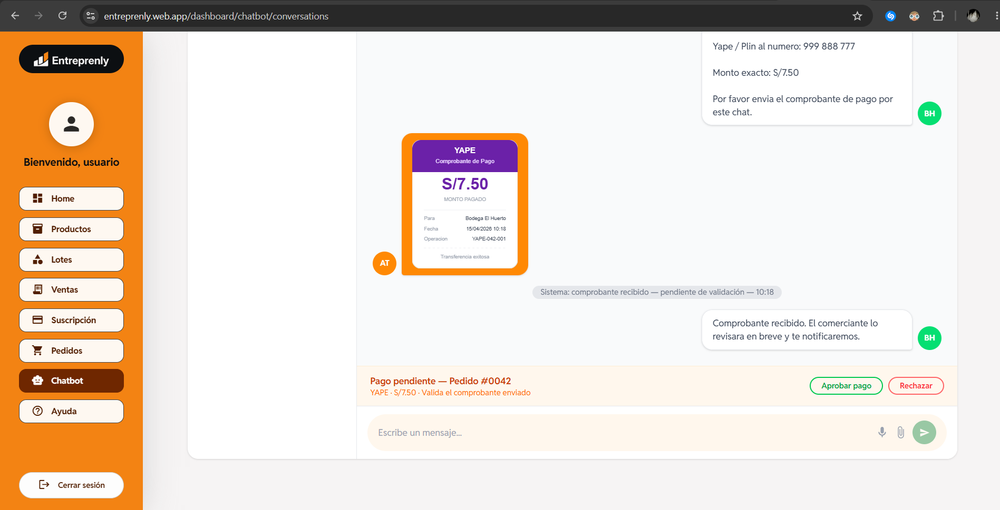


---

#### 5.2.2.6. Services Documentation Evidence for Sprint Review

Durante el Sprint 2, el Backend (RESTful Web Services con Spring Boot) aún no ha sido implementado. Por ello, la Frontend Web Application consume una API simulada mediante **JSON-Server**, que sirve el archivo `server/db.json` como una REST API completa. Esta API está disponible localmente en `http://localhost:3000/api/v1` y, adicionalmente, se desplegó una instancia remota en `http://db.entreprenly.online/api/v1` para que los datos también sean accesibles desde la aplicación publicada en Firebase. A continuación se documentan los endpoints utilizados durante este Sprint:

<table border="1" cellpadding="8" cellspacing="0" style="border-collapse: collapse; width: 100%;">
  <thead>
    <tr>
      <th>Endpoint</th>
      <th>Verbo HTTP</th>
      <th>Descripción</th>
      <th>Parámetros</th>
      <th>Response ejemplo</th>
    </tr>
  </thead>
  <tbody>

  <!-- Inventario: productos unitarios -->
  <tr>
    <td><code>/api/v1/inventory-unit-products</code></td>
    <td>GET</td>
    <td>Retorna la lista completa de productos vendidos por unidad.</td>
    <td>Ninguno</td>
    <td><code>[{ "id": 1, "name": "Coca Cola 500ml", "price": 2.50, "productType": "unit", "codeQR": "7501055363483", "weightGrams": 500, "brand": "Coca-Cola" }]</code></td>
  </tr>
  <tr>
    <td><code>/api/v1/inventory-unit-products/:id</code></td>
    <td>GET</td>
    <td>Retorna un producto unitario específico por su ID.</td>
    <td><code>id</code>: identificador numérico del producto (path param)</td>
    <td><code>{ "id": 1, "name": "Coca Cola 500ml", "price": 2.50, "productType": "unit", "codeQR": "7501055363483", "weightGrams": 500, "brand": "Coca-Cola" }</code></td>
  </tr>
  <tr>
    <td><code>/api/v1/inventory-unit-products/:id</code></td>
    <td>PATCH</td>
    <td>Actualiza parcialmente un producto unitario (precio, descripción, etc.).</td>
    <td><code>id</code>: path param. Body: campos a actualizar, ej. <code>{ "price": 3.00 }</code></td>
    <td><code>{ "id": 1, "name": "Coca Cola 500ml", "price": 3.00, "productType": "unit", ... }</code></td>
  </tr>

  <!-- Inventario: productos a granel -->
  <tr>
    <td><code>/api/v1/inventory-weight-products</code></td>
    <td>GET</td>
    <td>Retorna la lista completa de productos vendidos por kilogramo.</td>
    <td>Ninguno</td>
    <td><code>[{ "id": 1, "name": "White Rice", "pricePerKg": 1.80, "productType": "weight", "codeQR": "WP-RICE-001" }]</code></td>
  </tr>
  <tr>
    <td><code>/api/v1/inventory-weight-products/:id</code></td>
    <td>PATCH</td>
    <td>Actualiza parcialmente un producto a granel (precio por kg, descripción, etc.).</td>
    <td><code>id</code>: path param. Body: campos a actualizar, ej. <code>{ "pricePerKg": 2.00 }</code></td>
    <td><code>{ "id": 1, "name": "White Rice", "pricePerKg": 2.00, "productType": "weight", ... }</code></td>
  </tr>

  <!-- Inventario: lotes unitarios -->
  <tr>
    <td><code>/api/v1/inventory-unit-lots</code></td>
    <td>GET</td>
    <td>Retorna todos los lotes de productos unitarios con su cantidad y fecha de vencimiento.</td>
    <td>Ninguno</td>
    <td><code>[{ "id": 1, "productId": 1, "codeQR": "LOT-CC-001", "lotType": "unit", "quantity": 80, "expiryDate": "2026-03-15T00:00:00.000Z" }]</code></td>
  </tr>
  <tr>
    <td><code>/api/v1/inventory-unit-lots/:id</code></td>
    <td>PATCH</td>
    <td>Actualiza la cantidad de un lote unitario, usado para decrementar stock tras una venta.</td>
    <td><code>id</code>: path param. Body: <code>{ "quantity": &lt;nuevo valor&gt; }</code></td>
    <td><code>{ "id": 1, "productId": 1, "quantity": 77, "expiryDate": "2026-03-15T00:00:00.000Z" }</code></td>
  </tr>

  <!-- Inventario: lotes a granel -->
  <tr>
    <td><code>/api/v1/inventory-weight-lots</code></td>
    <td>GET</td>
    <td>Retorna todos los lotes de productos a granel con su cantidad en kg.</td>
    <td>Ninguno</td>
    <td><code>[{ "id": 1, "productId": 1, "codeQR": "WLOT-RICE-001", "lotType": "weight", "quantityKg": 120 }]</code></td>
  </tr>
  <tr>
    <td><code>/api/v1/inventory-weight-lots/:id</code></td>
    <td>PATCH</td>
    <td>Actualiza la cantidad en kg de un lote a granel tras una venta o ajuste de inventario.</td>
    <td><code>id</code>: path param. Body: <code>{ "quantityKg": &lt;nuevo valor&gt; }</code></td>
    <td><code>{ "id": 1, "productId": 1, "quantityKg": 118.5, "lotType": "weight" }</code></td>
  </tr>

  <!-- Alertas de stock -->
  <tr>
    <td><code>/api/v1/inventory-stock-alerts</code></td>
    <td>GET</td>
    <td>Retorna las alertas activas de inventario: productos vencidos, por vencer, con bajo stock o agotados.</td>
    <td>Ninguno</td>
    <td><code>[{ "id": 1, "lotId": 1, "productId": 1, "alertType": "expired", "severity": "critical", "message": "Coca Cola 500ml lot #1 expired on 15/3/2026.", "createdAt": "2026-03-16T08:00:00Z" }]</code></td>
  </tr>

  <!-- Ventas -->
  <tr>
    <td><code>/api/v1/sales</code></td>
    <td>GET</td>
    <td>Retorna el historial de ventas registradas en el Punto de Venta.</td>
    <td>Ninguno</td>
    <td><code>[{ "id": 1, "date": "2026-05-12", "total": 25.50, "paymentMethod": "cash", "items": [...] }]</code></td>
  </tr>
  <tr>
    <td><code>/api/v1/sales</code></td>
    <td>POST</td>
    <td>Registra una nueva venta al finalizar el ticket en el Punto de Venta.</td>
    <td>Body: <code>{ "date", "total", "paymentMethod", "items": [{ "productId", "quantity", "subtotal" }] }</code></td>
    <td><code>{ "id": 1, "date": "2026-05-12", "total": 5.00, "paymentMethod": "cash", "items": [...] }</code> (HTTP 201)</td>
  </tr>
  <tr>
    <td><code>/api/v1/cash-registers</code></td>
    <td>GET</td>
    <td>Retorna los registros de caja por fecha, con totales de efectivo, digital y conteo de ventas.</td>
    <td>Ninguno</td>
    <td><code>[{ "id": 1, "date": "2026-05-12", "totalCash": 5, "totalDigital": 0, "saleCount": 1 }]</code></td>
  </tr>
  <tr>
    <td><code>/api/v1/cash-registers/:id</code></td>
    <td>PUT</td>
    <td>Actualiza el registro de caja del día con los nuevos totales acumulados tras cada venta.</td>
    <td><code>id</code>: path param. Body: <code>{ "date", "totalCash", "totalDigital", "saleCount" }</code></td>
    <td><code>{ "id": 2, "date": "2026-05-12", "totalCash": 10, "totalDigital": 0, "saleCount": 2 }</code></td>
  </tr>

  <!-- Balanza IoT -->
  <tr>
    <td><code>/api/v1/iot-scale</code></td>
    <td>GET</td>
    <td>Retorna el estado actual de la balanza IoT (conectada o desconectada) y su identificador de dispositivo.</td>
    <td>Ninguno</td>
    <td><code>{ "id": 1, "connected": false, "deviceId": "SCALE-001" }</code></td>
  </tr>
  <tr>
    <td><code>/api/v1/iot-scale/1</code></td>
    <td>PATCH</td>
    <td>Actualiza el estado de conexión de la balanza IoT.</td>
    <td>Body: <code>{ "connected": true }</code></td>
    <td><code>{ "id": 1, "connected": true, "deviceId": "SCALE-001" }</code></td>
  </tr>

  <!-- Chatbot WhatsApp -->
  <tr>
    <td><code>/api/v1/whatsapp-sessions</code></td>
    <td>GET</td>
    <td>Retorna las sesiones de WhatsApp vinculadas al vendedor.</td>
    <td>Ninguno</td>
    <td><code>[{ "id": 1, "sellerId": 1, "phone": "+51 999 888 777", "businessName": "Bodega El Huerto", "status": "connected", "connectedAt": "11/5/2026..." }]</code></td>
  </tr>
  <tr>
    <td><code>/api/v1/conversations</code></td>
    <td>GET</td>
    <td>Retorna las conversaciones de WhatsApp con su estado: ACTIVE, WAITING_PAYMENT, COMPLETED o CLOSED.</td>
    <td>Ninguno</td>
    <td><code>[{ "id": 1, "sellerId": 1, "clientPhone": "+51 987 654 321", "clientName": "Andrea Torres", "status": "WAITING_PAYMENT", "lastMessage": "Comprobante enviado" }]</code></td>
  </tr>
  <tr>
    <td><code>/api/v1/conversations/:id</code></td>
    <td>PATCH</td>
    <td>Actualiza el estado de una conversación (ej: marcar como COMPLETED tras aprobar el pago).</td>
    <td><code>id</code>: path param. Body: <code>{ "status": "COMPLETED" }</code></td>
    <td><code>{ "id": 1, "clientName": "Andrea Torres", "status": "COMPLETED", ... }</code></td>
  </tr>
  <tr>
    <td><code>/api/v1/chat-messages</code></td>
    <td>GET</td>
    <td>Retorna los mensajes de una conversación (remitente: bot, client o system).</td>
    <td>Query param: <code>?conversationId=1</code></td>
    <td><code>[{ "id": 1, "conversationId": 1, "sender": "bot", "type": "text", "content": "Hola Andrea...", "sentAt": "2026-04-15T10:00:00.000Z" }]</code></td>
  </tr>
  <tr>
    <td><code>/api/v1/chat-orders</code></td>
    <td>GET</td>
    <td>Retorna los pedidos generados por WhatsApp con sus items, dirección de entrega y estado de pago.</td>
    <td>Ninguno</td>
    <td><code>[{ "id": 1, "conversationId": 1, "orderNumber": "#0042", "total": 7.50, "status": "WAITING_PAYMENT", "paymentMethod": "YAPE", "deliveryAddress": "Av. Los Alamos 234, Miraflores" }]</code></td>
  </tr>
  <tr>
    <td><code>/api/v1/chat-orders/:id</code></td>
    <td>PATCH</td>
    <td>Actualiza el estado de un pedido de WhatsApp (ej: CONFIRMED, BLOCKED, CANCELLED).</td>
    <td><code>id</code>: path param. Body: <code>{ "status": "CONFIRMED" }</code></td>
    <td><code>{ "id": 3, "orderNumber": "#0044", "status": "CONFIRMED", "total": 7.60, ... }</code></td>
  </tr>

  <!-- Perfil y suscripción -->
  <tr>
    <td><code>/api/v1/profile</code></td>
    <td>GET</td>
    <td>Retorna los datos del usuario, preferencias (idioma, tema, moneda) y configuración de notificaciones.</td>
    <td>Ninguno</td>
    <td><code>{ "user": { "id": 1, "role": "Administrador", "plan": "Plan Control" }, "preferences": { "language": "en", "theme": "light" }, "notification_settings": { "stock_alerts": true } }</code></td>
  </tr>
  <tr>
    <td><code>/api/v1/subscription-dashboard</code></td>
    <td>GET</td>
    <td>Retorna el plan actual, plan recomendado, límites de uso y configuración de facturación y métodos de pago.</td>
    <td>Ninguno</td>
    <td><code>[{ "id": 1, "currentPlan": { "name": "Plan Control", "status": "active", "monthlyPrice": 89 }, "limits": [...], "billingSetup": { "hasPaymentMethod": true, ... } }]</code></td>
  </tr>
  </tbody>
</table>


**URL del repositorio del Frontend Web Application:** https://github.com/Kauflink/daop-entreprenly-frontend

La documentación formal de los endpoints con OpenAPI/Swagger se incorporará a partir del Sprint 3, cuando se implemente el Backend con Spring Boot, conforme a lo planificado en el Product Backlog.

---

#### 5.2.2.7. Software Deployment Evidence for Sprint Review

Durante el Sprint 2, el equipo configuró y ejecutó el proceso de despliegue del Frontend Web Application mediante Firebase Hosting y un pipeline de integración continua con GitHub Actions. A continuación se describe el proceso realizado:

1. **Creación del repositorio del Frontend:** Se creó el repositorio público `daop-entreprenly-frontend` bajo la organización `Kauflink` en GitHub, aplicando GitFlow con ramas `main`, `develop` y ramas `feature/` por Bounded Context.


2. **Configuración de Firebase Hosting:** Se creó un proyecto en Firebase Console, se inicializó Firebase Hosting en el repositorio del frontend con `firebase init hosting`, configurando `dist/entreprenly/browser` como directorio público y habilitando la reescritura de rutas al `index.html` para el SPA routing de Angular.

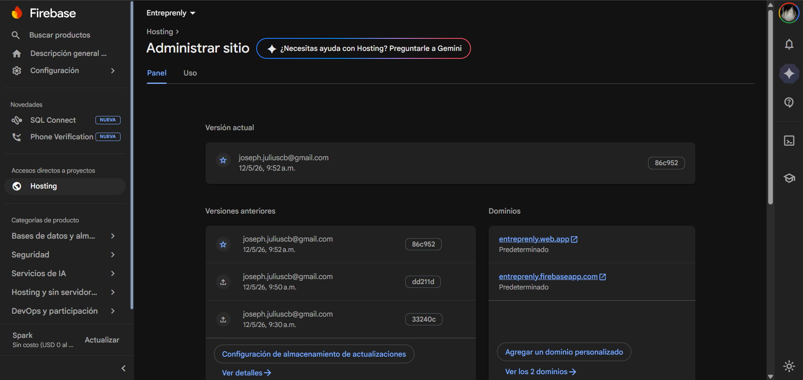

3. **Verificación del despliegue:** Se validó que la aplicación Angular se encuentra correctamente desplegada y accesible en `https://daop.entreprenly.online`, con navegación entre BCs funcional sin errores 404 al refrescar el navegador.


---

#### 5.2.2.8. Team Collaboration Insights during Sprint

Durante el Sprint 2, los cinco miembros del equipo participaron activamente en la implementación del Frontend Web Application, evidenciado a través de los commits y Pull Requests registrados en el repositorio `daop-entreprenly-frontend`. El trabajo se distribuyó por Bounded Context: Joseph Julius lideró la infraestructura base, el DashboardLayout, el Profile BC y la configuración del i18n y el sistema de temas; Elynor Mikela lideró el Chatbot BC y las vistas de Home y Help; José Fernando lideró el Sales BC; Lionel Abraham lideró el Subscription BC con soporte en el Inventory BC; y José Antonio contribuyó con las traducciones del Subscription BC.

El equipo aplicó GitFlow como estrategia de control de versiones, trabajando en ramas `feature/` por Bounded Context (e.g., `feature/sales`, `feature/chatbot`, `feature/profile-configuration`, `feature/subscription`, `feature/inventory`) y realizando la integración a `develop` y `main` mediante Pull Requests. Se realizaron un total de **53 Pull Requests** durante el Sprint. La distribución de commits por miembro del equipo fue la siguiente: Camargo Briceño (87 commits), Palma De Los Santos (58 commits), Flores Pinchi (51 commits), Chavez Carrasco (49 commits) y Peirano Brun (5 commits).

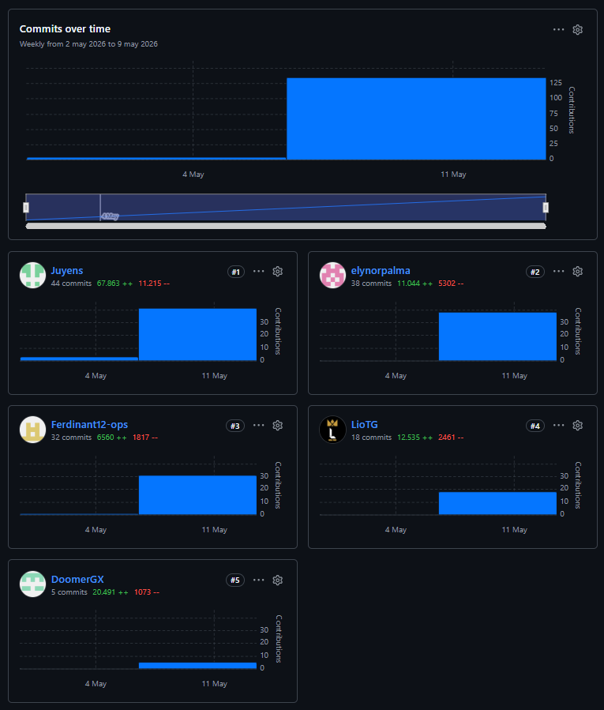


**URL del repositorio del Frontend Web Application:** https://github.com/Kauflink/daop-entreprenly-frontend

### 5.2.3. Sprint 3

#### 5.2.3.1. Sprint Planning 3

Para este tercer Sprint, el equipo estableció como objetivo principal la implementación y despliegue de la primera versión de los RESTful Web Services (Backend) de Entreprenly con Spring Boot, reemplazando la Fake RESTful API utilizada en el Sprint 2 por un Backend real con autenticación, persistencia y reglas de negocio del lado del servidor. La reunión de planificación se llevó a cabo de manera virtual, donde se definieron las User Stories y Technical Stories a abordar, el Sprint Goal y la distribución de responsabilidades por Bounded Context.

<table border="1" cellpadding="8" cellspacing="0" style="border-collapse: collapse; width: 100%;">
  <tbody>
    <tr><td colspan="2"><strong>Sprint 3</strong></td></tr>
    <tr><td colspan="2"><strong>Sprint Planning Background</strong></td></tr>
    <tr><td><strong>Date</strong></td><td>2026-06-02</td></tr>
    <tr><td><strong>Time</strong></td><td>09:00 AM</td></tr>
    <tr><td><strong>Location</strong></td><td>Reunión virtual vía Discord</td></tr>
    <tr><td><strong>Prepared By</strong></td><td>Camargo Briceño, Joseph Julius</td></tr>
    <tr><td><strong>Attendees (to planning meeting)</strong></td><td>Camargo Briceño, Joseph Julius / Chavez Carrasco, Lionel Abraham / Palma De Los Santos, Elynor Mikela / Peirano Brun, José Antonio / Flores Pinchi, José Fernando</td></tr>
    <tr><td><strong>Sprint 2 Review Summary</strong></td><td>En el Sprint 2 se implementó y desplegó el Frontend Web Application en Angular sobre Firebase Hosting (https://daop.entreprenly.online), cubriendo los Bounded Contexts de Sales, Chatbot, Inventory, Subscription y Profile, junto con las vistas de Home y Help. La aplicación consumió una Fake RESTful API servida con JSON-Server.</td></tr>
    <tr><td><strong>Sprint 2 Retrospective Summary</strong></td><td>El equipo identificó que la Fake API con JSON-Server no provee persistencia real, autenticación ni reglas de negocio del lado del servidor. Para el Sprint 3 se acordó implementar el Backend real con Spring Boot bajo arquitectura DDD, asignando un Bounded Context por miembro, incorporar autenticación con JWT y persistencia con JPA por contexto, y automatizar el despliegue en Google Cloud con Docker y CI/CD.</td></tr>
    <tr><td colspan="2"><strong>Sprint Goal &amp; User Stories</strong></td></tr>
    <tr><td><strong>Sprint 3 Goal</strong></td><td>Nuestro enfoque está en implementar y desplegar la primera versión de los RESTful Web Services de Entreprenly con Spring Boot, reemplazando la Fake API por un Backend real con autenticación JWT, persistencia JPA por bounded context y documentación OpenAPI. Creemos que entrega una plataforma multi-tenant en la que cada comerciante gestiona de forma segura su inventario, ventas, suscripción y pedidos de WhatsApp con datos persistentes. Esto se confirmará cuando la API esté desplegada en Google Cloud, protegida con JWT, documentada en Swagger UI y respondiendo sobre HTTPS en su dominio público.</td></tr>
    <tr><td><strong>Sprint 3 Velocity</strong></td><td>62</td></tr>
    <tr><td><strong>Sum of Story Points</strong></td><td>62</td></tr>
  </tbody>
</table>

---

#### 5.2.3.2. Aspect Leaders and Collaborators

En el Sprint 3, el equipo organizó el trabajo asignando un Bounded Context del Backend por miembro para maximizar la autonomía y reducir conflictos de merge. Los aspectos cubiertos fueron: el IAM Bounded Context junto con la seguridad JWT y la configuración del despliegue en Google Cloud, el Profile BC, el Sales BC, el Inventory BC, el Chatbot BC y el Subscription BC. A continuación se presenta la matriz de liderazgo y colaboración (LACX):

<table border="1" cellpadding="8" cellspacing="0" style="border-collapse: collapse; width: 100%;">
  <thead>
    <tr>
      <th>Team Member (Last Name, First Name)</th>
      <th>GitHub Username</th>
      <th>IAM/Auth y Despliegue<br>Leader (L) / Collaborator (C)</th>
      <th>Profile BC<br>Leader (L) / Collaborator (C)</th>
      <th>Sales BC<br>Leader (L) / Collaborator (C)</th>
      <th>Inventory BC<br>Leader (L) / Collaborator (C)</th>
      <th>Chatbot BC<br>Leader (L) / Collaborator (C)</th>
      <th>Subscription BC<br>Leader (L) / Collaborator (C)</th>
    </tr>
  </thead>
  <tbody>
    <tr><td>Camargo Briceño, Joseph Julius</td><td>Juyens</td><td>L</td><td>L</td><td>C</td><td>C</td><td>C</td><td>C</td></tr>
    <tr><td>Chavez Carrasco, Lionel Abraham</td><td>LioTG</td><td>C</td><td>C</td><td>C</td><td>C</td><td>C</td><td>L</td></tr>
    <tr><td>Palma De Los Santos, Elynor Mikela</td><td>elynorpalma</td><td>C</td><td>C</td><td>C</td><td>C</td><td>L</td><td>C</td></tr>
    <tr><td>Peirano Brun, José Antonio</td><td>DoomerGX</td><td>C</td><td>C</td><td>C</td><td>L</td><td>C</td><td>C</td></tr>
    <tr><td>Flores Pinchi, José Fernando</td><td>Ferdinant12-ops</td><td>C</td><td>C</td><td>L</td><td>C</td><td>C</td><td>C</td></tr>
  </tbody>
</table>

---

#### 5.2.3.3. Sprint Backlog 3

El objetivo principal de este Sprint fue implementar los RESTful Web Services de Entreprenly y **conectar el Frontend Web Application al backend real**, reemplazando la Fake RESTful API (JSON-Server) utilizada en el Sprint 2. El alcance abarcó los flujos de pedido del chatbot, comprendidos en las User Stories US-41 a US-52, junto con las Technical Stories del EPIC-13. Estas últimas cubren la API de pedidos y pagos en las historias US-54 y US-55, la autenticación con JWT en la US-91, la containerización y el pipeline de CI/CD en la US-92, y la persistencia JPA por bounded context en la US-93. Adicionalmente, se incorporaron las User Stories de **frontend integradas con el backend real**: el registro, inicio y cierre de sesión con autenticación JWT (US-56, US-58 y US-61) y la validación de comprobantes de pago del chatbot desde el dashboard (US-46). Cada historia se descompuso en Engineering Tasks con una estimación individual de entre 4 y 8 horas, gestionadas en el tablero Kanban del Sprint a través de las columnas **To Do, In Process, To Review y Done**.

**Board público del Sprint 3 (Trello):** https://trello.com/b/kcHoLNFO/entreprenly-sprint-3

A continuación se presenta el tablero del Sprint y el detalle de los Work-items asociados.

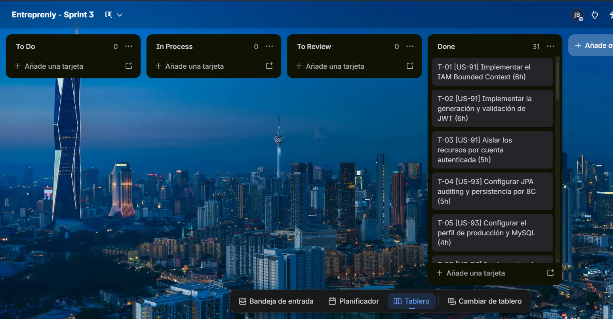

<table border="1" cellpadding="8" cellspacing="0" style="border-collapse: collapse; width: 100%;">
  <thead>
    <tr>
      <th colspan="8">Sprint # Sprint 3</th>
    </tr>
    <tr>
      <th colspan="2">User Story</th>
      <th colspan="6">Work-Item / Task</th>
    </tr>
    <tr>
      <th>Id</th>
      <th>Title</th>
      <th>Id</th>
      <th>Title</th>
      <th>Description</th>
      <th>Estimation (Hours)</th>
      <th>Assigned To</th>
      <th>Status</th>
    </tr>
  </thead>
  <tbody>
    <tr>
      <td>US-91</td>
      <td>Autenticar y autorizar usuarios mediante JWT</td>
      <td>T-01</td>
      <td>Implementar el IAM Bounded Context</td>
      <td>Crear el IAM BC con autenticación por email, hash de contraseña con BCrypt y asignación automática del rol por defecto al registrarse.</td>
      <td>6</td>
      <td>Camargo Briceño, Joseph Julius</td>
      <td>Done</td>
    </tr>
    <tr>
      <td>US-91</td>
      <td>Autenticar y autorizar usuarios mediante JWT</td>
      <td>T-02</td>
      <td>Implementar la generación y validación de JWT</td>
      <td>Desarrollar la emisión de tokens JWT en el sign-in y el filtro de seguridad que valida el token en cada solicitud protegida.</td>
      <td>6</td>
      <td>Camargo Briceño, Joseph Julius</td>
      <td>Done</td>
    </tr>
    <tr>
      <td>US-91</td>
      <td>Autenticar y autorizar usuarios mediante JWT</td>
      <td>T-03</td>
      <td>Aislar los recursos por cuenta autenticada</td>
      <td>Restringir el acceso a los recursos del comerciante según el usuario autenticado extraído del token (scoping por cuenta).</td>
      <td>5</td>
      <td>Camargo Briceño, Joseph Julius</td>
      <td>Done</td>
    </tr>
    <tr>
      <td>US-93</td>
      <td>Persistir datos mediante JPA por bounded context</td>
      <td>T-04</td>
      <td>Configurar JPA auditing y persistencia por BC</td>
      <td>Habilitar JPA auditing para las entidades auditables y configurar la persistencia respetando los límites de cada bounded context.</td>
      <td>5</td>
      <td>Camargo Briceño, Joseph Julius</td>
      <td>Done</td>
    </tr>
    <tr>
      <td>US-93</td>
      <td>Persistir datos mediante JPA por bounded context</td>
      <td>T-05</td>
      <td>Configurar el perfil de producción y MySQL</td>
      <td>Configurar el perfil <code>prod</code>, la conexión a MySQL y <code>ddl-auto=update</code> para la auto-creación de tablas de nuevos contextos.</td>
      <td>4</td>
      <td>Camargo Briceño, Joseph Julius</td>
      <td>Done</td>
    </tr>
    <tr>
      <td>US-93</td>
      <td>Persistir datos mediante JPA por bounded context</td>
      <td>T-06</td>
      <td>Implementar el Profile BC con persistencia</td>
      <td>Implementar el dominio, los servicios y la REST API del Profile BC, con auto-creación del perfil al registrarse el usuario.</td>
      <td>6</td>
      <td>Camargo Briceño, Joseph Julius</td>
      <td>Done</td>
    </tr>
    <tr>
      <td>US-93</td>
      <td>Persistir datos mediante JPA por bounded context</td>
      <td>T-07</td>
      <td>Persistir datos de registro y avatar</td>
      <td>Capturar el teléfono y los datos de registro en el sign-up y almacenar el avatar como <code>MEDIUMTEXT</code> para soportar imágenes base64.</td>
      <td>5</td>
      <td>Camargo Briceño, Joseph Julius</td>
      <td>Done</td>
    </tr>
    <tr>
      <td>US-93</td>
      <td>Persistir datos mediante JPA por bounded context</td>
      <td>T-08</td>
      <td>Implementar el Sales BC con persistencia JPA</td>
      <td>Implementar el dominio de venta y caja, los servicios de aplicación y la persistencia JPA del Sales BC.</td>
      <td>6</td>
      <td>Flores Pinchi, José Fernando</td>
      <td>Done</td>
    </tr>
    <tr>
      <td>US-93</td>
      <td>Persistir datos mediante JPA por bounded context</td>
      <td>T-09</td>
      <td>Exponer la REST API de ventas y caja</td>
      <td>Exponer los endpoints de <code>sales</code> y <code>cash-registers</code> con aislamiento de datos por cuenta autenticada.</td>
      <td>6</td>
      <td>Flores Pinchi, José Fernando</td>
      <td>Done</td>
    </tr>
    <tr>
      <td>US-93</td>
      <td>Persistir datos mediante JPA por bounded context</td>
      <td>T-10</td>
      <td>Implementar el Inventory BC: productos</td>
      <td>Implementar los agregados de producto unitario y a granel con su CRUD REST completo.</td>
      <td>6</td>
      <td>Peirano Brun, José Antonio</td>
      <td>Done</td>
    </tr>
    <tr>
      <td>US-93</td>
      <td>Persistir datos mediante JPA por bounded context</td>
      <td>T-11</td>
      <td>Implementar el Inventory BC: lotes</td>
      <td>Implementar los agregados de lote unitario y a granel con CRUD REST y el endpoint combinado de lotes.</td>
      <td>6</td>
      <td>Peirano Brun, José Antonio</td>
      <td>Done</td>
    </tr>
    <tr>
      <td>US-93</td>
      <td>Persistir datos mediante JPA por bounded context</td>
      <td>T-12</td>
      <td>Implementar las alertas de stock y el scoping</td>
      <td>Implementar la read API computada de stock alerts, el borrado en cascada de lotes y el aislamiento por cuenta autenticada.</td>
      <td>5</td>
      <td>Peirano Brun, José Antonio</td>
      <td>Done</td>
    </tr>
    <tr>
      <td>US-93</td>
      <td>Persistir datos mediante JPA por bounded context</td>
      <td>T-13</td>
      <td>Implementar el Subscription BC con pagos</td>
      <td>Implementar el Subscription BC con planes, suscripciones, pagos, periodos de facturación y precios anuales.</td>
      <td>6</td>
      <td>Chavez Carrasco, Lionel Abraham</td>
      <td>Done</td>
    </tr>
    <tr>
      <td>US-93</td>
      <td>Persistir datos mediante JPA por bounded context</td>
      <td>T-14</td>
      <td>Implementar el dashboard de suscripción</td>
      <td>Exponer los endpoints del subscription-dashboard con límites específicos por plan y seguimiento del propietario.</td>
      <td>5</td>
      <td>Chavez Carrasco, Lionel Abraham</td>
      <td>Done</td>
    </tr>
    <tr>
      <td>US-41</td>
      <td>Responder consulta de producto disponible</td>
      <td>T-15</td>
      <td>Implementar el reply composer product-aware</td>
      <td>Desarrollar el componedor de respuestas del chatbot que responde con datos reales del catálogo del comerciante.</td>
      <td>6</td>
      <td>Palma De Los Santos, Elynor Mikela</td>
      <td>Done</td>
    </tr>
    <tr>
      <td>US-42</td>
      <td>Sugerir alternativas ante producto no disponible</td>
      <td>T-16</td>
      <td>Implementar respuestas para producto no disponible</td>
      <td>Implementar respuestas inteligentes cuando un producto no se encuentra o está agotado, sugiriendo alternativas.</td>
      <td>5</td>
      <td>Palma De Los Santos, Elynor Mikela</td>
      <td>Done</td>
    </tr>
    <tr>
      <td>US-43</td>
      <td>Confirmar pedido con el cliente</td>
      <td>T-17</td>
      <td>Implementar el flujo de pedido y confirmación</td>
      <td>Implementar el flujo completo: registro de un pedido en borrador, resumen al cliente y confirmación de entrega.</td>
      <td>6</td>
      <td>Palma De Los Santos, Elynor Mikela</td>
      <td>Done</td>
    </tr>
    <tr>
      <td>US-45</td>
      <td>Reportar comprobante de pago digital</td>
      <td>T-18</td>
      <td>Recibir el comprobante de pago</td>
      <td>Aceptar imágenes de comprobante de pago enviadas por el cliente y adjuntarlas al pedido correspondiente.</td>
      <td>5</td>
      <td>Palma De Los Santos, Elynor Mikela</td>
      <td>Done</td>
    </tr>
    <tr>
      <td>US-46</td>
      <td>Validar comprobante de pago desde el dashboard</td>
      <td>T-19</td>
      <td>Implementar la validación y notificación de pago</td>
      <td>Implementar la aprobación o rechazo del comprobante desde el dashboard y la notificación de la decisión al cliente por el bridge.</td>
      <td>6</td>
      <td>Palma De Los Santos, Elynor Mikela</td>
      <td>Done</td>
    </tr>
    <tr>
      <td>US-48</td>
      <td>Confirmar pedido y descontar stock</td>
      <td>T-20</td>
      <td>Implementar los adaptadores ACL hacia Inventory e IAM</td>
      <td>Implementar los adaptadores anti-corrupción hacia Inventory e IAM para resolver el catálogo y descontar el stock al confirmar el pedido.</td>
      <td>5</td>
      <td>Palma De Los Santos, Elynor Mikela</td>
      <td>Done</td>
    </tr>
    <tr>
      <td>US-49</td>
      <td>Registrar venta en el sistema</td>
      <td>T-21</td>
      <td>Registrar el pedido confirmado como venta</td>
      <td>Registrar cada pedido confirmado como una venta en el sistema para mantener el control financiero trazable.</td>
      <td>4</td>
      <td>Palma De Los Santos, Elynor Mikela</td>
      <td>Done</td>
    </tr>
    <tr>
      <td>US-50</td>
      <td>Manejar stock insuficiente en pedido</td>
      <td>T-22</td>
      <td>Manejar el stock insuficiente en el pedido</td>
      <td>Notificar al cliente cuando un producto no tiene stock suficiente para que ajuste su pedido antes del pago.</td>
      <td>4</td>
      <td>Palma De Los Santos, Elynor Mikela</td>
      <td>Done</td>
    </tr>
    <tr>
      <td>US-51</td>
      <td>Cancelar pedido por expiración de tiempo de pago</td>
      <td>T-23</td>
      <td>Cancelar pedidos por expiración del pago</td>
      <td>Cancelar automáticamente el pedido cuando el cliente no reporta el comprobante en el tiempo establecido, liberando el stock.</td>
      <td>4</td>
      <td>Palma De Los Santos, Elynor Mikela</td>
      <td>Done</td>
    </tr>
    <tr>
      <td>US-54</td>
      <td>Gestionar ciclo de vida de pedidos mediante API</td>
      <td>T-24</td>
      <td>Exponer la API de conversaciones y pedidos</td>
      <td>Exponer los endpoints REST de <code>conversations</code>, <code>chat-messages</code> y <code>chat-orders</code> para el ciclo de vida del pedido.</td>
      <td>6</td>
      <td>Palma De Los Santos, Elynor Mikela</td>
      <td>Done</td>
    </tr>
    <tr>
      <td>US-54</td>
      <td>Gestionar ciclo de vida de pedidos mediante API</td>
      <td>T-25</td>
      <td>Implementar el WhatsApp bridge multi-tenant</td>
      <td>Implementar los endpoints del bridge de WhatsApp con estado multi-tenant: QR y estado de conexión keyed por el email del vendedor.</td>
      <td>6</td>
      <td>Palma De Los Santos, Elynor Mikela</td>
      <td>Done</td>
    </tr>
    <tr>
      <td>US-55</td>
      <td>Validar y registrar pagos mediante API</td>
      <td>T-26</td>
      <td>Exponer la API de validación de pagos</td>
      <td>Exponer el endpoint que aprueba o rechaza el pago, actualiza el estado de la orden y dispara la actualización de inventario.</td>
      <td>5</td>
      <td>Palma De Los Santos, Elynor Mikela</td>
      <td>Done</td>
    </tr>
    <tr>
      <td>US-92</td>
      <td>Containerizar y desplegar la API mediante Docker y CI/CD</td>
      <td>T-27</td>
      <td>Crear el Dockerfile multi-stage</td>
      <td>Crear el Dockerfile multi-stage que compila con Maven y ejecuta sobre un JRE Temurin 26 con el perfil <code>prod</code> activo.</td>
      <td>5</td>
      <td>Camargo Briceño, Joseph Julius</td>
      <td>Done</td>
    </tr>
    <tr>
      <td>US-92</td>
      <td>Containerizar y desplegar la API mediante Docker y CI/CD</td>
      <td>T-28</td>
      <td>Configurar el build de la imagen con Cloud Build</td>
      <td>Desplegar desde el código fuente en Google Cloud Run: Cloud Build compila la imagen a partir del <code>Dockerfile</code> y la publica en Artifact Registry.</td>
      <td>6</td>
      <td>Camargo Briceño, Joseph Julius</td>
      <td>Done</td>
    </tr>
    <tr>
      <td>US-92</td>
      <td>Containerizar y desplegar la API mediante Docker y CI/CD</td>
      <td>T-29</td>
      <td>Configurar el servicio de Cloud Run y el dominio</td>
      <td>Configurar el servicio en Google Cloud Run (puerto 8080, conexión a Cloud SQL PostgreSQL y variables del perfil <code>prod</code>) y mapear el dominio <code>daop-api.entreprenly.online</code> con certificado TLS gestionado por Google.</td>
      <td>5</td>
      <td>Camargo Briceño, Joseph Julius</td>
      <td>Done</td>
    </tr>
    <tr>
      <td>US-54</td>
      <td>Gestionar ciclo de vida de pedidos mediante API</td>
      <td>T-30</td>
      <td>Documentar los endpoints con OpenAPI/Swagger</td>
      <td>Anotar los controladores con OpenAPI/Swagger (operaciones, esquemas y respuestas) y exponer la documentación en Swagger UI.</td>
      <td>5</td>
      <td>Palma De Los Santos, Elynor Mikela / Camargo Briceño, Joseph Julius</td>
      <td>Done</td>
    </tr>
    <tr>
      <td>US-93</td>
      <td>Persistir datos mediante JPA por bounded context</td>
      <td>T-31</td>
      <td>Implementar el manejo global de rutas no mapeadas</td>
      <td>Implementar el manejo global que retorna 404 con cuerpo JSON consistente para las rutas no mapeadas del API.</td>
      <td>4</td>
      <td>Camargo Briceño, Joseph Julius</td>
      <td>Done</td>
    </tr>
    <tr>
      <td>US-56</td>
      <td>Registrar cuenta con email</td>
      <td>T-32</td>
      <td>Integrar el registro del frontend con el IAM real</td>
      <td>Conectar el formulario de registro de Angular al endpoint real <code>POST /authentication/sign-up</code>, reemplazando la Fake API por el IAM del backend.</td>
      <td>4</td>
      <td>Camargo Briceño, Joseph Julius</td>
      <td>Done</td>
    </tr>
    <tr>
      <td>US-58</td>
      <td>Iniciar sesión con credenciales</td>
      <td>T-33</td>
      <td>Integrar el login del frontend con JWT real</td>
      <td>Conectar el login de Angular al endpoint <code>POST /authentication/sign-in</code>, almacenar el token JWT y adjuntarlo automáticamente en el interceptor HTTP de las solicitudes protegidas.</td>
      <td>5</td>
      <td>Camargo Briceño, Joseph Julius</td>
      <td>Done</td>
    </tr>
    <tr>
      <td>US-61</td>
      <td>Cerrar sesión</td>
      <td>T-34</td>
      <td>Implementar el cierre de sesión en el frontend</td>
      <td>Limpiar el token JWT del almacenamiento local, restablecer el estado de autenticación y redirigir al usuario a la pantalla de login.</td>
      <td>4</td>
      <td>Camargo Briceño, Joseph Julius</td>
      <td>Done</td>
    </tr>
    <tr>
      <td>US-46</td>
      <td>Validar comprobante de pago desde el dashboard</td>
      <td>T-35</td>
      <td>Implementar la UI de validación de pago en el dashboard</td>
      <td>Construir la vista de pedidos con las acciones de aprobar y rechazar el comprobante, consumiendo el endpoint real de validación de pagos y mostrando el resultado al comerciante.</td>
      <td>5</td>
      <td>Palma De Los Santos, Elynor Mikela</td>
      <td>Done</td>
    </tr>
  </tbody>
</table>

---

#### 5.2.3.4. Development Evidence for Sprint Review

Durante el Sprint 3, el equipo trabajó sobre el repositorio de los Web Services (`daop-entreprenly-web-services`). Se realizaron 53 commits (sin contar merges) y 24 Pull Requests entre el 2 y el 10 de junio de 2026, cubriendo desde el scaffolding del proyecto Spring Boot con arquitectura DDD hasta la integración multi-tenant del Chatbot y el despliegue en Google Cloud. A continuación se presenta el registro de los commits más representativos:

<table border="1" cellpadding="8" cellspacing="0" style="border-collapse: collapse; width: 100%;">
  <thead>
    <tr>
      <th>Repository</th>
      <th>Branch</th>
      <th>Commit Id</th>
      <th>Commit Message</th>
      <th>Commit Message Body</th>
      <th>Committed on (Date)</th>
    </tr>
  </thead>
  <tbody>
    <tr>
      <td>Kauflink/daop-entreprenly-web-services</td>
      <td>develop</td>
      <td>0003df0</td>
      <td>chore: scaffold Spring Boot backend with DDD structure</td>
      <td>Se inicializa el backend con Spring Boot y la estructura base por bounded context (DDD de 4 capas).</td>
      <td>2026-06-02</td>
    </tr>
    <tr>
      <td>Kauflink/daop-entreprenly-web-services</td>
      <td>develop</td>
      <td>d930b5b</td>
      <td>refactor: remove learning-center example code and rebrand to Entreprenly</td>
      <td>Se elimina el código de ejemplo del learning-center y se reorganiza el proyecto bajo el dominio de Entreprenly.</td>
      <td>2026-06-02</td>
    </tr>
    <tr>
      <td>Kauflink/daop-entreprenly-web-services</td>
      <td>develop</td>
      <td>fe9ca28</td>
      <td>fix(shared): enable JPA auditing for auditable entities</td>
      <td>Se habilita JPA auditing para registrar las fechas de creación y modificación de las entidades.</td>
      <td>2026-06-02</td>
    </tr>
    <tr>
      <td>Kauflink/daop-entreprenly-web-services</td>
      <td>feature/iam</td>
      <td>e24fe10</td>
      <td>feat(iam): authenticate by email and auto-assign default role</td>
      <td>Se implementa la autenticación por email y la asignación automática del rol por defecto al registrarse.</td>
      <td>2026-06-02</td>
    </tr>
    <tr>
      <td>Kauflink/daop-entreprenly-web-services</td>
      <td>feature/profile</td>
      <td>6abac8d</td>
      <td>feat(profile): expose REST API for profiles</td>
      <td>Se expone la REST API del Profile BC sobre el dominio y la persistencia JPA implementados.</td>
      <td>2026-06-02</td>
    </tr>
    <tr>
      <td>Kauflink/daop-entreprenly-web-services</td>
      <td>feature/profile</td>
      <td>bf84864</td>
      <td>feat(profile): auto-create profile on user sign-up</td>
      <td>Se crea automáticamente el perfil del comerciante al completarse el registro del usuario.</td>
      <td>2026-06-02</td>
    </tr>
    <tr>
      <td>Kauflink/daop-entreprenly-web-services</td>
      <td>main</td>
      <td>97549c5</td>
      <td>ci: add deploy workflow for Compute Engine</td>
      <td>Se agrega el workflow de GitHub Actions para construir la imagen y desplegarla en Compute Engine.</td>
      <td>2026-06-02</td>
    </tr>
    <tr>
      <td>Kauflink/daop-entreprenly-web-services</td>
      <td>fix/unmapped-404</td>
      <td>6241db0</td>
      <td>fix(shared): return 404 for unmapped routes</td>
      <td>Se implementa el manejo global que retorna 404 con cuerpo JSON para las rutas no mapeadas.</td>
      <td>2026-06-03</td>
    </tr>
    <tr>
      <td>Kauflink/daop-entreprenly-web-services</td>
      <td>feature/profile-registration-fields</td>
      <td>ea7d4e5</td>
      <td>feat(profile): capture phone and registration details on sign-up</td>
      <td>Se capturan el teléfono y los datos de registro al momento del sign-up.</td>
      <td>2026-06-03</td>
    </tr>
    <tr>
      <td>Kauflink/daop-entreprenly-web-services</td>
      <td>feature/profile-avatar</td>
      <td>c4e138e</td>
      <td>feat(profile): store avatar as MEDIUMTEXT to allow base64 images</td>
      <td>Se almacena el avatar como MEDIUMTEXT para soportar imágenes en base64.</td>
      <td>2026-06-03</td>
    </tr>
    <tr>
      <td>Kauflink/daop-entreprenly-web-services</td>
      <td>feature/sales</td>
      <td>d5dbdc7</td>
      <td>feat(sales): add sale and cash register domain model</td>
      <td>Se modela el dominio de venta y caja del Sales BC.</td>
      <td>2026-06-03</td>
    </tr>
    <tr>
      <td>Kauflink/daop-entreprenly-web-services</td>
      <td>feature/sales</td>
      <td>4d5e59d</td>
      <td>feat(sales): expose sales and cash registers REST API</td>
      <td>Se exponen los endpoints REST de ventas y registros de caja.</td>
      <td>2026-06-03</td>
    </tr>
    <tr>
      <td>Kauflink/daop-entreprenly-web-services</td>
      <td>chore/prod-ddl-update</td>
      <td>bdc558c</td>
      <td>chore(prod): use ddl-auto=update so new contexts auto-create tables</td>
      <td>Se configura ddl-auto=update para que los nuevos contextos creen sus tablas automáticamente.</td>
      <td>2026-06-03</td>
    </tr>
    <tr>
      <td>Kauflink/daop-entreprenly-web-services</td>
      <td>develop</td>
      <td>c4fc5e0</td>
      <td>ci(docker): use official maven image to fix flaky build</td>
      <td>Se usa la imagen oficial de Maven en el Dockerfile para evitar fallos intermitentes del build.</td>
      <td>2026-06-04</td>
    </tr>
    <tr>
      <td>Kauflink/daop-entreprenly-web-services</td>
      <td>feature/inventory-product</td>
      <td>9987322</td>
      <td>feat(inventory): add unit product aggregate with CRUD REST API</td>
      <td>Se implementa el agregado de producto unitario con su CRUD REST completo.</td>
      <td>2026-06-04</td>
    </tr>
    <tr>
      <td>Kauflink/daop-entreprenly-web-services</td>
      <td>feature/inventory-product</td>
      <td>76efd51</td>
      <td>feat(inventory): add weight product aggregate with CRUD REST API</td>
      <td>Se implementa el agregado de producto a granel con su CRUD REST completo.</td>
      <td>2026-06-04</td>
    </tr>
    <tr>
      <td>Kauflink/daop-entreprenly-web-services</td>
      <td>feature/inventory-lot</td>
      <td>cb375b2</td>
      <td>feat(inventory): add unit lot aggregate with CRUD REST API</td>
      <td>Se implementa el agregado de lote unitario con su CRUD REST.</td>
      <td>2026-06-04</td>
    </tr>
    <tr>
      <td>Kauflink/daop-entreprenly-web-services</td>
      <td>feature/inventory-stock-alert</td>
      <td>786696d</td>
      <td>feat(inventory): add computed stock alerts read API</td>
      <td>Se implementa la read API computada de alertas de stock.</td>
      <td>2026-06-04</td>
    </tr>
    <tr>
      <td>Kauflink/daop-entreprenly-web-services</td>
      <td>feature/subscription</td>
      <td>2e51bc4</td>
      <td>feat: add subscription module with payments</td>
      <td>Se implementa el Subscription BC con planes, suscripciones y pagos.</td>
      <td>2026-06-04</td>
    </tr>
    <tr>
      <td>Kauflink/daop-entreprenly-web-services</td>
      <td>feature/chatbot</td>
      <td>82b883d</td>
      <td>feat(chatbot): implement chatbot bounded context backend</td>
      <td>Se implementa la estructura base del Chatbot BC en el backend.</td>
      <td>2026-06-04</td>
    </tr>
    <tr>
      <td>Kauflink/daop-entreprenly-web-services</td>
      <td>feature/chatbot</td>
      <td>7ceba7e</td>
      <td>feat(chatbot): add WhatsApp bridge relay endpoints for real pairing</td>
      <td>Se agregan los endpoints del bridge de WhatsApp para el emparejamiento real de la cuenta.</td>
      <td>2026-06-05</td>
    </tr>
    <tr>
      <td>Kauflink/daop-entreprenly-web-services</td>
      <td>feature/inventory</td>
      <td>ded6815</td>
      <td>feat(inventory): scope products, lots and stock alerts per authenticated account</td>
      <td>Se aíslan productos, lotes y alertas por la cuenta autenticada.</td>
      <td>2026-06-05</td>
    </tr>
    <tr>
      <td>Kauflink/daop-entreprenly-web-services</td>
      <td>feature/chatbot</td>
      <td>16cba34</td>
      <td>feat(chatbot): add inventory and IAM anti-corruption adapters</td>
      <td>Se agregan los adaptadores anti-corrupción hacia Inventory e IAM.</td>
      <td>2026-06-05</td>
    </tr>
    <tr>
      <td>Kauflink/daop-entreprenly-web-services</td>
      <td>feature/chatbot</td>
      <td>dc81da8</td>
      <td>feat(chatbot): answer with real catalog data in the conversation flow</td>
      <td>El chatbot responde con datos reales del catálogo en el flujo de conversación.</td>
      <td>2026-06-05</td>
    </tr>
    <tr>
      <td>Kauflink/daop-entreprenly-web-services</td>
      <td>develop</td>
      <td>fc0e7cd</td>
      <td>ci(deploy): retry VM SSH roll-out to survive key propagation races</td>
      <td>Se reintenta el roll-out por SSH en la VM para tolerar las demoras de propagación de llaves.</td>
      <td>2026-06-05</td>
    </tr>
    <tr>
      <td>Kauflink/daop-entreprenly-web-services</td>
      <td>feature/inventory</td>
      <td>f614b24</td>
      <td>fix(inventory): cascade delete lots when their product is deleted</td>
      <td>Se eliminan en cascada los lotes al borrar su producto.</td>
      <td>2026-06-07</td>
    </tr>
    <tr>
      <td>Kauflink/daop-entreprenly-web-services</td>
      <td>feature/sales</td>
      <td>4a882d6</td>
      <td>feat(sales): scope sales and cash registers per authenticated account</td>
      <td>Se aíslan las ventas y registros de caja por la cuenta autenticada.</td>
      <td>2026-06-08</td>
    </tr>
    <tr>
      <td>Kauflink/daop-entreprenly-web-services</td>
      <td>feature/chatbot</td>
      <td>b7a5315</td>
      <td>feat(chatbot): full order flow — register a draft order and confirm delivery</td>
      <td>Se implementa el flujo completo de pedido: registro de borrador y confirmación de entrega.</td>
      <td>2026-06-09</td>
    </tr>
    <tr>
      <td>Kauflink/daop-entreprenly-web-services</td>
      <td>feature/chatbot</td>
      <td>cfe0960</td>
      <td>feat(chatbot): true multi-tenant — resolve catalog from the bridge email per message</td>
      <td>Se resuelve el catálogo por el email del bridge en cada mensaje (multi-tenant real).</td>
      <td>2026-06-09</td>
    </tr>
    <tr>
      <td>Kauflink/daop-entreprenly-web-services</td>
      <td>feature/chatbot</td>
      <td>0a64b17</td>
      <td>feat(chatbot): accept payment receipt images and attach them to the order</td>
      <td>Se aceptan imágenes de comprobante de pago y se adjuntan al pedido.</td>
      <td>2026-06-09</td>
    </tr>
    <tr>
      <td>Kauflink/daop-entreprenly-web-services</td>
      <td>develop</td>
      <td>3898d3f</td>
      <td>fix(swagger): add content = @Content to all 404 ApiResponse annotations</td>
      <td>Se corrigen las anotaciones de respuesta 404 de OpenAPI agregando content = @Content.</td>
      <td>2026-06-09</td>
    </tr>
    <tr>
      <td>Kauflink/daop-entreprenly-web-services</td>
      <td>feature/chatbot</td>
      <td>33f22d8</td>
      <td>feat(chatbot): multi-tenant bridge state — QR and status keyed by seller email</td>
      <td>Se mantiene el estado del bridge (QR y estado) indexado por el email del vendedor.</td>
      <td>2026-06-09</td>
    </tr>
    <tr>
      <td>Kauflink/daop-entreprenly-web-services</td>
      <td>feature/subscription</td>
      <td>6b505f6</td>
      <td>fix: plan-specific dashboard limits and owner tracking</td>
      <td>Se ajustan los límites del dashboard por plan y el seguimiento del propietario.</td>
      <td>2026-06-10</td>
    </tr>
  </tbody>
</table>

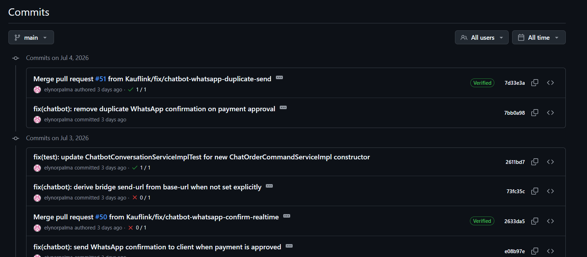

---

#### 5.2.3.5. Execution Evidence for Sprint Review

Al término del Sprint 3, el equipo implementó y desplegó la primera versión de los RESTful Web Services de Entreprenly con Spring Boot. La API se encuentra disponible públicamente sobre HTTPS en **https://daop-api.entreprenly.online** y su documentación interactiva en **https://daop-api.entreprenly.online/swagger-ui/index.html**. Los Bounded Contexts implementados y sus capacidades clave son los siguientes:

- **IAM BC:** Autenticación por email con hash BCrypt, registro de usuarios, asignación de rol por defecto y emisión/validación de tokens **JWT** que protegen los endpoints y aíslan los recursos por cuenta.
- **Profile BC:** Gestión del perfil del comerciante (datos personales, avatar base64, preferencias de idioma/tema/moneda y notificaciones), con auto-creación del perfil al registrarse el usuario.
- **Inventory BC:** CRUD de productos unitarios y a granel, lotes unitarios y a granel, vista combinada de lotes y alertas de stock computadas, con borrado en cascada y aislamiento por cuenta.
- **Sales BC:** Registro de ventas y registros de caja del Punto de Venta, con aislamiento de datos por cuenta autenticada.
- **Subscription BC:** Planes, suscripciones, pagos, periodos de facturación y dashboard de suscripción con límites específicos por plan.
- **Chatbot BC:** Flujo completo de pedidos por WhatsApp (consulta de catálogo real, registro de pedido, recepción de comprobante de pago, validación y notificación), con un **WhatsApp bridge multi-tenant** que mantiene el QR y el estado de conexión indexados por el email del vendedor.

La persistencia se realiza sobre **MySQL** mediante JPA respetando los límites de cada bounded context, y la documentación de los 77 endpoints se genera automáticamente con **OpenAPI/Swagger**.

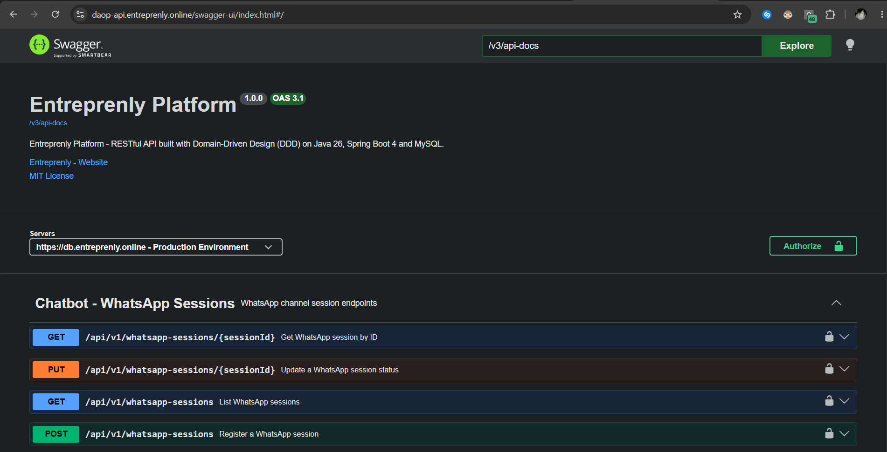

---

#### 5.2.3.6. Services Documentation Evidence for Sprint Review

A diferencia del Sprint 2, en el que la Frontend Web Application consumía una Fake RESTful API servida con JSON-Server, en el Sprint 3 se implementó el Backend real con Spring Boot y se documentó formalmente mediante **OpenAPI/Swagger**. La especificación OpenAPI está disponible en `https://daop-api.entreprenly.online/v3/api-docs` y la interfaz interactiva de exploración y prueba en `https://daop-api.entreprenly.online/swagger-ui/index.html`.

La API expone **77 operaciones** distribuidas en **23 controladores REST** a través de los 7 Bounded Contexts. Todos los endpoints de negocio están protegidos con **JWT**; únicamente el sign-in, el sign-up y los endpoints del bridge de WhatsApp (autenticados con un token de bridge dedicado) quedan fuera de esa protección. A continuación se documentan los endpoints representativos por Bounded Context:

<table border="1" cellpadding="8" cellspacing="0" style="border-collapse: collapse; width: 100%;">
  <thead>
    <tr>
      <th>Bounded Context</th>
      <th>Endpoint</th>
      <th>Verbo HTTP</th>
      <th>Descripción</th>
      <th>Autenticación</th>
    </tr>
  </thead>
  <tbody>
    <tr>
      <td>IAM / Authentication</td>
      <td><code>/api/v1/authentication/sign-in</code></td>
      <td>POST</td>
      <td>Autentica al usuario por email y contraseña y retorna un token JWT.</td>
      <td>No</td>
    </tr>
    <tr>
      <td>IAM / Authentication</td>
      <td><code>/api/v1/authentication/sign-up</code></td>
      <td>POST</td>
      <td>Registra una nueva cuenta y asigna el rol por defecto.</td>
      <td>No</td>
    </tr>
    <tr>
      <td>IAM</td>
      <td><code>/api/v1/users</code></td>
      <td>GET</td>
      <td>Lista los usuarios registrados.</td>
      <td>JWT</td>
    </tr>
    <tr>
      <td>IAM</td>
      <td><code>/api/v1/roles</code></td>
      <td>GET</td>
      <td>Lista los roles disponibles en el sistema.</td>
      <td>JWT</td>
    </tr>
    <tr>
      <td>Profile</td>
      <td><code>/api/v1/profiles/{profileId}</code></td>
      <td>GET / PUT</td>
      <td>Consulta y actualiza el perfil del comerciante.</td>
      <td>JWT</td>
    </tr>
    <tr>
      <td>Profile</td>
      <td><code>/api/v1/profiles/{profileId}/preferences</code></td>
      <td>PUT</td>
      <td>Actualiza idioma, tema y moneda del comerciante.</td>
      <td>JWT</td>
    </tr>
    <tr>
      <td>Profile</td>
      <td><code>/api/v1/profiles/{profileId}/notification-settings</code></td>
      <td>PUT</td>
      <td>Actualiza las preferencias de notificación.</td>
      <td>JWT</td>
    </tr>
    <tr>
      <td>Inventory</td>
      <td><code>/api/v1/inventory-unit-products</code></td>
      <td>GET / POST</td>
      <td>Lista y registra productos vendidos por unidad.</td>
      <td>JWT</td>
    </tr>
    <tr>
      <td>Inventory</td>
      <td><code>/api/v1/inventory-weight-products</code></td>
      <td>GET / POST</td>
      <td>Lista y registra productos vendidos por kilogramo.</td>
      <td>JWT</td>
    </tr>
    <tr>
      <td>Inventory</td>
      <td><code>/api/v1/inventory-unit-lots</code></td>
      <td>GET / POST / PUT</td>
      <td>Gestiona los lotes de productos unitarios.</td>
      <td>JWT</td>
    </tr>
    <tr>
      <td>Inventory</td>
      <td><code>/api/v1/inventory-weight-lots</code></td>
      <td>GET / POST / PUT</td>
      <td>Gestiona los lotes de productos a granel.</td>
      <td>JWT</td>
    </tr>
    <tr>
      <td>Inventory</td>
      <td><code>/api/v1/inventory-lots</code></td>
      <td>GET</td>
      <td>Retorna la vista combinada de lotes (unitarios y a granel).</td>
      <td>JWT</td>
    </tr>
    <tr>
      <td>Inventory</td>
      <td><code>/api/v1/inventory-stock-alerts</code></td>
      <td>GET</td>
      <td>Retorna las alertas de stock computadas (vencido, por vencer, bajo, agotado).</td>
      <td>JWT</td>
    </tr>
    <tr>
      <td>Sales</td>
      <td><code>/api/v1/sales</code></td>
      <td>GET / POST</td>
      <td>Lista y registra las ventas del Punto de Venta de la cuenta.</td>
      <td>JWT</td>
    </tr>
    <tr>
      <td>Sales</td>
      <td><code>/api/v1/cash-registers</code></td>
      <td>GET / PUT</td>
      <td>Consulta y actualiza los registros de caja por día.</td>
      <td>JWT</td>
    </tr>
    <tr>
      <td>Subscription</td>
      <td><code>/api/v1/subscription-plans</code></td>
      <td>GET</td>
      <td>Lista los planes de suscripción disponibles.</td>
      <td>JWT</td>
    </tr>
    <tr>
      <td>Subscription</td>
      <td><code>/api/v1/subscriptions</code></td>
      <td>GET / POST</td>
      <td>Gestiona las suscripciones, renovaciones, pagos y cancelaciones.</td>
      <td>JWT</td>
    </tr>
    <tr>
      <td>Subscription</td>
      <td><code>/api/v1/subscription-dashboard/{userId}</code></td>
      <td>GET / PUT</td>
      <td>Retorna y actualiza el dashboard de suscripción con límites por plan.</td>
      <td>JWT</td>
    </tr>
    <tr>
      <td>Chatbot</td>
      <td><code>/api/v1/whatsapp-sessions</code></td>
      <td>GET / PUT</td>
      <td>Gestiona las sesiones de WhatsApp del comerciante.</td>
      <td>JWT</td>
    </tr>
    <tr>
      <td>Chatbot</td>
      <td><code>/api/v1/conversations</code></td>
      <td>GET / PUT</td>
      <td>Lista y actualiza el estado de las conversaciones.</td>
      <td>JWT</td>
    </tr>
    <tr>
      <td>Chatbot</td>
      <td><code>/api/v1/chat-messages</code></td>
      <td>GET</td>
      <td>Retorna los mensajes de una conversación.</td>
      <td>JWT</td>
    </tr>
    <tr>
      <td>Chatbot</td>
      <td><code>/api/v1/chat-orders</code></td>
      <td>GET / PUT</td>
      <td>Gestiona los pedidos generados por WhatsApp y su estado.</td>
      <td>JWT</td>
    </tr>
    <tr>
      <td>Chatbot</td>
      <td><code>/api/v1/chat-orders/receipt</code></td>
      <td>POST</td>
      <td>Recibe el comprobante de pago y lo adjunta al pedido.</td>
      <td>JWT</td>
    </tr>
    <tr>
      <td>Chatbot (Bridge)</td>
      <td><code>/api/v1/chatbot/whatsapp/bridge/qr</code></td>
      <td>POST</td>
      <td>Recibe el QR de emparejamiento desde el bridge, keyed por email del vendedor.</td>
      <td>Token de bridge</td>
    </tr>
    <tr>
      <td>Chatbot (Bridge)</td>
      <td><code>/api/v1/chatbot/whatsapp/bridge/status</code></td>
      <td>POST</td>
      <td>Actualiza el estado de conexión del bridge multi-tenant.</td>
      <td>Token de bridge</td>
    </tr>
  </tbody>
</table>

**URL del repositorio de los Web Services:** https://github.com/Kauflink/daop-entreprenly-web-services

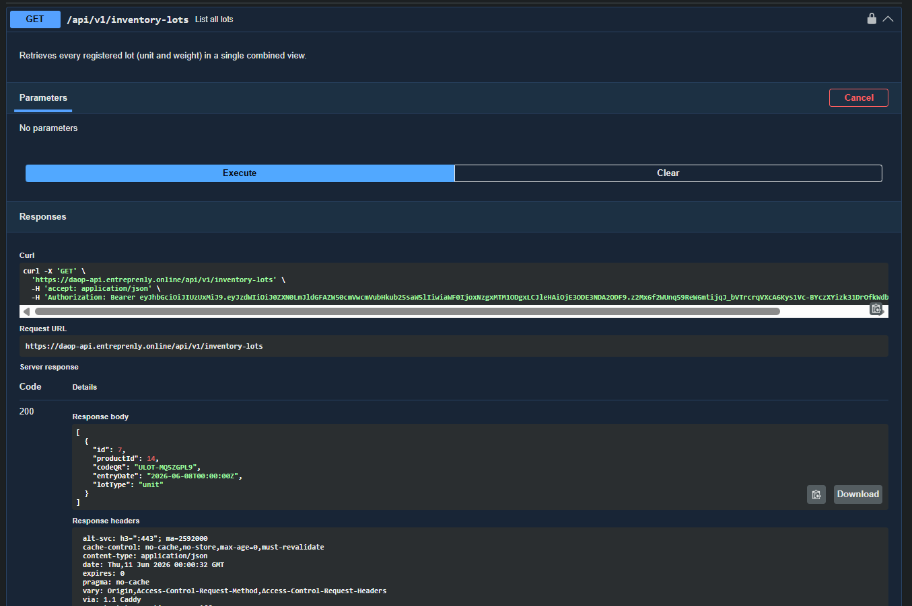

---

#### 5.2.3.7. Software Deployment Evidence for Sprint Review

Durante el Sprint 3, el equipo configuró y ejecutó el despliegue de los Web Services sobre **Google Cloud Run**, con la imagen del contenedor construida por **Cloud Build** a partir del código fuente y publicada en **Artifact Registry**. El proceso realizado fue el siguiente:

1. **Containerización:** Se creó un `Dockerfile` multi-stage que compila la aplicación con Maven sobre un JDK Temurin 26 y la ejecuta sobre un JRE Temurin 26 ligero, con el perfil `prod` activo.

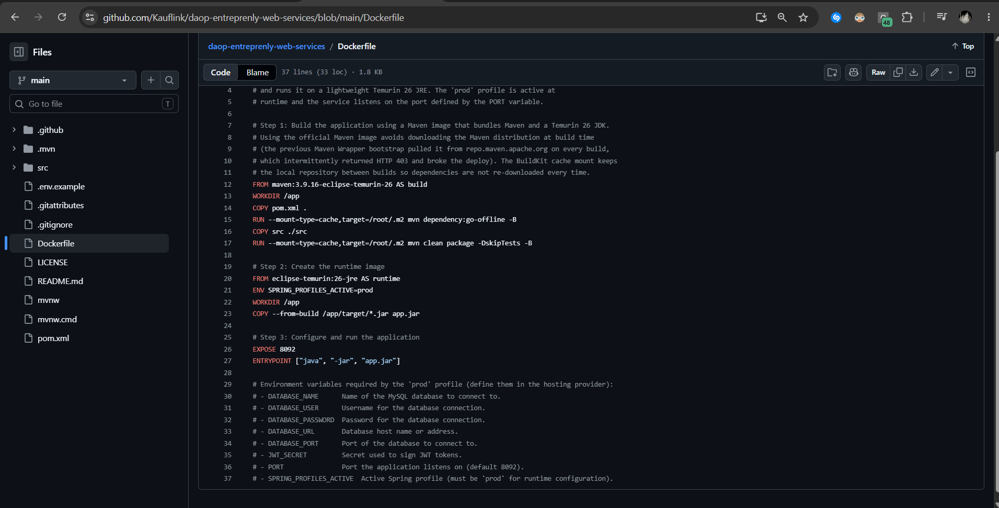

2. **Habilitación de servicios y base de datos:** Se habilitaron las APIs de **Cloud Run**, **Cloud Build**, **Artifact Registry** y **Cloud SQL Admin**, y se provisionó una instancia de **Cloud SQL para PostgreSQL** que aloja la base de datos de producción.

3. **Build y publicación de la imagen:** Al desplegar desde el código fuente en Cloud Run, **Cloud Build** compila la imagen a partir del `Dockerfile` y la publica automáticamente en **Google Artifact Registry**.

4. **Configuración del servicio:** Se desplegó el servicio `daop-entreprenly-web-services` en la región `us-east1` con puerto de contenedor `8080`, conexión a la instancia de Cloud SQL PostgreSQL, las variables de entorno del perfil `prod` (incluyendo `SPRING_PROFILES_ACTIVE`, credenciales de base de datos, `JWT_SECRET` y `CLOUD_SQL_CONNECTION_NAME`), acceso sin autenticación, 1 vCPU, 1 GiB de memoria y un máximo de 3 instancias.

5. **TLS y dominio:** Se mapeó el dominio personalizado **https://daop-api.entreprenly.online** al servicio de Cloud Run, con certificado TLS gestionado automáticamente por Google.

6. **Verificación:** Se validó el despliegue accediendo a Swagger UI en `https://daop-api.entreprenly.online/swagger-ui/index.html` y comprobando que el endpoint de especificación OpenAPI (`/v3/api-docs`) responde correctamente sobre HTTPS.

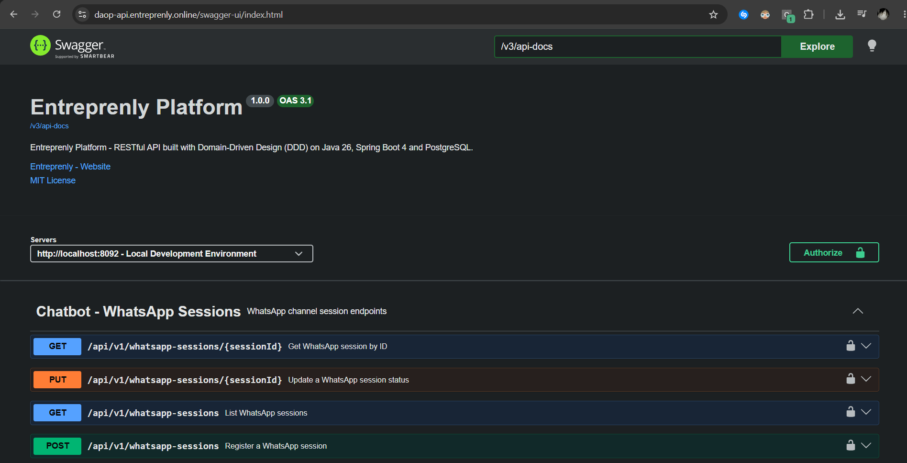

---

#### 5.2.3.8. Team Collaboration Insights during Sprint

Durante el Sprint 3, los cinco miembros del equipo participaron activamente en la implementación del Backend, evidenciado a través de los commits y Pull Requests registrados en el repositorio `daop-entreprenly-web-services`. El trabajo se distribuyó por Bounded Context: Joseph Julius (Juyens) lideró el IAM BC, la seguridad JWT, el Profile BC y la configuración del despliegue en Google Cloud; Elynor Mikela (elynorpalma) lideró el Chatbot BC y el WhatsApp bridge multi-tenant; José Antonio (DoomerGX) lideró el Inventory BC; José Fernando (Ferdinant12-ops) lideró el Sales BC; y Lionel Abraham (LioTG) lideró el Subscription BC.

El equipo aplicó GitFlow como estrategia de control de versiones, trabajando en ramas `feature/` por Bounded Context (e.g., `feature/profile`, `feature/sales`, `feature/inventory`, `feature/chatbot`, `feature/subscription`) e integrando a `develop` y `main` mediante Pull Requests. Se realizaron un total de **24 Pull Requests** durante el Sprint. La distribución de commits (sin contar merges) por miembro fue la siguiente: Palma De Los Santos (19 commits), Camargo Briceño (16 commits), Peirano Brun (9 commits), Flores Pinchi (5 commits) y Chavez Carrasco (4 commits).

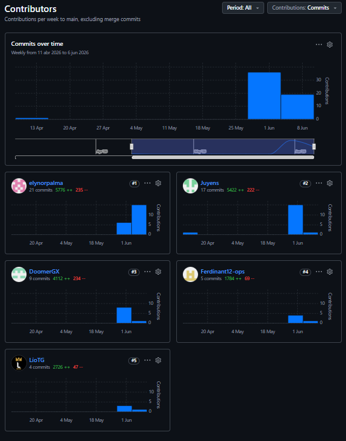

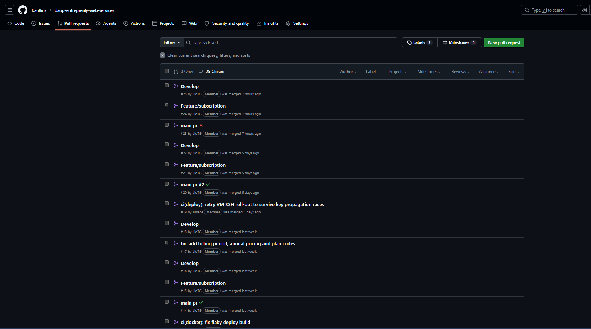

**URL del repositorio de los Web Services:** https://github.com/Kauflink/daop-entreprenly-web-services

---

### 5.2.4. Sprint 4

#### 5.2.4.1. Sprint Planning 4

Para este cuarto y último Sprint, el equipo estableció como objetivo principal la integración del **canal real de WhatsApp** para el chatbot de Entreprenly mediante un **WhatsApp bridge multi-tenant**, conectando la lógica de pedidos ya implementada en el Backend con conversaciones reales de clientes, y desplegando la versión final de los tres productos digitales. La reunión de planificación se llevó a cabo de manera virtual, donde se definieron las User Stories a abordar, el Sprint Goal y la distribución de responsabilidades.

<table border="1" cellpadding="8" cellspacing="0" style="border-collapse: collapse; width: 100%;">
  <tbody>
    <tr><td colspan="2"><strong>Sprint 4</strong></td></tr>
    <tr><td colspan="2"><strong>Sprint Planning Background</strong></td></tr>
    <tr><td><strong>Date</strong></td><td>2026-06-04</td></tr>
    <tr><td><strong>Time</strong></td><td>09:00 AM</td></tr>
    <tr><td><strong>Location</strong></td><td>Reunión virtual vía Discord</td></tr>
    <tr><td><strong>Prepared By</strong></td><td>Camargo Briceño, Joseph Julius</td></tr>
    <tr><td><strong>Attendees (to planning meeting)</strong></td><td>Camargo Briceño, Joseph Julius / Chavez Carrasco, Lionel Abraham / Palma De Los Santos, Elynor Mikela / Peirano Brun, José Antonio / Flores Pinchi, José Fernando</td></tr>
    <tr><td><strong>Sprint 3 Review Summary</strong></td><td>En el Sprint 3 se implementó y desplegó el Backend real con Spring Boot sobre Google Cloud Run, con autenticación JWT, persistencia JPA por bounded context y la lógica del flujo de pedidos del chatbot (US-41 a US-52). El Frontend se integró con la API real reemplazando la Fake API del Sprint 2.</td></tr>
    <tr><td><strong>Sprint 3 Retrospective Summary</strong></td><td>El equipo identificó que, si bien la lógica del chatbot residía en el Backend, faltaba la integración con WhatsApp real: las conversaciones seguían siendo simuladas. Para el Sprint 4 se acordó implementar un WhatsApp bridge multi-tenant con <code>whatsapp-web.js</code>, conectar el canal real (vinculación por QR, recepción de mensajes y de comprobantes por imagen, y envío de respuestas al cliente) y desplegar la versión final de los tres productos.</td></tr>
    <tr><td colspan="2"><strong>Sprint Goal &amp; User Stories</strong></td></tr>
    <tr><td><strong>Sprint 4 Goal</strong></td><td>Nuestro enfoque está en habilitar la atención real de clientes por WhatsApp, conectando el chatbot de Entreprenly a cuentas reales mediante un bridge multi-tenant. Creemos que entrega valor inmediato al comerciante al automatizar consultas de productos, pedidos y validación de pagos digitales directamente sobre WhatsApp. Esto se confirmará cuando un cliente pueda vincular su WhatsApp por código QR, conversar con el bot, enviar su comprobante de pago como imagen y recibir la confirmación de su pedido de extremo a extremo. User Stories: US-37, US-38, US-44, US-45 y US-47.</td></tr>
    <tr><td><strong>Sprint 4 Velocity</strong></td><td>14</td></tr>
    <tr><td><strong>Sum of Story Points</strong></td><td>14</td></tr>
  </tbody>
</table>

---

#### 5.2.4.2. Aspect Leaders and Collaborators

En el Sprint 4, el equipo organizó el trabajo en torno a cuatro aspectos: el **WhatsApp Bridge multi-tenant**, la **integración del Chatbot en el Backend**, la **integración del Chatbot en el Frontend** y el **despliegue final con enrutamiento multi-backend** (página `/switch`). A continuación se presenta la matriz de liderazgo y colaboración (LACX):

<table border="1" cellpadding="8" cellspacing="0" style="border-collapse: collapse; width: 100%;">
  <thead>
    <tr>
      <th>Team Member (Last Name, First Name)</th>
      <th>GitHub Username</th>
      <th>WhatsApp Bridge<br>Leader (L) / Collaborator (C)</th>
      <th>Chatbot Backend<br>Leader (L) / Collaborator (C)</th>
      <th>Chatbot Frontend<br>Leader (L) / Collaborator (C)</th>
      <th>Despliegue final y Switch<br>Leader (L) / Collaborator (C)</th>
    </tr>
  </thead>
  <tbody>
    <tr><td>Camargo Briceño, Joseph Julius</td><td>Juyens</td><td>C</td><td>L</td><td>C</td><td>L</td></tr>
    <tr><td>Chavez Carrasco, Lionel Abraham</td><td>LioTG</td><td>C</td><td>C</td><td>C</td><td>C</td></tr>
    <tr><td>Palma De Los Santos, Elynor Mikela</td><td>elynorpalma</td><td>L</td><td>C</td><td>L</td><td>C</td></tr>
    <tr><td>Peirano Brun, José Antonio</td><td>DoomerGX</td><td>C</td><td>C</td><td>C</td><td>C</td></tr>
    <tr><td>Flores Pinchi, José Fernando</td><td>Ferdinant12-ops</td><td>C</td><td>C</td><td>C</td><td>C</td></tr>
  </tbody>
</table>

---

#### 5.2.4.3. Sprint Backlog 4

El objetivo principal de este Sprint fue integrar el canal real de WhatsApp para el chatbot, cubriendo las User Stories **US-37, US-38, US-44, US-45 y US-47**, que se realizaron de forma efectiva mediante el WhatsApp bridge (en Sprints previos US-37, US-38 y US-45 se abordaron de forma simulada o solo en el Backend). Cada historia se descompuso en Engineering Tasks con una estimación individual de entre 4 y 8 horas, gestionadas en el tablero Kanban del Sprint con las columnas **To Do, In Process, To Review y Done**.

**Board público del Sprint 4 (Trello):** https://trello.com/b/msBZdIfS/entreprenly-sprint-4

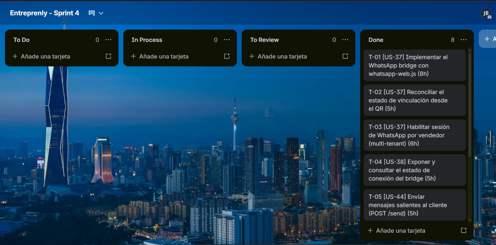

<table border="1" cellpadding="8" cellspacing="0" style="border-collapse: collapse; width: 100%;">
  <thead>
    <tr>
      <th colspan="8">Sprint # Sprint 4</th>
    </tr>
    <tr>
      <th colspan="2">User Story</th>
      <th colspan="6">Work-Item / Task</th>
    </tr>
    <tr>
      <th>Id</th><th>Title</th><th>Id</th><th>Title</th><th>Description</th><th>Estimation (Hours)</th><th>Assigned To</th><th>Status</th>
    </tr>
  </thead>
  <tbody>
    <tr>
      <td>US-37</td>
      <td>Vincular cuenta de WhatsApp Business mediante código QR</td>
      <td>T-01</td>
      <td>Implementar el WhatsApp bridge con whatsapp-web.js</td>
      <td>Construir el servicio bridge en Node.js con <code>whatsapp-web.js</code> que genera el código QR y mantiene la sesión de WhatsApp Web.</td>
      <td>8</td>
      <td>Palma De Los Santos, Elynor Mikela</td>
      <td>Done</td>
    </tr>
    <tr>
      <td>US-37</td>
      <td>Vincular cuenta de WhatsApp Business mediante código QR</td>
      <td>T-02</td>
      <td>Reconciliar el estado de vinculación desde el QR</td>
      <td>Relevar el QR real hacia el Backend y reconciliar el estado de vinculación a partir de la respuesta del sondeo (poll) del bridge.</td>
      <td>5</td>
      <td>Camargo Briceño, Joseph Julius</td>
      <td>Done</td>
    </tr>
    <tr>
      <td>US-37</td>
      <td>Vincular cuenta de WhatsApp Business mediante código QR</td>
      <td>T-03</td>
      <td>Habilitar sesión de WhatsApp por vendedor (multi-tenant)</td>
      <td>Mantener una sesión de WhatsApp independiente por email de vendedor, para que cada comerciante vincule su propia cuenta.</td>
      <td>6</td>
      <td>Palma De Los Santos, Elynor Mikela</td>
      <td>Done</td>
    </tr>
    <tr>
      <td>US-38</td>
      <td>Consultar estado de vinculación del chatbot</td>
      <td>T-04</td>
      <td>Exponer y consultar el estado de conexión del bridge</td>
      <td>Reportar el estado de conexión del bridge al Backend y agregar el endpoint de desconexión que limpia el estado y notifica el logout.</td>
      <td>5</td>
      <td>Palma De Los Santos, Elynor Mikela</td>
      <td>Done</td>
    </tr>
    <tr>
      <td>US-44</td>
      <td>Recibir instrucciones de pago por WhatsApp</td>
      <td>T-05</td>
      <td>Enviar mensajes salientes al cliente (POST /send)</td>
      <td>Agregar el endpoint <code>POST /send</code> del bridge para que el Backend empuje mensajes salientes (incluidas las instrucciones de pago) al cliente por WhatsApp.</td>
      <td>5</td>
      <td>Palma De Los Santos, Elynor Mikela</td>
      <td>Done</td>
    </tr>
    <tr>
      <td>US-45</td>
      <td>Reportar comprobante de pago digital</td>
      <td>T-06</td>
      <td>Reenviar imágenes de WhatsApp como comprobantes</td>
      <td>Detectar los mensajes de imagen entrantes y reenviarlos al Backend como comprobantes de pago, usando un centinela para no saturar los eventos SSE con el base64.</td>
      <td>6</td>
      <td>Palma De Los Santos, Elynor Mikela</td>
      <td>Done</td>
    </tr>
    <tr>
      <td>US-47</td>
      <td>Notificar resultado de validación al cliente</td>
      <td>T-07</td>
      <td>Notificar el resultado de la validación por WhatsApp</td>
      <td>Enviar al cliente, a través del bridge, la confirmación o el rechazo del pago tras la validación del comprobante desde el dashboard.</td>
      <td>4</td>
      <td>Camargo Briceño, Joseph Julius</td>
      <td>Done</td>
    </tr>
    <tr>
      <td>US-47</td>
      <td>Notificar resultado de validación al cliente</td>
      <td>T-08</td>
      <td>Enrutar el canal a uno de dos backends (switch)</td>
      <td>Implementar el enrutamiento del canal de WhatsApp hacia uno de dos backends con un turno conmutable y una página <code>/switch</code>, re-sincronizando el estado de la sesión.</td>
      <td>6</td>
      <td>Camargo Briceño, Joseph Julius</td>
      <td>Done</td>
    </tr>
    <tr>
      <td>US-37</td>
      <td>Vincular cuenta de WhatsApp Business mediante código QR</td>
      <td>T-09</td>
      <td>Containerizar y desplegar el bridge</td>
      <td>Crear el <code>Dockerfile</code> del bridge y automatizar su despliegue en una instancia de Compute Engine (VM) ante cada push a <code>main</code>.</td>
      <td>5</td>
      <td>Palma De Los Santos, Elynor Mikela</td>
      <td>Done</td>
    </tr>
  </tbody>
</table>

---

#### 5.2.4.4. Development Evidence for Sprint Review

Durante el Sprint 4, el equipo trabajó principalmente sobre el repositorio del **WhatsApp bridge** (`daop-entreprenly-whatsapp-bridge`) y realizó ajustes de integración en el **Backend** (`daop-entreprenly-web-services`) y el **Frontend** (`daop-entreprenly-frontend`). El bridge acumuló **13 commits** (sin contar merges) entre el 5 y el 26 de junio de 2026. A continuación se presenta el registro de los commits más representativos:

<table border="1" cellpadding="8" cellspacing="0" style="border-collapse: collapse; width: 100%;">
  <thead>
    <tr>
      <th>Repository</th>
      <th>Branch</th>
      <th>Commit Id</th>
      <th>Commit Message</th>
      <th>Commit Message Body</th>
      <th>Committed on (Date)</th>
    </tr>
  </thead>
  <tbody>
    <tr><td>Kauflink/daop-entreprenly-whatsapp-bridge</td><td>main</td><td>a78855b</td><td>feat: WhatsApp bridge (whatsapp-web.js) for the Entreprenly chatbot</td><td>Se crea el servicio bridge en Node.js con whatsapp-web.js como base del canal de WhatsApp.</td><td>2026-06-05</td></tr>
    <tr><td>Kauflink/daop-entreprenly-whatsapp-bridge</td><td>main</td><td>f1d9226</td><td>feat(bridge): multi-tenant — one WhatsApp session per seller email</td><td>Se habilita una sesión de WhatsApp independiente por email de vendedor.</td><td>2026-06-09</td></tr>
    <tr><td>Kauflink/daop-entreprenly-whatsapp-bridge</td><td>main</td><td>26202b2</td><td>feat(bridge): add POST /send endpoint to push outbound messages from backend to clients</td><td>Se agrega el endpoint POST /send para enviar mensajes salientes al cliente por WhatsApp.</td><td>2026-06-09</td></tr>
    <tr><td>Kauflink/daop-entreprenly-whatsapp-bridge</td><td>main</td><td>c9cbff6</td><td>feat: forward WhatsApp image messages as payment receipts</td><td>Se reenvían las imágenes entrantes de WhatsApp al Backend como comprobantes de pago.</td><td>2026-06-09</td></tr>
    <tr><td>Kauflink/daop-entreprenly-whatsapp-bridge</td><td>main</td><td>8f788e7</td><td>feat(docker): add Dockerfile and dockerignore for VM deployment</td><td>Se containeriza el bridge para su despliegue en una VM.</td><td>2026-06-09</td></tr>
    <tr><td>Kauflink/daop-entreprenly-whatsapp-bridge</td><td>main</td><td>0eaae2e</td><td>ci: auto-deploy bridge to Compute Engine VM on push to main</td><td>Se automatiza el despliegue del bridge en Compute Engine ante cada push a main.</td><td>2026-06-10</td></tr>
    <tr><td>Kauflink/daop-entreprenly-whatsapp-bridge</td><td>main</td><td>83df0e6</td><td>feat: route WhatsApp to one of two backends with a switchable turn and /switch page</td><td>Se enruta el canal a uno de dos backends con turno conmutable y una página /switch.</td><td>2026-06-26</td></tr>
    <tr><td>Kauflink/daop-entreprenly-whatsapp-bridge</td><td>main</td><td>f802a49</td><td>fix: clean stale Chromium singleton locks on container startup</td><td>Se limpian los locks obsoletos de Chromium al iniciar el contenedor para estabilizar el arranque.</td><td>2026-06-26</td></tr>
    <tr><td>Kauflink/daop-entreprenly-web-services</td><td>develop</td><td>3d5d18f</td><td>feat(chatbot): reconcile bridge link state from QR poll response</td><td>Se reconcilia el estado de vinculación del bridge a partir del sondeo del QR.</td><td>2026-06-16</td></tr>
    <tr><td>Kauflink/daop-entreprenly-web-services</td><td>develop</td><td>1ceb0a8</td><td>feat(chatbot): expand rule-based responder with more intents</td><td>Se amplía el responder basado en reglas con más intenciones para las consultas de clientes.</td><td>2026-06-16</td></tr>
    <tr><td>Kauflink/daop-entreprenly-web-services</td><td>develop</td><td>7a992ea</td><td>fix(chatbot): suggest catalog alternatives when requested product not found</td><td>Se sugieren alternativas del catálogo cuando el producto solicitado no está disponible.</td><td>2026-06-16</td></tr>
    <tr><td>Kauflink/daop-entreprenly-web-services</td><td>develop</td><td>fff996b</td><td>fix(chatbot): add disconnect endpoint to clear bridge state and notify bridge logout</td><td>Se agrega el endpoint de desconexión que limpia el estado del bridge y notifica el logout.</td><td>2026-06-17</td></tr>
  </tbody>
</table>

**URL del repositorio del WhatsApp Bridge:** https://github.com/Kauflink/daop-entreprenly-whatsapp-bridge

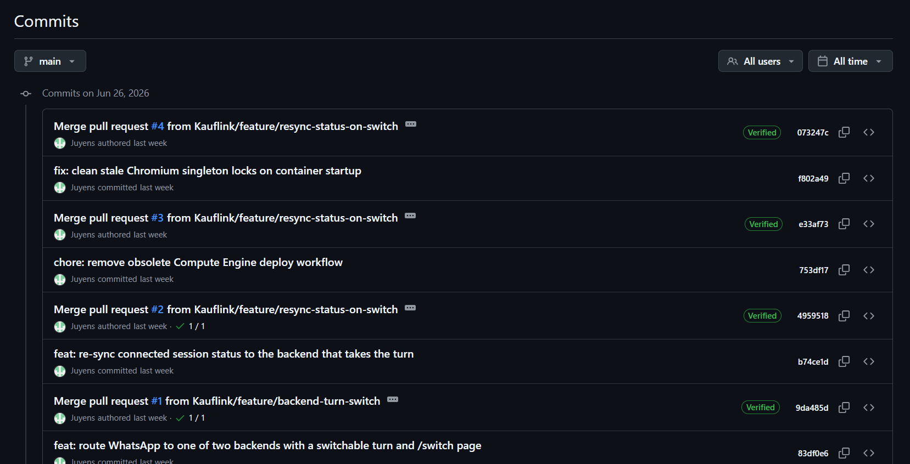

---

#### 5.2.4.5. Execution Evidence for Sprint Review

Al término del Sprint 4, el chatbot de Entreprenly quedó operativo sobre **WhatsApp real** mediante el bridge multi-tenant. El flujo funcional de extremo a extremo es el siguiente:

- **Vinculación por QR (US-37):** el comerciante escanea el código QR desde el dashboard para vincular su cuenta de WhatsApp; cada vendedor mantiene su propia sesión (multi-tenant).

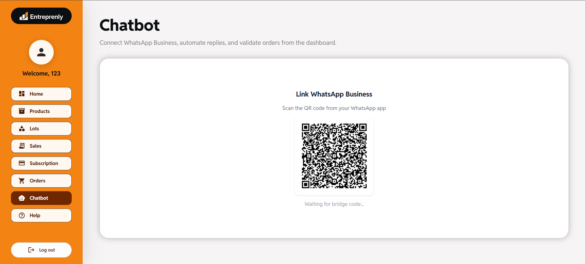

- **Estado de vinculación (US-38):** el dashboard consulta y refleja el estado de conexión del bridge, con opción de desconexión.

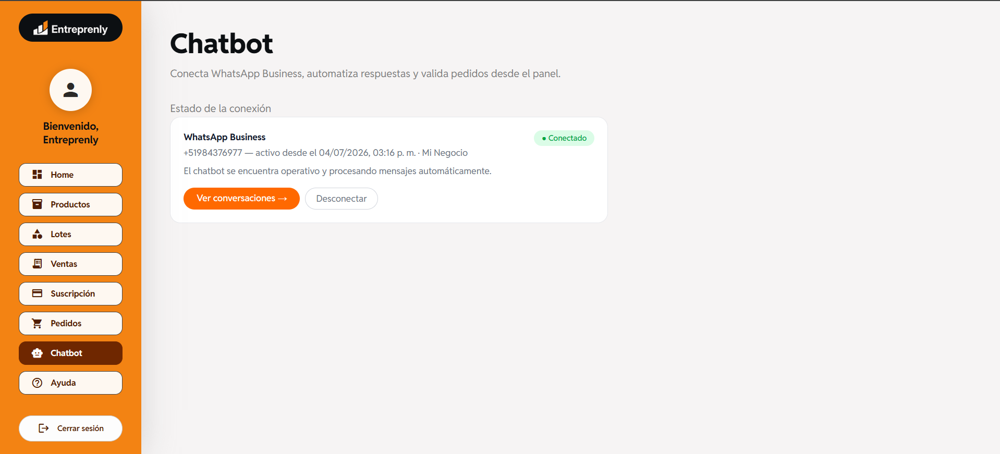

- **Atención automatizada:** el bot responde consultas de productos con datos reales del inventario y sugiere alternativas cuando un producto no está disponible.

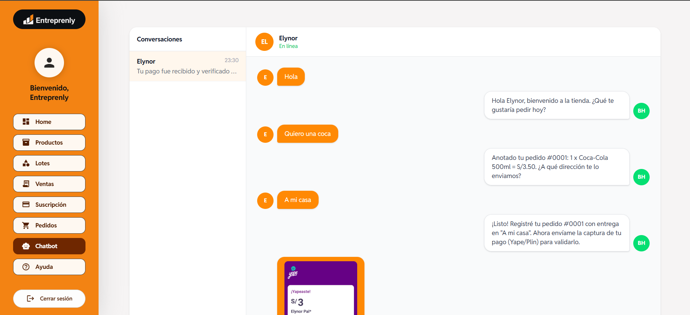

- **Instrucciones de pago (US-44):** el Backend envía al cliente, vía `POST /send` del bridge, las instrucciones de pago para completar su pedido.

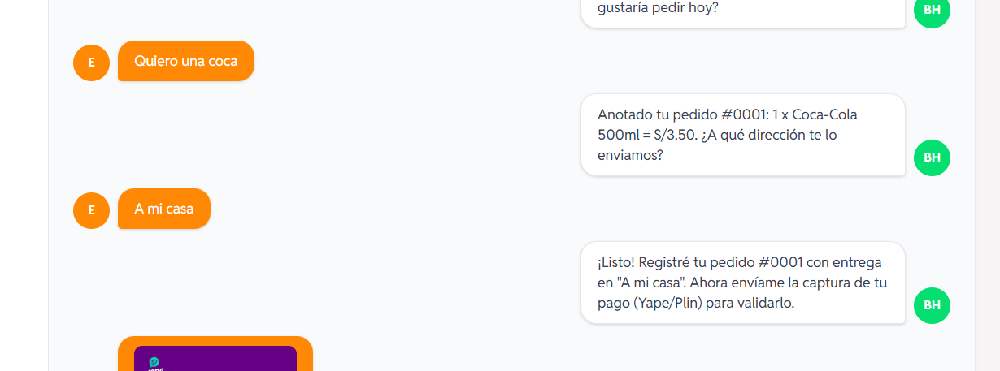

- **Comprobante por imagen (US-45):** el cliente envía la foto de su comprobante por WhatsApp y el bridge la reenvía al Backend como comprobante de pago.

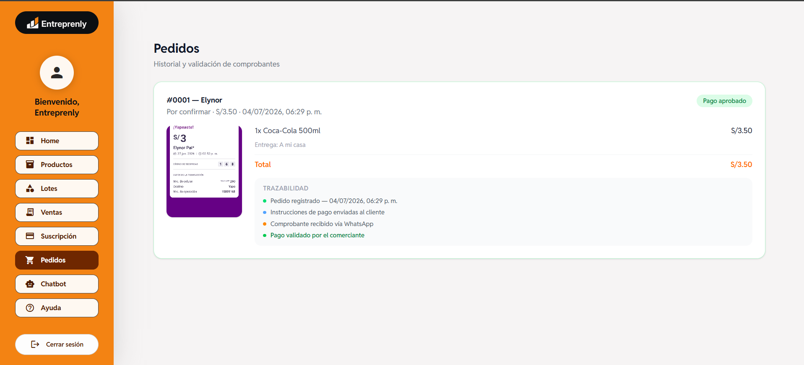


- **Notificación de validación (US-47):** tras aprobar o rechazar el comprobante desde el dashboard, el resultado se notifica al cliente por WhatsApp.

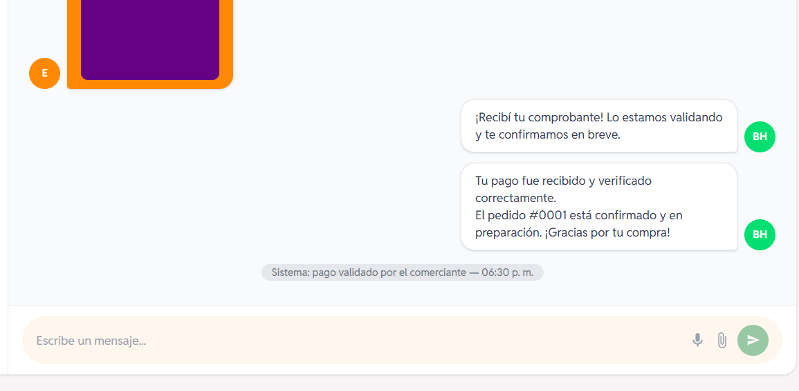

---

#### 5.2.4.6. Services Documentation Evidence for Sprint Review

La comunicación entre el Backend y el canal de WhatsApp se realiza a través del **WhatsApp bridge**, cuyos endpoints se documentan a continuación. Los endpoints del bridge se autentican con un **token de bridge dedicado**, y los endpoints del Backend asociados (webhook y relay) ya forman parte de la especificación OpenAPI/Swagger documentada en el Sprint 3.

<table border="1" cellpadding="8" cellspacing="0" style="border-collapse: collapse; width: 100%;">
  <thead>
    <tr>
      <th>Componente</th>
      <th>Endpoint</th>
      <th>Verbo HTTP</th>
      <th>Descripción</th>
      <th>Autenticación</th>
    </tr>
  </thead>
  <tbody>
    <tr><td>Backend ← Bridge</td><td><code>/api/v1/chatbot/whatsapp/bridge/qr</code></td><td>POST</td><td>El bridge releva el último QR de emparejamiento al Backend.</td><td>Token de bridge</td></tr>
    <tr><td>Backend ← Bridge</td><td><code>/api/v1/chatbot/whatsapp/bridge/status</code></td><td>POST</td><td>El bridge reporta el estado de conexión de la sesión.</td><td>Token de bridge</td></tr>
    <tr><td>Frontend → Backend</td><td><code>/api/v1/chatbot/whatsapp/bridge/qr</code></td><td>GET</td><td>El dashboard obtiene el QR actual y el estado de vinculación.</td><td>JWT</td></tr>
    <tr><td>Frontend → Backend</td><td><code>/api/v1/chatbot/whatsapp/bridge/session</code></td><td>DELETE</td><td>Desconecta la sesión de WhatsApp del vendedor.</td><td>JWT</td></tr>
    <tr><td>Backend ← Bridge</td><td><code>/api/v1/chatbot/whatsapp/webhook</code></td><td>POST</td><td>Recibe un mensaje entrante de WhatsApp (texto o imagen).</td><td>Token de bridge</td></tr>
    <tr><td>Backend ← Bridge</td><td><code>/api/v1/chatbot/whatsapp/webhook/receipt</code></td><td>POST</td><td>Recibe un comprobante de pago (imagen) enviado por el cliente.</td><td>Token de bridge</td></tr>
    <tr><td>Backend → Bridge</td><td><code>/send</code></td><td>POST</td><td>El Backend empuja un mensaje saliente hacia el cliente por WhatsApp.</td><td>Token de bridge</td></tr>
  </tbody>
</table>

---

#### 5.2.4.7. Software Deployment Evidence for Sprint Review

Durante el Sprint 4, el equipo desplegó el **WhatsApp bridge** de forma containerizada con Docker sobre una instancia de **Google Compute Engine (VM)**, con despliegue automatizado ante cada push a `main`. El bridge se comunica con el Backend desplegado en Cloud Run y expone la página `/switch` para el enrutamiento entre backends. Con esto quedó desplegada la **versión final** de los tres productos digitales (Landing Page, Frontend y Web Services) más el canal de WhatsApp. El proceso realizado fue el siguiente:

1. **Containerización del bridge:** Se creó un `Dockerfile` para el servicio Node.js con `whatsapp-web.js` y las dependencias de Chromium necesarias para WhatsApp Web.

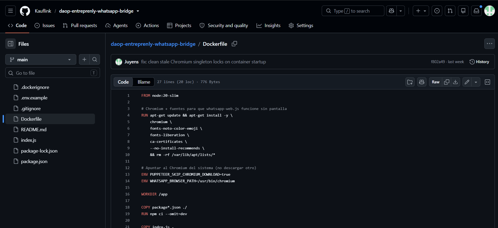

2. **Despliegue automatizado en la VM:** Se configuró el despliegue automático del bridge en una instancia de Compute Engine ante cada push a `main`.


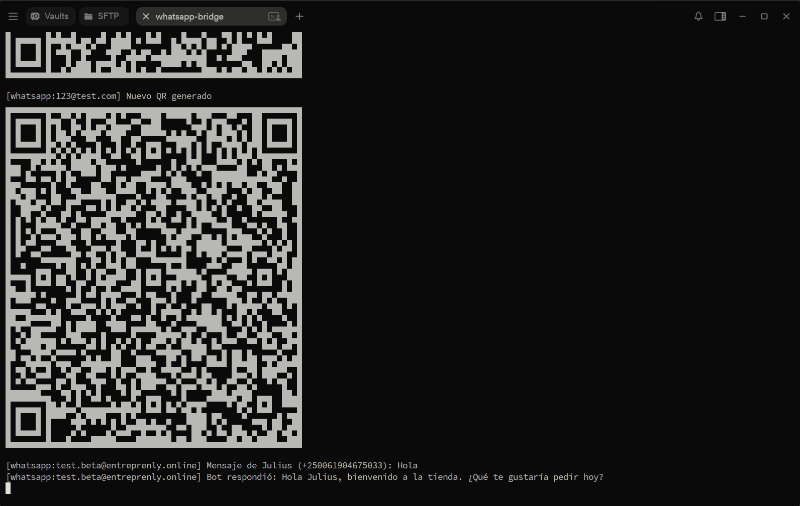

---

#### 5.2.4.8. Team Collaboration Insights during Sprint

Durante el Sprint 4, la implementación del canal de WhatsApp se concentró en el repositorio `daop-entreprenly-whatsapp-bridge`, con ajustes de integración en el Backend y el Frontend. El equipo mantuvo GitFlow con ramas `feature/` integradas a `develop` y `main` mediante Pull Requests. La distribución de commits del bridge (sin contar merges) por miembro fue la siguiente: **Palma De Los Santos (8 commits)** y **Camargo Briceño (5 commits)**, con la colaboración del resto del equipo en las tareas de integración del Backend y el Frontend.

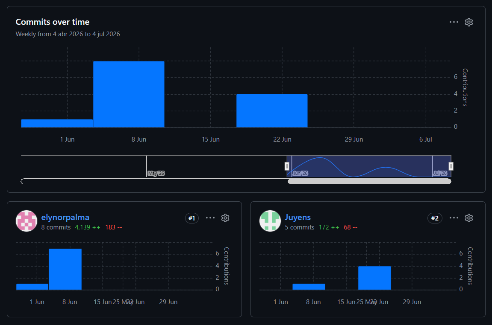

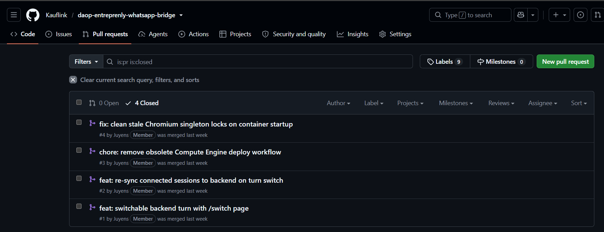

**URL del repositorio del WhatsApp Bridge:** https://github.com/Kauflink/daop-entreprenly-whatsapp-bridge

## 5.3. Validation Interviews

En esta sección el equipo registra y explica las actividades de entrevistas de validación realizadas durante el proyecto. A diferencia de las entrevistas de elicitación presentadas en la sección 2.2 —cuyo objetivo fue descubrir los problemas y necesidades de los usuarios—, las entrevistas de validación tienen como propósito confirmar si la solución construida (Landing Page y aplicaciones) resuelve efectivamente esos problemas y resulta usable para los segmentos objetivo.

Para ello se realizaron sesiones en las que usuarios reales de cada segmento interactuaron directamente con el Landing Page y con las aplicaciones de Entreprenly, ejecutando tareas concretas basadas en los User Flows definidos en la sección 4.4.4. Durante cada sesión se observó el desempeño del usuario al completar las tareas y, al finalizar, se aplicó un cuestionario de validación orientado a contrastar los dolores identificados en el needfinding con la experiencia real de uso del producto. Adicionalmente, se registraron observaciones de usabilidad siguiendo principios de evaluación heurística. Cada entrevista fue grabada en video como evidencia y se encuentra disponible en Microsoft Stream.

### 5.3.1. Diseño de Entrevistas

Antes de iniciar cada sesión de validación se brinda un saludo cordial y una breve presentación del entrevistador, explicando que el propósito de la sesión es evaluar la facilidad de uso y la utilidad del producto Entreprenly, y no evaluar al participante. Se aclara que la información será utilizada únicamente con fines académicos y se mantendrá en estricta confidencialidad. Como primer paso se solicita al participante su nombre completo, edad y distrito de residencia para fines de registro. Luego se le invita a interactuar libremente con el Landing Page y las aplicaciones, ejecutando las tareas propuestas y expresando en voz alta sus impresiones (técnica de _thinking aloud_), destacando que no existen respuestas correctas o incorrectas.

El proceso de validación para cada segmento se compone de tres momentos: (1) la exploración del Landing Page, (2) la ejecución de tareas guiadas sobre las aplicaciones siguiendo los User Flows correspondientes, y (3) un cuestionario de validación de diez preguntas. A continuación se detallan los elementos a incluir en la sesión de validación para cada segmento objetivo.

**Preguntas introductorias (ambos segmentos)**

- ¿Cuál es su nombre y apellidos?
- ¿Cuántos años tiene?
- ¿En qué distrito vive?

---

**Segmento objetivo 1: Comerciantes (Dueños de Minimarkets/Mercados)**

_Elementos a validar:_ Landing Page y Aplicación Web (Dashboard de gestión).

_User Flows a validar (sección 4.4.4):_

- User Flow 1 – Gestión de inventario (agregar, editar y buscar productos).
- User Flow 2 – Creación de lotes y gestión de alertas de vencimiento.
- User Flow 3 – Registro de venta presencial (POS con pesaje).
- User Flow 4 – Validación de pago de pedido del chatbot.
- User Flow 5 – Suscripción al Plan Control.

_Tareas asignadas:_

1. Explorar el Landing Page e identificar qué ofrece Entreprenly y los planes disponibles.
2. Registrar un producto nuevo, editarlo y luego buscarlo en el inventario.
3. Crear un lote con fecha de vencimiento y revisar las alertas del dashboard de lotes.
4. Registrar una venta presencial seleccionando un producto por peso y uno por unidad, y finalizar el cobro.
5. Revisar un pedido del chatbot pendiente y aprobar (o rechazar) su pago.
6. Iniciar el proceso de suscripción al Plan Control.

_Preguntas de validación:_

1. Después de explorar el Landing Page, ¿quedó claro qué hace Entreprenly y cómo resolvería los problemas de su negocio?
2. Al registrar, editar y buscar productos en el módulo de inventario, ¿le resultó más sencillo y ordenado que su método actual (cuaderno, Excel o memoria)?
3. Cuando creó un lote y visualizó las alertas de stock y vencimiento, ¿siente que esto le ayudaría a evitar pérdidas por productos vencidos o desabastecimiento no detectado?
4. Al registrar una venta presencial con el POS, incluido el pesaje, ¿le pareció un proceso rápido y confiable para el día a día en el local?
5. ¿La separación automática de los ingresos por efectivo y por medios digitales (Yape, Plin, POS) le daría mayor control al momento de cuadrar la caja?
6. Al validar el pago de un pedido del chatbot desde el dashboard, ¿le resultó claro el proceso de aprobar o rechazar el pago y confirmar el pedido?
7. ¿Considera que atender los pedidos por WhatsApp mediante el chatbot le quitaría la carga de estar pendiente del celular mientras atiende a los clientes en el local?
8. Durante el uso de la aplicación, ¿encontró alguna pantalla, botón o paso que le resultara confuso o difícil de entender?
9. En una escala del 1 al 5, ¿qué tan probable es que utilice Entreprenly en su negocio? ¿Por qué?
10. ¿Qué funcionalidad agregaría, quitaría o mejoraría para que la aplicación se ajuste mejor a su forma de trabajar?

---

**Segmento objetivo 2: Clientes Finales**

_Elementos a validar:_ Landing Page y Chatbot de WhatsApp (experiencia de compra).

_User Flows a validar:_

- Flujo de pedido por el chatbot: consulta de producto disponible, confirmación del pedido, recepción de las instrucciones de pago, reporte del comprobante de pago digital y recepción de la confirmación/comprobante.

_Tareas asignadas:_

1. Explorar el Landing Page e identificar qué ofrece la tienda y por qué convendría comprar por este medio.
2. Iniciar una conversación con el chatbot y consultar la disponibilidad de un producto.
3. Confirmar un pedido a través del chatbot.
4. Recibir las instrucciones de pago y reportar el comprobante de pago digital.
5. Recibir la confirmación del pedido y su comprobante.

_Preguntas de validación:_

1. Después de ver el Landing Page, ¿entendió qué ofrece la tienda y por qué le convendría comprar por este medio?
2. Al realizar un pedido por el chatbot de WhatsApp, ¿le resultó fácil y rápido encontrar el producto y completar la compra?
3. ¿La confirmación de stock en tiempo real le dio mayor confianza de que el producto que pidió sí está disponible?
4. Al recibir las instrucciones de pago y reportar su comprobante por el chat, ¿le pareció un proceso claro y seguro?
5. ¿Recibir una confirmación o comprobante automático del pedido le dio mayor tranquilidad al pagar por adelantado?
6. ¿Le resultó cómodo el medio de pago ofrecido (efectivo, Yape o Plin)?
7. ¿Prefiere esta experiencia de compra mediante el chatbot frente a esperar que una persona le responda manualmente?
8. Durante el pedido, ¿hubo algún mensaje o paso del chatbot que le resultara confuso o poco claro?
9. En una escala del 1 al 5, ¿qué tan probable es que vuelva a comprar en una tienda que use este sistema? ¿Por qué?
10. ¿Qué mejoraría de la experiencia de compra a través del chatbot?

### 5.3.2. Registro de Entrevistas

A continuación se registran las entrevistas de validación realizadas por segmento. Para cada entrevista se consigna el nombre y apellidos del participante, su edad, su distrito de residencia, un screenshot de un cuadro del video, el enlace al video alojado en Microsoft Stream —indicando el timing donde inicia la entrevista y su duración— y un resumen descriptivo de las principales apreciaciones del entrevistado respecto a las tareas asignadas. De acuerdo con lo planificado por el equipo, se realizaron dos entrevistas para el Segmento 1 (Comerciantes) y una entrevista para el Segmento 2 (Clientes Finales).

**Segmento 1: Comerciantes (Dueños de Minimarkets/Mercados)**

- Primera entrevista:

<div align="center">
<div style="font-family: 'Segoe UI', sans-serif; max-width: 680px; margin: 24px auto; border: 1.5px solid #b0bec5; border-radius: 4px; overflow: hidden; box-shadow: 0 2px 8px rgba(0,0,0,0.12);">

  <!-- Encabezado -->
  <div style="background-color: #1a6b6b; color: white; padding: 10px 16px; font-weight: 700; font-size: 1.1em; letter-spacing: 0.05em;">
  Entrevista de Validación
  </div>

  <!-- Imagen de la captura de pantalla -->
  <div style="background-color: #1a6b6b; padding: 12px 16px 16px;">
    
  </div>

  <!-- Datos en dos columnas -->
  <table style="width: 100%; border-collapse: collapse; font-size: 0.88em;">
    <tr>
      <td style="padding: 7px 14px; border: 1px solid #cfd8dc; width: 50%;">
        <strong>Entrevistado(a):</strong> María Encarnación Velasquez
      </td>
      <td style="padding: 7px 14px; border: 1px solid #cfd8dc; width: 50%;">
        <strong>Edad:</strong> 62
      </td>
    </tr>
    <tr>
      <td style="padding: 7px 14px; border: 1px solid #cfd8dc;">
        <strong>Entrevistador(a):</strong> Lionel Chavez Carrasco
      </td>
      <td style="padding: 7px 14px; border: 1px solid #cfd8dc;">
        <strong>Distrito:</strong> San Miguel, Lima
      </td>
    </tr>
    <tr>
      <td style="padding: 7px 14px; border: 1px solid #cfd8dc;">
        <strong>Inicio de la entrevista:</strong> 03:20
      </td>
      <td style="padding: 7px 14px; border: 1px solid #cfd8dc;">
        <strong>Duración:</strong> 16:34
      </td>
    </tr>
  </table>

  <!-- Link -->
  <table style="width: 100%; border-collapse: collapse; font-size: 0.88em;">
    <tr>
      <td style="padding: 7px 14px; border: 1px solid #cfd8dc;">
        <strong>Link de la entrevista:</strong>
        https://upcedupe-my.sharepoint.com/:v:/g/personal/u202416151_upc_edu_pe/IQDLOgZZQciGT4vb_yjShsLTAS0Hr5RXYveIiQsCDk62_3g?nav=eyJyZWZlcnJhbEluZm8iOnsicmVmZXJyYWxBcHAiOiJPbmVEcml2ZUZvckJ1c2luZXNzIiwicmVmZXJyYWxBcHBQbGF0Zm9ybSI6IldlYiIsInJlZmVycmFsTW9kZSI6InZpZXciLCJyZWZlcnJhbFZpZXciOiJNeUZpbGVzTGlua0NvcHkifX0&e=Ykle0r
      </td>
    </tr>
  </table>

  <!-- Descripción -->
  <table style="width: 100%; border-collapse: collapse; font-size: 0.88em;">
    <tr>
      <td style="padding: 10px 14px; border: 1px solid #cfd8dc; line-height: 1.6;">
        Durante la entrevista, María Encarnación Velázquez manifestó que el Landing Page de Entrepently le pareció claro y fácil de comprender, ya que explica de manera sencilla los beneficios de la aplicación y cómo puede ayudar a los pequeños comerciantes en la gestión de sus negocios. 
        Respecto a los User Flows ejecutados, consideró que las funciones de inventario y gestión de lotes son intuitivas y facilitan el registro, búsqueda y control de productos. Asimismo, indicó que el proceso de venta presencial es rápido y permite llevar un mejor control de los ingresos diarios. La validación de pagos mediante el chatbot de WhatsApp le pareció una alternativa práctica para automatizar pedidos y cobros, mientras que el flujo de suscripción resultó sencillo y comprensible. 
        La entrevistada señaló que la solución contribuye significativamente a resolver problemas operativos relacionados con el control de inventario, seguimiento de ventas y organización de productos, reduciendo la necesidad de registros manuales y disminuyendo el riesgo de errores o pérdidas.
        No se identificaron dificultades importantes durante la interacción con la aplicación; sin embargo, sugirió incorporar funcionalidades adicionales como la generación de facturas y guías de remisión para complementar la gestión comercial.
        Finalmente, manifestó una alta probabilidad de utilizar la aplicación en su negocio debido a los beneficios que ofrece en términos de organización, ahorro de tiempo y reducción del estrés asociado a las tareas administrativas.
      </td>
    </tr>
  </table>

</div>

</div>

---

- Segunda entrevista:

<div align="center">
<div style="font-family: 'Segoe UI', sans-serif; max-width: 680px; margin: 24px auto; border: 1.5px solid #b0bec5; border-radius: 4px; overflow: hidden; box-shadow: 0 2px 8px rgba(0,0,0,0.12);">

  <!-- Encabezado -->
  <div style="background-color: #1a6b6b; color: white; padding: 10px 16px; font-weight: 700; font-size: 1.1em; letter-spacing: 0.05em;">
  Entrevista de Validación
  </div>

  <!-- Imagen de la captura de pantalla -->
  <div style="background-color: #1a6b6b; padding: 12px 16px 16px;">
    
  </div>

  <!-- Datos en dos columnas -->
  <table style="width: 100%; border-collapse: collapse; font-size: 0.88em;">
    <tr>
      <td style="padding: 7px 14px; border: 1px solid #cfd8dc; width: 50%;">
        <strong>Entrevistado(a):</strong> Hercilio Carrasco Herrera
      </td>
      <td style="padding: 7px 14px; border: 1px solid #cfd8dc; width: 50%;">
        <strong>Edad:</strong> 59
      </td>
    </tr>
    <tr>
      <td style="padding: 7px 14px; border: 1px solid #cfd8dc;">
        <strong>Entrevistador(a):</strong> Lionel Chavez Carrasco
      </td>
      <td style="padding: 7px 14px; border: 1px solid #cfd8dc;">
        <strong>Distrito:</strong> San Miguel, Lima
      </td>
    </tr>
    <tr>
      <td style="padding: 7px 14px; border: 1px solid #cfd8dc;">
        <strong>Inicio de la entrevista:</strong> 03:35
      </td>
      <td style="padding: 7px 14px; border: 1px solid #cfd8dc;">
        <strong>Duración:</strong> 17:07
      </td>
    </tr>
  </table>

  <!-- Link -->
  <table style="width: 100%; border-collapse: collapse; font-size: 0.88em;">
    <tr>
      <td style="padding: 7px 14px; border: 1px solid #cfd8dc;">
        <strong>Link de la entrevista:</strong>
        https://upcedupe-my.sharepoint.com/:v:/g/personal/u202416151_upc_edu_pe/IQDfZ1lUJuh6QIJJfAiZtDGhAfoa0SvaRV9JKz7SKHOnDxQ?nav=eyJyZWZlcnJhbEluZm8iOnsicmVmZXJyYWxBcHAiOiJPbmVEcml2ZUZvckJ1c2luZXNzIiwicmVmZXJyYWxBcHBQbGF0Zm9ybSI6IldlYiIsInJlZmVycmFsTW9kZSI6InZpZXciLCJyZWZlcnJhbFZpZXciOiJNeUZpbGVzTGlua0NvcHkifX0&e=f7pYfS
      </td>
    </tr>
  </table>

  <!-- Descripción -->
  <table style="width: 100%; border-collapse: collapse; font-size: 0.88em;">
    <tr>
      <td style="padding: 10px 14px; border: 1px solid #cfd8dc; line-height: 1.6;">
        Durante la entrevista, Hercilio Carrasco Herrera indicó que el Landing Page de Entrepently presenta de manera clara las funcionalidades y beneficios de la aplicación, permitiéndole comprender rápidamente cómo la herramienta puede apoyar la gestión de su negocio.
        En cuanto a los User Flows ejecutados, consideró que los procesos de inventario y gestión de lotes son fáciles de utilizar y útiles para mantener un mejor control de los productos, especialmente aquellos con fecha de vencimiento. Asimismo, valoró positivamente el flujo de venta presencial, destacando la facilidad para registrar ventas y diferenciar ingresos por efectivo y pagos electrónicos. La validación de pagos mediante el chatbot de WhatsApp le pareció una funcionalidad innovadora que simplifica la atención de pedidos, mientras que el proceso de suscripción fue percibido como sencillo y accesible.
        El entrevistado señaló que la solución responde adecuadamente a varios de sus problemas operativos, principalmente en el control de inventario, la gestión de productos perecibles y la organización de ventas. También destacó que las alertas de vencimiento y el control de stock en tiempo real pueden contribuir a reducir pérdidas económicas y mejorar la eficiencia del negocio.
        No reportó dificultades significativas durante la ejecución de las tareas; sin embargo, identificó una oportunidad de mejora relacionada con la incorporación de recordatorios automáticos para clientes con pagos pendientes, lo que facilitaría la gestión de cobranzas y reduciría el riesgo de impagos.
        Finalmente, manifestó una alta disposición a utilizar la aplicación en su actividad comercial, ya que considera que las funcionalidades propuestas aportan valor y contribuyen a modernizar la administración de pequeños negocios.
      </td>
    </tr>
  </table>

</div>

</div>

---

**Segmento 2: Clientes Finales**

- Primera entrevista:

<div align="center">
<div style="font-family: 'Segoe UI', sans-serif; max-width: 680px; margin: 24px auto; border: 1.5px solid #b0bec5; border-radius: 4px; overflow: hidden; box-shadow: 0 2px 8px rgba(0,0,0,0.12);">

  <!-- Encabezado -->
  <div style="background-color: #1a6b6b; color: white; padding: 10px 16px; font-weight: 700; font-size: 1.1em; letter-spacing: 0.05em;">
  Entrevista de Validación
  </div>

  <!-- Imagen de la captura de pantalla -->
  <div style="background-color: #1a6b6b; padding: 12px 16px 16px;">
    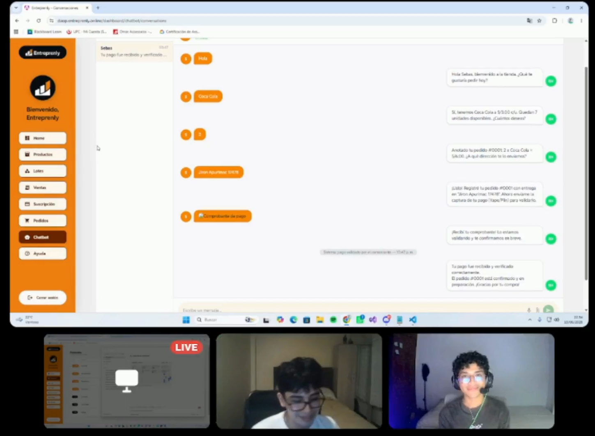
  </div>

  <!-- Datos en dos columnas -->
  <table style="width: 100%; border-collapse: collapse; font-size: 0.88em;">
    <tr>
      <td style="padding: 7px 14px; border: 1px solid #cfd8dc; width: 50%;">
        <strong>Entrevistado(a):</strong> Sebastián Curay
      </td>
      <td style="padding: 7px 14px; border: 1px solid #cfd8dc; width: 50%;">
        <strong>Edad:</strong> 19
      </td>
    </tr>
    <tr>
      <td style="padding: 7px 14px; border: 1px solid #cfd8dc;">
        <strong>Entrevistador(a):</strong> Fernando Flores
      </td>
      <td style="padding: 7px 14px; border: 1px solid #cfd8dc;">
        <strong>Distrito:</strong> San Martín de Porres, Lima
      </td>
    </tr>
    <tr>
      <td style="padding: 7px 14px; border: 1px solid #cfd8dc;">
        <strong>Inicio de la entrevista:</strong> 00:00
      </td>
      <td style="padding: 7px 14px; border: 1px solid #cfd8dc;">
        <strong>Duración:</strong> 09:50
      </td>
    </tr>
  </table>

  <!-- Link -->
  <table style="width: 100%; border-collapse: collapse; font-size: 0.88em;">
    <tr>
      <td style="padding: 7px 14px; border: 1px solid #cfd8dc;">
        <strong>Link de la entrevista:</strong>
        https://upcedupe-my.sharepoint.com/:v:/g/personal/u20241a290_upc_edu_pe/IQBA8Q70W8bCRoDGM1oUhrJdATc8nAY1ysMnwvptFJXACZk?nav=eyJyZWZlcnJhbEluZm8iOnsicmVmZXJyYWxBcHAiOiJTdHJlYW1XZWJBcHAiLCJyZWZlcnJhbFZpZXciOiJTaGFyZURpYWxvZy1MaW5rIiwicmVmZXJyYWxBcHBQbGF0Zm9ybSI6IldlYiIsInJlZmVycmFsTW9kZSI6InZpZXcifX0%3D&e=wdusaa
      </td>
    </tr>
  </table>

  <!-- Descripción -->
  <table style="width: 100%; border-collapse: collapse; font-size: 0.88em;">
    <tr>
      <td style="padding: 10px 14px; border: 1px solid #cfd8dc; line-height: 1.6;">
        Sebastián, cliente final de 19 años habituado a los pagos digitales (Yape y Plin), validó el Landing Page y el flujo de compra por el chatbot de WhatsApp realizando un pedido real durante la sesión (dos Coca-Colas, con entrega en Girón Apurímac y pago reportado mediante una captura de Yape). Sobre el Landing Page, indicó que comprendió la propuesta de valor y la encontró interesante, destacando que representa una forma más rápida de comprar y que poder ver el stock disponible le resulta útil. Respecto al pedido por el chatbot, lo percibió rápido y directo, con mensajes claros y bien enfocados. Valoró especialmente la confirmación de stock en tiempo real: comentó que en otros emprendimientos suele ocurrir que paga y luego le indican que el producto está agotado, le retrasan o le cancelan el pedido, por lo que ver la cantidad disponible al momento de consultar le da confianza para comprar.
        Sobre el pago, calificó el proceso de recibir las instrucciones y reportar el comprobante como claro, seguro, dinámico y sencillo, y señaló que recibir la confirmación automática del pedido le da tranquilidad al pagar por adelantado, pues le permite verificar que el pago fue confirmado y que no fue estafado ni perdió el tiempo. Indicó que el medio de pago ofrecido (Yape/Plin) le resulta cómodo por ser de uso generalizado. Manifestó preferir la atención por chatbot frente a la respuesta manual de una persona, por considerarla rápida y eficiente al estar todo automatizado. No identificó pasos confusos durante el flujo. Calificó con 5 sobre 5 la probabilidad de volver a comprar en una tienda que utilice este sistema, por considerarlo rápido, eficiente e intuitivo y fácil de usar para cualquier persona. Como mejora, sugirió que el mensaje de bienvenida del chatbot muestre un pequeño catálogo de los productos más solicitados o más vendidos y que, en caso de no estar disponibles, el cliente pueda escribir el producto para verificar su disponibilidad.
      </td>
    </tr>
  </table>

</div>

</div>

---

### 5.3.3. Evaluaciones según heurísticas

Esta sección presenta la evaluación heurística aplicada a **Entreprenly** durante la etapa de validación. La evaluación se organiza en tres grupos: heurísticas de usabilidad, arquitectura de información e inclusive design. Cada criterio incluye un puntaje del 1 al 5, la evidencia observada (referenciada por figura) y las oportunidades de mejora identificadas.

#### Catálogo de figuras

| Fig.    | Pantalla                                       | Archivo                                                 |
| ------- | ---------------------------------------------- | ------------------------------------------------------- |
| Fig. 1  | Panel de Inicio (Dashboard)                    | `Fig-01-panel-de-inicio.jpeg`                           |
| Fig. 2  | Catálogo de Productos                          | `Fig-02-catalogo-de-productos.png`                      |
| Fig. 3  | Modal "Editar Producto"                        | `Fig-03-modal-editar-producto.png`                      |
| Fig. 4  | Modal "Agregar Nuevo Producto"                 | `Fig-04-modal-agregar-producto.png`                     |
| Fig. 5  | Lotes de Inventario (vista general)            | `Fig-05-lotes-de-inventario.jpeg`                       |
| Fig. 6  | Panel de Alertas de Lotes                      | `Fig-06-panel-alertas-de-lotes.jpeg`                    |
| Fig. 7  | Modal "Agregar Nuevo Lote"                     | `Fig-07-modal-agregar-lote.jpeg`                        |
| Fig. 8  | Detalle de Lote (lote vencido)                 | `Fig-08-detalle-de-lote-vencido.jpeg`                   |
| Fig. 9  | Ventas – "Producto no encontrado"              | `Fig-09-ventas-producto-no-encontrado.png`              |
| Fig. 10 | Suscripción – Planes Free y Control            | `Fig-10-suscripcion-planes.png`                         |
| Fig. 11 | Suscripción – Límites, facturación e historial | `Fig-11-suscripcion-limites-facturacion-historial.png`  |
| Fig. 12 | Modal "Agregar método de pago"                 | `Fig-12-modal-agregar-metodo-de-pago.jpeg`              |
| Fig. 13 | Modal "Completar datos de facturación"         | `Fig-13-modal-datos-de-facturacion.jpeg`                |
| Fig. 14 | Modal "Historial de suscripción"               | `Fig-14-modal-historial-de-suscripcion.jpeg`            |
| Fig. 15 | Ventas – Registrar cantidad (teclado numérico) | `Fig-15-ventas-registrar-cantidad.png`                  |
| Fig. 16 | Centro de Ayuda                                | `Fig-16-centro-de-ayuda.jpeg`                           |
| Fig. 17 | Formulario "Reportar un problema"              | `Fig-17-reportar-un-problema.jpeg`                      |
| Fig. 18 | Artículo de ayuda "¿Cómo validar un pago?"     | `Fig-18-articulo-validar-un-pago.jpeg`                  |
| Fig. 19 | Perfil y configuración de cuenta               | `Fig-19-perfil-configuracion.png`                       |

---

#### 5.3.3.1. Heurísticas de usabilidad

En esta subsección se evalúa la experiencia de uso de Entreprenly tomando como referencia las heurísticas de Nielsen.

##### Visibilidad del estado del sistema — Puntaje: 5/5

Entreprenly comunica oportunamente el estado del sistema. El Panel de Inicio muestra en tiempo real el resumen del día (ventas, ingresos, pedidos y alertas), el estado del chatbot ("Activo") y el estado del inventario con etiquetas como "Vencido" y "Stock bajo". El panel de alertas de lotes notifica vencimientos y faltantes, y la vista de Suscripción refleja el plan activo y el consumo de límites mediante barras de progreso.

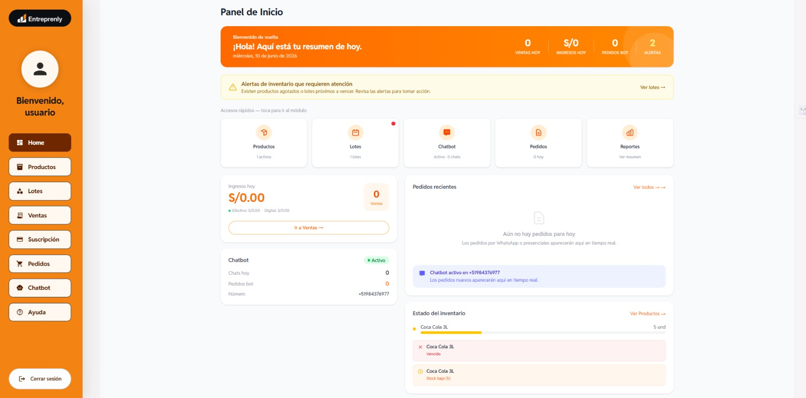


**Evidencia observada:** Fig. 1 (resumen y alertas del dashboard), Fig. 6 (notificaciones de lotes), Fig. 11 (uso del plan y estado de facturación).

**Mejora sugerida:** Añadir un _toast_ de confirmación visible tras guardar producto/lote, ya que el modal se cierra sin un mensaje persistente de éxito.

---

##### Relación entre el sistema y el mundo real — Puntaje: 5/5

El lenguaje es cercano al comerciante peruano: "Lotes", "Stock", "Caja diaria", "Boleta", "Yape/Plin", "RUC" y "Razón social". En las vistas de Lotes y de Datos de facturación se emplean términos fiscales y de inventario propios del rubro.

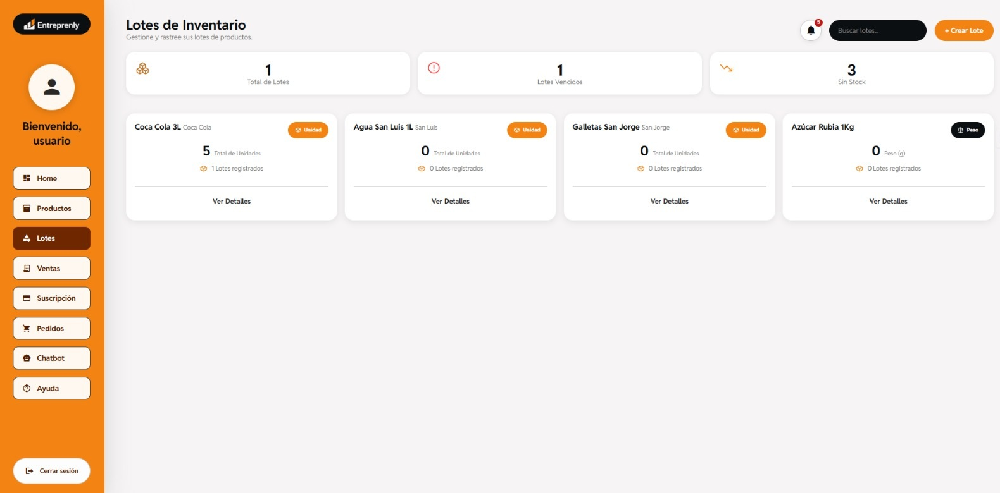

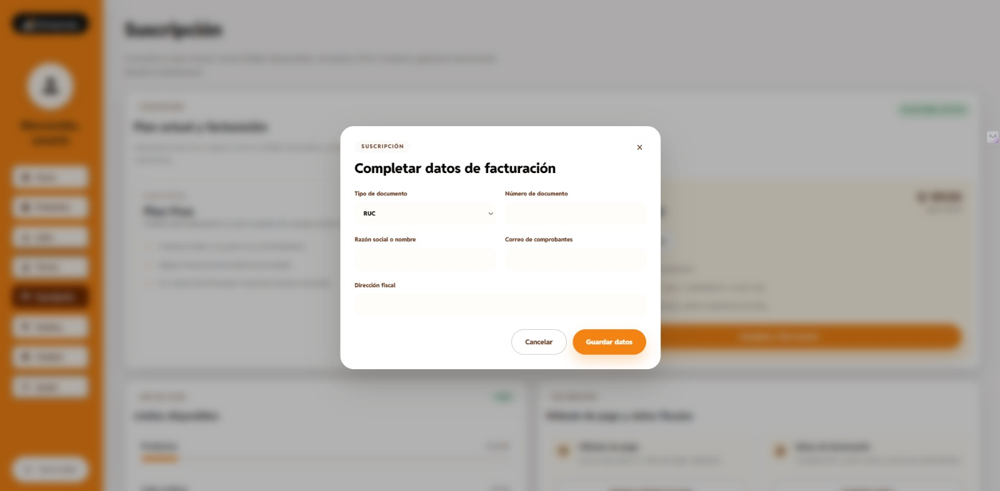

**Evidencia observada:** Fig. 5 (lotes/unidades), Fig. 8 (fecha de vencimiento), Fig. 13 (RUC, razón social, dirección fiscal), Fig. 9 ("Tarjeta – Yape/Plin").

**Mejora sugerida:** Incluir ayuda contextual (tooltip) en "Peso (g)" para productos a granel, diferenciándolo de "Unidad".

---

##### Libertad y control por parte del usuario — Puntaje: 5/5

Todos los modales tienen botón de cierre (×) y opción Cancelar; el detalle de lote ofrece "Volver"; el Perfil permite editar datos, cambiar contraseña, idioma, tema y notificaciones sin quedar atrapado. En Ventas existe "Cancelar Venta".

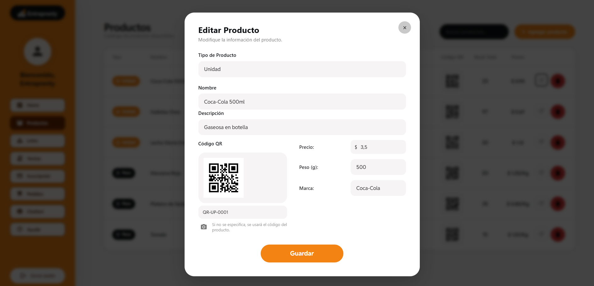

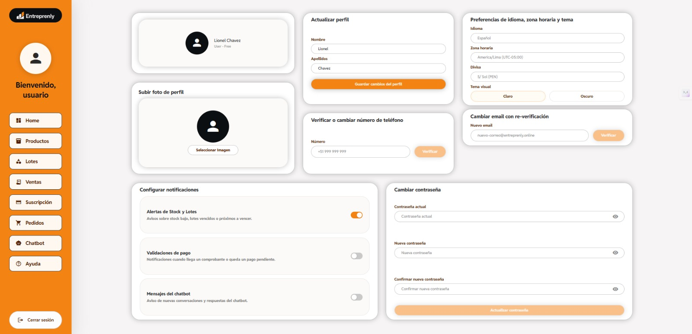

**Evidencia observada:** Fig. 3 y Fig. 4 (× y Cancelar en modales), Fig. 8 (botón Volver), Fig. 13 (Cancelar), Fig. 19 (edición libre de perfil).

**Mejora sugerida:** Agregar confirmación "¿Descartar cambios?" al cerrar un modal con campos ya editados, para evitar pérdidas accidentales.

---

##### Consistencia y estándares — Puntaje: 5/5

Se mantiene un patrón visual uniforme: sidebar naranja fija, tipografía estable, botones primarios naranjas, y tarjetas y tablas con el mismo estilo en Productos, Lotes, Ventas, Suscripción y Ayuda. La nomenclatura de navegación es consistente en todas las pantallas.

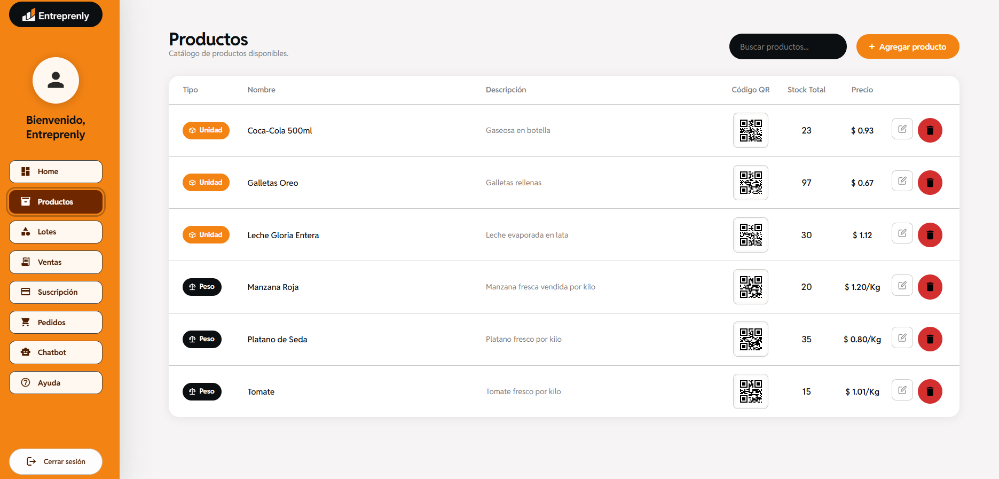

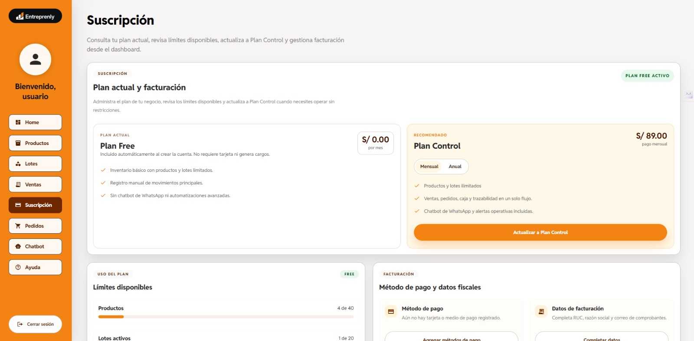

**Evidencia observada:** Fig. 1, Fig. 2, Fig. 5, Fig. 10 y Fig. 16 comparten layout, colores y jerarquía de botones.

**Mejora sugerida:** Unificar el estilo del botón "Volver" (Fig. 8, negro) con el resto de botones secundarios (blancos con borde).

---

##### Prevención de errores — Puntaje: 4/5

Los formularios usan campos guía y valores por defecto. En Agregar Producto el botón Guardar permanece atenuado hasta completar lo necesario; en Agregar Lote se solicitan fecha de ingreso y vencimiento; en Datos de facturación y Método de pago se marcan formatos esperados (tarjeta, CVV, RUC).

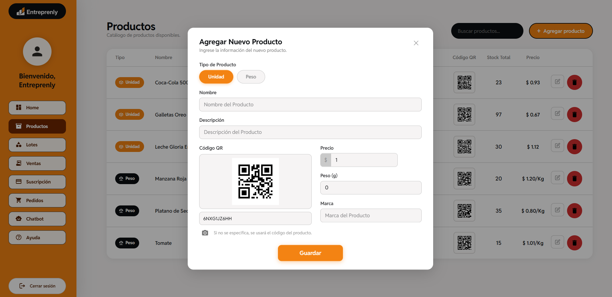

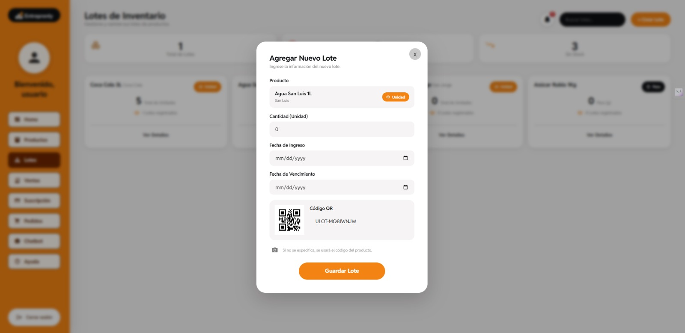

**Evidencia observada:** Fig. 4 (Guardar atenuado), Fig. 7 (fechas obligatorias), Fig. 12 y Fig. 13 (formatos guía).

**Mejora sugerida:** Validar en línea que la _Fecha de Vencimiento_ sea posterior a la _Fecha de Ingreso_ y advertir antes de registrar un lote ya vencido.

---

##### Reconocer antes que recordar — Puntaje: 5/5

El dashboard ofrece "Accesos rápidos" con íconos y una sidebar siempre visible con etiquetas de texto. El usuario reconoce los módulos sin memorizar rutas; las tarjetas resumen muestran lo relevante de un vistazo.


**Evidencia observada:** Fig. 1 (accesos rápidos e íconos), sidebar persistente en todas las figuras, Fig. 16 (categorías con íconos).

**Mejora sugerida:** Resaltar de forma más marcada el ítem activo del menú para reforzar la ubicación del usuario.

---

##### Flexibilidad y eficiencia en el uso — Puntaje: 4/5

Existen atajos (accesos rápidos del dashboard), buscador de lotes, descarga de historial, teclado numérico para registrar cantidad en ventas y generación automática de código QR, lo que agiliza tanto al usuario nuevo como al recurrente.

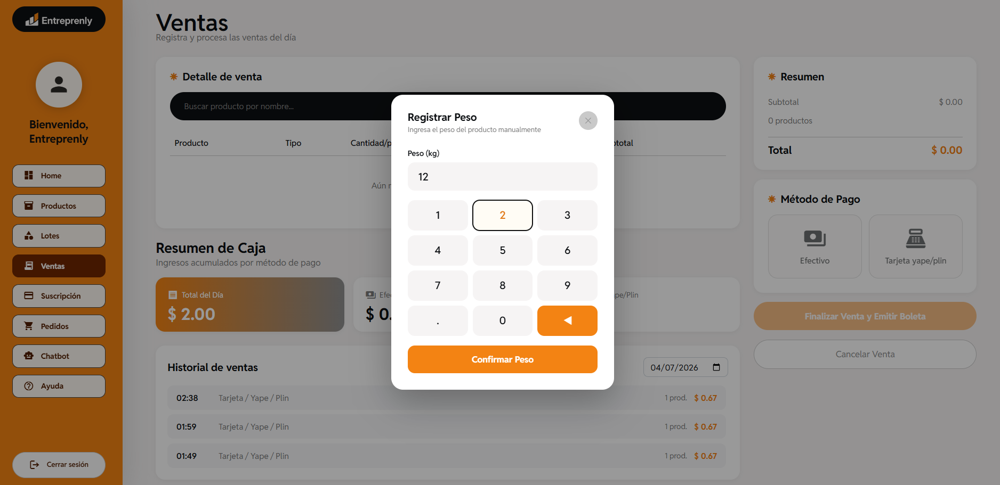


**Evidencia observada:** Fig. 1 (accesos rápidos), Fig. 14 (Descargar historial), Fig. 15 (teclado numérico), Fig. 2 (QR por producto).

**Mejora sugerida:** Incorporar búsqueda/filtros en el catálogo de Productos y atajos de teclado en el módulo de Ventas para usuarios avanzados.

---

##### Diseño estético y minimalista — Puntaje: 5/5

La interfaz mantiene jerarquía clara y bajo ruido visual: uso consistente del naranja como color de acción, espacios en blanco amplios y tarjetas bien delimitadas en Suscripción y en el dashboard.


**Evidencia observada:** Fig. 1, Fig. 10 (cards de planes), Fig. 16 (centro de ayuda ordenado).

**Mejora sugerida:** En el dashboard, equilibrar la densidad de la zona inferior (estado de inventario) para evitar acumulación de tarjetas pequeñas.

---

##### Ayuda a los usuarios a reconocer, diagnosticar y recuperarse de los errores — Puntaje: 4/5

El sistema señala errores con color y texto: en Ventas muestra "⊘ Producto no encontrado"; en Lotes marca el lote "Vencido" en rojo con la fecha. Los estados de error son reconocibles.

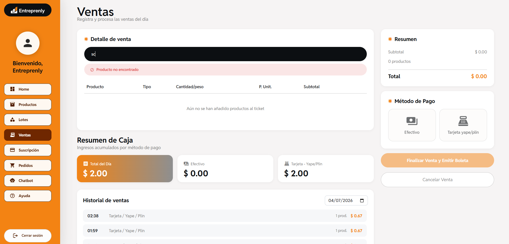

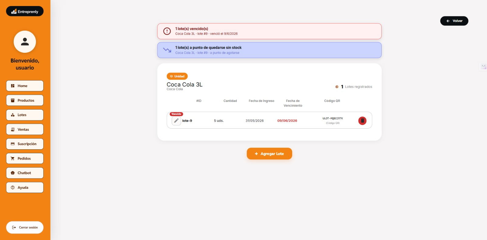

**Evidencia observada:** Fig. 9 (producto no encontrado), Fig. 8 (lote vencido), Fig. 11 (estados "pendiente de completar").

**Mejora sugerida:** Que el mensaje "Producto no encontrado" sugiera la acción siguiente (p. ej. "Verifica el nombre o créalo en Productos"), explicando cómo recuperarse y no solo qué ocurrió.

---

##### Ayuda y documentación — Puntaje: 5/5

Cuenta con un Centro de Ayuda con artículos frecuentes, categorías, buscador y datos de soporte (correo, WhatsApp, horario); artículos paso a paso; y un formulario para reportar problemas con tiempos de respuesta.

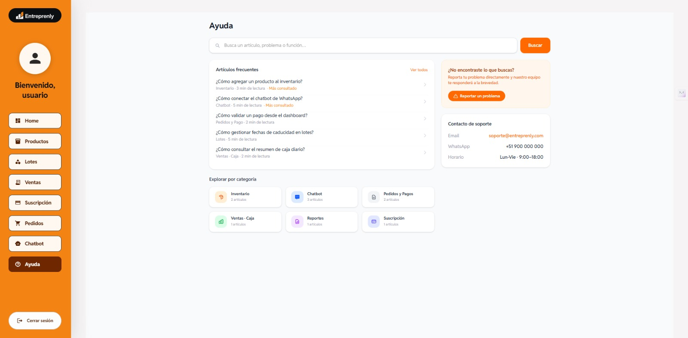

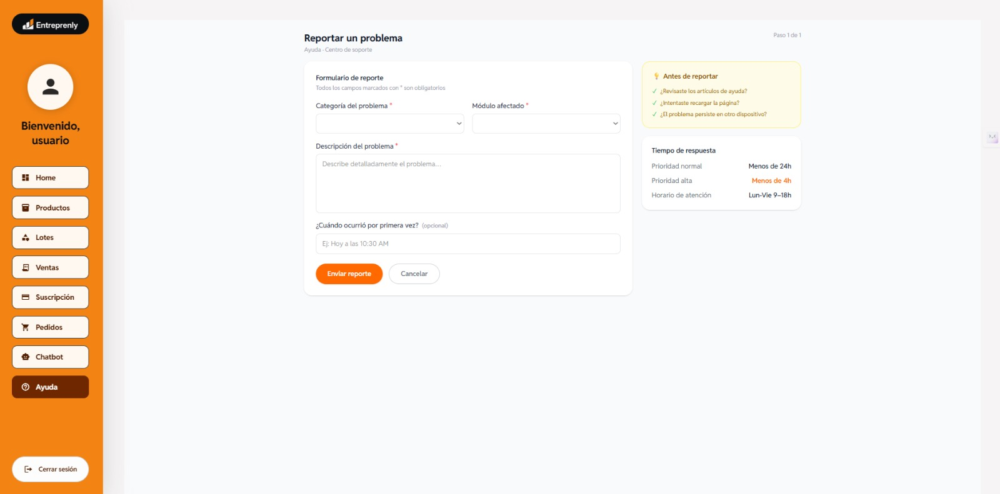


**Evidencia observada:** Fig. 16 (artículos y soporte), Fig. 17 (reporte de problema), Fig. 18 (guía "¿Cómo validar un pago?").

**Mejora sugerida:** Enlazar ayuda contextual ("?") desde cada módulo directamente al artículo correspondiente del centro de ayuda.

---

#### 5.3.3.2. Arquitectura de información

En esta subsección se evalúa si la organización de la información permite encontrar, comprender y utilizar el contenido de forma clara.

##### Is it findable? — Puntaje: 5/5

Las funciones principales se ubican en la sidebar fija y en los accesos rápidos del dashboard; el Centro de Ayuda agrupa soporte y FAQ por categorías.


**Evidencia observada:** Fig. 1, Fig. 16, navegación lateral presente en todas las figuras.

**Mejora sugerida:** Añadir un buscador global en el header del dashboard.

---

##### Is it accessible? — Puntaje: 4/5

Buen contraste (texto oscuro sobre blanco, acción naranja), etiquetas visibles y opción de tema Claro/Oscuro e idioma/zona horaria configurables.

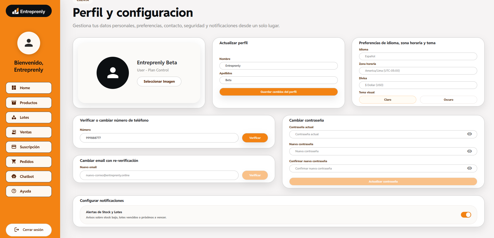

**Evidencia observada:** Fig. 19 (preferencias de tema/idioma), formularios con labels (Fig. 4, Fig. 13).

**Mejora sugerida:** Validar el contraste del texto blanco sobre naranja (banner del dashboard) y confirmar el comportamiento responsivo en móvil/tablet.

---

##### Is it clear? — Puntaje: 5/5

Títulos y subtítulos describen cada sección ("Catálogo de productos disponibles", "Registra y procesa las ventas del día"); los modales incluyen título y descripción.


**Evidencia observada:** Fig. 2, Fig. 5, Fig. 8 (encabezados descriptivos).

**Mejora sugerida:** Acompañar las barras de "Límites disponibles" con una leyenda del significado al alcanzar el tope.

---

##### Is it communicative? — Puntaje: 5/5

La interfaz informa en el momento adecuado: estado del plan, stock, alertas de lotes y actividad de suscripción.

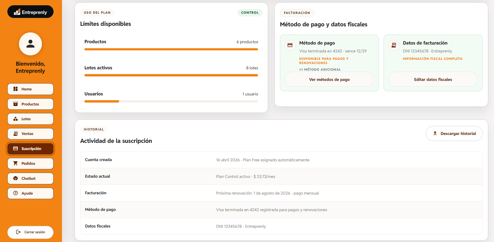

**Evidencia observada:** Fig. 1 (resumen), Fig. 6 (alertas), Fig. 11 (historial/estado de facturación).

**Mejora sugerida:** Mostrar contadores de notificaciones también en la sidebar (módulos Lotes/Pedidos).

---

##### Is it usable? — Puntaje: 4/5

Las tareas principales se completan sin asistencia: alta de productos y lotes, registro de ventas, gestión de suscripción, método de pago, datos fiscales y descarga de historial.

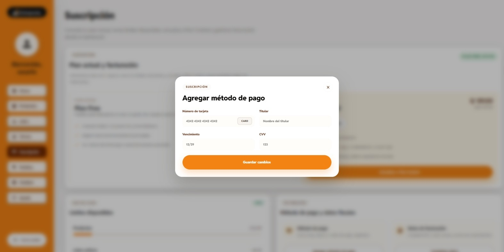

**Evidencia observada:** Fig. 4, Fig. 7, Fig. 12, Fig. 13, Fig. 14, Fig. 15.

**Mejora sugerida:** Guiar el primer registro con un mini-onboarding; los módulos vacíos ya muestran estados como "Aún no hay pedidos".

---

##### Is it credible? — Puntaje: 5/5

Transmite confianza con precios transparentes, identidad visual coherente, datos de soporte reales y una propuesta de valor clara.

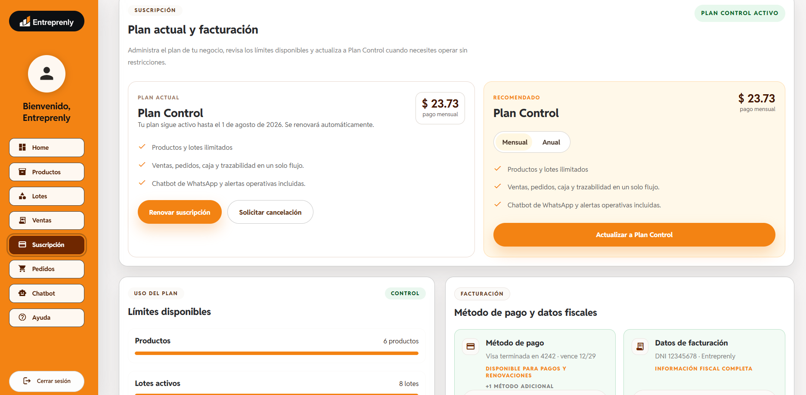

**Evidencia observada:** Fig. 10 (planes y precios), Fig. 16 (soporte con correo/WhatsApp/horario).

**Mejora sugerida:** Incluir un sello/nota de seguridad de pago en el modal de tarjeta (Fig. 12).

---

##### Is it controllable? — Puntaje: 5/5

El usuario cambia de sección, cancela acciones, mantiene su plan, edita su perfil y vuelve a estados previos (botón Volver, ×, Cancelar).


**Evidencia observada:** Fig. 8 (Volver), Fig. 13 (Cancelar), Fig. 19 (control total del perfil).

**Mejora sugerida:** Confirmar antes de cerrar modales con cambios sin guardar.

---

##### Is it valuable? — Puntaje: 5/5

Aporta valor real: control de stock y vencimientos, conciliación de caja por método de pago, pedidos por WhatsApp vía chatbot y gestión de suscripción.


**Evidencia observada:** Fig. 1 (caja por método de pago), Fig. 6 (vencimientos), Fig. 10 (valor del plan Control).

**Mejora sugerida:** Resaltar en el dashboard el beneficio acumulado (p. ej. mermas evitadas por alertas de vencimiento).

---

##### Is it learnable? — Puntaje: 5/5

Patrones repetidos, labels claros y guías paso a paso facilitan el aprendizaje.


**Evidencia observada:** Fig. 4 (formulario autoexplicativo), Fig. 18 (artículo paso a paso).

**Mejora sugerida:** Tour interactivo opcional en el primer ingreso.

---

##### Is it delightful? — Puntaje: 4/5

La experiencia es fluida, limpia y profesional, con estados claros y sensación de control.


**Evidencia observada:** Fig. 1, Fig. 10 (estética cuidada).

**Mejora sugerida:** Sumar microinteracciones (animación al guardar, checkmark al finalizar una venta) para reforzar la satisfacción.

---

#### 5.3.3.3. Inclusive design

En esta subsección se evalúa si Entreprenly considera distintos contextos de uso, niveles de experiencia digital y necesidades de accesibilidad.

##### Principio 1: Proporciona experiencias comparables — Puntaje: 5/5

Los puntos de contacto (dashboard, módulos, soporte y chatbot) ofrecen una experiencia equivalente y coherente; el chatbot habilita la compra por WhatsApp como canal alterno.


**Evidencia observada:** Fig. 1 (chatbot activo), Fig. 16 (soporte), navegación uniforme en todas las figuras.

**Mejora sugerida:** Garantizar paridad de la experiencia en la versión móvil del dashboard.

---

##### Principio 2: Considera la situación del usuario — Puntaje: 5/5

Responde a contextos reales de tienda: registro ágil de ventas con teclado numérico, cierre de caja por método de pago, revisión rápida de stock y alertas, y pedidos por WhatsApp en horas de demanda.


**Evidencia observada:** Fig. 15 (registro rápido), Fig. 1 (resumen de caja), Fig. 6 (alertas operativas).

**Mejora sugerida:** Modo de venta rápida a pantalla completa para horas pico.

---

##### Principio 3: Sé consistente — Puntaje: 5/5

Botones, formularios, mensajes y navegación se mantienen consistentes en todos los módulos.


**Evidencia observada:** Fig. 2, Fig. 5, Fig. 10, Fig. 16 (mismo sistema visual).

**Mejora sugerida:** Homogeneizar el estilo del botón "Volver" (Fig. 8).

---

##### Principio 4: Deja al usuario mandar — Puntaje: 5/5

El usuario conserva autonomía: editar perfil, mantener su plan, cancelar, corregir y cerrar popups.


**Evidencia observada:** Fig. 19 (perfil), Fig. 3 (editar), Fig. 13 (Cancelar), Fig. 14 (descargar/cerrar).

**Mejora sugerida:** Permitir deshacer la última acción en Ventas (quitar un producto agregado por error).

---

##### Principio 5: Ofrece opciones — Puntaje: 5/5

Brinda alternativas de navegación y acción: botones primarios y secundarios, sidebar, accesos rápidos, FAQ, reporte de problema y métodos de pago Efectivo / Tarjeta-Yape/Plin.


**Evidencia observada:** Fig. 9 (métodos de pago), Fig. 16 (FAQ + reporte), Fig. 1 (accesos rápidos).

**Mejora sugerida:** Hacer más visible la comparación de ahorro entre el plan Mensual y Anual (el toggle ya existe en Fig. 10).

---

##### Principio 6: Prioriza el contenido — Puntaje: 5/5

El contenido más importante aparece primero: resumen del día y alertas en el tope del dashboard; plan recomendado destacado en Suscripción.


**Evidencia observada:** Fig. 1 (jerarquía del resumen), Fig. 10 (Plan Control "Recomendado" resaltado).

**Mejora sugerida:** Priorizar visualmente las alertas críticas (vencidos) sobre las informativas.

---

##### Principio 7: Agrega valor — Puntaje: 5/5

Genera beneficios concretos: ahorro de tiempo, menos errores, confianza en el stock, control de caja, automatización por chatbot y claridad de suscripción.


**Evidencia observada:** Fig. 6 (evita mermas), Fig. 1 (control de caja), Fig. 10 (valor del plan), Fig. 18 (autoservicio de soporte).

**Mejora sugerida:** Agregar reportes/indicadores de tendencia (ventas semanales, productos más vendidos) para reforzar el valor analítico.

---

#### Resumen de puntajes

| Grupo                                       | Promedio    |
| ------------------------------------------- | ----------- |
| 5.3.3.1 Heurísticas de usabilidad (Nielsen) | **4.7 / 5** |
| 5.3.3.2 Arquitectura de información         | **4.8 / 5** |
| 5.3.3.3 Inclusive design                    | **5.0 / 5** |

---

## 5.4. Video About-the-Product

En esta sección se presenta el video **About-the-Product** de Entreprenly, una pieza de orientación promocional que resume el modelo de negocio, las características y los beneficios del producto. El video, de una duración de entre uno y tres minutos, parte de los dolores cotidianos de un negocio de barrio —el inventario llevado en cuaderno, los productos que se vencen y los pedidos de WhatsApp que no paran— para presentar a **Entreprenly como la plataforma que digitaliza el negocio de retail integrando inventario, ventas y atención por WhatsApp en un solo lugar**. A lo largo de la narración se muestran sus capacidades centrales: el control del stock en tiempo real con alertas anticipadas de vencimiento y desabastecimiento, el registro de ventas en segundos con cuadre de caja que separa automáticamente el efectivo de los medios digitales, y un chatbot que atiende los pedidos por WhatsApp de forma automática —confirmando stock y registrando la venta— de modo que el comerciante solo aprueba el pago.

El video incluye escenas de interacción real con el producto (navegación por el dashboard de inventario, registro de ventas y el flujo de pedido por el chatbot) y recoge **al menos una opinión por cada segmento objetivo**. Por el **Segmento 1 (Comerciantes)** participa Stephanie, dueña de negocio, quien destaca que la plataforma reúne inventario, ventas y caja en un solo lugar de forma ordenada, frente a su método anterior basado en cuaderno y celular; resalta el ahorro de tiempo, la prevención de pérdidas gracias a las alertas de vencimiento y la rapidez al cuadrar la caja, y califica con 5/5 la probabilidad de volver a comprar en una tienda que use el sistema por considerarlo rápido, eficiente e intuitivo. Por el **Segmento 2 (Clientes Finales)** se incorpora la apreciación de Sebastián (registrada en la sección 5.3.2), quien valora la confirmación de stock en tiempo real y la atención automatizada por el chatbot de WhatsApp como un proceso claro, seguro y rápido.

El video fue subido a **Microsoft Stream** y a **YouTube**. A continuación se incluye un screenshot del video con su respectivo enlace.

<div align="center">
<div style="font-family: 'Segoe UI', sans-serif; max-width: 680px; margin: 24px auto; border: 1.5px solid #b0bec5; border-radius: 4px; overflow: hidden; box-shadow: 0 2px 8px rgba(0,0,0,0.12);">

  <!-- Encabezado -->
  <div style="background-color: #1a6b6b; color: white; padding: 10px 16px; font-weight: 700; font-size: 1.1em; letter-spacing: 0.05em;">
  Video About-the-Product — Entreprenly
  </div>

  <!-- Imagen de la captura de pantalla -->
  <div style="background-color: #1a6b6b; padding: 12px 16px 16px;">
    
  </div>

  <!-- Links -->
  <table style="width: 100%; border-collapse: collapse; font-size: 0.88em;">
    <tr>
      <td style="padding: 7px 14px; border: 1px solid #cfd8dc;">
        <strong>Link del video (Microsoft Stream):</strong>
        https://upcedupe-my.sharepoint.com/:v:/g/personal/u20241a290_upc_edu_pe/IQDfgKOGczm3Roa6mGkHpnlUASMttHELFOUS6kC67yLAjNM?nav=eyJyZWZlcnJhbEluZm8iOnsicmVmZXJyYWxBcHAiOiJTdHJlYW1XZWJBcHAiLCJyZWZlcnJhbFZpZXciOiJTaGFyZURpYWxvZy1MaW5rIiwicmVmZXJyYWxBcHBQbGF0Zm9ybSI6IldlYiIsInJlZmVycmFsTW9kZSI6InZpZXcifX0%3D&e=xEBstE
      </td>
    </tr>
    <tr>
      <td style="padding: 7px 14px; border: 1px solid #cfd8dc;">
        <strong>Link del video (YouTube):</strong>
        https://youtu.be/nPIHYqd0MtM
      </td>
    </tr>
  </table>

</div>
</div>
