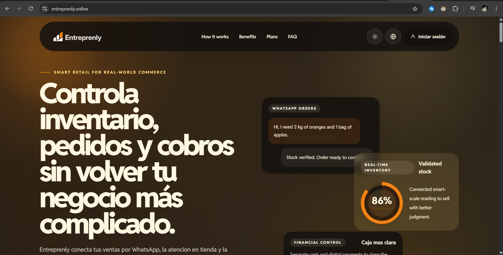
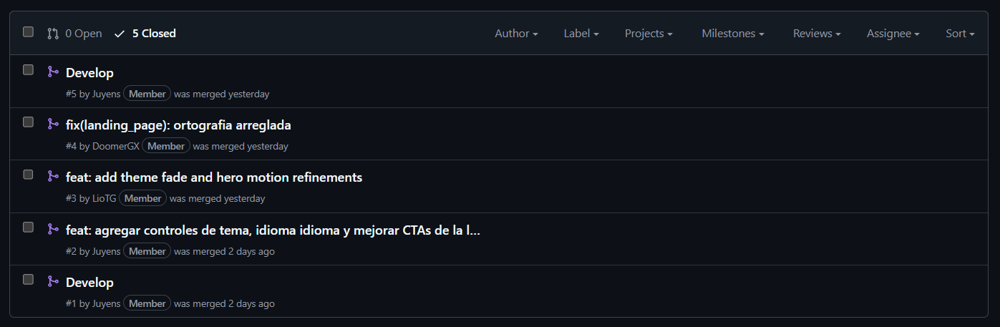
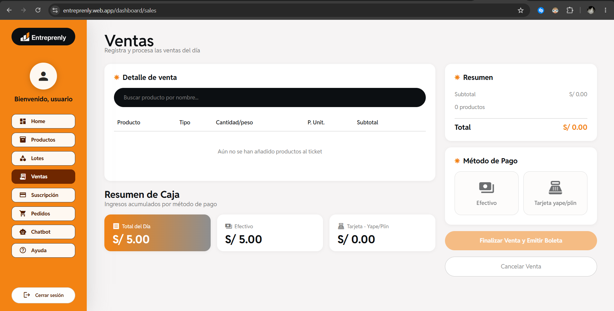
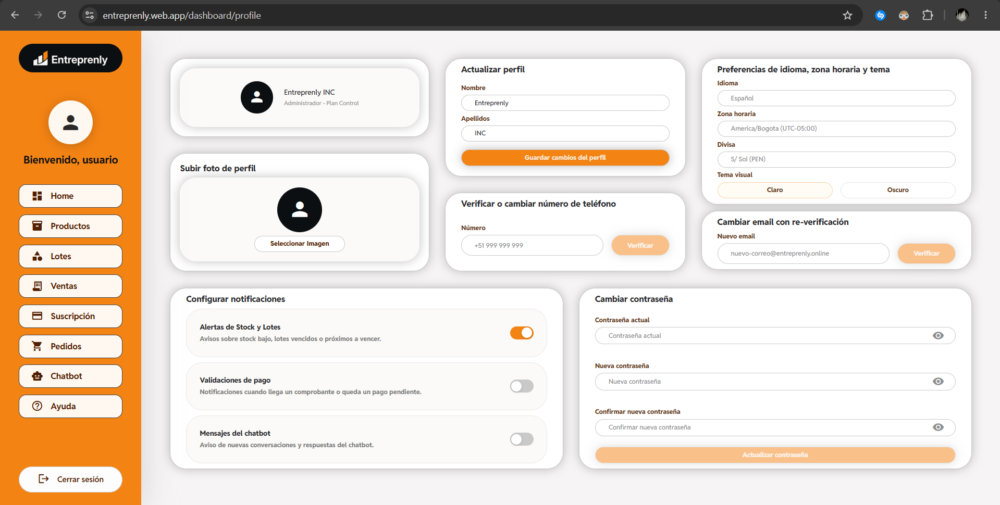
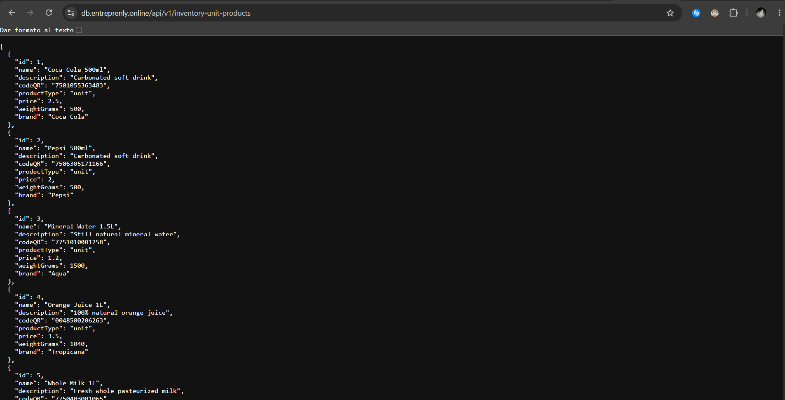
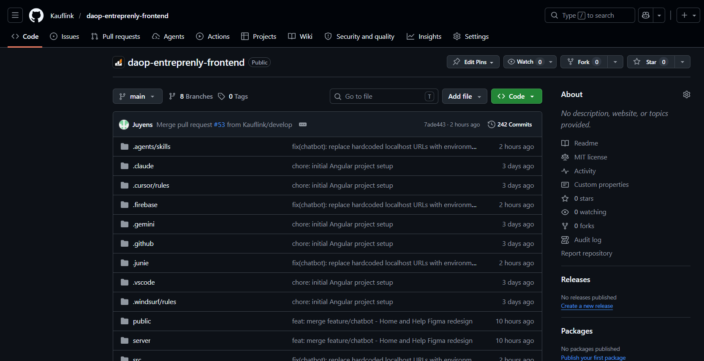
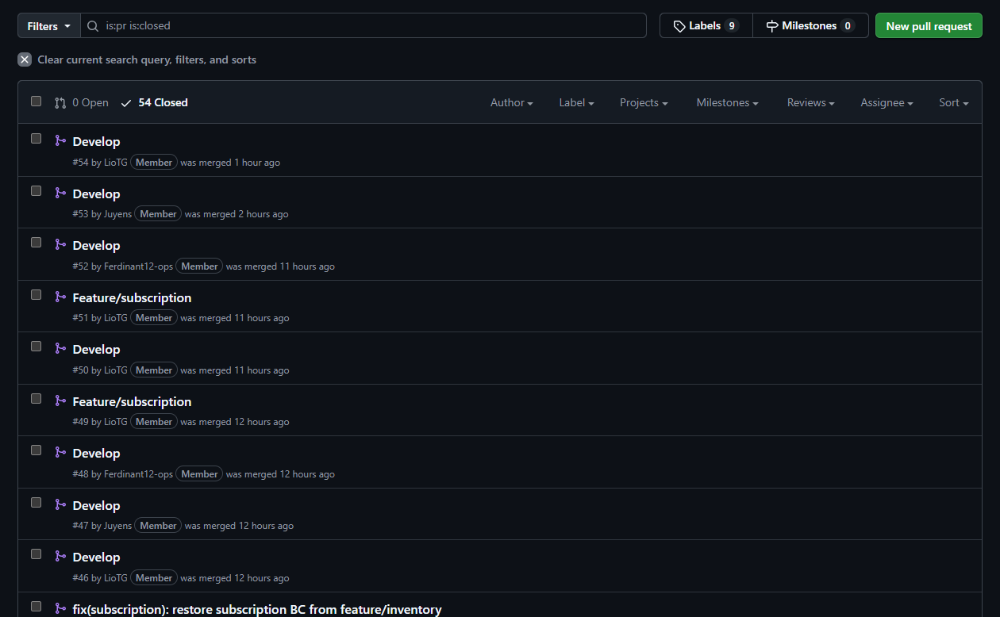
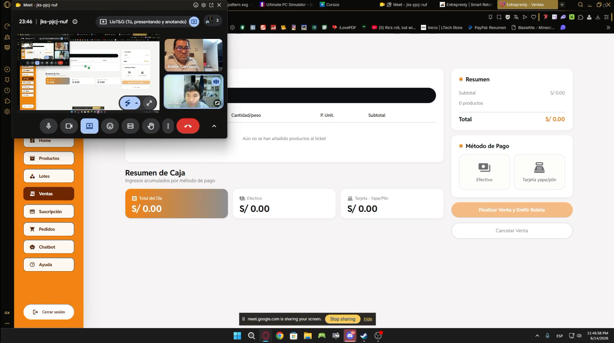

# Capítulo V: Product Implementation, Validation & Deployment

## 5.1. Software Configuration Management

### 5.1.1. Software Development Environment Configuration

En esta sección se detallan las herramientas, frameworks y plataformas utilizadas por el equipo para el desarrollo colaborativo durante todo el ciclo de vida del producto digital. Se han considerado actividades de Project Management, Requirements Management, UX/UI Design, Software Development, Documentation y Deployment.

**Project Management**

<table>
  <thead>
    <tr>
      <th>Producto</th>
      <th>Propósito de uso</th>
      <th>Ruta de Referencia / Descarga</th>
    </tr>
  </thead>
  <tbody>
    <tr>
      <td><strong>Jira</strong></td>
      <td>Herramienta principal para la gestión del proyecto, administración del Product Backlog y seguimiento de Sprints bajo metodología ágil.</td>
      <td><a href="https://www.atlassian.com/software/jira">https://www.atlassian.com/software/jira</a></td>
    </tr>
  </tbody>
</table>

**Requirements Management**

<table>
  <thead>
    <tr>
      <th>Producto</th>
      <th>Propósito de uso</th>
      <th>Ruta de Referencia / Descarga</th>
    </tr>
  </thead>
  <tbody>
    <tr>
      <td><strong>UXPressia</strong></td>
      <td>Utilizado para la gestión de requerimientos, específicamente para la creación de User Personas, Empathy Maps e Impact Maps.</td>
      <td><a href="https://uxpressia.com/">https://uxpressia.com/</a></td>
    </tr>
  </tbody>
</table>

**Product UX/UI Design**

<table>
  <thead>
    <tr>
      <th>Producto</th>
      <th>Propósito de uso</th>
      <th>Ruta de Referencia / Descarga</th>
    </tr>
  </thead>
  <tbody>
    <tr>
      <td><strong>Figma</strong></td>
      <td>Herramienta de diseño UX/UI para la elaboración de Wireframes, Mock-ups y Prototipos interactivos.</td>
      <td><a href="https://www.figma.com/">https://www.figma.com/</a></td>
    </tr>
    <tr>
      <td><strong>Miro</strong></td>
      <td>Plataforma de colaboración visual empleada en las sesiones de EventStorming (Big Picture y Design-Level) para el modelado del dominio.</td>
      <td><a href="https://miro.com/">https://miro.com/</a></td>
    </tr>
  </tbody>
</table>

**Software Development**

<table>
  <thead>
    <tr>
      <th>Producto</th>
      <th>Propósito de uso</th>
      <th>Ruta de Referencia / Descarga</th>
    </tr>
  </thead>
  <tbody>
    <tr>
      <td><strong>Structurizr</strong></td>
      <td>Herramienta para el diseño y documentación de la arquitectura de software siguiendo el modelo C4 (Context, Container, Component, Code).</td>
      <td><a href="https://structurizr.com/">https://structurizr.com/</a></td>
    </tr>
    <tr>
      <td><strong>MySQL Workbench</strong></td>
      <td>Utilizado para el diseño de base de datos, permitiendo la creación de diagramas entidad-relación y la gestión de la persistencia de datos.</td>
      <td><a href="https://www.mysql.com/products/workbench/">https://www.mysql.com/products/workbench/</a></td>
    </tr>
    <tr>
      <td><strong>Visual Studio Code</strong></td>
      <td>Entorno de desarrollo (IDE) principal para la implementación de la Landing Page y la aplicación Frontend.</td>
      <td><a href="https://code.visualstudio.com/">https://code.visualstudio.com/</a></td>
    </tr>
    <tr>
      <td><strong>GitHub Desktop</strong></td>
      <td>Cliente de Git utilizado para facilitar el Source Code Management y la implementación del flujo de trabajo GitFlow en el equipo.</td>
      <td><a href="https://desktop.github.com/">https://desktop.github.com/</a></td>
    </tr>
    <tr>
      <td><strong>Spring Boot / Java</strong></td>
      <td>Framework y lenguaje principal para el desarrollo de los RESTful Web Services que conforman el Backend de la aplicación.</td>
      <td><a href="https://spring.io/projects/spring-boot">https://spring.io/projects/spring-boot</a></td>
    </tr>
    <tr>
      <td><strong>Angular / TypeScript</strong></td>
      <td>Framework y lenguaje utilizados para la construcción de la Frontend Web Application de la plataforma.</td>
      <td><a href="https://angular.io/">https://angular.io/</a></td>
    </tr>
    <tr>
      <td><strong>Node.js</strong></td>
      <td>Entorno de ejecución JavaScript requerido para ejecutar Angular CLI y las herramientas de build y gestión de dependencias del Frontend.</td>
      <td><a href="https://nodejs.org/">https://nodejs.org/</a></td>
    </tr>
  </tbody>
</table>

**Software Documentation**

<table>
  <thead>
    <tr>
      <th>Producto</th>
      <th>Propósito de uso</th>
      <th>Ruta de Referencia / Descarga</th>
    </tr>
  </thead>
  <tbody>
    <tr>
      <td><strong>Swagger / OpenAPI</strong></td>
      <td>Empleado para la documentación técnica de los endpoints del RESTful API, permitiendo su exploración y prueba interactiva.</td>
      <td><a href="https://swagger.io/">https://swagger.io/</a></td>
    </tr>
    <tr>
      <td><strong>Markdown</strong></td>
      <td>Lenguaje de marcado utilizado para la elaboración y mantenimiento de la documentación general del proyecto alojada en GitHub.</td>
      <td><a href="https://www.markdownguide.org/">https://www.markdownguide.org/</a></td>
    </tr>
  </tbody>
</table>

**Software Deployment**

<table>
  <thead>
    <tr>
      <th>Producto</th>
      <th>Propósito de uso</th>
      <th>Ruta de Referencia / Descarga</th>
    </tr>
  </thead>
  <tbody>
    <tr>
      <td><strong>Google Cloud Platform</strong></td>
      <td>Proveedor de infraestructura cloud utilizado para el despliegue y hospedaje de los servicios Backend y aplicaciones en producción.</td>
      <td><a href="https://cloud.google.com/">https://cloud.google.com/</a></td>
    </tr>
    <tr>
      <td><strong>GitHub Pages</strong></td>
      <td>Servicio de hosting estático utilizado para el despliegue continuo de la Landing Page del producto.</td>
      <td><a href="https://pages.github.com/">https://pages.github.com/</a></td>
    </tr>
  </tbody>
</table>

### 5.1.2. Source Code Management

Para la gestión del código fuente y el seguimiento de modificaciones, el equipo utiliza GitHub como plataforma principal y Git como sistema de control de versiones distribuido. Se han establecido repositorios independientes para cada producto de la solución, asegurando que el repositorio de Web Services incluya tanto el proyecto como los archivos de pruebas unitarias, de integración y de aceptación.

**Repositorios del Proyecto**

| Producto | URL del Repositorio |
| :--- | :--- |
| **Landing Page** | https://github.com/Kauflink/landing-entreprenly |
| **Web Services** | https://github.com/Kauflink/daop-entreprenly-web-services | 
| **Frontend Web Application** | https://github.com/Kauflink/daop-entreprenly-web-applications |

**Estrategia de Flujo de Trabajo: GitFlow**

El equipo implementa el modelo GitFlow como workflow de control de versiones para organizar el desarrollo colaborativo de forma estructurada. Este flujo permite trabajar en múltiples funcionalidades en paralelo sin afectar la estabilidad de la rama principal.

Se han definido las siguientes ramas fundamentales:

- **main**: Es la rama principal que contiene el código fuente en estado de producción. Cada versión integrada aquí debe estar etiquetada con un número de versión.

- **develop**: Rama base para el desarrollo donde se integran todas las funcionalidades completadas para pruebas antes de un lanzamiento.

- **feature**: Ramas temporales creadas para desarrollar nuevas funcionalidades o historias de usuario específicas.

- **release**: Ramas utilizadas para preparar un nuevo lanzamiento oficial, permitiendo realizar ajustes menores y correcciones de errores finales.

- **hotfix**: Ramas de emergencia creadas directamente desde main para solucionar errores críticos detectados en el entorno de producción.

**Convenciones de Nombres para Ramas**

Para mantener la trazabilidad y el orden en los repositorios, se aplican las siguientes convenciones de nomenclatura:

- **Feature Branches**: feature/US-[ID-Historia]-[Nombre]
- **Release Branches**: release/v[Major.Minor.Patch]
- **Hotfix Branches**: hotfix/[Descripcion-Error]

**Versionamiento Semántico**

El equipo adopta el estándar Semantic Versioning 2.0.0 para el nombramiento de los lanzamientos. Las versiones se estructuran siguiendo el formato MAJOR.MINOR.PATCH:

1. MAJOR: Incrementado cuando se realizan cambios incompatibles en la API.
2. MINOR: Incrementado cuando se añade funcionalidad de manera retrocompatible.
3. PATCH: Incrementado cuando se realizan correcciones de errores retrocompatibles.

**Estándar de Mensajes de Commit**

Para asegurar un historial de cambios legible y facilitar la automatización, se utiliza la especificación de Conventional Commits para todos los mensajes de commit. La estructura utilizada es [tipo]:[descripción breve], empleando los siguientes prefijos:

- feat: Incorporación de una nueva funcionalidad.
- fix: Corrección de un error o bug.
- docs: Modificaciones exclusivamente en la documentación.
- style: Cambios de formato o estética que no afectan la lógica del código.
- refactor: Reestructuración de código que no añade funciones ni corrige errores.
- test: Adición o actualización de pruebas

### 5.1.3. Source Code Style Guide & Conventions

En esta sección se establecen las guías de estilo y convenciones de codificación adoptadas por el equipo de Kauflink para el desarrollo de los productos digitales que conforman la solución **Entreprenly**. El objetivo es garantizar que el código fuente sea legible, mantenible y coherente entre todos los miembros del equipo, independientemente del componente o capa de la arquitectura en la que se trabaje. Como regla general, **toda nomenclatura de elementos en el código fuente se redacta en inglés**, incluyendo nombres de variables, clases, métodos, componentes, atributos y comentarios técnicos.

Las referencias adoptadas para cada lenguaje y tecnología utilizada en la solución se detallan a continuación.

#### HTML

Para el desarrollo del Landing Page de Entreprenly, el equipo adopta como referencia principal la **HTML Style Guide and Coding Conventions** de W3Schools y la **Google HTML/CSS Style Guide**.

Las convenciones aplicadas son las siguientes:

- Se utiliza **HTML5** como estándar de marcado, declarando siempre el `DOCTYPE` al inicio del documento: `<!DOCTYPE html>`.
- Los nombres de los elementos y atributos se escriben en **minúsculas** (`<section>`, `<article>`, `class="hero-section"`).
- Los atributos se encierran siempre entre **comillas dobles**: ``.
- Se incluyen los atributos `lang` en la etiqueta `<html>` para indicar el idioma de la página: `<html lang="en">`.
- Todas las imágenes incluyen el atributo `alt` con una descripción significativa, como parte del enfoque de accesibilidad (a11y) del proyecto.
- Se utiliza **indentación de 2 espacios** para mantener la legibilidad del árbol de elementos.
- Los elementos de bloque se escriben en líneas separadas; los elementos en línea pueden mantenerse en una misma línea si el resultado es conciso.
- Se evita el uso de estilos en línea (`style=""`); todo el estilo visual se delega a las hojas de estilo CSS externas o a las clases de Angular Material.
- Los comentarios se utilizan para delimitar secciones principales del documento: `<!-- Hero Section -->`.

#### CSS

Para el estilo visual del Landing Page de Entreprenly, el equipo adopta la **Google HTML/CSS Style Guide** como guía de referencia, complementada con las convenciones del sistema de diseño basado en **Material Design**.

Las convenciones aplicadas son las siguientes:

- Los nombres de clases se escriben en **kebab-case**: `.hero-section`, `.cta-button`, `.nav-link`.
- Se evita el uso de selectores de ID para estilos; se prefieren selectores de clase por su reutilizabilidad.
- Las propiedades dentro de cada regla se ordenan de forma **alfabética** para facilitar la lectura y comparación entre reglas.
- Se utiliza **indentación de 2 espacios**.
- Se evita el uso de `!important`; en su lugar, se gestionan las especificidades de los selectores de forma explícita.
- Las unidades `rem` y `em` se prefieren sobre `px` para valores de tipografía y espaciado, garantizando escalabilidad y accesibilidad.
- Los colores se definen usando variables CSS (`--primary-color: #1A73E8;`) centralizadas en el bloque `:root` para mantener la consistencia con el Design System.
- Cada archivo CSS tiene un alcance definido y no acumula estilos globales innecesarios.

#### JavaScript

El Landing Page de Entreprenly utiliza JavaScript para comportamientos de interacción básicos. El equipo adopta las convenciones establecidas en la **Google HTML/CSS Style Guide** para los aspectos de scripting complementarios al marcado.

Las convenciones aplicadas son las siguientes:

- Se utiliza `const` para valores que no cambian y `let` para valores que pueden reasignarse; se evita el uso de `var`.
- Los nombres de variables y funciones se escriben en **camelCase**: `getUserData`, `handleButtonClick`.
- Las funciones se declaran como **arrow functions** cuando no requieren su propio contexto `this`: `const fetchData = () => { ... }`.
- Los strings se definen usando **template literals** cuando se requiere interpolación: `` `Hello, ${userName}` ``.
- El código se organiza en funciones con una única responsabilidad, evitando bloques de lógica demasiado extensos.
- Se incluyen comentarios descriptivos en funciones no triviales, explicando el propósito y no el mecanismo.

#### TypeScript

Para el desarrollo del Frontend Web Application de Entreprenly con Angular, el equipo adopta la **Google TypeScript Style Guide** como referencia principal.

Las convenciones aplicadas son las siguientes:

- Los nombres de **clases, interfaces y enumeraciones** se escriben en **PascalCase**: `UserProfile`, `AuthService`, `PaymentStatus`.
- Los nombres de **variables, funciones y métodos** se escriben en **camelCase**: `isLoggedIn`, `fetchUserData()`.
- Los nombres de **constantes globales** se escriben en **UPPER_SNAKE_CASE**: `MAX_RETRY_ATTEMPTS`.
- Los nombres de **archivos** de componentes, servicios y módulos de Angular siguen la convención **kebab-case** con sufijo descriptivo: `user-profile.component.ts`, `auth.service.ts`, `app-routing.module.ts`.
- Se declaran **tipos explícitos** para todos los parámetros de funciones y valores de retorno; se evita el uso de `any`.
- Se utilizan **interfaces** para describir la forma de los objetos del dominio: `interface Entrepreneur { id: number; name: string; }`.
- Se prefiere el uso de **Observables** de RxJS sobre Promises para el manejo de operaciones asíncronas, coherente con el modelo reactivo de Angular.
- Se habilita el modo estricto de TypeScript (`"strict": true`) en el `tsconfig.json` del proyecto.
- Las importaciones se organizan en bloques separados: primero módulos de Angular, luego librerías de terceros y finalmente módulos internos del proyecto.

#### Angular Framework

Además de las convenciones de TypeScript, el equipo adopta la **Angular Coding Style Guide** oficial para la organización y estructura de los componentes, servicios y módulos de la aplicación.

Las convenciones aplicadas son las siguientes:

- Cada componente, servicio o módulo reside en **su propio archivo**, siguiendo el principio de una clase por archivo.
- Los nombres de **componentes** siguen el patrón `[Feature]Component`: `DashboardComponent`, `ProjectCardComponent`.
- Los nombres de **servicios** siguen el patrón `[Feature]Service`: `AuthService`, `ProjectService`.
- Los **selectores** de los componentes se escriben en **kebab-case** con un prefijo único del proyecto (`ep-` por Entreprenly): `ep-project-card`, `ep-navbar`.
- Los **módulos** de funcionalidad se organizan por bounded context o feature, evitando un único módulo monolítico.
- Los métodos del ciclo de vida de Angular (`ngOnInit`, `ngOnDestroy`) se implementan a través de sus interfaces correspondientes (`OnInit`, `OnDestroy`).

#### Java y Spring Boot

Para el desarrollo de los RESTful Web Services de Entreprenly, el equipo adopta la **Google Java Style Guide** y las convenciones de **Spring Boot Features** como referencias principales.

Las convenciones aplicadas son las siguientes:

- Los nombres de **clases** se escriben en **PascalCase**: `ProjectController`, `UserRepository`, `AuthenticationService`.
- Los nombres de **métodos y variables** se escriben en **camelCase**: `findProjectById()`, `currentUser`.
- Los nombres de **constantes** se escriben en **UPPER_SNAKE_CASE**: `DEFAULT_PAGE_SIZE`.
- Los nombres de **paquetes** se escriben en **minúsculas** y se organizan por bounded context, siguiendo la estructura: `com.kauflink.entreprenly.[boundedcontext].[layer]`. Por ejemplo: `com.kauflink.entreprenly.projects.interfaces`, `com.kauflink.entreprenly.auth.domain`.
- La arquitectura interna de cada bounded context sigue el patrón de capas: `interfaces` (controllers), `application` (services, command handlers), `domain` (entities, value objects, repositories interfaces) e `infrastructure` (JPA repositories, external adapters).
- Los **endpoints** de los controladores REST se nombran en **kebab-case** y en plural para recursos: `/api/v1/projects`, `/api/v1/users`.
- Los **métodos HTTP** se emplean de acuerdo con su semántica RESTful: `GET` para consultas, `POST` para creación, `PUT` para actualización completa, `PATCH` para actualización parcial y `DELETE` para eliminación.
- Se utilizan **anotaciones estándar** de Spring Boot: `@RestController`, `@Service`, `@Repository`, `@Entity`, `@Value`, entre otras.
- Se aplica **indentación de 4 espacios** de acuerdo con la Google Java Style Guide.
- Los **comentarios Javadoc** se incluyen en todas las clases públicas y en los métodos cuya lógica no sea autoexplicativa.


#### Gherkin (Acceptance Criteria)

Para la redacción de los criterios de aceptación de las User Stories y los escenarios de prueba de aceptación de los RESTful Web Services, el equipo adopta las **Gherkin Conventions for Readable Specifications**.

Las convenciones aplicadas son las siguientes:

- Cada escenario se redacta en inglés, en **tiempo presente y tercera persona**.
- La estructura `Given – When – Then` se respeta estrictamente: `Given` define el contexto inicial, `When` describe la acción del usuario o del sistema y `Then` especifica el resultado esperado.
- Se utiliza `And` para añadir condiciones adicionales dentro de un mismo bloque, evitando repetir la palabra clave principal.
- Los nombres de los escenarios son descriptivos y comunican el comportamiento esperado sin referirse a detalles de implementación.
- Se evita la lógica condicional dentro de un mismo escenario; cada escenario cubre un único camino de ejecución (happy path o unhappy path).

**Ejemplo de escenario para un endpoint de la API:**

```gherkin
Scenario: Developer retrieves an existing project successfully
  Given a project with id 1 exists in the system
  When the developer sends a GET request to "/api/v1/projects/1"
  Then the response status code should be 200
  And the response body should contain the project details
```

### 5.1.4. Software Deployment Configuration

En esta sección se especifica la configuración de despliegue definida por el equipo de Kauflink para cada uno de los productos digitales que conforman la solución **Entreprenly**: Landing Page, Frontend Web Application y RESTful Web Services. El objetivo es establecer, desde el inicio del ciclo de vida, los pasos y herramientas necesarias para lograr el despliegue o publicación satisfactoria de cada producto a partir de los repositorios de código fuente.

#### Landing Page

El Landing Page de Entreprenly está desarrollado con HTML5, CSS3 y JavaScript, y se despliega mediante **GitHub Pages**, aprovechando el soporte nativo de esta plataforma para sitios web estáticos. La automatización del proceso de despliegue se realiza a través de **GitHub Actions**, de modo que cada integración a la rama `main` desencadena automáticamente la publicación de la nueva versión. El sitio se encuentra disponible en el dominio personalizado **[entreprenly.online](https://entreprenly.online)**.

Los pasos para configurar y ejecutar el despliegue son los siguientes:

1. Asegurarse de que el repositorio del Landing Page (`Kauflink/landing-entreprenly`) esté público en GitHub.
2. En la configuración del repositorio, ingresar a **Settings > Pages** y seleccionar la rama `main` y la carpeta raíz (`/`) como fuente de publicación.
3. Configurar el dominio personalizado ingresando `entreprenly.online` en el campo **Custom domain** y habilitando **Enforce HTTPS**.
4. En el proveedor de DNS del dominio, crear los registros `A` que apunten a las IPs de los servidores de GitHub Pages, de acuerdo con la documentación oficial de GitHub.
5. En el repositorio, crear el archivo `.github/workflows/deploy.yml` con el workflow de GitHub Actions encargado de ejecutar el despliegue automático al detectar un push sobre la rama `main`. El workflow realiza los pasos de checkout del repositorio y publicación en GitHub Pages usando la acción oficial `actions/deploy-pages`.
6. Verificar que el archivo `CNAME` con el valor `entreprenly.online` esté presente en la raíz del repositorio para que GitHub Pages respete el dominio personalizado entre despliegues.
7. Validar el despliegue accediendo a `https://entreprenly.online` y confirmando que la versión publicada corresponde con el último commit integrado en `main`.

#### Frontend Web Application

El Frontend Web Application de Entreprenly está desarrollado con **Angular** y se despliega mediante **Firebase Hosting**, disponible en el subdominio **[https://entreprenly.web.app](https://entreprenly.web.app)**. Firebase Hosting fue elegido sobre GitHub Pages por tres razones concretas: soporta el enrutamiento del lado del cliente (SPA routing) de Angular de forma nativa sin configuraciones adicionales, permite asociar subdominios personalizados sin conflictos con el dominio principal ya utilizado por el Landing Page en GitHub Pages, y se integra de forma directa con GitHub Actions para automatizar el ciclo de build y despliegue.

Los pasos para configurar y ejecutar el despliegue son los siguientes:

1. Crear un proyecto en **Firebase Console** ([console.firebase.google.com](https://console.firebase.google.com)) e ingresar a la sección **Hosting**. Activar el servicio y asociarlo al proyecto de Entreprenly.
2. En el entorno local, instalar Firebase CLI:
   ```bash
   npm install -g firebase-tools
   firebase login
   ```
3. Dentro del repositorio del Frontend (`Kauflink/daop-entreprenly-web-applications`), inicializar Firebase Hosting:
   ```bash
   firebase init hosting
   ```
   Durante la inicialización, seleccionar el proyecto Firebase creado, indicar `dist/entreprenly` como directorio público (output del build de Angular), confirmar que la aplicación es una SPA respondiendo `Yes` a la opción de reescritura de rutas al `index.html`, y no sobrescribir el `index.html` existente.
4. Verificar que el archivo `firebase.json` generado incluya la regla de reescritura para SPA routing:
   ```json
   {
     "hosting": {
       "public": "dist/entreprenly",
       "ignore": ["firebase.json", "**/.*", "**/node_modules/**"],
       "rewrites": [
         { "source": "**", "destination": "/index.html" }
       ]
     }
   }
   ```
5. En Firebase Console, ingresar a **Hosting > Add custom domain** y registrar el subdominio `app.entreprenly.online`. Firebase proporcionará los registros DNS necesarios (tipo `A` o `CNAME`) que deben configurarse en el proveedor del dominio.
6. En el repositorio, configurar el **GitHub Secret** `FIREBASE_SERVICE_ACCOUNT` con las credenciales de la cuenta de servicio de Firebase, necesarias para autenticar el despliegue desde GitHub Actions.
7. Crear el archivo `.github/workflows/deploy-frontend.yml` con el workflow de GitHub Actions. El workflow se ejecuta ante cada push en la rama `main` y realiza los siguientes pasos: checkout del repositorio, configuración de Node.js con la versión requerida, instalación de dependencias con `npm install`, generación del build de producción con `ng build --configuration production` y despliegue en Firebase Hosting usando la acción oficial `FirebaseExtended/action-hosting-deploy`.
8. Validar el despliegue accediendo a `https://app.entreprenly.online` y verificando que la navegación entre vistas de Angular funciona correctamente sin errores 404 al refrescar el navegador.

#### RESTful Web Services

El Backend de Entreprenly está desarrollado con **Spring Boot** y se despliega sobre una instancia de **Google Compute Engine (VM)** en **Google Cloud Platform (GCP)**, accesible a través del subdominio **[api.entreprenly.online](https://api.entreprenly.online)**. La automatización del despliegue se gestiona mediante **GitHub Actions**, que se conecta de forma segura a la VM mediante SSH para ejecutar el proceso de actualización del servicio.

Los pasos para configurar y ejecutar el despliegue son los siguientes:

1. En la consola de GCP, crear una instancia de **Compute Engine** con las siguientes características mínimas recomendadas: sistema operativo Ubuntu 24.04 LTS, tipo de máquina `e2-medium`, disco de arranque de 50 GB y dirección IP externa estática asignada.
2. En la instancia, instalar **Java 17 (JDK)**:
   ```bash
   sudo apt update
   sudo apt install -y openjdk-17-jdk
   ```
3. Configurar el servicio de Spring Boot como un servicio del sistema operativo con `systemd`, creando el archivo `/etc/systemd/system/entreprenly.service`, para garantizar su reinicio automático ante fallos o reinicios de la VM.
4. En el proveedor de DNS del dominio, crear un registro `A` que apunte `api.entreprenly.online` a la IP externa estática de la instancia de GCP.
5. Instalar **Nginx** y **Certbot** en la VM para habilitar HTTPS mediante un certificado SSL gratuito de Let's Encrypt, configurando Nginx como proxy inverso que redirige el tráfico del puerto 443 al puerto `8080` donde escucha Spring Boot:
   ```bash
   sudo apt install -y nginx certbot python3-certbot-nginx
   sudo certbot --nginx -d api.entreprenly.online
   ```
6. En el repositorio de Web Services (`Kauflink/daop-entreprenly-web-services`), configurar los siguientes **GitHub Secrets**:
   - `GCP_VM_HOST`: dirección IP externa estática de la instancia.
   - `GCP_VM_USER`: nombre de usuario de la instancia.
   - `GCP_VM_SSH_KEY`: clave SSH privada para autenticación sin contraseña.
7. Crear el archivo `.github/workflows/deploy-backend.yml` con el workflow de GitHub Actions. El workflow se ejecuta ante cada push en la rama `main` y realiza los siguientes pasos: checkout del repositorio, configuración de Java 17, generación del artefacto ejecutable con `./mvnw clean package -DskipTests`, transferencia del archivo `.jar` a la VM mediante `scp` y reinicio del servicio en la VM mediante `ssh` con los comandos `sudo systemctl stop entreprenly`, copia del nuevo `.jar` y `sudo systemctl start entreprenly`.
8. Configurar las **reglas de firewall** en GCP para exponer únicamente los puertos `80` y `443` al tráfico externo, manteniendo el puerto `8080` de Spring Boot restringido al acceso local de Nginx.
9. Documentar los endpoints del API desplegado mediante **Swagger UI**, accesible en la ruta `https://api.entreprenly.online/swagger-ui/index.html`, y registrar la URL base del API como variable de entorno en el proyecto del Frontend Web Application para su integración.
10. Validar el despliegue realizando una solicitud de prueba a un endpoint del API desde Swagger UI o desde Postman, confirmando que el servicio responde correctamente sobre HTTPS.

## 5.2. Landing Page, Services & Applications Implementation
 
### 5.2.1. Sprint 1
 
#### 5.2.1.1. Sprint Planning 1
 
Para este primer Sprint, el equipo estableció como objetivo principal la implementación y despliegue de la primera versión del Landing Page de Entreprenly. La reunión de planificación se llevó a cabo de manera virtual, donde se definieron las User Stories a abordar, el Sprint Goal y la distribución de responsabilidades entre los miembros del equipo.
 
<table border="1" cellpadding="8" cellspacing="0" style="border-collapse: collapse; width: 100%;">
  <tbody>
    <tr>
      <td colspan="2"><strong>Sprint 1</strong></td>
    </tr>
    <tr>
      <td colspan="2"><strong>Sprint Planning Background</strong></td>
    </tr>
    <tr>
      <td><strong>Date</strong></td>
      <td>2026-04-18</td>
    </tr>
    <tr>
      <td><strong>Time</strong></td>
      <td>09:00 AM</td>
    </tr>
    <tr>
      <td><strong>Location</strong></td>
      <td>Reunión virtual vía Discord</td>
    </tr>
    <tr>
      <td><strong>Prepared By</strong></td>
      <td>Camargo Briceño, Joseph Julius</td>
    </tr>
    <tr>
      <td><strong>Attendees (to planning meeting)</strong></td>
      <td>Camargo Briceño, Joseph Julius / Chavez Carrasco, Lionel Abraham / Palma De Los Santos, Elynor Mikela / Peirano Brun, José Antonio / Flores Pinchi, José Fernando</td>
    </tr>
    <tr>
      <td><strong>Sprint 1 – 1 Review Summary</strong></td>
      <td>Al ser el primer Sprint del proyecto, no existe un Sprint anterior que revisar. Se parte desde cero con el inicio del ciclo de vida del producto.</td>
    </tr>
    <tr>
      <td><strong>Sprint 1 – 1 Retrospective Summary</strong></td>
      <td>Al ser el primer Sprint del proyecto, no existe retrospectiva previa. El equipo acordó mantener comunicación constante vía Discord y respetar los plazos de entrega de cada tarea.</td>
    </tr>
    <tr>
      <td colspan="2"><strong>Sprint Goal &amp; User Stories</strong></td>
    </tr>
    <tr>
      <td><strong>Sprint 1 Goal</strong></td>
      <td>Nuestro enfoque está en presentar la propuesta de valor de Entreprenly a los usuarios potenciales a través de un Landing Page funcional y desplegado. Creemos que genera una primera impresión clara del producto y motiva a los visitantes de nuestros segmentos objetivo a explorar la plataforma. Esto se confirmará cuando el Landing Page esté públicamente accesible, incluya todas las secciones clave (hero, funcionalidades, planes y llamados a la acción) y redirija correctamente a los visitantes hacia la Web Application.</td>
    </tr>
    <tr>
      <td><strong>Sprint 1 Velocity</strong></td>
      <td>8</td>
    </tr>
    <tr>
      <td><strong>Sum of Story Points</strong></td>
      <td>8</td>
    </tr>
  </tbody>
</table>

---
 
#### 5.2.1.2. Aspect Leaders and Collaborators
 
En este primer Sprint, el equipo organizó su trabajo en torno a cuatro aspectos principales: la configuración inicial del repositorio y entorno de despliegue, el desarrollo de la estructura base del Landing Page, la implementación de funcionalidades interactivas (cambio de tema e idioma, animaciones y CTAs), y la revisión y corrección del contenido textual. A continuación, se presenta la matriz de liderazgo y colaboración (LACX):
 
<table border="1" cellpadding="8" cellspacing="0" style="border-collapse: collapse; width: 100%;">
  <thead>
    <tr>
      <th>Team Member (Last Name, First Name)</th>
      <th>GitHub Username</th>
      <th>Configuración del Repositorio y CI/CD<br>Leader (L) / Collaborator (C)</th>
      <th>Estructura Base del Landing Page<br>Leader (L) / Collaborator (C)</th>
      <th>Funcionalidades Interactivas (Tema, Idioma, CTAs)<br>Leader (L) / Collaborator (C)</th>
      <th>Corrección de Contenido<br>Leader (L) / Collaborator (C)</th>
    </tr>
  </thead>
  <tbody>
    <tr>
      <td>Camargo Briceño, Joseph Julius</td>
      <td>Juyens</td>
      <td>L</td>
      <td>C</td>
      <td>C</td>
      <td>C</td>
    </tr>
    <tr>
      <td>Chavez Carrasco, Lionel Abraham</td>
      <td>LioTG</td>
      <td>C</td>
      <td>L</td>
      <td>L</td>
      <td>C</td>
    </tr>
    <tr>
      <td>Palma De Los Santos, Elynor Mikela</td>
      <td>elynorpalma</td>
      <td>C</td>
      <td>C</td>
      <td>C</td>
      <td>L</td>
    </tr>
    <tr>
      <td>Peirano Brun, José Antonio</td>
      <td>DoomerGX</td>
      <td>C</td>
      <td>C</td>
      <td>C</td>
      <td>L</td>
    </tr>
    <tr>
      <td>Flores Pinchi, José Fernando</td>
      <td>Ferdinant12-ops</td>
      <td>C</td>
      <td>L</td>
      <td>C</td>
      <td>L</td>
    </tr>
  </tbody>
</table>

---
 
#### 5.2.1.3. Sprint Backlog 1
 
El objetivo principal de este Sprint fue implementar y desplegar la primera versión del Landing Page de Entreprenly, cubriendo la User Story US-53 del Product Backlog. A continuación se presenta el tablero del Sprint y el detalle de los Work-items asociados.
 
 

 
<table border="1" cellpadding="8" cellspacing="0" style="border-collapse: collapse; width: 100%;">
  <thead>
    <tr>
      <th colspan="8">Sprint # Sprint 1</th>
    </tr>
    <tr>
      <th colspan="2">User Story</th>
      <th colspan="6">Work-Item / Task</th>
    </tr>
    <tr>
      <th>Id</th>
      <th>Title</th>
      <th>Id</th>
      <th>Title</th>
      <th>Description</th>
      <th>Estimation (Hours)</th>
      <th>Assigned To</th>
      <th>Status</th>
    </tr>
  </thead>
  <tbody>
    <tr>
      <td>US-53</td>
      <td>Conocer propuesta de valor en landing page</td>
      <td>T-01</td>
      <td>Configuración inicial del repositorio</td>
      <td>Crear el repositorio, inicializar el proyecto con HTML/CSS/Tailwind y configurar el <code>.gitignore</code> y <code>package.json</code>.</td>
      <td>4</td>
      <td>Camargo Briceño, Joseph Julius</td>
      <td>Done</td>
    </tr>
    <tr>
      <td>US-53</td>
      <td>Conocer propuesta de valor en landing page</td>
      <td>T-02</td>
      <td>Configurar pipeline de despliegue (GitHub Actions)</td>
      <td>Crear y ajustar el workflow de GitHub Actions para despliegue automático en GitHub Pages con CNAME configurado.</td>
      <td>4</td>
      <td>Camargo Briceño, Joseph Julius</td>
      <td>Done</td>
    </tr>
    <tr>
      <td>US-84</td>
      <td>Visualizar la propuesta de valor</td>
      <td>T-03</td>
      <td>Implementar Hero section y Problem section</td>
      <td>Desarrollar la sección hero con headline "Controla inventario, pedidos y cobros de tu negocio", propuesta de valor y CTAs diferenciados por segmento, y la sección de problema que contextualiza los dolores del comerciante.</td>
      <td>4</td>
      <td>Chavez Carrasco, Lionel Abraham / Flores Pinchi, José Fernando</td>
      <td>Done</td>
    </tr>
    <tr>
      <td>US-84</td>
      <td>Visualizar la propuesta de valor</td>
      <td>T-04</td>
      <td>Implementar controles de tema e idioma</td>
      <td>Agregar switch de tema claro/oscuro y selector de idioma (Español/Inglés) accesibles desde la barra de navegación, con mejoras en los call-to-action diferenciados por segmento objetivo.</td>
      <td>4</td>
      <td>Chavez Carrasco, Lionel Abraham</td>
      <td>Done</td>
    </tr>
    <tr>
      <td>US-84</td>
      <td>Visualizar la propuesta de valor</td>
      <td>T-05</td>
      <td>Implementar animaciones y transiciones de la landing</td>
      <td>Agregar transiciones de fade al cambio de tema y animaciones de movimiento en la sección hero para mejorar la experiencia visual del visitante al cargar la página.</td>
      <td>4</td>
      <td>Chavez Carrasco, Lionel Abraham</td>
      <td>Done</td>
    </tr>
    <tr>
      <td>US-85</td>
      <td>Explorar las funciones principales</td>
      <td>T-06</td>
      <td>Implementar Main Features section y How It Works section</td>
      <td>Desarrollar la sección de funcionalidades principales con los 4 pilares (Inventario, Finanzas, Chatbot, Balanza IoT) y la sección explicativa del flujo de adopción del sistema paso a paso.</td>
      <td>4</td>
      <td>Chavez Carrasco, Lionel Abraham / Flores Pinchi, José Fernando</td>
      <td>Done</td>
    </tr>
    <tr>
      <td>US-85</td>
      <td>Explorar las funciones principales</td>
      <td>T-07</td>
      <td>Implementar Merchant Benefits section, Client Trust section y Comparativa breve section</td>
      <td>Desarrollar la sección de beneficios operativos para el comerciante, la sección de confianza del cliente final y la sección comparativa que contrasta la gestión manual, sistemas genéricos y Entreprenly.</td>
      <td>4</td>
      <td>Chavez Carrasco, Lionel Abraham / Flores Pinchi, José Fernando</td>
      <td>Done</td>
    </tr>
    <tr>
      <td>US-86</td>
      <td>Revisar los planes de suscripción</td>
      <td>T-08</td>
      <td>Implementar Planes section</td>
      <td>Desarrollar la sección comercial con las tarjetas del Plan Free y Plan Control, mostrando el costo mensual, la lista de funcionalidades incluidas en cada nivel y los botones de acción hacia el registro.</td>
      <td>4</td>
      <td>Chavez Carrasco, Lionel Abraham / Flores Pinchi, José Fernando</td>
      <td>Done</td>
    </tr>
    <tr>
      <td>US-87</td>
      <td>Consultar las preguntas frecuentes</td>
      <td>T-09</td>
      <td>Implementar FAQ section y Next Step section</td>
      <td>Desarrollar la sección de preguntas frecuentes con acordeones interactivos que expanden y colapsan respuestas, y la sección de cierre con CTA final que refuerza la conversión hacia el registro.</td>
      <td>4</td>
      <td>Palma De Los Santos, Elynor Mikela / Peirano Brun, José Antonio</td>
      <td>Done</td>
    </tr>
    <tr>
      <td>US-88</td>
      <td>Iniciar sesión desde la landing page</td>
      <td>T-10</td>
      <td>Implementar navegación del header y enlace "Ingresar"</td>
      <td>Desarrollar el header con la barra de navegación principal (Cómo funciona, Beneficios, Planes, FAQ), el botón "Iniciar sesión" que redirige a <code>./login.html</code> y el menú responsive desplegable para dispositivos móviles.</td>
      <td>4</td>
      <td>Chavez Carrasco, Lionel Abraham</td>
      <td>Done</td>
    </tr>
    <tr>
      <td>US-89</td>
      <td>Acceder mediante el botón de acción principal</td>
      <td>T-11</td>
      <td>Implementar CTAs "Empezar gratis" y Footer section</td>
      <td>Implementar el botón "Empezar gratis" en el Hero y en la sección Next step que redirige a <code>./register.html</code>, y desarrollar el footer con los grupos Explorar y Siguiente paso, datos de contacto y enlaces de la marca.</td>
      <td>4</td>
      <td>Peirano Brun, José Antonio / Flores Pinchi, José Fernando</td>
      <td>Done</td>
    </tr>
    <tr>
      <td>US-53</td>
      <td>Conocer propuesta de valor en landing page</td>
      <td>T-12</td>
      <td>Revisión y corrección de contenido textual</td>
      <td>Corregir errores ortográficos, de tildes y redacción en todos los textos del Landing Page para garantizar la calidad del contenido publicado en producción.</td>
      <td>4</td>
      <td>Palma De Los Santos, Elynor Mikela / Peirano Brun, José Antonio / Flores Pinchi, José Fernando</td>
      <td>Done</td>
    </tr>
  </tbody>
</table>

---
 
#### 5.2.1.4. Development Evidence for Sprint Review
 
Durante el Sprint 1, el equipo se centró exclusivamente en el repositorio del Landing Page. Se realizaron un total de 20 commits distribuidos entre el 18 y el 20 de abril de 2026, cubriendo desde la configuración inicial del proyecto hasta correcciones de contenido y el despliegue automatizado mediante GitHub Actions. A continuación se presenta el registro de commits:
 
<table border="1" cellpadding="8" cellspacing="0" style="border-collapse: collapse; width: 100%;">
  <thead>
    <tr>
      <th>Repository</th>
      <th>Branch</th>
      <th>Commit Id</th>
      <th>Commit Message</th>
      <th>Commit Message Body</th>
      <th>Committed on (Date)</th>
    </tr>
  </thead>
  <tbody>
    <tr>
      <td>Kauflink/landing-entreprenly</td>
      <td>main</td>
      <td>d57dee9</td>
      <td>Initial commit</td>
      <td>Creación inicial del repositorio con estructura base del proyecto.</td>
      <td>2026-04-18</td>
    </tr>
    <tr>
      <td>Kauflink/landing-entreprenly</td>
      <td>develop</td>
      <td>86c305f</td>
      <td>chore(config): initialize .gitignore for node and tailwind</td>
      <td>Se agrega <code>.gitignore</code> configurado para excluir dependencias de Node y archivos compilados de Tailwind.</td>
      <td>2026-04-18</td>
    </tr>
    <tr>
      <td>Kauflink/landing-entreprenly</td>
      <td>develop</td>
      <td>568c339</td>
      <td>docs: simplify README with essential information and update license to MIT</td>
      <td>Se simplifica el README con instrucciones esenciales y se actualiza la licencia a MIT.</td>
      <td>2026-04-18</td>
    </tr>
    <tr>
      <td>Kauflink/landing-entreprenly</td>
      <td>main</td>
      <td>5088424</td>
      <td>Merge pull request #1 from Kauflink/develop</td>
      <td>Primera integración de la rama develop a main con la estructura base del proyecto.</td>
      <td>2026-04-18</td>
    </tr>
    <tr>
      <td>Kauflink/landing-entreprenly</td>
      <td>main</td>
      <td>003eb4f</td>
      <td>Create CNAME</td>
      <td>Se crea el archivo CNAME para la configuración del dominio personalizado en GitHub Pages.</td>
      <td>2026-04-18</td>
    </tr>
    <tr>
      <td>Kauflink/landing-entreprenly</td>
      <td>main</td>
      <td>9e82e20</td>
      <td>Refactor GitHub Actions workflow for deployment</td>
      <td>Se refactoriza el workflow de CI/CD para optimizar el proceso de despliegue automático.</td>
      <td>2026-04-18</td>
    </tr>
    <tr>
      <td>Kauflink/landing-entreprenly</td>
      <td>main</td>
      <td>bcc3513</td>
      <td>Update Node.js version and clean install step</td>
      <td>Se actualiza la versión de Node.js y se mejora el paso de instalación limpia en el pipeline.</td>
      <td>2026-04-18</td>
    </tr>
    <tr>
      <td>Kauflink/landing-entreprenly</td>
      <td>main</td>
      <td>ff3e7e6</td>
      <td>Update GitHub Actions workflow for deployment</td>
      <td>Se actualiza la configuración del workflow de despliegue.</td>
      <td>2026-04-18</td>
    </tr>
    <tr>
      <td>Kauflink/landing-entreprenly</td>
      <td>main</td>
      <td>14b3ed7</td>
      <td>Upgrade GitHub Actions to version 4</td>
      <td>Se actualiza GitHub Actions a la versión 4 para compatibilidad y mejoras de rendimiento.</td>
      <td>2026-04-18</td>
    </tr>
    <tr>
      <td>Kauflink/landing-entreprenly</td>
      <td>develop</td>
      <td>54554c9</td>
      <td>feat: agregar controles de tema, idioma y mejorar CTAs de la landing</td>
      <td>Se implementa el selector de idioma (ES/EN), el switch de tema claro/oscuro y se mejoran los call-to-action dirigidos a cada segmento objetivo.</td>
      <td>2026-04-19</td>
    </tr>
    <tr>
      <td>Kauflink/landing-entreprenly</td>
      <td>main</td>
      <td>32ab091</td>
      <td>Merge pull request #2 from Kauflink/develop</td>
      <td>Segunda integración con los controles de tema, idioma y CTAs mejorados.</td>
      <td>2026-04-19</td>
    </tr>
    <tr>
      <td>Kauflink/landing-entreprenly</td>
      <td>develop</td>
      <td>f9a1e00</td>
      <td>feat: add theme fade and hero motion refinements</td>
      <td>Se agregan transiciones de fade al cambio de tema y animaciones de movimiento en la sección hero.</td>
      <td>2026-04-19</td>
    </tr>
    <tr>
      <td>Kauflink/landing-entreprenly</td>
      <td>main</td>
      <td>9136aed</td>
      <td>Merge pull request #3 from Kauflink/develop</td>
      <td>Tercera integración con animaciones y refinamientos del hero.</td>
      <td>2026-04-19</td>
    </tr>
    <tr>
      <td>Kauflink/landing-entreprenly</td>
      <td>develop</td>
      <td>e740b59</td>
      <td>fix: corrección de tildes</td>
      <td>Se corrigen errores de acentuación en el contenido textual del Landing Page.</td>
      <td>2026-04-19</td>
    </tr>
    <tr>
      <td>Kauflink/landing-entreprenly</td>
      <td>develop</td>
      <td>55ee2fb</td>
      <td>fix(landing_page): ortografia arreglada</td>
      <td>Se corrigen errores ortográficos en los textos del Landing Page.</td>
      <td>2026-04-19</td>
    </tr>
    <tr>
      <td>Kauflink/landing-entreprenly</td>
      <td>main</td>
      <td>846f934</td>
      <td>Merge pull request #4 from Kauflink/develop</td>
      <td>Cuarta integración con correcciones ortográficas y de contenido.</td>
      <td>2026-04-19</td>
    </tr>
    <tr>
      <td>Kauflink/landing-entreprenly</td>
      <td>develop</td>
      <td>7e09505</td>
      <td>app:Correccion</td>
      <td>Correcciones generales en el contenido del Landing Page.</td>
      <td>2026-04-19</td>
    </tr>
    <tr>
      <td>Kauflink/landing-entreprenly</td>
      <td>develop</td>
      <td>3cbf2e2</td>
      <td>app:CorreccionPalabras</td>
      <td>Corrección de palabras en el contenido del Landing Page.</td>
      <td>2026-04-19</td>
    </tr>
    <tr>
      <td>Kauflink/landing-entreprenly</td>
      <td>develop</td>
      <td>8c4165b</td>
      <td>app:CorreccionTilde</td>
      <td>Corrección de tildes adicionales en el Landing Page.</td>
      <td>2026-04-19</td>
    </tr>
    <tr>
      <td>Kauflink/landing-entreprenly</td>
      <td>main</td>
      <td>7b8ccfc</td>
      <td>Merge pull request #5 from Kauflink/develop</td>
      <td>Quinta integración con las correcciones finales de contenido.</td>
      <td>2026-04-20</td>
    </tr>
  </tbody>
</table>

---
 
#### 5.2.1.5. Execution Evidence for Sprint Review
 
Al término del Sprint 1, el equipo logró implementar y desplegar satisfactoriamente la primera versión del Landing Page de Entreprenly. La página se encuentra disponible públicamente a través de GitHub Pages con dominio personalizado configurado mediante el archivo CNAME. El Landing Page incluye las siguientes secciones:
 
- **Hero:** Presentación principal del producto con headline, propuesta de valor y llamados a la acción (CTAs) diferenciados por segmento objetivo (comerciantes y clientes finales).
- **Funcionalidades:** Descripción visual de las características principales de Entreprenly: gestión de inventario, chatbot de WhatsApp, balanza IoT y dashboard financiero.
- **Planes:** Sección con los planes disponibles (Plan Free y Plan Control) con sus beneficios y botones de acción.
- **Footer:** Información de contacto, términos y condiciones y enlaces relevantes.
- **Controles de experiencia:** Selector de idioma (Español / Inglés) y switch de tema claro/oscuro, accesibles desde la barra de navegación.


 
---
 
#### 5.2.1.6. Services Documentation Evidence for Sprint Review
 
Durante el Sprint 1, el alcance de implementación se limitó exclusivamente al Landing Page estático. No se desarrollaron ni desplegaron Web Services (RESTful API) en esta iteración, por lo que no aplica documentación de endpoints para este Sprint. La documentación de servicios web se incorporará a partir del Sprint 3, conforme a lo planificado en el Product Backlog.
 
---
 
#### 5.2.1.7. Software Deployment Evidence for Sprint Review
 
Durante el Sprint 1, el equipo configuró y ejecutó el proceso de despliegue del Landing Page mediante GitHub Pages y un pipeline de integración continua con GitHub Actions. A continuación se describe el proceso realizado:
 
1. **Creación del repositorio:** Se creó el repositorio público `landing-entreprenly` bajo la organización `Kauflink` en GitHub, aplicando GitFlow con las ramas `main` y `develop`.


2. **Configuración del dominio personalizado:** Se añadió el archivo `CNAME` al repositorio con el dominio personalizado asignado al Landing Page.


3. **Configuración del pipeline de CI/CD:** Se creó un workflow de GitHub Actions (`.github/workflows/`) que automatiza el proceso de build y despliegue. El workflow incluye los pasos de instalación de dependencias (`npm ci`), compilación de estilos con Tailwind CSS (`npm run build`) y despliegue automático a la rama `gh-pages` al fusionar cambios en `main`.


4. **Verificación del despliegue:** Se comprobó que el Landing Page quedó correctamente publicado y accesible desde la URL de GitHub Pages con el dominio configurado.


 
---
 
#### 5.2.1.8. Team Collaboration Insights during Sprint
 
Durante el Sprint 1, todos los miembros del equipo participaron activamente en la implementación del Landing Page, evidenciado a través de los commits registrados en el repositorio `landing-entreprenly`. El trabajo se distribuyó de manera colaborativa: Joseph Julius lideró la configuración del repositorio y el pipeline de despliegue; Lionel Abraham se encargó del desarrollo de funcionalidades interactivas y animaciones; Elynor Mikela, José Antonio y José Fernando contribuyeron con correcciones de contenido y en la estructura base de la página.
 
El equipo aplicó GitFlow como estrategia de control de versiones, trabajando en la rama `develop` y realizando la integración a `main` mediante Pull Requests revisados y aprobados por otros miembros. Se realizaron un total de 5 Pull Requests durante el Sprint.
 




**URL del repositorio del Landing Page:** https://github.com/Kauflink/landing-entreprenly

### 5.2.2. Sprint 2

#### 5.2.2.1. Sprint Planning 2

Para este segundo Sprint, el equipo estableció como objetivo principal la implementación de la Frontend Web Application de Entreprenly en Angular, cubriendo todos los Bounded Contexts planificados: Auth, Profile, Subscription, Inventory, Sales y Chatbot. La reunión de planificación se llevó a cabo de manera virtual, donde se definieron las User Stories a abordar, el Sprint Goal y la distribución de responsabilidades por Bounded Context.

<table border="1" cellpadding="8" cellspacing="0" style="border-collapse: collapse; width: 100%;">
  <tbody>
    <tr>
      <td colspan="2"><strong>Sprint 2</strong></td>
    </tr>
    <tr>
      <td colspan="2"><strong>Sprint Planning Background</strong></td>
    </tr>
    <tr>
      <td><strong>Date</strong></td>
      <td>2026-04-21</td>
    </tr>
    <tr>
      <td><strong>Time</strong></td>
      <td>09:00 AM</td>
    </tr>
    <tr>
      <td><strong>Location</strong></td>
      <td>Reunión virtual vía Discord</td>
    </tr>
    <tr>
      <td><strong>Prepared By</strong></td>
      <td>Camargo Briceño, Joseph Julius</td>
    </tr>
    <tr>
      <td><strong>Attendees (to planning meeting)</strong></td>
      <td>Camargo Briceño, Joseph Julius / Chavez Carrasco, Lionel Abraham / Palma De Los Santos, Elynor Mikela / Peirano Brun, José Antonio / Flores Pinchi, José Fernando</td>
    </tr>
    <tr>
      <td><strong>Sprint 1 Review Summary</strong></td>
      <td>En el Sprint 1 se implementó y desplegó exitosamente la primera versión del Landing Page de Entreprenly. La página se encuentra disponible en <a href="https://entreprenly.online">entreprenly.online</a> con dominio personalizado y despliegue continuo mediante GitHub Actions. Se cubrieron todas las secciones planificadas: Hero, Funcionalidades, Planes, FAQ y Footer, con soporte de tema claro/oscuro e idioma Español/Inglés.</td>
    </tr>
    <tr>
      <td><strong>Sprint 1 Retrospective Summary</strong></td>
      <td>El equipo identificó que la coordinación entre ramas mejoró con GitFlow. Para el Sprint 2 se acordó asignar un Bounded Context por miembro del equipo para evitar conflictos de merge, mantener la rama <code>develop</code> como punto de integración central y aumentar la frecuencia de Pull Requests para revisión cruzada.</td>
    </tr>
    <tr>
      <td colspan="2"><strong>Sprint Goal &amp; User Stories</strong></td>
    </tr>
    <tr>
      <td><strong>Sprint 2 Goal</strong></td>
      <td>Nuestro enfoque está en desarrollar el Frontend Web Application completo de Entreprenly en Angular, cubriendo todos los Bounded Contexts principales: Sales (Punto de Venta), Chatbot (Pedidos WhatsApp), Subscription, Inventory y Profile. Creemos que entrega una aplicación web funcional y desplegable con la que los comerciantes peruanos pueden gestionar sus operaciones de venta y sus pedidos de WhatsApp. Esto se confirmará cuando la aplicación Angular esté desplegada exitosamente en Firebase Hosting y todos los flujos clave —registro de ventas en caja, gestión de pedidos por chatbot y configuración del perfil de usuario— sean funcionales y navegables.</td>
    </tr>
    <tr>
      <td><strong>Sprint 2 Velocity</strong></td>
      <td>34</td>
    </tr>
    <tr>
      <td><strong>Sum of Story Points</strong></td>
      <td>34</td>
    </tr>
  </tbody>
</table>

---

#### 5.2.2.2. Aspect Leaders and Collaborators

En el Sprint 2, el equipo organizó el trabajo asignando un Bounded Context principal por miembro para maximizar la autonomía y reducir conflictos de merge. Los aspectos cubiertos fueron: la infraestructura base y el DashboardLayout compartido, el BC de Sales (Punto de Venta), el BC de Chatbot (Pedidos WhatsApp), los BCs de Subscription e Inventory, y el BC de Profile junto con la internacionalización (i18n) y el sistema de temas. A continuación se presenta la matriz de liderazgo y colaboración (LACX):

<table border="1" cellpadding="8" cellspacing="0" style="border-collapse: collapse; width: 100%;">
  <thead>
    <tr>
      <th>Team Member (Last Name, First Name)</th>
      <th>GitHub Username</th>
      <th>Infraestructura Base y DashboardLayout<br>Leader (L) / Collaborator (C)</th>
      <th>Sales BC — Punto de Venta<br>Leader (L) / Collaborator (C)</th>
      <th>Chatbot BC — Pedidos WhatsApp<br>Leader (L) / Collaborator (C)</th>
      <th>Subscription & Inventory BC<br>Leader (L) / Collaborator (C)</th>
      <th>Profile BC, i18n y Tema<br>Leader (L) / Collaborator (C)</th>
    </tr>
  </thead>
  <tbody>
    <tr>
      <td>Camargo Briceño, Joseph Julius</td>
      <td>Juyens</td>
      <td>L</td>
      <td>C</td>
      <td>C</td>
      <td>C</td>
      <td>L</td>
    </tr>
    <tr>
      <td>Chavez Carrasco, Lionel Abraham</td>
      <td>LioTG</td>
      <td>C</td>
      <td>C</td>
      <td>C</td>
      <td>L</td>
      <td>C</td>
    </tr>
    <tr>
      <td>Palma De Los Santos, Elynor Mikela</td>
      <td>elynorpalma</td>
      <td>C</td>
      <td>C</td>
      <td>L</td>
      <td>C</td>
      <td>C</td>
    </tr>
    <tr>
      <td>Peirano Brun, José Antonio</td>
      <td>DoomerGX</td>
      <td>C</td>
      <td>C</td>
      <td>C</td>
      <td>L</td>
      <td>C</td>
    </tr>
    <tr>
      <td>Flores Pinchi, José Fernando</td>
      <td>Ferdinant12-ops</td>
      <td>C</td>
      <td>L</td>
      <td>C</td>
      <td>C</td>
      <td>C</td>
    </tr>
  </tbody>
</table>

---

#### 5.2.2.3. Sprint Backlog 2

El objetivo principal de este Sprint fue implementar la Frontend Web Application de Entreprenly en Angular, cubriendo los Bounded Contexts de Auth, Profile, Subscription, Inventory, Sales y Chatbot, junto con las vistas compartidas de Home y Help. A continuación se presenta el tablero del Sprint y el detalle de los Work-items asociados.


<table border="1" cellpadding="8" cellspacing="0" style="border-collapse: collapse; width: 100%;">
  <thead>
    <tr>
      <th colspan="8">Sprint # Sprint 2</th>
    </tr>
    <tr>
      <th colspan="2">User Story</th>
      <th colspan="6">Work-Item / Task</th>
    </tr>
    <tr>
      <th>Id</th>
      <th>Title</th>
      <th>Id</th>
      <th>Title</th>
      <th>Description</th>
      <th>Estimation (Hours)</th>
      <th>Assigned To</th>
      <th>Status</th>
    </tr>
  </thead>
  <tbody>
    <tr>
      <td>US-01</td>
      <td>Iniciar sesión en la aplicación</td>
      <td>T-01</td>
      <td>Configurar proyecto Angular y estructura base</td>
      <td>Inicializar el proyecto Angular con la arquitectura DDD por Bounded Context, configurar rutas lazy-loading, el shell del DashboardLayout con sidebar naranja y <code>router-outlet</code>, y conectar las rutas principales.</td>
      <td>4</td>
      <td>Camargo Briceño, Joseph Julius</td>
      <td>Done</td>
    </tr>
    <tr>
      <td>US-01</td>
      <td>Iniciar sesión en la aplicación</td>
      <td>T-02</td>
      <td>Implementar DashboardLayout responsive con sidebar</td>
      <td>Desarrollar el componente <code>DashboardLayoutComponent</code> con sidebar naranja, logotipo, íconos de navegación por BC y botón de logout, con layout responsive para distintas resoluciones de pantalla.</td>
      <td>4</td>
      <td>Camargo Briceño, Joseph Julius</td>
      <td>Done</td>
    </tr>
    <tr>
      <td>US-06</td>
      <td>Configurar perfil de usuario</td>
      <td>T-03</td>
      <td>Implementar Profile BC con 8 tarjetas de configuración</td>
      <td>Desarrollar el Bounded Context de perfil con sus 8 tarjetas de configuración (información personal, seguridad, preferencias, notificaciones, entre otras), siguiendo la arquitectura DDD de 4 capas.</td>
      <td>5</td>
      <td>Camargo Briceño, Joseph Julius</td>
      <td>Done</td>
    </tr>
    <tr>
      <td>US-11</td>
      <td>Personalizar preferencias de idioma y tema</td>
      <td>T-04</td>
      <td>Implementar i18n bilingüe, selector de moneda y persistencia de tema</td>
      <td>Integrar el sistema de internacionalización ES/EN en todos los BCs, agregar el selector de moneda (PEN/USD) en el BC de Profile, y persistir las preferencias de idioma y tema claro/oscuro en <code>localStorage</code> para evitar el flash al recargar.</td>
      <td>4</td>
      <td>Camargo Briceño, Joseph Julius</td>
      <td>Done</td>
    </tr>
    <tr>
      <td>US-28</td>
      <td>Buscar producto en el punto de venta</td>
      <td>T-05</td>
      <td>Implementar Sales BC base y buscador con autocompletado</td>
      <td>Crear la estructura DDD del Sales BC (domain, application, infrastructure, presentation), configurar el <code>db.json</code> con productos peruanos, e implementar el buscador de productos con autocompletado y validación "Producto no encontrado".</td>
      <td>4</td>
      <td>Flores Pinchi, José Fernando</td>
      <td>Done</td>
    </tr>
    <tr>
      <td>US-29</td>
      <td>Registrar cantidad de producto por unidad</td>
      <td>T-06</td>
      <td>Implementar modal "Registrar Cantidad" con teclado numérico</td>
      <td>Desarrollar el modal de registro de cantidad con teclado numérico y validación de stock disponible para productos vendidos por unidad.</td>
      <td>4</td>
      <td>Flores Pinchi, José Fernando</td>
      <td>Done</td>
    </tr>
    <tr>
      <td>US-30</td>
      <td>Registrar peso de producto con balanza IoT</td>
      <td>T-07</td>
      <td>Implementar modal "Registrar Peso" con modo IoT y manual</td>
      <td>Desarrollar el modal de peso con dos modos: automático (lee peso de <code>db.json</code> y auto-confirma) cuando la balanza está conectada, y manual con teclado decimal cuando <code>connected: false</code>.</td>
      <td>4</td>
      <td>Flores Pinchi, José Fernando</td>
      <td>Done</td>
    </tr>
    <tr>
      <td>US-31</td>
      <td>Eliminar producto del ticket de venta</td>
      <td>T-08</td>
      <td>Implementar eliminación de ítems y resumen lateral del ticket</td>
      <td>Agregar el ícono de basurero por ítem del ticket para eliminación individual, y el panel de resumen lateral con subtotal, cantidad de ítems y total en tiempo real usando signals de Angular.</td>
      <td>4</td>
      <td>Flores Pinchi, José Fernando</td>
      <td>Done</td>
    </tr>
    <tr>
      <td>US-32</td>
      <td>Seleccionar método de pago</td>
      <td>T-09</td>
      <td>Implementar selección de método de pago y validaciones</td>
      <td>Desarrollar la selección de método de pago (Efectivo / Tarjeta-Yape-Plin agrupados como digital) con validación "Por favor seleccione un método de pago" que se auto-oculta a los 3 segundos.</td>
      <td>4</td>
      <td>Flores Pinchi, José Fernando</td>
      <td>Done</td>
    </tr>
    <tr>
      <td>US-33</td>
      <td>Finalizar venta y confirmar pago</td>
      <td>T-10</td>
      <td>Implementar finalización de venta y modal "Venta Exitosa"</td>
      <td>Desarrollar el flujo de finalización de venta con validaciones ("No hay productos en el ticket"), modal "Venta Exitosa" con auto-cierre a los 2 segundos, y reset del ticket al completar la venta. Incluir el decremento de stock en el Inventory BC tras cada venta.</td>
      <td>5</td>
      <td>Flores Pinchi, José Fernando</td>
      <td>Done</td>
    </tr>
    <tr>
      <td>US-35</td>
      <td>Ver resumen del cierre de caja</td>
      <td>T-11</td>
      <td>Implementar Resumen de Caja con persistencia en db.json</td>
      <td>Desarrollar el panel de Resumen de Caja con totales por día (Total Día, Efectivo, Digital), persitirlos en <code>cash-registers</code> del <code>db.json</code> mediante PUT al finalizar cada venta, y recargarlos al volver a la vista de ventas.</td>
      <td>4</td>
      <td>Flores Pinchi, José Fernando</td>
      <td>Done</td>
    </tr>
    <tr>
      <td>US-37</td>
      <td>Conectar cuenta de WhatsApp al chatbot</td>
      <td>T-12</td>
      <td>Implementar Chatbot BC base y flujo de conexión QR</td>
      <td>Crear la estructura DDD del Chatbot BC e implementar la vista de conexión WhatsApp con generación de QR scannable, countdown de expiración y reinicio automático del código QR.</td>
      <td>4</td>
      <td>Palma De Los Santos, Elynor Mikela</td>
      <td>Done</td>
    </tr>
    <tr>
      <td>US-38</td>
      <td>Ver conversaciones de WhatsApp entrantes</td>
      <td>T-13</td>
      <td>Implementar vista de conversaciones con session guard</td>
      <td>Desarrollar la lista de conversaciones activas del chatbot con guard que bloquea el acceso si WhatsApp no está conectado, burbuja de escritura del cliente y efecto typewriter del bot en la barra de mensajes.</td>
      <td>4</td>
      <td>Palma De Los Santos, Elynor Mikela</td>
      <td>Done</td>
    </tr>
    <tr>
      <td>US-39</td>
      <td>Gestionar pedidos recibidos por WhatsApp</td>
      <td>T-14</td>
      <td>Implementar vista de órdenes y validación de pago del chatbot</td>
      <td>Desarrollar la vista de órdenes del chatbot con carga de productos reales del Inventory BC, validación de pago y chips de rechazo traducidos. Implementar soporte i18n bilingüe completo (ES/EN) en todos los componentes del Chatbot BC.</td>
      <td>5</td>
      <td>Palma De Los Santos, Elynor Mikela</td>
      <td>Done</td>
    </tr>
    <tr>
      <td>US-14</td>
      <td>Ver planes de suscripción disponibles</td>
      <td>T-15</td>
      <td>Implementar Subscription BC con vista de planes</td>
      <td>Desarrollar el Bounded Context de Subscription con la vista de planes disponibles (Plan Free y Plan Control), precios sincronizados con el selector de moneda del Profile BC, y traducciones bilingües completas.</td>
      <td>4</td>
      <td>Chavez Carrasco, Lionel Abraham</td>
      <td>Done</td>
    </tr>
    <tr>
      <td>US-18</td>
      <td>Ver inventario de productos y lotes</td>
      <td>T-16</td>
      <td>Implementar Inventory BC e integración con Sales y Home</td>
      <td>Desarrollar el Bounded Context de Inventory con la vista de productos y lotes, e integrar sus datos reales con el BC de Sales (para el buscador y el decremento de stock) y con la vista de Home (alertas de lotes próximos a vencer).</td>
      <td>4</td>
      <td>Chavez Carrasco, Lionel Abraham / Peirano Brun, José Antonio</td>
      <td>Done</td>
    </tr>
    <tr>
      <td>US-46</td>
      <td>Ver panel principal del dashboard</td>
      <td>T-17</td>
      <td>Implementar vistas de Home y Help del dashboard</td>
      <td>Desarrollar la vista de Home con el panel de resumen del negocio (alertas de lotes, accesos rápidos, locale reactivo al idioma) y la vista de Help con el centro de ayuda, artículos bilingües y conteo real por categoría.</td>
      <td>4</td>
      <td>Palma De Los Santos, Elynor Mikela</td>
      <td>Done</td>
    </tr>
    <tr>
      <td>US-01</td>
      <td>Iniciar sesión en la aplicación</td>
      <td>T-18</td>
      <td>Configurar despliegue en Firebase Hosting</td>
      <td>Configurar Firebase Hosting para el Frontend Web Application, crear el workflow de GitHub Actions para despliegue continuo al integrar cambios en <code>main</code>, y validar el despliegue en <code>https://entreprenly.web.app</code>.</td>
      <td>4</td>
      <td>Camargo Briceño, Joseph Julius</td>
      <td>Done</td>
    </tr>
  </tbody>
</table>

---

#### 5.2.2.4. Development Evidence for Sprint Review

Durante el Sprint 2, el equipo trabajó exclusivamente sobre el repositorio del Frontend Web Application (`daop-entreprenly-frontend`). Se realizaron más de 100 commits entre el 9 y el 12 de mayo de 2026, cubriendo desde la configuración inicial del proyecto Angular hasta la integración completa de todos los Bounded Contexts. A continuación se presenta el registro de los commits más representativos:

<table border="1" cellpadding="8" cellspacing="0" style="border-collapse: collapse; width: 100%;">
  <thead>
    <tr>
      <th>Repository</th>
      <th>Branch</th>
      <th>Commit Id</th>
      <th>Commit Message</th>
      <th>Commit Message Body</th>
      <th>Committed on (Date)</th>
    </tr>
  </thead>
  <tbody>
    <tr>
      <td>Kauflink/daop-entreprenly-frontend</td>
      <td>main</td>
      <td>10fa91e</td>
      <td>Initial commit</td>
      <td>Creación inicial del repositorio del Frontend Web Application.</td>
      <td>2026-05-09</td>
    </tr>
    <tr>
      <td>Kauflink/daop-entreprenly-frontend</td>
      <td>main</td>
      <td>4306255</td>
      <td>chore: initial Angular project setup</td>
      <td>Configuración inicial del proyecto Angular con estructura base, dependencias y configuración de rutas.</td>
      <td>2026-05-09</td>
    </tr>
    <tr>
      <td>Kauflink/daop-entreprenly-frontend</td>
      <td>main</td>
      <td>2a97fc6</td>
      <td>feat(core): implement base interfaces, shared components and main views</td>
      <td>Se implementan las interfaces base, componentes compartidos y las vistas principales de la aplicación.</td>
      <td>2026-05-09</td>
    </tr>
    <tr>
      <td>Kauflink/daop-entreprenly-frontend</td>
      <td>develop</td>
      <td>ccd0a90</td>
      <td>dbJsonSales</td>
      <td>Se agrega la estructura inicial del <code>db.json</code> con productos peruanos para el BC de Sales.</td>
      <td>2026-05-09</td>
    </tr>
    <tr>
      <td>Kauflink/daop-entreprenly-frontend</td>
      <td>main</td>
      <td>982fc2a</td>
      <td>feat(layout): add DashboardLayout shell component</td>
      <td>Se crea el componente DashboardLayout como shell de la aplicación con sidebar y área de contenido.</td>
      <td>2026-05-10</td>
    </tr>
    <tr>
      <td>Kauflink/daop-entreprenly-frontend</td>
      <td>main</td>
      <td>4ce1265</td>
      <td>feat(layout): integrate DashboardLayout as app shell with nested routing</td>
      <td>Se integra el DashboardLayout como shell principal con rutas anidadas y <code>router-outlet</code> funcional.</td>
      <td>2026-05-10</td>
    </tr>
    <tr>
      <td>Kauflink/daop-entreprenly-frontend</td>
      <td>main</td>
      <td>c8eb0bb</td>
      <td>feat(dashboard-layout): responsive sidebar with logo and scaled proportions</td>
      <td>Se implementa el sidebar naranja responsive con logotipo de Entreprenly y proporciones ajustadas al diseño.</td>
      <td>2026-05-10</td>
    </tr>
    <tr>
      <td>Kauflink/daop-entreprenly-frontend</td>
      <td>feature/chatbot</td>
      <td>33b1cf6</td>
      <td>feat(chatbot): implement chatbot bounded context base structure</td>
      <td>Se crea la estructura DDD base del Chatbot BC con sus 4 capas (domain, application, infrastructure, presentation).</td>
      <td>2026-05-10</td>
    </tr>
    <tr>
      <td>Kauflink/daop-entreprenly-frontend</td>
      <td>main</td>
      <td>41fb81e</td>
      <td>feat(profile): add profile bounded context with 8 configuration cards</td>
      <td>Se implementa el BC de Profile con las 8 tarjetas de configuración siguiendo la arquitectura DDD.</td>
      <td>2026-05-10</td>
    </tr>
    <tr>
      <td>Kauflink/daop-entreprenly-frontend</td>
      <td>feature/chatbot</td>
      <td>49dc628</td>
      <td>feat(chatbot): add navigation flow, QR countdown and bot auto-response</td>
      <td>Se agrega el flujo de navegación del chatbot, el countdown de expiración del QR y la respuesta automática del bot.</td>
      <td>2026-05-10</td>
    </tr>
    <tr>
      <td>Kauflink/daop-entreprenly-frontend</td>
      <td>feature/chatbot</td>
      <td>b5c8f40</td>
      <td>style(chatbot): match components to Figma design</td>
      <td>Se ajustan los componentes del Chatbot BC al diseño especificado en Figma.</td>
      <td>2026-05-10</td>
    </tr>
    <tr>
      <td>Kauflink/daop-entreprenly-frontend</td>
      <td>feature/chatbot</td>
      <td>5bb4851</td>
      <td>feat(chatbot): add real scannable QR code with WhatsApp deep link</td>
      <td>Se implementa un QR real y escaneable que codifica el deep link de WhatsApp para la conexión de la cuenta del comerciante.</td>
      <td>2026-05-10</td>
    </tr>
    <tr>
      <td>Kauflink/daop-entreprenly-frontend</td>
      <td>feature/chatbot</td>
      <td>b9835d2</td>
      <td>feat(chatbot): add session guard to block conversations without connected WhatsApp</td>
      <td>Se agrega un guard de sesión que bloquea el acceso a la vista de conversaciones si WhatsApp no está conectado.</td>
      <td>2026-05-10</td>
    </tr>
    <tr>
      <td>Kauflink/daop-entreprenly-frontend</td>
      <td>develop</td>
      <td>b4d933d</td>
      <td>salesActualizacionFuncionalidadCompleta</td>
      <td>Se completa la funcionalidad del Sales BC con el ticket de venta, validaciones y resumen lateral.</td>
      <td>2026-05-10</td>
    </tr>
    <tr>
      <td>Kauflink/daop-entreprenly-frontend</td>
      <td>feature/chatbot</td>
      <td>9d96203</td>
      <td>feat(chatbot): implement complete chatbot flow with conversations, orders and payment validation</td>
      <td>Se implementa el flujo completo del chatbot: lista de conversaciones, gestión de órdenes y validación de pago.</td>
      <td>2026-05-10</td>
    </tr>
    <tr>
      <td>Kauflink/daop-entreprenly-frontend</td>
      <td>main</td>
      <td>4536170</td>
      <td>fix(dashboard-layout): enable child route rendering and profile navigation</td>
      <td>Se corrige el renderizado de rutas hijas en el DashboardLayout y la navegación al BC de Profile.</td>
      <td>2026-05-10</td>
    </tr>
    <tr>
      <td>Kauflink/daop-entreprenly-frontend</td>
      <td>feature/sales</td>
      <td>3c57947</td>
      <td>feat(sales): adjust sales cart, payment methods and cash summary</td>
      <td>Se ajusta el carrito de ventas, los métodos de pago (Efectivo / Digital) y el panel de Resumen de Caja.</td>
      <td>2026-05-11</td>
    </tr>
    <tr>
      <td>Kauflink/daop-entreprenly-frontend</td>
      <td>main</td>
      <td>d115523</td>
      <td>feat(shared): implement Help and Home dashboard pages</td>
      <td>Se implementan las vistas de Home (panel resumen del negocio con alertas) y Help (centro de ayuda con artículos por categoría).</td>
      <td>2026-05-11</td>
    </tr>
    <tr>
      <td>Kauflink/daop-entreprenly-frontend</td>
      <td>feature/sales</td>
      <td>970d6fe</td>
      <td>feat(sales): decrement inventory stock on sale completion</td>
      <td>Se agrega el decremento automático del stock en el Inventory BC al completar una venta en el Sales BC.</td>
      <td>2026-05-11</td>
    </tr>
    <tr>
      <td>Kauflink/daop-entreprenly-frontend</td>
      <td>main</td>
      <td>10c612d</td>
      <td>feat(chatbot): add bilingual i18n support and real inventory product data</td>
      <td>Se agrega soporte i18n bilingüe completo al Chatbot BC y se conectan los productos reales del Inventory BC.</td>
      <td>2026-05-11</td>
    </tr>
    <tr>
      <td>Kauflink/daop-entreprenly-frontend</td>
      <td>main</td>
      <td>78d93ae</td>
      <td>feat(chatbot,help): client typing bubble, bot typewriter in input bar, real category counts</td>
      <td>Se agrega la burbuja de escritura del cliente, el efecto typewriter del bot y los conteos reales por categoría en Help.</td>
      <td>2026-05-11</td>
    </tr>
    <tr>
      <td>Kauflink/daop-entreprenly-frontend</td>
      <td>main</td>
      <td>e356dda</td>
      <td>fix(preferences): persist theme and language across reloads</td>
      <td>Se corrige la persistencia de las preferencias de tema e idioma en <code>localStorage</code> para que sobrevivan a recargas de página.</td>
      <td>2026-05-11</td>
    </tr>
    <tr>
      <td>Kauflink/daop-entreprenly-frontend</td>
      <td>main</td>
      <td>c18c8f2</td>
      <td>feat(i18n): translate browser tab titles based on active language</td>
      <td>Se implementa la traducción dinámica del título de la pestaña del navegador según el idioma activo del usuario.</td>
      <td>2026-05-11</td>
    </tr>
    <tr>
      <td>Kauflink/daop-entreprenly-frontend</td>
      <td>main</td>
      <td>c39716c</td>
      <td>fix(subscription): agregar traduccion de idiomas de bc</td>
      <td>Se agregan las traducciones ES/EN faltantes al Bounded Context de Subscription.</td>
      <td>2026-05-11</td>
    </tr>
    <tr>
      <td>Kauflink/daop-entreprenly-frontend</td>
      <td>main</td>
      <td>54e9f01</td>
      <td>feat(subscription): restore subscription BC from feature/inventory</td>
      <td>Se restaura el Bounded Context de Subscription que había sido excluido accidentalmente durante la integración del BC de Inventory.</td>
      <td>2026-05-11</td>
    </tr>
    <tr>
      <td>Kauflink/daop-entreprenly-frontend</td>
      <td>main</td>
      <td>475913a</td>
      <td>feat(profile): add currency selector to preferences card</td>
      <td>Se agrega el selector de moneda (PEN / USD) en la tarjeta de preferencias del Profile BC, sincronizado con los precios del Subscription BC.</td>
      <td>2026-05-12</td>
    </tr>
    <tr>
      <td>Kauflink/daop-entreprenly-frontend</td>
      <td>main</td>
      <td>8f946c1</td>
      <td>fix: refactor currency handling and sync subscription pricing</td>
      <td>Se refactoriza el manejo de moneda y se sincroniza el precio de los planes de Subscription con la moneda seleccionada en Profile.</td>
      <td>2026-05-12</td>
    </tr>
    <tr>
      <td>Kauflink/daop-entreprenly-frontend</td>
      <td>main</td>
      <td>e460790</td>
      <td>feat(home): redesign dashboard panel to match Figma designs</td>
      <td>Se rediseña el panel de Home para que coincida exactamente con el diseño especificado en Figma.</td>
      <td>2026-05-12</td>
    </tr>
    <tr>
      <td>Kauflink/daop-entreprenly-frontend</td>
      <td>main</td>
      <td>157d4a1</td>
      <td>feat(help): redesign help module to match Figma designs</td>
      <td>Se rediseña el módulo de Help para que coincida con el diseño de Figma.</td>
      <td>2026-05-12</td>
    </tr>
    <tr>
      <td>Kauflink/daop-entreprenly-frontend</td>
      <td>main</td>
      <td>382f19b</td>
      <td>fix(chatbot): replace hardcoded localhost URLs with environment config</td>
      <td>Se reemplazan las URLs hardcodeadas de <code>localhost</code> en el Chatbot BC con la configuración del entorno (<code>environment.ts</code>).</td>
      <td>2026-05-12</td>
    </tr>
  </tbody>
</table>

---

#### 5.2.2.5. Execution Evidence for Sprint Review

Al término del Sprint 2, el equipo implementó y desplegó el Frontend Web Application de Entreprenly en Angular. La aplicación se encuentra disponible públicamente en Firebase Hosting en la URL `https://entreprenly.web.app`. Los Bounded Contexts implementados y sus funcionalidades clave son los siguientes:

- **DashboardLayout:** Sidebar naranja responsive con logo de Entreprenly, íconos de navegación por BC y botón de logout. Funciona como shell de la aplicación con rutas lazy-loading anidadas.

- **Sales BC — Punto de Venta:** Buscador de productos con autocompletado, modales de registro por cantidad (teclado numérico) y por peso (modo balanza IoT automático / modo manual), eliminación de ítems del ticket, selección de método de pago (Efectivo / Tarjeta-Yape-Plin), finalización de venta con modal "Venta Exitosa", y Resumen de Caja con persistencia en `db.json`.

- **Chatbot BC — Pedidos WhatsApp:** Vista de conexión de cuenta WhatsApp mediante QR escaneable con countdown de expiración, guard de sesión, lista de conversaciones activas con burbuja de escritura del cliente, gestión de órdenes con productos reales del inventario, y validación de pago con chips de rechazo.

- **Subscription BC:** Vista de planes disponibles (Plan Free y Plan Control) con precios sincronizados al selector de moneda del usuario.

- **Inventory BC:** Vista de productos y lotes con datos reales consumidos por el Sales BC (decremento de stock) y por el Home BC (alertas de lotes próximos a vencer).

- **Profile BC:** 8 tarjetas de configuración incluyendo selector de moneda (PEN/USD) y preferencias de idioma/tema que persisten en `localStorage`.

- **Home y Help:** Panel resumen del negocio con alertas reactivas al idioma activo, y centro de ayuda con artículos bilingües agrupados por categoría con conteos reales.

- **i18n:** Soporte bilingüe ES/EN en todos los BCs con traducción dinámica del título de la pestaña del navegador.








---

#### 5.2.2.6. Services Documentation Evidence for Sprint Review

Durante el Sprint 2, el Backend (RESTful Web Services con Spring Boot) aún no ha sido implementado. Por ello, la Frontend Web Application consume una API simulada mediante **JSON-Server**, que sirve el archivo `server/db.json` como una REST API completa. Esta API está disponible localmente en `http://localhost:3000/api/v1` y, adicionalmente, se desplegó una instancia remota en `http://db.entreprenly.online/api/v1` para que los datos también sean accesibles desde la aplicación publicada en Firebase. A continuación se documentan los endpoints utilizados durante este Sprint:

<table border="1" cellpadding="8" cellspacing="0" style="border-collapse: collapse; width: 100%;">
  <thead>
    <tr>
      <th>Endpoint</th>
      <th>Verbo HTTP</th>
      <th>Descripción</th>
      <th>Parámetros</th>
      <th>Response ejemplo</th>
    </tr>
  </thead>
  <tbody>

  <!-- Inventario: productos unitarios -->
  <tr>
    <td><code>/api/v1/inventory-unit-products</code></td>
    <td>GET</td>
    <td>Retorna la lista completa de productos vendidos por unidad.</td>
    <td>Ninguno</td>
    <td><code>[{ "id": 1, "name": "Coca Cola 500ml", "price": 2.50, "productType": "unit", "codeQR": "7501055363483", "weightGrams": 500, "brand": "Coca-Cola" }]</code></td>
  </tr>
  <tr>
    <td><code>/api/v1/inventory-unit-products/:id</code></td>
    <td>GET</td>
    <td>Retorna un producto unitario específico por su ID.</td>
    <td><code>id</code>: identificador numérico del producto (path param)</td>
    <td><code>{ "id": 1, "name": "Coca Cola 500ml", "price": 2.50, "productType": "unit", "codeQR": "7501055363483", "weightGrams": 500, "brand": "Coca-Cola" }</code></td>
  </tr>
  <tr>
    <td><code>/api/v1/inventory-unit-products/:id</code></td>
    <td>PATCH</td>
    <td>Actualiza parcialmente un producto unitario (precio, descripción, etc.).</td>
    <td><code>id</code>: path param. Body: campos a actualizar, ej. <code>{ "price": 3.00 }</code></td>
    <td><code>{ "id": 1, "name": "Coca Cola 500ml", "price": 3.00, "productType": "unit", ... }</code></td>
  </tr>

  <!-- Inventario: productos a granel -->
  <tr>
    <td><code>/api/v1/inventory-weight-products</code></td>
    <td>GET</td>
    <td>Retorna la lista completa de productos vendidos por kilogramo.</td>
    <td>Ninguno</td>
    <td><code>[{ "id": 1, "name": "White Rice", "pricePerKg": 1.80, "productType": "weight", "codeQR": "WP-RICE-001" }]</code></td>
  </tr>
  <tr>
    <td><code>/api/v1/inventory-weight-products/:id</code></td>
    <td>PATCH</td>
    <td>Actualiza parcialmente un producto a granel (precio por kg, descripción, etc.).</td>
    <td><code>id</code>: path param. Body: campos a actualizar, ej. <code>{ "pricePerKg": 2.00 }</code></td>
    <td><code>{ "id": 1, "name": "White Rice", "pricePerKg": 2.00, "productType": "weight", ... }</code></td>
  </tr>

  <!-- Inventario: lotes unitarios -->
  <tr>
    <td><code>/api/v1/inventory-unit-lots</code></td>
    <td>GET</td>
    <td>Retorna todos los lotes de productos unitarios con su cantidad y fecha de vencimiento.</td>
    <td>Ninguno</td>
    <td><code>[{ "id": 1, "productId": 1, "codeQR": "LOT-CC-001", "lotType": "unit", "quantity": 80, "expiryDate": "2026-03-15T00:00:00.000Z" }]</code></td>
  </tr>
  <tr>
    <td><code>/api/v1/inventory-unit-lots/:id</code></td>
    <td>PATCH</td>
    <td>Actualiza la cantidad de un lote unitario, usado para decrementar stock tras una venta.</td>
    <td><code>id</code>: path param. Body: <code>{ "quantity": &lt;nuevo valor&gt; }</code></td>
    <td><code>{ "id": 1, "productId": 1, "quantity": 77, "expiryDate": "2026-03-15T00:00:00.000Z" }</code></td>
  </tr>

  <!-- Inventario: lotes a granel -->
  <tr>
    <td><code>/api/v1/inventory-weight-lots</code></td>
    <td>GET</td>
    <td>Retorna todos los lotes de productos a granel con su cantidad en kg.</td>
    <td>Ninguno</td>
    <td><code>[{ "id": 1, "productId": 1, "codeQR": "WLOT-RICE-001", "lotType": "weight", "quantityKg": 120 }]</code></td>
  </tr>
  <tr>
    <td><code>/api/v1/inventory-weight-lots/:id</code></td>
    <td>PATCH</td>
    <td>Actualiza la cantidad en kg de un lote a granel tras una venta o ajuste de inventario.</td>
    <td><code>id</code>: path param. Body: <code>{ "quantityKg": &lt;nuevo valor&gt; }</code></td>
    <td><code>{ "id": 1, "productId": 1, "quantityKg": 118.5, "lotType": "weight" }</code></td>
  </tr>

  <!-- Alertas de stock -->
  <tr>
    <td><code>/api/v1/inventory-stock-alerts</code></td>
    <td>GET</td>
    <td>Retorna las alertas activas de inventario: productos vencidos, por vencer, con bajo stock o agotados.</td>
    <td>Ninguno</td>
    <td><code>[{ "id": 1, "lotId": 1, "productId": 1, "alertType": "expired", "severity": "critical", "message": "Coca Cola 500ml lot #1 expired on 15/3/2026.", "createdAt": "2026-03-16T08:00:00Z" }]</code></td>
  </tr>

  <!-- Ventas -->
  <tr>
    <td><code>/api/v1/sales</code></td>
    <td>GET</td>
    <td>Retorna el historial de ventas registradas en el Punto de Venta.</td>
    <td>Ninguno</td>
    <td><code>[{ "id": 1, "date": "2026-05-12", "total": 25.50, "paymentMethod": "cash", "items": [...] }]</code></td>
  </tr>
  <tr>
    <td><code>/api/v1/sales</code></td>
    <td>POST</td>
    <td>Registra una nueva venta al finalizar el ticket en el Punto de Venta.</td>
    <td>Body: <code>{ "date", "total", "paymentMethod", "items": [{ "productId", "quantity", "subtotal" }] }</code></td>
    <td><code>{ "id": 1, "date": "2026-05-12", "total": 5.00, "paymentMethod": "cash", "items": [...] }</code> — HTTP 201</td>
  </tr>
  <tr>
    <td><code>/api/v1/cash-registers</code></td>
    <td>GET</td>
    <td>Retorna los registros de caja por fecha, con totales de efectivo, digital y conteo de ventas.</td>
    <td>Ninguno</td>
    <td><code>[{ "id": 1, "date": "2026-05-12", "totalCash": 5, "totalDigital": 0, "saleCount": 1 }]</code></td>
  </tr>
  <tr>
    <td><code>/api/v1/cash-registers/:id</code></td>
    <td>PUT</td>
    <td>Actualiza el registro de caja del día con los nuevos totales acumulados tras cada venta.</td>
    <td><code>id</code>: path param. Body: <code>{ "date", "totalCash", "totalDigital", "saleCount" }</code></td>
    <td><code>{ "id": 2, "date": "2026-05-12", "totalCash": 10, "totalDigital": 0, "saleCount": 2 }</code></td>
  </tr>

  <!-- Balanza IoT -->
  <tr>
    <td><code>/api/v1/iot-scale</code></td>
    <td>GET</td>
    <td>Retorna el estado actual de la balanza IoT (conectada o desconectada) y su identificador de dispositivo.</td>
    <td>Ninguno</td>
    <td><code>{ "id": 1, "connected": false, "deviceId": "SCALE-001" }</code></td>
  </tr>
  <tr>
    <td><code>/api/v1/iot-scale/1</code></td>
    <td>PATCH</td>
    <td>Actualiza el estado de conexión de la balanza IoT.</td>
    <td>Body: <code>{ "connected": true }</code></td>
    <td><code>{ "id": 1, "connected": true, "deviceId": "SCALE-001" }</code></td>
  </tr>

  <!-- Chatbot WhatsApp -->
  <tr>
    <td><code>/api/v1/whatsapp-sessions</code></td>
    <td>GET</td>
    <td>Retorna las sesiones de WhatsApp vinculadas al vendedor.</td>
    <td>Ninguno</td>
    <td><code>[{ "id": 1, "sellerId": 1, "phone": "+51 999 888 777", "businessName": "Bodega El Huerto", "status": "connected", "connectedAt": "11/5/2026..." }]</code></td>
  </tr>
  <tr>
    <td><code>/api/v1/conversations</code></td>
    <td>GET</td>
    <td>Retorna las conversaciones de WhatsApp con su estado: ACTIVE, WAITING_PAYMENT, COMPLETED o CLOSED.</td>
    <td>Ninguno</td>
    <td><code>[{ "id": 1, "sellerId": 1, "clientPhone": "+51 987 654 321", "clientName": "Andrea Torres", "status": "WAITING_PAYMENT", "lastMessage": "Comprobante enviado" }]</code></td>
  </tr>
  <tr>
    <td><code>/api/v1/conversations/:id</code></td>
    <td>PATCH</td>
    <td>Actualiza el estado de una conversación (ej: marcar como COMPLETED tras aprobar el pago).</td>
    <td><code>id</code>: path param. Body: <code>{ "status": "COMPLETED" }</code></td>
    <td><code>{ "id": 1, "clientName": "Andrea Torres", "status": "COMPLETED", ... }</code></td>
  </tr>
  <tr>
    <td><code>/api/v1/chat-messages</code></td>
    <td>GET</td>
    <td>Retorna los mensajes de una conversación (remitente: bot, client o system).</td>
    <td>Query param: <code>?conversationId=1</code></td>
    <td><code>[{ "id": 1, "conversationId": 1, "sender": "bot", "type": "text", "content": "Hola Andrea...", "sentAt": "2026-04-15T10:00:00.000Z" }]</code></td>
  </tr>
  <tr>
    <td><code>/api/v1/chat-orders</code></td>
    <td>GET</td>
    <td>Retorna los pedidos generados por WhatsApp con sus items, dirección de entrega y estado de pago.</td>
    <td>Ninguno</td>
    <td><code>[{ "id": 1, "conversationId": 1, "orderNumber": "#0042", "total": 7.50, "status": "WAITING_PAYMENT", "paymentMethod": "YAPE", "deliveryAddress": "Av. Los Alamos 234, Miraflores" }]</code></td>
  </tr>
  <tr>
    <td><code>/api/v1/chat-orders/:id</code></td>
    <td>PATCH</td>
    <td>Actualiza el estado de un pedido de WhatsApp (ej: CONFIRMED, BLOCKED, CANCELLED).</td>
    <td><code>id</code>: path param. Body: <code>{ "status": "CONFIRMED" }</code></td>
    <td><code>{ "id": 3, "orderNumber": "#0044", "status": "CONFIRMED", "total": 7.60, ... }</code></td>
  </tr>

  <!-- Perfil y suscripción -->
  <tr>
    <td><code>/api/v1/profile</code></td>
    <td>GET</td>
    <td>Retorna los datos del usuario, preferencias (idioma, tema, moneda) y configuración de notificaciones.</td>
    <td>Ninguno</td>
    <td><code>{ "user": { "id": 1, "role": "Administrador", "plan": "Plan Control" }, "preferences": { "language": "en", "theme": "light" }, "notification_settings": { "stock_alerts": true } }</code></td>
  </tr>
  <tr>
    <td><code>/api/v1/subscription-dashboard</code></td>
    <td>GET</td>
    <td>Retorna el plan actual, plan recomendado, límites de uso y configuración de facturación y métodos de pago.</td>
    <td>Ninguno</td>
    <td><code>[{ "id": 1, "currentPlan": { "name": "Plan Control", "status": "active", "monthlyPrice": 89 }, "limits": [...], "billingSetup": { "hasPaymentMethod": true, ... } }]</code></td>
  </tr>
  </tbody>
</table>




**URL del repositorio del Frontend Web Application:** https://github.com/Kauflink/daop-entreprenly-frontend

La documentación formal de los endpoints con OpenAPI/Swagger se incorporará a partir del Sprint 3, cuando se implemente el Backend con Spring Boot, conforme a lo planificado en el Product Backlog.

---

#### 5.2.2.7. Software Deployment Evidence for Sprint Review

Durante el Sprint 2, el equipo configuró y ejecutó el proceso de despliegue del Frontend Web Application mediante Firebase Hosting y un pipeline de integración continua con GitHub Actions. A continuación se describe el proceso realizado:

1. **Creación del repositorio del Frontend:** Se creó el repositorio público `daop-entreprenly-frontend` bajo la organización `Kauflink` en GitHub, aplicando GitFlow con ramas `main`, `develop` y ramas `feature/` por Bounded Context.



2. **Configuración de Firebase Hosting:** Se creó un proyecto en Firebase Console, se inicializó Firebase Hosting en el repositorio del frontend con `firebase init hosting`, configurando `dist/entreprenly/browser` como directorio público y habilitando la reescritura de rutas al `index.html` para el SPA routing de Angular.


3. **Verificación del despliegue:** Se validó que la aplicación Angular se encuentra correctamente desplegada y accesible en `https://entreprenly.web.app`, con navegación entre BCs funcional sin errores 404 al refrescar el navegador.


---

#### 5.2.2.8. Team Collaboration Insights during Sprint

Durante el Sprint 2, los cinco miembros del equipo participaron activamente en la implementación del Frontend Web Application, evidenciado a través de los commits y Pull Requests registrados en el repositorio `daop-entreprenly-frontend`. El trabajo se distribuyó por Bounded Context: Joseph Julius lideró la infraestructura base, el DashboardLayout, el Profile BC y la configuración del i18n y el sistema de temas; Elynor Mikela lideró el Chatbot BC y las vistas de Home y Help; José Fernando lideró el Sales BC; Lionel Abraham lideró el Subscription BC con soporte en el Inventory BC; y José Antonio contribuyó con las traducciones del Subscription BC.

El equipo aplicó GitFlow como estrategia de control de versiones, trabajando en ramas `feature/` por Bounded Context (e.g., `feature/sales`, `feature/chatbot`, `feature/profile-configuration`, `feature/subscription`, `feature/inventory`) y realizando la integración a `develop` y `main` mediante Pull Requests. Se realizaron un total de **53 Pull Requests** durante el Sprint. La distribución de commits por miembro del equipo fue la siguiente: Camargo Briceño (87 commits), Palma De Los Santos (58 commits), Flores Pinchi (51 commits), Chavez Carrasco (49 commits) y Peirano Brun (5 commits).





**URL del repositorio del Frontend Web Application:** https://github.com/Kauflink/daop-entreprenly-frontend

## 5.3. Validation Interviews

En esta sección el equipo registra y explica las actividades de entrevistas de validación realizadas durante el proyecto. A diferencia de las entrevistas de elicitación presentadas en la sección 2.2 —cuyo objetivo fue descubrir los problemas y necesidades de los usuarios—, las entrevistas de validación tienen como propósito confirmar si la solución construida (Landing Page y aplicaciones) resuelve efectivamente esos problemas y resulta usable para los segmentos objetivo.

Para ello se realizaron sesiones en las que usuarios reales de cada segmento interactuaron directamente con el Landing Page y con las aplicaciones de Entreprenly, ejecutando tareas concretas basadas en los User Flows definidos en la sección 4.4.4. Durante cada sesión se observó el desempeño del usuario al completar las tareas y, al finalizar, se aplicó un cuestionario de validación orientado a contrastar los dolores identificados en el needfinding con la experiencia real de uso del producto. Adicionalmente, se registraron observaciones de usabilidad siguiendo principios de evaluación heurística. Cada entrevista fue grabada en video como evidencia y se encuentra disponible en Microsoft Stream.

### 5.3.1. Diseño de Entrevistas

Antes de iniciar cada sesión de validación se brinda un saludo cordial y una breve presentación del entrevistador, explicando que el propósito de la sesión es evaluar la facilidad de uso y la utilidad del producto Entreprenly, y no evaluar al participante. Se aclara que la información será utilizada únicamente con fines académicos y se mantendrá en estricta confidencialidad. Como primer paso se solicita al participante su nombre completo, edad y distrito de residencia para fines de registro. Luego se le invita a interactuar libremente con el Landing Page y las aplicaciones, ejecutando las tareas propuestas y expresando en voz alta sus impresiones (técnica de *thinking aloud*), destacando que no existen respuestas correctas o incorrectas.

El proceso de validación para cada segmento se compone de tres momentos: (1) la exploración del Landing Page, (2) la ejecución de tareas guiadas sobre las aplicaciones siguiendo los User Flows correspondientes, y (3) un cuestionario de validación de diez preguntas. A continuación se detallan los elementos a incluir en la sesión de validación para cada segmento objetivo.

**Preguntas introductorias (ambos segmentos)**

- ¿Cuál es su nombre y apellidos?
- ¿Cuántos años tiene?
- ¿En qué distrito vive?

---

**Segmento objetivo 1: Comerciantes (Dueños de Minimarkets/Mercados)**

*Elementos a validar:* Landing Page y Aplicación Web (Dashboard de gestión).

*User Flows a validar (sección 4.4.4):*

- User Flow 1 – Gestión de inventario (agregar, editar y buscar productos).
- User Flow 2 – Creación de lotes y gestión de alertas de vencimiento.
- User Flow 3 – Registro de venta presencial (POS con pesaje).
- User Flow 4 – Validación de pago de pedido del chatbot.
- User Flow 5 – Suscripción al Plan Control.

*Tareas asignadas:*

1. Explorar el Landing Page e identificar qué ofrece Entreprenly y los planes disponibles.
2. Registrar un producto nuevo, editarlo y luego buscarlo en el inventario.
3. Crear un lote con fecha de vencimiento y revisar las alertas del dashboard de lotes.
4. Registrar una venta presencial seleccionando un producto por peso y uno por unidad, y finalizar el cobro.
5. Revisar un pedido del chatbot pendiente y aprobar (o rechazar) su pago.
6. Iniciar el proceso de suscripción al Plan Control.

*Preguntas de validación:*

1. Después de explorar el Landing Page, ¿quedó claro qué hace Entreprenly y cómo resolvería los problemas de su negocio?
2. Al registrar, editar y buscar productos en el módulo de inventario, ¿le resultó más sencillo y ordenado que su método actual (cuaderno, Excel o memoria)?
3. Cuando creó un lote y visualizó las alertas de stock y vencimiento, ¿siente que esto le ayudaría a evitar pérdidas por productos vencidos o desabastecimiento no detectado?
4. Al registrar una venta presencial con el POS, incluido el pesaje, ¿le pareció un proceso rápido y confiable para el día a día en el local?
5. ¿La separación automática de los ingresos por efectivo y por medios digitales (Yape, Plin, POS) le daría mayor control al momento de cuadrar la caja?
6. Al validar el pago de un pedido del chatbot desde el dashboard, ¿le resultó claro el proceso de aprobar o rechazar el pago y confirmar el pedido?
7. ¿Considera que atender los pedidos por WhatsApp mediante el chatbot le quitaría la carga de estar pendiente del celular mientras atiende a los clientes en el local?
8. Durante el uso de la aplicación, ¿encontró alguna pantalla, botón o paso que le resultara confuso o difícil de entender?
9. En una escala del 1 al 5, ¿qué tan probable es que utilice Entreprenly en su negocio? ¿Por qué?
10. ¿Qué funcionalidad agregaría, quitaría o mejoraría para que la aplicación se ajuste mejor a su forma de trabajar?

---

**Segmento objetivo 2: Clientes Finales**

*Elementos a validar:* Landing Page y Chatbot de WhatsApp (experiencia de compra).

*User Flows a validar:*

- Flujo de pedido por el chatbot: consulta de producto disponible, confirmación del pedido, recepción de las instrucciones de pago, reporte del comprobante de pago digital y recepción de la confirmación/comprobante.

*Tareas asignadas:*

1. Explorar el Landing Page e identificar qué ofrece la tienda y por qué convendría comprar por este medio.
2. Iniciar una conversación con el chatbot y consultar la disponibilidad de un producto.
3. Confirmar un pedido a través del chatbot.
4. Recibir las instrucciones de pago y reportar el comprobante de pago digital.
5. Recibir la confirmación del pedido y su comprobante.

*Preguntas de validación:*

1. Después de ver el Landing Page, ¿entendió qué ofrece la tienda y por qué le convendría comprar por este medio?
2. Al realizar un pedido por el chatbot de WhatsApp, ¿le resultó fácil y rápido encontrar el producto y completar la compra?
3. ¿La confirmación de stock en tiempo real le dio mayor confianza de que el producto que pidió sí está disponible?
4. Al recibir las instrucciones de pago y reportar su comprobante por el chat, ¿le pareció un proceso claro y seguro?
5. ¿Recibir una confirmación o comprobante automático del pedido le dio mayor tranquilidad al pagar por adelantado?
6. ¿Le resultó cómodo el medio de pago ofrecido (efectivo, Yape o Plin)?
7. ¿Prefiere esta experiencia de compra mediante el chatbot frente a esperar que una persona le responda manualmente?
8. Durante el pedido, ¿hubo algún mensaje o paso del chatbot que le resultara confuso o poco claro?
9. En una escala del 1 al 5, ¿qué tan probable es que vuelva a comprar en una tienda que use este sistema? ¿Por qué?
10. ¿Qué mejoraría de la experiencia de compra a través del chatbot?

### 5.3.2. Registro de Entrevistas

A continuación se registran las entrevistas de validación realizadas por segmento. Para cada entrevista se consigna el nombre y apellidos del participante, su edad, su distrito de residencia, un screenshot de un cuadro del video, el enlace al video alojado en Microsoft Stream —indicando el timing donde inicia la entrevista y su duración— y un resumen descriptivo de las principales apreciaciones del entrevistado respecto a las tareas asignadas. De acuerdo con lo planificado por el equipo, se realizaron dos entrevistas para el Segmento 1 (Comerciantes) y una entrevista para el Segmento 2 (Clientes Finales).

> **Nota:** Las tarjetas se encuentran listas para incorporar la evidencia real de cada entrevista grabada por el equipo. Los campos entre corchetes `[ ]` y los screenshots son marcadores que deben reemplazarse por los datos del participante, el enlace de Microsoft Stream con su timing y duración, y el resumen correspondiente.

**Segmento 1: Comerciantes (Dueños de Minimarkets/Mercados)**

-   Primera entrevista:

<div align="center">
<div style="font-family: 'Segoe UI', sans-serif; max-width: 680px; margin: 24px auto; border: 1.5px solid #b0bec5; border-radius: 4px; overflow: hidden; box-shadow: 0 2px 8px rgba(0,0,0,0.12);">

  <!-- Encabezado -->
  <div style="background-color: #1a6b6b; color: white; padding: 10px 16px; font-weight: 700; font-size: 1.1em; letter-spacing: 0.05em;">
  Entrevista de Validación
  </div>

  <!-- Imagen de la captura de pantalla -->
  <div style="background-color: #1a6b6b; padding: 12px 16px 16px;">
    
  </div>

  <!-- Datos en dos columnas -->
  <table style="width: 100%; border-collapse: collapse; font-size: 0.88em;">
    <tr>
      <td style="padding: 7px 14px; border: 1px solid #cfd8dc; width: 50%;">
        <strong>Entrevistado(a):</strong> [Nombres y apellidos]
      </td>
      <td style="padding: 7px 14px; border: 1px solid #cfd8dc; width: 50%;">
        <strong>Edad:</strong> [Edad]
      </td>
    </tr>
    <tr>
      <td style="padding: 7px 14px; border: 1px solid #cfd8dc;">
        <strong>Entrevistador(a):</strong> [Nombre del entrevistador]
      </td>
      <td style="padding: 7px 14px; border: 1px solid #cfd8dc;">
        <strong>Distrito:</strong> [Distrito, Lima]
      </td>
    </tr>
    <tr>
      <td style="padding: 7px 14px; border: 1px solid #cfd8dc;">
        <strong>Inicio de la entrevista:</strong> [mm:ss]
      </td>
      <td style="padding: 7px 14px; border: 1px solid #cfd8dc;">
        <strong>Duración:</strong> [mm:ss]
      </td>
    </tr>
  </table>

  <!-- Link -->
  <table style="width: 100%; border-collapse: collapse; font-size: 0.88em;">
    <tr>
      <td style="padding: 7px 14px; border: 1px solid #cfd8dc;">
        <strong>Link de la entrevista (Microsoft Stream):</strong>
        <a href="[URL del video en Microsoft Stream]" style="color: #1a6b6b;">[Nombre del participante]-Entrevista de Validación</a>
      </td>
    </tr>
  </table>

  <!-- Descripción -->
  <table style="width: 100%; border-collapse: collapse; font-size: 0.88em;">
    <tr>
      <td style="padding: 10px 14px; border: 1px solid #cfd8dc; line-height: 1.6;">
        [Resumen descriptivo de las principales apreciaciones del entrevistado respecto a las tareas asignadas: claridad del Landing Page, facilidad de uso de cada User Flow ejecutado (inventario, lotes, venta presencial, validación de pago del chatbot y suscripción), en qué medida la solución resuelve sus problemas operativos, dificultades o pasos confusos detectados, probabilidad de uso y mejoras sugeridas.]
      </td>
    </tr>
  </table>

</div>

</div>

---

-   Segunda entrevista:

<div align="center">
<div style="font-family: 'Segoe UI', sans-serif; max-width: 680px; margin: 24px auto; border: 1.5px solid #b0bec5; border-radius: 4px; overflow: hidden; box-shadow: 0 2px 8px rgba(0,0,0,0.12);">

  <!-- Encabezado -->
  <div style="background-color: #1a6b6b; color: white; padding: 10px 16px; font-weight: 700; font-size: 1.1em; letter-spacing: 0.05em;">
  Entrevista de Validación
  </div>

  <!-- Imagen de la captura de pantalla -->
  <div style="background-color: #1a6b6b; padding: 12px 16px 16px;">
    
  </div>

  <!-- Datos en dos columnas -->
  <table style="width: 100%; border-collapse: collapse; font-size: 0.88em;">
    <tr>
      <td style="padding: 7px 14px; border: 1px solid #cfd8dc; width: 50%;">
        <strong>Entrevistado(a):</strong> [Nombres y apellidos]
      </td>
      <td style="padding: 7px 14px; border: 1px solid #cfd8dc; width: 50%;">
        <strong>Edad:</strong> [Edad]
      </td>
    </tr>
    <tr>
      <td style="padding: 7px 14px; border: 1px solid #cfd8dc;">
        <strong>Entrevistador(a):</strong> [Nombre del entrevistador]
      </td>
      <td style="padding: 7px 14px; border: 1px solid #cfd8dc;">
        <strong>Distrito:</strong> [Distrito, Lima]
      </td>
    </tr>
    <tr>
      <td style="padding: 7px 14px; border: 1px solid #cfd8dc;">
        <strong>Inicio de la entrevista:</strong> [mm:ss]
      </td>
      <td style="padding: 7px 14px; border: 1px solid #cfd8dc;">
        <strong>Duración:</strong> [mm:ss]
      </td>
    </tr>
  </table>

  <!-- Link -->
  <table style="width: 100%; border-collapse: collapse; font-size: 0.88em;">
    <tr>
      <td style="padding: 7px 14px; border: 1px solid #cfd8dc;">
        <strong>Link de la entrevista (Microsoft Stream):</strong>
        <a href="[URL del video en Microsoft Stream]" style="color: #1a6b6b;">[Nombre del participante]-Entrevista de Validación</a>
      </td>
    </tr>
  </table>

  <!-- Descripción -->
  <table style="width: 100%; border-collapse: collapse; font-size: 0.88em;">
    <tr>
      <td style="padding: 10px 14px; border: 1px solid #cfd8dc; line-height: 1.6;">
        [Resumen descriptivo de las principales apreciaciones del entrevistado respecto a las tareas asignadas: claridad del Landing Page, facilidad de uso de cada User Flow ejecutado (inventario, lotes, venta presencial, validación de pago del chatbot y suscripción), en qué medida la solución resuelve sus problemas operativos, dificultades o pasos confusos detectados, probabilidad de uso y mejoras sugeridas.]
      </td>
    </tr>
  </table>

</div>

</div>

---

**Segmento 2: Clientes Finales**

-   Primera entrevista:

<div align="center">
<div style="font-family: 'Segoe UI', sans-serif; max-width: 680px; margin: 24px auto; border: 1.5px solid #b0bec5; border-radius: 4px; overflow: hidden; box-shadow: 0 2px 8px rgba(0,0,0,0.12);">

  <!-- Encabezado -->
  <div style="background-color: #1a6b6b; color: white; padding: 10px 16px; font-weight: 700; font-size: 1.1em; letter-spacing: 0.05em;">
  Entrevista de Validación
  </div>

  <!-- Imagen de la captura de pantalla -->
  <div style="background-color: #1a6b6b; padding: 12px 16px 16px;">
    
  </div>

  <!-- Datos en dos columnas -->
  <table style="width: 100%; border-collapse: collapse; font-size: 0.88em;">
    <tr>
      <td style="padding: 7px 14px; border: 1px solid #cfd8dc; width: 50%;">
        <strong>Entrevistado(a):</strong> [Nombres y apellidos]
      </td>
      <td style="padding: 7px 14px; border: 1px solid #cfd8dc; width: 50%;">
        <strong>Edad:</strong> [Edad]
      </td>
    </tr>
    <tr>
      <td style="padding: 7px 14px; border: 1px solid #cfd8dc;">
        <strong>Entrevistador(a):</strong> [Nombre del entrevistador]
      </td>
      <td style="padding: 7px 14px; border: 1px solid #cfd8dc;">
        <strong>Distrito:</strong> [Distrito, Lima]
      </td>
    </tr>
    <tr>
      <td style="padding: 7px 14px; border: 1px solid #cfd8dc;">
        <strong>Inicio de la entrevista:</strong> [mm:ss]
      </td>
      <td style="padding: 7px 14px; border: 1px solid #cfd8dc;">
        <strong>Duración:</strong> [mm:ss]
      </td>
    </tr>
  </table>

  <!-- Link -->
  <table style="width: 100%; border-collapse: collapse; font-size: 0.88em;">
    <tr>
      <td style="padding: 7px 14px; border: 1px solid #cfd8dc;">
        <strong>Link de la entrevista (Microsoft Stream):</strong>
        <a href="[URL del video en Microsoft Stream]" style="color: #1a6b6b;">[Nombre del participante]-Entrevista de Validación</a>
      </td>
    </tr>
  </table>

  <!-- Descripción -->
  <table style="width: 100%; border-collapse: collapse; font-size: 0.88em;">
    <tr>
      <td style="padding: 10px 14px; border: 1px solid #cfd8dc; line-height: 1.6;">
        [Resumen descriptivo de las principales apreciaciones del entrevistado respecto a las tareas asignadas: claridad del Landing Page, facilidad y rapidez del pedido por el chatbot, confianza generada por la confirmación de stock en tiempo real, claridad del proceso de pago y comprobante, preferencia frente a la atención manual, pasos confusos detectados, probabilidad de recompra y mejoras sugeridas.]
      </td>
    </tr>
  </table>

</div>

</div>

---

## 5.4. Evaluaciones según heurísticas

Esta sección presenta la plantilla de evaluación heurística que será utilizada para analizar la calidad de uso de Entreprenly durante la etapa de validación. La evaluación se organizará en tres grupos: heurísticas de usabilidad, arquitectura de información e inclusive design. Cada criterio deberá completarse posteriormente con un puntaje del 1 al 5, evidencia observada durante las pruebas y oportunidades de mejora identificadas.

> **Nota:** Los campos entre corchetes `[ ]` son marcadores de contenido y deben reemplazarse con los hallazgos reales obtenidos en las sesiones de evaluación.

### 5.4.1. Heurísticas de usabilidad

En esta subsección se evaluará la experiencia de uso de Entreprenly tomando como referencia las heurísticas de Nielsen. El objetivo es identificar si la plataforma comunica correctamente el estado del sistema, reduce errores, mantiene consistencia visual y permite que el usuario complete sus tareas principales sin fricción.

**Visibilidad del estado del sistema - Puntaje: [ ]/5**

[Describir si Entreprenly comunica oportunamente el resultado de las acciones del usuario. Considerar mensajes de confirmación, alertas, estados de carga, cambios visuales en botones, validaciones en formularios, confirmaciones de registro, inicio de sesión, suscripción, inventario, ventas, pedidos o chatbot.]

**Evidencia observada:** [Completar con pantallas, módulos o flujos donde se observó esta heurística.]

**Mejora sugerida:** [Completar con una recomendación concreta si aplica.]

---

**Relación entre el sistema y el mundo real - Puntaje: [ ]/5**

[Describir si el lenguaje, los conceptos y las acciones de la interfaz son comprensibles para comerciantes y clientes finales. Considerar términos como inventario, lote, stock, caja diaria, pedido, suscripción, chatbot, método de pago y datos fiscales.]

**Evidencia observada:** [Completar con ejemplos de textos, labels, botones o secciones.]

**Mejora sugerida:** [Completar con una recomendación concreta si aplica.]

---

**Libertad y control por parte del usuario - Puntaje: [ ]/5**

[Describir si el usuario puede cancelar, volver, editar, cerrar modales, corregir información o mantener su plan sin quedar atrapado en un flujo. Considerar login, registro, recuperación de contraseña, suscripción, perfil, inventario y pedidos.]

**Evidencia observada:** [Completar con flujos donde el usuario conserva control.]

**Mejora sugerida:** [Completar con una recomendación concreta si aplica.]

---

**Consistencia y estándares - Puntaje: [ ]/5**

[Describir si la interfaz mantiene patrones visuales y funcionales consistentes entre la landing page, login, registro, dashboard y módulos internos. Considerar colores, botones, formularios, tarjetas, tablas, modales, navegación y nomenclatura.]

**Evidencia observada:** [Completar con ejemplos de consistencia o inconsistencias detectadas.]

**Mejora sugerida:** [Completar con una recomendación concreta si aplica.]

---

**Prevención de errores - Puntaje: [ ]/5**

[Describir si el sistema ayuda a evitar errores antes de que ocurran. Considerar campos obligatorios, validación de formularios, confirmaciones antes de acciones críticas, límites de plan, selección de método de pago, datos fiscales, stock disponible y acciones sobre suscripción.]

**Evidencia observada:** [Completar con ejemplos de prevención de errores.]

**Mejora sugerida:** [Completar con una recomendación concreta si aplica.]

---

**Reconocer antes que recordar - Puntaje: [ ]/5**

[Describir si la interfaz permite que el usuario identifique fácilmente qué debe hacer sin memorizar rutas o pasos. Considerar íconos, títulos, etiquetas de sección, sidebar, tarjetas resumen, botones visibles y ayudas contextuales.]

**Evidencia observada:** [Completar con elementos que facilitan el reconocimiento.]

**Mejora sugerida:** [Completar con una recomendación concreta si aplica.]

---

**Flexibilidad y eficiencia en el uso - Puntaje: [ ]/5**

[Describir si Entreprenly permite que usuarios nuevos y recurrentes completen tareas de forma eficiente. Considerar accesos rápidos, navegación lateral, búsquedas, filtros, acciones principales, descarga de historial, gestión de productos, lotes, ventas, caja y suscripción.]

**Evidencia observada:** [Completar con tareas o flujos evaluados.]

**Mejora sugerida:** [Completar con una recomendación concreta si aplica.]

---

**Diseño estético y minimalista - Puntaje: [ ]/5**

[Describir si la interfaz mantiene claridad visual, jerarquía adecuada y bajo ruido visual. Considerar la landing page, formularios de acceso, cards de planes, tablas comparativas, módulos del dashboard, perfil y suscripción.]

**Evidencia observada:** [Completar con pantallas evaluadas.]

**Mejora sugerida:** [Completar con una recomendación concreta si aplica.]

---

**Ayuda a los usuarios a reconocer, diagnosticar y recuperarse de los errores - Puntaje: [ ]/5**

[Describir si los mensajes de error explican qué ocurrió y cómo solucionarlo. Considerar corrección de correo, recuperación de contraseña, activación de cuenta, validación de pago, formularios incompletos, límites del plan Free y errores de navegación.]

**Evidencia observada:** [Completar con mensajes o estados de error observados.]

**Mejora sugerida:** [Completar con una recomendación concreta si aplica.]

---

**Ayuda y documentación - Puntaje: [ ]/5**

[Describir si el usuario cuenta con soporte, preguntas frecuentes, centro de ayuda, artículos, reportes de problema o información suficiente para resolver dudas sin asistencia directa.]

**Evidencia observada:** [Completar con secciones, artículos o flujos de soporte evaluados.]

**Mejora sugerida:** [Completar con una recomendación concreta si aplica.]

### 5.4.2. Arquitectura de información

En esta subsección se evaluará si la organización de la información de Entreprenly permite que el usuario encuentre, comprenda y utilice el contenido de forma clara. La evaluación se enfocará en la estructura de navegación, jerarquía visual, ubicación de acciones clave y coherencia entre secciones.

**Is it findable? - Puntaje: [ ]/5**

[Describir si los usuarios pueden encontrar rápidamente las funciones principales: inicio de sesión, registro, planes, FAQ, inventario, ventas, lotes, caja diaria, suscripción, perfil, soporte y chatbot.]

**Evidencia observada:** [Completar con rutas de navegación o pantallas.]

**Mejora sugerida:** [Completar con una recomendación concreta si aplica.]

---

**Is it accessible? - Puntaje: [ ]/5**

[Describir si el contenido puede ser usado en distintos tamaños de pantalla y por usuarios con diferentes necesidades. Considerar contraste, tamaño de texto, espaciado, foco visual, labels y diseño responsivo.]

**Evidencia observada:** [Completar con observaciones de desktop, tablet o móvil.]

**Mejora sugerida:** [Completar con una recomendación concreta si aplica.]

---

**Is it clear? - Puntaje: [ ]/5**

[Describir si los textos, títulos, botones y agrupaciones de contenido comunican claramente su propósito. Considerar la claridad de los módulos, formularios, modales y estados del sistema.]

**Evidencia observada:** [Completar con ejemplos de claridad o confusión.]

**Mejora sugerida:** [Completar con una recomendación concreta si aplica.]

---

**Is it communicative? - Puntaje: [ ]/5**

[Describir si la interfaz comunica información relevante en el momento adecuado. Considerar estados de plan, stock, pagos, caja diaria, pedidos, confirmaciones, alertas y actividad de suscripción.]

**Evidencia observada:** [Completar con mensajes o indicadores evaluados.]

**Mejora sugerida:** [Completar con una recomendación concreta si aplica.]

---

**Is it usable? - Puntaje: [ ]/5**

[Describir si los usuarios pueden completar las tareas principales sin asistencia externa. Considerar registro, verificación de email, login, recuperación de contraseña, selección de plan, agregar método de pago, completar datos fiscales, descargar historial, mantener plan, gestionar inventario y revisar pedidos.]

**Evidencia observada:** [Completar con tareas realizadas durante validación.]

**Mejora sugerida:** [Completar con una recomendación concreta si aplica.]

---

**Is it credible? - Puntaje: [ ]/5**

[Describir si Entreprenly genera confianza mediante información clara, diseño profesional, datos consistentes, precios transparentes, mensajes de seguridad, identidad visual y coherencia en la propuesta de valor.]

**Evidencia observada:** [Completar con elementos que refuerzan o reducen credibilidad.]

**Mejora sugerida:** [Completar con una recomendación concreta si aplica.]

---

**Is it controllable? - Puntaje: [ ]/5**

[Describir si el usuario puede controlar su experiencia: cambiar de sección, cancelar acciones, mantener el plan actual, editar perfil, corregir información, cerrar popups y volver a estados previos.]

**Evidencia observada:** [Completar con flujos evaluados.]

**Mejora sugerida:** [Completar con una recomendación concreta si aplica.]

---

**Is it valuable? - Puntaje: [ ]/5**

[Describir si la plataforma aporta valor real a comerciantes y clientes finales. Considerar control de stock, reducción de errores, conciliación de caja, pedidos por WhatsApp, gestión de suscripción, soporte y claridad operativa.]

**Evidencia observada:** [Completar con comentarios de usuarios o hallazgos.]

**Mejora sugerida:** [Completar con una recomendación concreta si aplica.]

---

**Is it learnable? - Puntaje: [ ]/5**

[Describir si un usuario nuevo puede entender rápidamente cómo usar la plataforma. Considerar onboarding implícito, labels claros, jerarquía de botones, navegación y patrones repetidos.]

**Evidencia observada:** [Completar con observaciones de primeras tareas.]

**Mejora sugerida:** [Completar con una recomendación concreta si aplica.]

---

**Is it delightful? - Puntaje: [ ]/5**

[Describir si la experiencia resulta agradable, fluida y profesional sin añadir ruido visual. Considerar microinteracciones, claridad estética, sensación de control, confianza y satisfacción al completar tareas.]

**Evidencia observada:** [Completar con comentarios o reacciones de usuarios.]

**Mejora sugerida:** [Completar con una recomendación concreta si aplica.]

### 5.4.3. Inclusive design

En esta subsección se evaluará si Entreprenly considera diferentes contextos de uso, niveles de experiencia digital y necesidades de accesibilidad. El análisis permitirá identificar si la plataforma ofrece una experiencia comparable, clara y útil para comerciantes con distintos grados de familiaridad tecnológica y clientes finales que interactúan mediante canales simples.

**Principio 1: Proporciona experiencias comparables - Puntaje: [ ]/5**

[Describir si los usuarios pueden acceder a una experiencia equivalente desde los principales puntos de contacto: landing page, login, registro, dashboard, soporte y chatbot.]

**Evidencia observada:** [Completar con pantallas o flujos evaluados.]

**Mejora sugerida:** [Completar con una recomendación concreta si aplica.]

---

**Principio 2: Considera la situación del usuario - Puntaje: [ ]/5**

[Describir si la interfaz responde a contextos reales de uso, como atención rápida en tienda, registro de ventas durante horas de alta demanda, revisión de stock, cierre de caja o compra por WhatsApp.]

**Evidencia observada:** [Completar con escenarios de uso observados.]

**Mejora sugerida:** [Completar con una recomendación concreta si aplica.]

---

**Principio 3: Sé consistente - Puntaje: [ ]/5**

[Describir si los patrones visuales, botones, formularios, mensajes y navegación se mantienen consistentes en todos los módulos y pantallas.]

**Evidencia observada:** [Completar con elementos consistentes o inconsistentes.]

**Mejora sugerida:** [Completar con una recomendación concreta si aplica.]

---

**Principio 4: Deja al usuario mandar - Puntaje: [ ]/5**

[Describir si el usuario conserva autonomía para decidir, cancelar, modificar, corregir, volver o mantener su configuración actual. Considerar especialmente los flujos de suscripción, perfil, formularios y popups.]

**Evidencia observada:** [Completar con flujos donde el usuario tiene control.]

**Mejora sugerida:** [Completar con una recomendación concreta si aplica.]

---

**Principio 5: Ofrece opciones - Puntaje: [ ]/5**

[Describir si la plataforma ofrece alternativas de navegación y acción. Considerar botones principales y secundarios, acceso desde el header, CTA, sidebar, FAQ, soporte, inicio de sesión, registro y planes.]

**Evidencia observada:** [Completar con opciones disponibles para el usuario.]

**Mejora sugerida:** [Completar con una recomendación concreta si aplica.]

---

**Principio 6: Prioriza el contenido - Puntaje: [ ]/5**

[Describir si el contenido más importante aparece primero y se diferencia claramente del contenido secundario. Considerar la landing page, dashboard, módulos operativos, tablas, cards, formularios y estados de suscripción.]

**Evidencia observada:** [Completar con ejemplos de jerarquía visual.]

**Mejora sugerida:** [Completar con una recomendación concreta si aplica.]

---

**Principio 7: Agrega valor - Puntaje: [ ]/5**

[Describir si la experiencia aporta beneficios concretos al usuario más allá de cumplir una tarea básica. Considerar ahorro de tiempo, reducción de errores, confianza en el stock, control de caja, automatización por chatbot y claridad de suscripción.]

**Evidencia observada:** [Completar con comentarios de usuarios o hallazgos de validación.]

**Mejora sugerida:** [Completar con una recomendación concreta si aplica.]
